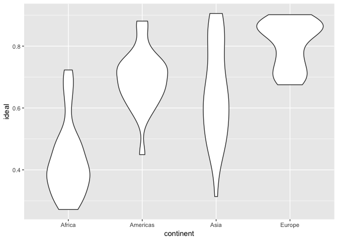
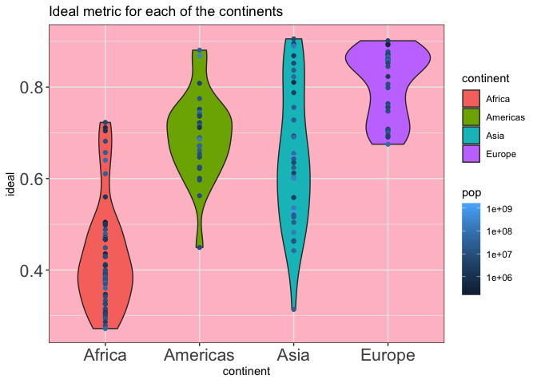

hw05-MaunishUBC
================

### Install necessary packages

``` r
library('gapminder')
library('kableExtra')
library('RColorBrewer')
library('plotly')
```

    ## Loading required package: ggplot2

    ## 
    ## Attaching package: 'plotly'

    ## The following object is masked from 'package:ggplot2':
    ## 
    ##     last_plot

    ## The following object is masked from 'package:stats':
    ## 
    ##     filter

    ## The following object is masked from 'package:graphics':
    ## 
    ##     layout

``` r
library('dplyr')
```

    ## 
    ## Attaching package: 'dplyr'

    ## The following objects are masked from 'package:stats':
    ## 
    ##     filter, lag

    ## The following objects are masked from 'package:base':
    ## 
    ##     intersect, setdiff, setequal, union

``` r
library('forcats')
library('readr')
```

### Factor management

What are the continent's in gapminder

``` r
unique(gapminder$continent)
```

    ## [1] Asia     Europe   Africa   Americas Oceania 
    ## Levels: Africa Americas Asia Europe Oceania

Oceania isn't a continent! Let's drop it!!

``` r
gapminder_no_oceania <- gapminder %>% 
  filter(continent != "Oceania")
```

Also let's see what countries are there in Oceania

``` r
gapminder %>% 
  filter(continent == "Oceania") %>% 
  kable() %>%
  kable_styling()
```

<table class="table" style="margin-left: auto; margin-right: auto;">
<thead>
<tr>
<th style="text-align:left;">
country
</th>
<th style="text-align:left;">
continent
</th>
<th style="text-align:right;">
year
</th>
<th style="text-align:right;">
lifeExp
</th>
<th style="text-align:right;">
pop
</th>
<th style="text-align:right;">
gdpPercap
</th>
</tr>
</thead>
<tbody>
<tr>
<td style="text-align:left;">
Australia
</td>
<td style="text-align:left;">
Oceania
</td>
<td style="text-align:right;">
1952
</td>
<td style="text-align:right;">
69.120
</td>
<td style="text-align:right;">
8691212
</td>
<td style="text-align:right;">
10039.60
</td>
</tr>
<tr>
<td style="text-align:left;">
Australia
</td>
<td style="text-align:left;">
Oceania
</td>
<td style="text-align:right;">
1957
</td>
<td style="text-align:right;">
70.330
</td>
<td style="text-align:right;">
9712569
</td>
<td style="text-align:right;">
10949.65
</td>
</tr>
<tr>
<td style="text-align:left;">
Australia
</td>
<td style="text-align:left;">
Oceania
</td>
<td style="text-align:right;">
1962
</td>
<td style="text-align:right;">
70.930
</td>
<td style="text-align:right;">
10794968
</td>
<td style="text-align:right;">
12217.23
</td>
</tr>
<tr>
<td style="text-align:left;">
Australia
</td>
<td style="text-align:left;">
Oceania
</td>
<td style="text-align:right;">
1967
</td>
<td style="text-align:right;">
71.100
</td>
<td style="text-align:right;">
11872264
</td>
<td style="text-align:right;">
14526.12
</td>
</tr>
<tr>
<td style="text-align:left;">
Australia
</td>
<td style="text-align:left;">
Oceania
</td>
<td style="text-align:right;">
1972
</td>
<td style="text-align:right;">
71.930
</td>
<td style="text-align:right;">
13177000
</td>
<td style="text-align:right;">
16788.63
</td>
</tr>
<tr>
<td style="text-align:left;">
Australia
</td>
<td style="text-align:left;">
Oceania
</td>
<td style="text-align:right;">
1977
</td>
<td style="text-align:right;">
73.490
</td>
<td style="text-align:right;">
14074100
</td>
<td style="text-align:right;">
18334.20
</td>
</tr>
<tr>
<td style="text-align:left;">
Australia
</td>
<td style="text-align:left;">
Oceania
</td>
<td style="text-align:right;">
1982
</td>
<td style="text-align:right;">
74.740
</td>
<td style="text-align:right;">
15184200
</td>
<td style="text-align:right;">
19477.01
</td>
</tr>
<tr>
<td style="text-align:left;">
Australia
</td>
<td style="text-align:left;">
Oceania
</td>
<td style="text-align:right;">
1987
</td>
<td style="text-align:right;">
76.320
</td>
<td style="text-align:right;">
16257249
</td>
<td style="text-align:right;">
21888.89
</td>
</tr>
<tr>
<td style="text-align:left;">
Australia
</td>
<td style="text-align:left;">
Oceania
</td>
<td style="text-align:right;">
1992
</td>
<td style="text-align:right;">
77.560
</td>
<td style="text-align:right;">
17481977
</td>
<td style="text-align:right;">
23424.77
</td>
</tr>
<tr>
<td style="text-align:left;">
Australia
</td>
<td style="text-align:left;">
Oceania
</td>
<td style="text-align:right;">
1997
</td>
<td style="text-align:right;">
78.830
</td>
<td style="text-align:right;">
18565243
</td>
<td style="text-align:right;">
26997.94
</td>
</tr>
<tr>
<td style="text-align:left;">
Australia
</td>
<td style="text-align:left;">
Oceania
</td>
<td style="text-align:right;">
2002
</td>
<td style="text-align:right;">
80.370
</td>
<td style="text-align:right;">
19546792
</td>
<td style="text-align:right;">
30687.75
</td>
</tr>
<tr>
<td style="text-align:left;">
Australia
</td>
<td style="text-align:left;">
Oceania
</td>
<td style="text-align:right;">
2007
</td>
<td style="text-align:right;">
81.235
</td>
<td style="text-align:right;">
20434176
</td>
<td style="text-align:right;">
34435.37
</td>
</tr>
<tr>
<td style="text-align:left;">
New Zealand
</td>
<td style="text-align:left;">
Oceania
</td>
<td style="text-align:right;">
1952
</td>
<td style="text-align:right;">
69.390
</td>
<td style="text-align:right;">
1994794
</td>
<td style="text-align:right;">
10556.58
</td>
</tr>
<tr>
<td style="text-align:left;">
New Zealand
</td>
<td style="text-align:left;">
Oceania
</td>
<td style="text-align:right;">
1957
</td>
<td style="text-align:right;">
70.260
</td>
<td style="text-align:right;">
2229407
</td>
<td style="text-align:right;">
12247.40
</td>
</tr>
<tr>
<td style="text-align:left;">
New Zealand
</td>
<td style="text-align:left;">
Oceania
</td>
<td style="text-align:right;">
1962
</td>
<td style="text-align:right;">
71.240
</td>
<td style="text-align:right;">
2488550
</td>
<td style="text-align:right;">
13175.68
</td>
</tr>
<tr>
<td style="text-align:left;">
New Zealand
</td>
<td style="text-align:left;">
Oceania
</td>
<td style="text-align:right;">
1967
</td>
<td style="text-align:right;">
71.520
</td>
<td style="text-align:right;">
2728150
</td>
<td style="text-align:right;">
14463.92
</td>
</tr>
<tr>
<td style="text-align:left;">
New Zealand
</td>
<td style="text-align:left;">
Oceania
</td>
<td style="text-align:right;">
1972
</td>
<td style="text-align:right;">
71.890
</td>
<td style="text-align:right;">
2929100
</td>
<td style="text-align:right;">
16046.04
</td>
</tr>
<tr>
<td style="text-align:left;">
New Zealand
</td>
<td style="text-align:left;">
Oceania
</td>
<td style="text-align:right;">
1977
</td>
<td style="text-align:right;">
72.220
</td>
<td style="text-align:right;">
3164900
</td>
<td style="text-align:right;">
16233.72
</td>
</tr>
<tr>
<td style="text-align:left;">
New Zealand
</td>
<td style="text-align:left;">
Oceania
</td>
<td style="text-align:right;">
1982
</td>
<td style="text-align:right;">
73.840
</td>
<td style="text-align:right;">
3210650
</td>
<td style="text-align:right;">
17632.41
</td>
</tr>
<tr>
<td style="text-align:left;">
New Zealand
</td>
<td style="text-align:left;">
Oceania
</td>
<td style="text-align:right;">
1987
</td>
<td style="text-align:right;">
74.320
</td>
<td style="text-align:right;">
3317166
</td>
<td style="text-align:right;">
19007.19
</td>
</tr>
<tr>
<td style="text-align:left;">
New Zealand
</td>
<td style="text-align:left;">
Oceania
</td>
<td style="text-align:right;">
1992
</td>
<td style="text-align:right;">
76.330
</td>
<td style="text-align:right;">
3437674
</td>
<td style="text-align:right;">
18363.32
</td>
</tr>
<tr>
<td style="text-align:left;">
New Zealand
</td>
<td style="text-align:left;">
Oceania
</td>
<td style="text-align:right;">
1997
</td>
<td style="text-align:right;">
77.550
</td>
<td style="text-align:right;">
3676187
</td>
<td style="text-align:right;">
21050.41
</td>
</tr>
<tr>
<td style="text-align:left;">
New Zealand
</td>
<td style="text-align:left;">
Oceania
</td>
<td style="text-align:right;">
2002
</td>
<td style="text-align:right;">
79.110
</td>
<td style="text-align:right;">
3908037
</td>
<td style="text-align:right;">
23189.80
</td>
</tr>
<tr>
<td style="text-align:left;">
New Zealand
</td>
<td style="text-align:left;">
Oceania
</td>
<td style="text-align:right;">
2007
</td>
<td style="text-align:right;">
80.204
</td>
<td style="text-align:right;">
4115771
</td>
<td style="text-align:right;">
25185.01
</td>
</tr>
</tbody>
</table>
So, Oceania has two countries, Australia and New Zealand.

``` r
gapminder %>% 
  str()
```

    ## Classes 'tbl_df', 'tbl' and 'data.frame':    1704 obs. of  6 variables:
    ##  $ country  : Factor w/ 142 levels "Afghanistan",..: 1 1 1 1 1 1 1 1 1 1 ...
    ##  $ continent: Factor w/ 5 levels "Africa","Americas",..: 3 3 3 3 3 3 3 3 3 3 ...
    ##  $ year     : int  1952 1957 1962 1967 1972 1977 1982 1987 1992 1997 ...
    ##  $ lifeExp  : num  28.8 30.3 32 34 36.1 ...
    ##  $ pop      : int  8425333 9240934 10267083 11537966 13079460 14880372 12881816 13867957 16317921 22227415 ...
    ##  $ gdpPercap: num  779 821 853 836 740 ...

So, gapminder has 142 levels for countires and 5 levels for continent

Let's see what happens after removing Oceania

``` r
gapminder_no_oceania <- gapminder_no_oceania %>% 
  droplevels()

gapminder_no_oceania %>% 
  str()
```

    ## Classes 'tbl_df', 'tbl' and 'data.frame':    1680 obs. of  6 variables:
    ##  $ country  : Factor w/ 140 levels "Afghanistan",..: 1 1 1 1 1 1 1 1 1 1 ...
    ##  $ continent: Factor w/ 4 levels "Africa","Americas",..: 3 3 3 3 3 3 3 3 3 3 ...
    ##  $ year     : int  1952 1957 1962 1967 1972 1977 1982 1987 1992 1997 ...
    ##  $ lifeExp  : num  28.8 30.3 32 34 36.1 ...
    ##  $ pop      : int  8425333 9240934 10267083 11537966 13079460 14880372 12881816 13867957 16317921 22227415 ...
    ##  $ gdpPercap: num  779 821 853 836 740 ...

There are 140 countries and 4 continents.

The 4 continents make sense but why 140 countries? Where did 2 countries go?

Let's look at the differnce between gapminder\_no\_oceania and gapminder:

``` r
anti_join(gapminder, gapminder_no_oceania, by = "country") %>% 
  kable() %>% 
  kable_styling()
```

    ## Warning: Column `country` joining factors with different levels, coercing
    ## to character vector

<table class="table" style="margin-left: auto; margin-right: auto;">
<thead>
<tr>
<th style="text-align:left;">
country
</th>
<th style="text-align:left;">
continent
</th>
<th style="text-align:right;">
year
</th>
<th style="text-align:right;">
lifeExp
</th>
<th style="text-align:right;">
pop
</th>
<th style="text-align:right;">
gdpPercap
</th>
</tr>
</thead>
<tbody>
<tr>
<td style="text-align:left;">
Australia
</td>
<td style="text-align:left;">
Oceania
</td>
<td style="text-align:right;">
1952
</td>
<td style="text-align:right;">
69.120
</td>
<td style="text-align:right;">
8691212
</td>
<td style="text-align:right;">
10039.60
</td>
</tr>
<tr>
<td style="text-align:left;">
Australia
</td>
<td style="text-align:left;">
Oceania
</td>
<td style="text-align:right;">
1957
</td>
<td style="text-align:right;">
70.330
</td>
<td style="text-align:right;">
9712569
</td>
<td style="text-align:right;">
10949.65
</td>
</tr>
<tr>
<td style="text-align:left;">
Australia
</td>
<td style="text-align:left;">
Oceania
</td>
<td style="text-align:right;">
1962
</td>
<td style="text-align:right;">
70.930
</td>
<td style="text-align:right;">
10794968
</td>
<td style="text-align:right;">
12217.23
</td>
</tr>
<tr>
<td style="text-align:left;">
Australia
</td>
<td style="text-align:left;">
Oceania
</td>
<td style="text-align:right;">
1967
</td>
<td style="text-align:right;">
71.100
</td>
<td style="text-align:right;">
11872264
</td>
<td style="text-align:right;">
14526.12
</td>
</tr>
<tr>
<td style="text-align:left;">
Australia
</td>
<td style="text-align:left;">
Oceania
</td>
<td style="text-align:right;">
1972
</td>
<td style="text-align:right;">
71.930
</td>
<td style="text-align:right;">
13177000
</td>
<td style="text-align:right;">
16788.63
</td>
</tr>
<tr>
<td style="text-align:left;">
Australia
</td>
<td style="text-align:left;">
Oceania
</td>
<td style="text-align:right;">
1977
</td>
<td style="text-align:right;">
73.490
</td>
<td style="text-align:right;">
14074100
</td>
<td style="text-align:right;">
18334.20
</td>
</tr>
<tr>
<td style="text-align:left;">
Australia
</td>
<td style="text-align:left;">
Oceania
</td>
<td style="text-align:right;">
1982
</td>
<td style="text-align:right;">
74.740
</td>
<td style="text-align:right;">
15184200
</td>
<td style="text-align:right;">
19477.01
</td>
</tr>
<tr>
<td style="text-align:left;">
Australia
</td>
<td style="text-align:left;">
Oceania
</td>
<td style="text-align:right;">
1987
</td>
<td style="text-align:right;">
76.320
</td>
<td style="text-align:right;">
16257249
</td>
<td style="text-align:right;">
21888.89
</td>
</tr>
<tr>
<td style="text-align:left;">
Australia
</td>
<td style="text-align:left;">
Oceania
</td>
<td style="text-align:right;">
1992
</td>
<td style="text-align:right;">
77.560
</td>
<td style="text-align:right;">
17481977
</td>
<td style="text-align:right;">
23424.77
</td>
</tr>
<tr>
<td style="text-align:left;">
Australia
</td>
<td style="text-align:left;">
Oceania
</td>
<td style="text-align:right;">
1997
</td>
<td style="text-align:right;">
78.830
</td>
<td style="text-align:right;">
18565243
</td>
<td style="text-align:right;">
26997.94
</td>
</tr>
<tr>
<td style="text-align:left;">
Australia
</td>
<td style="text-align:left;">
Oceania
</td>
<td style="text-align:right;">
2002
</td>
<td style="text-align:right;">
80.370
</td>
<td style="text-align:right;">
19546792
</td>
<td style="text-align:right;">
30687.75
</td>
</tr>
<tr>
<td style="text-align:left;">
Australia
</td>
<td style="text-align:left;">
Oceania
</td>
<td style="text-align:right;">
2007
</td>
<td style="text-align:right;">
81.235
</td>
<td style="text-align:right;">
20434176
</td>
<td style="text-align:right;">
34435.37
</td>
</tr>
<tr>
<td style="text-align:left;">
New Zealand
</td>
<td style="text-align:left;">
Oceania
</td>
<td style="text-align:right;">
1952
</td>
<td style="text-align:right;">
69.390
</td>
<td style="text-align:right;">
1994794
</td>
<td style="text-align:right;">
10556.58
</td>
</tr>
<tr>
<td style="text-align:left;">
New Zealand
</td>
<td style="text-align:left;">
Oceania
</td>
<td style="text-align:right;">
1957
</td>
<td style="text-align:right;">
70.260
</td>
<td style="text-align:right;">
2229407
</td>
<td style="text-align:right;">
12247.40
</td>
</tr>
<tr>
<td style="text-align:left;">
New Zealand
</td>
<td style="text-align:left;">
Oceania
</td>
<td style="text-align:right;">
1962
</td>
<td style="text-align:right;">
71.240
</td>
<td style="text-align:right;">
2488550
</td>
<td style="text-align:right;">
13175.68
</td>
</tr>
<tr>
<td style="text-align:left;">
New Zealand
</td>
<td style="text-align:left;">
Oceania
</td>
<td style="text-align:right;">
1967
</td>
<td style="text-align:right;">
71.520
</td>
<td style="text-align:right;">
2728150
</td>
<td style="text-align:right;">
14463.92
</td>
</tr>
<tr>
<td style="text-align:left;">
New Zealand
</td>
<td style="text-align:left;">
Oceania
</td>
<td style="text-align:right;">
1972
</td>
<td style="text-align:right;">
71.890
</td>
<td style="text-align:right;">
2929100
</td>
<td style="text-align:right;">
16046.04
</td>
</tr>
<tr>
<td style="text-align:left;">
New Zealand
</td>
<td style="text-align:left;">
Oceania
</td>
<td style="text-align:right;">
1977
</td>
<td style="text-align:right;">
72.220
</td>
<td style="text-align:right;">
3164900
</td>
<td style="text-align:right;">
16233.72
</td>
</tr>
<tr>
<td style="text-align:left;">
New Zealand
</td>
<td style="text-align:left;">
Oceania
</td>
<td style="text-align:right;">
1982
</td>
<td style="text-align:right;">
73.840
</td>
<td style="text-align:right;">
3210650
</td>
<td style="text-align:right;">
17632.41
</td>
</tr>
<tr>
<td style="text-align:left;">
New Zealand
</td>
<td style="text-align:left;">
Oceania
</td>
<td style="text-align:right;">
1987
</td>
<td style="text-align:right;">
74.320
</td>
<td style="text-align:right;">
3317166
</td>
<td style="text-align:right;">
19007.19
</td>
</tr>
<tr>
<td style="text-align:left;">
New Zealand
</td>
<td style="text-align:left;">
Oceania
</td>
<td style="text-align:right;">
1992
</td>
<td style="text-align:right;">
76.330
</td>
<td style="text-align:right;">
3437674
</td>
<td style="text-align:right;">
18363.32
</td>
</tr>
<tr>
<td style="text-align:left;">
New Zealand
</td>
<td style="text-align:left;">
Oceania
</td>
<td style="text-align:right;">
1997
</td>
<td style="text-align:right;">
77.550
</td>
<td style="text-align:right;">
3676187
</td>
<td style="text-align:right;">
21050.41
</td>
</tr>
<tr>
<td style="text-align:left;">
New Zealand
</td>
<td style="text-align:left;">
Oceania
</td>
<td style="text-align:right;">
2002
</td>
<td style="text-align:right;">
79.110
</td>
<td style="text-align:right;">
3908037
</td>
<td style="text-align:right;">
23189.80
</td>
</tr>
<tr>
<td style="text-align:left;">
New Zealand
</td>
<td style="text-align:left;">
Oceania
</td>
<td style="text-align:right;">
2007
</td>
<td style="text-align:right;">
80.204
</td>
<td style="text-align:right;">
4115771
</td>
<td style="text-align:right;">
25185.01
</td>
</tr>
</tbody>
</table>
So, I'd like to reorder the countries in gapminder\_no\_oceania based on a modified metric which includes lifeeExp and gdpPercap

So, *ideal* will be the new varialbe = lifeExp/max(lifeExp)\*log(gdpPercap)/max(log(gdpPercap))

``` r
gapminder_ideal <- gapminder_no_oceania %>% 
  mutate(ideal = lifeExp/max(lifeExp)*log(gdpPercap)/max(log(gdpPercap))) %>% 
  arrange(desc(ideal))

gapminder_ideal %>% 
  kable() %>% 
  kable_styling()
```

<table class="table" style="margin-left: auto; margin-right: auto;">
<thead>
<tr>
<th style="text-align:left;">
country
</th>
<th style="text-align:left;">
continent
</th>
<th style="text-align:right;">
year
</th>
<th style="text-align:right;">
lifeExp
</th>
<th style="text-align:right;">
pop
</th>
<th style="text-align:right;">
gdpPercap
</th>
<th style="text-align:right;">
ideal
</th>
</tr>
</thead>
<tbody>
<tr>
<td style="text-align:left;">
Hong Kong, China
</td>
<td style="text-align:left;">
Asia
</td>
<td style="text-align:right;">
2007
</td>
<td style="text-align:right;">
82.20800
</td>
<td style="text-align:right;">
6980412
</td>
<td style="text-align:right;">
39724.9787
</td>
<td style="text-align:right;">
0.9054392
</td>
</tr>
<tr>
<td style="text-align:left;">
Norway
</td>
<td style="text-align:left;">
Europe
</td>
<td style="text-align:right;">
2007
</td>
<td style="text-align:right;">
80.19600
</td>
<td style="text-align:right;">
4627926
</td>
<td style="text-align:right;">
49357.1902
</td>
<td style="text-align:right;">
0.9013874
</td>
</tr>
<tr>
<td style="text-align:left;">
Singapore
</td>
<td style="text-align:left;">
Asia
</td>
<td style="text-align:right;">
2007
</td>
<td style="text-align:right;">
79.97200
</td>
<td style="text-align:right;">
4553009
</td>
<td style="text-align:right;">
47143.1796
</td>
<td style="text-align:right;">
0.8950523
</td>
</tr>
<tr>
<td style="text-align:left;">
Switzerland
</td>
<td style="text-align:left;">
Europe
</td>
<td style="text-align:right;">
2007
</td>
<td style="text-align:right;">
81.70100
</td>
<td style="text-align:right;">
7554661
</td>
<td style="text-align:right;">
37506.4191
</td>
<td style="text-align:right;">
0.8949718
</td>
</tr>
<tr>
<td style="text-align:left;">
Iceland
</td>
<td style="text-align:left;">
Europe
</td>
<td style="text-align:right;">
2007
</td>
<td style="text-align:right;">
81.75700
</td>
<td style="text-align:right;">
301931
</td>
<td style="text-align:right;">
36180.7892
</td>
<td style="text-align:right;">
0.8925254
</td>
</tr>
<tr>
<td style="text-align:left;">
Japan
</td>
<td style="text-align:left;">
Asia
</td>
<td style="text-align:right;">
2007
</td>
<td style="text-align:right;">
82.60300
</td>
<td style="text-align:right;">
127467972
</td>
<td style="text-align:right;">
31656.0681
</td>
<td style="text-align:right;">
0.8902833
</td>
</tr>
<tr>
<td style="text-align:left;">
Canada
</td>
<td style="text-align:left;">
Americas
</td>
<td style="text-align:right;">
2007
</td>
<td style="text-align:right;">
80.65300
</td>
<td style="text-align:right;">
33390141
</td>
<td style="text-align:right;">
36319.2350
</td>
<td style="text-align:right;">
0.8807936
</td>
</tr>
<tr>
<td style="text-align:left;">
Norway
</td>
<td style="text-align:left;">
Europe
</td>
<td style="text-align:right;">
2002
</td>
<td style="text-align:right;">
79.05000
</td>
<td style="text-align:right;">
4535591
</td>
<td style="text-align:right;">
44683.9753
</td>
<td style="text-align:right;">
0.8803285
</td>
</tr>
<tr>
<td style="text-align:left;">
Sweden
</td>
<td style="text-align:left;">
Europe
</td>
<td style="text-align:right;">
2007
</td>
<td style="text-align:right;">
80.88400
</td>
<td style="text-align:right;">
9031088
</td>
<td style="text-align:right;">
33859.7484
</td>
<td style="text-align:right;">
0.8774175
</td>
</tr>
<tr>
<td style="text-align:left;">
Switzerland
</td>
<td style="text-align:left;">
Europe
</td>
<td style="text-align:right;">
2002
</td>
<td style="text-align:right;">
80.62000
</td>
<td style="text-align:right;">
7361757
</td>
<td style="text-align:right;">
34480.9577
</td>
<td style="text-align:right;">
0.8760780
</td>
</tr>
<tr>
<td style="text-align:left;">
Japan
</td>
<td style="text-align:left;">
Asia
</td>
<td style="text-align:right;">
2002
</td>
<td style="text-align:right;">
82.00000
</td>
<td style="text-align:right;">
127065841
</td>
<td style="text-align:right;">
28604.5919
</td>
<td style="text-align:right;">
0.8751395
</td>
</tr>
<tr>
<td style="text-align:left;">
Hong Kong, China
</td>
<td style="text-align:left;">
Asia
</td>
<td style="text-align:right;">
2002
</td>
<td style="text-align:right;">
81.49500
</td>
<td style="text-align:right;">
6762476
</td>
<td style="text-align:right;">
30209.0152
</td>
<td style="text-align:right;">
0.8743755
</td>
</tr>
<tr>
<td style="text-align:left;">
Netherlands
</td>
<td style="text-align:left;">
Europe
</td>
<td style="text-align:right;">
2007
</td>
<td style="text-align:right;">
79.76200
</td>
<td style="text-align:right;">
16570613
</td>
<td style="text-align:right;">
36797.9333
</td>
<td style="text-align:right;">
0.8721495
</td>
</tr>
<tr>
<td style="text-align:left;">
Austria
</td>
<td style="text-align:left;">
Europe
</td>
<td style="text-align:right;">
2007
</td>
<td style="text-align:right;">
79.82900
</td>
<td style="text-align:right;">
8199783
</td>
<td style="text-align:right;">
36126.4927
</td>
<td style="text-align:right;">
0.8713531
</td>
</tr>
<tr>
<td style="text-align:left;">
Ireland
</td>
<td style="text-align:left;">
Europe
</td>
<td style="text-align:right;">
2007
</td>
<td style="text-align:right;">
78.88500
</td>
<td style="text-align:right;">
4109086
</td>
<td style="text-align:right;">
40675.9964
</td>
<td style="text-align:right;">
0.8707807
</td>
</tr>
<tr>
<td style="text-align:left;">
Kuwait
</td>
<td style="text-align:left;">
Asia
</td>
<td style="text-align:right;">
2007
</td>
<td style="text-align:right;">
77.58800
</td>
<td style="text-align:right;">
2505559
</td>
<td style="text-align:right;">
47306.9898
</td>
<td style="text-align:right;">
0.8686504
</td>
</tr>
<tr>
<td style="text-align:left;">
United States
</td>
<td style="text-align:left;">
Americas
</td>
<td style="text-align:right;">
2007
</td>
<td style="text-align:right;">
78.24200
</td>
<td style="text-align:right;">
301139947
</td>
<td style="text-align:right;">
42951.6531
</td>
<td style="text-align:right;">
0.8681127
</td>
</tr>
<tr>
<td style="text-align:left;">
Iceland
</td>
<td style="text-align:left;">
Europe
</td>
<td style="text-align:right;">
2002
</td>
<td style="text-align:right;">
80.50000
</td>
<td style="text-align:right;">
288030
</td>
<td style="text-align:right;">
31163.2020
</td>
<td style="text-align:right;">
0.8663036
</td>
</tr>
<tr>
<td style="text-align:left;">
France
</td>
<td style="text-align:left;">
Europe
</td>
<td style="text-align:right;">
2007
</td>
<td style="text-align:right;">
80.65700
</td>
<td style="text-align:right;">
61083916
</td>
<td style="text-align:right;">
30470.0167
</td>
<td style="text-align:right;">
0.8661061
</td>
</tr>
<tr>
<td style="text-align:left;">
Norway
</td>
<td style="text-align:left;">
Europe
</td>
<td style="text-align:right;">
1997
</td>
<td style="text-align:right;">
78.32000
</td>
<td style="text-align:right;">
4405672
</td>
<td style="text-align:right;">
41283.1643
</td>
<td style="text-align:right;">
0.8657508
</td>
</tr>
<tr>
<td style="text-align:left;">
Spain
</td>
<td style="text-align:left;">
Europe
</td>
<td style="text-align:right;">
2007
</td>
<td style="text-align:right;">
80.94100
</td>
<td style="text-align:right;">
40448191
</td>
<td style="text-align:right;">
28821.0637
</td>
<td style="text-align:right;">
0.8644721
</td>
</tr>
<tr>
<td style="text-align:left;">
Canada
</td>
<td style="text-align:left;">
Americas
</td>
<td style="text-align:right;">
2002
</td>
<td style="text-align:right;">
79.77000
</td>
<td style="text-align:right;">
31902268
</td>
<td style="text-align:right;">
33328.9651
</td>
<td style="text-align:right;">
0.8640221
</td>
</tr>
<tr>
<td style="text-align:left;">
Japan
</td>
<td style="text-align:left;">
Asia
</td>
<td style="text-align:right;">
1997
</td>
<td style="text-align:right;">
80.69000
</td>
<td style="text-align:right;">
125956499
</td>
<td style="text-align:right;">
28816.5850
</td>
<td style="text-align:right;">
0.8617783
</td>
</tr>
<tr>
<td style="text-align:left;">
Belgium
</td>
<td style="text-align:left;">
Europe
</td>
<td style="text-align:right;">
2007
</td>
<td style="text-align:right;">
79.44100
</td>
<td style="text-align:right;">
10392226
</td>
<td style="text-align:right;">
33692.6051
</td>
<td style="text-align:right;">
0.8613551
</td>
</tr>
<tr>
<td style="text-align:left;">
United Kingdom
</td>
<td style="text-align:left;">
Europe
</td>
<td style="text-align:right;">
2007
</td>
<td style="text-align:right;">
79.42500
</td>
<td style="text-align:right;">
60776238
</td>
<td style="text-align:right;">
33203.2613
</td>
<td style="text-align:right;">
0.8599731
</td>
</tr>
<tr>
<td style="text-align:left;">
Singapore
</td>
<td style="text-align:left;">
Asia
</td>
<td style="text-align:right;">
2002
</td>
<td style="text-align:right;">
78.77000
</td>
<td style="text-align:right;">
4197776
</td>
<td style="text-align:right;">
36023.1054
</td>
<td style="text-align:right;">
0.8595591
</td>
</tr>
<tr>
<td style="text-align:left;">
Italy
</td>
<td style="text-align:left;">
Europe
</td>
<td style="text-align:right;">
2007
</td>
<td style="text-align:right;">
80.54600
</td>
<td style="text-align:right;">
58147733
</td>
<td style="text-align:right;">
28569.7197
</td>
<td style="text-align:right;">
0.8595196
</td>
</tr>
<tr>
<td style="text-align:left;">
Finland
</td>
<td style="text-align:left;">
Europe
</td>
<td style="text-align:right;">
2007
</td>
<td style="text-align:right;">
79.31300
</td>
<td style="text-align:right;">
5238460
</td>
<td style="text-align:right;">
33207.0844
</td>
<td style="text-align:right;">
0.8587699
</td>
</tr>
<tr>
<td style="text-align:left;">
Germany
</td>
<td style="text-align:left;">
Europe
</td>
<td style="text-align:right;">
2007
</td>
<td style="text-align:right;">
79.40600
</td>
<td style="text-align:right;">
82400996
</td>
<td style="text-align:right;">
32170.3744
</td>
<td style="text-align:right;">
0.8571574
</td>
</tr>
<tr>
<td style="text-align:left;">
Switzerland
</td>
<td style="text-align:left;">
Europe
</td>
<td style="text-align:right;">
1997
</td>
<td style="text-align:right;">
79.37000
</td>
<td style="text-align:right;">
7193761
</td>
<td style="text-align:right;">
32135.3230
</td>
<td style="text-align:right;">
0.8566788
</td>
</tr>
<tr>
<td style="text-align:left;">
Sweden
</td>
<td style="text-align:left;">
Europe
</td>
<td style="text-align:right;">
2002
</td>
<td style="text-align:right;">
80.04000
</td>
<td style="text-align:right;">
8954175
</td>
<td style="text-align:right;">
29341.6309
</td>
<td style="text-align:right;">
0.8563393
</td>
</tr>
<tr>
<td style="text-align:left;">
Italy
</td>
<td style="text-align:left;">
Europe
</td>
<td style="text-align:right;">
2002
</td>
<td style="text-align:right;">
80.24000
</td>
<td style="text-align:right;">
57926999
</td>
<td style="text-align:right;">
27968.0982
</td>
<td style="text-align:right;">
0.8544780
</td>
</tr>
<tr>
<td style="text-align:left;">
Austria
</td>
<td style="text-align:left;">
Europe
</td>
<td style="text-align:right;">
2002
</td>
<td style="text-align:right;">
78.98000
</td>
<td style="text-align:right;">
8148312
</td>
<td style="text-align:right;">
32417.6077
</td>
<td style="text-align:right;">
0.8531878
</td>
</tr>
<tr>
<td style="text-align:left;">
Hong Kong, China
</td>
<td style="text-align:left;">
Asia
</td>
<td style="text-align:right;">
1997
</td>
<td style="text-align:right;">
80.00000
</td>
<td style="text-align:right;">
6495918
</td>
<td style="text-align:right;">
28377.6322
</td>
<td style="text-align:right;">
0.8531318
</td>
</tr>
<tr>
<td style="text-align:left;">
Denmark
</td>
<td style="text-align:left;">
Europe
</td>
<td style="text-align:right;">
2007
</td>
<td style="text-align:right;">
78.33200
</td>
<td style="text-align:right;">
5468120
</td>
<td style="text-align:right;">
35278.4187
</td>
<td style="text-align:right;">
0.8530777
</td>
</tr>
<tr>
<td style="text-align:left;">
Israel
</td>
<td style="text-align:left;">
Asia
</td>
<td style="text-align:right;">
2007
</td>
<td style="text-align:right;">
80.74500
</td>
<td style="text-align:right;">
6426679
</td>
<td style="text-align:right;">
25523.2771
</td>
<td style="text-align:right;">
0.8521738
</td>
</tr>
<tr>
<td style="text-align:left;">
Netherlands
</td>
<td style="text-align:left;">
Europe
</td>
<td style="text-align:right;">
2002
</td>
<td style="text-align:right;">
78.53000
</td>
<td style="text-align:right;">
16122830
</td>
<td style="text-align:right;">
33724.7578
</td>
<td style="text-align:right;">
0.8515553
</td>
</tr>
<tr>
<td style="text-align:left;">
France
</td>
<td style="text-align:left;">
Europe
</td>
<td style="text-align:right;">
2002
</td>
<td style="text-align:right;">
79.59000
</td>
<td style="text-align:right;">
59925035
</td>
<td style="text-align:right;">
28926.0323
</td>
<td style="text-align:right;">
0.8503439
</td>
</tr>
<tr>
<td style="text-align:left;">
United States
</td>
<td style="text-align:left;">
Americas
</td>
<td style="text-align:right;">
2002
</td>
<td style="text-align:right;">
77.31000
</td>
<td style="text-align:right;">
287675526
</td>
<td style="text-align:right;">
39097.0995
</td>
<td style="text-align:right;">
0.8502115
</td>
</tr>
<tr>
<td style="text-align:left;">
Greece
</td>
<td style="text-align:left;">
Europe
</td>
<td style="text-align:right;">
2007
</td>
<td style="text-align:right;">
79.48300
</td>
<td style="text-align:right;">
10706290
</td>
<td style="text-align:right;">
27538.4119
</td>
<td style="text-align:right;">
0.8451368
</td>
</tr>
<tr>
<td style="text-align:left;">
Ireland
</td>
<td style="text-align:left;">
Europe
</td>
<td style="text-align:right;">
2002
</td>
<td style="text-align:right;">
77.78300
</td>
<td style="text-align:right;">
3879155
</td>
<td style="text-align:right;">
34077.0494
</td>
<td style="text-align:right;">
0.8442958
</td>
</tr>
<tr>
<td style="text-align:left;">
Germany
</td>
<td style="text-align:left;">
Europe
</td>
<td style="text-align:right;">
2002
</td>
<td style="text-align:right;">
78.67000
</td>
<td style="text-align:right;">
82350671
</td>
<td style="text-align:right;">
30035.8020
</td>
<td style="text-align:right;">
0.8435950
</td>
</tr>
<tr>
<td style="text-align:left;">
Japan
</td>
<td style="text-align:left;">
Asia
</td>
<td style="text-align:right;">
1992
</td>
<td style="text-align:right;">
79.36000
</td>
<td style="text-align:right;">
124329269
</td>
<td style="text-align:right;">
26824.8951
</td>
<td style="text-align:right;">
0.8416622
</td>
</tr>
<tr>
<td style="text-align:left;">
Switzerland
</td>
<td style="text-align:left;">
Europe
</td>
<td style="text-align:right;">
1992
</td>
<td style="text-align:right;">
78.03000
</td>
<td style="text-align:right;">
6995447
</td>
<td style="text-align:right;">
31871.5303
</td>
<td style="text-align:right;">
0.8415466
</td>
</tr>
<tr>
<td style="text-align:left;">
Belgium
</td>
<td style="text-align:left;">
Europe
</td>
<td style="text-align:right;">
2002
</td>
<td style="text-align:right;">
78.32000
</td>
<td style="text-align:right;">
10311970
</td>
<td style="text-align:right;">
30485.8838
</td>
<td style="text-align:right;">
0.8410535
</td>
</tr>
<tr>
<td style="text-align:left;">
Iceland
</td>
<td style="text-align:left;">
Europe
</td>
<td style="text-align:right;">
1997
</td>
<td style="text-align:right;">
78.95000
</td>
<td style="text-align:right;">
271192
</td>
<td style="text-align:right;">
28061.0997
</td>
<td style="text-align:right;">
0.8410134
</td>
</tr>
<tr>
<td style="text-align:left;">
Canada
</td>
<td style="text-align:left;">
Americas
</td>
<td style="text-align:right;">
1997
</td>
<td style="text-align:right;">
78.61000
</td>
<td style="text-align:right;">
30305843
</td>
<td style="text-align:right;">
28954.9259
</td>
<td style="text-align:right;">
0.8399552
</td>
</tr>
<tr>
<td style="text-align:left;">
United Kingdom
</td>
<td style="text-align:left;">
Europe
</td>
<td style="text-align:right;">
2002
</td>
<td style="text-align:right;">
78.47100
</td>
<td style="text-align:right;">
59912431
</td>
<td style="text-align:right;">
29478.9992
</td>
<td style="text-align:right;">
0.8399340
</td>
</tr>
<tr>
<td style="text-align:left;">
Kuwait
</td>
<td style="text-align:left;">
Asia
</td>
<td style="text-align:right;">
1997
</td>
<td style="text-align:right;">
76.15600
</td>
<td style="text-align:right;">
1765345
</td>
<td style="text-align:right;">
40300.6200
</td>
<td style="text-align:right;">
0.8399219
</td>
</tr>
<tr>
<td style="text-align:left;">
Spain
</td>
<td style="text-align:left;">
Europe
</td>
<td style="text-align:right;">
2002
</td>
<td style="text-align:right;">
79.78000
</td>
<td style="text-align:right;">
40152517
</td>
<td style="text-align:right;">
24835.4717
</td>
<td style="text-align:right;">
0.8397226
</td>
</tr>
<tr>
<td style="text-align:left;">
Norway
</td>
<td style="text-align:left;">
Europe
</td>
<td style="text-align:right;">
1992
</td>
<td style="text-align:right;">
77.32000
</td>
<td style="text-align:right;">
4286357
</td>
<td style="text-align:right;">
33965.6611
</td>
<td style="text-align:right;">
0.8390069
</td>
</tr>
<tr>
<td style="text-align:left;">
United States
</td>
<td style="text-align:left;">
Americas
</td>
<td style="text-align:right;">
1997
</td>
<td style="text-align:right;">
76.81000
</td>
<td style="text-align:right;">
272911760
</td>
<td style="text-align:right;">
35767.4330
</td>
<td style="text-align:right;">
0.8376020
</td>
</tr>
<tr>
<td style="text-align:left;">
Netherlands
</td>
<td style="text-align:left;">
Europe
</td>
<td style="text-align:right;">
1997
</td>
<td style="text-align:right;">
78.03000
</td>
<td style="text-align:right;">
15604464
</td>
<td style="text-align:right;">
30246.1306
</td>
<td style="text-align:right;">
0.8372985
</td>
</tr>
<tr>
<td style="text-align:left;">
Kuwait
</td>
<td style="text-align:left;">
Asia
</td>
<td style="text-align:right;">
2002
</td>
<td style="text-align:right;">
76.90400
</td>
<td style="text-align:right;">
2111561
</td>
<td style="text-align:right;">
35110.1057
</td>
<td style="text-align:right;">
0.8371434
</td>
</tr>
<tr>
<td style="text-align:left;">
Taiwan
</td>
<td style="text-align:left;">
Asia
</td>
<td style="text-align:right;">
2007
</td>
<td style="text-align:right;">
78.40000
</td>
<td style="text-align:right;">
23174294
</td>
<td style="text-align:right;">
28718.2768
</td>
<td style="text-align:right;">
0.8370421
</td>
</tr>
<tr>
<td style="text-align:left;">
Sweden
</td>
<td style="text-align:left;">
Europe
</td>
<td style="text-align:right;">
1997
</td>
<td style="text-align:right;">
79.39000
</td>
<td style="text-align:right;">
8897619
</td>
<td style="text-align:right;">
25266.5950
</td>
<td style="text-align:right;">
0.8370387
</td>
</tr>
<tr>
<td style="text-align:left;">
Singapore
</td>
<td style="text-align:left;">
Asia
</td>
<td style="text-align:right;">
1997
</td>
<td style="text-align:right;">
77.15800
</td>
<td style="text-align:right;">
3802309
</td>
<td style="text-align:right;">
33519.4766
</td>
<td style="text-align:right;">
0.8361878
</td>
</tr>
<tr>
<td style="text-align:left;">
Finland
</td>
<td style="text-align:left;">
Europe
</td>
<td style="text-align:right;">
2002
</td>
<td style="text-align:right;">
78.37000
</td>
<td style="text-align:right;">
5193039
</td>
<td style="text-align:right;">
28204.5906
</td>
<td style="text-align:right;">
0.8352507
</td>
</tr>
<tr>
<td style="text-align:left;">
Denmark
</td>
<td style="text-align:left;">
Europe
</td>
<td style="text-align:right;">
2002
</td>
<td style="text-align:right;">
77.18000
</td>
<td style="text-align:right;">
5374693
</td>
<td style="text-align:right;">
32166.5001
</td>
<td style="text-align:right;">
0.8331189
</td>
</tr>
<tr>
<td style="text-align:left;">
France
</td>
<td style="text-align:left;">
Europe
</td>
<td style="text-align:right;">
1997
</td>
<td style="text-align:right;">
78.64000
</td>
<td style="text-align:right;">
58623428
</td>
<td style="text-align:right;">
25889.7849
</td>
<td style="text-align:right;">
0.8311240
</td>
</tr>
<tr>
<td style="text-align:left;">
Switzerland
</td>
<td style="text-align:left;">
Europe
</td>
<td style="text-align:right;">
1987
</td>
<td style="text-align:right;">
77.41000
</td>
<td style="text-align:right;">
6649942
</td>
<td style="text-align:right;">
30281.7046
</td>
<td style="text-align:right;">
0.8307403
</td>
</tr>
<tr>
<td style="text-align:left;">
Iceland
</td>
<td style="text-align:left;">
Europe
</td>
<td style="text-align:right;">
1992
</td>
<td style="text-align:right;">
78.77000
</td>
<td style="text-align:right;">
259012
</td>
<td style="text-align:right;">
25144.3920
</td>
<td style="text-align:right;">
0.8301046
</td>
</tr>
<tr>
<td style="text-align:left;">
Italy
</td>
<td style="text-align:left;">
Europe
</td>
<td style="text-align:right;">
1997
</td>
<td style="text-align:right;">
78.82000
</td>
<td style="text-align:right;">
57479469
</td>
<td style="text-align:right;">
24675.0245
</td>
<td style="text-align:right;">
0.8290868
</td>
</tr>
<tr>
<td style="text-align:left;">
Austria
</td>
<td style="text-align:left;">
Europe
</td>
<td style="text-align:right;">
1997
</td>
<td style="text-align:right;">
77.51000
</td>
<td style="text-align:right;">
8069876
</td>
<td style="text-align:right;">
29095.9207
</td>
<td style="text-align:right;">
0.8285932
</td>
</tr>
<tr>
<td style="text-align:left;">
Israel
</td>
<td style="text-align:left;">
Asia
</td>
<td style="text-align:right;">
2002
</td>
<td style="text-align:right;">
79.69600
</td>
<td style="text-align:right;">
6029529
</td>
<td style="text-align:right;">
21905.5951
</td>
<td style="text-align:right;">
0.8284333
</td>
</tr>
<tr>
<td style="text-align:left;">
Canada
</td>
<td style="text-align:left;">
Americas
</td>
<td style="text-align:right;">
1992
</td>
<td style="text-align:right;">
77.95000
</td>
<td style="text-align:right;">
28523502
</td>
<td style="text-align:right;">
26342.8843
</td>
<td style="text-align:right;">
0.8252382
</td>
</tr>
<tr>
<td style="text-align:left;">
Belgium
</td>
<td style="text-align:left;">
Europe
</td>
<td style="text-align:right;">
1997
</td>
<td style="text-align:right;">
77.53000
</td>
<td style="text-align:right;">
10199787
</td>
<td style="text-align:right;">
27561.1966
</td>
<td style="text-align:right;">
0.8244374
</td>
</tr>
<tr>
<td style="text-align:left;">
Slovenia
</td>
<td style="text-align:left;">
Europe
</td>
<td style="text-align:right;">
2007
</td>
<td style="text-align:right;">
77.92600
</td>
<td style="text-align:right;">
2009245
</td>
<td style="text-align:right;">
25768.2576
</td>
<td style="text-align:right;">
0.8231966
</td>
</tr>
<tr>
<td style="text-align:left;">
Germany
</td>
<td style="text-align:left;">
Europe
</td>
<td style="text-align:right;">
1997
</td>
<td style="text-align:right;">
77.34000
</td>
<td style="text-align:right;">
82011073
</td>
<td style="text-align:right;">
27788.8842
</td>
<td style="text-align:right;">
0.8230788
</td>
</tr>
<tr>
<td style="text-align:left;">
Korea, Rep.
</td>
<td style="text-align:left;">
Asia
</td>
<td style="text-align:right;">
2007
</td>
<td style="text-align:right;">
78.62300
</td>
<td style="text-align:right;">
49044790
</td>
<td style="text-align:right;">
23348.1397
</td>
<td style="text-align:right;">
0.8224947
</td>
</tr>
<tr>
<td style="text-align:left;">
Netherlands
</td>
<td style="text-align:left;">
Europe
</td>
<td style="text-align:right;">
1992
</td>
<td style="text-align:right;">
77.42000
</td>
<td style="text-align:right;">
15174244
</td>
<td style="text-align:right;">
26790.9496
</td>
<td style="text-align:right;">
0.8209853
</td>
</tr>
<tr>
<td style="text-align:left;">
United States
</td>
<td style="text-align:left;">
Americas
</td>
<td style="text-align:right;">
1992
</td>
<td style="text-align:right;">
76.09000
</td>
<td style="text-align:right;">
256894189
</td>
<td style="text-align:right;">
32003.9322
</td>
<td style="text-align:right;">
0.8209520
</td>
</tr>
<tr>
<td style="text-align:left;">
Japan
</td>
<td style="text-align:left;">
Asia
</td>
<td style="text-align:right;">
1987
</td>
<td style="text-align:right;">
78.67000
</td>
<td style="text-align:right;">
122091325
</td>
<td style="text-align:right;">
22375.9419
</td>
<td style="text-align:right;">
0.8195064
</td>
</tr>
<tr>
<td style="text-align:left;">
Sweden
</td>
<td style="text-align:left;">
Europe
</td>
<td style="text-align:right;">
1992
</td>
<td style="text-align:right;">
78.16000
</td>
<td style="text-align:right;">
8718867
</td>
<td style="text-align:right;">
23880.0168
</td>
<td style="text-align:right;">
0.8194822
</td>
</tr>
<tr>
<td style="text-align:left;">
Iceland
</td>
<td style="text-align:left;">
Europe
</td>
<td style="text-align:right;">
1987
</td>
<td style="text-align:right;">
77.23000
</td>
<td style="text-align:right;">
244676
</td>
<td style="text-align:right;">
26923.2063
</td>
<td style="text-align:right;">
0.8193660
</td>
</tr>
<tr>
<td style="text-align:left;">
Kuwait
</td>
<td style="text-align:left;">
Asia
</td>
<td style="text-align:right;">
1992
</td>
<td style="text-align:right;">
75.19000
</td>
<td style="text-align:right;">
1418095
</td>
<td style="text-align:right;">
34932.9196
</td>
<td style="text-align:right;">
0.8180899
</td>
</tr>
<tr>
<td style="text-align:left;">
Norway
</td>
<td style="text-align:left;">
Europe
</td>
<td style="text-align:right;">
1987
</td>
<td style="text-align:right;">
75.89000
</td>
<td style="text-align:right;">
4186147
</td>
<td style="text-align:right;">
31540.9748
</td>
<td style="text-align:right;">
0.8176440
</td>
</tr>
<tr>
<td style="text-align:left;">
Kuwait
</td>
<td style="text-align:left;">
Asia
</td>
<td style="text-align:right;">
1972
</td>
<td style="text-align:right;">
67.71200
</td>
<td style="text-align:right;">
841934
</td>
<td style="text-align:right;">
109347.8670
</td>
<td style="text-align:right;">
0.8170891
</td>
</tr>
<tr>
<td style="text-align:left;">
United Kingdom
</td>
<td style="text-align:left;">
Europe
</td>
<td style="text-align:right;">
1997
</td>
<td style="text-align:right;">
77.21800
</td>
<td style="text-align:right;">
58808266
</td>
<td style="text-align:right;">
26074.5314
</td>
<td style="text-align:right;">
0.8166664
</td>
</tr>
<tr>
<td style="text-align:left;">
Hong Kong, China
</td>
<td style="text-align:left;">
Asia
</td>
<td style="text-align:right;">
1992
</td>
<td style="text-align:right;">
77.60100
</td>
<td style="text-align:right;">
5829696
</td>
<td style="text-align:right;">
24757.6030
</td>
<td style="text-align:right;">
0.8165341
</td>
</tr>
<tr>
<td style="text-align:left;">
Greece
</td>
<td style="text-align:left;">
Europe
</td>
<td style="text-align:right;">
2002
</td>
<td style="text-align:right;">
78.25600
</td>
<td style="text-align:right;">
10603863
</td>
<td style="text-align:right;">
22514.2548
</td>
<td style="text-align:right;">
0.8156953
</td>
</tr>
<tr>
<td style="text-align:left;">
Denmark
</td>
<td style="text-align:left;">
Europe
</td>
<td style="text-align:right;">
1997
</td>
<td style="text-align:right;">
76.11000
</td>
<td style="text-align:right;">
5283663
</td>
<td style="text-align:right;">
29804.3457
</td>
<td style="text-align:right;">
0.8155313
</td>
</tr>
<tr>
<td style="text-align:left;">
France
</td>
<td style="text-align:left;">
Europe
</td>
<td style="text-align:right;">
1992
</td>
<td style="text-align:right;">
77.46000
</td>
<td style="text-align:right;">
57374179
</td>
<td style="text-align:right;">
24703.7961
</td>
<td style="text-align:right;">
0.8148752
</td>
</tr>
<tr>
<td style="text-align:left;">
Canada
</td>
<td style="text-align:left;">
Americas
</td>
<td style="text-align:right;">
1987
</td>
<td style="text-align:right;">
76.86000
</td>
<td style="text-align:right;">
26549700
</td>
<td style="text-align:right;">
26626.5150
</td>
<td style="text-align:right;">
0.8145547
</td>
</tr>
<tr>
<td style="text-align:left;">
Spain
</td>
<td style="text-align:left;">
Europe
</td>
<td style="text-align:right;">
1997
</td>
<td style="text-align:right;">
78.77000
</td>
<td style="text-align:right;">
39855442
</td>
<td style="text-align:right;">
20445.2990
</td>
<td style="text-align:right;">
0.8131556
</td>
</tr>
<tr>
<td style="text-align:left;">
Switzerland
</td>
<td style="text-align:left;">
Europe
</td>
<td style="text-align:right;">
1982
</td>
<td style="text-align:right;">
76.21000
</td>
<td style="text-align:right;">
6468126
</td>
<td style="text-align:right;">
28397.7151
</td>
<td style="text-align:right;">
0.8127708
</td>
</tr>
<tr>
<td style="text-align:left;">
Bahrain
</td>
<td style="text-align:left;">
Asia
</td>
<td style="text-align:right;">
2007
</td>
<td style="text-align:right;">
75.63500
</td>
<td style="text-align:right;">
708573
</td>
<td style="text-align:right;">
29796.0483
</td>
<td style="text-align:right;">
0.8104197
</td>
</tr>
<tr>
<td style="text-align:left;">
Israel
</td>
<td style="text-align:left;">
Asia
</td>
<td style="text-align:right;">
1997
</td>
<td style="text-align:right;">
78.26900
</td>
<td style="text-align:right;">
5531387
</td>
<td style="text-align:right;">
20896.6092
</td>
<td style="text-align:right;">
0.8097611
</td>
</tr>
<tr>
<td style="text-align:left;">
Sweden
</td>
<td style="text-align:left;">
Europe
</td>
<td style="text-align:right;">
1987
</td>
<td style="text-align:right;">
77.19000
</td>
<td style="text-align:right;">
8421403
</td>
<td style="text-align:right;">
23586.9293
</td>
<td style="text-align:right;">
0.8083206
</td>
</tr>
<tr>
<td style="text-align:left;">
Puerto Rico
</td>
<td style="text-align:left;">
Americas
</td>
<td style="text-align:right;">
2007
</td>
<td style="text-align:right;">
78.74600
</td>
<td style="text-align:right;">
3942491
</td>
<td style="text-align:right;">
19328.7090
</td>
<td style="text-align:right;">
0.8083082
</td>
</tr>
<tr>
<td style="text-align:left;">
Finland
</td>
<td style="text-align:left;">
Europe
</td>
<td style="text-align:right;">
1997
</td>
<td style="text-align:right;">
77.13000
</td>
<td style="text-align:right;">
5134406
</td>
<td style="text-align:right;">
23723.9502
</td>
<td style="text-align:right;">
0.8081570
</td>
</tr>
<tr>
<td style="text-align:left;">
Belgium
</td>
<td style="text-align:left;">
Europe
</td>
<td style="text-align:right;">
1992
</td>
<td style="text-align:right;">
76.46000
</td>
<td style="text-align:right;">
10045622
</td>
<td style="text-align:right;">
25575.5707
</td>
<td style="text-align:right;">
0.8071132
</td>
</tr>
<tr>
<td style="text-align:left;">
Austria
</td>
<td style="text-align:left;">
Europe
</td>
<td style="text-align:right;">
1992
</td>
<td style="text-align:right;">
76.04000
</td>
<td style="text-align:right;">
7914969
</td>
<td style="text-align:right;">
27042.0187
</td>
<td style="text-align:right;">
0.8070891
</td>
</tr>
<tr>
<td style="text-align:left;">
Portugal
</td>
<td style="text-align:left;">
Europe
</td>
<td style="text-align:right;">
2007
</td>
<td style="text-align:right;">
78.09800
</td>
<td style="text-align:right;">
10642836
</td>
<td style="text-align:right;">
20509.6478
</td>
<td style="text-align:right;">
0.8064737
</td>
</tr>
<tr>
<td style="text-align:left;">
Germany
</td>
<td style="text-align:left;">
Europe
</td>
<td style="text-align:right;">
1992
</td>
<td style="text-align:right;">
76.07000
</td>
<td style="text-align:right;">
80597764
</td>
<td style="text-align:right;">
26505.3032
</td>
<td style="text-align:right;">
0.8058214
</td>
</tr>
<tr>
<td style="text-align:left;">
Italy
</td>
<td style="text-align:left;">
Europe
</td>
<td style="text-align:right;">
1992
</td>
<td style="text-align:right;">
77.44000
</td>
<td style="text-align:right;">
56840847
</td>
<td style="text-align:right;">
22013.6449
</td>
<td style="text-align:right;">
0.8053787
</td>
</tr>
<tr>
<td style="text-align:left;">
Iceland
</td>
<td style="text-align:left;">
Europe
</td>
<td style="text-align:right;">
1982
</td>
<td style="text-align:right;">
76.99000
</td>
<td style="text-align:right;">
233997
</td>
<td style="text-align:right;">
23269.6075
</td>
<td style="text-align:right;">
0.8051417
</td>
</tr>
<tr>
<td style="text-align:left;">
Taiwan
</td>
<td style="text-align:left;">
Asia
</td>
<td style="text-align:right;">
2002
</td>
<td style="text-align:right;">
76.99000
</td>
<td style="text-align:right;">
22454239
</td>
<td style="text-align:right;">
23235.4233
</td>
<td style="text-align:right;">
0.8050240
</td>
</tr>
<tr>
<td style="text-align:left;">
Netherlands
</td>
<td style="text-align:left;">
Europe
</td>
<td style="text-align:right;">
1987
</td>
<td style="text-align:right;">
76.83000
</td>
<td style="text-align:right;">
14665278
</td>
<td style="text-align:right;">
23651.3236
</td>
<td style="text-align:right;">
0.8047686
</td>
</tr>
<tr>
<td style="text-align:left;">
Norway
</td>
<td style="text-align:left;">
Europe
</td>
<td style="text-align:right;">
1982
</td>
<td style="text-align:right;">
75.97000
</td>
<td style="text-align:right;">
4114787
</td>
<td style="text-align:right;">
26298.6353
</td>
<td style="text-align:right;">
0.8041436
</td>
</tr>
<tr>
<td style="text-align:left;">
United States
</td>
<td style="text-align:left;">
Americas
</td>
<td style="text-align:right;">
1987
</td>
<td style="text-align:right;">
75.02000
</td>
<td style="text-align:right;">
242803533
</td>
<td style="text-align:right;">
29884.3504
</td>
<td style="text-align:right;">
0.8040609
</td>
</tr>
<tr>
<td style="text-align:left;">
Ireland
</td>
<td style="text-align:left;">
Europe
</td>
<td style="text-align:right;">
1997
</td>
<td style="text-align:right;">
76.12200
</td>
<td style="text-align:right;">
3667233
</td>
<td style="text-align:right;">
24521.9471
</td>
<td style="text-align:right;">
0.8002146
</td>
</tr>
<tr>
<td style="text-align:left;">
Switzerland
</td>
<td style="text-align:left;">
Europe
</td>
<td style="text-align:right;">
1977
</td>
<td style="text-align:right;">
75.39000
</td>
<td style="text-align:right;">
6316424
</td>
<td style="text-align:right;">
26982.2905
</td>
<td style="text-align:right;">
0.8000166
</td>
</tr>
<tr>
<td style="text-align:left;">
Czech Republic
</td>
<td style="text-align:left;">
Europe
</td>
<td style="text-align:right;">
2007
</td>
<td style="text-align:right;">
76.48600
</td>
<td style="text-align:right;">
10228744
</td>
<td style="text-align:right;">
22833.3085
</td>
<td style="text-align:right;">
0.7983653
</td>
</tr>
<tr>
<td style="text-align:left;">
Denmark
</td>
<td style="text-align:left;">
Europe
</td>
<td style="text-align:right;">
1992
</td>
<td style="text-align:right;">
75.33000
</td>
<td style="text-align:right;">
5171393
</td>
<td style="text-align:right;">
26406.7399
</td>
<td style="text-align:right;">
0.7976906
</td>
</tr>
<tr>
<td style="text-align:left;">
Singapore
</td>
<td style="text-align:left;">
Asia
</td>
<td style="text-align:right;">
1992
</td>
<td style="text-align:right;">
75.78800
</td>
<td style="text-align:right;">
3235865
</td>
<td style="text-align:right;">
24769.8912
</td>
<td style="text-align:right;">
0.7974965
</td>
</tr>
<tr>
<td style="text-align:left;">
United Kingdom
</td>
<td style="text-align:left;">
Europe
</td>
<td style="text-align:right;">
1992
</td>
<td style="text-align:right;">
76.42000
</td>
<td style="text-align:right;">
57866349
</td>
<td style="text-align:right;">
22705.0925
</td>
<td style="text-align:right;">
0.7972288
</td>
</tr>
<tr>
<td style="text-align:left;">
Greece
</td>
<td style="text-align:left;">
Europe
</td>
<td style="text-align:right;">
1997
</td>
<td style="text-align:right;">
77.86900
</td>
<td style="text-align:right;">
10502372
</td>
<td style="text-align:right;">
18747.6981
</td>
<td style="text-align:right;">
0.7968342
</td>
</tr>
<tr>
<td style="text-align:left;">
Puerto Rico
</td>
<td style="text-align:left;">
Americas
</td>
<td style="text-align:right;">
2002
</td>
<td style="text-align:right;">
77.77800
</td>
<td style="text-align:right;">
3859606
</td>
<td style="text-align:right;">
18855.6062
</td>
<td style="text-align:right;">
0.7963673
</td>
</tr>
<tr>
<td style="text-align:left;">
Portugal
</td>
<td style="text-align:left;">
Europe
</td>
<td style="text-align:right;">
2002
</td>
<td style="text-align:right;">
77.29000
</td>
<td style="text-align:right;">
10433867
</td>
<td style="text-align:right;">
19970.9079
</td>
<td style="text-align:right;">
0.7959902
</td>
</tr>
<tr>
<td style="text-align:left;">
France
</td>
<td style="text-align:left;">
Europe
</td>
<td style="text-align:right;">
1987
</td>
<td style="text-align:right;">
76.34000
</td>
<td style="text-align:right;">
55630100
</td>
<td style="text-align:right;">
22066.4421
</td>
<td style="text-align:right;">
0.7941289
</td>
</tr>
<tr>
<td style="text-align:left;">
Spain
</td>
<td style="text-align:left;">
Europe
</td>
<td style="text-align:right;">
1992
</td>
<td style="text-align:right;">
77.57000
</td>
<td style="text-align:right;">
39549438
</td>
<td style="text-align:right;">
18603.0645
</td>
<td style="text-align:right;">
0.7931497
</td>
</tr>
<tr>
<td style="text-align:left;">
Kuwait
</td>
<td style="text-align:left;">
Asia
</td>
<td style="text-align:right;">
1977
</td>
<td style="text-align:right;">
69.34300
</td>
<td style="text-align:right;">
1140357
</td>
<td style="text-align:right;">
59265.4771
</td>
<td style="text-align:right;">
0.7925959
</td>
</tr>
<tr>
<td style="text-align:left;">
Slovenia
</td>
<td style="text-align:left;">
Europe
</td>
<td style="text-align:right;">
2002
</td>
<td style="text-align:right;">
76.66000
</td>
<td style="text-align:right;">
2011497
</td>
<td style="text-align:right;">
20660.0194
</td>
<td style="text-align:right;">
0.7922068
</td>
</tr>
<tr>
<td style="text-align:left;">
Japan
</td>
<td style="text-align:left;">
Asia
</td>
<td style="text-align:right;">
1982
</td>
<td style="text-align:right;">
77.11000
</td>
<td style="text-align:right;">
118454974
</td>
<td style="text-align:right;">
19384.1057
</td>
<td style="text-align:right;">
0.7917446
</td>
</tr>
<tr>
<td style="text-align:left;">
Canada
</td>
<td style="text-align:left;">
Americas
</td>
<td style="text-align:right;">
1982
</td>
<td style="text-align:right;">
75.76000
</td>
<td style="text-align:right;">
25201900
</td>
<td style="text-align:right;">
22898.7921
</td>
<td style="text-align:right;">
0.7910129
</td>
</tr>
<tr>
<td style="text-align:left;">
Korea, Rep.
</td>
<td style="text-align:left;">
Asia
</td>
<td style="text-align:right;">
2002
</td>
<td style="text-align:right;">
77.04500
</td>
<td style="text-align:right;">
47969150
</td>
<td style="text-align:right;">
19233.9882
</td>
<td style="text-align:right;">
0.7904542
</td>
</tr>
<tr>
<td style="text-align:left;">
Kuwait
</td>
<td style="text-align:left;">
Asia
</td>
<td style="text-align:right;">
1987
</td>
<td style="text-align:right;">
74.17400
</td>
<td style="text-align:right;">
1891487
</td>
<td style="text-align:right;">
28118.4300
</td>
<td style="text-align:right;">
0.7902946
</td>
</tr>
<tr>
<td style="text-align:left;">
Sweden
</td>
<td style="text-align:left;">
Europe
</td>
<td style="text-align:right;">
1982
</td>
<td style="text-align:right;">
76.42000
</td>
<td style="text-align:right;">
8325260
</td>
<td style="text-align:right;">
20667.3812
</td>
<td style="text-align:right;">
0.7897549
</td>
</tr>
<tr>
<td style="text-align:left;">
Netherlands
</td>
<td style="text-align:left;">
Europe
</td>
<td style="text-align:right;">
1982
</td>
<td style="text-align:right;">
76.05000
</td>
<td style="text-align:right;">
14310401
</td>
<td style="text-align:right;">
21399.4605
</td>
<td style="text-align:right;">
0.7886845
</td>
</tr>
<tr>
<td style="text-align:left;">
Norway
</td>
<td style="text-align:left;">
Europe
</td>
<td style="text-align:right;">
1977
</td>
<td style="text-align:right;">
75.37000
</td>
<td style="text-align:right;">
4043205
</td>
<td style="text-align:right;">
23311.3494
</td>
<td style="text-align:right;">
0.7883406
</td>
</tr>
<tr>
<td style="text-align:left;">
Denmark
</td>
<td style="text-align:left;">
Europe
</td>
<td style="text-align:right;">
1987
</td>
<td style="text-align:right;">
74.80000
</td>
<td style="text-align:right;">
5127024
</td>
<td style="text-align:right;">
25116.1758
</td>
<td style="text-align:right;">
0.7881801
</td>
</tr>
<tr>
<td style="text-align:left;">
Oman
</td>
<td style="text-align:left;">
Asia
</td>
<td style="text-align:right;">
2007
</td>
<td style="text-align:right;">
75.64000
</td>
<td style="text-align:right;">
3204897
</td>
<td style="text-align:right;">
22316.1929
</td>
<td style="text-align:right;">
0.7877325
</td>
</tr>
<tr>
<td style="text-align:left;">
Germany
</td>
<td style="text-align:left;">
Europe
</td>
<td style="text-align:right;">
1987
</td>
<td style="text-align:right;">
74.84700
</td>
<td style="text-align:right;">
77718298
</td>
<td style="text-align:right;">
24639.1857
</td>
<td style="text-align:right;">
0.7871827
</td>
</tr>
<tr>
<td style="text-align:left;">
United States
</td>
<td style="text-align:left;">
Americas
</td>
<td style="text-align:right;">
1982
</td>
<td style="text-align:right;">
74.65000
</td>
<td style="text-align:right;">
232187835
</td>
<td style="text-align:right;">
25009.5591
</td>
<td style="text-align:right;">
0.7862692
</td>
</tr>
<tr>
<td style="text-align:left;">
Belgium
</td>
<td style="text-align:left;">
Europe
</td>
<td style="text-align:right;">
1987
</td>
<td style="text-align:right;">
75.35000
</td>
<td style="text-align:right;">
9870200
</td>
<td style="text-align:right;">
22525.5631
</td>
<td style="text-align:right;">
0.7854442
</td>
</tr>
<tr>
<td style="text-align:left;">
Austria
</td>
<td style="text-align:left;">
Europe
</td>
<td style="text-align:right;">
1987
</td>
<td style="text-align:right;">
74.94000
</td>
<td style="text-align:right;">
7578903
</td>
<td style="text-align:right;">
23687.8261
</td>
<td style="text-align:right;">
0.7850917
</td>
</tr>
<tr>
<td style="text-align:left;">
Hong Kong, China
</td>
<td style="text-align:left;">
Asia
</td>
<td style="text-align:right;">
1987
</td>
<td style="text-align:right;">
76.20000
</td>
<td style="text-align:right;">
5584510
</td>
<td style="text-align:right;">
20038.4727
</td>
<td style="text-align:right;">
0.7850322
</td>
</tr>
<tr>
<td style="text-align:left;">
Israel
</td>
<td style="text-align:left;">
Asia
</td>
<td style="text-align:right;">
1992
</td>
<td style="text-align:right;">
76.93000
</td>
<td style="text-align:right;">
4936550
</td>
<td style="text-align:right;">
18051.5225
</td>
<td style="text-align:right;">
0.7841977
</td>
</tr>
<tr>
<td style="text-align:left;">
Italy
</td>
<td style="text-align:left;">
Europe
</td>
<td style="text-align:right;">
1987
</td>
<td style="text-align:right;">
76.42000
</td>
<td style="text-align:right;">
56729703
</td>
<td style="text-align:right;">
19207.2348
</td>
<td style="text-align:right;">
0.7839313
</td>
</tr>
<tr>
<td style="text-align:left;">
Switzerland
</td>
<td style="text-align:left;">
Europe
</td>
<td style="text-align:right;">
1972
</td>
<td style="text-align:right;">
73.78000
</td>
<td style="text-align:right;">
6401400
</td>
<td style="text-align:right;">
27195.1130
</td>
<td style="text-align:right;">
0.7835346
</td>
</tr>
<tr>
<td style="text-align:left;">
Greece
</td>
<td style="text-align:left;">
Europe
</td>
<td style="text-align:right;">
1992
</td>
<td style="text-align:right;">
77.03000
</td>
<td style="text-align:right;">
10325429
</td>
<td style="text-align:right;">
17541.4963
</td>
<td style="text-align:right;">
0.7829209
</td>
</tr>
<tr>
<td style="text-align:left;">
Bahrain
</td>
<td style="text-align:left;">
Asia
</td>
<td style="text-align:right;">
2002
</td>
<td style="text-align:right;">
74.79500
</td>
<td style="text-align:right;">
656397
</td>
<td style="text-align:right;">
23403.5593
</td>
<td style="text-align:right;">
0.7826334
</td>
</tr>
<tr>
<td style="text-align:left;">
Iceland
</td>
<td style="text-align:left;">
Europe
</td>
<td style="text-align:right;">
1977
</td>
<td style="text-align:right;">
76.11000
</td>
<td style="text-align:right;">
221823
</td>
<td style="text-align:right;">
19654.9625
</td>
<td style="text-align:right;">
0.7825753
</td>
</tr>
<tr>
<td style="text-align:left;">
Finland
</td>
<td style="text-align:left;">
Europe
</td>
<td style="text-align:right;">
1992
</td>
<td style="text-align:right;">
75.70000
</td>
<td style="text-align:right;">
5041039
</td>
<td style="text-align:right;">
20647.1650
</td>
<td style="text-align:right;">
0.7822371
</td>
</tr>
<tr>
<td style="text-align:left;">
Netherlands
</td>
<td style="text-align:left;">
Europe
</td>
<td style="text-align:right;">
1977
</td>
<td style="text-align:right;">
75.24000
</td>
<td style="text-align:right;">
13852989
</td>
<td style="text-align:right;">
21209.0592
</td>
<td style="text-align:right;">
0.7795849
</td>
</tr>
<tr>
<td style="text-align:left;">
United Kingdom
</td>
<td style="text-align:left;">
Europe
</td>
<td style="text-align:right;">
1987
</td>
<td style="text-align:right;">
75.00700
</td>
<td style="text-align:right;">
56981620
</td>
<td style="text-align:right;">
21664.7877
</td>
<td style="text-align:right;">
0.7788292
</td>
</tr>
<tr>
<td style="text-align:left;">
Taiwan
</td>
<td style="text-align:left;">
Asia
</td>
<td style="text-align:right;">
1997
</td>
<td style="text-align:right;">
75.25000
</td>
<td style="text-align:right;">
21628605
</td>
<td style="text-align:right;">
20206.8210
</td>
<td style="text-align:right;">
0.7758998
</td>
</tr>
<tr>
<td style="text-align:left;">
Finland
</td>
<td style="text-align:left;">
Europe
</td>
<td style="text-align:right;">
1987
</td>
<td style="text-align:right;">
74.83000
</td>
<td style="text-align:right;">
4931729
</td>
<td style="text-align:right;">
21141.0122
</td>
<td style="text-align:right;">
0.7750867
</td>
</tr>
<tr>
<td style="text-align:left;">
Denmark
</td>
<td style="text-align:left;">
Europe
</td>
<td style="text-align:right;">
1982
</td>
<td style="text-align:right;">
74.63000
</td>
<td style="text-align:right;">
5117810
</td>
<td style="text-align:right;">
21688.0405
</td>
<td style="text-align:right;">
0.7749979
</td>
</tr>
<tr>
<td style="text-align:left;">
Chile
</td>
<td style="text-align:left;">
Americas
</td>
<td style="text-align:right;">
2007
</td>
<td style="text-align:right;">
78.55300
</td>
<td style="text-align:right;">
16284741
</td>
<td style="text-align:right;">
13171.6388
</td>
<td style="text-align:right;">
0.7749930
</td>
</tr>
<tr>
<td style="text-align:left;">
Spain
</td>
<td style="text-align:left;">
Europe
</td>
<td style="text-align:right;">
1987
</td>
<td style="text-align:right;">
76.90000
</td>
<td style="text-align:right;">
38880702
</td>
<td style="text-align:right;">
15764.9831
</td>
<td style="text-align:right;">
0.7730593
</td>
</tr>
<tr>
<td style="text-align:left;">
Portugal
</td>
<td style="text-align:left;">
Europe
</td>
<td style="text-align:right;">
1997
</td>
<td style="text-align:right;">
75.97000
</td>
<td style="text-align:right;">
10156415
</td>
<td style="text-align:right;">
17641.0316
</td>
<td style="text-align:right;">
0.7725943
</td>
</tr>
<tr>
<td style="text-align:left;">
Greece
</td>
<td style="text-align:left;">
Europe
</td>
<td style="text-align:right;">
1987
</td>
<td style="text-align:right;">
76.67000
</td>
<td style="text-align:right;">
9974490
</td>
<td style="text-align:right;">
16120.5284
</td>
<td style="text-align:right;">
0.7725256
</td>
</tr>
<tr>
<td style="text-align:left;">
France
</td>
<td style="text-align:left;">
Europe
</td>
<td style="text-align:right;">
1982
</td>
<td style="text-align:right;">
74.89000
</td>
<td style="text-align:right;">
54433565
</td>
<td style="text-align:right;">
20293.8975
</td>
<td style="text-align:right;">
0.7725228
</td>
</tr>
<tr>
<td style="text-align:left;">
Sweden
</td>
<td style="text-align:left;">
Europe
</td>
<td style="text-align:right;">
1977
</td>
<td style="text-align:right;">
75.44000
</td>
<td style="text-align:right;">
8251648
</td>
<td style="text-align:right;">
18855.7252
</td>
<td style="text-align:right;">
0.7724290
</td>
</tr>
<tr>
<td style="text-align:left;">
Canada
</td>
<td style="text-align:left;">
Americas
</td>
<td style="text-align:right;">
1977
</td>
<td style="text-align:right;">
74.21000
</td>
<td style="text-align:right;">
23796400
</td>
<td style="text-align:right;">
22090.8831
</td>
<td style="text-align:right;">
0.7720569
</td>
</tr>
<tr>
<td style="text-align:left;">
Denmark
</td>
<td style="text-align:left;">
Europe
</td>
<td style="text-align:right;">
1977
</td>
<td style="text-align:right;">
74.69000
</td>
<td style="text-align:right;">
5088419
</td>
<td style="text-align:right;">
20422.9015
</td>
<td style="text-align:right;">
0.7709520
</td>
</tr>
<tr>
<td style="text-align:left;">
United States
</td>
<td style="text-align:left;">
Americas
</td>
<td style="text-align:right;">
1977
</td>
<td style="text-align:right;">
73.38000
</td>
<td style="text-align:right;">
220239000
</td>
<td style="text-align:right;">
24072.6321
</td>
<td style="text-align:right;">
0.7699786
</td>
</tr>
<tr>
<td style="text-align:left;">
Kuwait
</td>
<td style="text-align:left;">
Asia
</td>
<td style="text-align:right;">
1982
</td>
<td style="text-align:right;">
71.30900
</td>
<td style="text-align:right;">
1497494
</td>
<td style="text-align:right;">
31354.0357
</td>
<td style="text-align:right;">
0.7678471
</td>
</tr>
<tr>
<td style="text-align:left;">
Czech Republic
</td>
<td style="text-align:left;">
Europe
</td>
<td style="text-align:right;">
2002
</td>
<td style="text-align:right;">
75.51000
</td>
<td style="text-align:right;">
10256295
</td>
<td style="text-align:right;">
17596.2102
</td>
<td style="text-align:right;">
0.7677164
</td>
</tr>
<tr>
<td style="text-align:left;">
Germany
</td>
<td style="text-align:left;">
Europe
</td>
<td style="text-align:right;">
1982
</td>
<td style="text-align:right;">
73.80000
</td>
<td style="text-align:right;">
78335266
</td>
<td style="text-align:right;">
22031.5327
</td>
<td style="text-align:right;">
0.7675849
</td>
</tr>
<tr>
<td style="text-align:left;">
Ireland
</td>
<td style="text-align:left;">
Europe
</td>
<td style="text-align:right;">
1992
</td>
<td style="text-align:right;">
75.46700
</td>
<td style="text-align:right;">
3557761
</td>
<td style="text-align:right;">
17558.8155
</td>
<td style="text-align:right;">
0.7671122
</td>
</tr>
<tr>
<td style="text-align:left;">
Israel
</td>
<td style="text-align:left;">
Asia
</td>
<td style="text-align:right;">
1987
</td>
<td style="text-align:right;">
75.60000
</td>
<td style="text-align:right;">
4203148
</td>
<td style="text-align:right;">
17122.4799
</td>
<td style="text-align:right;">
0.7664855
</td>
</tr>
<tr>
<td style="text-align:left;">
Belgium
</td>
<td style="text-align:left;">
Europe
</td>
<td style="text-align:right;">
1982
</td>
<td style="text-align:right;">
73.93000
</td>
<td style="text-align:right;">
9856303
</td>
<td style="text-align:right;">
20979.8459
</td>
<td style="text-align:right;">
0.7651761
</td>
</tr>
<tr>
<td style="text-align:left;">
Slovak Republic
</td>
<td style="text-align:left;">
Europe
</td>
<td style="text-align:right;">
2007
</td>
<td style="text-align:right;">
74.66300
</td>
<td style="text-align:right;">
5447502
</td>
<td style="text-align:right;">
18678.3144
</td>
<td style="text-align:right;">
0.7637393
</td>
</tr>
<tr>
<td style="text-align:left;">
Oman
</td>
<td style="text-align:left;">
Asia
</td>
<td style="text-align:right;">
2002
</td>
<td style="text-align:right;">
74.19300
</td>
<td style="text-align:right;">
2713462
</td>
<td style="text-align:right;">
19774.8369
</td>
<td style="text-align:right;">
0.7633336
</td>
</tr>
<tr>
<td style="text-align:left;">
Bahrain
</td>
<td style="text-align:left;">
Asia
</td>
<td style="text-align:right;">
1997
</td>
<td style="text-align:right;">
73.92500
</td>
<td style="text-align:right;">
598561
</td>
<td style="text-align:right;">
20292.0168
</td>
<td style="text-align:right;">
0.7625613
</td>
</tr>
<tr>
<td style="text-align:left;">
Finland
</td>
<td style="text-align:left;">
Europe
</td>
<td style="text-align:right;">
1982
</td>
<td style="text-align:right;">
74.55000
</td>
<td style="text-align:right;">
4826933
</td>
<td style="text-align:right;">
18533.1576
</td>
<td style="text-align:right;">
0.7619784
</td>
</tr>
<tr>
<td style="text-align:left;">
Slovenia
</td>
<td style="text-align:left;">
Europe
</td>
<td style="text-align:right;">
1997
</td>
<td style="text-align:right;">
75.13000
</td>
<td style="text-align:right;">
2011612
</td>
<td style="text-align:right;">
17161.1073
</td>
<td style="text-align:right;">
0.7618964
</td>
</tr>
<tr>
<td style="text-align:left;">
Japan
</td>
<td style="text-align:left;">
Asia
</td>
<td style="text-align:right;">
1977
</td>
<td style="text-align:right;">
75.38000
</td>
<td style="text-align:right;">
113872473
</td>
<td style="text-align:right;">
16610.3770
</td>
<td style="text-align:right;">
0.7618744
</td>
</tr>
<tr>
<td style="text-align:left;">
Norway
</td>
<td style="text-align:left;">
Europe
</td>
<td style="text-align:right;">
1972
</td>
<td style="text-align:right;">
74.34000
</td>
<td style="text-align:right;">
3933004
</td>
<td style="text-align:right;">
18965.0555
</td>
<td style="text-align:right;">
0.7616132
</td>
</tr>
<tr>
<td style="text-align:left;">
Sweden
</td>
<td style="text-align:left;">
Europe
</td>
<td style="text-align:right;">
1972
</td>
<td style="text-align:right;">
74.72000
</td>
<td style="text-align:right;">
8122293
</td>
<td style="text-align:right;">
17832.0246
</td>
<td style="text-align:right;">
0.7607190
</td>
</tr>
<tr>
<td style="text-align:left;">
Switzerland
</td>
<td style="text-align:left;">
Europe
</td>
<td style="text-align:right;">
1967
</td>
<td style="text-align:right;">
72.77000
</td>
<td style="text-align:right;">
6063000
</td>
<td style="text-align:right;">
22966.1443
</td>
<td style="text-align:right;">
0.7600165
</td>
</tr>
<tr>
<td style="text-align:left;">
Austria
</td>
<td style="text-align:left;">
Europe
</td>
<td style="text-align:right;">
1982
</td>
<td style="text-align:right;">
73.18000
</td>
<td style="text-align:right;">
7574613
</td>
<td style="text-align:right;">
21597.0836
</td>
<td style="text-align:right;">
0.7596205
</td>
</tr>
<tr>
<td style="text-align:left;">
Kuwait
</td>
<td style="text-align:left;">
Asia
</td>
<td style="text-align:right;">
1967
</td>
<td style="text-align:right;">
64.62400
</td>
<td style="text-align:right;">
575003
</td>
<td style="text-align:right;">
80894.8833
</td>
<td style="text-align:right;">
0.7595689
</td>
</tr>
<tr>
<td style="text-align:left;">
Puerto Rico
</td>
<td style="text-align:left;">
Americas
</td>
<td style="text-align:right;">
1997
</td>
<td style="text-align:right;">
74.91700
</td>
<td style="text-align:right;">
3759430
</td>
<td style="text-align:right;">
16999.4333
</td>
<td style="text-align:right;">
0.7589989
</td>
</tr>
<tr>
<td style="text-align:left;">
Poland
</td>
<td style="text-align:left;">
Europe
</td>
<td style="text-align:right;">
2007
</td>
<td style="text-align:right;">
75.56300
</td>
<td style="text-align:right;">
38518241
</td>
<td style="text-align:right;">
15389.9247
</td>
<td style="text-align:right;">
0.7577265
</td>
</tr>
<tr>
<td style="text-align:left;">
Italy
</td>
<td style="text-align:left;">
Europe
</td>
<td style="text-align:right;">
1982
</td>
<td style="text-align:right;">
74.98000
</td>
<td style="text-align:right;">
56535636
</td>
<td style="text-align:right;">
16537.4835
</td>
<td style="text-align:right;">
0.7574886
</td>
</tr>
<tr>
<td style="text-align:left;">
Spain
</td>
<td style="text-align:left;">
Europe
</td>
<td style="text-align:right;">
1982
</td>
<td style="text-align:right;">
76.30000
</td>
<td style="text-align:right;">
37983310
</td>
<td style="text-align:right;">
13926.1700
</td>
<td style="text-align:right;">
0.7571857
</td>
</tr>
<tr>
<td style="text-align:left;">
Saudi Arabia
</td>
<td style="text-align:left;">
Asia
</td>
<td style="text-align:right;">
2007
</td>
<td style="text-align:right;">
72.77700
</td>
<td style="text-align:right;">
27601038
</td>
<td style="text-align:right;">
21654.8319
</td>
<td style="text-align:right;">
0.7556394
</td>
</tr>
<tr>
<td style="text-align:left;">
Croatia
</td>
<td style="text-align:left;">
Europe
</td>
<td style="text-align:right;">
2007
</td>
<td style="text-align:right;">
75.74800
</td>
<td style="text-align:right;">
4493312
</td>
<td style="text-align:right;">
14619.2227
</td>
<td style="text-align:right;">
0.7555341
</td>
</tr>
<tr>
<td style="text-align:left;">
United Kingdom
</td>
<td style="text-align:left;">
Europe
</td>
<td style="text-align:right;">
1982
</td>
<td style="text-align:right;">
74.04000
</td>
<td style="text-align:right;">
56339704
</td>
<td style="text-align:right;">
18232.4245
</td>
<td style="text-align:right;">
0.7555059
</td>
</tr>
<tr>
<td style="text-align:left;">
Netherlands
</td>
<td style="text-align:left;">
Europe
</td>
<td style="text-align:right;">
1972
</td>
<td style="text-align:right;">
73.75000
</td>
<td style="text-align:right;">
13329874
</td>
<td style="text-align:right;">
18794.7457
</td>
<td style="text-align:right;">
0.7548767
</td>
</tr>
<tr>
<td style="text-align:left;">
Portugal
</td>
<td style="text-align:left;">
Europe
</td>
<td style="text-align:right;">
1992
</td>
<td style="text-align:right;">
74.86000
</td>
<td style="text-align:right;">
9927680
</td>
<td style="text-align:right;">
16207.2666
</td>
<td style="text-align:right;">
0.7547059
</td>
</tr>
<tr>
<td style="text-align:left;">
Greece
</td>
<td style="text-align:left;">
Europe
</td>
<td style="text-align:right;">
1982
</td>
<td style="text-align:right;">
75.24000
</td>
<td style="text-align:right;">
9786480
</td>
<td style="text-align:right;">
15268.4209
</td>
<td style="text-align:right;">
0.7538672
</td>
</tr>
<tr>
<td style="text-align:left;">
France
</td>
<td style="text-align:left;">
Europe
</td>
<td style="text-align:right;">
1977
</td>
<td style="text-align:right;">
73.83000
</td>
<td style="text-align:right;">
53165019
</td>
<td style="text-align:right;">
18292.6351
</td>
<td style="text-align:right;">
0.7536162
</td>
</tr>
<tr>
<td style="text-align:left;">
Singapore
</td>
<td style="text-align:left;">
Asia
</td>
<td style="text-align:right;">
1987
</td>
<td style="text-align:right;">
73.56000
</td>
<td style="text-align:right;">
2794552
</td>
<td style="text-align:right;">
18861.5308
</td>
<td style="text-align:right;">
0.7532033
</td>
</tr>
<tr>
<td style="text-align:left;">
Denmark
</td>
<td style="text-align:left;">
Europe
</td>
<td style="text-align:right;">
1972
</td>
<td style="text-align:right;">
73.47000
</td>
<td style="text-align:right;">
4991596
</td>
<td style="text-align:right;">
18866.2072
</td>
<td style="text-align:right;">
0.7523007
</td>
</tr>
<tr>
<td style="text-align:left;">
Hong Kong, China
</td>
<td style="text-align:left;">
Asia
</td>
<td style="text-align:right;">
1982
</td>
<td style="text-align:right;">
75.45000
</td>
<td style="text-align:right;">
5264500
</td>
<td style="text-align:right;">
14560.5305
</td>
<td style="text-align:right;">
0.7522460
</td>
</tr>
<tr>
<td style="text-align:left;">
Chile
</td>
<td style="text-align:left;">
Americas
</td>
<td style="text-align:right;">
2002
</td>
<td style="text-align:right;">
77.86000
</td>
<td style="text-align:right;">
15497046
</td>
<td style="text-align:right;">
10778.7838
</td>
<td style="text-align:right;">
0.7519207
</td>
</tr>
<tr>
<td style="text-align:left;">
Costa Rica
</td>
<td style="text-align:left;">
Americas
</td>
<td style="text-align:right;">
2007
</td>
<td style="text-align:right;">
78.78200
</td>
<td style="text-align:right;">
4133884
</td>
<td style="text-align:right;">
9645.0614
</td>
<td style="text-align:right;">
0.7517187
</td>
</tr>
<tr>
<td style="text-align:left;">
Korea, Rep.
</td>
<td style="text-align:left;">
Asia
</td>
<td style="text-align:right;">
1997
</td>
<td style="text-align:right;">
74.64700
</td>
<td style="text-align:right;">
46173816
</td>
<td style="text-align:right;">
15993.5280
</td>
<td style="text-align:right;">
0.7515279
</td>
</tr>
<tr>
<td style="text-align:left;">
Iceland
</td>
<td style="text-align:left;">
Europe
</td>
<td style="text-align:right;">
1972
</td>
<td style="text-align:right;">
74.46000
</td>
<td style="text-align:right;">
209275
</td>
<td style="text-align:right;">
15798.0636
</td>
<td style="text-align:right;">
0.7486929
</td>
</tr>
<tr>
<td style="text-align:left;">
Germany
</td>
<td style="text-align:left;">
Europe
</td>
<td style="text-align:right;">
1977
</td>
<td style="text-align:right;">
72.50000
</td>
<td style="text-align:right;">
78160773
</td>
<td style="text-align:right;">
20512.9212
</td>
<td style="text-align:right;">
0.7486784
</td>
</tr>
<tr>
<td style="text-align:left;">
Norway
</td>
<td style="text-align:left;">
Europe
</td>
<td style="text-align:right;">
1967
</td>
<td style="text-align:right;">
74.08000
</td>
<td style="text-align:right;">
3786019
</td>
<td style="text-align:right;">
16361.8765
</td>
<td style="text-align:right;">
0.7475738
</td>
</tr>
<tr>
<td style="text-align:left;">
Hungary
</td>
<td style="text-align:left;">
Europe
</td>
<td style="text-align:right;">
2007
</td>
<td style="text-align:right;">
73.33800
</td>
<td style="text-align:right;">
9956108
</td>
<td style="text-align:right;">
18008.9444
</td>
<td style="text-align:right;">
0.7474020
</td>
</tr>
<tr>
<td style="text-align:left;">
Canada
</td>
<td style="text-align:left;">
Americas
</td>
<td style="text-align:right;">
1972
</td>
<td style="text-align:right;">
72.88000
</td>
<td style="text-align:right;">
22284500
</td>
<td style="text-align:right;">
18970.5709
</td>
<td style="text-align:right;">
0.7466775
</td>
</tr>
<tr>
<td style="text-align:left;">
Israel
</td>
<td style="text-align:left;">
Asia
</td>
<td style="text-align:right;">
1982
</td>
<td style="text-align:right;">
74.45000
</td>
<td style="text-align:right;">
3858421
</td>
<td style="text-align:right;">
15367.0292
</td>
<td style="text-align:right;">
0.7464503
</td>
</tr>
<tr>
<td style="text-align:left;">
Belgium
</td>
<td style="text-align:left;">
Europe
</td>
<td style="text-align:right;">
1977
</td>
<td style="text-align:right;">
72.80000
</td>
<td style="text-align:right;">
9821800
</td>
<td style="text-align:right;">
19117.9745
</td>
<td style="text-align:right;">
0.7464440
</td>
</tr>
<tr>
<td style="text-align:left;">
Oman
</td>
<td style="text-align:left;">
Asia
</td>
<td style="text-align:right;">
1997
</td>
<td style="text-align:right;">
72.49900
</td>
<td style="text-align:right;">
2283635
</td>
<td style="text-align:right;">
19702.0558
</td>
<td style="text-align:right;">
0.7456269
</td>
</tr>
<tr>
<td style="text-align:left;">
Czech Republic
</td>
<td style="text-align:left;">
Europe
</td>
<td style="text-align:right;">
1997
</td>
<td style="text-align:right;">
74.01000
</td>
<td style="text-align:right;">
10300707
</td>
<td style="text-align:right;">
16048.5142
</td>
<td style="text-align:right;">
0.7453789
</td>
</tr>
<tr>
<td style="text-align:left;">
Mexico
</td>
<td style="text-align:left;">
Americas
</td>
<td style="text-align:right;">
2007
</td>
<td style="text-align:right;">
76.19500
</td>
<td style="text-align:right;">
108700891
</td>
<td style="text-align:right;">
11977.5750
</td>
<td style="text-align:right;">
0.7441984
</td>
</tr>
<tr>
<td style="text-align:left;">
Bahrain
</td>
<td style="text-align:left;">
Asia
</td>
<td style="text-align:right;">
1992
</td>
<td style="text-align:right;">
72.60100
</td>
<td style="text-align:right;">
529491
</td>
<td style="text-align:right;">
19035.5792
</td>
<td style="text-align:right;">
0.7440774
</td>
</tr>
<tr>
<td style="text-align:left;">
Taiwan
</td>
<td style="text-align:left;">
Asia
</td>
<td style="text-align:right;">
1992
</td>
<td style="text-align:right;">
74.26000
</td>
<td style="text-align:right;">
20686918
</td>
<td style="text-align:right;">
15215.6579
</td>
<td style="text-align:right;">
0.7437808
</td>
</tr>
<tr>
<td style="text-align:left;">
Sweden
</td>
<td style="text-align:left;">
Europe
</td>
<td style="text-align:right;">
1967
</td>
<td style="text-align:right;">
74.16000
</td>
<td style="text-align:right;">
7867931
</td>
<td style="text-align:right;">
15258.2970
</td>
<td style="text-align:right;">
0.7429950
</td>
</tr>
<tr>
<td style="text-align:left;">
Austria
</td>
<td style="text-align:left;">
Europe
</td>
<td style="text-align:right;">
1977
</td>
<td style="text-align:right;">
72.17000
</td>
<td style="text-align:right;">
7568430
</td>
<td style="text-align:right;">
19749.4223
</td>
<td style="text-align:right;">
0.7424235
</td>
</tr>
<tr>
<td style="text-align:left;">
United States
</td>
<td style="text-align:left;">
Americas
</td>
<td style="text-align:right;">
1972
</td>
<td style="text-align:right;">
71.34000
</td>
<td style="text-align:right;">
209896000
</td>
<td style="text-align:right;">
21806.0359
</td>
<td style="text-align:right;">
0.7412354
</td>
</tr>
<tr>
<td style="text-align:left;">
Cuba
</td>
<td style="text-align:left;">
Americas
</td>
<td style="text-align:right;">
2007
</td>
<td style="text-align:right;">
78.27300
</td>
<td style="text-align:right;">
11416987
</td>
<td style="text-align:right;">
8948.1029
</td>
<td style="text-align:right;">
0.7407559
</td>
</tr>
<tr>
<td style="text-align:left;">
Argentina
</td>
<td style="text-align:left;">
Americas
</td>
<td style="text-align:right;">
2007
</td>
<td style="text-align:right;">
75.32000
</td>
<td style="text-align:right;">
40301927
</td>
<td style="text-align:right;">
12779.3796
</td>
<td style="text-align:right;">
0.7407283
</td>
</tr>
<tr>
<td style="text-align:left;">
Netherlands
</td>
<td style="text-align:left;">
Europe
</td>
<td style="text-align:right;">
1967
</td>
<td style="text-align:right;">
73.82000
</td>
<td style="text-align:right;">
12596822
</td>
<td style="text-align:right;">
15363.2514
</td>
<td style="text-align:right;">
0.7401149
</td>
</tr>
<tr>
<td style="text-align:left;">
Slovenia
</td>
<td style="text-align:left;">
Europe
</td>
<td style="text-align:right;">
1987
</td>
<td style="text-align:right;">
72.25000
</td>
<td style="text-align:right;">
1945870
</td>
<td style="text-align:right;">
18678.5349
</td>
<td style="text-align:right;">
0.7390572
</td>
</tr>
<tr>
<td style="text-align:left;">
United Kingdom
</td>
<td style="text-align:left;">
Europe
</td>
<td style="text-align:right;">
1977
</td>
<td style="text-align:right;">
72.76000
</td>
<td style="text-align:right;">
56179000
</td>
<td style="text-align:right;">
17428.7485
</td>
<td style="text-align:right;">
0.7390333
</td>
</tr>
<tr>
<td style="text-align:left;">
Ireland
</td>
<td style="text-align:left;">
Europe
</td>
<td style="text-align:right;">
1987
</td>
<td style="text-align:right;">
74.36000
</td>
<td style="text-align:right;">
3539900
</td>
<td style="text-align:right;">
13872.8665
</td>
<td style="text-align:right;">
0.7376370
</td>
</tr>
<tr>
<td style="text-align:left;">
Puerto Rico
</td>
<td style="text-align:left;">
Americas
</td>
<td style="text-align:right;">
1992
</td>
<td style="text-align:right;">
73.91100
</td>
<td style="text-align:right;">
3585176
</td>
<td style="text-align:right;">
14641.5871
</td>
<td style="text-align:right;">
0.7373288
</td>
</tr>
<tr>
<td style="text-align:left;">
Uruguay
</td>
<td style="text-align:left;">
Americas
</td>
<td style="text-align:right;">
2007
</td>
<td style="text-align:right;">
76.38400
</td>
<td style="text-align:right;">
3447496
</td>
<td style="text-align:right;">
10611.4630
</td>
<td style="text-align:right;">
0.7364236
</td>
</tr>
<tr>
<td style="text-align:left;">
Switzerland
</td>
<td style="text-align:left;">
Europe
</td>
<td style="text-align:right;">
1962
</td>
<td style="text-align:right;">
71.32000
</td>
<td style="text-align:right;">
5666000
</td>
<td style="text-align:right;">
20431.0927
</td>
<td style="text-align:right;">
0.7361965
</td>
</tr>
<tr>
<td style="text-align:left;">
Spain
</td>
<td style="text-align:left;">
Europe
</td>
<td style="text-align:right;">
1977
</td>
<td style="text-align:right;">
74.39000
</td>
<td style="text-align:right;">
36439000
</td>
<td style="text-align:right;">
13236.9212
</td>
<td style="text-align:right;">
0.7343040
</td>
</tr>
<tr>
<td style="text-align:left;">
Denmark
</td>
<td style="text-align:left;">
Europe
</td>
<td style="text-align:right;">
1967
</td>
<td style="text-align:right;">
72.96000
</td>
<td style="text-align:right;">
4838800
</td>
<td style="text-align:right;">
15937.2112
</td>
<td style="text-align:right;">
0.7342759
</td>
</tr>
<tr>
<td style="text-align:left;">
Saudi Arabia
</td>
<td style="text-align:left;">
Asia
</td>
<td style="text-align:right;">
2002
</td>
<td style="text-align:right;">
71.62600
</td>
<td style="text-align:right;">
24501530
</td>
<td style="text-align:right;">
19014.5412
</td>
<td style="text-align:right;">
0.7340024
</td>
</tr>
<tr>
<td style="text-align:left;">
Japan
</td>
<td style="text-align:left;">
Asia
</td>
<td style="text-align:right;">
1972
</td>
<td style="text-align:right;">
73.42000
</td>
<td style="text-align:right;">
107188273
</td>
<td style="text-align:right;">
14778.7864
</td>
<td style="text-align:right;">
0.7331428
</td>
</tr>
<tr>
<td style="text-align:left;">
Greece
</td>
<td style="text-align:left;">
Europe
</td>
<td style="text-align:right;">
1977
</td>
<td style="text-align:right;">
73.68000
</td>
<td style="text-align:right;">
9308479
</td>
<td style="text-align:right;">
14195.5243
</td>
<td style="text-align:right;">
0.7326534
</td>
</tr>
<tr>
<td style="text-align:left;">
Slovenia
</td>
<td style="text-align:left;">
Europe
</td>
<td style="text-align:right;">
1992
</td>
<td style="text-align:right;">
73.64000
</td>
<td style="text-align:right;">
1999210
</td>
<td style="text-align:right;">
14214.7168
</td>
<td style="text-align:right;">
0.7323591
</td>
</tr>
<tr>
<td style="text-align:left;">
Italy
</td>
<td style="text-align:left;">
Europe
</td>
<td style="text-align:right;">
1977
</td>
<td style="text-align:right;">
73.48000
</td>
<td style="text-align:right;">
56059245
</td>
<td style="text-align:right;">
14255.9847
</td>
<td style="text-align:right;">
0.7309895
</td>
</tr>
<tr>
<td style="text-align:left;">
Puerto Rico
</td>
<td style="text-align:left;">
Americas
</td>
<td style="text-align:right;">
1987
</td>
<td style="text-align:right;">
74.63000
</td>
<td style="text-align:right;">
3444468
</td>
<td style="text-align:right;">
12281.3419
</td>
<td style="text-align:right;">
0.7308570
</td>
</tr>
<tr>
<td style="text-align:left;">
Slovak Republic
</td>
<td style="text-align:left;">
Europe
</td>
<td style="text-align:right;">
2002
</td>
<td style="text-align:right;">
73.80000
</td>
<td style="text-align:right;">
5410052
</td>
<td style="text-align:right;">
13638.7784
</td>
<td style="text-align:right;">
0.7307756
</td>
</tr>
<tr>
<td style="text-align:left;">
Portugal
</td>
<td style="text-align:left;">
Europe
</td>
<td style="text-align:right;">
1987
</td>
<td style="text-align:right;">
74.06000
</td>
<td style="text-align:right;">
9915289
</td>
<td style="text-align:right;">
13039.3088
</td>
<td style="text-align:right;">
0.7298879
</td>
</tr>
<tr>
<td style="text-align:left;">
Montenegro
</td>
<td style="text-align:left;">
Europe
</td>
<td style="text-align:right;">
1987
</td>
<td style="text-align:right;">
74.86500
</td>
<td style="text-align:right;">
569473
</td>
<td style="text-align:right;">
11732.5102
</td>
<td style="text-align:right;">
0.7295986
</td>
</tr>
<tr>
<td style="text-align:left;">
Poland
</td>
<td style="text-align:left;">
Europe
</td>
<td style="text-align:right;">
2002
</td>
<td style="text-align:right;">
74.67000
</td>
<td style="text-align:right;">
38625976
</td>
<td style="text-align:right;">
12002.2391
</td>
<td style="text-align:right;">
0.7294635
</td>
</tr>
<tr>
<td style="text-align:left;">
France
</td>
<td style="text-align:left;">
Europe
</td>
<td style="text-align:right;">
1972
</td>
<td style="text-align:right;">
72.38000
</td>
<td style="text-align:right;">
51732000
</td>
<td style="text-align:right;">
16107.1917
</td>
<td style="text-align:right;">
0.7292374
</td>
</tr>
<tr>
<td style="text-align:left;">
Croatia
</td>
<td style="text-align:left;">
Europe
</td>
<td style="text-align:right;">
2002
</td>
<td style="text-align:right;">
74.87600
</td>
<td style="text-align:right;">
4481020
</td>
<td style="text-align:right;">
11628.3890
</td>
<td style="text-align:right;">
0.7290116
</td>
</tr>
<tr>
<td style="text-align:left;">
Saudi Arabia
</td>
<td style="text-align:left;">
Asia
</td>
<td style="text-align:right;">
1997
</td>
<td style="text-align:right;">
70.53300
</td>
<td style="text-align:right;">
21229759
</td>
<td style="text-align:right;">
20586.6902
</td>
<td style="text-align:right;">
0.7286293
</td>
</tr>
<tr>
<td style="text-align:left;">
Iceland
</td>
<td style="text-align:left;">
Europe
</td>
<td style="text-align:right;">
1967
</td>
<td style="text-align:right;">
73.73000
</td>
<td style="text-align:right;">
198676
</td>
<td style="text-align:right;">
13319.8957
</td>
<td style="text-align:right;">
0.7282683
</td>
</tr>
<tr>
<td style="text-align:left;">
Finland
</td>
<td style="text-align:left;">
Europe
</td>
<td style="text-align:right;">
1977
</td>
<td style="text-align:right;">
72.52000
</td>
<td style="text-align:right;">
4738902
</td>
<td style="text-align:right;">
15605.4228
</td>
<td style="text-align:right;">
0.7282609
</td>
</tr>
<tr>
<td style="text-align:left;">
Malaysia
</td>
<td style="text-align:left;">
Asia
</td>
<td style="text-align:right;">
2007
</td>
<td style="text-align:right;">
74.24100
</td>
<td style="text-align:right;">
24821286
</td>
<td style="text-align:right;">
12451.6558
</td>
<td style="text-align:right;">
0.7281110
</td>
</tr>
<tr>
<td style="text-align:left;">
Oman
</td>
<td style="text-align:left;">
Asia
</td>
<td style="text-align:right;">
1992
</td>
<td style="text-align:right;">
71.19700
</td>
<td style="text-align:right;">
1915208
</td>
<td style="text-align:right;">
18616.7069
</td>
<td style="text-align:right;">
0.7280404
</td>
</tr>
<tr>
<td style="text-align:left;">
Costa Rica
</td>
<td style="text-align:left;">
Americas
</td>
<td style="text-align:right;">
2002
</td>
<td style="text-align:right;">
78.12300
</td>
<td style="text-align:right;">
3834934
</td>
<td style="text-align:right;">
7723.4472
</td>
<td style="text-align:right;">
0.7273775
</td>
</tr>
<tr>
<td style="text-align:left;">
Chile
</td>
<td style="text-align:left;">
Americas
</td>
<td style="text-align:right;">
1997
</td>
<td style="text-align:right;">
75.81600
</td>
<td style="text-align:right;">
14599929
</td>
<td style="text-align:right;">
10118.0532
</td>
<td style="text-align:right;">
0.7271930
</td>
</tr>
<tr>
<td style="text-align:left;">
United States
</td>
<td style="text-align:left;">
Americas
</td>
<td style="text-align:right;">
1967
</td>
<td style="text-align:right;">
70.76000
</td>
<td style="text-align:right;">
198712000
</td>
<td style="text-align:right;">
19530.3656
</td>
<td style="text-align:right;">
0.7270977
</td>
</tr>
<tr>
<td style="text-align:left;">
Canada
</td>
<td style="text-align:left;">
Americas
</td>
<td style="text-align:right;">
1967
</td>
<td style="text-align:right;">
72.13000
</td>
<td style="text-align:right;">
20819767
</td>
<td style="text-align:right;">
16076.5880
</td>
<td style="text-align:right;">
0.7265759
</td>
</tr>
<tr>
<td style="text-align:left;">
Norway
</td>
<td style="text-align:left;">
Europe
</td>
<td style="text-align:right;">
1962
</td>
<td style="text-align:right;">
73.47000
</td>
<td style="text-align:right;">
3638919
</td>
<td style="text-align:right;">
13450.4015
</td>
<td style="text-align:right;">
0.7264452
</td>
</tr>
<tr>
<td style="text-align:left;">
Hungary
</td>
<td style="text-align:left;">
Europe
</td>
<td style="text-align:right;">
2002
</td>
<td style="text-align:right;">
72.59000
</td>
<td style="text-align:right;">
10083313
</td>
<td style="text-align:right;">
14843.9356
</td>
<td style="text-align:right;">
0.7251869
</td>
</tr>
<tr>
<td style="text-align:left;">
United Kingdom
</td>
<td style="text-align:left;">
Europe
</td>
<td style="text-align:right;">
1972
</td>
<td style="text-align:right;">
72.01000
</td>
<td style="text-align:right;">
56079000
</td>
<td style="text-align:right;">
15895.1164
</td>
<td style="text-align:right;">
0.7245169
</td>
</tr>
<tr>
<td style="text-align:left;">
Saudi Arabia
</td>
<td style="text-align:left;">
Asia
</td>
<td style="text-align:right;">
1992
</td>
<td style="text-align:right;">
68.76800
</td>
<td style="text-align:right;">
16945857
</td>
<td style="text-align:right;">
24841.6178
</td>
<td style="text-align:right;">
0.7238337
</td>
</tr>
<tr>
<td style="text-align:left;">
Slovenia
</td>
<td style="text-align:left;">
Europe
</td>
<td style="text-align:right;">
1982
</td>
<td style="text-align:right;">
71.06300
</td>
<td style="text-align:right;">
1861252
</td>
<td style="text-align:right;">
17866.7218
</td>
<td style="text-align:right;">
0.7236310
</td>
</tr>
<tr>
<td style="text-align:left;">
Germany
</td>
<td style="text-align:left;">
Europe
</td>
<td style="text-align:right;">
1972
</td>
<td style="text-align:right;">
71.00000
</td>
<td style="text-align:right;">
78717088
</td>
<td style="text-align:right;">
18016.1803
</td>
<td style="text-align:right;">
0.7236046
</td>
</tr>
<tr>
<td style="text-align:left;">
Bahrain
</td>
<td style="text-align:left;">
Asia
</td>
<td style="text-align:right;">
1987
</td>
<td style="text-align:right;">
70.75000
</td>
<td style="text-align:right;">
454612
</td>
<td style="text-align:right;">
18524.0241
</td>
<td style="text-align:right;">
0.7231022
</td>
</tr>
<tr>
<td style="text-align:left;">
Mexico
</td>
<td style="text-align:left;">
Americas
</td>
<td style="text-align:right;">
2002
</td>
<td style="text-align:right;">
74.90200
</td>
<td style="text-align:right;">
102479927
</td>
<td style="text-align:right;">
10742.4405
</td>
<td style="text-align:right;">
0.7230912
</td>
</tr>
<tr>
<td style="text-align:left;">
Libya
</td>
<td style="text-align:left;">
Africa
</td>
<td style="text-align:right;">
2007
</td>
<td style="text-align:right;">
73.95200
</td>
<td style="text-align:right;">
6036914
</td>
<td style="text-align:right;">
12057.4993
</td>
<td style="text-align:right;">
0.7228025
</td>
</tr>
<tr>
<td style="text-align:left;">
Belgium
</td>
<td style="text-align:left;">
Europe
</td>
<td style="text-align:right;">
1972
</td>
<td style="text-align:right;">
71.44000
</td>
<td style="text-align:right;">
9709100
</td>
<td style="text-align:right;">
16672.1436
</td>
<td style="text-align:right;">
0.7223282
</td>
</tr>
<tr>
<td style="text-align:left;">
Czech Republic
</td>
<td style="text-align:left;">
Europe
</td>
<td style="text-align:right;">
1987
</td>
<td style="text-align:right;">
71.58000
</td>
<td style="text-align:right;">
10311597
</td>
<td style="text-align:right;">
16310.4434
</td>
<td style="text-align:right;">
0.7221108
</td>
</tr>
<tr>
<td style="text-align:left;">
Panama
</td>
<td style="text-align:left;">
Americas
</td>
<td style="text-align:right;">
2007
</td>
<td style="text-align:right;">
75.53700
</td>
<td style="text-align:right;">
3242173
</td>
<td style="text-align:right;">
9809.1856
</td>
<td style="text-align:right;">
0.7220813
</td>
</tr>
<tr>
<td style="text-align:left;">
Israel
</td>
<td style="text-align:left;">
Asia
</td>
<td style="text-align:right;">
1977
</td>
<td style="text-align:right;">
73.06000
</td>
<td style="text-align:right;">
3495918
</td>
<td style="text-align:right;">
13306.6192
</td>
<td style="text-align:right;">
0.7215746
</td>
</tr>
<tr>
<td style="text-align:left;">
Kuwait
</td>
<td style="text-align:left;">
Asia
</td>
<td style="text-align:right;">
1962
</td>
<td style="text-align:right;">
60.47000
</td>
<td style="text-align:right;">
358266
</td>
<td style="text-align:right;">
95458.1118
</td>
<td style="text-align:right;">
0.7211552
</td>
</tr>
<tr>
<td style="text-align:left;">
Czech Republic
</td>
<td style="text-align:left;">
Europe
</td>
<td style="text-align:right;">
1992
</td>
<td style="text-align:right;">
72.40000
</td>
<td style="text-align:right;">
10315702
</td>
<td style="text-align:right;">
14297.0212
</td>
<td style="text-align:right;">
0.7204619
</td>
</tr>
<tr>
<td style="text-align:left;">
Netherlands
</td>
<td style="text-align:left;">
Europe
</td>
<td style="text-align:right;">
1962
</td>
<td style="text-align:right;">
73.23000
</td>
<td style="text-align:right;">
11805689
</td>
<td style="text-align:right;">
12790.8496
</td>
<td style="text-align:right;">
0.7202427
</td>
</tr>
<tr>
<td style="text-align:left;">
Sweden
</td>
<td style="text-align:left;">
Europe
</td>
<td style="text-align:right;">
1962
</td>
<td style="text-align:right;">
73.37000
</td>
<td style="text-align:right;">
7561588
</td>
<td style="text-align:right;">
12329.4419
</td>
<td style="text-align:right;">
0.7188160
</td>
</tr>
<tr>
<td style="text-align:left;">
Montenegro
</td>
<td style="text-align:left;">
Europe
</td>
<td style="text-align:right;">
1982
</td>
<td style="text-align:right;">
74.10100
</td>
<td style="text-align:right;">
562548
</td>
<td style="text-align:right;">
11222.5876
</td>
<td style="text-align:right;">
0.7187285
</td>
</tr>
<tr>
<td style="text-align:left;">
Switzerland
</td>
<td style="text-align:left;">
Europe
</td>
<td style="text-align:right;">
1957
</td>
<td style="text-align:right;">
70.56000
</td>
<td style="text-align:right;">
5126000
</td>
<td style="text-align:right;">
17909.4897
</td>
<td style="text-align:right;">
0.7186844
</td>
</tr>
<tr>
<td style="text-align:left;">
Singapore
</td>
<td style="text-align:left;">
Asia
</td>
<td style="text-align:right;">
1982
</td>
<td style="text-align:right;">
71.76000
</td>
<td style="text-align:right;">
2651869
</td>
<td style="text-align:right;">
15169.1611
</td>
<td style="text-align:right;">
0.7185126
</td>
</tr>
<tr>
<td style="text-align:left;">
Ireland
</td>
<td style="text-align:left;">
Europe
</td>
<td style="text-align:right;">
1982
</td>
<td style="text-align:right;">
73.10000
</td>
<td style="text-align:right;">
3480000
</td>
<td style="text-align:right;">
12618.3214
</td>
<td style="text-align:right;">
0.7179316
</td>
</tr>
<tr>
<td style="text-align:left;">
Venezuela
</td>
<td style="text-align:left;">
Americas
</td>
<td style="text-align:right;">
2007
</td>
<td style="text-align:right;">
73.74700
</td>
<td style="text-align:right;">
26084662
</td>
<td style="text-align:right;">
11415.8057
</td>
<td style="text-align:right;">
0.7166042
</td>
</tr>
<tr>
<td style="text-align:left;">
Serbia
</td>
<td style="text-align:left;">
Europe
</td>
<td style="text-align:right;">
1987
</td>
<td style="text-align:right;">
71.21800
</td>
<td style="text-align:right;">
9230783
</td>
<td style="text-align:right;">
15870.8785
</td>
<td style="text-align:right;">
0.7164353
</td>
</tr>
<tr>
<td style="text-align:left;">
Denmark
</td>
<td style="text-align:left;">
Europe
</td>
<td style="text-align:right;">
1962
</td>
<td style="text-align:right;">
72.35000
</td>
<td style="text-align:right;">
4646899
</td>
<td style="text-align:right;">
13583.3135
</td>
<td style="text-align:right;">
0.7161109
</td>
</tr>
<tr>
<td style="text-align:left;">
Norway
</td>
<td style="text-align:left;">
Europe
</td>
<td style="text-align:right;">
1957
</td>
<td style="text-align:right;">
73.44000
</td>
<td style="text-align:right;">
3491938
</td>
<td style="text-align:right;">
11653.9730
</td>
<td style="text-align:right;">
0.7151982
</td>
</tr>
<tr>
<td style="text-align:left;">
Austria
</td>
<td style="text-align:left;">
Europe
</td>
<td style="text-align:right;">
1972
</td>
<td style="text-align:right;">
70.63000
</td>
<td style="text-align:right;">
7544201
</td>
<td style="text-align:right;">
16661.6256
</td>
<td style="text-align:right;">
0.7140919
</td>
</tr>
<tr>
<td style="text-align:left;">
Hong Kong, China
</td>
<td style="text-align:left;">
Asia
</td>
<td style="text-align:right;">
1977
</td>
<td style="text-align:right;">
73.60000
</td>
<td style="text-align:right;">
4583700
</td>
<td style="text-align:right;">
11186.1413
</td>
<td style="text-align:right;">
0.7136201
</td>
</tr>
<tr>
<td style="text-align:left;">
Trinidad and Tobago
</td>
<td style="text-align:left;">
Americas
</td>
<td style="text-align:right;">
2007
</td>
<td style="text-align:right;">
69.81900
</td>
<td style="text-align:right;">
1056608
</td>
<td style="text-align:right;">
18008.5092
</td>
<td style="text-align:right;">
0.7115374
</td>
</tr>
<tr>
<td style="text-align:left;">
Czech Republic
</td>
<td style="text-align:left;">
Europe
</td>
<td style="text-align:right;">
1982
</td>
<td style="text-align:right;">
70.96000
</td>
<td style="text-align:right;">
10303704
</td>
<td style="text-align:right;">
15377.2285
</td>
<td style="text-align:right;">
0.7115078
</td>
</tr>
<tr>
<td style="text-align:left;">
Reunion
</td>
<td style="text-align:left;">
Africa
</td>
<td style="text-align:right;">
2007
</td>
<td style="text-align:right;">
76.44200
</td>
<td style="text-align:right;">
798094
</td>
<td style="text-align:right;">
7670.1226
</td>
<td style="text-align:right;">
0.7111754
</td>
</tr>
<tr>
<td style="text-align:left;">
Slovenia
</td>
<td style="text-align:left;">
Europe
</td>
<td style="text-align:right;">
1977
</td>
<td style="text-align:right;">
70.97000
</td>
<td style="text-align:right;">
1746919
</td>
<td style="text-align:right;">
15277.0302
</td>
<td style="text-align:right;">
0.7111256
</td>
</tr>
<tr>
<td style="text-align:left;">
Greece
</td>
<td style="text-align:left;">
Europe
</td>
<td style="text-align:right;">
1972
</td>
<td style="text-align:right;">
72.34000
</td>
<td style="text-align:right;">
8888628
</td>
<td style="text-align:right;">
12724.8296
</td>
<td style="text-align:right;">
0.7110999
</td>
</tr>
<tr>
<td style="text-align:left;">
Slovak Republic
</td>
<td style="text-align:left;">
Europe
</td>
<td style="text-align:right;">
1997
</td>
<td style="text-align:right;">
72.71000
</td>
<td style="text-align:right;">
5383010
</td>
<td style="text-align:right;">
12126.2306
</td>
<td style="text-align:right;">
0.7110931
</td>
</tr>
<tr>
<td style="text-align:left;">
Taiwan
</td>
<td style="text-align:left;">
Asia
</td>
<td style="text-align:right;">
1987
</td>
<td style="text-align:right;">
73.40000
</td>
<td style="text-align:right;">
19757799
</td>
<td style="text-align:right;">
11054.5618
</td>
<td style="text-align:right;">
0.7107776
</td>
</tr>
<tr>
<td style="text-align:left;">
Portugal
</td>
<td style="text-align:left;">
Europe
</td>
<td style="text-align:right;">
1982
</td>
<td style="text-align:right;">
72.77000
</td>
<td style="text-align:right;">
9859650
</td>
<td style="text-align:right;">
11753.8429
</td>
<td style="text-align:right;">
0.7093193
</td>
</tr>
<tr>
<td style="text-align:left;">
United Kingdom
</td>
<td style="text-align:left;">
Europe
</td>
<td style="text-align:right;">
1967
</td>
<td style="text-align:right;">
71.36000
</td>
<td style="text-align:right;">
54959000
</td>
<td style="text-align:right;">
14142.8509
</td>
<td style="text-align:right;">
0.7093081
</td>
</tr>
<tr>
<td style="text-align:left;">
Croatia
</td>
<td style="text-align:left;">
Europe
</td>
<td style="text-align:right;">
1987
</td>
<td style="text-align:right;">
71.52000
</td>
<td style="text-align:right;">
4484310
</td>
<td style="text-align:right;">
13822.5839
</td>
<td style="text-align:right;">
0.7091946
</td>
</tr>
<tr>
<td style="text-align:left;">
Puerto Rico
</td>
<td style="text-align:left;">
Americas
</td>
<td style="text-align:right;">
1982
</td>
<td style="text-align:right;">
73.75000
</td>
<td style="text-align:right;">
3279001
</td>
<td style="text-align:right;">
10330.9891
</td>
<td style="text-align:right;">
0.7089743
</td>
</tr>
<tr>
<td style="text-align:left;">
Argentina
</td>
<td style="text-align:left;">
Americas
</td>
<td style="text-align:right;">
1997
</td>
<td style="text-align:right;">
73.27500
</td>
<td style="text-align:right;">
36203463
</td>
<td style="text-align:right;">
10967.2820
</td>
<td style="text-align:right;">
0.7089631
</td>
</tr>
<tr>
<td style="text-align:left;">
Iceland
</td>
<td style="text-align:left;">
Europe
</td>
<td style="text-align:right;">
1962
</td>
<td style="text-align:right;">
73.68000
</td>
<td style="text-align:right;">
182053
</td>
<td style="text-align:right;">
10350.1591
</td>
<td style="text-align:right;">
0.7084435
</td>
</tr>
<tr>
<td style="text-align:left;">
Bahrain
</td>
<td style="text-align:left;">
Asia
</td>
<td style="text-align:right;">
1982
</td>
<td style="text-align:right;">
69.05200
</td>
<td style="text-align:right;">
377967
</td>
<td style="text-align:right;">
19211.1473
</td>
<td style="text-align:right;">
0.7083636
</td>
</tr>
<tr>
<td style="text-align:left;">
Netherlands
</td>
<td style="text-align:left;">
Europe
</td>
<td style="text-align:right;">
1957
</td>
<td style="text-align:right;">
72.99000
</td>
<td style="text-align:right;">
11026383
</td>
<td style="text-align:right;">
11276.1934
</td>
<td style="text-align:right;">
0.7083143
</td>
</tr>
<tr>
<td style="text-align:left;">
Montenegro
</td>
<td style="text-align:left;">
Europe
</td>
<td style="text-align:right;">
2007
</td>
<td style="text-align:right;">
74.54300
</td>
<td style="text-align:right;">
684736
</td>
<td style="text-align:right;">
9253.8961
</td>
<td style="text-align:right;">
0.7080614
</td>
</tr>
<tr>
<td style="text-align:left;">
United States
</td>
<td style="text-align:left;">
Americas
</td>
<td style="text-align:right;">
1962
</td>
<td style="text-align:right;">
70.21000
</td>
<td style="text-align:right;">
186538000
</td>
<td style="text-align:right;">
16173.1459
</td>
<td style="text-align:right;">
0.7076727
</td>
</tr>
<tr>
<td style="text-align:left;">
Costa Rica
</td>
<td style="text-align:left;">
Americas
</td>
<td style="text-align:right;">
1997
</td>
<td style="text-align:right;">
77.26000
</td>
<td style="text-align:right;">
3518107
</td>
<td style="text-align:right;">
6677.0453
</td>
<td style="text-align:right;">
0.7076438
</td>
</tr>
<tr>
<td style="text-align:left;">
Serbia
</td>
<td style="text-align:left;">
Europe
</td>
<td style="text-align:right;">
2007
</td>
<td style="text-align:right;">
74.00200
</td>
<td style="text-align:right;">
10150265
</td>
<td style="text-align:right;">
9786.5347
</td>
<td style="text-align:right;">
0.7072298
</td>
</tr>
<tr>
<td style="text-align:left;">
Italy
</td>
<td style="text-align:left;">
Europe
</td>
<td style="text-align:right;">
1972
</td>
<td style="text-align:right;">
72.19000
</td>
<td style="text-align:right;">
54365564
</td>
<td style="text-align:right;">
12269.2738
</td>
<td style="text-align:right;">
0.7068881
</td>
</tr>
<tr>
<td style="text-align:left;">
Germany
</td>
<td style="text-align:left;">
Europe
</td>
<td style="text-align:right;">
1967
</td>
<td style="text-align:right;">
70.80000
</td>
<td style="text-align:right;">
76368453
</td>
<td style="text-align:right;">
14745.6256
</td>
<td style="text-align:right;">
0.7068151
</td>
</tr>
<tr>
<td style="text-align:left;">
Korea, Rep.
</td>
<td style="text-align:left;">
Asia
</td>
<td style="text-align:right;">
1992
</td>
<td style="text-align:right;">
72.24400
</td>
<td style="text-align:right;">
43805450
</td>
<td style="text-align:right;">
12104.2787
</td>
<td style="text-align:right;">
0.7063996
</td>
</tr>
<tr>
<td style="text-align:left;">
Czech Republic
</td>
<td style="text-align:left;">
Europe
</td>
<td style="text-align:right;">
1977
</td>
<td style="text-align:right;">
70.71000
</td>
<td style="text-align:right;">
10161915
</td>
<td style="text-align:right;">
14800.1606
</td>
<td style="text-align:right;">
0.7061881
</td>
</tr>
<tr>
<td style="text-align:left;">
Finland
</td>
<td style="text-align:left;">
Europe
</td>
<td style="text-align:right;">
1972
</td>
<td style="text-align:right;">
70.87000
</td>
<td style="text-align:right;">
4639657
</td>
<td style="text-align:right;">
14358.8759
</td>
<td style="text-align:right;">
0.7055549
</td>
</tr>
<tr>
<td style="text-align:left;">
Canada
</td>
<td style="text-align:left;">
Americas
</td>
<td style="text-align:right;">
1962
</td>
<td style="text-align:right;">
71.30000
</td>
<td style="text-align:right;">
18985849
</td>
<td style="text-align:right;">
13462.4855
</td>
<td style="text-align:right;">
0.7050556
</td>
</tr>
<tr>
<td style="text-align:left;">
France
</td>
<td style="text-align:left;">
Europe
</td>
<td style="text-align:right;">
1967
</td>
<td style="text-align:right;">
71.55000
</td>
<td style="text-align:right;">
49569000
</td>
<td style="text-align:right;">
12999.9177
</td>
<td style="text-align:right;">
0.7049258
</td>
</tr>
<tr>
<td style="text-align:left;">
Croatia
</td>
<td style="text-align:left;">
Europe
</td>
<td style="text-align:right;">
1997
</td>
<td style="text-align:right;">
73.68000
</td>
<td style="text-align:right;">
4444595
</td>
<td style="text-align:right;">
9875.6045
</td>
<td style="text-align:right;">
0.7048468
</td>
</tr>
<tr>
<td style="text-align:left;">
Uruguay
</td>
<td style="text-align:left;">
Americas
</td>
<td style="text-align:right;">
1997
</td>
<td style="text-align:right;">
74.22300
</td>
<td style="text-align:right;">
3262838
</td>
<td style="text-align:right;">
9230.2407
</td>
<td style="text-align:right;">
0.7048242
</td>
</tr>
<tr>
<td style="text-align:left;">
Spain
</td>
<td style="text-align:left;">
Europe
</td>
<td style="text-align:right;">
1972
</td>
<td style="text-align:right;">
73.06000
</td>
<td style="text-align:right;">
34513161
</td>
<td style="text-align:right;">
10638.7513
</td>
<td style="text-align:right;">
0.7045718
</td>
</tr>
<tr>
<td style="text-align:left;">
Israel
</td>
<td style="text-align:left;">
Asia
</td>
<td style="text-align:right;">
1972
</td>
<td style="text-align:right;">
71.63000
</td>
<td style="text-align:right;">
3095893
</td>
<td style="text-align:right;">
12786.9322
</td>
<td style="text-align:right;">
0.7044833
</td>
</tr>
<tr>
<td style="text-align:left;">
Bulgaria
</td>
<td style="text-align:left;">
Europe
</td>
<td style="text-align:right;">
2007
</td>
<td style="text-align:right;">
73.00500
</td>
<td style="text-align:right;">
7322858
</td>
<td style="text-align:right;">
10680.7928
</td>
<td style="text-align:right;">
0.7043409
</td>
</tr>
<tr>
<td style="text-align:left;">
Mauritius
</td>
<td style="text-align:left;">
Africa
</td>
<td style="text-align:right;">
2007
</td>
<td style="text-align:right;">
72.80100
</td>
<td style="text-align:right;">
1250882
</td>
<td style="text-align:right;">
10956.9911
</td>
<td style="text-align:right;">
0.7043059
</td>
</tr>
<tr>
<td style="text-align:left;">
Mexico
</td>
<td style="text-align:left;">
Americas
</td>
<td style="text-align:right;">
1997
</td>
<td style="text-align:right;">
73.67000
</td>
<td style="text-align:right;">
95895146
</td>
<td style="text-align:right;">
9767.2975
</td>
<td style="text-align:right;">
0.7039062
</td>
</tr>
<tr>
<td style="text-align:left;">
Serbia
</td>
<td style="text-align:left;">
Europe
</td>
<td style="text-align:right;">
1982
</td>
<td style="text-align:right;">
70.16200
</td>
<td style="text-align:right;">
9032824
</td>
<td style="text-align:right;">
15181.0927
</td>
<td style="text-align:right;">
0.7025696
</td>
</tr>
<tr>
<td style="text-align:left;">
Cuba
</td>
<td style="text-align:left;">
Americas
</td>
<td style="text-align:right;">
2002
</td>
<td style="text-align:right;">
77.15800
</td>
<td style="text-align:right;">
11226999
</td>
<td style="text-align:right;">
6340.6467
</td>
<td style="text-align:right;">
0.7025611
</td>
</tr>
<tr>
<td style="text-align:left;">
Kuwait
</td>
<td style="text-align:left;">
Asia
</td>
<td style="text-align:right;">
1957
</td>
<td style="text-align:right;">
58.03300
</td>
<td style="text-align:right;">
212846
</td>
<td style="text-align:right;">
113523.1329
</td>
<td style="text-align:right;">
0.7025532
</td>
</tr>
<tr>
<td style="text-align:left;">
Argentina
</td>
<td style="text-align:left;">
Americas
</td>
<td style="text-align:right;">
2002
</td>
<td style="text-align:right;">
74.34000
</td>
<td style="text-align:right;">
38331121
</td>
<td style="text-align:right;">
8797.6407
</td>
<td style="text-align:right;">
0.7022238
</td>
</tr>
<tr>
<td style="text-align:left;">
Puerto Rico
</td>
<td style="text-align:left;">
Americas
</td>
<td style="text-align:right;">
1977
</td>
<td style="text-align:right;">
73.44000
</td>
<td style="text-align:right;">
3080828
</td>
<td style="text-align:right;">
9770.5249
</td>
<td style="text-align:right;">
0.7017338
</td>
</tr>
<tr>
<td style="text-align:left;">
Malaysia
</td>
<td style="text-align:left;">
Asia
</td>
<td style="text-align:right;">
2002
</td>
<td style="text-align:right;">
73.04400
</td>
<td style="text-align:right;">
22662365
</td>
<td style="text-align:right;">
10206.9779
</td>
<td style="text-align:right;">
0.7012700
</td>
</tr>
<tr>
<td style="text-align:left;">
Uruguay
</td>
<td style="text-align:left;">
Americas
</td>
<td style="text-align:right;">
2002
</td>
<td style="text-align:right;">
75.30700
</td>
<td style="text-align:right;">
3363085
</td>
<td style="text-align:right;">
7727.0020
</td>
<td style="text-align:right;">
0.7011947
</td>
</tr>
<tr>
<td style="text-align:left;">
Romania
</td>
<td style="text-align:left;">
Europe
</td>
<td style="text-align:right;">
2007
</td>
<td style="text-align:right;">
72.47600
</td>
<td style="text-align:right;">
22276056
</td>
<td style="text-align:right;">
10808.4756
</td>
<td style="text-align:right;">
0.7001330
</td>
</tr>
<tr>
<td style="text-align:left;">
Belgium
</td>
<td style="text-align:left;">
Europe
</td>
<td style="text-align:right;">
1967
</td>
<td style="text-align:right;">
70.94000
</td>
<td style="text-align:right;">
9556500
</td>
<td style="text-align:right;">
13149.0412
</td>
<td style="text-align:right;">
0.6997575
</td>
</tr>
<tr>
<td style="text-align:left;">
Ireland
</td>
<td style="text-align:left;">
Europe
</td>
<td style="text-align:right;">
1977
</td>
<td style="text-align:right;">
72.03000
</td>
<td style="text-align:right;">
3271900
</td>
<td style="text-align:right;">
11150.9811
</td>
<td style="text-align:right;">
0.6981616
</td>
</tr>
<tr>
<td style="text-align:left;">
Poland
</td>
<td style="text-align:left;">
Europe
</td>
<td style="text-align:right;">
1997
</td>
<td style="text-align:right;">
72.75000
</td>
<td style="text-align:right;">
38654957
</td>
<td style="text-align:right;">
10159.5837
</td>
<td style="text-align:right;">
0.6980952
</td>
</tr>
<tr>
<td style="text-align:left;">
Iceland
</td>
<td style="text-align:left;">
Europe
</td>
<td style="text-align:right;">
1957
</td>
<td style="text-align:right;">
73.47000
</td>
<td style="text-align:right;">
165110
</td>
<td style="text-align:right;">
9244.0014
</td>
<td style="text-align:right;">
0.6977875
</td>
</tr>
<tr>
<td style="text-align:left;">
Norway
</td>
<td style="text-align:left;">
Europe
</td>
<td style="text-align:right;">
1952
</td>
<td style="text-align:right;">
72.67000
</td>
<td style="text-align:right;">
3327728
</td>
<td style="text-align:right;">
10095.4217
</td>
<td style="text-align:right;">
0.6968487
</td>
</tr>
<tr>
<td style="text-align:left;">
Montenegro
</td>
<td style="text-align:left;">
Europe
</td>
<td style="text-align:right;">
1977
</td>
<td style="text-align:right;">
73.06600
</td>
<td style="text-align:right;">
560073
</td>
<td style="text-align:right;">
9595.9299
</td>
<td style="text-align:right;">
0.6967899
</td>
</tr>
<tr>
<td style="text-align:left;">
Denmark
</td>
<td style="text-align:left;">
Europe
</td>
<td style="text-align:right;">
1957
</td>
<td style="text-align:right;">
71.81000
</td>
<td style="text-align:right;">
4487831
</td>
<td style="text-align:right;">
11099.6593
</td>
<td style="text-align:right;">
0.6956847
</td>
</tr>
<tr>
<td style="text-align:left;">
Croatia
</td>
<td style="text-align:left;">
Europe
</td>
<td style="text-align:right;">
1982
</td>
<td style="text-align:right;">
70.46000
</td>
<td style="text-align:right;">
4413368
</td>
<td style="text-align:right;">
13221.8218
</td>
<td style="text-align:right;">
0.6954273
</td>
</tr>
<tr>
<td style="text-align:left;">
Switzerland
</td>
<td style="text-align:left;">
Europe
</td>
<td style="text-align:right;">
1952
</td>
<td style="text-align:right;">
69.62000
</td>
<td style="text-align:right;">
4815000
</td>
<td style="text-align:right;">
14734.2327
</td>
<td style="text-align:right;">
0.6949789
</td>
</tr>
<tr>
<td style="text-align:left;">
Montenegro
</td>
<td style="text-align:left;">
Europe
</td>
<td style="text-align:right;">
1992
</td>
<td style="text-align:right;">
75.43500
</td>
<td style="text-align:right;">
621621
</td>
<td style="text-align:right;">
7003.3390
</td>
<td style="text-align:right;">
0.6946715
</td>
</tr>
<tr>
<td style="text-align:left;">
Slovak Republic
</td>
<td style="text-align:left;">
Europe
</td>
<td style="text-align:right;">
1987
</td>
<td style="text-align:right;">
71.08000
</td>
<td style="text-align:right;">
5199318
</td>
<td style="text-align:right;">
12037.2676
</td>
<td style="text-align:right;">
0.6946076
</td>
</tr>
<tr>
<td style="text-align:left;">
United States
</td>
<td style="text-align:left;">
Americas
</td>
<td style="text-align:right;">
1957
</td>
<td style="text-align:right;">
69.49000
</td>
<td style="text-align:right;">
171984000
</td>
<td style="text-align:right;">
14847.1271
</td>
<td style="text-align:right;">
0.6942328
</td>
</tr>
<tr>
<td style="text-align:left;">
United Kingdom
</td>
<td style="text-align:left;">
Europe
</td>
<td style="text-align:right;">
1962
</td>
<td style="text-align:right;">
70.76000
</td>
<td style="text-align:right;">
53292000
</td>
<td style="text-align:right;">
12477.1771
</td>
<td style="text-align:right;">
0.6941221
</td>
</tr>
<tr>
<td style="text-align:left;">
Bosnia and Herzegovina
</td>
<td style="text-align:left;">
Europe
</td>
<td style="text-align:right;">
2007
</td>
<td style="text-align:right;">
74.85200
</td>
<td style="text-align:right;">
4552198
</td>
<td style="text-align:right;">
7446.2988
</td>
<td style="text-align:right;">
0.6940773
</td>
</tr>
<tr>
<td style="text-align:left;">
Sweden
</td>
<td style="text-align:left;">
Europe
</td>
<td style="text-align:right;">
1957
</td>
<td style="text-align:right;">
72.49000
</td>
<td style="text-align:right;">
7363802
</td>
<td style="text-align:right;">
9911.8782
</td>
<td style="text-align:right;">
0.6937393
</td>
</tr>
<tr>
<td style="text-align:left;">
Libya
</td>
<td style="text-align:left;">
Africa
</td>
<td style="text-align:right;">
2002
</td>
<td style="text-align:right;">
72.73700
</td>
<td style="text-align:right;">
5368585
</td>
<td style="text-align:right;">
9534.6775
</td>
<td style="text-align:right;">
0.6931680
</td>
</tr>
<tr>
<td style="text-align:left;">
Czech Republic
</td>
<td style="text-align:left;">
Europe
</td>
<td style="text-align:right;">
1972
</td>
<td style="text-align:right;">
70.29000
</td>
<td style="text-align:right;">
9862158
</td>
<td style="text-align:right;">
13108.4536
</td>
<td style="text-align:right;">
0.6931199
</td>
</tr>
<tr>
<td style="text-align:left;">
Lebanon
</td>
<td style="text-align:left;">
Asia
</td>
<td style="text-align:right;">
2007
</td>
<td style="text-align:right;">
71.99300
</td>
<td style="text-align:right;">
3921278
</td>
<td style="text-align:right;">
10461.0587
</td>
<td style="text-align:right;">
0.6930208
</td>
</tr>
<tr>
<td style="text-align:left;">
Serbia
</td>
<td style="text-align:left;">
Europe
</td>
<td style="text-align:right;">
1977
</td>
<td style="text-align:right;">
70.30000
</td>
<td style="text-align:right;">
8686367
</td>
<td style="text-align:right;">
12980.6696
</td>
<td style="text-align:right;">
0.6925022
</td>
</tr>
<tr>
<td style="text-align:left;">
Venezuela
</td>
<td style="text-align:left;">
Americas
</td>
<td style="text-align:right;">
1997
</td>
<td style="text-align:right;">
72.14600
</td>
<td style="text-align:right;">
22374398
</td>
<td style="text-align:right;">
10165.4952
</td>
<td style="text-align:right;">
0.6923430
</td>
</tr>
<tr>
<td style="text-align:left;">
Hungary
</td>
<td style="text-align:left;">
Europe
</td>
<td style="text-align:right;">
1997
</td>
<td style="text-align:right;">
71.04000
</td>
<td style="text-align:right;">
10244684
</td>
<td style="text-align:right;">
11712.7768
</td>
<td style="text-align:right;">
0.6921976
</td>
</tr>
<tr>
<td style="text-align:left;">
Germany
</td>
<td style="text-align:left;">
Europe
</td>
<td style="text-align:right;">
1962
</td>
<td style="text-align:right;">
70.30000
</td>
<td style="text-align:right;">
73739117
</td>
<td style="text-align:right;">
12902.4629
</td>
<td style="text-align:right;">
0.6920604
</td>
</tr>
<tr>
<td style="text-align:left;">
Panama
</td>
<td style="text-align:left;">
Americas
</td>
<td style="text-align:right;">
2002
</td>
<td style="text-align:right;">
74.71200
</td>
<td style="text-align:right;">
2990875
</td>
<td style="text-align:right;">
7356.0319
</td>
<td style="text-align:right;">
0.6918314
</td>
</tr>
<tr>
<td style="text-align:left;">
Iran
</td>
<td style="text-align:left;">
Asia
</td>
<td style="text-align:right;">
2007
</td>
<td style="text-align:right;">
70.96400
</td>
<td style="text-align:right;">
69453570
</td>
<td style="text-align:right;">
11605.7145
</td>
<td style="text-align:right;">
0.6907794
</td>
</tr>
<tr>
<td style="text-align:left;">
Oman
</td>
<td style="text-align:left;">
Asia
</td>
<td style="text-align:right;">
1987
</td>
<td style="text-align:right;">
67.73400
</td>
<td style="text-align:right;">
1593882
</td>
<td style="text-align:right;">
18115.2231
</td>
<td style="text-align:right;">
0.6907050
</td>
</tr>
<tr>
<td style="text-align:left;">
Albania
</td>
<td style="text-align:left;">
Europe
</td>
<td style="text-align:right;">
2007
</td>
<td style="text-align:right;">
76.42300
</td>
<td style="text-align:right;">
3600523
</td>
<td style="text-align:right;">
5937.0295
</td>
<td style="text-align:right;">
0.6906407
</td>
</tr>
<tr>
<td style="text-align:left;">
Malaysia
</td>
<td style="text-align:left;">
Asia
</td>
<td style="text-align:right;">
1997
</td>
<td style="text-align:right;">
71.93800
</td>
<td style="text-align:right;">
20476091
</td>
<td style="text-align:right;">
10132.9096
</td>
<td style="text-align:right;">
0.6901067
</td>
</tr>
<tr>
<td style="text-align:left;">
Austria
</td>
<td style="text-align:left;">
Europe
</td>
<td style="text-align:right;">
1967
</td>
<td style="text-align:right;">
70.14000
</td>
<td style="text-align:right;">
7376998
</td>
<td style="text-align:right;">
12834.6024
</td>
<td style="text-align:right;">
0.6901006
</td>
</tr>
<tr>
<td style="text-align:left;">
Reunion
</td>
<td style="text-align:left;">
Africa
</td>
<td style="text-align:right;">
2002
</td>
<td style="text-align:right;">
75.74400
</td>
<td style="text-align:right;">
743981
</td>
<td style="text-align:right;">
6316.1652
</td>
<td style="text-align:right;">
0.6893812
</td>
</tr>
<tr>
<td style="text-align:left;">
Ecuador
</td>
<td style="text-align:left;">
Americas
</td>
<td style="text-align:right;">
2007
</td>
<td style="text-align:right;">
74.99400
</td>
<td style="text-align:right;">
13755680
</td>
<td style="text-align:right;">
6873.2623
</td>
<td style="text-align:right;">
0.6891480
</td>
</tr>
<tr>
<td style="text-align:left;">
Chile
</td>
<td style="text-align:left;">
Americas
</td>
<td style="text-align:right;">
1992
</td>
<td style="text-align:right;">
74.12600
</td>
<td style="text-align:right;">
13572994
</td>
<td style="text-align:right;">
7596.1260
</td>
<td style="text-align:right;">
0.6888812
</td>
</tr>
<tr>
<td style="text-align:left;">
Cuba
</td>
<td style="text-align:left;">
Americas
</td>
<td style="text-align:right;">
1987
</td>
<td style="text-align:right;">
74.17400
</td>
<td style="text-align:right;">
10239839
</td>
<td style="text-align:right;">
7532.9248
</td>
<td style="text-align:right;">
0.6886827
</td>
</tr>
<tr>
<td style="text-align:left;">
Montenegro
</td>
<td style="text-align:left;">
Europe
</td>
<td style="text-align:right;">
1997
</td>
<td style="text-align:right;">
75.44500
</td>
<td style="text-align:right;">
692651
</td>
<td style="text-align:right;">
6465.6133
</td>
<td style="text-align:right;">
0.6884949
</td>
</tr>
<tr>
<td style="text-align:left;">
Slovak Republic
</td>
<td style="text-align:left;">
Europe
</td>
<td style="text-align:right;">
1982
</td>
<td style="text-align:right;">
70.80000
</td>
<td style="text-align:right;">
5048043
</td>
<td style="text-align:right;">
11348.5459
</td>
<td style="text-align:right;">
0.6875329
</td>
</tr>
<tr>
<td style="text-align:left;">
Costa Rica
</td>
<td style="text-align:left;">
Americas
</td>
<td style="text-align:right;">
1992
</td>
<td style="text-align:right;">
75.71300
</td>
<td style="text-align:right;">
3173216
</td>
<td style="text-align:right;">
6160.4163
</td>
<td style="text-align:right;">
0.6871329
</td>
</tr>
<tr>
<td style="text-align:left;">
Saudi Arabia
</td>
<td style="text-align:left;">
Asia
</td>
<td style="text-align:right;">
1987
</td>
<td style="text-align:right;">
66.29500
</td>
<td style="text-align:right;">
14619745
</td>
<td style="text-align:right;">
21198.2614
</td>
<td style="text-align:right;">
0.6868679
</td>
</tr>
<tr>
<td style="text-align:left;">
Venezuela
</td>
<td style="text-align:left;">
Americas
</td>
<td style="text-align:right;">
1992
</td>
<td style="text-align:right;">
71.15000
</td>
<td style="text-align:right;">
20265563
</td>
<td style="text-align:right;">
10733.9263
</td>
<td style="text-align:right;">
0.6868114
</td>
</tr>
<tr>
<td style="text-align:left;">
Singapore
</td>
<td style="text-align:left;">
Asia
</td>
<td style="text-align:right;">
1977
</td>
<td style="text-align:right;">
70.79500
</td>
<td style="text-align:right;">
2325300
</td>
<td style="text-align:right;">
11210.0895
</td>
<td style="text-align:right;">
0.6865805
</td>
</tr>
<tr>
<td style="text-align:left;">
Canada
</td>
<td style="text-align:left;">
Americas
</td>
<td style="text-align:right;">
1957
</td>
<td style="text-align:right;">
69.96000
</td>
<td style="text-align:right;">
17010154
</td>
<td style="text-align:right;">
12489.9501
</td>
<td style="text-align:right;">
0.6863489
</td>
</tr>
<tr>
<td style="text-align:left;">
Brazil
</td>
<td style="text-align:left;">
Americas
</td>
<td style="text-align:right;">
2007
</td>
<td style="text-align:right;">
72.39000
</td>
<td style="text-align:right;">
190010647
</td>
<td style="text-align:right;">
9065.8008
</td>
<td style="text-align:right;">
0.6860645
</td>
</tr>
<tr>
<td style="text-align:left;">
Croatia
</td>
<td style="text-align:left;">
Europe
</td>
<td style="text-align:right;">
1977
</td>
<td style="text-align:right;">
70.64000
</td>
<td style="text-align:right;">
4318673
</td>
<td style="text-align:right;">
11305.3852
</td>
<td style="text-align:right;">
0.6856992
</td>
</tr>
<tr>
<td style="text-align:left;">
Venezuela
</td>
<td style="text-align:left;">
Americas
</td>
<td style="text-align:right;">
2002
</td>
<td style="text-align:right;">
72.76600
</td>
<td style="text-align:right;">
24287670
</td>
<td style="text-align:right;">
8605.0478
</td>
<td style="text-align:right;">
0.6856805
</td>
</tr>
<tr>
<td style="text-align:left;">
Hungary
</td>
<td style="text-align:left;">
Europe
</td>
<td style="text-align:right;">
1987
</td>
<td style="text-align:right;">
69.58000
</td>
<td style="text-align:right;">
10612740
</td>
<td style="text-align:right;">
12986.4800
</td>
<td style="text-align:right;">
0.6854421
</td>
</tr>
<tr>
<td style="text-align:left;">
Puerto Rico
</td>
<td style="text-align:left;">
Americas
</td>
<td style="text-align:right;">
1972
</td>
<td style="text-align:right;">
72.16000
</td>
<td style="text-align:right;">
2847132
</td>
<td style="text-align:right;">
9123.0417
</td>
<td style="text-align:right;">
0.6843571
</td>
</tr>
<tr>
<td style="text-align:left;">
Slovenia
</td>
<td style="text-align:left;">
Europe
</td>
<td style="text-align:right;">
1972
</td>
<td style="text-align:right;">
69.82000
</td>
<td style="text-align:right;">
1694510
</td>
<td style="text-align:right;">
12383.4862
</td>
<td style="text-align:right;">
0.6843538
</td>
</tr>
<tr>
<td style="text-align:left;">
Czech Republic
</td>
<td style="text-align:left;">
Europe
</td>
<td style="text-align:right;">
1967
</td>
<td style="text-align:right;">
70.38000
</td>
<td style="text-align:right;">
9835109
</td>
<td style="text-align:right;">
11399.4449
</td>
<td style="text-align:right;">
0.6837819
</td>
</tr>
<tr>
<td style="text-align:left;">
United Kingdom
</td>
<td style="text-align:left;">
Europe
</td>
<td style="text-align:right;">
1957
</td>
<td style="text-align:right;">
70.42000
</td>
<td style="text-align:right;">
51430000
</td>
<td style="text-align:right;">
11283.1779
</td>
<td style="text-align:right;">
0.6834197
</td>
</tr>
<tr>
<td style="text-align:left;">
Saudi Arabia
</td>
<td style="text-align:left;">
Asia
</td>
<td style="text-align:right;">
1982
</td>
<td style="text-align:right;">
63.01200
</td>
<td style="text-align:right;">
11254672
</td>
<td style="text-align:right;">
33693.1753
</td>
<td style="text-align:right;">
0.6832215
</td>
</tr>
<tr>
<td style="text-align:left;">
Japan
</td>
<td style="text-align:left;">
Asia
</td>
<td style="text-align:right;">
1967
</td>
<td style="text-align:right;">
71.43000
</td>
<td style="text-align:right;">
100825279
</td>
<td style="text-align:right;">
9847.7886
</td>
<td style="text-align:right;">
0.6831130
</td>
</tr>
<tr>
<td style="text-align:left;">
Argentina
</td>
<td style="text-align:left;">
Americas
</td>
<td style="text-align:right;">
1992
</td>
<td style="text-align:right;">
71.86800
</td>
<td style="text-align:right;">
33958947
</td>
<td style="text-align:right;">
9308.4187
</td>
<td style="text-align:right;">
0.6830915
</td>
</tr>
<tr>
<td style="text-align:left;">
Netherlands
</td>
<td style="text-align:left;">
Europe
</td>
<td style="text-align:right;">
1952
</td>
<td style="text-align:right;">
72.13000
</td>
<td style="text-align:right;">
10381988
</td>
<td style="text-align:right;">
8941.5719
</td>
<td style="text-align:right;">
0.6825653
</td>
</tr>
<tr>
<td style="text-align:left;">
Cuba
</td>
<td style="text-align:left;">
Americas
</td>
<td style="text-align:right;">
1982
</td>
<td style="text-align:right;">
73.71700
</td>
<td style="text-align:right;">
9789224
</td>
<td style="text-align:right;">
7316.9181
</td>
<td style="text-align:right;">
0.6822090
</td>
</tr>
<tr>
<td style="text-align:left;">
Croatia
</td>
<td style="text-align:left;">
Europe
</td>
<td style="text-align:right;">
1992
</td>
<td style="text-align:right;">
72.52700
</td>
<td style="text-align:right;">
4494013
</td>
<td style="text-align:right;">
8447.7949
</td>
<td style="text-align:right;">
0.6820371
</td>
</tr>
<tr>
<td style="text-align:left;">
Tunisia
</td>
<td style="text-align:left;">
Africa
</td>
<td style="text-align:right;">
2007
</td>
<td style="text-align:right;">
73.92300
</td>
<td style="text-align:right;">
10276158
</td>
<td style="text-align:right;">
7092.9230
</td>
<td style="text-align:right;">
0.6817249
</td>
</tr>
<tr>
<td style="text-align:left;">
Mauritius
</td>
<td style="text-align:left;">
Africa
</td>
<td style="text-align:right;">
2002
</td>
<td style="text-align:right;">
71.95400
</td>
<td style="text-align:right;">
1200206
</td>
<td style="text-align:right;">
9021.8159
</td>
<td style="text-align:right;">
0.6815685
</td>
</tr>
<tr>
<td style="text-align:left;">
Libya
</td>
<td style="text-align:left;">
Africa
</td>
<td style="text-align:right;">
1997
</td>
<td style="text-align:right;">
71.55500
</td>
<td style="text-align:right;">
4759670
</td>
<td style="text-align:right;">
9467.4461
</td>
<td style="text-align:right;">
0.6813771
</td>
</tr>
<tr>
<td style="text-align:left;">
Hungary
</td>
<td style="text-align:left;">
Europe
</td>
<td style="text-align:right;">
1977
</td>
<td style="text-align:right;">
69.95000
</td>
<td style="text-align:right;">
10637171
</td>
<td style="text-align:right;">
11674.8374
</td>
<td style="text-align:right;">
0.6813409
</td>
</tr>
<tr>
<td style="text-align:left;">
Slovak Republic
</td>
<td style="text-align:left;">
Europe
</td>
<td style="text-align:right;">
1977
</td>
<td style="text-align:right;">
70.45000
</td>
<td style="text-align:right;">
4827803
</td>
<td style="text-align:right;">
10922.6640
</td>
<td style="text-align:right;">
0.6813314
</td>
</tr>
<tr>
<td style="text-align:left;">
Uruguay
</td>
<td style="text-align:left;">
Americas
</td>
<td style="text-align:right;">
1992
</td>
<td style="text-align:right;">
72.75200
</td>
<td style="text-align:right;">
3149262
</td>
<td style="text-align:right;">
8137.0048
</td>
<td style="text-align:right;">
0.6813167
</td>
</tr>
<tr>
<td style="text-align:left;">
Serbia
</td>
<td style="text-align:left;">
Europe
</td>
<td style="text-align:right;">
1992
</td>
<td style="text-align:right;">
71.65900
</td>
<td style="text-align:right;">
9826397
</td>
<td style="text-align:right;">
9325.0682
</td>
<td style="text-align:right;">
0.6812381
</td>
</tr>
<tr>
<td style="text-align:left;">
Cuba
</td>
<td style="text-align:left;">
Americas
</td>
<td style="text-align:right;">
1997
</td>
<td style="text-align:right;">
76.15100
</td>
<td style="text-align:right;">
10983007
</td>
<td style="text-align:right;">
5431.9904
</td>
<td style="text-align:right;">
0.6811413
</td>
</tr>
<tr>
<td style="text-align:left;">
Hungary
</td>
<td style="text-align:left;">
Europe
</td>
<td style="text-align:right;">
1982
</td>
<td style="text-align:right;">
69.39000
</td>
<td style="text-align:right;">
10705535
</td>
<td style="text-align:right;">
12545.9907
</td>
<td style="text-align:right;">
0.6810800
</td>
</tr>
<tr>
<td style="text-align:left;">
Italy
</td>
<td style="text-align:left;">
Europe
</td>
<td style="text-align:right;">
1967
</td>
<td style="text-align:right;">
71.06000
</td>
<td style="text-align:right;">
52667100
</td>
<td style="text-align:right;">
10022.4013
</td>
<td style="text-align:right;">
0.6808736
</td>
</tr>
<tr>
<td style="text-align:left;">
Mexico
</td>
<td style="text-align:left;">
Americas
</td>
<td style="text-align:right;">
1992
</td>
<td style="text-align:right;">
71.45500
</td>
<td style="text-align:right;">
88111030
</td>
<td style="text-align:right;">
9472.3843
</td>
<td style="text-align:right;">
0.6804637
</td>
</tr>
<tr>
<td style="text-align:left;">
Panama
</td>
<td style="text-align:left;">
Americas
</td>
<td style="text-align:right;">
1997
</td>
<td style="text-align:right;">
73.73800
</td>
<td style="text-align:right;">
2734531
</td>
<td style="text-align:right;">
7113.6923
</td>
<td style="text-align:right;">
0.6802431
</td>
</tr>
<tr>
<td style="text-align:left;">
Slovak Republic
</td>
<td style="text-align:left;">
Europe
</td>
<td style="text-align:right;">
1992
</td>
<td style="text-align:right;">
71.38000
</td>
<td style="text-align:right;">
5302888
</td>
<td style="text-align:right;">
9498.4677
</td>
<td style="text-align:right;">
0.6799536
</td>
</tr>
<tr>
<td style="text-align:left;">
Belgium
</td>
<td style="text-align:left;">
Europe
</td>
<td style="text-align:right;">
1962
</td>
<td style="text-align:right;">
70.25000
</td>
<td style="text-align:right;">
9218400
</td>
<td style="text-align:right;">
10991.2068
</td>
<td style="text-align:right;">
0.6798543
</td>
</tr>
<tr>
<td style="text-align:left;">
United States
</td>
<td style="text-align:left;">
Americas
</td>
<td style="text-align:right;">
1952
</td>
<td style="text-align:right;">
68.44000
</td>
<td style="text-align:right;">
157553000
</td>
<td style="text-align:right;">
13990.4821
</td>
<td style="text-align:right;">
0.6795126
</td>
</tr>
<tr>
<td style="text-align:left;">
France
</td>
<td style="text-align:left;">
Europe
</td>
<td style="text-align:right;">
1962
</td>
<td style="text-align:right;">
70.51000
</td>
<td style="text-align:right;">
47124000
</td>
<td style="text-align:right;">
10560.4855
</td>
<td style="text-align:right;">
0.6794388
</td>
</tr>
<tr>
<td style="text-align:left;">
Ireland
</td>
<td style="text-align:left;">
Europe
</td>
<td style="text-align:right;">
1972
</td>
<td style="text-align:right;">
71.28000
</td>
<td style="text-align:right;">
3024400
</td>
<td style="text-align:right;">
9530.7729
</td>
<td style="text-align:right;">
0.6792527
</td>
</tr>
<tr>
<td style="text-align:left;">
Reunion
</td>
<td style="text-align:left;">
Africa
</td>
<td style="text-align:right;">
1997
</td>
<td style="text-align:right;">
74.77200
</td>
<td style="text-align:right;">
684810
</td>
<td style="text-align:right;">
6071.9414
</td>
<td style="text-align:right;">
0.6774679
</td>
</tr>
<tr>
<td style="text-align:left;">
Serbia
</td>
<td style="text-align:left;">
Europe
</td>
<td style="text-align:right;">
2002
</td>
<td style="text-align:right;">
73.21300
</td>
<td style="text-align:right;">
10111559
</td>
<td style="text-align:right;">
7236.0753
</td>
<td style="text-align:right;">
0.6766987
</td>
</tr>
<tr>
<td style="text-align:left;">
Sweden
</td>
<td style="text-align:left;">
Europe
</td>
<td style="text-align:right;">
1952
</td>
<td style="text-align:right;">
71.86000
</td>
<td style="text-align:right;">
7124673
</td>
<td style="text-align:right;">
8527.8447
</td>
<td style="text-align:right;">
0.6764696
</td>
</tr>
<tr>
<td style="text-align:left;">
Montenegro
</td>
<td style="text-align:left;">
Europe
</td>
<td style="text-align:right;">
2002
</td>
<td style="text-align:right;">
73.98100
</td>
<td style="text-align:right;">
720230
</td>
<td style="text-align:right;">
6557.1943
</td>
<td style="text-align:right;">
0.6762169
</td>
</tr>
<tr>
<td style="text-align:left;">
Hong Kong, China
</td>
<td style="text-align:left;">
Asia
</td>
<td style="text-align:right;">
1972
</td>
<td style="text-align:right;">
72.00000
</td>
<td style="text-align:right;">
4115700
</td>
<td style="text-align:right;">
8315.9281
</td>
<td style="text-align:right;">
0.6759031
</td>
</tr>
<tr>
<td style="text-align:left;">
Portugal
</td>
<td style="text-align:left;">
Europe
</td>
<td style="text-align:right;">
1977
</td>
<td style="text-align:right;">
70.41000
</td>
<td style="text-align:right;">
9662600
</td>
<td style="text-align:right;">
10172.4857
</td>
<td style="text-align:right;">
0.6757340
</td>
</tr>
<tr>
<td style="text-align:left;">
Denmark
</td>
<td style="text-align:left;">
Europe
</td>
<td style="text-align:right;">
1952
</td>
<td style="text-align:right;">
70.78000
</td>
<td style="text-align:right;">
4334000
</td>
<td style="text-align:right;">
9692.3852
</td>
<td style="text-align:right;">
0.6757259
</td>
</tr>
<tr>
<td style="text-align:left;">
Finland
</td>
<td style="text-align:left;">
Europe
</td>
<td style="text-align:right;">
1967
</td>
<td style="text-align:right;">
69.83000
</td>
<td style="text-align:right;">
4605744
</td>
<td style="text-align:right;">
10921.6363
</td>
<td style="text-align:right;">
0.6753285
</td>
</tr>
<tr>
<td style="text-align:left;">
Lebanon
</td>
<td style="text-align:left;">
Asia
</td>
<td style="text-align:right;">
2002
</td>
<td style="text-align:right;">
71.02800
</td>
<td style="text-align:right;">
3677780
</td>
<td style="text-align:right;">
9313.9388
</td>
<td style="text-align:right;">
0.6751512
</td>
</tr>
<tr>
<td style="text-align:left;">
Turkey
</td>
<td style="text-align:left;">
Europe
</td>
<td style="text-align:right;">
2007
</td>
<td style="text-align:right;">
71.77700
</td>
<td style="text-align:right;">
71158647
</td>
<td style="text-align:right;">
8458.2764
</td>
<td style="text-align:right;">
0.6750767
</td>
</tr>
<tr>
<td style="text-align:left;">
Serbia
</td>
<td style="text-align:left;">
Europe
</td>
<td style="text-align:right;">
1997
</td>
<td style="text-align:right;">
72.23200
</td>
<td style="text-align:right;">
10336594
</td>
<td style="text-align:right;">
7914.3203
</td>
<td style="text-align:right;">
0.6743624
</td>
</tr>
<tr>
<td style="text-align:left;">
Bahrain
</td>
<td style="text-align:left;">
Asia
</td>
<td style="text-align:right;">
1977
</td>
<td style="text-align:right;">
65.59300
</td>
<td style="text-align:right;">
297410
</td>
<td style="text-align:right;">
19340.1020
</td>
<td style="text-align:right;">
0.6733361
</td>
</tr>
<tr>
<td style="text-align:left;">
Poland
</td>
<td style="text-align:left;">
Europe
</td>
<td style="text-align:right;">
1977
</td>
<td style="text-align:right;">
70.67000
</td>
<td style="text-align:right;">
34621254
</td>
<td style="text-align:right;">
9508.1415
</td>
<td style="text-align:right;">
0.6732651
</td>
</tr>
<tr>
<td style="text-align:left;">
Poland
</td>
<td style="text-align:left;">
Europe
</td>
<td style="text-align:right;">
1987
</td>
<td style="text-align:right;">
70.98000
</td>
<td style="text-align:right;">
37740710
</td>
<td style="text-align:right;">
9082.3512
</td>
<td style="text-align:right;">
0.6728361
</td>
</tr>
<tr>
<td style="text-align:left;">
Jamaica
</td>
<td style="text-align:left;">
Americas
</td>
<td style="text-align:right;">
2007
</td>
<td style="text-align:right;">
72.56700
</td>
<td style="text-align:right;">
2780132
</td>
<td style="text-align:right;">
7320.8803
</td>
<td style="text-align:right;">
0.6716072
</td>
</tr>
<tr>
<td style="text-align:left;">
Venezuela
</td>
<td style="text-align:left;">
Americas
</td>
<td style="text-align:right;">
1987
</td>
<td style="text-align:right;">
70.19000
</td>
<td style="text-align:right;">
17910182
</td>
<td style="text-align:right;">
9883.5846
</td>
<td style="text-align:right;">
0.6715193
</td>
</tr>
<tr>
<td style="text-align:left;">
Slovak Republic
</td>
<td style="text-align:left;">
Europe
</td>
<td style="text-align:right;">
1972
</td>
<td style="text-align:right;">
70.35000
</td>
<td style="text-align:right;">
4593433
</td>
<td style="text-align:right;">
9674.1676
</td>
<td style="text-align:right;">
0.6714831
</td>
</tr>
<tr>
<td style="text-align:left;">
Bulgaria
</td>
<td style="text-align:left;">
Europe
</td>
<td style="text-align:right;">
2002
</td>
<td style="text-align:right;">
72.14000
</td>
<td style="text-align:right;">
7661799
</td>
<td style="text-align:right;">
7696.7777
</td>
<td style="text-align:right;">
0.6714122
</td>
</tr>
<tr>
<td style="text-align:left;">
Costa Rica
</td>
<td style="text-align:left;">
Americas
</td>
<td style="text-align:right;">
1987
</td>
<td style="text-align:right;">
74.75200
</td>
<td style="text-align:right;">
2799811
</td>
<td style="text-align:right;">
5629.9153
</td>
<td style="text-align:right;">
0.6714103
</td>
</tr>
<tr>
<td style="text-align:left;">
Austria
</td>
<td style="text-align:left;">
Europe
</td>
<td style="text-align:right;">
1962
</td>
<td style="text-align:right;">
69.54000
</td>
<td style="text-align:right;">
7129864
</td>
<td style="text-align:right;">
10750.7211
</td>
<td style="text-align:right;">
0.6713831
</td>
</tr>
<tr>
<td style="text-align:left;">
Argentina
</td>
<td style="text-align:left;">
Americas
</td>
<td style="text-align:right;">
1987
</td>
<td style="text-align:right;">
70.77400
</td>
<td style="text-align:right;">
31620918
</td>
<td style="text-align:right;">
9139.6714
</td>
<td style="text-align:right;">
0.6713465
</td>
</tr>
<tr>
<td style="text-align:left;">
Colombia
</td>
<td style="text-align:left;">
Americas
</td>
<td style="text-align:right;">
2007
</td>
<td style="text-align:right;">
72.88900
</td>
<td style="text-align:right;">
44227550
</td>
<td style="text-align:right;">
7006.5804
</td>
<td style="text-align:right;">
0.6712608
</td>
</tr>
<tr>
<td style="text-align:left;">
Poland
</td>
<td style="text-align:left;">
Europe
</td>
<td style="text-align:right;">
1982
</td>
<td style="text-align:right;">
71.32000
</td>
<td style="text-align:right;">
36227381
</td>
<td style="text-align:right;">
8451.5310
</td>
<td style="text-align:right;">
0.6707194
</td>
</tr>
<tr>
<td style="text-align:left;">
Bosnia and Herzegovina
</td>
<td style="text-align:left;">
Europe
</td>
<td style="text-align:right;">
2002
</td>
<td style="text-align:right;">
74.09000
</td>
<td style="text-align:right;">
4165416
</td>
<td style="text-align:right;">
6018.9752
</td>
<td style="text-align:right;">
0.6706135
</td>
</tr>
<tr>
<td style="text-align:left;">
Czech Republic
</td>
<td style="text-align:left;">
Europe
</td>
<td style="text-align:right;">
1962
</td>
<td style="text-align:right;">
69.90000
</td>
<td style="text-align:right;">
9620282
</td>
<td style="text-align:right;">
10136.8671
</td>
<td style="text-align:right;">
0.6705844
</td>
</tr>
<tr>
<td style="text-align:left;">
Trinidad and Tobago
</td>
<td style="text-align:left;">
Americas
</td>
<td style="text-align:right;">
2002
</td>
<td style="text-align:right;">
68.97600
</td>
<td style="text-align:right;">
1101832
</td>
<td style="text-align:right;">
11460.6002
</td>
<td style="text-align:right;">
0.6705251
</td>
</tr>
<tr>
<td style="text-align:left;">
Ecuador
</td>
<td style="text-align:left;">
Americas
</td>
<td style="text-align:right;">
1997
</td>
<td style="text-align:right;">
72.31200
</td>
<td style="text-align:right;">
11911819
</td>
<td style="text-align:right;">
7429.4559
</td>
<td style="text-align:right;">
0.6703544
</td>
</tr>
<tr>
<td style="text-align:left;">
Iceland
</td>
<td style="text-align:left;">
Europe
</td>
<td style="text-align:right;">
1952
</td>
<td style="text-align:right;">
72.49000
</td>
<td style="text-align:right;">
147962
</td>
<td style="text-align:right;">
7267.6884
</td>
<td style="text-align:right;">
0.6703448
</td>
</tr>
<tr>
<td style="text-align:left;">
Kuwait
</td>
<td style="text-align:left;">
Asia
</td>
<td style="text-align:right;">
1952
</td>
<td style="text-align:right;">
55.56500
</td>
<td style="text-align:right;">
160000
</td>
<td style="text-align:right;">
108382.3529
</td>
<td style="text-align:right;">
0.6699972
</td>
</tr>
<tr>
<td style="text-align:left;">
Hungary
</td>
<td style="text-align:left;">
Europe
</td>
<td style="text-align:right;">
1972
</td>
<td style="text-align:right;">
69.76000
</td>
<td style="text-align:right;">
10394091
</td>
<td style="text-align:right;">
10168.6561
</td>
<td style="text-align:right;">
0.6694685
</td>
</tr>
<tr>
<td style="text-align:left;">
Bulgaria
</td>
<td style="text-align:left;">
Europe
</td>
<td style="text-align:right;">
1987
</td>
<td style="text-align:right;">
71.34000
</td>
<td style="text-align:right;">
8971958
</td>
<td style="text-align:right;">
8239.8548
</td>
<td style="text-align:right;">
0.6690254
</td>
</tr>
<tr>
<td style="text-align:left;">
Taiwan
</td>
<td style="text-align:left;">
Asia
</td>
<td style="text-align:right;">
1982
</td>
<td style="text-align:right;">
72.16000
</td>
<td style="text-align:right;">
18501390
</td>
<td style="text-align:right;">
7426.3548
</td>
<td style="text-align:right;">
0.6689140
</td>
</tr>
<tr>
<td style="text-align:left;">
Greece
</td>
<td style="text-align:left;">
Europe
</td>
<td style="text-align:right;">
1967
</td>
<td style="text-align:right;">
71.00000
</td>
<td style="text-align:right;">
8716441
</td>
<td style="text-align:right;">
8513.0970
</td>
<td style="text-align:right;">
0.6682460
</td>
</tr>
<tr>
<td style="text-align:left;">
Ecuador
</td>
<td style="text-align:left;">
Americas
</td>
<td style="text-align:right;">
2002
</td>
<td style="text-align:right;">
74.17300
</td>
<td style="text-align:right;">
12921234
</td>
<td style="text-align:right;">
5773.0445
</td>
<td style="text-align:right;">
0.6681465
</td>
</tr>
<tr>
<td style="text-align:left;">
Cuba
</td>
<td style="text-align:left;">
Americas
</td>
<td style="text-align:right;">
1992
</td>
<td style="text-align:right;">
74.41400
</td>
<td style="text-align:right;">
10723260
</td>
<td style="text-align:right;">
5592.8440
</td>
<td style="text-align:right;">
0.6678631
</td>
</tr>
<tr>
<td style="text-align:left;">
Canada
</td>
<td style="text-align:left;">
Americas
</td>
<td style="text-align:right;">
1952
</td>
<td style="text-align:right;">
68.75000
</td>
<td style="text-align:right;">
14785584
</td>
<td style="text-align:right;">
11367.1611
</td>
<td style="text-align:right;">
0.6677427
</td>
</tr>
<tr>
<td style="text-align:left;">
Spain
</td>
<td style="text-align:left;">
Europe
</td>
<td style="text-align:right;">
1967
</td>
<td style="text-align:right;">
71.44000
</td>
<td style="text-align:right;">
32850275
</td>
<td style="text-align:right;">
7993.5123
</td>
<td style="text-align:right;">
0.6677080
</td>
</tr>
<tr>
<td style="text-align:left;">
Reunion
</td>
<td style="text-align:left;">
Africa
</td>
<td style="text-align:right;">
1992
</td>
<td style="text-align:right;">
73.61500
</td>
<td style="text-align:right;">
622191
</td>
<td style="text-align:right;">
6101.2558
</td>
<td style="text-align:right;">
0.6673537
</td>
</tr>
<tr>
<td style="text-align:left;">
Slovak Republic
</td>
<td style="text-align:left;">
Europe
</td>
<td style="text-align:right;">
1967
</td>
<td style="text-align:right;">
70.98000
</td>
<td style="text-align:right;">
4442238
</td>
<td style="text-align:right;">
8412.9024
</td>
<td style="text-align:right;">
0.6671837
</td>
</tr>
<tr>
<td style="text-align:left;">
Uruguay
</td>
<td style="text-align:left;">
Americas
</td>
<td style="text-align:right;">
1987
</td>
<td style="text-align:right;">
71.91800
</td>
<td style="text-align:right;">
3045153
</td>
<td style="text-align:right;">
7452.3990
</td>
<td style="text-align:right;">
0.6669326
</td>
</tr>
<tr>
<td style="text-align:left;">
Jamaica
</td>
<td style="text-align:left;">
Americas
</td>
<td style="text-align:right;">
1997
</td>
<td style="text-align:right;">
72.26200
</td>
<td style="text-align:right;">
2531311
</td>
<td style="text-align:right;">
7121.9247
</td>
<td style="text-align:right;">
0.6667137
</td>
</tr>
<tr>
<td style="text-align:left;">
Bulgaria
</td>
<td style="text-align:left;">
Europe
</td>
<td style="text-align:right;">
1982
</td>
<td style="text-align:right;">
71.08000
</td>
<td style="text-align:right;">
8892098
</td>
<td style="text-align:right;">
8224.1916
</td>
<td style="text-align:right;">
0.6664465
</td>
</tr>
<tr>
<td style="text-align:left;">
Hungary
</td>
<td style="text-align:left;">
Europe
</td>
<td style="text-align:right;">
1992
</td>
<td style="text-align:right;">
69.17000
</td>
<td style="text-align:right;">
10348684
</td>
<td style="text-align:right;">
10535.6285
</td>
<td style="text-align:right;">
0.6663569
</td>
</tr>
<tr>
<td style="text-align:left;">
Romania
</td>
<td style="text-align:left;">
Europe
</td>
<td style="text-align:right;">
2002
</td>
<td style="text-align:right;">
71.32200
</td>
<td style="text-align:right;">
22404337
</td>
<td style="text-align:right;">
7885.3601
</td>
<td style="text-align:right;">
0.6655946
</td>
</tr>
<tr>
<td style="text-align:left;">
Venezuela
</td>
<td style="text-align:left;">
Americas
</td>
<td style="text-align:right;">
1977
</td>
<td style="text-align:right;">
67.45600
</td>
<td style="text-align:right;">
13503563
</td>
<td style="text-align:right;">
13143.9510
</td>
<td style="text-align:right;">
0.6653639
</td>
</tr>
<tr>
<td style="text-align:left;">
Jamaica
</td>
<td style="text-align:left;">
Americas
</td>
<td style="text-align:right;">
1992
</td>
<td style="text-align:right;">
71.76600
</td>
<td style="text-align:right;">
2378618
</td>
<td style="text-align:right;">
7404.9237
</td>
<td style="text-align:right;">
0.6650460
</td>
</tr>
<tr>
<td style="text-align:left;">
Brazil
</td>
<td style="text-align:left;">
Americas
</td>
<td style="text-align:right;">
2002
</td>
<td style="text-align:right;">
71.00600
</td>
<td style="text-align:right;">
179914212
</td>
<td style="text-align:right;">
8131.2128
</td>
<td style="text-align:right;">
0.6649130
</td>
</tr>
<tr>
<td style="text-align:left;">
Israel
</td>
<td style="text-align:left;">
Asia
</td>
<td style="text-align:right;">
1967
</td>
<td style="text-align:right;">
70.75000
</td>
<td style="text-align:right;">
2693585
</td>
<td style="text-align:right;">
8393.7414
</td>
<td style="text-align:right;">
0.6648540
</td>
</tr>
<tr>
<td style="text-align:left;">
Venezuela
</td>
<td style="text-align:left;">
Americas
</td>
<td style="text-align:right;">
1982
</td>
<td style="text-align:right;">
68.55700
</td>
<td style="text-align:right;">
15620766
</td>
<td style="text-align:right;">
11152.4101
</td>
<td style="text-align:right;">
0.6645082
</td>
</tr>
<tr>
<td style="text-align:left;">
Romania
</td>
<td style="text-align:left;">
Europe
</td>
<td style="text-align:right;">
1982
</td>
<td style="text-align:right;">
69.66000
</td>
<td style="text-align:right;">
22356726
</td>
<td style="text-align:right;">
9605.3141
</td>
<td style="text-align:right;">
0.6643796
</td>
</tr>
<tr>
<td style="text-align:left;">
Romania
</td>
<td style="text-align:left;">
Europe
</td>
<td style="text-align:right;">
1987
</td>
<td style="text-align:right;">
69.53000
</td>
<td style="text-align:right;">
22686371
</td>
<td style="text-align:right;">
9696.2733
</td>
<td style="text-align:right;">
0.6638213
</td>
</tr>
<tr>
<td style="text-align:left;">
Albania
</td>
<td style="text-align:left;">
Europe
</td>
<td style="text-align:right;">
2002
</td>
<td style="text-align:right;">
75.65100
</td>
<td style="text-align:right;">
3508512
</td>
<td style="text-align:right;">
4604.2117
</td>
<td style="text-align:right;">
0.6636602
</td>
</tr>
<tr>
<td style="text-align:left;">
Jamaica
</td>
<td style="text-align:left;">
Americas
</td>
<td style="text-align:right;">
2002
</td>
<td style="text-align:right;">
72.04700
</td>
<td style="text-align:right;">
2664659
</td>
<td style="text-align:right;">
6994.7749
</td>
<td style="text-align:right;">
0.6633801
</td>
</tr>
<tr>
<td style="text-align:left;">
Lebanon
</td>
<td style="text-align:left;">
Asia
</td>
<td style="text-align:right;">
1997
</td>
<td style="text-align:right;">
70.26500
</td>
<td style="text-align:right;">
3430388
</td>
<td style="text-align:right;">
8754.9639
</td>
<td style="text-align:right;">
0.6633756
</td>
</tr>
<tr>
<td style="text-align:left;">
Germany
</td>
<td style="text-align:left;">
Europe
</td>
<td style="text-align:right;">
1957
</td>
<td style="text-align:right;">
69.10000
</td>
<td style="text-align:right;">
71019069
</td>
<td style="text-align:right;">
10187.8267
</td>
<td style="text-align:right;">
0.6632700
</td>
</tr>
<tr>
<td style="text-align:left;">
Panama
</td>
<td style="text-align:left;">
Americas
</td>
<td style="text-align:right;">
1992
</td>
<td style="text-align:right;">
72.46200
</td>
<td style="text-align:right;">
2484997
</td>
<td style="text-align:right;">
6618.7431
</td>
<td style="text-align:right;">
0.6630368
</td>
</tr>
<tr>
<td style="text-align:left;">
United Kingdom
</td>
<td style="text-align:left;">
Europe
</td>
<td style="text-align:right;">
1952
</td>
<td style="text-align:right;">
69.18000
</td>
<td style="text-align:right;">
50430000
</td>
<td style="text-align:right;">
9979.5085
</td>
<td style="text-align:right;">
0.6625514
</td>
</tr>
<tr>
<td style="text-align:left;">
Argentina
</td>
<td style="text-align:left;">
Americas
</td>
<td style="text-align:right;">
1982
</td>
<td style="text-align:right;">
69.94200
</td>
<td style="text-align:right;">
29341374
</td>
<td style="text-align:right;">
8997.8974
</td>
<td style="text-align:right;">
0.6623171
</td>
</tr>
<tr>
<td style="text-align:left;">
Poland
</td>
<td style="text-align:left;">
Europe
</td>
<td style="text-align:right;">
1972
</td>
<td style="text-align:right;">
70.85000
</td>
<td style="text-align:right;">
33039545
</td>
<td style="text-align:right;">
8006.5070
</td>
<td style="text-align:right;">
0.6623133
</td>
</tr>
<tr>
<td style="text-align:left;">
Cuba
</td>
<td style="text-align:left;">
Americas
</td>
<td style="text-align:right;">
1977
</td>
<td style="text-align:right;">
72.64900
</td>
<td style="text-align:right;">
9537988
</td>
<td style="text-align:right;">
6380.4950
</td>
<td style="text-align:right;">
0.6619778
</td>
</tr>
<tr>
<td style="text-align:left;">
Peru
</td>
<td style="text-align:left;">
Americas
</td>
<td style="text-align:right;">
2007
</td>
<td style="text-align:right;">
71.42100
</td>
<td style="text-align:right;">
28674757
</td>
<td style="text-align:right;">
7408.9056
</td>
<td style="text-align:right;">
0.6618888
</td>
</tr>
<tr>
<td style="text-align:left;">
Serbia
</td>
<td style="text-align:left;">
Europe
</td>
<td style="text-align:right;">
1972
</td>
<td style="text-align:right;">
68.70000
</td>
<td style="text-align:right;">
8313288
</td>
<td style="text-align:right;">
10522.0675
</td>
<td style="text-align:right;">
0.6617371
</td>
</tr>
<tr>
<td style="text-align:left;">
Belgium
</td>
<td style="text-align:left;">
Europe
</td>
<td style="text-align:right;">
1957
</td>
<td style="text-align:right;">
69.24000
</td>
<td style="text-align:right;">
8989111
</td>
<td style="text-align:right;">
9714.9606
</td>
<td style="text-align:right;">
0.6611913
</td>
</tr>
<tr>
<td style="text-align:left;">
Ireland
</td>
<td style="text-align:left;">
Europe
</td>
<td style="text-align:right;">
1967
</td>
<td style="text-align:right;">
71.08000
</td>
<td style="text-align:right;">
2900100
</td>
<td style="text-align:right;">
7655.5690
</td>
<td style="text-align:right;">
0.6611498
</td>
</tr>
<tr>
<td style="text-align:left;">
Poland
</td>
<td style="text-align:left;">
Europe
</td>
<td style="text-align:right;">
1992
</td>
<td style="text-align:right;">
70.99000
</td>
<td style="text-align:right;">
38370697
</td>
<td style="text-align:right;">
7738.8812
</td>
<td style="text-align:right;">
0.6611119
</td>
</tr>
<tr>
<td style="text-align:left;">
Hungary
</td>
<td style="text-align:left;">
Europe
</td>
<td style="text-align:right;">
1967
</td>
<td style="text-align:right;">
69.50000
</td>
<td style="text-align:right;">
10223422
</td>
<td style="text-align:right;">
9326.6447
</td>
<td style="text-align:right;">
0.6607255
</td>
</tr>
<tr>
<td style="text-align:left;">
Romania
</td>
<td style="text-align:left;">
Europe
</td>
<td style="text-align:right;">
1977
</td>
<td style="text-align:right;">
69.46000
</td>
<td style="text-align:right;">
21658597
</td>
<td style="text-align:right;">
9356.3972
</td>
<td style="text-align:right;">
0.6605753
</td>
</tr>
<tr>
<td style="text-align:left;">
Croatia
</td>
<td style="text-align:left;">
Europe
</td>
<td style="text-align:right;">
1972
</td>
<td style="text-align:right;">
69.61000
</td>
<td style="text-align:right;">
4225310
</td>
<td style="text-align:right;">
9164.0901
</td>
<td style="text-align:right;">
0.6604982
</td>
</tr>
<tr>
<td style="text-align:left;">
Iran
</td>
<td style="text-align:left;">
Asia
</td>
<td style="text-align:right;">
2002
</td>
<td style="text-align:right;">
69.45100
</td>
<td style="text-align:right;">
66907826
</td>
<td style="text-align:right;">
9240.7620
</td>
<td style="text-align:right;">
0.6595914
</td>
</tr>
<tr>
<td style="text-align:left;">
Panama
</td>
<td style="text-align:left;">
Americas
</td>
<td style="text-align:right;">
1987
</td>
<td style="text-align:right;">
71.52300
</td>
<td style="text-align:right;">
2253639
</td>
<td style="text-align:right;">
7034.7792
</td>
<td style="text-align:right;">
0.6589796
</td>
</tr>
<tr>
<td style="text-align:left;">
Slovenia
</td>
<td style="text-align:left;">
Europe
</td>
<td style="text-align:right;">
1967
</td>
<td style="text-align:right;">
69.18000
</td>
<td style="text-align:right;">
1646912
</td>
<td style="text-align:right;">
9405.4894
</td>
<td style="text-align:right;">
0.6582890
</td>
</tr>
<tr>
<td style="text-align:left;">
Bulgaria
</td>
<td style="text-align:left;">
Europe
</td>
<td style="text-align:right;">
1977
</td>
<td style="text-align:right;">
70.81000
</td>
<td style="text-align:right;">
8797022
</td>
<td style="text-align:right;">
7612.2404
</td>
<td style="text-align:right;">
0.6582204
</td>
</tr>
<tr>
<td style="text-align:left;">
Montenegro
</td>
<td style="text-align:left;">
Europe
</td>
<td style="text-align:right;">
1972
</td>
<td style="text-align:right;">
70.63600
</td>
<td style="text-align:right;">
527678
</td>
<td style="text-align:right;">
7778.4140
</td>
<td style="text-align:right;">
0.6581895
</td>
</tr>
<tr>
<td style="text-align:left;">
Tunisia
</td>
<td style="text-align:left;">
Africa
</td>
<td style="text-align:right;">
2002
</td>
<td style="text-align:right;">
73.04200
</td>
<td style="text-align:right;">
9770575
</td>
<td style="text-align:right;">
5722.8957
</td>
<td style="text-align:right;">
0.6572957
</td>
</tr>
<tr>
<td style="text-align:left;">
Korea, Rep.
</td>
<td style="text-align:left;">
Asia
</td>
<td style="text-align:right;">
1987
</td>
<td style="text-align:right;">
69.81000
</td>
<td style="text-align:right;">
41622000
</td>
<td style="text-align:right;">
8533.0888
</td>
<td style="text-align:right;">
0.6572161
</td>
</tr>
<tr>
<td style="text-align:left;">
Algeria
</td>
<td style="text-align:left;">
Africa
</td>
<td style="text-align:right;">
2007
</td>
<td style="text-align:right;">
72.30100
</td>
<td style="text-align:right;">
33333216
</td>
<td style="text-align:right;">
6223.3675
</td>
<td style="text-align:right;">
0.6569318
</td>
</tr>
<tr>
<td style="text-align:left;">
Argentina
</td>
<td style="text-align:left;">
Americas
</td>
<td style="text-align:right;">
1977
</td>
<td style="text-align:right;">
68.48100
</td>
<td style="text-align:right;">
26983828
</td>
<td style="text-align:right;">
10079.0267
</td>
<td style="text-align:right;">
0.6565637
</td>
</tr>
<tr>
<td style="text-align:left;">
Trinidad and Tobago
</td>
<td style="text-align:left;">
Americas
</td>
<td style="text-align:right;">
1997
</td>
<td style="text-align:right;">
69.46500
</td>
<td style="text-align:right;">
1138101
</td>
<td style="text-align:right;">
8792.5731
</td>
<td style="text-align:right;">
0.6561324
</td>
</tr>
<tr>
<td style="text-align:left;">
Portugal
</td>
<td style="text-align:left;">
Europe
</td>
<td style="text-align:right;">
1972
</td>
<td style="text-align:right;">
69.26000
</td>
<td style="text-align:right;">
8970450
</td>
<td style="text-align:right;">
9022.2474
</td>
<td style="text-align:right;">
0.6560536
</td>
</tr>
<tr>
<td style="text-align:left;">
Libya
</td>
<td style="text-align:left;">
Africa
</td>
<td style="text-align:right;">
1992
</td>
<td style="text-align:right;">
68.75500
</td>
<td style="text-align:right;">
4364501
</td>
<td style="text-align:right;">
9640.1385
</td>
<td style="text-align:right;">
0.6560070
</td>
</tr>
<tr>
<td style="text-align:left;">
West Bank and Gaza
</td>
<td style="text-align:left;">
Asia
</td>
<td style="text-align:right;">
1997
</td>
<td style="text-align:right;">
71.09600
</td>
<td style="text-align:right;">
2826046
</td>
<td style="text-align:right;">
7110.6676
</td>
<td style="text-align:right;">
0.6558388
</td>
</tr>
<tr>
<td style="text-align:left;">
Mauritius
</td>
<td style="text-align:left;">
Africa
</td>
<td style="text-align:right;">
1997
</td>
<td style="text-align:right;">
70.73600
</td>
<td style="text-align:right;">
1149818
</td>
<td style="text-align:right;">
7425.7053
</td>
<td style="text-align:right;">
0.6557073
</td>
</tr>
<tr>
<td style="text-align:left;">
Mexico
</td>
<td style="text-align:left;">
Americas
</td>
<td style="text-align:right;">
1987
</td>
<td style="text-align:right;">
69.49800
</td>
<td style="text-align:right;">
80122492
</td>
<td style="text-align:right;">
8688.1560
</td>
<td style="text-align:right;">
0.6555806
</td>
</tr>
<tr>
<td style="text-align:left;">
Singapore
</td>
<td style="text-align:left;">
Asia
</td>
<td style="text-align:right;">
1972
</td>
<td style="text-align:right;">
69.52100
</td>
<td style="text-align:right;">
2152400
</td>
<td style="text-align:right;">
8597.7562
</td>
<td style="text-align:right;">
0.6550413
</td>
</tr>
<tr>
<td style="text-align:left;">
Thailand
</td>
<td style="text-align:left;">
Asia
</td>
<td style="text-align:right;">
2007
</td>
<td style="text-align:right;">
70.61600
</td>
<td style="text-align:right;">
65068149
</td>
<td style="text-align:right;">
7458.3963
</td>
<td style="text-align:right;">
0.6549175
</td>
</tr>
<tr>
<td style="text-align:left;">
Costa Rica
</td>
<td style="text-align:left;">
Americas
</td>
<td style="text-align:right;">
1982
</td>
<td style="text-align:right;">
73.45000
</td>
<td style="text-align:right;">
2424367
</td>
<td style="text-align:right;">
5262.7348
</td>
<td style="text-align:right;">
0.6545637
</td>
</tr>
<tr>
<td style="text-align:left;">
Puerto Rico
</td>
<td style="text-align:left;">
Americas
</td>
<td style="text-align:right;">
1967
</td>
<td style="text-align:right;">
71.10000
</td>
<td style="text-align:right;">
2648961
</td>
<td style="text-align:right;">
6929.2777
</td>
<td style="text-align:right;">
0.6539648
</td>
</tr>
<tr>
<td style="text-align:left;">
Finland
</td>
<td style="text-align:left;">
Europe
</td>
<td style="text-align:right;">
1962
</td>
<td style="text-align:right;">
68.75000
</td>
<td style="text-align:right;">
4491443
</td>
<td style="text-align:right;">
9371.8426
</td>
<td style="text-align:right;">
0.6539410
</td>
</tr>
<tr>
<td style="text-align:left;">
Dominican Republic
</td>
<td style="text-align:left;">
Americas
</td>
<td style="text-align:right;">
2007
</td>
<td style="text-align:right;">
72.23500
</td>
<td style="text-align:right;">
9319622
</td>
<td style="text-align:right;">
6025.3748
</td>
<td style="text-align:right;">
0.6539031
</td>
</tr>
<tr>
<td style="text-align:left;">
Malaysia
</td>
<td style="text-align:left;">
Asia
</td>
<td style="text-align:right;">
1992
</td>
<td style="text-align:right;">
70.69300
</td>
<td style="text-align:right;">
18319502
</td>
<td style="text-align:right;">
7277.9128
</td>
<td style="text-align:right;">
0.6538306
</td>
</tr>
<tr>
<td style="text-align:left;">
Jamaica
</td>
<td style="text-align:left;">
Americas
</td>
<td style="text-align:right;">
1987
</td>
<td style="text-align:right;">
71.77000
</td>
<td style="text-align:right;">
2326606
</td>
<td style="text-align:right;">
6351.2375
</td>
<td style="text-align:right;">
0.6536253
</td>
</tr>
<tr>
<td style="text-align:left;">
Trinidad and Tobago
</td>
<td style="text-align:left;">
Americas
</td>
<td style="text-align:right;">
1982
</td>
<td style="text-align:right;">
68.83200
</td>
<td style="text-align:right;">
1116479
</td>
<td style="text-align:right;">
9119.5286
</td>
<td style="text-align:right;">
0.6527672
</td>
</tr>
<tr>
<td style="text-align:left;">
Slovak Republic
</td>
<td style="text-align:left;">
Europe
</td>
<td style="text-align:right;">
1962
</td>
<td style="text-align:right;">
70.33000
</td>
<td style="text-align:right;">
4237384
</td>
<td style="text-align:right;">
7481.1076
</td>
<td style="text-align:right;">
0.6524875
</td>
</tr>
<tr>
<td style="text-align:left;">
Uruguay
</td>
<td style="text-align:left;">
Americas
</td>
<td style="text-align:right;">
1982
</td>
<td style="text-align:right;">
70.80500
</td>
<td style="text-align:right;">
2953997
</td>
<td style="text-align:right;">
6920.2231
</td>
<td style="text-align:right;">
0.6511552
</td>
</tr>
<tr>
<td style="text-align:left;">
France
</td>
<td style="text-align:left;">
Europe
</td>
<td style="text-align:right;">
1957
</td>
<td style="text-align:right;">
68.93000
</td>
<td style="text-align:right;">
44310863
</td>
<td style="text-align:right;">
8662.8349
</td>
<td style="text-align:right;">
0.6500133
</td>
</tr>
<tr>
<td style="text-align:left;">
Chile
</td>
<td style="text-align:left;">
Americas
</td>
<td style="text-align:right;">
1987
</td>
<td style="text-align:right;">
72.49200
</td>
<td style="text-align:right;">
12463354
</td>
<td style="text-align:right;">
5547.0638
</td>
<td style="text-align:right;">
0.6499935
</td>
</tr>
<tr>
<td style="text-align:left;">
Italy
</td>
<td style="text-align:left;">
Europe
</td>
<td style="text-align:right;">
1962
</td>
<td style="text-align:right;">
69.24000
</td>
<td style="text-align:right;">
50843200
</td>
<td style="text-align:right;">
8243.5823
</td>
<td style="text-align:right;">
0.6493643
</td>
</tr>
<tr>
<td style="text-align:left;">
Panama
</td>
<td style="text-align:left;">
Americas
</td>
<td style="text-align:right;">
1982
</td>
<td style="text-align:right;">
70.47200
</td>
<td style="text-align:right;">
2036305
</td>
<td style="text-align:right;">
7009.6016
</td>
<td style="text-align:right;">
0.6490334
</td>
</tr>
<tr>
<td style="text-align:left;">
Bulgaria
</td>
<td style="text-align:left;">
Europe
</td>
<td style="text-align:right;">
1972
</td>
<td style="text-align:right;">
70.90000
</td>
<td style="text-align:right;">
8576200
</td>
<td style="text-align:right;">
6597.4944
</td>
<td style="text-align:right;">
0.6485071
</td>
</tr>
<tr>
<td style="text-align:left;">
Brazil
</td>
<td style="text-align:left;">
Americas
</td>
<td style="text-align:right;">
1997
</td>
<td style="text-align:right;">
69.38800
</td>
<td style="text-align:right;">
168546719
</td>
<td style="text-align:right;">
7957.9808
</td>
<td style="text-align:right;">
0.6482076
</td>
</tr>
<tr>
<td style="text-align:left;">
Bulgaria
</td>
<td style="text-align:left;">
Europe
</td>
<td style="text-align:right;">
1992
</td>
<td style="text-align:right;">
71.19000
</td>
<td style="text-align:right;">
8658506
</td>
<td style="text-align:right;">
6302.6234
</td>
<td style="text-align:right;">
0.6477742
</td>
</tr>
<tr>
<td style="text-align:left;">
Czech Republic
</td>
<td style="text-align:left;">
Europe
</td>
<td style="text-align:right;">
1957
</td>
<td style="text-align:right;">
69.03000
</td>
<td style="text-align:right;">
9513758
</td>
<td style="text-align:right;">
8256.3439
</td>
<td style="text-align:right;">
0.6475058
</td>
</tr>
<tr>
<td style="text-align:left;">
Trinidad and Tobago
</td>
<td style="text-align:left;">
Americas
</td>
<td style="text-align:right;">
1992
</td>
<td style="text-align:right;">
69.86200
</td>
<td style="text-align:right;">
1183669
</td>
<td style="text-align:right;">
7370.9909
</td>
<td style="text-align:right;">
0.6470681
</td>
</tr>
<tr>
<td style="text-align:left;">
Romania
</td>
<td style="text-align:left;">
Europe
</td>
<td style="text-align:right;">
1972
</td>
<td style="text-align:right;">
69.21000
</td>
<td style="text-align:right;">
20662648
</td>
<td style="text-align:right;">
8011.4144
</td>
<td style="text-align:right;">
0.6470265
</td>
</tr>
<tr>
<td style="text-align:left;">
Turkey
</td>
<td style="text-align:left;">
Europe
</td>
<td style="text-align:right;">
2002
</td>
<td style="text-align:right;">
70.84500
</td>
<td style="text-align:right;">
67308928
</td>
<td style="text-align:right;">
6508.0857
</td>
<td style="text-align:right;">
0.6469987
</td>
</tr>
<tr>
<td style="text-align:left;">
El Salvador
</td>
<td style="text-align:left;">
Americas
</td>
<td style="text-align:right;">
2007
</td>
<td style="text-align:right;">
71.87800
</td>
<td style="text-align:right;">
6939688
</td>
<td style="text-align:right;">
5728.3535
</td>
<td style="text-align:right;">
0.6468923
</td>
</tr>
<tr>
<td style="text-align:left;">
Bahrain
</td>
<td style="text-align:left;">
Asia
</td>
<td style="text-align:right;">
1972
</td>
<td style="text-align:right;">
63.30000
</td>
<td style="text-align:right;">
230800
</td>
<td style="text-align:right;">
18268.6584
</td>
<td style="text-align:right;">
0.6460454
</td>
</tr>
<tr>
<td style="text-align:left;">
Libya
</td>
<td style="text-align:left;">
Africa
</td>
<td style="text-align:right;">
1987
</td>
<td style="text-align:right;">
66.23400
</td>
<td style="text-align:right;">
3799845
</td>
<td style="text-align:right;">
11770.5898
</td>
<td style="text-align:right;">
0.6457082
</td>
</tr>
<tr>
<td style="text-align:left;">
China
</td>
<td style="text-align:left;">
Asia
</td>
<td style="text-align:right;">
2007
</td>
<td style="text-align:right;">
72.96100
</td>
<td style="text-align:right;">
1318683096
</td>
<td style="text-align:right;">
4959.1149
</td>
<td style="text-align:right;">
0.6456966
</td>
</tr>
<tr>
<td style="text-align:left;">
Romania
</td>
<td style="text-align:left;">
Europe
</td>
<td style="text-align:right;">
1997
</td>
<td style="text-align:right;">
69.72000
</td>
<td style="text-align:right;">
22562458
</td>
<td style="text-align:right;">
7346.5476
</td>
<td style="text-align:right;">
0.6455121
</td>
</tr>
<tr>
<td style="text-align:left;">
Colombia
</td>
<td style="text-align:left;">
Americas
</td>
<td style="text-align:right;">
2002
</td>
<td style="text-align:right;">
71.68200
</td>
<td style="text-align:right;">
41008227
</td>
<td style="text-align:right;">
5755.2600
</td>
<td style="text-align:right;">
0.6454777
</td>
</tr>
<tr>
<td style="text-align:left;">
Bosnia and Herzegovina
</td>
<td style="text-align:left;">
Europe
</td>
<td style="text-align:right;">
1997
</td>
<td style="text-align:right;">
73.24400
</td>
<td style="text-align:right;">
3607000
</td>
<td style="text-align:right;">
4766.3559
</td>
<td style="text-align:right;">
0.6451810
</td>
</tr>
<tr>
<td style="text-align:left;">
Jamaica
</td>
<td style="text-align:left;">
Americas
</td>
<td style="text-align:right;">
1982
</td>
<td style="text-align:right;">
71.21000
</td>
<td style="text-align:right;">
2298309
</td>
<td style="text-align:right;">
6068.0513
</td>
<td style="text-align:right;">
0.6451471
</td>
</tr>
<tr>
<td style="text-align:left;">
Trinidad and Tobago
</td>
<td style="text-align:left;">
Americas
</td>
<td style="text-align:right;">
1987
</td>
<td style="text-align:right;">
69.58200
</td>
<td style="text-align:right;">
1191336
</td>
<td style="text-align:right;">
7388.5978
</td>
<td style="text-align:right;">
0.6446474
</td>
</tr>
<tr>
<td style="text-align:left;">
Ireland
</td>
<td style="text-align:left;">
Europe
</td>
<td style="text-align:right;">
1962
</td>
<td style="text-align:right;">
70.29000
</td>
<td style="text-align:right;">
2830000
</td>
<td style="text-align:right;">
6631.5973
</td>
<td style="text-align:right;">
0.6433045
</td>
</tr>
<tr>
<td style="text-align:left;">
Syria
</td>
<td style="text-align:left;">
Asia
</td>
<td style="text-align:right;">
2007
</td>
<td style="text-align:right;">
74.14300
</td>
<td style="text-align:right;">
19314747
</td>
<td style="text-align:right;">
4184.5481
</td>
<td style="text-align:right;">
0.6430611
</td>
</tr>
<tr>
<td style="text-align:left;">
Mexico
</td>
<td style="text-align:left;">
Americas
</td>
<td style="text-align:right;">
1982
</td>
<td style="text-align:right;">
67.40500
</td>
<td style="text-align:right;">
71640904
</td>
<td style="text-align:right;">
9611.1475
</td>
<td style="text-align:right;">
0.6429152
</td>
</tr>
<tr>
<td style="text-align:left;">
Ecuador
</td>
<td style="text-align:left;">
Americas
</td>
<td style="text-align:right;">
1992
</td>
<td style="text-align:right;">
69.61300
</td>
<td style="text-align:right;">
10748394
</td>
<td style="text-align:right;">
7103.7026
</td>
<td style="text-align:right;">
0.6420876
</td>
</tr>
<tr>
<td style="text-align:left;">
Jamaica
</td>
<td style="text-align:left;">
Americas
</td>
<td style="text-align:right;">
1977
</td>
<td style="text-align:right;">
70.11000
</td>
<td style="text-align:right;">
2156814
</td>
<td style="text-align:right;">
6650.1956
</td>
<td style="text-align:right;">
0.6418614
</td>
</tr>
<tr>
<td style="text-align:left;">
Reunion
</td>
<td style="text-align:left;">
Africa
</td>
<td style="text-align:right;">
1987
</td>
<td style="text-align:right;">
71.91300
</td>
<td style="text-align:right;">
562035
</td>
<td style="text-align:right;">
5303.3775
</td>
<td style="text-align:right;">
0.6414418
</td>
</tr>
<tr>
<td style="text-align:left;">
Slovenia
</td>
<td style="text-align:left;">
Europe
</td>
<td style="text-align:right;">
1962
</td>
<td style="text-align:right;">
69.15000
</td>
<td style="text-align:right;">
1582962
</td>
<td style="text-align:right;">
7402.3034
</td>
<td style="text-align:right;">
0.6407784
</td>
</tr>
<tr>
<td style="text-align:left;">
Egypt
</td>
<td style="text-align:left;">
Africa
</td>
<td style="text-align:right;">
2007
</td>
<td style="text-align:right;">
71.33800
</td>
<td style="text-align:right;">
80264543
</td>
<td style="text-align:right;">
5581.1810
</td>
<td style="text-align:right;">
0.6401012
</td>
</tr>
<tr>
<td style="text-align:left;">
Israel
</td>
<td style="text-align:left;">
Asia
</td>
<td style="text-align:right;">
1962
</td>
<td style="text-align:right;">
69.39000
</td>
<td style="text-align:right;">
2310904
</td>
<td style="text-align:right;">
7105.6307
</td>
<td style="text-align:right;">
0.6400503
</td>
</tr>
<tr>
<td style="text-align:left;">
Jamaica
</td>
<td style="text-align:left;">
Americas
</td>
<td style="text-align:right;">
1972
</td>
<td style="text-align:right;">
69.00000
</td>
<td style="text-align:right;">
1997616
</td>
<td style="text-align:right;">
7433.8893
</td>
<td style="text-align:right;">
0.6396940
</td>
</tr>
<tr>
<td style="text-align:left;">
Costa Rica
</td>
<td style="text-align:left;">
Americas
</td>
<td style="text-align:right;">
1977
</td>
<td style="text-align:right;">
70.75000
</td>
<td style="text-align:right;">
2108457
</td>
<td style="text-align:right;">
5926.8770
</td>
<td style="text-align:right;">
0.6392474
</td>
</tr>
<tr>
<td style="text-align:left;">
Belgium
</td>
<td style="text-align:left;">
Europe
</td>
<td style="text-align:right;">
1952
</td>
<td style="text-align:right;">
68.00000
</td>
<td style="text-align:right;">
8730405
</td>
<td style="text-align:right;">
8343.1051
</td>
<td style="text-align:right;">
0.6385837
</td>
</tr>
<tr>
<td style="text-align:left;">
Argentina
</td>
<td style="text-align:left;">
Americas
</td>
<td style="text-align:right;">
1972
</td>
<td style="text-align:right;">
67.06500
</td>
<td style="text-align:right;">
24779799
</td>
<td style="text-align:right;">
9443.0385
</td>
<td style="text-align:right;">
0.6384414
</td>
</tr>
<tr>
<td style="text-align:left;">
Iran
</td>
<td style="text-align:left;">
Asia
</td>
<td style="text-align:right;">
1997
</td>
<td style="text-align:right;">
68.04200
</td>
<td style="text-align:right;">
63327987
</td>
<td style="text-align:right;">
8263.5903
</td>
<td style="text-align:right;">
0.6383004
</td>
</tr>
<tr>
<td style="text-align:left;">
Austria
</td>
<td style="text-align:left;">
Europe
</td>
<td style="text-align:right;">
1957
</td>
<td style="text-align:right;">
67.48000
</td>
<td style="text-align:right;">
6965860
</td>
<td style="text-align:right;">
8842.5980
</td>
<td style="text-align:right;">
0.6377812
</td>
</tr>
<tr>
<td style="text-align:left;">
Colombia
</td>
<td style="text-align:left;">
Americas
</td>
<td style="text-align:right;">
1997
</td>
<td style="text-align:right;">
70.31300
</td>
<td style="text-align:right;">
37657830
</td>
<td style="text-align:right;">
6117.3617
</td>
<td style="text-align:right;">
0.6376123
</td>
</tr>
<tr>
<td style="text-align:left;">
Trinidad and Tobago
</td>
<td style="text-align:left;">
Americas
</td>
<td style="text-align:right;">
1977
</td>
<td style="text-align:right;">
68.30000
</td>
<td style="text-align:right;">
1039009
</td>
<td style="text-align:right;">
7899.5542
</td>
<td style="text-align:right;">
0.6375203
</td>
</tr>
<tr>
<td style="text-align:left;">
Saudi Arabia
</td>
<td style="text-align:left;">
Asia
</td>
<td style="text-align:right;">
1977
</td>
<td style="text-align:right;">
58.69000
</td>
<td style="text-align:right;">
8128505
</td>
<td style="text-align:right;">
34167.7626
</td>
<td style="text-align:right;">
0.6372131
</td>
</tr>
<tr>
<td style="text-align:left;">
Lebanon
</td>
<td style="text-align:left;">
Asia
</td>
<td style="text-align:right;">
1992
</td>
<td style="text-align:right;">
69.29200
</td>
<td style="text-align:right;">
3219994
</td>
<td style="text-align:right;">
6890.8069
</td>
<td style="text-align:right;">
0.6369339
</td>
</tr>
<tr>
<td style="text-align:left;">
Poland
</td>
<td style="text-align:left;">
Europe
</td>
<td style="text-align:right;">
1967
</td>
<td style="text-align:right;">
69.61000
</td>
<td style="text-align:right;">
31785378
</td>
<td style="text-align:right;">
6557.1528
</td>
<td style="text-align:right;">
0.6362637
</td>
</tr>
<tr>
<td style="text-align:left;">
Bulgaria
</td>
<td style="text-align:left;">
Europe
</td>
<td style="text-align:right;">
1997
</td>
<td style="text-align:right;">
70.32000
</td>
<td style="text-align:right;">
8066057
</td>
<td style="text-align:right;">
5970.3888
</td>
<td style="text-align:right;">
0.6358972
</td>
</tr>
<tr>
<td style="text-align:left;">
Hong Kong, China
</td>
<td style="text-align:left;">
Asia
</td>
<td style="text-align:right;">
1967
</td>
<td style="text-align:right;">
70.00000
</td>
<td style="text-align:right;">
3722800
</td>
<td style="text-align:right;">
6197.9628
</td>
<td style="text-align:right;">
0.6357270
</td>
</tr>
<tr>
<td style="text-align:left;">
Tunisia
</td>
<td style="text-align:left;">
Africa
</td>
<td style="text-align:right;">
1997
</td>
<td style="text-align:right;">
71.97300
</td>
<td style="text-align:right;">
9231669
</td>
<td style="text-align:right;">
4876.7986
</td>
<td style="text-align:right;">
0.6356999
</td>
</tr>
<tr>
<td style="text-align:left;">
Jordan
</td>
<td style="text-align:left;">
Asia
</td>
<td style="text-align:right;">
2007
</td>
<td style="text-align:right;">
72.53500
</td>
<td style="text-align:right;">
6053193
</td>
<td style="text-align:right;">
4519.4612
</td>
<td style="text-align:right;">
0.6349230
</td>
</tr>
<tr>
<td style="text-align:left;">
Uruguay
</td>
<td style="text-align:left;">
Americas
</td>
<td style="text-align:right;">
1977
</td>
<td style="text-align:right;">
69.48100
</td>
<td style="text-align:right;">
2873520
</td>
<td style="text-align:right;">
6504.3397
</td>
<td style="text-align:right;">
0.6345002
</td>
</tr>
<tr>
<td style="text-align:left;">
Romania
</td>
<td style="text-align:left;">
Europe
</td>
<td style="text-align:right;">
1992
</td>
<td style="text-align:right;">
69.36000
</td>
<td style="text-align:right;">
22797027
</td>
<td style="text-align:right;">
6598.4099
</td>
<td style="text-align:right;">
0.6344311
</td>
</tr>
<tr>
<td style="text-align:left;">
Taiwan
</td>
<td style="text-align:left;">
Asia
</td>
<td style="text-align:right;">
1977
</td>
<td style="text-align:right;">
70.59000
</td>
<td style="text-align:right;">
16785196
</td>
<td style="text-align:right;">
5596.5198
</td>
<td style="text-align:right;">
0.6335911
</td>
</tr>
<tr>
<td style="text-align:left;">
West Bank and Gaza
</td>
<td style="text-align:left;">
Asia
</td>
<td style="text-align:right;">
2002
</td>
<td style="text-align:right;">
72.37000
</td>
<td style="text-align:right;">
3389578
</td>
<td style="text-align:right;">
4515.4876
</td>
<td style="text-align:right;">
0.6334125
</td>
</tr>
<tr>
<td style="text-align:left;">
Iraq
</td>
<td style="text-align:left;">
Asia
</td>
<td style="text-align:right;">
1987
</td>
<td style="text-align:right;">
65.04400
</td>
<td style="text-align:right;">
16543189
</td>
<td style="text-align:right;">
11643.5727
</td>
<td style="text-align:right;">
0.6333731
</td>
</tr>
<tr>
<td style="text-align:left;">
Algeria
</td>
<td style="text-align:left;">
Africa
</td>
<td style="text-align:right;">
2002
</td>
<td style="text-align:right;">
70.99400
</td>
<td style="text-align:right;">
31287142
</td>
<td style="text-align:right;">
5288.0404
</td>
<td style="text-align:right;">
0.6330308
</td>
</tr>
<tr>
<td style="text-align:left;">
Venezuela
</td>
<td style="text-align:left;">
Americas
</td>
<td style="text-align:right;">
1972
</td>
<td style="text-align:right;">
65.71200
</td>
<td style="text-align:right;">
11515649
</td>
<td style="text-align:right;">
10505.2597
</td>
<td style="text-align:right;">
0.6328466
</td>
</tr>
<tr>
<td style="text-align:left;">
Syria
</td>
<td style="text-align:left;">
Asia
</td>
<td style="text-align:right;">
2002
</td>
<td style="text-align:right;">
73.05300
</td>
<td style="text-align:right;">
17155814
</td>
<td style="text-align:right;">
4090.9253
</td>
<td style="text-align:right;">
0.6318880
</td>
</tr>
<tr>
<td style="text-align:left;">
Bulgaria
</td>
<td style="text-align:left;">
Europe
</td>
<td style="text-align:right;">
1967
</td>
<td style="text-align:right;">
70.42000
</td>
<td style="text-align:right;">
8310226
</td>
<td style="text-align:right;">
5577.0028
</td>
<td style="text-align:right;">
0.6318093
</td>
</tr>
<tr>
<td style="text-align:left;">
Mauritius
</td>
<td style="text-align:left;">
Africa
</td>
<td style="text-align:right;">
1992
</td>
<td style="text-align:right;">
69.74500
</td>
<td style="text-align:right;">
1096202
</td>
<td style="text-align:right;">
6058.2538
</td>
<td style="text-align:right;">
0.6317573
</td>
</tr>
<tr>
<td style="text-align:left;">
El Salvador
</td>
<td style="text-align:left;">
Americas
</td>
<td style="text-align:right;">
2002
</td>
<td style="text-align:right;">
70.73400
</td>
<td style="text-align:right;">
6353681
</td>
<td style="text-align:right;">
5351.5687
</td>
<td style="text-align:right;">
0.6315910
</td>
</tr>
<tr>
<td style="text-align:left;">
Peru
</td>
<td style="text-align:left;">
Americas
</td>
<td style="text-align:right;">
2002
</td>
<td style="text-align:right;">
69.90600
</td>
<td style="text-align:right;">
26769436
</td>
<td style="text-align:right;">
5909.0201
</td>
<td style="text-align:right;">
0.6314022
</td>
</tr>
<tr>
<td style="text-align:left;">
Hungary
</td>
<td style="text-align:left;">
Europe
</td>
<td style="text-align:right;">
1962
</td>
<td style="text-align:right;">
67.96000
</td>
<td style="text-align:right;">
10063000
</td>
<td style="text-align:right;">
7550.3599
</td>
<td style="text-align:right;">
0.6311511
</td>
</tr>
<tr>
<td style="text-align:left;">
Libya
</td>
<td style="text-align:left;">
Africa
</td>
<td style="text-align:right;">
1982
</td>
<td style="text-align:right;">
62.15500
</td>
<td style="text-align:right;">
3344074
</td>
<td style="text-align:right;">
17364.2754
</td>
<td style="text-align:right;">
0.6310773
</td>
</tr>
<tr>
<td style="text-align:left;">
West Bank and Gaza
</td>
<td style="text-align:left;">
Asia
</td>
<td style="text-align:right;">
1992
</td>
<td style="text-align:right;">
69.71800
</td>
<td style="text-align:right;">
2104779
</td>
<td style="text-align:right;">
6017.6548
</td>
<td style="text-align:right;">
0.6310252
</td>
</tr>
<tr>
<td style="text-align:left;">
Cuba
</td>
<td style="text-align:left;">
Americas
</td>
<td style="text-align:right;">
1972
</td>
<td style="text-align:right;">
70.72300
</td>
<td style="text-align:right;">
8831348
</td>
<td style="text-align:right;">
5305.4453
</td>
<td style="text-align:right;">
0.6308561
</td>
</tr>
<tr>
<td style="text-align:left;">
Croatia
</td>
<td style="text-align:left;">
Europe
</td>
<td style="text-align:right;">
1967
</td>
<td style="text-align:right;">
68.50000
</td>
<td style="text-align:right;">
4174366
</td>
<td style="text-align:right;">
6960.2979
</td>
<td style="text-align:right;">
0.6303687
</td>
</tr>
<tr>
<td style="text-align:left;">
Turkey
</td>
<td style="text-align:left;">
Europe
</td>
<td style="text-align:right;">
1997
</td>
<td style="text-align:right;">
68.83500
</td>
<td style="text-align:right;">
63047647
</td>
<td style="text-align:right;">
6601.4299
</td>
<td style="text-align:right;">
0.6296617
</td>
</tr>
<tr>
<td style="text-align:left;">
Greece
</td>
<td style="text-align:left;">
Europe
</td>
<td style="text-align:right;">
1962
</td>
<td style="text-align:right;">
69.51000
</td>
<td style="text-align:right;">
8448233
</td>
<td style="text-align:right;">
6017.1907
</td>
<td style="text-align:right;">
0.6291370
</td>
</tr>
<tr>
<td style="text-align:left;">
Japan
</td>
<td style="text-align:left;">
Asia
</td>
<td style="text-align:right;">
1962
</td>
<td style="text-align:right;">
68.73000
</td>
<td style="text-align:right;">
95831757
</td>
<td style="text-align:right;">
6576.6495
</td>
<td style="text-align:right;">
0.6284324
</td>
</tr>
<tr>
<td style="text-align:left;">
Spain
</td>
<td style="text-align:left;">
Europe
</td>
<td style="text-align:right;">
1962
</td>
<td style="text-align:right;">
69.69000
</td>
<td style="text-align:right;">
31158061
</td>
<td style="text-align:right;">
5693.8439
</td>
<td style="text-align:right;">
0.6267626
</td>
</tr>
<tr>
<td style="text-align:left;">
Finland
</td>
<td style="text-align:left;">
Europe
</td>
<td style="text-align:right;">
1957
</td>
<td style="text-align:right;">
67.49000
</td>
<td style="text-align:right;">
4324000
</td>
<td style="text-align:right;">
7545.4154
</td>
<td style="text-align:right;">
0.6267402
</td>
</tr>
<tr>
<td style="text-align:left;">
Chile
</td>
<td style="text-align:left;">
Americas
</td>
<td style="text-align:right;">
1982
</td>
<td style="text-align:right;">
70.56500
</td>
<td style="text-align:right;">
11487112
</td>
<td style="text-align:right;">
5095.6657
</td>
<td style="text-align:right;">
0.6264858
</td>
</tr>
<tr>
<td style="text-align:left;">
Serbia
</td>
<td style="text-align:left;">
Europe
</td>
<td style="text-align:right;">
1967
</td>
<td style="text-align:right;">
66.91400
</td>
<td style="text-align:right;">
7971222
</td>
<td style="text-align:right;">
7991.7071
</td>
<td style="text-align:right;">
0.6253904
</td>
</tr>
<tr>
<td style="text-align:left;">
Guatemala
</td>
<td style="text-align:left;">
Americas
</td>
<td style="text-align:right;">
2007
</td>
<td style="text-align:right;">
70.25900
</td>
<td style="text-align:right;">
12572928
</td>
<td style="text-align:right;">
5186.0500
</td>
<td style="text-align:right;">
0.6250539
</td>
</tr>
<tr>
<td style="text-align:left;">
Sri Lanka
</td>
<td style="text-align:left;">
Asia
</td>
<td style="text-align:right;">
2007
</td>
<td style="text-align:right;">
72.39600
</td>
<td style="text-align:right;">
20378239
</td>
<td style="text-align:right;">
3970.0954
</td>
<td style="text-align:right;">
0.6239477
</td>
</tr>
<tr>
<td style="text-align:left;">
Lebanon
</td>
<td style="text-align:left;">
Asia
</td>
<td style="text-align:right;">
1977
</td>
<td style="text-align:right;">
66.09900
</td>
<td style="text-align:right;">
3115787
</td>
<td style="text-align:right;">
8659.6968
</td>
<td style="text-align:right;">
0.6232920
</td>
</tr>
<tr>
<td style="text-align:left;">
Germany
</td>
<td style="text-align:left;">
Europe
</td>
<td style="text-align:right;">
1952
</td>
<td style="text-align:right;">
67.50000
</td>
<td style="text-align:right;">
69145952
</td>
<td style="text-align:right;">
7144.1144
</td>
<td style="text-align:right;">
0.6229963
</td>
</tr>
<tr>
<td style="text-align:left;">
Lebanon
</td>
<td style="text-align:left;">
Asia
</td>
<td style="text-align:right;">
1982
</td>
<td style="text-align:right;">
66.98300
</td>
<td style="text-align:right;">
3086876
</td>
<td style="text-align:right;">
7640.5195
</td>
<td style="text-align:right;">
0.6229045
</td>
</tr>
<tr>
<td style="text-align:left;">
Reunion
</td>
<td style="text-align:left;">
Africa
</td>
<td style="text-align:right;">
1982
</td>
<td style="text-align:right;">
69.88500
</td>
<td style="text-align:right;">
517810
</td>
<td style="text-align:right;">
5267.2194
</td>
<td style="text-align:right;">
0.6228554
</td>
</tr>
<tr>
<td style="text-align:left;">
Paraguay
</td>
<td style="text-align:left;">
Americas
</td>
<td style="text-align:right;">
2007
</td>
<td style="text-align:right;">
71.75200
</td>
<td style="text-align:right;">
6667147
</td>
<td style="text-align:right;">
4172.8385
</td>
<td style="text-align:right;">
0.6221142
</td>
</tr>
<tr>
<td style="text-align:left;">
France
</td>
<td style="text-align:left;">
Europe
</td>
<td style="text-align:right;">
1952
</td>
<td style="text-align:right;">
67.41000
</td>
<td style="text-align:right;">
42459667
</td>
<td style="text-align:right;">
7029.8093
</td>
<td style="text-align:right;">
0.6210348
</td>
</tr>
<tr>
<td style="text-align:left;">
Dominican Republic
</td>
<td style="text-align:left;">
Americas
</td>
<td style="text-align:right;">
2002
</td>
<td style="text-align:right;">
70.84700
</td>
<td style="text-align:right;">
8650322
</td>
<td style="text-align:right;">
4563.8082
</td>
<td style="text-align:right;">
0.6208669
</td>
</tr>
<tr>
<td style="text-align:left;">
Thailand
</td>
<td style="text-align:left;">
Asia
</td>
<td style="text-align:right;">
2002
</td>
<td style="text-align:right;">
68.56400
</td>
<td style="text-align:right;">
62806748
</td>
<td style="text-align:right;">
5913.1875
</td>
<td style="text-align:right;">
0.6193314
</td>
</tr>
<tr>
<td style="text-align:left;">
Bosnia and Herzegovina
</td>
<td style="text-align:left;">
Europe
</td>
<td style="text-align:right;">
1987
</td>
<td style="text-align:right;">
71.14000
</td>
<td style="text-align:right;">
4338977
</td>
<td style="text-align:right;">
4314.1148
</td>
<td style="text-align:right;">
0.6192715
</td>
</tr>
<tr>
<td style="text-align:left;">
Malaysia
</td>
<td style="text-align:left;">
Asia
</td>
<td style="text-align:right;">
1987
</td>
<td style="text-align:right;">
69.50000
</td>
<td style="text-align:right;">
16331785
</td>
<td style="text-align:right;">
5249.8027
</td>
<td style="text-align:right;">
0.6191847
</td>
</tr>
<tr>
<td style="text-align:left;">
Ireland
</td>
<td style="text-align:left;">
Europe
</td>
<td style="text-align:right;">
1957
</td>
<td style="text-align:right;">
68.90000
</td>
<td style="text-align:right;">
2878220
</td>
<td style="text-align:right;">
5599.0779
</td>
<td style="text-align:right;">
0.6184550
</td>
</tr>
<tr>
<td style="text-align:left;">
Iraq
</td>
<td style="text-align:left;">
Asia
</td>
<td style="text-align:right;">
1982
</td>
<td style="text-align:right;">
62.03800
</td>
<td style="text-align:right;">
14173318
</td>
<td style="text-align:right;">
14517.9071
</td>
<td style="text-align:right;">
0.6183375
</td>
</tr>
<tr>
<td style="text-align:left;">
Puerto Rico
</td>
<td style="text-align:left;">
Americas
</td>
<td style="text-align:right;">
1962
</td>
<td style="text-align:right;">
69.62000
</td>
<td style="text-align:right;">
2448046
</td>
<td style="text-align:right;">
5108.3446
</td>
<td style="text-align:right;">
0.6182759
</td>
</tr>
<tr>
<td style="text-align:left;">
El Salvador
</td>
<td style="text-align:left;">
Americas
</td>
<td style="text-align:right;">
1997
</td>
<td style="text-align:right;">
69.53500
</td>
<td style="text-align:right;">
5783439
</td>
<td style="text-align:right;">
5154.8255
</td>
<td style="text-align:right;">
0.6181761
</td>
</tr>
<tr>
<td style="text-align:left;">
Oman
</td>
<td style="text-align:left;">
Asia
</td>
<td style="text-align:right;">
1982
</td>
<td style="text-align:right;">
62.72800
</td>
<td style="text-align:right;">
1301048
</td>
<td style="text-align:right;">
12954.7910
</td>
<td style="text-align:right;">
0.6177827
</td>
</tr>
<tr>
<td style="text-align:left;">
Uruguay
</td>
<td style="text-align:left;">
Americas
</td>
<td style="text-align:right;">
1972
</td>
<td style="text-align:right;">
68.67300
</td>
<td style="text-align:right;">
2829526
</td>
<td style="text-align:right;">
5703.4089
</td>
<td style="text-align:right;">
0.6177360
</td>
</tr>
<tr>
<td style="text-align:left;">
Syria
</td>
<td style="text-align:left;">
Asia
</td>
<td style="text-align:right;">
1997
</td>
<td style="text-align:right;">
71.52700
</td>
<td style="text-align:right;">
15081016
</td>
<td style="text-align:right;">
4014.2390
</td>
<td style="text-align:right;">
0.6172808
</td>
</tr>
<tr>
<td style="text-align:left;">
Brazil
</td>
<td style="text-align:left;">
Americas
</td>
<td style="text-align:right;">
1992
</td>
<td style="text-align:right;">
67.05700
</td>
<td style="text-align:right;">
155975974
</td>
<td style="text-align:right;">
6950.2830
</td>
<td style="text-align:right;">
0.6169892
</td>
</tr>
<tr>
<td style="text-align:left;">
Peru
</td>
<td style="text-align:left;">
Americas
</td>
<td style="text-align:right;">
1997
</td>
<td style="text-align:right;">
68.38600
</td>
<td style="text-align:right;">
24748122
</td>
<td style="text-align:right;">
5838.3477
</td>
<td style="text-align:right;">
0.6168176
</td>
</tr>
<tr>
<td style="text-align:left;">
Italy
</td>
<td style="text-align:left;">
Europe
</td>
<td style="text-align:right;">
1957
</td>
<td style="text-align:right;">
67.81000
</td>
<td style="text-align:right;">
49182000
</td>
<td style="text-align:right;">
6248.6562
</td>
<td style="text-align:right;">
0.6164123
</td>
</tr>
<tr>
<td style="text-align:left;">
Albania
</td>
<td style="text-align:left;">
Europe
</td>
<td style="text-align:right;">
1987
</td>
<td style="text-align:right;">
72.00000
</td>
<td style="text-align:right;">
3075321
</td>
<td style="text-align:right;">
3738.9327
</td>
<td style="text-align:right;">
0.6160424
</td>
</tr>
<tr>
<td style="text-align:left;">
Egypt
</td>
<td style="text-align:left;">
Africa
</td>
<td style="text-align:right;">
2002
</td>
<td style="text-align:right;">
69.80600
</td>
<td style="text-align:right;">
73312559
</td>
<td style="text-align:right;">
4754.6044
</td>
<td style="text-align:right;">
0.6147176
</td>
</tr>
<tr>
<td style="text-align:left;">
Czech Republic
</td>
<td style="text-align:left;">
Europe
</td>
<td style="text-align:right;">
1952
</td>
<td style="text-align:right;">
66.87000
</td>
<td style="text-align:right;">
9125183
</td>
<td style="text-align:right;">
6876.1403
</td>
<td style="text-align:right;">
0.6145227
</td>
</tr>
<tr>
<td style="text-align:left;">
Cuba
</td>
<td style="text-align:left;">
Americas
</td>
<td style="text-align:right;">
1967
</td>
<td style="text-align:right;">
68.29000
</td>
<td style="text-align:right;">
8139332
</td>
<td style="text-align:right;">
5690.2680
</td>
<td style="text-align:right;">
0.6141270
</td>
</tr>
<tr>
<td style="text-align:left;">
Argentina
</td>
<td style="text-align:left;">
Americas
</td>
<td style="text-align:right;">
1967
</td>
<td style="text-align:right;">
65.63400
</td>
<td style="text-align:right;">
22934225
</td>
<td style="text-align:right;">
8052.9530
</td>
<td style="text-align:right;">
0.6139484
</td>
</tr>
<tr>
<td style="text-align:left;">
Ecuador
</td>
<td style="text-align:left;">
Americas
</td>
<td style="text-align:right;">
1987
</td>
<td style="text-align:right;">
67.23100
</td>
<td style="text-align:right;">
9545158
</td>
<td style="text-align:right;">
6481.7770
</td>
<td style="text-align:right;">
0.6137103
</td>
</tr>
<tr>
<td style="text-align:left;">
Panama
</td>
<td style="text-align:left;">
Americas
</td>
<td style="text-align:right;">
1977
</td>
<td style="text-align:right;">
68.68100
</td>
<td style="text-align:right;">
1839782
</td>
<td style="text-align:right;">
5351.9121
</td>
<td style="text-align:right;">
0.6132641
</td>
</tr>
<tr>
<td style="text-align:left;">
Uruguay
</td>
<td style="text-align:left;">
Americas
</td>
<td style="text-align:right;">
1962
</td>
<td style="text-align:right;">
68.25300
</td>
<td style="text-align:right;">
2598466
</td>
<td style="text-align:right;">
5603.3577
</td>
<td style="text-align:right;">
0.6127016
</td>
</tr>
<tr>
<td style="text-align:left;">
Uruguay
</td>
<td style="text-align:left;">
Americas
</td>
<td style="text-align:right;">
1967
</td>
<td style="text-align:right;">
68.46800
</td>
<td style="text-align:right;">
2748579
</td>
<td style="text-align:right;">
5444.6196
</td>
<td style="text-align:right;">
0.6125852
</td>
</tr>
<tr>
<td style="text-align:left;">
Jamaica
</td>
<td style="text-align:left;">
Americas
</td>
<td style="text-align:right;">
1967
</td>
<td style="text-align:right;">
67.51000
</td>
<td style="text-align:right;">
1861096
</td>
<td style="text-align:right;">
6124.7035
</td>
<td style="text-align:right;">
0.6122784
</td>
</tr>
<tr>
<td style="text-align:left;">
Slovenia
</td>
<td style="text-align:left;">
Europe
</td>
<td style="text-align:right;">
1957
</td>
<td style="text-align:right;">
67.85000
</td>
<td style="text-align:right;">
1533070
</td>
<td style="text-align:right;">
5862.2766
</td>
<td style="text-align:right;">
0.6122717
</td>
</tr>
<tr>
<td style="text-align:left;">
Albania
</td>
<td style="text-align:left;">
Europe
</td>
<td style="text-align:right;">
1997
</td>
<td style="text-align:right;">
72.95000
</td>
<td style="text-align:right;">
3428038
</td>
<td style="text-align:right;">
3193.0546
</td>
<td style="text-align:right;">
0.6121964
</td>
</tr>
<tr>
<td style="text-align:left;">
Colombia
</td>
<td style="text-align:left;">
Americas
</td>
<td style="text-align:right;">
1992
</td>
<td style="text-align:right;">
68.42100
</td>
<td style="text-align:right;">
34202721
</td>
<td style="text-align:right;">
5444.6486
</td>
<td style="text-align:right;">
0.6121651
</td>
</tr>
<tr>
<td style="text-align:left;">
Bosnia and Herzegovina
</td>
<td style="text-align:left;">
Europe
</td>
<td style="text-align:right;">
1982
</td>
<td style="text-align:right;">
70.69000
</td>
<td style="text-align:right;">
4172693
</td>
<td style="text-align:right;">
4126.6132
</td>
<td style="text-align:right;">
0.6120873
</td>
</tr>
<tr>
<td style="text-align:left;">
West Bank and Gaza
</td>
<td style="text-align:left;">
Asia
</td>
<td style="text-align:right;">
2007
</td>
<td style="text-align:right;">
73.42200
</td>
<td style="text-align:right;">
4018332
</td>
<td style="text-align:right;">
3025.3498
</td>
<td style="text-align:right;">
0.6120375
</td>
</tr>
<tr>
<td style="text-align:left;">
Jordan
</td>
<td style="text-align:left;">
Asia
</td>
<td style="text-align:right;">
2002
</td>
<td style="text-align:right;">
71.26300
</td>
<td style="text-align:right;">
5307470
</td>
<td style="text-align:right;">
3844.9172
</td>
<td style="text-align:right;">
0.6118083
</td>
</tr>
<tr>
<td style="text-align:left;">
Slovak Republic
</td>
<td style="text-align:left;">
Europe
</td>
<td style="text-align:right;">
1957
</td>
<td style="text-align:right;">
67.45000
</td>
<td style="text-align:right;">
3844277
</td>
<td style="text-align:right;">
6093.2630
</td>
<td style="text-align:right;">
0.6113732
</td>
</tr>
<tr>
<td style="text-align:left;">
Korea, Dem. Rep.
</td>
<td style="text-align:left;">
Asia
</td>
<td style="text-align:right;">
1987
</td>
<td style="text-align:right;">
70.64700
</td>
<td style="text-align:right;">
19067554
</td>
<td style="text-align:right;">
4106.4923
</td>
<td style="text-align:right;">
0.6113558
</td>
</tr>
<tr>
<td style="text-align:left;">
Morocco
</td>
<td style="text-align:left;">
Africa
</td>
<td style="text-align:right;">
2007
</td>
<td style="text-align:right;">
71.16400
</td>
<td style="text-align:right;">
33757175
</td>
<td style="text-align:right;">
3820.1752
</td>
<td style="text-align:right;">
0.6104805
</td>
</tr>
<tr>
<td style="text-align:left;">
Tunisia
</td>
<td style="text-align:left;">
Africa
</td>
<td style="text-align:right;">
1992
</td>
<td style="text-align:right;">
70.00100
</td>
<td style="text-align:right;">
8523077
</td>
<td style="text-align:right;">
4332.7202
</td>
<td style="text-align:right;">
0.6096699
</td>
</tr>
<tr>
<td style="text-align:left;">
Romania
</td>
<td style="text-align:left;">
Europe
</td>
<td style="text-align:right;">
1967
</td>
<td style="text-align:right;">
66.80000
</td>
<td style="text-align:right;">
19284814
</td>
<td style="text-align:right;">
6470.8665
</td>
<td style="text-align:right;">
0.6096589
</td>
</tr>
<tr>
<td style="text-align:left;">
Algeria
</td>
<td style="text-align:left;">
Africa
</td>
<td style="text-align:right;">
1997
</td>
<td style="text-align:right;">
69.15200
</td>
<td style="text-align:right;">
29072015
</td>
<td style="text-align:right;">
4797.2951
</td>
<td style="text-align:right;">
0.6096013
</td>
</tr>
<tr>
<td style="text-align:left;">
Thailand
</td>
<td style="text-align:left;">
Asia
</td>
<td style="text-align:right;">
1997
</td>
<td style="text-align:right;">
67.52100
</td>
<td style="text-align:right;">
60216677
</td>
<td style="text-align:right;">
5852.6255
</td>
<td style="text-align:right;">
0.6091871
</td>
</tr>
<tr>
<td style="text-align:left;">
Guatemala
</td>
<td style="text-align:left;">
Americas
</td>
<td style="text-align:right;">
2002
</td>
<td style="text-align:right;">
68.97800
</td>
<td style="text-align:right;">
11178650
</td>
<td style="text-align:right;">
4858.3475
</td>
<td style="text-align:right;">
0.6089747
</td>
</tr>
<tr>
<td style="text-align:left;">
Uruguay
</td>
<td style="text-align:left;">
Americas
</td>
<td style="text-align:right;">
1957
</td>
<td style="text-align:right;">
67.04400
</td>
<td style="text-align:right;">
2424959
</td>
<td style="text-align:right;">
6150.7730
</td>
<td style="text-align:right;">
0.6083482
</td>
</tr>
<tr>
<td style="text-align:left;">
Brazil
</td>
<td style="text-align:left;">
Americas
</td>
<td style="text-align:right;">
1987
</td>
<td style="text-align:right;">
65.20500
</td>
<td style="text-align:right;">
142938076
</td>
<td style="text-align:right;">
7807.0958
</td>
<td style="text-align:right;">
0.6078328
</td>
</tr>
<tr>
<td style="text-align:left;">
Iran
</td>
<td style="text-align:left;">
Asia
</td>
<td style="text-align:right;">
1992
</td>
<td style="text-align:right;">
65.74200
</td>
<td style="text-align:right;">
60397973
</td>
<td style="text-align:right;">
7235.6532
</td>
<td style="text-align:right;">
0.6076412
</td>
</tr>
<tr>
<td style="text-align:left;">
Gabon
</td>
<td style="text-align:left;">
Africa
</td>
<td style="text-align:right;">
1992
</td>
<td style="text-align:right;">
61.36600
</td>
<td style="text-align:right;">
985739
</td>
<td style="text-align:right;">
13522.1575
</td>
<td style="text-align:right;">
0.6071047
</td>
</tr>
<tr>
<td style="text-align:left;">
Lebanon
</td>
<td style="text-align:left;">
Asia
</td>
<td style="text-align:right;">
1972
</td>
<td style="text-align:right;">
65.42100
</td>
<td style="text-align:right;">
2680018
</td>
<td style="text-align:right;">
7486.3843
</td>
<td style="text-align:right;">
0.6069921
</td>
</tr>
<tr>
<td style="text-align:left;">
Finland
</td>
<td style="text-align:left;">
Europe
</td>
<td style="text-align:right;">
1952
</td>
<td style="text-align:right;">
66.55000
</td>
<td style="text-align:right;">
4090500
</td>
<td style="text-align:right;">
6424.5191
</td>
<td style="text-align:right;">
0.6068797
</td>
</tr>
<tr>
<td style="text-align:left;">
Lebanon
</td>
<td style="text-align:left;">
Asia
</td>
<td style="text-align:right;">
1987
</td>
<td style="text-align:right;">
67.92600
</td>
<td style="text-align:right;">
3089353
</td>
<td style="text-align:right;">
5377.0913
</td>
<td style="text-align:right;">
0.6068542
</td>
</tr>
<tr>
<td style="text-align:left;">
Montenegro
</td>
<td style="text-align:left;">
Europe
</td>
<td style="text-align:right;">
1967
</td>
<td style="text-align:right;">
67.17800
</td>
<td style="text-align:right;">
501035
</td>
<td style="text-align:right;">
5907.8509
</td>
<td style="text-align:right;">
0.6067487
</td>
</tr>
<tr>
<td style="text-align:left;">
Portugal
</td>
<td style="text-align:left;">
Europe
</td>
<td style="text-align:right;">
1967
</td>
<td style="text-align:right;">
66.60000
</td>
<td style="text-align:right;">
9103000
</td>
<td style="text-align:right;">
6361.5180
</td>
<td style="text-align:right;">
0.6066530
</td>
</tr>
<tr>
<td style="text-align:left;">
Paraguay
</td>
<td style="text-align:left;">
Americas
</td>
<td style="text-align:right;">
2002
</td>
<td style="text-align:right;">
70.75500
</td>
<td style="text-align:right;">
5884491
</td>
<td style="text-align:right;">
3783.6742
</td>
<td style="text-align:right;">
0.6062654
</td>
</tr>
<tr>
<td style="text-align:left;">
Israel
</td>
<td style="text-align:left;">
Asia
</td>
<td style="text-align:right;">
1957
</td>
<td style="text-align:right;">
67.84000
</td>
<td style="text-align:right;">
1944401
</td>
<td style="text-align:right;">
5385.2785
</td>
<td style="text-align:right;">
0.6061932
</td>
</tr>
<tr>
<td style="text-align:left;">
Austria
</td>
<td style="text-align:left;">
Europe
</td>
<td style="text-align:right;">
1952
</td>
<td style="text-align:right;">
66.80000
</td>
<td style="text-align:right;">
6927772
</td>
<td style="text-align:right;">
6137.0765
</td>
<td style="text-align:right;">
0.6059793
</td>
</tr>
<tr>
<td style="text-align:left;">
Mauritius
</td>
<td style="text-align:left;">
Africa
</td>
<td style="text-align:right;">
1987
</td>
<td style="text-align:right;">
68.74000
</td>
<td style="text-align:right;">
1042663
</td>
<td style="text-align:right;">
4783.5869
</td>
<td style="text-align:right;">
0.6057648
</td>
</tr>
<tr>
<td style="text-align:left;">
Mexico
</td>
<td style="text-align:left;">
Americas
</td>
<td style="text-align:right;">
1977
</td>
<td style="text-align:right;">
65.03200
</td>
<td style="text-align:right;">
63759976
</td>
<td style="text-align:right;">
7674.9291
</td>
<td style="text-align:right;">
0.6050653
</td>
</tr>
<tr>
<td style="text-align:left;">
Venezuela
</td>
<td style="text-align:left;">
Americas
</td>
<td style="text-align:right;">
1967
</td>
<td style="text-align:right;">
63.47900
</td>
<td style="text-align:right;">
9709552
</td>
<td style="text-align:right;">
9541.4742
</td>
<td style="text-align:right;">
0.6049883
</td>
</tr>
<tr>
<td style="text-align:left;">
Bulgaria
</td>
<td style="text-align:left;">
Europe
</td>
<td style="text-align:right;">
1962
</td>
<td style="text-align:right;">
69.51000
</td>
<td style="text-align:right;">
8012946
</td>
<td style="text-align:right;">
4254.3378
</td>
<td style="text-align:right;">
0.6040737
</td>
</tr>
<tr>
<td style="text-align:left;">
Poland
</td>
<td style="text-align:left;">
Europe
</td>
<td style="text-align:right;">
1962
</td>
<td style="text-align:right;">
67.64000
</td>
<td style="text-align:right;">
30329617
</td>
<td style="text-align:right;">
5338.7521
</td>
<td style="text-align:right;">
0.6037957
</td>
</tr>
<tr>
<td style="text-align:left;">
Gabon
</td>
<td style="text-align:left;">
Africa
</td>
<td style="text-align:right;">
1997
</td>
<td style="text-align:right;">
60.46100
</td>
<td style="text-align:right;">
1126189
</td>
<td style="text-align:right;">
14722.8419
</td>
<td style="text-align:right;">
0.6035009
</td>
</tr>
<tr>
<td style="text-align:left;">
Trinidad and Tobago
</td>
<td style="text-align:left;">
Americas
</td>
<td style="text-align:right;">
1972
</td>
<td style="text-align:right;">
65.90000
</td>
<td style="text-align:right;">
975199
</td>
<td style="text-align:right;">
6619.5514
</td>
<td style="text-align:right;">
0.6030020
</td>
</tr>
<tr>
<td style="text-align:left;">
Paraguay
</td>
<td style="text-align:left;">
Americas
</td>
<td style="text-align:right;">
1997
</td>
<td style="text-align:right;">
69.40000
</td>
<td style="text-align:right;">
5154123
</td>
<td style="text-align:right;">
4247.4003
</td>
<td style="text-align:right;">
0.6029999
</td>
</tr>
<tr>
<td style="text-align:left;">
Iraq
</td>
<td style="text-align:left;">
Asia
</td>
<td style="text-align:right;">
1977
</td>
<td style="text-align:right;">
60.41300
</td>
<td style="text-align:right;">
11882916
</td>
<td style="text-align:right;">
14688.2351
</td>
<td style="text-align:right;">
0.6028739
</td>
</tr>
<tr>
<td style="text-align:left;">
Korea, Rep.
</td>
<td style="text-align:left;">
Asia
</td>
<td style="text-align:right;">
1982
</td>
<td style="text-align:right;">
67.12300
</td>
<td style="text-align:right;">
39326000
</td>
<td style="text-align:right;">
5622.9425
</td>
<td style="text-align:right;">
0.6028013
</td>
</tr>
<tr>
<td style="text-align:left;">
China
</td>
<td style="text-align:left;">
Asia
</td>
<td style="text-align:right;">
2002
</td>
<td style="text-align:right;">
72.02800
</td>
<td style="text-align:right;">
1280400000
</td>
<td style="text-align:right;">
3119.2809
</td>
<td style="text-align:right;">
0.6027078
</td>
</tr>
<tr>
<td style="text-align:left;">
Costa Rica
</td>
<td style="text-align:left;">
Americas
</td>
<td style="text-align:right;">
1972
</td>
<td style="text-align:right;">
67.84900
</td>
<td style="text-align:right;">
1834796
</td>
<td style="text-align:right;">
5118.1469
</td>
<td style="text-align:right;">
0.6026834
</td>
</tr>
<tr>
<td style="text-align:left;">
Vietnam
</td>
<td style="text-align:left;">
Asia
</td>
<td style="text-align:right;">
2007
</td>
<td style="text-align:right;">
74.24900
</td>
<td style="text-align:right;">
85262356
</td>
<td style="text-align:right;">
2441.5764
</td>
<td style="text-align:right;">
0.6023758
</td>
</tr>
<tr>
<td style="text-align:left;">
Singapore
</td>
<td style="text-align:left;">
Asia
</td>
<td style="text-align:right;">
1967
</td>
<td style="text-align:right;">
67.94600
</td>
<td style="text-align:right;">
1977600
</td>
<td style="text-align:right;">
4977.4185
</td>
<td style="text-align:right;">
0.6015748
</td>
</tr>
<tr>
<td style="text-align:left;">
Philippines
</td>
<td style="text-align:left;">
Asia
</td>
<td style="text-align:right;">
2007
</td>
<td style="text-align:right;">
71.68800
</td>
<td style="text-align:right;">
91077287
</td>
<td style="text-align:right;">
3190.4810
</td>
<td style="text-align:right;">
0.6015455
</td>
</tr>
<tr>
<td style="text-align:left;">
Hungary
</td>
<td style="text-align:left;">
Europe
</td>
<td style="text-align:right;">
1957
</td>
<td style="text-align:right;">
66.41000
</td>
<td style="text-align:right;">
9839000
</td>
<td style="text-align:right;">
6040.1800
</td>
<td style="text-align:right;">
0.6013422
</td>
</tr>
<tr>
<td style="text-align:left;">
Malaysia
</td>
<td style="text-align:left;">
Asia
</td>
<td style="text-align:right;">
1982
</td>
<td style="text-align:right;">
68.00000
</td>
<td style="text-align:right;">
14441916
</td>
<td style="text-align:right;">
4920.3560
</td>
<td style="text-align:right;">
0.6012374
</td>
</tr>
<tr>
<td style="text-align:left;">
Argentina
</td>
<td style="text-align:left;">
Americas
</td>
<td style="text-align:right;">
1962
</td>
<td style="text-align:right;">
65.14200
</td>
<td style="text-align:right;">
21283783
</td>
<td style="text-align:right;">
7133.1660
</td>
<td style="text-align:right;">
0.6011290
</td>
</tr>
<tr>
<td style="text-align:left;">
Croatia
</td>
<td style="text-align:left;">
Europe
</td>
<td style="text-align:right;">
1962
</td>
<td style="text-align:right;">
67.13000
</td>
<td style="text-align:right;">
4076557
</td>
<td style="text-align:right;">
5477.8900
</td>
<td style="text-align:right;">
0.6010394
</td>
</tr>
<tr>
<td style="text-align:left;">
Indonesia
</td>
<td style="text-align:left;">
Asia
</td>
<td style="text-align:right;">
2007
</td>
<td style="text-align:right;">
70.65000
</td>
<td style="text-align:right;">
223547000
</td>
<td style="text-align:right;">
3540.6516
</td>
<td style="text-align:right;">
0.6004877
</td>
</tr>
<tr>
<td style="text-align:left;">
Algeria
</td>
<td style="text-align:left;">
Africa
</td>
<td style="text-align:right;">
1992
</td>
<td style="text-align:right;">
67.74400
</td>
<td style="text-align:right;">
26298373
</td>
<td style="text-align:right;">
5023.2166
</td>
<td style="text-align:right;">
0.6004316
</td>
</tr>
<tr>
<td style="text-align:left;">
Nicaragua
</td>
<td style="text-align:left;">
Americas
</td>
<td style="text-align:right;">
2007
</td>
<td style="text-align:right;">
72.89900
</td>
<td style="text-align:right;">
5675356
</td>
<td style="text-align:right;">
2749.3210
</td>
<td style="text-align:right;">
0.6004239
</td>
</tr>
<tr>
<td style="text-align:left;">
Albania
</td>
<td style="text-align:left;">
Europe
</td>
<td style="text-align:right;">
1982
</td>
<td style="text-align:right;">
70.42000
</td>
<td style="text-align:right;">
2780097
</td>
<td style="text-align:right;">
3630.8807
</td>
<td style="text-align:right;">
0.6003759
</td>
</tr>
<tr>
<td style="text-align:left;">
Greece
</td>
<td style="text-align:left;">
Europe
</td>
<td style="text-align:right;">
1957
</td>
<td style="text-align:right;">
67.86000
</td>
<td style="text-align:right;">
8096218
</td>
<td style="text-align:right;">
4916.2999
</td>
<td style="text-align:right;">
0.5999413
</td>
</tr>
<tr>
<td style="text-align:left;">
Taiwan
</td>
<td style="text-align:left;">
Asia
</td>
<td style="text-align:right;">
1972
</td>
<td style="text-align:right;">
69.39000
</td>
<td style="text-align:right;">
15226039
</td>
<td style="text-align:right;">
4062.5239
</td>
<td style="text-align:right;">
0.5997013
</td>
</tr>
<tr>
<td style="text-align:left;">
Colombia
</td>
<td style="text-align:left;">
Americas
</td>
<td style="text-align:right;">
1987
</td>
<td style="text-align:right;">
67.76800
</td>
<td style="text-align:right;">
30964245
</td>
<td style="text-align:right;">
4903.2191
</td>
<td style="text-align:right;">
0.5989402
</td>
</tr>
<tr>
<td style="text-align:left;">
Korea, Dem. Rep.
</td>
<td style="text-align:left;">
Asia
</td>
<td style="text-align:right;">
1992
</td>
<td style="text-align:right;">
69.97800
</td>
<td style="text-align:right;">
20711375
</td>
<td style="text-align:right;">
3726.0635
</td>
<td style="text-align:right;">
0.5984909
</td>
</tr>
<tr>
<td style="text-align:left;">
Bahrain
</td>
<td style="text-align:left;">
Asia
</td>
<td style="text-align:right;">
1967
</td>
<td style="text-align:right;">
59.92300
</td>
<td style="text-align:right;">
202182
</td>
<td style="text-align:right;">
14804.6727
</td>
<td style="text-align:right;">
0.5984762
</td>
</tr>
<tr>
<td style="text-align:left;">
Korea, Dem. Rep.
</td>
<td style="text-align:left;">
Asia
</td>
<td style="text-align:right;">
1982
</td>
<td style="text-align:right;">
69.10000
</td>
<td style="text-align:right;">
17647518
</td>
<td style="text-align:right;">
4106.5253
</td>
<td style="text-align:right;">
0.5979692
</td>
</tr>
<tr>
<td style="text-align:left;">
Libya
</td>
<td style="text-align:left;">
Africa
</td>
<td style="text-align:right;">
1977
</td>
<td style="text-align:right;">
57.44200
</td>
<td style="text-align:right;">
2721783
</td>
<td style="text-align:right;">
21951.2118
</td>
<td style="text-align:right;">
0.5972291
</td>
</tr>
<tr>
<td style="text-align:left;">
Honduras
</td>
<td style="text-align:left;">
Americas
</td>
<td style="text-align:right;">
2007
</td>
<td style="text-align:right;">
70.19800
</td>
<td style="text-align:right;">
7483763
</td>
<td style="text-align:right;">
3548.3308
</td>
<td style="text-align:right;">
0.5968041
</td>
</tr>
<tr>
<td style="text-align:left;">
Dominican Republic
</td>
<td style="text-align:left;">
Americas
</td>
<td style="text-align:right;">
1997
</td>
<td style="text-align:right;">
69.95700
</td>
<td style="text-align:right;">
7992357
</td>
<td style="text-align:right;">
3614.1013
</td>
<td style="text-align:right;">
0.5960915
</td>
</tr>
<tr>
<td style="text-align:left;">
Ireland
</td>
<td style="text-align:left;">
Europe
</td>
<td style="text-align:right;">
1952
</td>
<td style="text-align:right;">
66.91000
</td>
<td style="text-align:right;">
2952156
</td>
<td style="text-align:right;">
5210.2803
</td>
<td style="text-align:right;">
0.5955842
</td>
</tr>
<tr>
<td style="text-align:left;">
West Bank and Gaza
</td>
<td style="text-align:left;">
Asia
</td>
<td style="text-align:right;">
1987
</td>
<td style="text-align:right;">
67.04600
</td>
<td style="text-align:right;">
1691210
</td>
<td style="text-align:right;">
5107.1974
</td>
<td style="text-align:right;">
0.5954013
</td>
</tr>
<tr>
<td style="text-align:left;">
Jordan
</td>
<td style="text-align:left;">
Asia
</td>
<td style="text-align:right;">
1997
</td>
<td style="text-align:right;">
69.77200
</td>
<td style="text-align:right;">
4526235
</td>
<td style="text-align:right;">
3645.3796
</td>
<td style="text-align:right;">
0.5951405
</td>
</tr>
<tr>
<td style="text-align:left;">
Hong Kong, China
</td>
<td style="text-align:left;">
Asia
</td>
<td style="text-align:right;">
1962
</td>
<td style="text-align:right;">
67.65000
</td>
<td style="text-align:right;">
3305200
</td>
<td style="text-align:right;">
4692.6483
</td>
<td style="text-align:right;">
0.5948088
</td>
</tr>
<tr>
<td style="text-align:left;">
Turkey
</td>
<td style="text-align:left;">
Europe
</td>
<td style="text-align:right;">
1992
</td>
<td style="text-align:right;">
66.14600
</td>
<td style="text-align:right;">
58179144
</td>
<td style="text-align:right;">
5678.3483
</td>
<td style="text-align:right;">
0.5947019
</td>
</tr>
<tr>
<td style="text-align:left;">
Ecuador
</td>
<td style="text-align:left;">
Americas
</td>
<td style="text-align:right;">
1982
</td>
<td style="text-align:right;">
64.34200
</td>
<td style="text-align:right;">
8365850
</td>
<td style="text-align:right;">
7213.7913
</td>
<td style="text-align:right;">
0.5944988
</td>
</tr>
<tr>
<td style="text-align:left;">
Uruguay
</td>
<td style="text-align:left;">
Americas
</td>
<td style="text-align:right;">
1952
</td>
<td style="text-align:right;">
66.07100
</td>
<td style="text-align:right;">
2252965
</td>
<td style="text-align:right;">
5716.7667
</td>
<td style="text-align:right;">
0.5944909
</td>
</tr>
<tr>
<td style="text-align:left;">
Bosnia and Herzegovina
</td>
<td style="text-align:left;">
Europe
</td>
<td style="text-align:right;">
1977
</td>
<td style="text-align:right;">
69.86000
</td>
<td style="text-align:right;">
4086000
</td>
<td style="text-align:right;">
3528.4813
</td>
<td style="text-align:right;">
0.5935229
</td>
</tr>
<tr>
<td style="text-align:left;">
Paraguay
</td>
<td style="text-align:left;">
Americas
</td>
<td style="text-align:right;">
1992
</td>
<td style="text-align:right;">
68.22500
</td>
<td style="text-align:right;">
4483945
</td>
<td style="text-align:right;">
4196.4111
</td>
<td style="text-align:right;">
0.5919336
</td>
</tr>
<tr>
<td style="text-align:left;">
Argentina
</td>
<td style="text-align:left;">
Americas
</td>
<td style="text-align:right;">
1957
</td>
<td style="text-align:right;">
64.39900
</td>
<td style="text-align:right;">
19610538
</td>
<td style="text-align:right;">
6856.8562
</td>
<td style="text-align:right;">
0.5916265
</td>
</tr>
<tr>
<td style="text-align:left;">
Algeria
</td>
<td style="text-align:left;">
Africa
</td>
<td style="text-align:right;">
1987
</td>
<td style="text-align:right;">
65.79900
</td>
<td style="text-align:right;">
23254956
</td>
<td style="text-align:right;">
5681.3585
</td>
<td style="text-align:right;">
0.5916184
</td>
</tr>
<tr>
<td style="text-align:left;">
Panama
</td>
<td style="text-align:left;">
Americas
</td>
<td style="text-align:right;">
1972
</td>
<td style="text-align:right;">
66.21600
</td>
<td style="text-align:right;">
1616384
</td>
<td style="text-align:right;">
5364.2497
</td>
<td style="text-align:right;">
0.5914123
</td>
</tr>
<tr>
<td style="text-align:left;">
Thailand
</td>
<td style="text-align:left;">
Asia
</td>
<td style="text-align:right;">
1992
</td>
<td style="text-align:right;">
67.29800
</td>
<td style="text-align:right;">
56667095
</td>
<td style="text-align:right;">
4616.8965
</td>
<td style="text-align:right;">
0.5905748
</td>
</tr>
<tr>
<td style="text-align:left;">
Chile
</td>
<td style="text-align:left;">
Americas
</td>
<td style="text-align:right;">
1977
</td>
<td style="text-align:right;">
67.05200
</td>
<td style="text-align:right;">
10599793
</td>
<td style="text-align:right;">
4756.7638
</td>
<td style="text-align:right;">
0.5904973
</td>
</tr>
<tr>
<td style="text-align:left;">
Sri Lanka
</td>
<td style="text-align:left;">
Asia
</td>
<td style="text-align:right;">
2002
</td>
<td style="text-align:right;">
70.81500
</td>
<td style="text-align:right;">
19576783
</td>
<td style="text-align:right;">
3015.3788
</td>
<td style="text-align:right;">
0.5900627
</td>
</tr>
<tr>
<td style="text-align:left;">
Puerto Rico
</td>
<td style="text-align:left;">
Americas
</td>
<td style="text-align:right;">
1957
</td>
<td style="text-align:right;">
68.54000
</td>
<td style="text-align:right;">
2260000
</td>
<td style="text-align:right;">
3907.1562
</td>
<td style="text-align:right;">
0.5895754
</td>
</tr>
<tr>
<td style="text-align:left;">
Bosnia and Herzegovina
</td>
<td style="text-align:left;">
Europe
</td>
<td style="text-align:right;">
1992
</td>
<td style="text-align:right;">
72.17800
</td>
<td style="text-align:right;">
4256013
</td>
<td style="text-align:right;">
2546.7814
</td>
<td style="text-align:right;">
0.5887409
</td>
</tr>
<tr>
<td style="text-align:left;">
Romania
</td>
<td style="text-align:left;">
Europe
</td>
<td style="text-align:right;">
1962
</td>
<td style="text-align:right;">
66.80000
</td>
<td style="text-align:right;">
18680721
</td>
<td style="text-align:right;">
4734.9976
</td>
<td style="text-align:right;">
0.5879594
</td>
</tr>
<tr>
<td style="text-align:left;">
Trinidad and Tobago
</td>
<td style="text-align:left;">
Americas
</td>
<td style="text-align:right;">
1967
</td>
<td style="text-align:right;">
65.40000
</td>
<td style="text-align:right;">
960155
</td>
<td style="text-align:right;">
5621.3685
</td>
<td style="text-align:right;">
0.5873088
</td>
</tr>
<tr>
<td style="text-align:left;">
Gabon
</td>
<td style="text-align:left;">
Africa
</td>
<td style="text-align:right;">
1987
</td>
<td style="text-align:right;">
60.19000
</td>
<td style="text-align:right;">
880397
</td>
<td style="text-align:right;">
11864.4084
</td>
<td style="text-align:right;">
0.5872829
</td>
</tr>
<tr>
<td style="text-align:left;">
Serbia
</td>
<td style="text-align:left;">
Europe
</td>
<td style="text-align:right;">
1962
</td>
<td style="text-align:right;">
64.53100
</td>
<td style="text-align:right;">
7616060
</td>
<td style="text-align:right;">
6289.6292
</td>
<td style="text-align:right;">
0.5870439
</td>
</tr>
<tr>
<td style="text-align:left;">
Botswana
</td>
<td style="text-align:left;">
Africa
</td>
<td style="text-align:right;">
1992
</td>
<td style="text-align:right;">
62.74500
</td>
<td style="text-align:right;">
1342614
</td>
<td style="text-align:right;">
7954.1116
</td>
<td style="text-align:right;">
0.5861184
</td>
</tr>
<tr>
<td style="text-align:left;">
Albania
</td>
<td style="text-align:left;">
Europe
</td>
<td style="text-align:right;">
1977
</td>
<td style="text-align:right;">
68.93000
</td>
<td style="text-align:right;">
2509048
</td>
<td style="text-align:right;">
3533.0039
</td>
<td style="text-align:right;">
0.5857136
</td>
</tr>
<tr>
<td style="text-align:left;">
Morocco
</td>
<td style="text-align:left;">
Africa
</td>
<td style="text-align:right;">
2002
</td>
<td style="text-align:right;">
69.61500
</td>
<td style="text-align:right;">
31167783
</td>
<td style="text-align:right;">
3258.4956
</td>
<td style="text-align:right;">
0.5856779
</td>
</tr>
<tr>
<td style="text-align:left;">
Jamaica
</td>
<td style="text-align:left;">
Americas
</td>
<td style="text-align:right;">
1962
</td>
<td style="text-align:right;">
65.61000
</td>
<td style="text-align:right;">
1665128
</td>
<td style="text-align:right;">
5246.1075
</td>
<td style="text-align:right;">
0.5844801
</td>
</tr>
<tr>
<td style="text-align:left;">
Syria
</td>
<td style="text-align:left;">
Asia
</td>
<td style="text-align:right;">
1992
</td>
<td style="text-align:right;">
69.24900
</td>
<td style="text-align:right;">
13219062
</td>
<td style="text-align:right;">
3340.5428
</td>
<td style="text-align:right;">
0.5843898
</td>
</tr>
<tr>
<td style="text-align:left;">
Spain
</td>
<td style="text-align:left;">
Europe
</td>
<td style="text-align:right;">
1957
</td>
<td style="text-align:right;">
66.66000
</td>
<td style="text-align:right;">
29841614
</td>
<td style="text-align:right;">
4564.8024
</td>
<td style="text-align:right;">
0.5841893
</td>
</tr>
<tr>
<td style="text-align:left;">
Peru
</td>
<td style="text-align:left;">
Americas
</td>
<td style="text-align:right;">
1987
</td>
<td style="text-align:right;">
64.13400
</td>
<td style="text-align:right;">
20195924
</td>
<td style="text-align:right;">
6360.9434
</td>
<td style="text-align:right;">
0.5841844
</td>
</tr>
<tr>
<td style="text-align:left;">
Reunion
</td>
<td style="text-align:left;">
Africa
</td>
<td style="text-align:right;">
1977
</td>
<td style="text-align:right;">
67.06400
</td>
<td style="text-align:right;">
492095
</td>
<td style="text-align:right;">
4319.8041
</td>
<td style="text-align:right;">
0.5838820
</td>
</tr>
<tr>
<td style="text-align:left;">
El Salvador
</td>
<td style="text-align:left;">
Americas
</td>
<td style="text-align:right;">
1992
</td>
<td style="text-align:right;">
66.79800
</td>
<td style="text-align:right;">
5274649
</td>
<td style="text-align:right;">
4444.2317
</td>
<td style="text-align:right;">
0.5835390
</td>
</tr>
<tr>
<td style="text-align:left;">
Brazil
</td>
<td style="text-align:left;">
Americas
</td>
<td style="text-align:right;">
1982
</td>
<td style="text-align:right;">
63.33600
</td>
<td style="text-align:right;">
128962939
</td>
<td style="text-align:right;">
7030.8359
</td>
<td style="text-align:right;">
0.5835114
</td>
</tr>
<tr>
<td style="text-align:left;">
Italy
</td>
<td style="text-align:left;">
Europe
</td>
<td style="text-align:right;">
1952
</td>
<td style="text-align:right;">
65.94000
</td>
<td style="text-align:right;">
47666000
</td>
<td style="text-align:right;">
4931.4042
</td>
<td style="text-align:right;">
0.5831772
</td>
</tr>
<tr>
<td style="text-align:left;">
Guatemala
</td>
<td style="text-align:left;">
Americas
</td>
<td style="text-align:right;">
1997
</td>
<td style="text-align:right;">
66.32200
</td>
<td style="text-align:right;">
9803875
</td>
<td style="text-align:right;">
4684.3138
</td>
<td style="text-align:right;">
0.5830098
</td>
</tr>
<tr>
<td style="text-align:left;">
Egypt
</td>
<td style="text-align:left;">
Africa
</td>
<td style="text-align:right;">
1997
</td>
<td style="text-align:right;">
67.21700
</td>
<td style="text-align:right;">
66134291
</td>
<td style="text-align:right;">
4173.1818
</td>
<td style="text-align:right;">
0.5828000
</td>
</tr>
<tr>
<td style="text-align:left;">
Albania
</td>
<td style="text-align:left;">
Europe
</td>
<td style="text-align:right;">
1992
</td>
<td style="text-align:right;">
71.58100
</td>
<td style="text-align:right;">
3326498
</td>
<td style="text-align:right;">
2497.4379
</td>
<td style="text-align:right;">
0.5824147
</td>
</tr>
<tr>
<td style="text-align:left;">
Colombia
</td>
<td style="text-align:left;">
Americas
</td>
<td style="text-align:right;">
1982
</td>
<td style="text-align:right;">
66.65300
</td>
<td style="text-align:right;">
27764644
</td>
<td style="text-align:right;">
4397.5757
</td>
<td style="text-align:right;">
0.5815406
</td>
</tr>
<tr>
<td style="text-align:left;">
Paraguay
</td>
<td style="text-align:left;">
Americas
</td>
<td style="text-align:right;">
1982
</td>
<td style="text-align:right;">
66.87400
</td>
<td style="text-align:right;">
3366439
</td>
<td style="text-align:right;">
4258.5036
</td>
<td style="text-align:right;">
0.5812337
</td>
</tr>
<tr>
<td style="text-align:left;">
Paraguay
</td>
<td style="text-align:left;">
Americas
</td>
<td style="text-align:right;">
1987
</td>
<td style="text-align:right;">
67.37800
</td>
<td style="text-align:right;">
3886512
</td>
<td style="text-align:right;">
3998.8757
</td>
<td style="text-align:right;">
0.5812060
</td>
</tr>
<tr>
<td style="text-align:left;">
Korea, Dem. Rep.
</td>
<td style="text-align:left;">
Asia
</td>
<td style="text-align:right;">
1977
</td>
<td style="text-align:right;">
67.15900
</td>
<td style="text-align:right;">
16325320
</td>
<td style="text-align:right;">
4106.3012
</td>
<td style="text-align:right;">
0.5811686
</td>
</tr>
<tr>
<td style="text-align:left;">
Peru
</td>
<td style="text-align:left;">
Americas
</td>
<td style="text-align:right;">
1992
</td>
<td style="text-align:right;">
66.45800
</td>
<td style="text-align:right;">
22430449
</td>
<td style="text-align:right;">
4446.3809
</td>
<td style="text-align:right;">
0.5806022
</td>
</tr>
<tr>
<td style="text-align:left;">
Cuba
</td>
<td style="text-align:left;">
Americas
</td>
<td style="text-align:right;">
1962
</td>
<td style="text-align:right;">
65.24600
</td>
<td style="text-align:right;">
7254373
</td>
<td style="text-align:right;">
5180.7559
</td>
<td style="text-align:right;">
0.5803868
</td>
</tr>
<tr>
<td style="text-align:left;">
Poland
</td>
<td style="text-align:left;">
Europe
</td>
<td style="text-align:right;">
1957
</td>
<td style="text-align:right;">
65.77000
</td>
<td style="text-align:right;">
28235346
</td>
<td style="text-align:right;">
4734.2530
</td>
<td style="text-align:right;">
0.5788828
</td>
</tr>
<tr>
<td style="text-align:left;">
Sri Lanka
</td>
<td style="text-align:left;">
Asia
</td>
<td style="text-align:right;">
1997
</td>
<td style="text-align:right;">
70.45700
</td>
<td style="text-align:right;">
18698655
</td>
<td style="text-align:right;">
2664.4773
</td>
<td style="text-align:right;">
0.5780136
</td>
</tr>
<tr>
<td style="text-align:left;">
Lebanon
</td>
<td style="text-align:left;">
Asia
</td>
<td style="text-align:right;">
1967
</td>
<td style="text-align:right;">
63.87000
</td>
<td style="text-align:right;">
2186894
</td>
<td style="text-align:right;">
6006.9830
</td>
<td style="text-align:right;">
0.5779764
</td>
</tr>
<tr>
<td style="text-align:left;">
Botswana
</td>
<td style="text-align:left;">
Africa
</td>
<td style="text-align:right;">
1987
</td>
<td style="text-align:right;">
63.62200
</td>
<td style="text-align:right;">
1151184
</td>
<td style="text-align:right;">
6205.8839
</td>
<td style="text-align:right;">
0.5778877
</td>
</tr>
<tr>
<td style="text-align:left;">
Iran
</td>
<td style="text-align:left;">
Asia
</td>
<td style="text-align:right;">
1987
</td>
<td style="text-align:right;">
63.04000
</td>
<td style="text-align:right;">
51889696
</td>
<td style="text-align:right;">
6642.8814
</td>
<td style="text-align:right;">
0.5770629
</td>
</tr>
<tr>
<td style="text-align:left;">
Philippines
</td>
<td style="text-align:left;">
Asia
</td>
<td style="text-align:right;">
2002
</td>
<td style="text-align:right;">
70.30300
</td>
<td style="text-align:right;">
82995088
</td>
<td style="text-align:right;">
2650.9211
</td>
<td style="text-align:right;">
0.5763773
</td>
</tr>
<tr>
<td style="text-align:left;">
Jordan
</td>
<td style="text-align:left;">
Asia
</td>
<td style="text-align:right;">
1992
</td>
<td style="text-align:right;">
68.01500
</td>
<td style="text-align:right;">
3867409
</td>
<td style="text-align:right;">
3431.5936
</td>
<td style="text-align:right;">
0.5758784
</td>
</tr>
<tr>
<td style="text-align:left;">
Nicaragua
</td>
<td style="text-align:left;">
Americas
</td>
<td style="text-align:right;">
2002
</td>
<td style="text-align:right;">
70.83600
</td>
<td style="text-align:right;">
5146848
</td>
<td style="text-align:right;">
2474.5488
</td>
<td style="text-align:right;">
0.5756747
</td>
</tr>
<tr>
<td style="text-align:left;">
Jordan
</td>
<td style="text-align:left;">
Asia
</td>
<td style="text-align:right;">
1987
</td>
<td style="text-align:right;">
65.86900
</td>
<td style="text-align:right;">
2820042
</td>
<td style="text-align:right;">
4448.6799
</td>
<td style="text-align:right;">
0.5754919
</td>
</tr>
<tr>
<td style="text-align:left;">
Trinidad and Tobago
</td>
<td style="text-align:left;">
Americas
</td>
<td style="text-align:right;">
1962
</td>
<td style="text-align:right;">
64.90000
</td>
<td style="text-align:right;">
887498
</td>
<td style="text-align:right;">
4997.5240
</td>
<td style="text-align:right;">
0.5748784
</td>
</tr>
<tr>
<td style="text-align:left;">
Tunisia
</td>
<td style="text-align:left;">
Africa
</td>
<td style="text-align:right;">
1987
</td>
<td style="text-align:right;">
66.89400
</td>
<td style="text-align:right;">
7724976
</td>
<td style="text-align:right;">
3810.4193
</td>
<td style="text-align:right;">
0.5736724
</td>
</tr>
<tr>
<td style="text-align:left;">
Honduras
</td>
<td style="text-align:left;">
Americas
</td>
<td style="text-align:right;">
2002
</td>
<td style="text-align:right;">
68.56500
</td>
<td style="text-align:right;">
6677328
</td>
<td style="text-align:right;">
3099.7287
</td>
<td style="text-align:right;">
0.5732821
</td>
</tr>
<tr>
<td style="text-align:left;">
Mexico
</td>
<td style="text-align:left;">
Americas
</td>
<td style="text-align:right;">
1972
</td>
<td style="text-align:right;">
62.36100
</td>
<td style="text-align:right;">
55984294
</td>
<td style="text-align:right;">
6809.4067
</td>
<td style="text-align:right;">
0.5724533
</td>
</tr>
<tr>
<td style="text-align:left;">
South Africa
</td>
<td style="text-align:left;">
Africa
</td>
<td style="text-align:right;">
1992
</td>
<td style="text-align:right;">
61.88800
</td>
<td style="text-align:right;">
39964159
</td>
<td style="text-align:right;">
7225.0693
</td>
<td style="text-align:right;">
0.5719252
</td>
</tr>
<tr>
<td style="text-align:left;">
Venezuela
</td>
<td style="text-align:left;">
Americas
</td>
<td style="text-align:right;">
1962
</td>
<td style="text-align:right;">
60.77000
</td>
<td style="text-align:right;">
8143375
</td>
<td style="text-align:right;">
8422.9742
</td>
<td style="text-align:right;">
0.5712894
</td>
</tr>
<tr>
<td style="text-align:left;">
Slovak Republic
</td>
<td style="text-align:left;">
Europe
</td>
<td style="text-align:right;">
1952
</td>
<td style="text-align:right;">
64.36000
</td>
<td style="text-align:right;">
3558137
</td>
<td style="text-align:right;">
5074.6591
</td>
<td style="text-align:right;">
0.5711204
</td>
</tr>
<tr>
<td style="text-align:left;">
Dominican Republic
</td>
<td style="text-align:left;">
Americas
</td>
<td style="text-align:right;">
1992
</td>
<td style="text-align:right;">
68.45700
</td>
<td style="text-align:right;">
7351181
</td>
<td style="text-align:right;">
3044.2142
</td>
<td style="text-align:right;">
0.5710924
</td>
</tr>
<tr>
<td style="text-align:left;">
Albania
</td>
<td style="text-align:left;">
Europe
</td>
<td style="text-align:right;">
1972
</td>
<td style="text-align:right;">
67.69000
</td>
<td style="text-align:right;">
2263554
</td>
<td style="text-align:right;">
3313.4222
</td>
<td style="text-align:right;">
0.5706596
</td>
</tr>
<tr>
<td style="text-align:left;">
Hungary
</td>
<td style="text-align:left;">
Europe
</td>
<td style="text-align:right;">
1952
</td>
<td style="text-align:right;">
64.03000
</td>
<td style="text-align:right;">
9504000
</td>
<td style="text-align:right;">
5263.6738
</td>
<td style="text-align:right;">
0.5706275
</td>
</tr>
<tr>
<td style="text-align:left;">
Japan
</td>
<td style="text-align:left;">
Asia
</td>
<td style="text-align:right;">
1957
</td>
<td style="text-align:right;">
65.50000
</td>
<td style="text-align:right;">
91563009
</td>
<td style="text-align:right;">
4317.6944
</td>
<td style="text-align:right;">
0.5702320
</td>
</tr>
<tr>
<td style="text-align:left;">
Reunion
</td>
<td style="text-align:left;">
Africa
</td>
<td style="text-align:right;">
1972
</td>
<td style="text-align:right;">
64.27400
</td>
<td style="text-align:right;">
461633
</td>
<td style="text-align:right;">
5047.6586
</td>
<td style="text-align:right;">
0.5700007
</td>
</tr>
<tr>
<td style="text-align:left;">
Mauritius
</td>
<td style="text-align:left;">
Africa
</td>
<td style="text-align:right;">
1982
</td>
<td style="text-align:right;">
66.71100
</td>
<td style="text-align:right;">
992040
</td>
<td style="text-align:right;">
3688.0377
</td>
<td style="text-align:right;">
0.5698380
</td>
</tr>
<tr>
<td style="text-align:left;">
Slovenia
</td>
<td style="text-align:left;">
Europe
</td>
<td style="text-align:right;">
1952
</td>
<td style="text-align:right;">
65.57000
</td>
<td style="text-align:right;">
1489518
</td>
<td style="text-align:right;">
4215.0417
</td>
<td style="text-align:right;">
0.5692004
</td>
</tr>
<tr>
<td style="text-align:left;">
Korea, Rep.
</td>
<td style="text-align:left;">
Asia
</td>
<td style="text-align:right;">
1977
</td>
<td style="text-align:right;">
64.76600
</td>
<td style="text-align:right;">
36436000
</td>
<td style="text-align:right;">
4657.2210
</td>
<td style="text-align:right;">
0.5689409
</td>
</tr>
<tr>
<td style="text-align:left;">
Chile
</td>
<td style="text-align:left;">
Americas
</td>
<td style="text-align:right;">
1972
</td>
<td style="text-align:right;">
63.44100
</td>
<td style="text-align:right;">
9717524
</td>
<td style="text-align:right;">
5494.0244
</td>
<td style="text-align:right;">
0.5682045
</td>
</tr>
<tr>
<td style="text-align:left;">
Indonesia
</td>
<td style="text-align:left;">
Asia
</td>
<td style="text-align:right;">
2002
</td>
<td style="text-align:right;">
68.58800
</td>
<td style="text-align:right;">
211060000
</td>
<td style="text-align:right;">
2873.9129
</td>
<td style="text-align:right;">
0.5680785
</td>
</tr>
<tr>
<td style="text-align:left;">
Vietnam
</td>
<td style="text-align:left;">
Asia
</td>
<td style="text-align:right;">
2002
</td>
<td style="text-align:right;">
73.01700
</td>
<td style="text-align:right;">
80908147
</td>
<td style="text-align:right;">
1764.4567
</td>
<td style="text-align:right;">
0.5677145
</td>
</tr>
<tr>
<td style="text-align:left;">
South Africa
</td>
<td style="text-align:left;">
Africa
</td>
<td style="text-align:right;">
1987
</td>
<td style="text-align:right;">
60.83400
</td>
<td style="text-align:right;">
35933379
</td>
<td style="text-align:right;">
7825.8234
</td>
<td style="text-align:right;">
0.5672385
</td>
</tr>
<tr>
<td style="text-align:left;">
Saudi Arabia
</td>
<td style="text-align:left;">
Asia
</td>
<td style="text-align:right;">
1972
</td>
<td style="text-align:right;">
53.88600
</td>
<td style="text-align:right;">
6472756
</td>
<td style="text-align:right;">
24837.4287
</td>
<td style="text-align:right;">
0.5671803
</td>
</tr>
<tr>
<td style="text-align:left;">
Honduras
</td>
<td style="text-align:left;">
Americas
</td>
<td style="text-align:right;">
1997
</td>
<td style="text-align:right;">
67.65900
</td>
<td style="text-align:right;">
5867957
</td>
<td style="text-align:right;">
3160.4549
</td>
<td style="text-align:right;">
0.5670721
</td>
</tr>
<tr>
<td style="text-align:left;">
Costa Rica
</td>
<td style="text-align:left;">
Americas
</td>
<td style="text-align:right;">
1967
</td>
<td style="text-align:right;">
65.42400
</td>
<td style="text-align:right;">
1588717
</td>
<td style="text-align:right;">
4161.7278
</td>
<td style="text-align:right;">
0.5670669
</td>
</tr>
<tr>
<td style="text-align:left;">
Portugal
</td>
<td style="text-align:left;">
Europe
</td>
<td style="text-align:right;">
1962
</td>
<td style="text-align:right;">
64.39000
</td>
<td style="text-align:right;">
9019800
</td>
<td style="text-align:right;">
4727.9549
</td>
<td style="text-align:right;">
0.5666474
</td>
</tr>
<tr>
<td style="text-align:left;">
China
</td>
<td style="text-align:left;">
Asia
</td>
<td style="text-align:right;">
1997
</td>
<td style="text-align:right;">
70.42600
</td>
<td style="text-align:right;">
1230075000
</td>
<td style="text-align:right;">
2289.2341
</td>
<td style="text-align:right;">
0.5666410
</td>
</tr>
<tr>
<td style="text-align:left;">
Gabon
</td>
<td style="text-align:left;">
Africa
</td>
<td style="text-align:right;">
1982
</td>
<td style="text-align:right;">
56.56400
</td>
<td style="text-align:right;">
753874
</td>
<td style="text-align:right;">
15113.3619
</td>
<td style="text-align:right;">
0.5661425
</td>
</tr>
<tr>
<td style="text-align:left;">
Israel
</td>
<td style="text-align:left;">
Asia
</td>
<td style="text-align:right;">
1952
</td>
<td style="text-align:right;">
65.39000
</td>
<td style="text-align:right;">
1620914
</td>
<td style="text-align:right;">
4086.5221
</td>
<td style="text-align:right;">
0.5655320
</td>
</tr>
<tr>
<td style="text-align:left;">
Cuba
</td>
<td style="text-align:left;">
Americas
</td>
<td style="text-align:right;">
1957
</td>
<td style="text-align:right;">
62.32500
</td>
<td style="text-align:right;">
6640752
</td>
<td style="text-align:right;">
6092.1744
</td>
<td style="text-align:right;">
0.5649081
</td>
</tr>
<tr>
<td style="text-align:left;">
Argentina
</td>
<td style="text-align:left;">
Americas
</td>
<td style="text-align:right;">
1952
</td>
<td style="text-align:right;">
62.48500
</td>
<td style="text-align:right;">
17876956
</td>
<td style="text-align:right;">
5911.3151
</td>
<td style="text-align:right;">
0.5643998
</td>
</tr>
<tr>
<td style="text-align:left;">
Croatia
</td>
<td style="text-align:left;">
Europe
</td>
<td style="text-align:right;">
1957
</td>
<td style="text-align:right;">
64.77000
</td>
<td style="text-align:right;">
3991242
</td>
<td style="text-align:right;">
4338.2316
</td>
<td style="text-align:right;">
0.5641964
</td>
</tr>
<tr>
<td style="text-align:left;">
Iran
</td>
<td style="text-align:left;">
Asia
</td>
<td style="text-align:right;">
1977
</td>
<td style="text-align:right;">
57.70200
</td>
<td style="text-align:right;">
35480679
</td>
<td style="text-align:right;">
11888.5951
</td>
<td style="text-align:right;">
0.5631293
</td>
</tr>
<tr>
<td style="text-align:left;">
Brazil
</td>
<td style="text-align:left;">
Americas
</td>
<td style="text-align:right;">
1977
</td>
<td style="text-align:right;">
61.48900
</td>
<td style="text-align:right;">
114313951
</td>
<td style="text-align:right;">
6660.1187
</td>
<td style="text-align:right;">
0.5630309
</td>
</tr>
<tr>
<td style="text-align:left;">
Morocco
</td>
<td style="text-align:left;">
Africa
</td>
<td style="text-align:right;">
1997
</td>
<td style="text-align:right;">
67.66000
</td>
<td style="text-align:right;">
28529501
</td>
<td style="text-align:right;">
2982.1019
</td>
<td style="text-align:right;">
0.5629929
</td>
</tr>
<tr>
<td style="text-align:left;">
Bolivia
</td>
<td style="text-align:left;">
Americas
</td>
<td style="text-align:right;">
2007
</td>
<td style="text-align:right;">
65.55400
</td>
<td style="text-align:right;">
9119152
</td>
<td style="text-align:right;">
3822.1371
</td>
<td style="text-align:right;">
0.5623901
</td>
</tr>
<tr>
<td style="text-align:left;">
Sri Lanka
</td>
<td style="text-align:left;">
Asia
</td>
<td style="text-align:right;">
1992
</td>
<td style="text-align:right;">
70.37900
</td>
<td style="text-align:right;">
17587060
</td>
<td style="text-align:right;">
2153.7392
</td>
<td style="text-align:right;">
0.5617969
</td>
</tr>
<tr>
<td style="text-align:left;">
Singapore
</td>
<td style="text-align:left;">
Asia
</td>
<td style="text-align:right;">
1962
</td>
<td style="text-align:right;">
65.79800
</td>
<td style="text-align:right;">
1750200
</td>
<td style="text-align:right;">
3674.7356
</td>
<td style="text-align:right;">
0.5617920
</td>
</tr>
<tr>
<td style="text-align:left;">
Ecuador
</td>
<td style="text-align:left;">
Americas
</td>
<td style="text-align:right;">
1977
</td>
<td style="text-align:right;">
61.31000
</td>
<td style="text-align:right;">
7278866
</td>
<td style="text-align:right;">
6679.6233
</td>
<td style="text-align:right;">
0.5615784
</td>
</tr>
<tr>
<td style="text-align:left;">
West Bank and Gaza
</td>
<td style="text-align:left;">
Asia
</td>
<td style="text-align:right;">
1982
</td>
<td style="text-align:right;">
64.40600
</td>
<td style="text-align:right;">
1425876
</td>
<td style="text-align:right;">
4336.0321
</td>
<td style="text-align:right;">
0.5609917
</td>
</tr>
<tr>
<td style="text-align:left;">
Syria
</td>
<td style="text-align:left;">
Asia
</td>
<td style="text-align:right;">
1987
</td>
<td style="text-align:right;">
66.97400
</td>
<td style="text-align:right;">
11242847
</td>
<td style="text-align:right;">
3116.7743
</td>
<td style="text-align:right;">
0.5603615
</td>
</tr>
<tr>
<td style="text-align:left;">
Turkey
</td>
<td style="text-align:left;">
Europe
</td>
<td style="text-align:right;">
1987
</td>
<td style="text-align:right;">
63.10800
</td>
<td style="text-align:right;">
52881328
</td>
<td style="text-align:right;">
5089.0437
</td>
<td style="text-align:right;">
0.5601962
</td>
</tr>
<tr>
<td style="text-align:left;">
Peru
</td>
<td style="text-align:left;">
Americas
</td>
<td style="text-align:right;">
1982
</td>
<td style="text-align:right;">
61.40600
</td>
<td style="text-align:right;">
18125129
</td>
<td style="text-align:right;">
6434.5018
</td>
<td style="text-align:right;">
0.5600699
</td>
</tr>
<tr>
<td style="text-align:left;">
Malaysia
</td>
<td style="text-align:left;">
Asia
</td>
<td style="text-align:right;">
1977
</td>
<td style="text-align:right;">
65.25600
</td>
<td style="text-align:right;">
12845381
</td>
<td style="text-align:right;">
3827.9216
</td>
<td style="text-align:right;">
0.5599362
</td>
</tr>
<tr>
<td style="text-align:left;">
Gabon
</td>
<td style="text-align:left;">
Africa
</td>
<td style="text-align:right;">
2007
</td>
<td style="text-align:right;">
56.73500
</td>
<td style="text-align:right;">
1454867
</td>
<td style="text-align:right;">
13206.4845
</td>
<td style="text-align:right;">
0.5598956
</td>
</tr>
<tr>
<td style="text-align:left;">
Montenegro
</td>
<td style="text-align:left;">
Europe
</td>
<td style="text-align:right;">
1962
</td>
<td style="text-align:right;">
63.72800
</td>
<td style="text-align:right;">
474528
</td>
<td style="text-align:right;">
4649.5938
</td>
<td style="text-align:right;">
0.5597139
</td>
</tr>
<tr>
<td style="text-align:left;">
Bahrain
</td>
<td style="text-align:left;">
Asia
</td>
<td style="text-align:right;">
1962
</td>
<td style="text-align:right;">
56.92300
</td>
<td style="text-align:right;">
171863
</td>
<td style="text-align:right;">
12753.2751
</td>
<td style="text-align:right;">
0.5596835
</td>
</tr>
<tr>
<td style="text-align:left;">
Oman
</td>
<td style="text-align:left;">
Asia
</td>
<td style="text-align:right;">
1977
</td>
<td style="text-align:right;">
57.36700
</td>
<td style="text-align:right;">
1004533
</td>
<td style="text-align:right;">
11848.3439
</td>
<td style="text-align:right;">
0.5596576
</td>
</tr>
<tr>
<td style="text-align:left;">
Greece
</td>
<td style="text-align:left;">
Europe
</td>
<td style="text-align:right;">
1952
</td>
<td style="text-align:right;">
65.86000
</td>
<td style="text-align:right;">
7733250
</td>
<td style="text-align:right;">
3530.6901
</td>
<td style="text-align:right;">
0.5595822
</td>
</tr>
<tr>
<td style="text-align:left;">
Panama
</td>
<td style="text-align:left;">
Americas
</td>
<td style="text-align:right;">
1967
</td>
<td style="text-align:right;">
64.07100
</td>
<td style="text-align:right;">
1405486
</td>
<td style="text-align:right;">
4421.0091
</td>
<td style="text-align:right;">
0.5593671
</td>
</tr>
<tr>
<td style="text-align:left;">
Philippines
</td>
<td style="text-align:left;">
Asia
</td>
<td style="text-align:right;">
1997
</td>
<td style="text-align:right;">
68.56400
</td>
<td style="text-align:right;">
75012988
</td>
<td style="text-align:right;">
2536.5349
</td>
<td style="text-align:right;">
0.5589748
</td>
</tr>
<tr>
<td style="text-align:left;">
South Africa
</td>
<td style="text-align:left;">
Africa
</td>
<td style="text-align:right;">
1997
</td>
<td style="text-align:right;">
60.23600
</td>
<td style="text-align:right;">
42835005
</td>
<td style="text-align:right;">
7479.1882
</td>
<td style="text-align:right;">
0.5588242
</td>
</tr>
<tr>
<td style="text-align:left;">
Lebanon
</td>
<td style="text-align:left;">
Asia
</td>
<td style="text-align:right;">
1962
</td>
<td style="text-align:right;">
62.09400
</td>
<td style="text-align:right;">
1886848
</td>
<td style="text-align:right;">
5714.5606
</td>
<td style="text-align:right;">
0.5586819
</td>
</tr>
<tr>
<td style="text-align:left;">
Mongolia
</td>
<td style="text-align:left;">
Asia
</td>
<td style="text-align:right;">
2007
</td>
<td style="text-align:right;">
66.80300
</td>
<td style="text-align:right;">
2874127
</td>
<td style="text-align:right;">
3095.7723
</td>
<td style="text-align:right;">
0.5584610
</td>
</tr>
<tr>
<td style="text-align:left;">
Bosnia and Herzegovina
</td>
<td style="text-align:left;">
Europe
</td>
<td style="text-align:right;">
1972
</td>
<td style="text-align:right;">
67.45000
</td>
<td style="text-align:right;">
3819000
</td>
<td style="text-align:right;">
2860.1698
</td>
<td style="text-align:right;">
0.5583168
</td>
</tr>
<tr>
<td style="text-align:left;">
Paraguay
</td>
<td style="text-align:left;">
Americas
</td>
<td style="text-align:right;">
1977
</td>
<td style="text-align:right;">
66.35300
</td>
<td style="text-align:right;">
2984494
</td>
<td style="text-align:right;">
3248.3733
</td>
<td style="text-align:right;">
0.5580197
</td>
</tr>
<tr>
<td style="text-align:left;">
Spain
</td>
<td style="text-align:left;">
Europe
</td>
<td style="text-align:right;">
1952
</td>
<td style="text-align:right;">
64.94000
</td>
<td style="text-align:right;">
28549870
</td>
<td style="text-align:right;">
3834.0347
</td>
<td style="text-align:right;">
0.5573325
</td>
</tr>
<tr>
<td style="text-align:left;">
Gabon
</td>
<td style="text-align:left;">
Africa
</td>
<td style="text-align:right;">
2002
</td>
<td style="text-align:right;">
56.76100
</td>
<td style="text-align:right;">
1299304
</td>
<td style="text-align:right;">
12521.7139
</td>
<td style="text-align:right;">
0.5570089
</td>
</tr>
<tr>
<td style="text-align:left;">
Mauritius
</td>
<td style="text-align:left;">
Africa
</td>
<td style="text-align:right;">
1977
</td>
<td style="text-align:right;">
64.93000
</td>
<td style="text-align:right;">
913025
</td>
<td style="text-align:right;">
3710.9830
</td>
<td style="text-align:right;">
0.5550438
</td>
</tr>
<tr>
<td style="text-align:left;">
Bulgaria
</td>
<td style="text-align:left;">
Europe
</td>
<td style="text-align:right;">
1957
</td>
<td style="text-align:right;">
66.61000
</td>
<td style="text-align:right;">
7651254
</td>
<td style="text-align:right;">
3008.6707
</td>
<td style="text-align:right;">
0.5548704
</td>
</tr>
<tr>
<td style="text-align:left;">
Honduras
</td>
<td style="text-align:left;">
Americas
</td>
<td style="text-align:right;">
1992
</td>
<td style="text-align:right;">
66.39900
</td>
<td style="text-align:right;">
5077347
</td>
<td style="text-align:right;">
3081.6946
</td>
<td style="text-align:right;">
0.5547689
</td>
</tr>
<tr>
<td style="text-align:left;">
Iran
</td>
<td style="text-align:left;">
Asia
</td>
<td style="text-align:right;">
1982
</td>
<td style="text-align:right;">
59.62000
</td>
<td style="text-align:right;">
43072751
</td>
<td style="text-align:right;">
7608.3346
</td>
<td style="text-align:right;">
0.5541710
</td>
</tr>
<tr>
<td style="text-align:left;">
Guatemala
</td>
<td style="text-align:left;">
Americas
</td>
<td style="text-align:right;">
1992
</td>
<td style="text-align:right;">
63.37300
</td>
<td style="text-align:right;">
8486949
</td>
<td style="text-align:right;">
4439.4508
</td>
<td style="text-align:right;">
0.5535476
</td>
</tr>
<tr>
<td style="text-align:left;">
Venezuela
</td>
<td style="text-align:left;">
Americas
</td>
<td style="text-align:right;">
1957
</td>
<td style="text-align:right;">
57.90700
</td>
<td style="text-align:right;">
6702668
</td>
<td style="text-align:right;">
9802.4665
</td>
<td style="text-align:right;">
0.5535095
</td>
</tr>
<tr>
<td style="text-align:left;">
Taiwan
</td>
<td style="text-align:left;">
Asia
</td>
<td style="text-align:right;">
1967
</td>
<td style="text-align:right;">
67.50000
</td>
<td style="text-align:right;">
13648692
</td>
<td style="text-align:right;">
2643.8587
</td>
<td style="text-align:right;">
0.5532097
</td>
</tr>
<tr>
<td style="text-align:left;">
Syria
</td>
<td style="text-align:left;">
Asia
</td>
<td style="text-align:right;">
1982
</td>
<td style="text-align:right;">
64.59000
</td>
<td style="text-align:right;">
9410494
</td>
<td style="text-align:right;">
3761.8377
</td>
<td style="text-align:right;">
0.5530517
</td>
</tr>
<tr>
<td style="text-align:left;">
Indonesia
</td>
<td style="text-align:left;">
Asia
</td>
<td style="text-align:right;">
1997
</td>
<td style="text-align:right;">
66.04100
</td>
<td style="text-align:right;">
199278000
</td>
<td style="text-align:right;">
3119.3356
</td>
<td style="text-align:right;">
0.5526116
</td>
</tr>
<tr>
<td style="text-align:left;">
Algeria
</td>
<td style="text-align:left;">
Africa
</td>
<td style="text-align:right;">
1982
</td>
<td style="text-align:right;">
61.36800
</td>
<td style="text-align:right;">
20033753
</td>
<td style="text-align:right;">
5745.1602
</td>
<td style="text-align:right;">
0.5524907
</td>
</tr>
<tr>
<td style="text-align:left;">
Jordan
</td>
<td style="text-align:left;">
Asia
</td>
<td style="text-align:right;">
1982
</td>
<td style="text-align:right;">
63.73900
</td>
<td style="text-align:right;">
2347031
</td>
<td style="text-align:right;">
4161.4160
</td>
<td style="text-align:right;">
0.5524571
</td>
</tr>
<tr>
<td style="text-align:left;">
Hong Kong, China
</td>
<td style="text-align:left;">
Asia
</td>
<td style="text-align:right;">
1957
</td>
<td style="text-align:right;">
64.75000
</td>
<td style="text-align:right;">
2736300
</td>
<td style="text-align:right;">
3629.0765
</td>
<td style="text-align:right;">
0.5520020
</td>
</tr>
<tr>
<td style="text-align:left;">
Romania
</td>
<td style="text-align:left;">
Europe
</td>
<td style="text-align:right;">
1957
</td>
<td style="text-align:right;">
64.10000
</td>
<td style="text-align:right;">
17829327
</td>
<td style="text-align:right;">
3943.3702
</td>
<td style="text-align:right;">
0.5519980
</td>
</tr>
<tr>
<td style="text-align:left;">
Jamaica
</td>
<td style="text-align:left;">
Americas
</td>
<td style="text-align:right;">
1957
</td>
<td style="text-align:right;">
62.61000
</td>
<td style="text-align:right;">
1535090
</td>
<td style="text-align:right;">
4756.5258
</td>
<td style="text-align:right;">
0.5513753
</td>
</tr>
<tr>
<td style="text-align:left;">
Thailand
</td>
<td style="text-align:left;">
Asia
</td>
<td style="text-align:right;">
1987
</td>
<td style="text-align:right;">
66.08400
</td>
<td style="text-align:right;">
52910342
</td>
<td style="text-align:right;">
2982.6538
</td>
<td style="text-align:right;">
0.5498918
</td>
</tr>
<tr>
<td style="text-align:left;">
Nicaragua
</td>
<td style="text-align:left;">
Americas
</td>
<td style="text-align:right;">
1997
</td>
<td style="text-align:right;">
68.42600
</td>
<td style="text-align:right;">
4609572
</td>
<td style="text-align:right;">
2253.0230
</td>
<td style="text-align:right;">
0.5494145
</td>
</tr>
<tr>
<td style="text-align:left;">
Gabon
</td>
<td style="text-align:left;">
Africa
</td>
<td style="text-align:right;">
1977
</td>
<td style="text-align:right;">
52.79000
</td>
<td style="text-align:right;">
706367
</td>
<td style="text-align:right;">
21745.5733
</td>
<td style="text-align:right;">
0.5483451
</td>
</tr>
<tr>
<td style="text-align:left;">
South Africa
</td>
<td style="text-align:left;">
Africa
</td>
<td style="text-align:right;">
1982
</td>
<td style="text-align:right;">
58.16100
</td>
<td style="text-align:right;">
31140029
</td>
<td style="text-align:right;">
8568.2662
</td>
<td style="text-align:right;">
0.5477971
</td>
</tr>
<tr>
<td style="text-align:left;">
Dominican Republic
</td>
<td style="text-align:left;">
Americas
</td>
<td style="text-align:right;">
1987
</td>
<td style="text-align:right;">
66.04600
</td>
<td style="text-align:right;">
6655297
</td>
<td style="text-align:right;">
2899.8422
</td>
<td style="text-align:right;">
0.5476415
</td>
</tr>
<tr>
<td style="text-align:left;">
Colombia
</td>
<td style="text-align:left;">
Americas
</td>
<td style="text-align:right;">
1977
</td>
<td style="text-align:right;">
63.83700
</td>
<td style="text-align:right;">
25094412
</td>
<td style="text-align:right;">
3815.8079
</td>
<td style="text-align:right;">
0.5475499
</td>
</tr>
<tr>
<td style="text-align:left;">
El Salvador
</td>
<td style="text-align:left;">
Americas
</td>
<td style="text-align:right;">
1987
</td>
<td style="text-align:right;">
63.15400
</td>
<td style="text-align:right;">
4842194
</td>
<td style="text-align:right;">
4140.4421
</td>
<td style="text-align:right;">
0.5470547
</td>
</tr>
<tr>
<td style="text-align:left;">
Korea, Dem. Rep.
</td>
<td style="text-align:left;">
Asia
</td>
<td style="text-align:right;">
1972
</td>
<td style="text-align:right;">
63.98300
</td>
<td style="text-align:right;">
14781241
</td>
<td style="text-align:right;">
3701.6215
</td>
<td style="text-align:right;">
0.5467804
</td>
</tr>
<tr>
<td style="text-align:left;">
Libya
</td>
<td style="text-align:left;">
Africa
</td>
<td style="text-align:right;">
1972
</td>
<td style="text-align:right;">
52.77300
</td>
<td style="text-align:right;">
2183877
</td>
<td style="text-align:right;">
21011.4972
</td>
<td style="text-align:right;">
0.5462837
</td>
</tr>
<tr>
<td style="text-align:left;">
Serbia
</td>
<td style="text-align:left;">
Europe
</td>
<td style="text-align:right;">
1957
</td>
<td style="text-align:right;">
61.68500
</td>
<td style="text-align:right;">
7271135
</td>
<td style="text-align:right;">
4981.0909
</td>
<td style="text-align:right;">
0.5461889
</td>
</tr>
<tr>
<td style="text-align:left;">
Egypt
</td>
<td style="text-align:left;">
Africa
</td>
<td style="text-align:right;">
1992
</td>
<td style="text-align:right;">
63.67400
</td>
<td style="text-align:right;">
59402198
</td>
<td style="text-align:right;">
3794.7552
</td>
<td style="text-align:right;">
0.5457854
</td>
</tr>
<tr>
<td style="text-align:left;">
Albania
</td>
<td style="text-align:left;">
Europe
</td>
<td style="text-align:right;">
1967
</td>
<td style="text-align:right;">
66.22000
</td>
<td style="text-align:right;">
1984060
</td>
<td style="text-align:right;">
2760.1969
</td>
<td style="text-align:right;">
0.5456851
</td>
</tr>
<tr>
<td style="text-align:left;">
Tunisia
</td>
<td style="text-align:left;">
Africa
</td>
<td style="text-align:right;">
1982
</td>
<td style="text-align:right;">
64.04800
</td>
<td style="text-align:right;">
6734098
</td>
<td style="text-align:right;">
3560.2332
</td>
<td style="text-align:right;">
0.5447416
</td>
</tr>
<tr>
<td style="text-align:left;">
Morocco
</td>
<td style="text-align:left;">
Africa
</td>
<td style="text-align:right;">
1992
</td>
<td style="text-align:right;">
65.39300
</td>
<td style="text-align:right;">
25798239
</td>
<td style="text-align:right;">
2948.0473
</td>
<td style="text-align:right;">
0.5433482
</td>
</tr>
<tr>
<td style="text-align:left;">
Iraq
</td>
<td style="text-align:left;">
Asia
</td>
<td style="text-align:right;">
1972
</td>
<td style="text-align:right;">
56.95000
</td>
<td style="text-align:right;">
10061506
</td>
<td style="text-align:right;">
9576.0376
</td>
<td style="text-align:right;">
0.5429776
</td>
</tr>
<tr>
<td style="text-align:left;">
Mexico
</td>
<td style="text-align:left;">
Americas
</td>
<td style="text-align:right;">
1967
</td>
<td style="text-align:right;">
60.11000
</td>
<td style="text-align:right;">
47995559
</td>
<td style="text-align:right;">
5754.7339
</td>
<td style="text-align:right;">
0.5412691
</td>
</tr>
<tr>
<td style="text-align:left;">
Sri Lanka
</td>
<td style="text-align:left;">
Asia
</td>
<td style="text-align:right;">
1987
</td>
<td style="text-align:right;">
69.01100
</td>
<td style="text-align:right;">
16495304
</td>
<td style="text-align:right;">
1876.7668
</td>
<td style="text-align:right;">
0.5409966
</td>
</tr>
<tr>
<td style="text-align:left;">
Bolivia
</td>
<td style="text-align:left;">
Americas
</td>
<td style="text-align:right;">
2002
</td>
<td style="text-align:right;">
63.88300
</td>
<td style="text-align:right;">
8445134
</td>
<td style="text-align:right;">
3413.2627
</td>
<td style="text-align:right;">
0.5405372
</td>
</tr>
<tr>
<td style="text-align:left;">
Lebanon
</td>
<td style="text-align:left;">
Asia
</td>
<td style="text-align:right;">
1957
</td>
<td style="text-align:right;">
59.48900
</td>
<td style="text-align:right;">
1647412
</td>
<td style="text-align:right;">
6089.7869
</td>
<td style="text-align:right;">
0.5391786
</td>
</tr>
<tr>
<td style="text-align:left;">
Botswana
</td>
<td style="text-align:left;">
Africa
</td>
<td style="text-align:right;">
1982
</td>
<td style="text-align:right;">
61.48400
</td>
<td style="text-align:right;">
970347
</td>
<td style="text-align:right;">
4551.1421
</td>
<td style="text-align:right;">
0.5386366
</td>
</tr>
<tr>
<td style="text-align:left;">
Honduras
</td>
<td style="text-align:left;">
Americas
</td>
<td style="text-align:right;">
1987
</td>
<td style="text-align:right;">
64.49200
</td>
<td style="text-align:right;">
4372203
</td>
<td style="text-align:right;">
3023.0967
</td>
<td style="text-align:right;">
0.5375480
</td>
</tr>
<tr>
<td style="text-align:left;">
Chile
</td>
<td style="text-align:left;">
Americas
</td>
<td style="text-align:right;">
1967
</td>
<td style="text-align:right;">
60.52300
</td>
<td style="text-align:right;">
8858908
</td>
<td style="text-align:right;">
5106.6543
</td>
<td style="text-align:right;">
0.5374672
</td>
</tr>
<tr>
<td style="text-align:left;">
Puerto Rico
</td>
<td style="text-align:left;">
Americas
</td>
<td style="text-align:right;">
1952
</td>
<td style="text-align:right;">
64.28000
</td>
<td style="text-align:right;">
2227000
</td>
<td style="text-align:right;">
3081.9598
</td>
<td style="text-align:right;">
0.5370702
</td>
</tr>
<tr>
<td style="text-align:left;">
Paraguay
</td>
<td style="text-align:left;">
Americas
</td>
<td style="text-align:right;">
1972
</td>
<td style="text-align:right;">
65.81500
</td>
<td style="text-align:right;">
2614104
</td>
<td style="text-align:right;">
2523.3380
</td>
<td style="text-align:right;">
0.5362062
</td>
</tr>
<tr>
<td style="text-align:left;">
Pakistan
</td>
<td style="text-align:left;">
Asia
</td>
<td style="text-align:right;">
2007
</td>
<td style="text-align:right;">
65.48300
</td>
<td style="text-align:right;">
169270617
</td>
<td style="text-align:right;">
2605.9476
</td>
<td style="text-align:right;">
0.5356953
</td>
</tr>
<tr>
<td style="text-align:left;">
Trinidad and Tobago
</td>
<td style="text-align:left;">
Americas
</td>
<td style="text-align:right;">
1957
</td>
<td style="text-align:right;">
61.80000
</td>
<td style="text-align:right;">
764900
</td>
<td style="text-align:right;">
4100.3934
</td>
<td style="text-align:right;">
0.5347013
</td>
</tr>
<tr>
<td style="text-align:left;">
Philippines
</td>
<td style="text-align:left;">
Asia
</td>
<td style="text-align:right;">
1992
</td>
<td style="text-align:right;">
66.45800
</td>
<td style="text-align:right;">
67185766
</td>
<td style="text-align:right;">
2279.3240
</td>
<td style="text-align:right;">
0.5344150
</td>
</tr>
<tr>
<td style="text-align:left;">
Cuba
</td>
<td style="text-align:left;">
Americas
</td>
<td style="text-align:right;">
1952
</td>
<td style="text-align:right;">
59.42100
</td>
<td style="text-align:right;">
6007797
</td>
<td style="text-align:right;">
5586.5388
</td>
<td style="text-align:right;">
0.5332317
</td>
</tr>
<tr>
<td style="text-align:left;">
Costa Rica
</td>
<td style="text-align:left;">
Americas
</td>
<td style="text-align:right;">
1962
</td>
<td style="text-align:right;">
62.84200
</td>
<td style="text-align:right;">
1345187
</td>
<td style="text-align:right;">
3460.9370
</td>
<td style="text-align:right;">
0.5326355
</td>
</tr>
<tr>
<td style="text-align:left;">
Vietnam
</td>
<td style="text-align:left;">
Asia
</td>
<td style="text-align:right;">
1997
</td>
<td style="text-align:right;">
70.67200
</td>
<td style="text-align:right;">
76048996
</td>
<td style="text-align:right;">
1385.8968
</td>
<td style="text-align:right;">
0.5317312
</td>
</tr>
<tr>
<td style="text-align:left;">
Peru
</td>
<td style="text-align:left;">
Americas
</td>
<td style="text-align:right;">
1977
</td>
<td style="text-align:right;">
58.44700
</td>
<td style="text-align:right;">
15990099
</td>
<td style="text-align:right;">
6281.2909
</td>
<td style="text-align:right;">
0.5316166
</td>
</tr>
<tr>
<td style="text-align:left;">
Namibia
</td>
<td style="text-align:left;">
Africa
</td>
<td style="text-align:right;">
1992
</td>
<td style="text-align:right;">
61.99900
</td>
<td style="text-align:right;">
1554253
</td>
<td style="text-align:right;">
3804.5380
</td>
<td style="text-align:right;">
0.5315940
</td>
</tr>
<tr>
<td style="text-align:left;">
Turkey
</td>
<td style="text-align:left;">
Europe
</td>
<td style="text-align:right;">
1982
</td>
<td style="text-align:right;">
61.03600
</td>
<td style="text-align:right;">
47328791
</td>
<td style="text-align:right;">
4241.3563
</td>
<td style="text-align:right;">
0.5302368
</td>
</tr>
<tr>
<td style="text-align:left;">
Sri Lanka
</td>
<td style="text-align:left;">
Asia
</td>
<td style="text-align:right;">
1982
</td>
<td style="text-align:right;">
68.75700
</td>
<td style="text-align:right;">
15410151
</td>
<td style="text-align:right;">
1648.0798
</td>
<td style="text-align:right;">
0.5297132
</td>
</tr>
<tr>
<td style="text-align:left;">
China
</td>
<td style="text-align:left;">
Asia
</td>
<td style="text-align:right;">
1992
</td>
<td style="text-align:right;">
68.69000
</td>
<td style="text-align:right;">
1164970000
</td>
<td style="text-align:right;">
1655.7842
</td>
<td style="text-align:right;">
0.5295302
</td>
</tr>
<tr>
<td style="text-align:left;">
Japan
</td>
<td style="text-align:left;">
Asia
</td>
<td style="text-align:right;">
1952
</td>
<td style="text-align:right;">
63.03000
</td>
<td style="text-align:right;">
86459025
</td>
<td style="text-align:right;">
3216.9563
</td>
<td style="text-align:right;">
0.5294366
</td>
</tr>
<tr>
<td style="text-align:left;">
Poland
</td>
<td style="text-align:left;">
Europe
</td>
<td style="text-align:right;">
1952
</td>
<td style="text-align:right;">
61.31000
</td>
<td style="text-align:right;">
25730551
</td>
<td style="text-align:right;">
4029.3297
</td>
<td style="text-align:right;">
0.5293469
</td>
</tr>
<tr>
<td style="text-align:left;">
Guatemala
</td>
<td style="text-align:left;">
Americas
</td>
<td style="text-align:right;">
1987
</td>
<td style="text-align:right;">
60.78200
</td>
<td style="text-align:right;">
7326406
</td>
<td style="text-align:right;">
4246.4860
</td>
<td style="text-align:right;">
0.5281066
</td>
</tr>
<tr>
<td style="text-align:left;">
Dominican Republic
</td>
<td style="text-align:left;">
Americas
</td>
<td style="text-align:right;">
1982
</td>
<td style="text-align:right;">
63.72700
</td>
<td style="text-align:right;">
5968349
</td>
<td style="text-align:right;">
2861.0924
</td>
<td style="text-align:right;">
0.5275211
</td>
</tr>
<tr>
<td style="text-align:left;">
Brazil
</td>
<td style="text-align:left;">
Americas
</td>
<td style="text-align:right;">
1972
</td>
<td style="text-align:right;">
59.50400
</td>
<td style="text-align:right;">
100840058
</td>
<td style="text-align:right;">
4985.7115
</td>
<td style="text-align:right;">
0.5269347
</td>
</tr>
<tr>
<td style="text-align:left;">
Portugal
</td>
<td style="text-align:left;">
Europe
</td>
<td style="text-align:right;">
1957
</td>
<td style="text-align:right;">
61.51000
</td>
<td style="text-align:right;">
8817650
</td>
<td style="text-align:right;">
3774.5717
</td>
<td style="text-align:right;">
0.5268954
</td>
</tr>
<tr>
<td style="text-align:left;">
Iran
</td>
<td style="text-align:left;">
Asia
</td>
<td style="text-align:right;">
1972
</td>
<td style="text-align:right;">
55.23400
</td>
<td style="text-align:right;">
30614000
</td>
<td style="text-align:right;">
9613.8186
</td>
<td style="text-align:right;">
0.5268430
</td>
</tr>
<tr>
<td style="text-align:left;">
Nicaragua
</td>
<td style="text-align:left;">
Americas
</td>
<td style="text-align:right;">
1992
</td>
<td style="text-align:right;">
65.84300
</td>
<td style="text-align:right;">
4017939
</td>
<td style="text-align:right;">
2170.1517
</td>
<td style="text-align:right;">
0.5261084
</td>
</tr>
<tr>
<td style="text-align:left;">
Panama
</td>
<td style="text-align:left;">
Americas
</td>
<td style="text-align:right;">
1962
</td>
<td style="text-align:right;">
61.81700
</td>
<td style="text-align:right;">
1215725
</td>
<td style="text-align:right;">
3536.5403
</td>
<td style="text-align:right;">
0.5253372
</td>
</tr>
<tr>
<td style="text-align:left;">
India
</td>
<td style="text-align:left;">
Asia
</td>
<td style="text-align:right;">
2007
</td>
<td style="text-align:right;">
64.69800
</td>
<td style="text-align:right;">
1110396331
</td>
<td style="text-align:right;">
2452.2104
</td>
<td style="text-align:right;">
0.5251818
</td>
</tr>
<tr>
<td style="text-align:left;">
Montenegro
</td>
<td style="text-align:left;">
Europe
</td>
<td style="text-align:right;">
1957
</td>
<td style="text-align:right;">
61.44800
</td>
<td style="text-align:right;">
442829
</td>
<td style="text-align:right;">
3682.2599
</td>
<td style="text-align:right;">
0.5247818
</td>
</tr>
<tr>
<td style="text-align:left;">
Ecuador
</td>
<td style="text-align:left;">
Americas
</td>
<td style="text-align:right;">
1972
</td>
<td style="text-align:right;">
58.79600
</td>
<td style="text-align:right;">
6298651
</td>
<td style="text-align:right;">
5280.9947
</td>
<td style="text-align:right;">
0.5241836
</td>
</tr>
<tr>
<td style="text-align:left;">
Bahrain
</td>
<td style="text-align:left;">
Asia
</td>
<td style="text-align:right;">
1957
</td>
<td style="text-align:right;">
53.83200
</td>
<td style="text-align:right;">
138655
</td>
<td style="text-align:right;">
11635.7995
</td>
<td style="text-align:right;">
0.5241576
</td>
</tr>
<tr>
<td style="text-align:left;">
Korea, Dem. Rep.
</td>
<td style="text-align:left;">
Asia
</td>
<td style="text-align:right;">
1997
</td>
<td style="text-align:right;">
67.72700
</td>
<td style="text-align:right;">
21585105
</td>
<td style="text-align:right;">
1690.7568
</td>
<td style="text-align:right;">
0.5235788
</td>
</tr>
<tr>
<td style="text-align:left;">
Bolivia
</td>
<td style="text-align:left;">
Americas
</td>
<td style="text-align:right;">
1997
</td>
<td style="text-align:right;">
62.05000
</td>
<td style="text-align:right;">
7693188
</td>
<td style="text-align:right;">
3326.1432
</td>
<td style="text-align:right;">
0.5233589
</td>
</tr>
<tr>
<td style="text-align:left;">
Paraguay
</td>
<td style="text-align:left;">
Americas
</td>
<td style="text-align:right;">
1967
</td>
<td style="text-align:right;">
64.95100
</td>
<td style="text-align:right;">
2287985
</td>
<td style="text-align:right;">
2299.3763
</td>
<td style="text-align:right;">
0.5228883
</td>
</tr>
<tr>
<td style="text-align:left;">
Thailand
</td>
<td style="text-align:left;">
Asia
</td>
<td style="text-align:right;">
1982
</td>
<td style="text-align:right;">
64.59700
</td>
<td style="text-align:right;">
48827160
</td>
<td style="text-align:right;">
2393.2198
</td>
<td style="text-align:right;">
0.5227260
</td>
</tr>
<tr>
<td style="text-align:left;">
Reunion
</td>
<td style="text-align:left;">
Africa
</td>
<td style="text-align:right;">
1967
</td>
<td style="text-align:right;">
60.54200
</td>
<td style="text-align:right;">
414024
</td>
<td style="text-align:right;">
4021.1757
</td>
<td style="text-align:right;">
0.5225885
</td>
</tr>
<tr>
<td style="text-align:left;">
Singapore
</td>
<td style="text-align:left;">
Asia
</td>
<td style="text-align:right;">
1957
</td>
<td style="text-align:right;">
63.17900
</td>
<td style="text-align:right;">
1445929
</td>
<td style="text-align:right;">
2843.1044
</td>
<td style="text-align:right;">
0.5225704
</td>
</tr>
<tr>
<td style="text-align:left;">
Albania
</td>
<td style="text-align:left;">
Europe
</td>
<td style="text-align:right;">
1962
</td>
<td style="text-align:right;">
64.82000
</td>
<td style="text-align:right;">
1728137
</td>
<td style="text-align:right;">
2312.8890
</td>
<td style="text-align:right;">
0.5222287
</td>
</tr>
<tr>
<td style="text-align:left;">
Korea, Rep.
</td>
<td style="text-align:left;">
Asia
</td>
<td style="text-align:right;">
1972
</td>
<td style="text-align:right;">
62.61200
</td>
<td style="text-align:right;">
33505000
</td>
<td style="text-align:right;">
3030.8767
</td>
<td style="text-align:right;">
0.5220454
</td>
</tr>
<tr>
<td style="text-align:left;">
Malaysia
</td>
<td style="text-align:left;">
Asia
</td>
<td style="text-align:right;">
1972
</td>
<td style="text-align:right;">
63.01000
</td>
<td style="text-align:right;">
11441462
</td>
<td style="text-align:right;">
2849.0948
</td>
<td style="text-align:right;">
0.5213105
</td>
</tr>
<tr>
<td style="text-align:left;">
Iraq
</td>
<td style="text-align:left;">
Asia
</td>
<td style="text-align:right;">
2007
</td>
<td style="text-align:right;">
59.54500
</td>
<td style="text-align:right;">
27499638
</td>
<td style="text-align:right;">
4471.0619
</td>
<td style="text-align:right;">
0.5205504
</td>
</tr>
<tr>
<td style="text-align:left;">
Namibia
</td>
<td style="text-align:left;">
Africa
</td>
<td style="text-align:right;">
1987
</td>
<td style="text-align:right;">
60.83500
</td>
<td style="text-align:right;">
1278184
</td>
<td style="text-align:right;">
3693.7313
</td>
<td style="text-align:right;">
0.5197435
</td>
</tr>
<tr>
<td style="text-align:left;">
South Africa
</td>
<td style="text-align:left;">
Africa
</td>
<td style="text-align:right;">
1977
</td>
<td style="text-align:right;">
55.52700
</td>
<td style="text-align:right;">
27129932
</td>
<td style="text-align:right;">
8028.6514
</td>
<td style="text-align:right;">
0.5192318
</td>
</tr>
<tr>
<td style="text-align:left;">
West Bank and Gaza
</td>
<td style="text-align:left;">
Asia
</td>
<td style="text-align:right;">
1977
</td>
<td style="text-align:right;">
60.76500
</td>
<td style="text-align:right;">
1261091
</td>
<td style="text-align:right;">
3682.8315
</td>
<td style="text-align:right;">
0.5189587
</td>
</tr>
<tr>
<td style="text-align:left;">
Mongolia
</td>
<td style="text-align:left;">
Asia
</td>
<td style="text-align:right;">
2002
</td>
<td style="text-align:right;">
65.03300
</td>
<td style="text-align:right;">
2674234
</td>
<td style="text-align:right;">
2140.7393
</td>
<td style="text-align:right;">
0.5187132
</td>
</tr>
<tr>
<td style="text-align:left;">
Colombia
</td>
<td style="text-align:left;">
Americas
</td>
<td style="text-align:right;">
1972
</td>
<td style="text-align:right;">
61.62300
</td>
<td style="text-align:right;">
22542890
</td>
<td style="text-align:right;">
3264.6600
</td>
<td style="text-align:right;">
0.5185616
</td>
</tr>
<tr>
<td style="text-align:left;">
Bosnia and Herzegovina
</td>
<td style="text-align:left;">
Europe
</td>
<td style="text-align:right;">
1967
</td>
<td style="text-align:right;">
64.79000
</td>
<td style="text-align:right;">
3585000
</td>
<td style="text-align:right;">
2172.3524
</td>
<td style="text-align:right;">
0.5177628
</td>
</tr>
<tr>
<td style="text-align:left;">
Turkey
</td>
<td style="text-align:left;">
Europe
</td>
<td style="text-align:right;">
1977
</td>
<td style="text-align:right;">
59.50700
</td>
<td style="text-align:right;">
42404033
</td>
<td style="text-align:right;">
4269.1223
</td>
<td style="text-align:right;">
0.5173578
</td>
</tr>
<tr>
<td style="text-align:left;">
Morocco
</td>
<td style="text-align:left;">
Africa
</td>
<td style="text-align:right;">
1987
</td>
<td style="text-align:right;">
62.67700
</td>
<td style="text-align:right;">
22987397
</td>
<td style="text-align:right;">
2755.0470
</td>
<td style="text-align:right;">
0.5163673
</td>
</tr>
<tr>
<td style="text-align:left;">
Korea, Dem. Rep.
</td>
<td style="text-align:left;">
Asia
</td>
<td style="text-align:right;">
2007
</td>
<td style="text-align:right;">
67.29700
</td>
<td style="text-align:right;">
23301725
</td>
<td style="text-align:right;">
1593.0655
</td>
<td style="text-align:right;">
0.5160889
</td>
</tr>
<tr>
<td style="text-align:left;">
Nicaragua
</td>
<td style="text-align:left;">
Americas
</td>
<td style="text-align:right;">
1987
</td>
<td style="text-align:right;">
62.00800
</td>
<td style="text-align:right;">
3344353
</td>
<td style="text-align:right;">
2955.9844
</td>
<td style="text-align:right;">
0.5153958
</td>
</tr>
<tr>
<td style="text-align:left;">
Iraq
</td>
<td style="text-align:left;">
Asia
</td>
<td style="text-align:right;">
1967
</td>
<td style="text-align:right;">
54.45900
</td>
<td style="text-align:right;">
8519282
</td>
<td style="text-align:right;">
8931.4598
</td>
<td style="text-align:right;">
0.5152808
</td>
</tr>
<tr>
<td style="text-align:left;">
Nicaragua
</td>
<td style="text-align:left;">
Americas
</td>
<td style="text-align:right;">
1977
</td>
<td style="text-align:right;">
57.47000
</td>
<td style="text-align:right;">
2554598
</td>
<td style="text-align:right;">
5486.3711
</td>
<td style="text-align:right;">
0.5146424
</td>
</tr>
<tr>
<td style="text-align:left;">
Mauritius
</td>
<td style="text-align:left;">
Africa
</td>
<td style="text-align:right;">
1972
</td>
<td style="text-align:right;">
62.94400
</td>
<td style="text-align:right;">
851334
</td>
<td style="text-align:right;">
2575.4842
</td>
<td style="text-align:right;">
0.5141548
</td>
</tr>
<tr>
<td style="text-align:left;">
Libya
</td>
<td style="text-align:left;">
Africa
</td>
<td style="text-align:right;">
1967
</td>
<td style="text-align:right;">
50.22700
</td>
<td style="text-align:right;">
1759224
</td>
<td style="text-align:right;">
18772.7517
</td>
<td style="text-align:right;">
0.5140431
</td>
</tr>
<tr>
<td style="text-align:left;">
Egypt
</td>
<td style="text-align:left;">
Africa
</td>
<td style="text-align:right;">
1987
</td>
<td style="text-align:right;">
59.79700
</td>
<td style="text-align:right;">
52799062
</td>
<td style="text-align:right;">
3885.4607
</td>
<td style="text-align:right;">
0.5140225
</td>
</tr>
<tr>
<td style="text-align:left;">
Syria
</td>
<td style="text-align:left;">
Asia
</td>
<td style="text-align:right;">
1977
</td>
<td style="text-align:right;">
61.19500
</td>
<td style="text-align:right;">
7932503
</td>
<td style="text-align:right;">
3195.4846
</td>
<td style="text-align:right;">
0.5135968
</td>
</tr>
<tr>
<td style="text-align:left;">
Paraguay
</td>
<td style="text-align:left;">
Americas
</td>
<td style="text-align:right;">
1962
</td>
<td style="text-align:right;">
64.36100
</td>
<td style="text-align:right;">
2009813
</td>
<td style="text-align:right;">
2148.0271
</td>
<td style="text-align:right;">
0.5135807
</td>
</tr>
<tr>
<td style="text-align:left;">
Korea, Dem. Rep.
</td>
<td style="text-align:left;">
Asia
</td>
<td style="text-align:right;">
2002
</td>
<td style="text-align:right;">
66.66200
</td>
<td style="text-align:right;">
22215365
</td>
<td style="text-align:right;">
1646.7582
</td>
<td style="text-align:right;">
0.5135174
</td>
</tr>
<tr>
<td style="text-align:left;">
Philippines
</td>
<td style="text-align:left;">
Asia
</td>
<td style="text-align:right;">
1987
</td>
<td style="text-align:right;">
64.15100
</td>
<td style="text-align:right;">
60017788
</td>
<td style="text-align:right;">
2189.6350
</td>
<td style="text-align:right;">
0.5131851
</td>
</tr>
<tr>
<td style="text-align:left;">
Algeria
</td>
<td style="text-align:left;">
Africa
</td>
<td style="text-align:right;">
1977
</td>
<td style="text-align:right;">
58.01400
</td>
<td style="text-align:right;">
17152804
</td>
<td style="text-align:right;">
4910.4168
</td>
<td style="text-align:right;">
0.5128219
</td>
</tr>
<tr>
<td style="text-align:left;">
Guatemala
</td>
<td style="text-align:left;">
Americas
</td>
<td style="text-align:right;">
1982
</td>
<td style="text-align:right;">
58.13700
</td>
<td style="text-align:right;">
6395630
</td>
<td style="text-align:right;">
4820.4948
</td>
<td style="text-align:right;">
0.5127916
</td>
</tr>
<tr>
<td style="text-align:left;">
Venezuela
</td>
<td style="text-align:left;">
Americas
</td>
<td style="text-align:right;">
1952
</td>
<td style="text-align:right;">
55.08800
</td>
<td style="text-align:right;">
5439568
</td>
<td style="text-align:right;">
7689.7998
</td>
<td style="text-align:right;">
0.5126560
</td>
</tr>
<tr>
<td style="text-align:left;">
Croatia
</td>
<td style="text-align:left;">
Europe
</td>
<td style="text-align:right;">
1952
</td>
<td style="text-align:right;">
61.21000
</td>
<td style="text-align:right;">
3882229
</td>
<td style="text-align:right;">
3119.2365
</td>
<td style="text-align:right;">
0.5121852
</td>
</tr>
<tr>
<td style="text-align:left;">
Namibia
</td>
<td style="text-align:left;">
Africa
</td>
<td style="text-align:right;">
1982
</td>
<td style="text-align:right;">
58.96800
</td>
<td style="text-align:right;">
1099010
</td>
<td style="text-align:right;">
4191.1005
</td>
<td style="text-align:right;">
0.5115404
</td>
</tr>
<tr>
<td style="text-align:left;">
Romania
</td>
<td style="text-align:left;">
Europe
</td>
<td style="text-align:right;">
1952
</td>
<td style="text-align:right;">
61.05000
</td>
<td style="text-align:right;">
16630000
</td>
<td style="text-align:right;">
3144.6132
</td>
<td style="text-align:right;">
0.5113609
</td>
</tr>
<tr>
<td style="text-align:left;">
Mexico
</td>
<td style="text-align:left;">
Americas
</td>
<td style="text-align:right;">
1962
</td>
<td style="text-align:right;">
58.29900
</td>
<td style="text-align:right;">
41121485
</td>
<td style="text-align:right;">
4581.6094
</td>
<td style="text-align:right;">
0.5111387
</td>
</tr>
<tr>
<td style="text-align:left;">
Honduras
</td>
<td style="text-align:left;">
Americas
</td>
<td style="text-align:right;">
1982
</td>
<td style="text-align:right;">
60.90900
</td>
<td style="text-align:right;">
3669448
</td>
<td style="text-align:right;">
3121.7608
</td>
<td style="text-align:right;">
0.5097178
</td>
</tr>
<tr>
<td style="text-align:left;">
El Salvador
</td>
<td style="text-align:left;">
Americas
</td>
<td style="text-align:right;">
1972
</td>
<td style="text-align:right;">
58.20700
</td>
<td style="text-align:right;">
3790903
</td>
<td style="text-align:right;">
4520.2460
</td>
<td style="text-align:right;">
0.5095158
</td>
</tr>
<tr>
<td style="text-align:left;">
Taiwan
</td>
<td style="text-align:left;">
Asia
</td>
<td style="text-align:right;">
1962
</td>
<td style="text-align:right;">
65.20000
</td>
<td style="text-align:right;">
11918938
</td>
<td style="text-align:right;">
1822.8790
</td>
<td style="text-align:right;">
0.5091455
</td>
</tr>
<tr>
<td style="text-align:left;">
Iraq
</td>
<td style="text-align:left;">
Asia
</td>
<td style="text-align:right;">
1992
</td>
<td style="text-align:right;">
59.46100
</td>
<td style="text-align:right;">
17861905
</td>
<td style="text-align:right;">
3745.6407
</td>
<td style="text-align:right;">
0.5088678
</td>
</tr>
<tr>
<td style="text-align:left;">
Hong Kong, China
</td>
<td style="text-align:left;">
Asia
</td>
<td style="text-align:right;">
1952
</td>
<td style="text-align:right;">
60.96000
</td>
<td style="text-align:right;">
2125900
</td>
<td style="text-align:right;">
3054.4212
</td>
<td style="text-align:right;">
0.5087620
</td>
</tr>
<tr>
<td style="text-align:left;">
Philippines
</td>
<td style="text-align:left;">
Asia
</td>
<td style="text-align:right;">
1982
</td>
<td style="text-align:right;">
62.08200
</td>
<td style="text-align:right;">
53456774
</td>
<td style="text-align:right;">
2603.2738
</td>
<td style="text-align:right;">
0.5078065
</td>
</tr>
<tr>
<td style="text-align:left;">
Dominican Republic
</td>
<td style="text-align:left;">
Americas
</td>
<td style="text-align:right;">
1977
</td>
<td style="text-align:right;">
61.78800
</td>
<td style="text-align:right;">
5302800
</td>
<td style="text-align:right;">
2681.9889
</td>
<td style="text-align:right;">
0.5073161
</td>
</tr>
<tr>
<td style="text-align:left;">
Chile
</td>
<td style="text-align:left;">
Americas
</td>
<td style="text-align:right;">
1962
</td>
<td style="text-align:right;">
57.92400
</td>
<td style="text-align:right;">
7961258
</td>
<td style="text-align:right;">
4519.0943
</td>
<td style="text-align:right;">
0.5070232
</td>
</tr>
<tr>
<td style="text-align:left;">
Indonesia
</td>
<td style="text-align:left;">
Asia
</td>
<td style="text-align:right;">
1992
</td>
<td style="text-align:right;">
62.68100
</td>
<td style="text-align:right;">
184816000
</td>
<td style="text-align:right;">
2383.1409
</td>
<td style="text-align:right;">
0.5069464
</td>
</tr>
<tr>
<td style="text-align:left;">
Namibia
</td>
<td style="text-align:left;">
Africa
</td>
<td style="text-align:right;">
1997
</td>
<td style="text-align:right;">
58.90900
</td>
<td style="text-align:right;">
1774766
</td>
<td style="text-align:right;">
3899.5243
</td>
<td style="text-align:right;">
0.5066106
</td>
</tr>
<tr>
<td style="text-align:left;">
Jordan
</td>
<td style="text-align:left;">
Asia
</td>
<td style="text-align:right;">
1977
</td>
<td style="text-align:right;">
61.13400
</td>
<td style="text-align:right;">
1937652
</td>
<td style="text-align:right;">
2852.3516
</td>
<td style="text-align:right;">
0.5058621
</td>
</tr>
<tr>
<td style="text-align:left;">
Pakistan
</td>
<td style="text-align:left;">
Asia
</td>
<td style="text-align:right;">
2002
</td>
<td style="text-align:right;">
63.61000
</td>
<td style="text-align:right;">
153403524
</td>
<td style="text-align:right;">
2092.7124
</td>
<td style="text-align:right;">
0.5058620
</td>
</tr>
<tr>
<td style="text-align:left;">
China
</td>
<td style="text-align:left;">
Asia
</td>
<td style="text-align:right;">
1987
</td>
<td style="text-align:right;">
67.27400
</td>
<td style="text-align:right;">
1084035000
</td>
<td style="text-align:right;">
1378.9040
</td>
<td style="text-align:right;">
0.5058109
</td>
</tr>
<tr>
<td style="text-align:left;">
Saudi Arabia
</td>
<td style="text-align:left;">
Asia
</td>
<td style="text-align:right;">
1967
</td>
<td style="text-align:right;">
49.90100
</td>
<td style="text-align:right;">
5618198
</td>
<td style="text-align:right;">
16903.0489
</td>
<td style="text-align:right;">
0.5052617
</td>
</tr>
<tr>
<td style="text-align:left;">
Equatorial Guinea
</td>
<td style="text-align:left;">
Africa
</td>
<td style="text-align:right;">
2007
</td>
<td style="text-align:right;">
51.57900
</td>
<td style="text-align:right;">
551201
</td>
<td style="text-align:right;">
12154.0897
</td>
<td style="text-align:right;">
0.5045582
</td>
</tr>
<tr>
<td style="text-align:left;">
Yemen, Rep.
</td>
<td style="text-align:left;">
Asia
</td>
<td style="text-align:right;">
2007
</td>
<td style="text-align:right;">
62.69800
</td>
<td style="text-align:right;">
22211743
</td>
<td style="text-align:right;">
2280.7699
</td>
<td style="text-align:right;">
0.5042207
</td>
</tr>
<tr>
<td style="text-align:left;">
El Salvador
</td>
<td style="text-align:left;">
Americas
</td>
<td style="text-align:right;">
1977
</td>
<td style="text-align:right;">
56.69600
</td>
<td style="text-align:right;">
4282586
</td>
<td style="text-align:right;">
5138.9224
</td>
<td style="text-align:right;">
0.5038534
</td>
</tr>
<tr>
<td style="text-align:left;">
Nicaragua
</td>
<td style="text-align:left;">
Americas
</td>
<td style="text-align:right;">
1982
</td>
<td style="text-align:right;">
59.29800
</td>
<td style="text-align:right;">
2979423
</td>
<td style="text-align:right;">
3470.3382
</td>
<td style="text-align:right;">
0.5027646
</td>
</tr>
<tr>
<td style="text-align:left;">
Sao Tome and Principe
</td>
<td style="text-align:left;">
Africa
</td>
<td style="text-align:right;">
2007
</td>
<td style="text-align:right;">
65.52800
</td>
<td style="text-align:right;">
199579
</td>
<td style="text-align:right;">
1598.4351
</td>
<td style="text-align:right;">
0.5027520
</td>
</tr>
<tr>
<td style="text-align:left;">
Oman
</td>
<td style="text-align:left;">
Asia
</td>
<td style="text-align:right;">
1972
</td>
<td style="text-align:right;">
52.14300
</td>
<td style="text-align:right;">
829050
</td>
<td style="text-align:right;">
10618.0385
</td>
<td style="text-align:right;">
0.5027480
</td>
</tr>
<tr>
<td style="text-align:left;">
Peru
</td>
<td style="text-align:left;">
Americas
</td>
<td style="text-align:right;">
1972
</td>
<td style="text-align:right;">
55.44800
</td>
<td style="text-align:right;">
13954700
</td>
<td style="text-align:right;">
5937.8273
</td>
<td style="text-align:right;">
0.5010957
</td>
</tr>
<tr>
<td style="text-align:left;">
Paraguay
</td>
<td style="text-align:left;">
Americas
</td>
<td style="text-align:right;">
1957
</td>
<td style="text-align:right;">
63.19600
</td>
<td style="text-align:right;">
1770902
</td>
<td style="text-align:right;">
2046.1547
</td>
<td style="text-align:right;">
0.5010908
</td>
</tr>
<tr>
<td style="text-align:left;">
Congo, Rep.
</td>
<td style="text-align:left;">
Africa
</td>
<td style="text-align:right;">
1982
</td>
<td style="text-align:right;">
56.69500
</td>
<td style="text-align:right;">
1774735
</td>
<td style="text-align:right;">
4879.5075
</td>
<td style="text-align:right;">
0.5007901
</td>
</tr>
<tr>
<td style="text-align:left;">
Tunisia
</td>
<td style="text-align:left;">
Africa
</td>
<td style="text-align:right;">
1977
</td>
<td style="text-align:right;">
59.83700
</td>
<td style="text-align:right;">
6005061
</td>
<td style="text-align:right;">
3120.8768
</td>
<td style="text-align:right;">
0.5007291
</td>
</tr>
<tr>
<td style="text-align:left;">
Mauritania
</td>
<td style="text-align:left;">
Africa
</td>
<td style="text-align:right;">
2007
</td>
<td style="text-align:right;">
64.16400
</td>
<td style="text-align:right;">
3270065
</td>
<td style="text-align:right;">
1803.1515
</td>
<td style="text-align:right;">
0.5003293
</td>
</tr>
<tr>
<td style="text-align:left;">
Mauritius
</td>
<td style="text-align:left;">
Africa
</td>
<td style="text-align:right;">
1967
</td>
<td style="text-align:right;">
61.55700
</td>
<td style="text-align:right;">
789309
</td>
<td style="text-align:right;">
2475.3876
</td>
<td style="text-align:right;">
0.5002872
</td>
</tr>
<tr>
<td style="text-align:left;">
South Africa
</td>
<td style="text-align:left;">
Africa
</td>
<td style="text-align:right;">
1972
</td>
<td style="text-align:right;">
53.69600
</td>
<td style="text-align:right;">
23935810
</td>
<td style="text-align:right;">
7765.9626
</td>
<td style="text-align:right;">
0.5002523
</td>
</tr>
<tr>
<td style="text-align:left;">
Mongolia
</td>
<td style="text-align:left;">
Asia
</td>
<td style="text-align:right;">
1997
</td>
<td style="text-align:right;">
63.62500
</td>
<td style="text-align:right;">
2494803
</td>
<td style="text-align:right;">
1902.2521
</td>
<td style="text-align:right;">
0.4996668
</td>
</tr>
<tr>
<td style="text-align:left;">
Costa Rica
</td>
<td style="text-align:left;">
Americas
</td>
<td style="text-align:right;">
1957
</td>
<td style="text-align:right;">
60.02600
</td>
<td style="text-align:right;">
1112300
</td>
<td style="text-align:right;">
2990.0108
</td>
<td style="text-align:right;">
0.4996364
</td>
</tr>
<tr>
<td style="text-align:left;">
Portugal
</td>
<td style="text-align:left;">
Europe
</td>
<td style="text-align:right;">
1952
</td>
<td style="text-align:right;">
59.82000
</td>
<td style="text-align:right;">
8526050
</td>
<td style="text-align:right;">
3068.3199
</td>
<td style="text-align:right;">
0.4995302
</td>
</tr>
<tr>
<td style="text-align:left;">
Congo, Rep.
</td>
<td style="text-align:left;">
Africa
</td>
<td style="text-align:right;">
1987
</td>
<td style="text-align:right;">
57.47000
</td>
<td style="text-align:right;">
2064095
</td>
<td style="text-align:right;">
4201.1949
</td>
<td style="text-align:right;">
0.4986892
</td>
</tr>
<tr>
<td style="text-align:left;">
Bolivia
</td>
<td style="text-align:left;">
Americas
</td>
<td style="text-align:right;">
1992
</td>
<td style="text-align:right;">
59.95700
</td>
<td style="text-align:right;">
6893451
</td>
<td style="text-align:right;">
2961.6997
</td>
<td style="text-align:right;">
0.4984688
</td>
</tr>
<tr>
<td style="text-align:left;">
Botswana
</td>
<td style="text-align:left;">
Africa
</td>
<td style="text-align:right;">
1977
</td>
<td style="text-align:right;">
59.31900
</td>
<td style="text-align:right;">
781472
</td>
<td style="text-align:right;">
3214.8578
</td>
<td style="text-align:right;">
0.4982249
</td>
</tr>
<tr>
<td style="text-align:left;">
Botswana
</td>
<td style="text-align:left;">
Africa
</td>
<td style="text-align:right;">
2007
</td>
<td style="text-align:right;">
50.72800
</td>
<td style="text-align:right;">
1639131
</td>
<td style="text-align:right;">
12569.8518
</td>
<td style="text-align:right;">
0.4980081
</td>
</tr>
<tr>
<td style="text-align:left;">
Iraq
</td>
<td style="text-align:left;">
Asia
</td>
<td style="text-align:right;">
2002
</td>
<td style="text-align:right;">
57.04600
</td>
<td style="text-align:right;">
24001816
</td>
<td style="text-align:right;">
4390.7173
</td>
<td style="text-align:right;">
0.4976279
</td>
</tr>
<tr>
<td style="text-align:left;">
Swaziland
</td>
<td style="text-align:left;">
Africa
</td>
<td style="text-align:right;">
1987
</td>
<td style="text-align:right;">
57.67800
</td>
<td style="text-align:right;">
779348
</td>
<td style="text-align:right;">
3984.8398
</td>
<td style="text-align:right;">
0.4973224
</td>
</tr>
<tr>
<td style="text-align:left;">
Swaziland
</td>
<td style="text-align:left;">
Africa
</td>
<td style="text-align:right;">
1992
</td>
<td style="text-align:right;">
58.47400
</td>
<td style="text-align:right;">
962344
</td>
<td style="text-align:right;">
3553.0224
</td>
<td style="text-align:right;">
0.4972102
</td>
</tr>
<tr>
<td style="text-align:left;">
Ecuador
</td>
<td style="text-align:left;">
Americas
</td>
<td style="text-align:right;">
1967
</td>
<td style="text-align:right;">
56.67800
</td>
<td style="text-align:right;">
5432424
</td>
<td style="text-align:right;">
4579.0742
</td>
<td style="text-align:right;">
0.4968939
</td>
</tr>
<tr>
<td style="text-align:left;">
South Africa
</td>
<td style="text-align:left;">
Africa
</td>
<td style="text-align:right;">
2002
</td>
<td style="text-align:right;">
53.36500
</td>
<td style="text-align:right;">
44433622
</td>
<td style="text-align:right;">
7710.9464
</td>
<td style="text-align:right;">
0.4967740
</td>
</tr>
<tr>
<td style="text-align:left;">
Botswana
</td>
<td style="text-align:left;">
Africa
</td>
<td style="text-align:right;">
1997
</td>
<td style="text-align:right;">
52.55600
</td>
<td style="text-align:right;">
1536536
</td>
<td style="text-align:right;">
8647.1423
</td>
<td style="text-align:right;">
0.4955066
</td>
</tr>
<tr>
<td style="text-align:left;">
Guatemala
</td>
<td style="text-align:left;">
Americas
</td>
<td style="text-align:right;">
1977
</td>
<td style="text-align:right;">
56.02900
</td>
<td style="text-align:right;">
5703430
</td>
<td style="text-align:right;">
4879.9927
</td>
<td style="text-align:right;">
0.4949131
</td>
</tr>
<tr>
<td style="text-align:left;">
Sri Lanka
</td>
<td style="text-align:left;">
Asia
</td>
<td style="text-align:right;">
1977
</td>
<td style="text-align:right;">
65.94900
</td>
<td style="text-align:right;">
14116836
</td>
<td style="text-align:right;">
1348.7757
</td>
<td style="text-align:right;">
0.4943334
</td>
</tr>
<tr>
<td style="text-align:left;">
Paraguay
</td>
<td style="text-align:left;">
Americas
</td>
<td style="text-align:right;">
1952
</td>
<td style="text-align:right;">
62.64900
</td>
<td style="text-align:right;">
1555876
</td>
<td style="text-align:right;">
1952.3087
</td>
<td style="text-align:right;">
0.4936944
</td>
</tr>
<tr>
<td style="text-align:left;">
Serbia
</td>
<td style="text-align:left;">
Europe
</td>
<td style="text-align:right;">
1952
</td>
<td style="text-align:right;">
57.99600
</td>
<td style="text-align:right;">
6860147
</td>
<td style="text-align:right;">
3581.4594
</td>
<td style="text-align:right;">
0.4936266
</td>
</tr>
<tr>
<td style="text-align:left;">
Lebanon
</td>
<td style="text-align:left;">
Asia
</td>
<td style="text-align:right;">
1952
</td>
<td style="text-align:right;">
55.92800
</td>
<td style="text-align:right;">
1439529
</td>
<td style="text-align:right;">
4834.8041
</td>
<td style="text-align:right;">
0.4934798
</td>
</tr>
<tr>
<td style="text-align:left;">
Thailand
</td>
<td style="text-align:left;">
Asia
</td>
<td style="text-align:right;">
1977
</td>
<td style="text-align:right;">
62.49400
</td>
<td style="text-align:right;">
44148285
</td>
<td style="text-align:right;">
1961.2246
</td>
<td style="text-align:right;">
0.4927691
</td>
</tr>
<tr>
<td style="text-align:left;">
Trinidad and Tobago
</td>
<td style="text-align:left;">
Americas
</td>
<td style="text-align:right;">
1952
</td>
<td style="text-align:right;">
59.10000
</td>
<td style="text-align:right;">
662850
</td>
<td style="text-align:right;">
3023.2719
</td>
<td style="text-align:right;">
0.4926087
</td>
</tr>
<tr>
<td style="text-align:left;">
Colombia
</td>
<td style="text-align:left;">
Americas
</td>
<td style="text-align:right;">
1967
</td>
<td style="text-align:right;">
59.96300
</td>
<td style="text-align:right;">
19764027
</td>
<td style="text-align:right;">
2678.7298
</td>
<td style="text-align:right;">
0.4922559
</td>
</tr>
<tr>
<td style="text-align:left;">
Panama
</td>
<td style="text-align:left;">
Americas
</td>
<td style="text-align:right;">
1957
</td>
<td style="text-align:right;">
59.20100
</td>
<td style="text-align:right;">
1063506
</td>
<td style="text-align:right;">
2961.8009
</td>
<td style="text-align:right;">
0.4921857
</td>
</tr>
<tr>
<td style="text-align:left;">
Iraq
</td>
<td style="text-align:left;">
Asia
</td>
<td style="text-align:right;">
1997
</td>
<td style="text-align:right;">
58.81100
</td>
<td style="text-align:right;">
20775703
</td>
<td style="text-align:right;">
3076.2398
</td>
<td style="text-align:right;">
0.4912622
</td>
</tr>
<tr>
<td style="text-align:left;">
Mauritius
</td>
<td style="text-align:left;">
Africa
</td>
<td style="text-align:right;">
1962
</td>
<td style="text-align:right;">
60.24600
</td>
<td style="text-align:right;">
701016
</td>
<td style="text-align:right;">
2529.0675
</td>
<td style="text-align:right;">
0.4909767
</td>
</tr>
<tr>
<td style="text-align:left;">
Pakistan
</td>
<td style="text-align:left;">
Asia
</td>
<td style="text-align:right;">
1997
</td>
<td style="text-align:right;">
61.81800
</td>
<td style="text-align:right;">
135564834
</td>
<td style="text-align:right;">
2049.3505
</td>
<td style="text-align:right;">
0.4902648
</td>
</tr>
<tr>
<td style="text-align:left;">
Morocco
</td>
<td style="text-align:left;">
Africa
</td>
<td style="text-align:right;">
1982
</td>
<td style="text-align:right;">
59.65000
</td>
<td style="text-align:right;">
20198730
</td>
<td style="text-align:right;">
2702.6204
</td>
<td style="text-align:right;">
0.4902372
</td>
</tr>
<tr>
<td style="text-align:left;">
El Salvador
</td>
<td style="text-align:left;">
Americas
</td>
<td style="text-align:right;">
1982
</td>
<td style="text-align:right;">
56.60400
</td>
<td style="text-align:right;">
4474873
</td>
<td style="text-align:right;">
4098.3442
</td>
<td style="text-align:right;">
0.4897154
</td>
</tr>
<tr>
<td style="text-align:left;">
Senegal
</td>
<td style="text-align:left;">
Africa
</td>
<td style="text-align:right;">
2007
</td>
<td style="text-align:right;">
63.06200
</td>
<td style="text-align:right;">
12267493
</td>
<td style="text-align:right;">
1712.4721
</td>
<td style="text-align:right;">
0.4883520
</td>
</tr>
<tr>
<td style="text-align:left;">
India
</td>
<td style="text-align:left;">
Asia
</td>
<td style="text-align:right;">
2002
</td>
<td style="text-align:right;">
62.87900
</td>
<td style="text-align:right;">
1034172547
</td>
<td style="text-align:right;">
1746.7695
</td>
<td style="text-align:right;">
0.4882317
</td>
</tr>
<tr>
<td style="text-align:left;">
Chile
</td>
<td style="text-align:left;">
Americas
</td>
<td style="text-align:right;">
1957
</td>
<td style="text-align:right;">
56.07400
</td>
<td style="text-align:right;">
7048426
</td>
<td style="text-align:right;">
4315.6227
</td>
<td style="text-align:right;">
0.4881428
</td>
</tr>
<tr>
<td style="text-align:left;">
Brazil
</td>
<td style="text-align:left;">
Americas
</td>
<td style="text-align:right;">
1967
</td>
<td style="text-align:right;">
57.63200
</td>
<td style="text-align:right;">
88049823
</td>
<td style="text-align:right;">
3429.8644
</td>
<td style="text-align:right;">
0.4879360
</td>
</tr>
<tr>
<td style="text-align:left;">
Bahrain
</td>
<td style="text-align:left;">
Asia
</td>
<td style="text-align:right;">
1952
</td>
<td style="text-align:right;">
50.93900
</td>
<td style="text-align:right;">
120447
</td>
<td style="text-align:right;">
9867.0848
</td>
<td style="text-align:right;">
0.4872533
</td>
</tr>
<tr>
<td style="text-align:left;">
Congo, Rep.
</td>
<td style="text-align:left;">
Africa
</td>
<td style="text-align:right;">
1992
</td>
<td style="text-align:right;">
56.43300
</td>
<td style="text-align:right;">
2409073
</td>
<td style="text-align:right;">
4016.2395
</td>
<td style="text-align:right;">
0.4870482
</td>
</tr>
<tr>
<td style="text-align:left;">
El Salvador
</td>
<td style="text-align:left;">
Americas
</td>
<td style="text-align:right;">
1967
</td>
<td style="text-align:right;">
55.85500
</td>
<td style="text-align:right;">
3232927
</td>
<td style="text-align:right;">
4358.5954
</td>
<td style="text-align:right;">
0.4868120
</td>
</tr>
<tr>
<td style="text-align:left;">
Singapore
</td>
<td style="text-align:left;">
Asia
</td>
<td style="text-align:right;">
1952
</td>
<td style="text-align:right;">
60.39600
</td>
<td style="text-align:right;">
1127000
</td>
<td style="text-align:right;">
2315.1382
</td>
<td style="text-align:right;">
0.4866474
</td>
</tr>
<tr>
<td style="text-align:left;">
Mongolia
</td>
<td style="text-align:left;">
Asia
</td>
<td style="text-align:right;">
1987
</td>
<td style="text-align:right;">
60.22200
</td>
<td style="text-align:right;">
2015133
</td>
<td style="text-align:right;">
2338.0083
</td>
<td style="text-align:right;">
0.4858611
</td>
</tr>
<tr>
<td style="text-align:left;">
Philippines
</td>
<td style="text-align:left;">
Asia
</td>
<td style="text-align:right;">
1977
</td>
<td style="text-align:right;">
60.06000
</td>
<td style="text-align:right;">
46850962
</td>
<td style="text-align:right;">
2373.2043
</td>
<td style="text-align:right;">
0.4854874
</td>
</tr>
<tr>
<td style="text-align:left;">
Vietnam
</td>
<td style="text-align:left;">
Asia
</td>
<td style="text-align:right;">
1992
</td>
<td style="text-align:right;">
67.66200
</td>
<td style="text-align:right;">
69940728
</td>
<td style="text-align:right;">
989.0231
</td>
<td style="text-align:right;">
0.4853414
</td>
</tr>
<tr>
<td style="text-align:left;">
Jamaica
</td>
<td style="text-align:left;">
Americas
</td>
<td style="text-align:right;">
1952
</td>
<td style="text-align:right;">
58.53000
</td>
<td style="text-align:right;">
1426095
</td>
<td style="text-align:right;">
2898.5309
</td>
<td style="text-align:right;">
0.4852926
</td>
</tr>
<tr>
<td style="text-align:left;">
Namibia
</td>
<td style="text-align:left;">
Africa
</td>
<td style="text-align:right;">
1977
</td>
<td style="text-align:right;">
56.43700
</td>
<td style="text-align:right;">
977026
</td>
<td style="text-align:right;">
3876.4860
</td>
<td style="text-align:right;">
0.4850038
</td>
</tr>
<tr>
<td style="text-align:left;">
Montenegro
</td>
<td style="text-align:left;">
Europe
</td>
<td style="text-align:right;">
1952
</td>
<td style="text-align:right;">
59.16400
</td>
<td style="text-align:right;">
413834
</td>
<td style="text-align:right;">
2647.5856
</td>
<td style="text-align:right;">
0.4849770
</td>
</tr>
<tr>
<td style="text-align:left;">
Nicaragua
</td>
<td style="text-align:left;">
Americas
</td>
<td style="text-align:right;">
1972
</td>
<td style="text-align:right;">
55.15100
</td>
<td style="text-align:right;">
2182908
</td>
<td style="text-align:right;">
4688.5933
</td>
<td style="text-align:right;">
0.4848625
</td>
</tr>
<tr>
<td style="text-align:left;">
Yemen, Rep.
</td>
<td style="text-align:left;">
Asia
</td>
<td style="text-align:right;">
2002
</td>
<td style="text-align:right;">
60.30800
</td>
<td style="text-align:right;">
18701257
</td>
<td style="text-align:right;">
2234.8208
</td>
<td style="text-align:right;">
0.4837236
</td>
</tr>
<tr>
<td style="text-align:left;">
Bulgaria
</td>
<td style="text-align:left;">
Europe
</td>
<td style="text-align:right;">
1952
</td>
<td style="text-align:right;">
59.60000
</td>
<td style="text-align:right;">
7274900
</td>
<td style="text-align:right;">
2444.2866
</td>
<td style="text-align:right;">
0.4835985
</td>
</tr>
<tr>
<td style="text-align:left;">
Reunion
</td>
<td style="text-align:left;">
Africa
</td>
<td style="text-align:right;">
1962
</td>
<td style="text-align:right;">
57.66600
</td>
<td style="text-align:right;">
358900
</td>
<td style="text-align:right;">
3173.7233
</td>
<td style="text-align:right;">
0.4835688
</td>
</tr>
<tr>
<td style="text-align:left;">
Iraq
</td>
<td style="text-align:left;">
Asia
</td>
<td style="text-align:right;">
1962
</td>
<td style="text-align:right;">
51.45700
</td>
<td style="text-align:right;">
7240260
</td>
<td style="text-align:right;">
8341.7378
</td>
<td style="text-align:right;">
0.4832207
</td>
</tr>
<tr>
<td style="text-align:left;">
Turkey
</td>
<td style="text-align:left;">
Europe
</td>
<td style="text-align:right;">
1972
</td>
<td style="text-align:right;">
57.00500
</td>
<td style="text-align:right;">
37492953
</td>
<td style="text-align:right;">
3450.6964
</td>
<td style="text-align:right;">
0.4829866
</td>
</tr>
<tr>
<td style="text-align:left;">
Sao Tome and Principe
</td>
<td style="text-align:left;">
Africa
</td>
<td style="text-align:right;">
2002
</td>
<td style="text-align:right;">
64.33700
</td>
<td style="text-align:right;">
170372
</td>
<td style="text-align:right;">
1353.0924
</td>
<td style="text-align:right;">
0.4824642
</td>
</tr>
<tr>
<td style="text-align:left;">
Bangladesh
</td>
<td style="text-align:left;">
Asia
</td>
<td style="text-align:right;">
2007
</td>
<td style="text-align:right;">
64.06200
</td>
<td style="text-align:right;">
150448339
</td>
<td style="text-align:right;">
1391.2538
</td>
<td style="text-align:right;">
0.4822551
</td>
</tr>
<tr>
<td style="text-align:left;">
Honduras
</td>
<td style="text-align:left;">
Americas
</td>
<td style="text-align:right;">
1977
</td>
<td style="text-align:right;">
57.40200
</td>
<td style="text-align:right;">
3055235
</td>
<td style="text-align:right;">
3203.2081
</td>
<td style="text-align:right;">
0.4819071
</td>
</tr>
<tr>
<td style="text-align:left;">
Sri Lanka
</td>
<td style="text-align:left;">
Asia
</td>
<td style="text-align:right;">
1972
</td>
<td style="text-align:right;">
65.04200
</td>
<td style="text-align:right;">
13016733
</td>
<td style="text-align:right;">
1213.3955
</td>
<td style="text-align:right;">
0.4803794
</td>
</tr>
<tr>
<td style="text-align:left;">
Pakistan
</td>
<td style="text-align:left;">
Asia
</td>
<td style="text-align:right;">
1992
</td>
<td style="text-align:right;">
60.83800
</td>
<td style="text-align:right;">
120065004
</td>
<td style="text-align:right;">
1971.8295
</td>
<td style="text-align:right;">
0.4800527
</td>
</tr>
<tr>
<td style="text-align:left;">
Bosnia and Herzegovina
</td>
<td style="text-align:left;">
Europe
</td>
<td style="text-align:right;">
1962
</td>
<td style="text-align:right;">
61.93000
</td>
<td style="text-align:right;">
3349000
</td>
<td style="text-align:right;">
1709.6837
</td>
<td style="text-align:right;">
0.4794808
</td>
</tr>
<tr>
<td style="text-align:left;">
South Africa
</td>
<td style="text-align:left;">
Africa
</td>
<td style="text-align:right;">
1967
</td>
<td style="text-align:right;">
51.92700
</td>
<td style="text-align:right;">
20997321
</td>
<td style="text-align:right;">
7114.4780
</td>
<td style="text-align:right;">
0.4790396
</td>
</tr>
<tr>
<td style="text-align:left;">
Sudan
</td>
<td style="text-align:left;">
Africa
</td>
<td style="text-align:right;">
2007
</td>
<td style="text-align:right;">
58.55600
</td>
<td style="text-align:right;">
42292929
</td>
<td style="text-align:right;">
2602.3950
</td>
<td style="text-align:right;">
0.4789447
</td>
</tr>
<tr>
<td style="text-align:left;">
Korea, Dem. Rep.
</td>
<td style="text-align:left;">
Asia
</td>
<td style="text-align:right;">
1967
</td>
<td style="text-align:right;">
59.94200
</td>
<td style="text-align:right;">
12617009
</td>
<td style="text-align:right;">
2143.5406
</td>
<td style="text-align:right;">
0.4781881
</td>
</tr>
<tr>
<td style="text-align:left;">
Mexico
</td>
<td style="text-align:left;">
Americas
</td>
<td style="text-align:right;">
1957
</td>
<td style="text-align:right;">
55.19000
</td>
<td style="text-align:right;">
35015548
</td>
<td style="text-align:right;">
4131.5466
</td>
<td style="text-align:right;">
0.4779452
</td>
</tr>
<tr>
<td style="text-align:left;">
Swaziland
</td>
<td style="text-align:left;">
Africa
</td>
<td style="text-align:right;">
1982
</td>
<td style="text-align:right;">
55.56100
</td>
<td style="text-align:right;">
649901
</td>
<td style="text-align:right;">
3895.3840
</td>
<td style="text-align:right;">
0.4777568
</td>
</tr>
<tr>
<td style="text-align:left;">
Malaysia
</td>
<td style="text-align:left;">
Asia
</td>
<td style="text-align:right;">
1967
</td>
<td style="text-align:right;">
59.37100
</td>
<td style="text-align:right;">
10154878
</td>
<td style="text-align:right;">
2277.7424
</td>
<td style="text-align:right;">
0.4773828
</td>
</tr>
<tr>
<td style="text-align:left;">
Mongolia
</td>
<td style="text-align:left;">
Asia
</td>
<td style="text-align:right;">
1992
</td>
<td style="text-align:right;">
61.27100
</td>
<td style="text-align:right;">
2312802
</td>
<td style="text-align:right;">
1785.4020
</td>
<td style="text-align:right;">
0.4771402
</td>
</tr>
<tr>
<td style="text-align:left;">
Dominican Republic
</td>
<td style="text-align:left;">
Americas
</td>
<td style="text-align:right;">
1972
</td>
<td style="text-align:right;">
59.63100
</td>
<td style="text-align:right;">
4671329
</td>
<td style="text-align:right;">
2189.8745
</td>
<td style="text-align:right;">
0.4770335
</td>
</tr>
<tr>
<td style="text-align:left;">
Mauritania
</td>
<td style="text-align:left;">
Africa
</td>
<td style="text-align:right;">
2002
</td>
<td style="text-align:right;">
62.24700
</td>
<td style="text-align:right;">
2828858
</td>
<td style="text-align:right;">
1579.0195
</td>
<td style="text-align:right;">
0.4767880
</td>
</tr>
<tr>
<td style="text-align:left;">
Egypt
</td>
<td style="text-align:left;">
Africa
</td>
<td style="text-align:right;">
1982
</td>
<td style="text-align:right;">
56.00600
</td>
<td style="text-align:right;">
45681811
</td>
<td style="text-align:right;">
3503.7296
</td>
<td style="text-align:right;">
0.4754108
</td>
</tr>
<tr>
<td style="text-align:left;">
Taiwan
</td>
<td style="text-align:left;">
Asia
</td>
<td style="text-align:right;">
1957
</td>
<td style="text-align:right;">
62.40000
</td>
<td style="text-align:right;">
10164215
</td>
<td style="text-align:right;">
1507.8613
</td>
<td style="text-align:right;">
0.4749672
</td>
</tr>
<tr>
<td style="text-align:left;">
Sao Tome and Principe
</td>
<td style="text-align:left;">
Africa
</td>
<td style="text-align:right;">
1992
</td>
<td style="text-align:right;">
62.74200
</td>
<td style="text-align:right;">
125911
</td>
<td style="text-align:right;">
1428.7778
</td>
<td style="text-align:right;">
0.4740549
</td>
</tr>
<tr>
<td style="text-align:left;">
Sao Tome and Principe
</td>
<td style="text-align:left;">
Africa
</td>
<td style="text-align:right;">
1997
</td>
<td style="text-align:right;">
63.30600
</td>
<td style="text-align:right;">
145608
</td>
<td style="text-align:right;">
1339.0760
</td>
<td style="text-align:right;">
0.4740471
</td>
</tr>
<tr>
<td style="text-align:left;">
Iran
</td>
<td style="text-align:left;">
Asia
</td>
<td style="text-align:right;">
1967
</td>
<td style="text-align:right;">
52.46900
</td>
<td style="text-align:right;">
26538000
</td>
<td style="text-align:right;">
5906.7318
</td>
<td style="text-align:right;">
0.4738873
</td>
</tr>
<tr>
<td style="text-align:left;">
Sao Tome and Principe
</td>
<td style="text-align:left;">
Africa
</td>
<td style="text-align:right;">
1982
</td>
<td style="text-align:right;">
60.35100
</td>
<td style="text-align:right;">
98593
</td>
<td style="text-align:right;">
1890.2181
</td>
<td style="text-align:right;">
0.4735567
</td>
</tr>
<tr>
<td style="text-align:left;">
West Bank and Gaza
</td>
<td style="text-align:left;">
Asia
</td>
<td style="text-align:right;">
1972
</td>
<td style="text-align:right;">
56.53200
</td>
<td style="text-align:right;">
1089572
</td>
<td style="text-align:right;">
3133.4093
</td>
<td style="text-align:right;">
0.4733078
</td>
</tr>
<tr>
<td style="text-align:left;">
Gabon
</td>
<td style="text-align:left;">
Africa
</td>
<td style="text-align:right;">
1972
</td>
<td style="text-align:right;">
48.69000
</td>
<td style="text-align:right;">
537977
</td>
<td style="text-align:right;">
11401.9484
</td>
<td style="text-align:right;">
0.4730623
</td>
</tr>
<tr>
<td style="text-align:left;">
Algeria
</td>
<td style="text-align:left;">
Africa
</td>
<td style="text-align:right;">
1972
</td>
<td style="text-align:right;">
54.51800
</td>
<td style="text-align:right;">
14760787
</td>
<td style="text-align:right;">
4182.6638
</td>
<td style="text-align:right;">
0.4728229
</td>
</tr>
<tr>
<td style="text-align:left;">
Ecuador
</td>
<td style="text-align:left;">
Americas
</td>
<td style="text-align:right;">
1962
</td>
<td style="text-align:right;">
54.64000
</td>
<td style="text-align:right;">
4681707
</td>
<td style="text-align:right;">
4086.1141
</td>
<td style="text-align:right;">
0.4725538
</td>
</tr>
<tr>
<td style="text-align:left;">
Congo, Rep.
</td>
<td style="text-align:left;">
Africa
</td>
<td style="text-align:right;">
2007
</td>
<td style="text-align:right;">
55.32200
</td>
<td style="text-align:right;">
3800610
</td>
<td style="text-align:right;">
3632.5578
</td>
<td style="text-align:right;">
0.4716823
</td>
</tr>
<tr>
<td style="text-align:left;">
Bolivia
</td>
<td style="text-align:left;">
Americas
</td>
<td style="text-align:right;">
1987
</td>
<td style="text-align:right;">
57.25100
</td>
<td style="text-align:right;">
6156369
</td>
<td style="text-align:right;">
2753.6915
</td>
<td style="text-align:right;">
0.4716356
</td>
</tr>
<tr>
<td style="text-align:left;">
Chile
</td>
<td style="text-align:left;">
Americas
</td>
<td style="text-align:right;">
1952
</td>
<td style="text-align:right;">
54.74500
</td>
<td style="text-align:right;">
6377619
</td>
<td style="text-align:right;">
3939.9788
</td>
<td style="text-align:right;">
0.4713883
</td>
</tr>
<tr>
<td style="text-align:left;">
Colombia
</td>
<td style="text-align:left;">
Americas
</td>
<td style="text-align:right;">
1962
</td>
<td style="text-align:right;">
57.86300
</td>
<td style="text-align:right;">
17009885
</td>
<td style="text-align:right;">
2492.3511
</td>
<td style="text-align:right;">
0.4706763
</td>
</tr>
<tr>
<td style="text-align:left;">
Sao Tome and Principe
</td>
<td style="text-align:left;">
Africa
</td>
<td style="text-align:right;">
1987
</td>
<td style="text-align:right;">
61.72800
</td>
<td style="text-align:right;">
110812
</td>
<td style="text-align:right;">
1516.5255
</td>
<td style="text-align:right;">
0.4702200
</td>
</tr>
<tr>
<td style="text-align:left;">
Sri Lanka
</td>
<td style="text-align:left;">
Asia
</td>
<td style="text-align:right;">
1967
</td>
<td style="text-align:right;">
64.26600
</td>
<td style="text-align:right;">
11737396
</td>
<td style="text-align:right;">
1135.5143
</td>
<td style="text-align:right;">
0.4702141
</td>
</tr>
<tr>
<td style="text-align:left;">
Brazil
</td>
<td style="text-align:left;">
Americas
</td>
<td style="text-align:right;">
1962
</td>
<td style="text-align:right;">
55.66500
</td>
<td style="text-align:right;">
76039390
</td>
<td style="text-align:right;">
3336.5858
</td>
<td style="text-align:right;">
0.4696863
</td>
</tr>
<tr>
<td style="text-align:left;">
Senegal
</td>
<td style="text-align:left;">
Africa
</td>
<td style="text-align:right;">
2002
</td>
<td style="text-align:right;">
61.60000
</td>
<td style="text-align:right;">
10870037
</td>
<td style="text-align:right;">
1519.6353
</td>
<td style="text-align:right;">
0.4693762
</td>
</tr>
<tr>
<td style="text-align:left;">
South Africa
</td>
<td style="text-align:left;">
Africa
</td>
<td style="text-align:right;">
2007
</td>
<td style="text-align:right;">
49.33900
</td>
<td style="text-align:right;">
43997828
</td>
<td style="text-align:right;">
9269.6578
</td>
<td style="text-align:right;">
0.4687435
</td>
</tr>
<tr>
<td style="text-align:left;">
Costa Rica
</td>
<td style="text-align:left;">
Americas
</td>
<td style="text-align:right;">
1952
</td>
<td style="text-align:right;">
57.20600
</td>
<td style="text-align:right;">
926317
</td>
<td style="text-align:right;">
2627.0095
</td>
<td style="text-align:right;">
0.4684628
</td>
</tr>
<tr>
<td style="text-align:left;">
China
</td>
<td style="text-align:left;">
Asia
</td>
<td style="text-align:right;">
1982
</td>
<td style="text-align:right;">
65.52500
</td>
<td style="text-align:right;">
1000281000
</td>
<td style="text-align:right;">
962.4214
</td>
<td style="text-align:right;">
0.4681545
</td>
</tr>
<tr>
<td style="text-align:left;">
India
</td>
<td style="text-align:left;">
Asia
</td>
<td style="text-align:right;">
1997
</td>
<td style="text-align:right;">
61.76500
</td>
<td style="text-align:right;">
959000000
</td>
<td style="text-align:right;">
1458.8174
</td>
<td style="text-align:right;">
0.4680097
</td>
</tr>
<tr>
<td style="text-align:left;">
Congo, Rep.
</td>
<td style="text-align:left;">
Africa
</td>
<td style="text-align:right;">
1977
</td>
<td style="text-align:right;">
55.62500
</td>
<td style="text-align:right;">
1536769
</td>
<td style="text-align:right;">
3259.1790
</td>
<td style="text-align:right;">
0.4679908
</td>
</tr>
<tr>
<td style="text-align:left;">
Syria
</td>
<td style="text-align:left;">
Asia
</td>
<td style="text-align:right;">
1972
</td>
<td style="text-align:right;">
57.29600
</td>
<td style="text-align:right;">
6701172
</td>
<td style="text-align:right;">
2571.4230
</td>
<td style="text-align:right;">
0.4679253
</td>
</tr>
<tr>
<td style="text-align:left;">
Comoros
</td>
<td style="text-align:left;">
Africa
</td>
<td style="text-align:right;">
2007
</td>
<td style="text-align:right;">
65.15200
</td>
<td style="text-align:right;">
710960
</td>
<td style="text-align:right;">
986.1479
</td>
<td style="text-align:right;">
0.4671398
</td>
</tr>
<tr>
<td style="text-align:left;">
Indonesia
</td>
<td style="text-align:left;">
Asia
</td>
<td style="text-align:right;">
1987
</td>
<td style="text-align:right;">
60.13700
</td>
<td style="text-align:right;">
169276000
</td>
<td style="text-align:right;">
1748.3570
</td>
<td style="text-align:right;">
0.4669979
</td>
</tr>
<tr>
<td style="text-align:left;">
Albania
</td>
<td style="text-align:left;">
Europe
</td>
<td style="text-align:right;">
1957
</td>
<td style="text-align:right;">
59.28000
</td>
<td style="text-align:right;">
1476505
</td>
<td style="text-align:right;">
1942.2842
</td>
<td style="text-align:right;">
0.4668282
</td>
</tr>
<tr>
<td style="text-align:left;">
Swaziland
</td>
<td style="text-align:left;">
Africa
</td>
<td style="text-align:right;">
1997
</td>
<td style="text-align:right;">
54.28900
</td>
<td style="text-align:right;">
1054486
</td>
<td style="text-align:right;">
3876.7685
</td>
<td style="text-align:right;">
0.4665486
</td>
</tr>
<tr>
<td style="text-align:left;">
Namibia
</td>
<td style="text-align:left;">
Africa
</td>
<td style="text-align:right;">
2007
</td>
<td style="text-align:right;">
52.90600
</td>
<td style="text-align:right;">
2055080
</td>
<td style="text-align:right;">
4811.0604
</td>
<td style="text-align:right;">
0.4665443
</td>
</tr>
<tr>
<td style="text-align:left;">
Nepal
</td>
<td style="text-align:left;">
Asia
</td>
<td style="text-align:right;">
2007
</td>
<td style="text-align:right;">
63.78500
</td>
<td style="text-align:right;">
28901790
</td>
<td style="text-align:right;">
1091.3598
</td>
<td style="text-align:right;">
0.4640636
</td>
</tr>
<tr>
<td style="text-align:left;">
Guatemala
</td>
<td style="text-align:left;">
Americas
</td>
<td style="text-align:right;">
1972
</td>
<td style="text-align:right;">
53.73800
</td>
<td style="text-align:right;">
5149581
</td>
<td style="text-align:right;">
4031.4083
</td>
<td style="text-align:right;">
0.4639996
</td>
</tr>
<tr>
<td style="text-align:left;">
Peru
</td>
<td style="text-align:left;">
Americas
</td>
<td style="text-align:right;">
1967
</td>
<td style="text-align:right;">
51.44500
</td>
<td style="text-align:right;">
12132200
</td>
<td style="text-align:right;">
5788.0933
</td>
<td style="text-align:right;">
0.4635532
</td>
</tr>
<tr>
<td style="text-align:left;">
Cambodia
</td>
<td style="text-align:left;">
Asia
</td>
<td style="text-align:right;">
2007
</td>
<td style="text-align:right;">
59.72300
</td>
<td style="text-align:right;">
14131858
</td>
<td style="text-align:right;">
1713.7787
</td>
<td style="text-align:right;">
0.4625422
</td>
</tr>
<tr>
<td style="text-align:left;">
Yemen, Rep.
</td>
<td style="text-align:left;">
Asia
</td>
<td style="text-align:right;">
1997
</td>
<td style="text-align:right;">
58.02000
</td>
<td style="text-align:right;">
15826497
</td>
<td style="text-align:right;">
2117.4845
</td>
<td style="text-align:right;">
0.4621173
</td>
</tr>
<tr>
<td style="text-align:left;">
Congo, Rep.
</td>
<td style="text-align:left;">
Africa
</td>
<td style="text-align:right;">
1972
</td>
<td style="text-align:right;">
54.90700
</td>
<td style="text-align:right;">
1340458
</td>
<td style="text-align:right;">
3213.1527
</td>
<td style="text-align:right;">
0.4611378
</td>
</tr>
<tr>
<td style="text-align:left;">
Namibia
</td>
<td style="text-align:left;">
Africa
</td>
<td style="text-align:right;">
1972
</td>
<td style="text-align:right;">
53.86700
</td>
<td style="text-align:right;">
821782
</td>
<td style="text-align:right;">
3746.0809
</td>
<td style="text-align:right;">
0.4610008
</td>
</tr>
<tr>
<td style="text-align:left;">
Thailand
</td>
<td style="text-align:left;">
Asia
</td>
<td style="text-align:right;">
1972
</td>
<td style="text-align:right;">
60.40500
</td>
<td style="text-align:right;">
39276153
</td>
<td style="text-align:right;">
1524.3589
</td>
<td style="text-align:right;">
0.4604656
</td>
</tr>
<tr>
<td style="text-align:left;">
Mauritius
</td>
<td style="text-align:left;">
Africa
</td>
<td style="text-align:right;">
1957
</td>
<td style="text-align:right;">
58.08900
</td>
<td style="text-align:right;">
609816
</td>
<td style="text-align:right;">
2034.0380
</td>
<td style="text-align:right;">
0.4602378
</td>
</tr>
<tr>
<td style="text-align:left;">
Equatorial Guinea
</td>
<td style="text-align:left;">
Africa
</td>
<td style="text-align:right;">
2002
</td>
<td style="text-align:right;">
49.34800
</td>
<td style="text-align:right;">
495627
</td>
<td style="text-align:right;">
7703.4959
</td>
<td style="text-align:right;">
0.4593302
</td>
</tr>
<tr>
<td style="text-align:left;">
Mauritania
</td>
<td style="text-align:left;">
Africa
</td>
<td style="text-align:right;">
1997
</td>
<td style="text-align:right;">
60.43000
</td>
<td style="text-align:right;">
2444741
</td>
<td style="text-align:right;">
1483.1361
</td>
<td style="text-align:right;">
0.4589331
</td>
</tr>
<tr>
<td style="text-align:left;">
Philippines
</td>
<td style="text-align:left;">
Asia
</td>
<td style="text-align:right;">
1972
</td>
<td style="text-align:right;">
58.06500
</td>
<td style="text-align:right;">
40850141
</td>
<td style="text-align:right;">
1989.3741
</td>
<td style="text-align:right;">
0.4587068
</td>
</tr>
<tr>
<td style="text-align:left;">
Tunisia
</td>
<td style="text-align:left;">
Africa
</td>
<td style="text-align:right;">
1972
</td>
<td style="text-align:right;">
55.60200
</td>
<td style="text-align:right;">
5303507
</td>
<td style="text-align:right;">
2753.2860
</td>
<td style="text-align:right;">
0.4580426
</td>
</tr>
<tr>
<td style="text-align:left;">
Comoros
</td>
<td style="text-align:left;">
Africa
</td>
<td style="text-align:right;">
2002
</td>
<td style="text-align:right;">
62.97400
</td>
<td style="text-align:right;">
614382
</td>
<td style="text-align:right;">
1075.8116
</td>
<td style="text-align:right;">
0.4572234
</td>
</tr>
<tr>
<td style="text-align:left;">
Korea, Rep.
</td>
<td style="text-align:left;">
Asia
</td>
<td style="text-align:right;">
1967
</td>
<td style="text-align:right;">
57.71600
</td>
<td style="text-align:right;">
30131000
</td>
<td style="text-align:right;">
2029.2281
</td>
<td style="text-align:right;">
0.4571404
</td>
</tr>
<tr>
<td style="text-align:left;">
Nicaragua
</td>
<td style="text-align:left;">
Americas
</td>
<td style="text-align:right;">
1967
</td>
<td style="text-align:right;">
51.88400
</td>
<td style="text-align:right;">
1865490
</td>
<td style="text-align:right;">
4643.3935
</td>
<td style="text-align:right;">
0.4556178
</td>
</tr>
<tr>
<td style="text-align:left;">
Mongolia
</td>
<td style="text-align:left;">
Asia
</td>
<td style="text-align:right;">
1982
</td>
<td style="text-align:right;">
57.48900
</td>
<td style="text-align:right;">
1756032
</td>
<td style="text-align:right;">
2000.6031
</td>
<td style="text-align:right;">
0.4544930
</td>
</tr>
<tr>
<td style="text-align:left;">
Sao Tome and Principe
</td>
<td style="text-align:left;">
Africa
</td>
<td style="text-align:right;">
1977
</td>
<td style="text-align:right;">
58.55000
</td>
<td style="text-align:right;">
86796
</td>
<td style="text-align:right;">
1737.5617
</td>
<td style="text-align:right;">
0.4542968
</td>
</tr>
<tr>
<td style="text-align:left;">
Reunion
</td>
<td style="text-align:left;">
Africa
</td>
<td style="text-align:right;">
1957
</td>
<td style="text-align:right;">
55.09000
</td>
<td style="text-align:right;">
308700
</td>
<td style="text-align:right;">
2769.4518
</td>
<td style="text-align:right;">
0.4541602
</td>
</tr>
<tr>
<td style="text-align:left;">
Bangladesh
</td>
<td style="text-align:left;">
Asia
</td>
<td style="text-align:right;">
2002
</td>
<td style="text-align:right;">
62.01300
</td>
<td style="text-align:right;">
135656790
</td>
<td style="text-align:right;">
1136.3904
</td>
<td style="text-align:right;">
0.4537793
</td>
</tr>
<tr>
<td style="text-align:left;">
Senegal
</td>
<td style="text-align:left;">
Africa
</td>
<td style="text-align:right;">
1997
</td>
<td style="text-align:right;">
60.18700
</td>
<td style="text-align:right;">
9535314
</td>
<td style="text-align:right;">
1392.3683
</td>
<td style="text-align:right;">
0.4531344
</td>
</tr>
<tr>
<td style="text-align:left;">
Sri Lanka
</td>
<td style="text-align:left;">
Asia
</td>
<td style="text-align:right;">
1962
</td>
<td style="text-align:right;">
62.19200
</td>
<td style="text-align:right;">
10421936
</td>
<td style="text-align:right;">
1074.4720
</td>
<td style="text-align:right;">
0.4514651
</td>
</tr>
<tr>
<td style="text-align:left;">
Botswana
</td>
<td style="text-align:left;">
Africa
</td>
<td style="text-align:right;">
2002
</td>
<td style="text-align:right;">
46.63400
</td>
<td style="text-align:right;">
1630347
</td>
<td style="text-align:right;">
11003.6051
</td>
<td style="text-align:right;">
0.4513618
</td>
</tr>
<tr>
<td style="text-align:left;">
Bolivia
</td>
<td style="text-align:left;">
Americas
</td>
<td style="text-align:right;">
1982
</td>
<td style="text-align:right;">
53.85900
</td>
<td style="text-align:right;">
5642224
</td>
<td style="text-align:right;">
3156.5105
</td>
<td style="text-align:right;">
0.4513399
</td>
</tr>
<tr>
<td style="text-align:left;">
Pakistan
</td>
<td style="text-align:left;">
Asia
</td>
<td style="text-align:right;">
1987
</td>
<td style="text-align:right;">
58.24500
</td>
<td style="text-align:right;">
105186881
</td>
<td style="text-align:right;">
1704.6866
</td>
<td style="text-align:right;">
0.4507731
</td>
</tr>
<tr>
<td style="text-align:left;">
Morocco
</td>
<td style="text-align:left;">
Africa
</td>
<td style="text-align:right;">
1977
</td>
<td style="text-align:right;">
55.73000
</td>
<td style="text-align:right;">
18396941
</td>
<td style="text-align:right;">
2370.6200
</td>
<td style="text-align:right;">
0.4504233
</td>
</tr>
<tr>
<td style="text-align:left;">
Swaziland
</td>
<td style="text-align:left;">
Africa
</td>
<td style="text-align:right;">
1977
</td>
<td style="text-align:right;">
52.53700
</td>
<td style="text-align:right;">
551425
</td>
<td style="text-align:right;">
3781.4106
</td>
<td style="text-align:right;">
0.4501315
</td>
</tr>
<tr>
<td style="text-align:left;">
Botswana
</td>
<td style="text-align:left;">
Africa
</td>
<td style="text-align:right;">
1972
</td>
<td style="text-align:right;">
56.02400
</td>
<td style="text-align:right;">
619351
</td>
<td style="text-align:right;">
2263.6111
</td>
<td style="text-align:right;">
0.4501080
</td>
</tr>
<tr>
<td style="text-align:left;">
Jordan
</td>
<td style="text-align:left;">
Asia
</td>
<td style="text-align:right;">
1972
</td>
<td style="text-align:right;">
56.52800
</td>
<td style="text-align:right;">
1613551
</td>
<td style="text-align:right;">
2110.8563
</td>
<td style="text-align:right;">
0.4500495
</td>
</tr>
<tr>
<td style="text-align:left;">
South Africa
</td>
<td style="text-align:left;">
Africa
</td>
<td style="text-align:right;">
1962
</td>
<td style="text-align:right;">
49.95100
</td>
<td style="text-align:right;">
18356657
</td>
<td style="text-align:right;">
5768.7297
</td>
<td style="text-align:right;">
0.4499172
</td>
</tr>
<tr>
<td style="text-align:left;">
Cameroon
</td>
<td style="text-align:left;">
Africa
</td>
<td style="text-align:right;">
1987
</td>
<td style="text-align:right;">
54.98500
</td>
<td style="text-align:right;">
10780667
</td>
<td style="text-align:right;">
2602.6642
</td>
<td style="text-align:right;">
0.4497424
</td>
</tr>
<tr>
<td style="text-align:left;">
Congo, Rep.
</td>
<td style="text-align:left;">
Africa
</td>
<td style="text-align:right;">
2002
</td>
<td style="text-align:right;">
52.97000
</td>
<td style="text-align:right;">
3328795
</td>
<td style="text-align:right;">
3484.0620
</td>
<td style="text-align:right;">
0.4493294
</td>
</tr>
<tr>
<td style="text-align:left;">
Haiti
</td>
<td style="text-align:left;">
Americas
</td>
<td style="text-align:right;">
2007
</td>
<td style="text-align:right;">
60.91600
</td>
<td style="text-align:right;">
8502814
</td>
<td style="text-align:right;">
1201.6372
</td>
<td style="text-align:right;">
0.4492891
</td>
</tr>
<tr>
<td style="text-align:left;">
Congo, Rep.
</td>
<td style="text-align:left;">
Africa
</td>
<td style="text-align:right;">
1997
</td>
<td style="text-align:right;">
52.96200
</td>
<td style="text-align:right;">
2800947
</td>
<td style="text-align:right;">
3484.1644
</td>
<td style="text-align:right;">
0.4492632
</td>
</tr>
<tr>
<td style="text-align:left;">
Turkey
</td>
<td style="text-align:left;">
Europe
</td>
<td style="text-align:right;">
1967
</td>
<td style="text-align:right;">
54.33600
</td>
<td style="text-align:right;">
33411317
</td>
<td style="text-align:right;">
2826.3564
</td>
<td style="text-align:right;">
0.4490937
</td>
</tr>
<tr>
<td style="text-align:left;">
Ghana
</td>
<td style="text-align:left;">
Africa
</td>
<td style="text-align:right;">
2007
</td>
<td style="text-align:right;">
60.02200
</td>
<td style="text-align:right;">
22873338
</td>
<td style="text-align:right;">
1327.6089
</td>
<td style="text-align:right;">
0.4489190
</td>
</tr>
<tr>
<td style="text-align:left;">
Panama
</td>
<td style="text-align:left;">
Americas
</td>
<td style="text-align:right;">
1952
</td>
<td style="text-align:right;">
55.19100
</td>
<td style="text-align:right;">
940080
</td>
<td style="text-align:right;">
2480.3803
</td>
<td style="text-align:right;">
0.4486650
</td>
</tr>
<tr>
<td style="text-align:left;">
El Salvador
</td>
<td style="text-align:left;">
Americas
</td>
<td style="text-align:right;">
1962
</td>
<td style="text-align:right;">
52.30700
</td>
<td style="text-align:right;">
2747687
</td>
<td style="text-align:right;">
3776.8036
</td>
<td style="text-align:right;">
0.4480945
</td>
</tr>
<tr>
<td style="text-align:left;">
Saudi Arabia
</td>
<td style="text-align:left;">
Asia
</td>
<td style="text-align:right;">
1962
</td>
<td style="text-align:right;">
45.91400
</td>
<td style="text-align:right;">
4943029
</td>
<td style="text-align:right;">
11626.4197
</td>
<td style="text-align:right;">
0.4470222
</td>
</tr>
<tr>
<td style="text-align:left;">
Sri Lanka
</td>
<td style="text-align:left;">
Asia
</td>
<td style="text-align:right;">
1957
</td>
<td style="text-align:right;">
61.45600
</td>
<td style="text-align:right;">
9128546
</td>
<td style="text-align:right;">
1072.5466
</td>
<td style="text-align:right;">
0.4460077
</td>
</tr>
<tr>
<td style="text-align:left;">
Comoros
</td>
<td style="text-align:left;">
Africa
</td>
<td style="text-align:right;">
1997
</td>
<td style="text-align:right;">
60.66000
</td>
<td style="text-align:right;">
527982
</td>
<td style="text-align:right;">
1173.6182
</td>
<td style="text-align:right;">
0.4459125
</td>
</tr>
<tr>
<td style="text-align:left;">
Sudan
</td>
<td style="text-align:left;">
Africa
</td>
<td style="text-align:right;">
2002
</td>
<td style="text-align:right;">
56.36900
</td>
<td style="text-align:right;">
37090298
</td>
<td style="text-align:right;">
1993.3983
</td>
<td style="text-align:right;">
0.4454271
</td>
</tr>
<tr>
<td style="text-align:left;">
Kenya
</td>
<td style="text-align:left;">
Africa
</td>
<td style="text-align:right;">
1987
</td>
<td style="text-align:right;">
59.33900
</td>
<td style="text-align:right;">
21198082
</td>
<td style="text-align:right;">
1361.9369
</td>
<td style="text-align:right;">
0.4453862
</td>
</tr>
<tr>
<td style="text-align:left;">
Namibia
</td>
<td style="text-align:left;">
Africa
</td>
<td style="text-align:right;">
2002
</td>
<td style="text-align:right;">
51.47900
</td>
<td style="text-align:right;">
1972153
</td>
<td style="text-align:right;">
4072.3248
</td>
<td style="text-align:right;">
0.4450349
</td>
</tr>
<tr>
<td style="text-align:left;">
Colombia
</td>
<td style="text-align:left;">
Americas
</td>
<td style="text-align:right;">
1957
</td>
<td style="text-align:right;">
55.11800
</td>
<td style="text-align:right;">
14485993
</td>
<td style="text-align:right;">
2323.8056
</td>
<td style="text-align:right;">
0.4443336
</td>
</tr>
<tr>
<td style="text-align:left;">
Nepal
</td>
<td style="text-align:left;">
Asia
</td>
<td style="text-align:right;">
2002
</td>
<td style="text-align:right;">
61.34000
</td>
<td style="text-align:right;">
25873917
</td>
<td style="text-align:right;">
1057.2063
</td>
<td style="text-align:right;">
0.4442468
</td>
</tr>
<tr>
<td style="text-align:left;">
Kenya
</td>
<td style="text-align:left;">
Africa
</td>
<td style="text-align:right;">
1992
</td>
<td style="text-align:right;">
59.28500
</td>
<td style="text-align:right;">
25020539
</td>
<td style="text-align:right;">
1341.9217
</td>
<td style="text-align:right;">
0.4440680
</td>
</tr>
<tr>
<td style="text-align:left;">
Myanmar
</td>
<td style="text-align:left;">
Asia
</td>
<td style="text-align:right;">
2007
</td>
<td style="text-align:right;">
62.06900
</td>
<td style="text-align:right;">
47761980
</td>
<td style="text-align:right;">
944.0000
</td>
<td style="text-align:right;">
0.4422149
</td>
</tr>
<tr>
<td style="text-align:left;">
India
</td>
<td style="text-align:left;">
Asia
</td>
<td style="text-align:right;">
1992
</td>
<td style="text-align:right;">
60.22300
</td>
<td style="text-align:right;">
872000000
</td>
<td style="text-align:right;">
1164.4068
</td>
<td style="text-align:right;">
0.4422065
</td>
</tr>
<tr>
<td style="text-align:left;">
Malaysia
</td>
<td style="text-align:left;">
Asia
</td>
<td style="text-align:right;">
1962
</td>
<td style="text-align:right;">
55.73700
</td>
<td style="text-align:right;">
8906385
</td>
<td style="text-align:right;">
2036.8849
</td>
<td style="text-align:right;">
0.4416841
</td>
</tr>
<tr>
<td style="text-align:left;">
Cote d'Ivoire
</td>
<td style="text-align:left;">
Africa
</td>
<td style="text-align:right;">
1982
</td>
<td style="text-align:right;">
53.98300
</td>
<td style="text-align:right;">
9025951
</td>
<td style="text-align:right;">
2602.7102
</td>
<td style="text-align:right;">
0.4415477
</td>
</tr>
<tr>
<td style="text-align:left;">
Kenya
</td>
<td style="text-align:left;">
Africa
</td>
<td style="text-align:right;">
1982
</td>
<td style="text-align:right;">
58.76600
</td>
<td style="text-align:right;">
17661452
</td>
<td style="text-align:right;">
1348.2258
</td>
<td style="text-align:right;">
0.4404669
</td>
</tr>
<tr>
<td style="text-align:left;">
Iraq
</td>
<td style="text-align:left;">
Asia
</td>
<td style="text-align:right;">
1957
</td>
<td style="text-align:right;">
48.43700
</td>
<td style="text-align:right;">
6248643
</td>
<td style="text-align:right;">
6229.3336
</td>
<td style="text-align:right;">
0.4401502
</td>
</tr>
<tr>
<td style="text-align:left;">
Philippines
</td>
<td style="text-align:left;">
Asia
</td>
<td style="text-align:right;">
1967
</td>
<td style="text-align:right;">
56.39300
</td>
<td style="text-align:right;">
35356600
</td>
<td style="text-align:right;">
1814.1274
</td>
<td style="text-align:right;">
0.4400896
</td>
</tr>
<tr>
<td style="text-align:left;">
Ecuador
</td>
<td style="text-align:left;">
Americas
</td>
<td style="text-align:right;">
1957
</td>
<td style="text-align:right;">
51.35600
</td>
<td style="text-align:right;">
4058385
</td>
<td style="text-align:right;">
3780.5467
</td>
<td style="text-align:right;">
0.4400006
</td>
</tr>
<tr>
<td style="text-align:left;">
Egypt
</td>
<td style="text-align:left;">
Africa
</td>
<td style="text-align:right;">
1977
</td>
<td style="text-align:right;">
53.31900
</td>
<td style="text-align:right;">
38783863
</td>
<td style="text-align:right;">
2785.4936
</td>
<td style="text-align:right;">
0.4398804
</td>
</tr>
<tr>
<td style="text-align:left;">
China
</td>
<td style="text-align:left;">
Asia
</td>
<td style="text-align:right;">
1977
</td>
<td style="text-align:right;">
63.96736
</td>
<td style="text-align:right;">
943455000
</td>
<td style="text-align:right;">
741.2375
</td>
<td style="text-align:right;">
0.4396526
</td>
</tr>
<tr>
<td style="text-align:left;">
Honduras
</td>
<td style="text-align:left;">
Americas
</td>
<td style="text-align:right;">
1972
</td>
<td style="text-align:right;">
53.88400
</td>
<td style="text-align:right;">
2965146
</td>
<td style="text-align:right;">
2529.8423
</td>
<td style="text-align:right;">
0.4391465
</td>
</tr>
<tr>
<td style="text-align:left;">
Namibia
</td>
<td style="text-align:left;">
Africa
</td>
<td style="text-align:right;">
1967
</td>
<td style="text-align:right;">
51.15900
</td>
<td style="text-align:right;">
706640
</td>
<td style="text-align:right;">
3793.6948
</td>
<td style="text-align:right;">
0.4384975
</td>
</tr>
<tr>
<td style="text-align:left;">
Libya
</td>
<td style="text-align:left;">
Africa
</td>
<td style="text-align:right;">
1962
</td>
<td style="text-align:right;">
47.80800
</td>
<td style="text-align:right;">
1441863
</td>
<td style="text-align:right;">
6757.0308
</td>
<td style="text-align:right;">
0.4384776
</td>
</tr>
<tr>
<td style="text-align:left;">
Vietnam
</td>
<td style="text-align:left;">
Asia
</td>
<td style="text-align:right;">
1987
</td>
<td style="text-align:right;">
62.82000
</td>
<td style="text-align:right;">
62826491
</td>
<td style="text-align:right;">
820.7994
</td>
<td style="text-align:right;">
0.4384283
</td>
</tr>
<tr>
<td style="text-align:left;">
Bosnia and Herzegovina
</td>
<td style="text-align:left;">
Europe
</td>
<td style="text-align:right;">
1957
</td>
<td style="text-align:right;">
58.45000
</td>
<td style="text-align:right;">
3076000
</td>
<td style="text-align:right;">
1353.9892
</td>
<td style="text-align:right;">
0.4383577
</td>
</tr>
<tr>
<td style="text-align:left;">
Mauritania
</td>
<td style="text-align:left;">
Africa
</td>
<td style="text-align:right;">
1992
</td>
<td style="text-align:right;">
58.33300
</td>
<td style="text-align:right;">
2119465
</td>
<td style="text-align:right;">
1361.3698
</td>
<td style="text-align:right;">
0.4378101
</td>
</tr>
<tr>
<td style="text-align:left;">
Dominican Republic
</td>
<td style="text-align:left;">
Americas
</td>
<td style="text-align:right;">
1967
</td>
<td style="text-align:right;">
56.75100
</td>
<td style="text-align:right;">
4049146
</td>
<td style="text-align:right;">
1653.7230
</td>
<td style="text-align:right;">
0.4374191
</td>
</tr>
<tr>
<td style="text-align:left;">
Senegal
</td>
<td style="text-align:left;">
Africa
</td>
<td style="text-align:right;">
1992
</td>
<td style="text-align:right;">
58.19600
</td>
<td style="text-align:right;">
8307920
</td>
<td style="text-align:right;">
1367.8994
</td>
<td style="text-align:right;">
0.4370715
</td>
</tr>
<tr>
<td style="text-align:left;">
Cote d'Ivoire
</td>
<td style="text-align:left;">
Africa
</td>
<td style="text-align:right;">
1987
</td>
<td style="text-align:right;">
54.65500
</td>
<td style="text-align:right;">
10761098
</td>
<td style="text-align:right;">
2156.9561
</td>
<td style="text-align:right;">
0.4363657
</td>
</tr>
<tr>
<td style="text-align:left;">
Yemen, Rep.
</td>
<td style="text-align:left;">
Asia
</td>
<td style="text-align:right;">
1992
</td>
<td style="text-align:right;">
55.59900
</td>
<td style="text-align:right;">
13367997
</td>
<td style="text-align:right;">
1879.4967
</td>
<td style="text-align:right;">
0.4359402
</td>
</tr>
<tr>
<td style="text-align:left;">
Korea, Dem. Rep.
</td>
<td style="text-align:left;">
Asia
</td>
<td style="text-align:right;">
1962
</td>
<td style="text-align:right;">
56.65600
</td>
<td style="text-align:right;">
10917494
</td>
<td style="text-align:right;">
1621.6936
</td>
<td style="text-align:right;">
0.4355344
</td>
</tr>
<tr>
<td style="text-align:left;">
Djibouti
</td>
<td style="text-align:left;">
Africa
</td>
<td style="text-align:right;">
2007
</td>
<td style="text-align:right;">
54.79100
</td>
<td style="text-align:right;">
496374
</td>
<td style="text-align:right;">
2082.4816
</td>
<td style="text-align:right;">
0.4354491
</td>
</tr>
<tr>
<td style="text-align:left;">
Peru
</td>
<td style="text-align:left;">
Americas
</td>
<td style="text-align:right;">
1962
</td>
<td style="text-align:right;">
49.09600
</td>
<td style="text-align:right;">
10516500
</td>
<td style="text-align:right;">
4957.0380
</td>
<td style="text-align:right;">
0.4344727
</td>
</tr>
<tr>
<td style="text-align:left;">
Thailand
</td>
<td style="text-align:left;">
Asia
</td>
<td style="text-align:right;">
1967
</td>
<td style="text-align:right;">
58.28500
</td>
<td style="text-align:right;">
34024249
</td>
<td style="text-align:right;">
1295.4607
</td>
<td style="text-align:right;">
0.4344416
</td>
</tr>
<tr>
<td style="text-align:left;">
Reunion
</td>
<td style="text-align:left;">
Africa
</td>
<td style="text-align:right;">
1952
</td>
<td style="text-align:right;">
52.72400
</td>
<td style="text-align:right;">
257700
</td>
<td style="text-align:right;">
2718.8853
</td>
<td style="text-align:right;">
0.4336445
</td>
</tr>
<tr>
<td style="text-align:left;">
Brazil
</td>
<td style="text-align:left;">
Americas
</td>
<td style="text-align:right;">
1957
</td>
<td style="text-align:right;">
53.28500
</td>
<td style="text-align:right;">
65551171
</td>
<td style="text-align:right;">
2487.3660
</td>
<td style="text-align:right;">
0.4333264
</td>
</tr>
<tr>
<td style="text-align:left;">
Algeria
</td>
<td style="text-align:left;">
Africa
</td>
<td style="text-align:right;">
1967
</td>
<td style="text-align:right;">
51.40700
</td>
<td style="text-align:right;">
12760499
</td>
<td style="text-align:right;">
3246.9918
</td>
<td style="text-align:right;">
0.4323031
</td>
</tr>
<tr>
<td style="text-align:left;">
Haiti
</td>
<td style="text-align:left;">
Americas
</td>
<td style="text-align:right;">
2002
</td>
<td style="text-align:right;">
58.13700
</td>
<td style="text-align:right;">
7607651
</td>
<td style="text-align:right;">
1270.3649
</td>
<td style="text-align:right;">
0.4321556
</td>
</tr>
<tr>
<td style="text-align:left;">
Taiwan
</td>
<td style="text-align:left;">
Asia
</td>
<td style="text-align:right;">
1952
</td>
<td style="text-align:right;">
58.50000
</td>
<td style="text-align:right;">
8550362
</td>
<td style="text-align:right;">
1206.9479
</td>
<td style="text-align:right;">
0.4317381
</td>
</tr>
<tr>
<td style="text-align:left;">
Sao Tome and Principe
</td>
<td style="text-align:left;">
Africa
</td>
<td style="text-align:right;">
1972
</td>
<td style="text-align:right;">
56.48000
</td>
<td style="text-align:right;">
76595
</td>
<td style="text-align:right;">
1532.9853
</td>
<td style="text-align:right;">
0.4308769
</td>
</tr>
<tr>
<td style="text-align:left;">
Mexico
</td>
<td style="text-align:left;">
Americas
</td>
<td style="text-align:right;">
1952
</td>
<td style="text-align:right;">
50.78900
</td>
<td style="text-align:right;">
30144317
</td>
<td style="text-align:right;">
3478.1255
</td>
<td style="text-align:right;">
0.4307385
</td>
</tr>
<tr>
<td style="text-align:left;">
Madagascar
</td>
<td style="text-align:left;">
Africa
</td>
<td style="text-align:right;">
2007
</td>
<td style="text-align:right;">
59.44300
</td>
<td style="text-align:right;">
19167654
</td>
<td style="text-align:right;">
1044.7701
</td>
<td style="text-align:right;">
0.4297764
</td>
</tr>
<tr>
<td style="text-align:left;">
South Africa
</td>
<td style="text-align:left;">
Africa
</td>
<td style="text-align:right;">
1957
</td>
<td style="text-align:right;">
47.98500
</td>
<td style="text-align:right;">
16151549
</td>
<td style="text-align:right;">
5487.1042
</td>
<td style="text-align:right;">
0.4297111
</td>
</tr>
<tr>
<td style="text-align:left;">
Comoros
</td>
<td style="text-align:left;">
Africa
</td>
<td style="text-align:right;">
1992
</td>
<td style="text-align:right;">
57.93900
</td>
<td style="text-align:right;">
454429
</td>
<td style="text-align:right;">
1246.9074
</td>
<td style="text-align:right;">
0.4295606
</td>
</tr>
<tr>
<td style="text-align:left;">
Benin
</td>
<td style="text-align:left;">
Africa
</td>
<td style="text-align:right;">
2007
</td>
<td style="text-align:right;">
56.72800
</td>
<td style="text-align:right;">
8078314
</td>
<td style="text-align:right;">
1441.2849
</td>
<td style="text-align:right;">
0.4291296
</td>
</tr>
<tr>
<td style="text-align:left;">
Cameroon
</td>
<td style="text-align:left;">
Africa
</td>
<td style="text-align:right;">
1982
</td>
<td style="text-align:right;">
52.96100
</td>
<td style="text-align:right;">
9250831
</td>
<td style="text-align:right;">
2367.9833
</td>
<td style="text-align:right;">
0.4279823
</td>
</tr>
<tr>
<td style="text-align:left;">
China
</td>
<td style="text-align:left;">
Asia
</td>
<td style="text-align:right;">
1972
</td>
<td style="text-align:right;">
63.11888
</td>
<td style="text-align:right;">
862030000
</td>
<td style="text-align:right;">
676.9001
</td>
<td style="text-align:right;">
0.4278603
</td>
</tr>
<tr>
<td style="text-align:left;">
Iran
</td>
<td style="text-align:left;">
Asia
</td>
<td style="text-align:right;">
1962
</td>
<td style="text-align:right;">
49.32500
</td>
<td style="text-align:right;">
22874000
</td>
<td style="text-align:right;">
4187.3298
</td>
<td style="text-align:right;">
0.4278424
</td>
</tr>
<tr>
<td style="text-align:left;">
Indonesia
</td>
<td style="text-align:left;">
Asia
</td>
<td style="text-align:right;">
1982
</td>
<td style="text-align:right;">
56.15900
</td>
<td style="text-align:right;">
153343000
</td>
<td style="text-align:right;">
1516.8730
</td>
<td style="text-align:right;">
0.4278109
</td>
</tr>
<tr>
<td style="text-align:left;">
Nepal
</td>
<td style="text-align:left;">
Asia
</td>
<td style="text-align:right;">
1997
</td>
<td style="text-align:right;">
59.42600
</td>
<td style="text-align:right;">
23001113
</td>
<td style="text-align:right;">
1010.8921
</td>
<td style="text-align:right;">
0.4276161
</td>
</tr>
<tr>
<td style="text-align:left;">
Mongolia
</td>
<td style="text-align:left;">
Asia
</td>
<td style="text-align:right;">
1977
</td>
<td style="text-align:right;">
55.49100
</td>
<td style="text-align:right;">
1528000
</td>
<td style="text-align:right;">
1647.5117
</td>
<td style="text-align:right;">
0.4274903
</td>
</tr>
<tr>
<td style="text-align:left;">
Lesotho
</td>
<td style="text-align:left;">
Africa
</td>
<td style="text-align:right;">
1992
</td>
<td style="text-align:right;">
59.68500
</td>
<td style="text-align:right;">
1803195
</td>
<td style="text-align:right;">
977.4863
</td>
<td style="text-align:right;">
0.4273938
</td>
</tr>
<tr>
<td style="text-align:left;">
Congo, Rep.
</td>
<td style="text-align:left;">
Africa
</td>
<td style="text-align:right;">
1967
</td>
<td style="text-align:right;">
52.04000
</td>
<td style="text-align:right;">
1179760
</td>
<td style="text-align:right;">
2677.9396
</td>
<td style="text-align:right;">
0.4271974
</td>
</tr>
<tr>
<td style="text-align:left;">
Cote d'Ivoire
</td>
<td style="text-align:left;">
Africa
</td>
<td style="text-align:right;">
1977
</td>
<td style="text-align:right;">
52.37400
</td>
<td style="text-align:right;">
7459574
</td>
<td style="text-align:right;">
2517.7365
</td>
<td style="text-align:right;">
0.4265790
</td>
</tr>
<tr>
<td style="text-align:left;">
Ghana
</td>
<td style="text-align:left;">
Africa
</td>
<td style="text-align:right;">
2002
</td>
<td style="text-align:right;">
58.45300
</td>
<td style="text-align:right;">
20550751
</td>
<td style="text-align:right;">
1111.9846
</td>
<td style="text-align:right;">
0.4264092
</td>
</tr>
<tr>
<td style="text-align:left;">
Sudan
</td>
<td style="text-align:left;">
Africa
</td>
<td style="text-align:right;">
1997
</td>
<td style="text-align:right;">
55.37300
</td>
<td style="text-align:right;">
32160729
</td>
<td style="text-align:right;">
1632.2108
</td>
<td style="text-align:right;">
0.4260439
</td>
</tr>
<tr>
<td style="text-align:left;">
Zimbabwe
</td>
<td style="text-align:left;">
Africa
</td>
<td style="text-align:right;">
1987
</td>
<td style="text-align:right;">
62.35100
</td>
<td style="text-align:right;">
9216418
</td>
<td style="text-align:right;">
706.1573
</td>
<td style="text-align:right;">
0.4253992
</td>
</tr>
<tr>
<td style="text-align:left;">
Bolivia
</td>
<td style="text-align:left;">
Americas
</td>
<td style="text-align:right;">
1977
</td>
<td style="text-align:right;">
50.02300
</td>
<td style="text-align:right;">
5079716
</td>
<td style="text-align:right;">
3548.0978
</td>
<td style="text-align:right;">
0.4252784
</td>
</tr>
<tr>
<td style="text-align:left;">
Bangladesh
</td>
<td style="text-align:left;">
Asia
</td>
<td style="text-align:right;">
1997
</td>
<td style="text-align:right;">
59.41200
</td>
<td style="text-align:right;">
123315288
</td>
<td style="text-align:right;">
972.7700
</td>
<td style="text-align:right;">
0.4251400
</td>
</tr>
<tr>
<td style="text-align:left;">
Jordan
</td>
<td style="text-align:left;">
Asia
</td>
<td style="text-align:right;">
1967
</td>
<td style="text-align:right;">
51.62900
</td>
<td style="text-align:right;">
1255058
</td>
<td style="text-align:right;">
2741.7963
</td>
<td style="text-align:right;">
0.4250889
</td>
</tr>
<tr>
<td style="text-align:left;">
Pakistan
</td>
<td style="text-align:left;">
Asia
</td>
<td style="text-align:right;">
1982
</td>
<td style="text-align:right;">
56.15800
</td>
<td style="text-align:right;">
91462088
</td>
<td style="text-align:right;">
1443.4298
</td>
<td style="text-align:right;">
0.4249046
</td>
</tr>
<tr>
<td style="text-align:left;">
Haiti
</td>
<td style="text-align:left;">
Americas
</td>
<td style="text-align:right;">
1997
</td>
<td style="text-align:right;">
56.67100
</td>
<td style="text-align:right;">
6913545
</td>
<td style="text-align:right;">
1341.7269
</td>
<td style="text-align:right;">
0.4244795
</td>
</tr>
<tr>
<td style="text-align:left;">
Mauritania
</td>
<td style="text-align:left;">
Africa
</td>
<td style="text-align:right;">
1987
</td>
<td style="text-align:right;">
56.14500
</td>
<td style="text-align:right;">
1841240
</td>
<td style="text-align:right;">
1421.6036
</td>
<td style="text-align:right;">
0.4239165
</td>
</tr>
<tr>
<td style="text-align:left;">
Albania
</td>
<td style="text-align:left;">
Europe
</td>
<td style="text-align:right;">
1952
</td>
<td style="text-align:right;">
55.23000
</td>
<td style="text-align:right;">
1282697
</td>
<td style="text-align:right;">
1601.0561
</td>
<td style="text-align:right;">
0.4238366
</td>
</tr>
<tr>
<td style="text-align:left;">
West Bank and Gaza
</td>
<td style="text-align:left;">
Asia
</td>
<td style="text-align:right;">
1967
</td>
<td style="text-align:right;">
51.63100
</td>
<td style="text-align:right;">
1142636
</td>
<td style="text-align:right;">
2649.7150
</td>
<td style="text-align:right;">
0.4232710
</td>
</tr>
<tr>
<td style="text-align:left;">
Cameroon
</td>
<td style="text-align:left;">
Africa
</td>
<td style="text-align:right;">
1992
</td>
<td style="text-align:right;">
54.31400
</td>
<td style="text-align:right;">
12467171
</td>
<td style="text-align:right;">
1793.1633
</td>
<td style="text-align:right;">
0.4232085
</td>
</tr>
<tr>
<td style="text-align:left;">
Korea, Rep.
</td>
<td style="text-align:left;">
Asia
</td>
<td style="text-align:right;">
1962
</td>
<td style="text-align:right;">
55.29200
</td>
<td style="text-align:right;">
26420307
</td>
<td style="text-align:right;">
1536.3444
</td>
<td style="text-align:right;">
0.4219397
</td>
</tr>
<tr>
<td style="text-align:left;">
Philippines
</td>
<td style="text-align:left;">
Asia
</td>
<td style="text-align:right;">
1962
</td>
<td style="text-align:right;">
54.75700
</td>
<td style="text-align:right;">
30325264
</td>
<td style="text-align:right;">
1649.5522
</td>
<td style="text-align:right;">
0.4219062
</td>
</tr>
<tr>
<td style="text-align:left;">
Senegal
</td>
<td style="text-align:left;">
Africa
</td>
<td style="text-align:right;">
1987
</td>
<td style="text-align:right;">
55.76900
</td>
<td style="text-align:right;">
7171347
</td>
<td style="text-align:right;">
1441.7207
</td>
<td style="text-align:right;">
0.4218926
</td>
</tr>
<tr>
<td style="text-align:left;">
Ghana
</td>
<td style="text-align:left;">
Africa
</td>
<td style="text-align:right;">
1997
</td>
<td style="text-align:right;">
58.55600
</td>
<td style="text-align:right;">
18418288
</td>
<td style="text-align:right;">
1005.2458
</td>
<td style="text-align:right;">
0.4210147
</td>
</tr>
<tr>
<td style="text-align:left;">
Syria
</td>
<td style="text-align:left;">
Asia
</td>
<td style="text-align:right;">
1967
</td>
<td style="text-align:right;">
53.65500
</td>
<td style="text-align:right;">
5680812
</td>
<td style="text-align:right;">
1881.9236
</td>
<td style="text-align:right;">
0.4207697
</td>
</tr>
<tr>
<td style="text-align:left;">
Guatemala
</td>
<td style="text-align:left;">
Americas
</td>
<td style="text-align:right;">
1967
</td>
<td style="text-align:right;">
50.01600
</td>
<td style="text-align:right;">
4690773
</td>
<td style="text-align:right;">
3242.5311
</td>
<td style="text-align:right;">
0.4205341
</td>
</tr>
<tr>
<td style="text-align:left;">
Togo
</td>
<td style="text-align:left;">
Africa
</td>
<td style="text-align:right;">
1987
</td>
<td style="text-align:right;">
56.94100
</td>
<td style="text-align:right;">
3154264
</td>
<td style="text-align:right;">
1202.2014
</td>
<td style="text-align:right;">
0.4199991
</td>
</tr>
<tr>
<td style="text-align:left;">
Turkey
</td>
<td style="text-align:left;">
Europe
</td>
<td style="text-align:right;">
1962
</td>
<td style="text-align:right;">
52.09800
</td>
<td style="text-align:right;">
29788695
</td>
<td style="text-align:right;">
2322.8699
</td>
<td style="text-align:right;">
0.4199660
</td>
</tr>
<tr>
<td style="text-align:left;">
Djibouti
</td>
<td style="text-align:left;">
Africa
</td>
<td style="text-align:right;">
2002
</td>
<td style="text-align:right;">
53.37300
</td>
<td style="text-align:right;">
447416
</td>
<td style="text-align:right;">
1908.2609
</td>
<td style="text-align:right;">
0.4193297
</td>
</tr>
<tr>
<td style="text-align:left;">
India
</td>
<td style="text-align:left;">
Asia
</td>
<td style="text-align:right;">
1987
</td>
<td style="text-align:right;">
58.55300
</td>
<td style="text-align:right;">
788000000
</td>
<td style="text-align:right;">
976.5127
</td>
<td style="text-align:right;">
0.4192271
</td>
</tr>
<tr>
<td style="text-align:left;">
Togo
</td>
<td style="text-align:left;">
Africa
</td>
<td style="text-align:right;">
1992
</td>
<td style="text-align:right;">
58.06100
</td>
<td style="text-align:right;">
3747553
</td>
<td style="text-align:right;">
1034.2989
</td>
<td style="text-align:right;">
0.4191762
</td>
</tr>
<tr>
<td style="text-align:left;">
Gabon
</td>
<td style="text-align:left;">
Africa
</td>
<td style="text-align:right;">
1967
</td>
<td style="text-align:right;">
44.59800
</td>
<td style="text-align:right;">
489004
</td>
<td style="text-align:right;">
8358.7620
</td>
<td style="text-align:right;">
0.4189040
</td>
</tr>
<tr>
<td style="text-align:left;">
Haiti
</td>
<td style="text-align:left;">
Americas
</td>
<td style="text-align:right;">
1987
</td>
<td style="text-align:right;">
53.63600
</td>
<td style="text-align:right;">
5756203
</td>
<td style="text-align:right;">
1823.0160
</td>
<td style="text-align:right;">
0.4188467
</td>
</tr>
<tr>
<td style="text-align:left;">
Zimbabwe
</td>
<td style="text-align:left;">
Africa
</td>
<td style="text-align:right;">
1982
</td>
<td style="text-align:right;">
60.36300
</td>
<td style="text-align:right;">
7636524
</td>
<td style="text-align:right;">
788.8550
</td>
<td style="text-align:right;">
0.4187884
</td>
</tr>
<tr>
<td style="text-align:left;">
Sri Lanka
</td>
<td style="text-align:left;">
Asia
</td>
<td style="text-align:right;">
1952
</td>
<td style="text-align:right;">
57.59300
</td>
<td style="text-align:right;">
7982342
</td>
<td style="text-align:right;">
1083.5320
</td>
<td style="text-align:right;">
0.4185829
</td>
</tr>
<tr>
<td style="text-align:left;">
Swaziland
</td>
<td style="text-align:left;">
Africa
</td>
<td style="text-align:right;">
1972
</td>
<td style="text-align:right;">
49.55200
</td>
<td style="text-align:right;">
480105
</td>
<td style="text-align:right;">
3364.8366
</td>
<td style="text-align:right;">
0.4185410
</td>
</tr>
<tr>
<td style="text-align:left;">
Togo
</td>
<td style="text-align:left;">
Africa
</td>
<td style="text-align:right;">
1997
</td>
<td style="text-align:right;">
58.39000
</td>
<td style="text-align:right;">
4320890
</td>
<td style="text-align:right;">
982.2869
</td>
<td style="text-align:right;">
0.4184181
</td>
</tr>
<tr>
<td style="text-align:left;">
Yemen, Rep.
</td>
<td style="text-align:left;">
Asia
</td>
<td style="text-align:right;">
1987
</td>
<td style="text-align:right;">
52.92200
</td>
<td style="text-align:right;">
11219340
</td>
<td style="text-align:right;">
1971.7415
</td>
<td style="text-align:right;">
0.4175877
</td>
</tr>
<tr>
<td style="text-align:left;">
Haiti
</td>
<td style="text-align:left;">
Americas
</td>
<td style="text-align:right;">
1992
</td>
<td style="text-align:right;">
55.08900
</td>
<td style="text-align:right;">
6326682
</td>
<td style="text-align:right;">
1456.3095
</td>
<td style="text-align:right;">
0.4173253
</td>
</tr>
<tr>
<td style="text-align:left;">
Kenya
</td>
<td style="text-align:left;">
Africa
</td>
<td style="text-align:right;">
1977
</td>
<td style="text-align:right;">
56.15500
</td>
<td style="text-align:right;">
14500404
</td>
<td style="text-align:right;">
1267.6132
</td>
<td style="text-align:right;">
0.4172959
</td>
</tr>
<tr>
<td style="text-align:left;">
Djibouti
</td>
<td style="text-align:left;">
Africa
</td>
<td style="text-align:right;">
1997
</td>
<td style="text-align:right;">
53.15700
</td>
<td style="text-align:right;">
417908
</td>
<td style="text-align:right;">
1895.0170
</td>
<td style="text-align:right;">
0.4172477
</td>
</tr>
<tr>
<td style="text-align:left;">
Djibouti
</td>
<td style="text-align:left;">
Africa
</td>
<td style="text-align:right;">
1992
</td>
<td style="text-align:right;">
51.60400
</td>
<td style="text-align:right;">
384156
</td>
<td style="text-align:right;">
2377.1562
</td>
<td style="text-align:right;">
0.4172237
</td>
</tr>
<tr>
<td style="text-align:left;">
Morocco
</td>
<td style="text-align:left;">
Africa
</td>
<td style="text-align:right;">
1972
</td>
<td style="text-align:right;">
52.86200
</td>
<td style="text-align:right;">
16660670
</td>
<td style="text-align:right;">
1930.1950
</td>
<td style="text-align:right;">
0.4159434
</td>
</tr>
<tr>
<td style="text-align:left;">
Togo
</td>
<td style="text-align:left;">
Africa
</td>
<td style="text-align:right;">
1982
</td>
<td style="text-align:right;">
55.47100
</td>
<td style="text-align:right;">
2644765
</td>
<td style="text-align:right;">
1344.5780
</td>
<td style="text-align:right;">
0.4156137
</td>
</tr>
<tr>
<td style="text-align:left;">
Honduras
</td>
<td style="text-align:left;">
Americas
</td>
<td style="text-align:right;">
1967
</td>
<td style="text-align:right;">
50.92400
</td>
<td style="text-align:right;">
2500689
</td>
<td style="text-align:right;">
2538.2694
</td>
<td style="text-align:right;">
0.4151991
</td>
</tr>
<tr>
<td style="text-align:left;">
Nicaragua
</td>
<td style="text-align:left;">
Americas
</td>
<td style="text-align:right;">
1962
</td>
<td style="text-align:right;">
48.63200
</td>
<td style="text-align:right;">
1590597
</td>
<td style="text-align:right;">
3634.3644
</td>
<td style="text-align:right;">
0.4146677
</td>
</tr>
<tr>
<td style="text-align:left;">
Djibouti
</td>
<td style="text-align:left;">
Africa
</td>
<td style="text-align:right;">
1987
</td>
<td style="text-align:right;">
50.04000
</td>
<td style="text-align:right;">
311025
</td>
<td style="text-align:right;">
2880.1026
</td>
<td style="text-align:right;">
0.4145671
</td>
</tr>
<tr>
<td style="text-align:left;">
Korea, Dem. Rep.
</td>
<td style="text-align:left;">
Asia
</td>
<td style="text-align:right;">
1957
</td>
<td style="text-align:right;">
54.08100
</td>
<td style="text-align:right;">
9411381
</td>
<td style="text-align:right;">
1571.1347
</td>
<td style="text-align:right;">
0.4139580
</td>
</tr>
<tr>
<td style="text-align:left;">
Oman
</td>
<td style="text-align:left;">
Asia
</td>
<td style="text-align:right;">
1967
</td>
<td style="text-align:right;">
46.98800
</td>
<td style="text-align:right;">
714775
</td>
<td style="text-align:right;">
4720.9427
</td>
<td style="text-align:right;">
0.4134331
</td>
</tr>
<tr>
<td style="text-align:left;">
Dominican Republic
</td>
<td style="text-align:left;">
Americas
</td>
<td style="text-align:right;">
1962
</td>
<td style="text-align:right;">
53.45900
</td>
<td style="text-align:right;">
3453434
</td>
<td style="text-align:right;">
1662.1374
</td>
<td style="text-align:right;">
0.4123276
</td>
</tr>
<tr>
<td style="text-align:left;">
Togo
</td>
<td style="text-align:left;">
Africa
</td>
<td style="text-align:right;">
2007
</td>
<td style="text-align:right;">
58.42000
</td>
<td style="text-align:right;">
5701579
</td>
<td style="text-align:right;">
882.9699
</td>
<td style="text-align:right;">
0.4121564
</td>
</tr>
<tr>
<td style="text-align:left;">
El Salvador
</td>
<td style="text-align:left;">
Americas
</td>
<td style="text-align:right;">
1957
</td>
<td style="text-align:right;">
48.57000
</td>
<td style="text-align:right;">
2355805
</td>
<td style="text-align:right;">
3421.5232
</td>
<td style="text-align:right;">
0.4110905
</td>
</tr>
<tr>
<td style="text-align:left;">
Zimbabwe
</td>
<td style="text-align:left;">
Africa
</td>
<td style="text-align:right;">
1992
</td>
<td style="text-align:right;">
60.37700
</td>
<td style="text-align:right;">
10704340
</td>
<td style="text-align:right;">
693.4208
</td>
<td style="text-align:right;">
0.4107883
</td>
</tr>
<tr>
<td style="text-align:left;">
Ecuador
</td>
<td style="text-align:left;">
Americas
</td>
<td style="text-align:right;">
1952
</td>
<td style="text-align:right;">
48.35700
</td>
<td style="text-align:right;">
3548753
</td>
<td style="text-align:right;">
3522.1107
</td>
<td style="text-align:right;">
0.4107449
</td>
</tr>
<tr>
<td style="text-align:left;">
Comoros
</td>
<td style="text-align:left;">
Africa
</td>
<td style="text-align:right;">
1987
</td>
<td style="text-align:right;">
54.92600
</td>
<td style="text-align:right;">
395114
</td>
<td style="text-align:right;">
1315.9808
</td>
<td style="text-align:right;">
0.4103022
</td>
</tr>
<tr>
<td style="text-align:left;">
Kenya
</td>
<td style="text-align:left;">
Africa
</td>
<td style="text-align:right;">
2007
</td>
<td style="text-align:right;">
54.11000
</td>
<td style="text-align:right;">
35610177
</td>
<td style="text-align:right;">
1463.2493
</td>
<td style="text-align:right;">
0.4101764
</td>
</tr>
<tr>
<td style="text-align:left;">
Tunisia
</td>
<td style="text-align:left;">
Africa
</td>
<td style="text-align:right;">
1967
</td>
<td style="text-align:right;">
52.05300
</td>
<td style="text-align:right;">
4786986
</td>
<td style="text-align:right;">
1932.3602
</td>
<td style="text-align:right;">
0.4096385
</td>
</tr>
<tr>
<td style="text-align:left;">
Gambia
</td>
<td style="text-align:left;">
Africa
</td>
<td style="text-align:right;">
2007
</td>
<td style="text-align:right;">
59.44800
</td>
<td style="text-align:right;">
1688359
</td>
<td style="text-align:right;">
752.7497
</td>
<td style="text-align:right;">
0.4095436
</td>
</tr>
<tr>
<td style="text-align:left;">
Sao Tome and Principe
</td>
<td style="text-align:left;">
Africa
</td>
<td style="text-align:right;">
1967
</td>
<td style="text-align:right;">
54.42500
</td>
<td style="text-align:right;">
70787
</td>
<td style="text-align:right;">
1384.8406
</td>
<td style="text-align:right;">
0.4094467
</td>
</tr>
<tr>
<td style="text-align:left;">
Lesotho
</td>
<td style="text-align:left;">
Africa
</td>
<td style="text-align:right;">
1997
</td>
<td style="text-align:right;">
55.55800
</td>
<td style="text-align:right;">
1982823
</td>
<td style="text-align:right;">
1186.1480
</td>
<td style="text-align:right;">
0.4090212
</td>
</tr>
<tr>
<td style="text-align:left;">
Benin
</td>
<td style="text-align:left;">
Africa
</td>
<td style="text-align:right;">
2002
</td>
<td style="text-align:right;">
54.40600
</td>
<td style="text-align:right;">
7026113
</td>
<td style="text-align:right;">
1372.8779
</td>
<td style="text-align:right;">
0.4088129
</td>
</tr>
<tr>
<td style="text-align:left;">
Ghana
</td>
<td style="text-align:left;">
Africa
</td>
<td style="text-align:right;">
1992
</td>
<td style="text-align:right;">
57.50100
</td>
<td style="text-align:right;">
16278738
</td>
<td style="text-align:right;">
925.0602
</td>
<td style="text-align:right;">
0.4084578
</td>
</tr>
<tr>
<td style="text-align:left;">
Kenya
</td>
<td style="text-align:left;">
Africa
</td>
<td style="text-align:right;">
1997
</td>
<td style="text-align:right;">
54.40700
</td>
<td style="text-align:right;">
28263827
</td>
<td style="text-align:right;">
1360.4850
</td>
<td style="text-align:right;">
0.4083073
</td>
</tr>
<tr>
<td style="text-align:left;">
Haiti
</td>
<td style="text-align:left;">
Americas
</td>
<td style="text-align:right;">
1982
</td>
<td style="text-align:right;">
51.46100
</td>
<td style="text-align:right;">
5198399
</td>
<td style="text-align:right;">
2011.1595
</td>
<td style="text-align:right;">
0.4071189
</td>
</tr>
<tr>
<td style="text-align:left;">
Sudan
</td>
<td style="text-align:left;">
Africa
</td>
<td style="text-align:right;">
1992
</td>
<td style="text-align:right;">
53.55600
</td>
<td style="text-align:right;">
28227588
</td>
<td style="text-align:right;">
1492.1970
</td>
<td style="text-align:right;">
0.4070681
</td>
</tr>
<tr>
<td style="text-align:left;">
Mauritania
</td>
<td style="text-align:left;">
Africa
</td>
<td style="text-align:right;">
1982
</td>
<td style="text-align:right;">
53.59900
</td>
<td style="text-align:right;">
1622136
</td>
<td style="text-align:right;">
1481.1502
</td>
<td style="text-align:right;">
0.4069807
</td>
</tr>
<tr>
<td style="text-align:left;">
Malaysia
</td>
<td style="text-align:left;">
Asia
</td>
<td style="text-align:right;">
1957
</td>
<td style="text-align:right;">
52.10200
</td>
<td style="text-align:right;">
7739235
</td>
<td style="text-align:right;">
1810.0670
</td>
<td style="text-align:right;">
0.4064813
</td>
</tr>
<tr>
<td style="text-align:left;">
Togo
</td>
<td style="text-align:left;">
Africa
</td>
<td style="text-align:right;">
2002
</td>
<td style="text-align:right;">
57.56100
</td>
<td style="text-align:right;">
4977378
</td>
<td style="text-align:right;">
886.2206
</td>
<td style="text-align:right;">
0.4063161
</td>
</tr>
<tr>
<td style="text-align:left;">
Mongolia
</td>
<td style="text-align:left;">
Asia
</td>
<td style="text-align:right;">
1972
</td>
<td style="text-align:right;">
53.75400
</td>
<td style="text-align:right;">
1320500
</td>
<td style="text-align:right;">
1421.7420
</td>
<td style="text-align:right;">
0.4058690
</td>
</tr>
<tr>
<td style="text-align:left;">
Namibia
</td>
<td style="text-align:left;">
Africa
</td>
<td style="text-align:right;">
1962
</td>
<td style="text-align:right;">
48.38600
</td>
<td style="text-align:right;">
621392
</td>
<td style="text-align:right;">
3173.2156
</td>
<td style="text-align:right;">
0.4057416
</td>
</tr>
<tr>
<td style="text-align:left;">
Benin
</td>
<td style="text-align:left;">
Africa
</td>
<td style="text-align:right;">
1997
</td>
<td style="text-align:right;">
54.77700
</td>
<td style="text-align:right;">
6066080
</td>
<td style="text-align:right;">
1232.9753
</td>
<td style="text-align:right;">
0.4054774
</td>
</tr>
<tr>
<td style="text-align:left;">
Brazil
</td>
<td style="text-align:left;">
Americas
</td>
<td style="text-align:right;">
1952
</td>
<td style="text-align:right;">
50.91700
</td>
<td style="text-align:right;">
56602560
</td>
<td style="text-align:right;">
2108.9444
</td>
<td style="text-align:right;">
0.4053294
</td>
</tr>
<tr>
<td style="text-align:left;">
Madagascar
</td>
<td style="text-align:left;">
Africa
</td>
<td style="text-align:right;">
2002
</td>
<td style="text-align:right;">
57.28600
</td>
<td style="text-align:right;">
16473477
</td>
<td style="text-align:right;">
894.6371
</td>
<td style="text-align:right;">
0.4049381
</td>
</tr>
<tr>
<td style="text-align:left;">
Egypt
</td>
<td style="text-align:left;">
Africa
</td>
<td style="text-align:right;">
1972
</td>
<td style="text-align:right;">
51.13700
</td>
<td style="text-align:right;">
34807417
</td>
<td style="text-align:right;">
2024.0081
</td>
<td style="text-align:right;">
0.4048944
</td>
</tr>
<tr>
<td style="text-align:left;">
Djibouti
</td>
<td style="text-align:left;">
Africa
</td>
<td style="text-align:right;">
1982
</td>
<td style="text-align:right;">
48.81200
</td>
<td style="text-align:right;">
305991
</td>
<td style="text-align:right;">
2879.4681
</td>
<td style="text-align:right;">
0.4043823
</td>
</tr>
<tr>
<td style="text-align:left;">
Colombia
</td>
<td style="text-align:left;">
Americas
</td>
<td style="text-align:right;">
1952
</td>
<td style="text-align:right;">
50.64300
</td>
<td style="text-align:right;">
12350771
</td>
<td style="text-align:right;">
2144.1151
</td>
<td style="text-align:right;">
0.4040194
</td>
</tr>
<tr>
<td style="text-align:left;">
Cameroon
</td>
<td style="text-align:left;">
Africa
</td>
<td style="text-align:right;">
1997
</td>
<td style="text-align:right;">
52.19900
</td>
<td style="text-align:right;">
14195809
</td>
<td style="text-align:right;">
1694.3375
</td>
<td style="text-align:right;">
0.4036510
</td>
</tr>
<tr>
<td style="text-align:left;">
Togo
</td>
<td style="text-align:left;">
Africa
</td>
<td style="text-align:right;">
1977
</td>
<td style="text-align:right;">
52.88700
</td>
<td style="text-align:right;">
2308582
</td>
<td style="text-align:right;">
1532.7770
</td>
<td style="text-align:right;">
0.4034590
</td>
</tr>
<tr>
<td style="text-align:left;">
Thailand
</td>
<td style="text-align:left;">
Asia
</td>
<td style="text-align:right;">
1962
</td>
<td style="text-align:right;">
56.06100
</td>
<td style="text-align:right;">
29263397
</td>
<td style="text-align:right;">
1002.1992
</td>
<td style="text-align:right;">
0.4028988
</td>
</tr>
<tr>
<td style="text-align:left;">
Cote d'Ivoire
</td>
<td style="text-align:left;">
Africa
</td>
<td style="text-align:right;">
1972
</td>
<td style="text-align:right;">
49.80100
</td>
<td style="text-align:right;">
6071696
</td>
<td style="text-align:right;">
2378.2011
</td>
<td style="text-align:right;">
0.4026690
</td>
</tr>
<tr>
<td style="text-align:left;">
Syria
</td>
<td style="text-align:left;">
Asia
</td>
<td style="text-align:right;">
1962
</td>
<td style="text-align:right;">
50.30500
</td>
<td style="text-align:right;">
4834621
</td>
<td style="text-align:right;">
2193.0371
</td>
<td style="text-align:right;">
0.4025032
</td>
</tr>
<tr>
<td style="text-align:left;">
Mauritius
</td>
<td style="text-align:left;">
Africa
</td>
<td style="text-align:right;">
1952
</td>
<td style="text-align:right;">
50.98600
</td>
<td style="text-align:right;">
516556
</td>
<td style="text-align:right;">
1967.9557
</td>
<td style="text-align:right;">
0.4022095
</td>
</tr>
<tr>
<td style="text-align:left;">
Peru
</td>
<td style="text-align:left;">
Americas
</td>
<td style="text-align:right;">
1957
</td>
<td style="text-align:right;">
46.26300
</td>
<td style="text-align:right;">
9146100
</td>
<td style="text-align:right;">
4245.2567
</td>
<td style="text-align:right;">
0.4019438
</td>
</tr>
<tr>
<td style="text-align:left;">
Saudi Arabia
</td>
<td style="text-align:left;">
Asia
</td>
<td style="text-align:right;">
1957
</td>
<td style="text-align:right;">
42.86800
</td>
<td style="text-align:right;">
4419650
</td>
<td style="text-align:right;">
8157.5912
</td>
<td style="text-align:right;">
0.4015681
</td>
</tr>
<tr>
<td style="text-align:left;">
Vietnam
</td>
<td style="text-align:left;">
Asia
</td>
<td style="text-align:right;">
1982
</td>
<td style="text-align:right;">
58.81600
</td>
<td style="text-align:right;">
56142181
</td>
<td style="text-align:right;">
707.2358
</td>
<td style="text-align:right;">
0.4013744
</td>
</tr>
<tr>
<td style="text-align:left;">
Cambodia
</td>
<td style="text-align:left;">
Asia
</td>
<td style="text-align:right;">
2002
</td>
<td style="text-align:right;">
56.75200
</td>
<td style="text-align:right;">
12926707
</td>
<td style="text-align:right;">
896.2260
</td>
<td style="text-align:right;">
0.4012682
</td>
</tr>
<tr>
<td style="text-align:left;">
Cote d'Ivoire
</td>
<td style="text-align:left;">
Africa
</td>
<td style="text-align:right;">
1992
</td>
<td style="text-align:right;">
52.04400
</td>
<td style="text-align:right;">
12772596
</td>
<td style="text-align:right;">
1648.0738
</td>
<td style="text-align:right;">
0.4009538
</td>
</tr>
<tr>
<td style="text-align:left;">
Korea, Rep.
</td>
<td style="text-align:left;">
Asia
</td>
<td style="text-align:right;">
1957
</td>
<td style="text-align:right;">
52.68100
</td>
<td style="text-align:right;">
22611552
</td>
<td style="text-align:right;">
1487.5935
</td>
<td style="text-align:right;">
0.4002481
</td>
</tr>
<tr>
<td style="text-align:left;">
Cameroon
</td>
<td style="text-align:left;">
Africa
</td>
<td style="text-align:right;">
2007
</td>
<td style="text-align:right;">
50.43000
</td>
<td style="text-align:right;">
17696293
</td>
<td style="text-align:right;">
2042.0952
</td>
<td style="text-align:right;">
0.3997631
</td>
</tr>
<tr>
<td style="text-align:left;">
Myanmar
</td>
<td style="text-align:left;">
Asia
</td>
<td style="text-align:right;">
2002
</td>
<td style="text-align:right;">
59.90800
</td>
<td style="text-align:right;">
45598081
</td>
<td style="text-align:right;">
611.0000
</td>
<td style="text-align:right;">
0.3997129
</td>
</tr>
<tr>
<td style="text-align:left;">
Senegal
</td>
<td style="text-align:left;">
Africa
</td>
<td style="text-align:right;">
1982
</td>
<td style="text-align:right;">
52.37900
</td>
<td style="text-align:right;">
6147783
</td>
<td style="text-align:right;">
1518.4800
</td>
<td style="text-align:right;">
0.3990731
</td>
</tr>
<tr>
<td style="text-align:left;">
Guinea
</td>
<td style="text-align:left;">
Africa
</td>
<td style="text-align:right;">
2007
</td>
<td style="text-align:right;">
56.00700
</td>
<td style="text-align:right;">
9947814
</td>
<td style="text-align:right;">
942.6542
</td>
<td style="text-align:right;">
0.3989427
</td>
</tr>
<tr>
<td style="text-align:left;">
Equatorial Guinea
</td>
<td style="text-align:left;">
Africa
</td>
<td style="text-align:right;">
1997
</td>
<td style="text-align:right;">
48.24500
</td>
<td style="text-align:right;">
439971
</td>
<td style="text-align:right;">
2814.4808
</td>
<td style="text-align:right;">
0.3985395
</td>
</tr>
<tr>
<td style="text-align:left;">
India
</td>
<td style="text-align:left;">
Asia
</td>
<td style="text-align:right;">
1982
</td>
<td style="text-align:right;">
56.59600
</td>
<td style="text-align:right;">
708000000
</td>
<td style="text-align:right;">
855.7235
</td>
<td style="text-align:right;">
0.3974430
</td>
</tr>
<tr>
<td style="text-align:left;">
Iran
</td>
<td style="text-align:left;">
Asia
</td>
<td style="text-align:right;">
1957
</td>
<td style="text-align:right;">
47.18100
</td>
<td style="text-align:right;">
19792000
</td>
<td style="text-align:right;">
3290.2576
</td>
<td style="text-align:right;">
0.3974145
</td>
</tr>
<tr>
<td style="text-align:left;">
Pakistan
</td>
<td style="text-align:left;">
Asia
</td>
<td style="text-align:right;">
1977
</td>
<td style="text-align:right;">
54.04300
</td>
<td style="text-align:right;">
78152686
</td>
<td style="text-align:right;">
1175.9212
</td>
<td style="text-align:right;">
0.3973810
</td>
</tr>
<tr>
<td style="text-align:left;">
Benin
</td>
<td style="text-align:left;">
Africa
</td>
<td style="text-align:right;">
1992
</td>
<td style="text-align:right;">
53.91900
</td>
<td style="text-align:right;">
4981671
</td>
<td style="text-align:right;">
1191.2077
</td>
<td style="text-align:right;">
0.3971935
</td>
</tr>
<tr>
<td style="text-align:left;">
Indonesia
</td>
<td style="text-align:left;">
Asia
</td>
<td style="text-align:right;">
1977
</td>
<td style="text-align:right;">
52.70200
</td>
<td style="text-align:right;">
136725000
</td>
<td style="text-align:right;">
1382.7021
</td>
<td style="text-align:right;">
0.3963997
</td>
</tr>
<tr>
<td style="text-align:left;">
South Africa
</td>
<td style="text-align:left;">
Africa
</td>
<td style="text-align:right;">
1952
</td>
<td style="text-align:right;">
45.00900
</td>
<td style="text-align:right;">
14264935
</td>
<td style="text-align:right;">
4725.2955
</td>
<td style="text-align:right;">
0.3960637
</td>
</tr>
<tr>
<td style="text-align:left;">
Kenya
</td>
<td style="text-align:left;">
Africa
</td>
<td style="text-align:right;">
1972
</td>
<td style="text-align:right;">
53.55900
</td>
<td style="text-align:right;">
12044785
</td>
<td style="text-align:right;">
1222.3600
</td>
<td style="text-align:right;">
0.3959797
</td>
</tr>
<tr>
<td style="text-align:left;">
Lesotho
</td>
<td style="text-align:left;">
Africa
</td>
<td style="text-align:right;">
1987
</td>
<td style="text-align:right;">
57.18000
</td>
<td style="text-align:right;">
1599200
</td>
<td style="text-align:right;">
773.9932
</td>
<td style="text-align:right;">
0.3955742
</td>
</tr>
<tr>
<td style="text-align:left;">
Sudan
</td>
<td style="text-align:left;">
Africa
</td>
<td style="text-align:right;">
1982
</td>
<td style="text-align:right;">
50.33800
</td>
<td style="text-align:right;">
20367053
</td>
<td style="text-align:right;">
1895.5441
</td>
<td style="text-align:right;">
0.3951349
</td>
</tr>
<tr>
<td style="text-align:left;">
Madagascar
</td>
<td style="text-align:left;">
Africa
</td>
<td style="text-align:right;">
1997
</td>
<td style="text-align:right;">
54.97800
</td>
<td style="text-align:right;">
14165114
</td>
<td style="text-align:right;">
986.2959
</td>
<td style="text-align:right;">
0.3942008
</td>
</tr>
<tr>
<td style="text-align:left;">
Nepal
</td>
<td style="text-align:left;">
Asia
</td>
<td style="text-align:right;">
1992
</td>
<td style="text-align:right;">
55.72700
</td>
<td style="text-align:right;">
20326209
</td>
<td style="text-align:right;">
897.7404
</td>
<td style="text-align:right;">
0.3941187
</td>
</tr>
<tr>
<td style="text-align:left;">
Algeria
</td>
<td style="text-align:left;">
Africa
</td>
<td style="text-align:right;">
1962
</td>
<td style="text-align:right;">
48.30300
</td>
<td style="text-align:right;">
11000948
</td>
<td style="text-align:right;">
2550.8169
</td>
<td style="text-align:right;">
0.3940770
</td>
</tr>
<tr>
<td style="text-align:left;">
Zambia
</td>
<td style="text-align:left;">
Africa
</td>
<td style="text-align:right;">
1977
</td>
<td style="text-align:right;">
51.38600
</td>
<td style="text-align:right;">
5216550
</td>
<td style="text-align:right;">
1588.6883
</td>
<td style="text-align:right;">
0.3939232
</td>
</tr>
<tr>
<td style="text-align:left;">
Sudan
</td>
<td style="text-align:left;">
Africa
</td>
<td style="text-align:right;">
1987
</td>
<td style="text-align:right;">
51.74400
</td>
<td style="text-align:right;">
24725960
</td>
<td style="text-align:right;">
1507.8192
</td>
<td style="text-align:right;">
0.3938559
</td>
</tr>
<tr>
<td style="text-align:left;">
Botswana
</td>
<td style="text-align:left;">
Africa
</td>
<td style="text-align:right;">
1967
</td>
<td style="text-align:right;">
53.29800
</td>
<td style="text-align:right;">
553541
</td>
<td style="text-align:right;">
1214.7093
</td>
<td style="text-align:right;">
0.3937020
</td>
</tr>
<tr>
<td style="text-align:left;">
Mali
</td>
<td style="text-align:left;">
Africa
</td>
<td style="text-align:right;">
2007
</td>
<td style="text-align:right;">
54.46700
</td>
<td style="text-align:right;">
12031795
</td>
<td style="text-align:right;">
1042.5816
</td>
<td style="text-align:right;">
0.3936809
</td>
</tr>
<tr>
<td style="text-align:left;">
Congo, Rep.
</td>
<td style="text-align:left;">
Africa
</td>
<td style="text-align:right;">
1962
</td>
<td style="text-align:right;">
48.43500
</td>
<td style="text-align:right;">
1047924
</td>
<td style="text-align:right;">
2464.7832
</td>
<td style="text-align:right;">
0.3934256
</td>
</tr>
<tr>
<td style="text-align:left;">
Comoros
</td>
<td style="text-align:left;">
Africa
</td>
<td style="text-align:right;">
1982
</td>
<td style="text-align:right;">
52.93300
</td>
<td style="text-align:right;">
348643
</td>
<td style="text-align:right;">
1267.1001
</td>
<td style="text-align:right;">
0.3933305
</td>
</tr>
<tr>
<td style="text-align:left;">
Iraq
</td>
<td style="text-align:left;">
Asia
</td>
<td style="text-align:right;">
1952
</td>
<td style="text-align:right;">
45.32000
</td>
<td style="text-align:right;">
5441766
</td>
<td style="text-align:right;">
4129.7661
</td>
<td style="text-align:right;">
0.3924507
</td>
</tr>
<tr>
<td style="text-align:left;">
Cameroon
</td>
<td style="text-align:left;">
Africa
</td>
<td style="text-align:right;">
2002
</td>
<td style="text-align:right;">
49.85600
</td>
<td style="text-align:right;">
15929988
</td>
<td style="text-align:right;">
1934.0114
</td>
<td style="text-align:right;">
0.3923932
</td>
</tr>
<tr>
<td style="text-align:left;">
Bangladesh
</td>
<td style="text-align:left;">
Asia
</td>
<td style="text-align:right;">
1992
</td>
<td style="text-align:right;">
56.01800
</td>
<td style="text-align:right;">
113704579
</td>
<td style="text-align:right;">
837.8102
</td>
<td style="text-align:right;">
0.3921514
</td>
</tr>
<tr>
<td style="text-align:left;">
Philippines
</td>
<td style="text-align:left;">
Asia
</td>
<td style="text-align:right;">
1957
</td>
<td style="text-align:right;">
51.33400
</td>
<td style="text-align:right;">
26072194
</td>
<td style="text-align:right;">
1547.9448
</td>
<td style="text-align:right;">
0.3921374
</td>
</tr>
<tr>
<td style="text-align:left;">
Chad
</td>
<td style="text-align:left;">
Africa
</td>
<td style="text-align:right;">
2007
</td>
<td style="text-align:right;">
50.65100
</td>
<td style="text-align:right;">
10238807
</td>
<td style="text-align:right;">
1704.0637
</td>
<td style="text-align:right;">
0.3919819
</td>
</tr>
<tr>
<td style="text-align:left;">
Gambia
</td>
<td style="text-align:left;">
Africa
</td>
<td style="text-align:right;">
2002
</td>
<td style="text-align:right;">
58.04100
</td>
<td style="text-align:right;">
1457766
</td>
<td style="text-align:right;">
660.5856
</td>
<td style="text-align:right;">
0.3919664
</td>
</tr>
<tr>
<td style="text-align:left;">
Zimbabwe
</td>
<td style="text-align:left;">
Africa
</td>
<td style="text-align:right;">
1977
</td>
<td style="text-align:right;">
57.67400
</td>
<td style="text-align:right;">
6642107
</td>
<td style="text-align:right;">
685.5877
</td>
<td style="text-align:right;">
0.3917164
</td>
</tr>
<tr>
<td style="text-align:left;">
Haiti
</td>
<td style="text-align:left;">
Americas
</td>
<td style="text-align:right;">
1977
</td>
<td style="text-align:right;">
49.92300
</td>
<td style="text-align:right;">
4908554
</td>
<td style="text-align:right;">
1874.2989
</td>
<td style="text-align:right;">
0.3912921
</td>
</tr>
<tr>
<td style="text-align:left;">
Zambia
</td>
<td style="text-align:left;">
Africa
</td>
<td style="text-align:right;">
1982
</td>
<td style="text-align:right;">
51.82100
</td>
<td style="text-align:right;">
6100407
</td>
<td style="text-align:right;">
1408.6786
</td>
<td style="text-align:right;">
0.3907764
</td>
</tr>
<tr>
<td style="text-align:left;">
Ghana
</td>
<td style="text-align:left;">
Africa
</td>
<td style="text-align:right;">
1987
</td>
<td style="text-align:right;">
55.72900
</td>
<td style="text-align:right;">
14168101
</td>
<td style="text-align:right;">
847.0061
</td>
<td style="text-align:right;">
0.3907610
</td>
</tr>
<tr>
<td style="text-align:left;">
Eritrea
</td>
<td style="text-align:left;">
Africa
</td>
<td style="text-align:right;">
2007
</td>
<td style="text-align:right;">
58.04000
</td>
<td style="text-align:right;">
4906585
</td>
<td style="text-align:right;">
641.3695
</td>
<td style="text-align:right;">
0.3901776
</td>
</tr>
<tr>
<td style="text-align:left;">
Zambia
</td>
<td style="text-align:left;">
Africa
</td>
<td style="text-align:right;">
1972
</td>
<td style="text-align:right;">
50.10700
</td>
<td style="text-align:right;">
4506497
</td>
<td style="text-align:right;">
1773.4983
</td>
<td style="text-align:right;">
0.3898533
</td>
</tr>
<tr>
<td style="text-align:left;">
Morocco
</td>
<td style="text-align:left;">
Africa
</td>
<td style="text-align:right;">
1967
</td>
<td style="text-align:right;">
50.33500
</td>
<td style="text-align:right;">
14770296
</td>
<td style="text-align:right;">
1711.0448
</td>
<td style="text-align:right;">
0.3897505
</td>
</tr>
<tr>
<td style="text-align:left;">
China
</td>
<td style="text-align:left;">
Asia
</td>
<td style="text-align:right;">
1967
</td>
<td style="text-align:right;">
58.38112
</td>
<td style="text-align:right;">
754550000
</td>
<td style="text-align:right;">
612.7057
</td>
<td style="text-align:right;">
0.3896946
</td>
</tr>
<tr>
<td style="text-align:left;">
Bolivia
</td>
<td style="text-align:left;">
Americas
</td>
<td style="text-align:right;">
1972
</td>
<td style="text-align:right;">
46.71400
</td>
<td style="text-align:right;">
4565872
</td>
<td style="text-align:right;">
2980.3313
</td>
<td style="text-align:right;">
0.3886742
</td>
</tr>
<tr>
<td style="text-align:left;">
Djibouti
</td>
<td style="text-align:left;">
Africa
</td>
<td style="text-align:right;">
1977
</td>
<td style="text-align:right;">
46.51900
</td>
<td style="text-align:right;">
228694
</td>
<td style="text-align:right;">
3081.7610
</td>
<td style="text-align:right;">
0.3886710
</td>
</tr>
<tr>
<td style="text-align:left;">
Jordan
</td>
<td style="text-align:left;">
Asia
</td>
<td style="text-align:right;">
1962
</td>
<td style="text-align:right;">
48.12600
</td>
<td style="text-align:right;">
933559
</td>
<td style="text-align:right;">
2348.0092
</td>
<td style="text-align:right;">
0.3884862
</td>
</tr>
<tr>
<td style="text-align:left;">
Cambodia
</td>
<td style="text-align:left;">
Asia
</td>
<td style="text-align:right;">
1997
</td>
<td style="text-align:right;">
56.53400
</td>
<td style="text-align:right;">
11782962
</td>
<td style="text-align:right;">
734.2852
</td>
<td style="text-align:right;">
0.3880084
</td>
</tr>
<tr>
<td style="text-align:left;">
Yemen, Rep.
</td>
<td style="text-align:left;">
Asia
</td>
<td style="text-align:right;">
1982
</td>
<td style="text-align:right;">
49.11300
</td>
<td style="text-align:right;">
9657618
</td>
<td style="text-align:right;">
1977.5570
</td>
<td style="text-align:right;">
0.3876827
</td>
</tr>
<tr>
<td style="text-align:left;">
Benin
</td>
<td style="text-align:left;">
Africa
</td>
<td style="text-align:right;">
1987
</td>
<td style="text-align:right;">
52.33700
</td>
<td style="text-align:right;">
4243788
</td>
<td style="text-align:right;">
1225.8560
</td>
<td style="text-align:right;">
0.3871005
</td>
</tr>
<tr>
<td style="text-align:left;">
Zimbabwe
</td>
<td style="text-align:left;">
Africa
</td>
<td style="text-align:right;">
1972
</td>
<td style="text-align:right;">
55.63500
</td>
<td style="text-align:right;">
5861135
</td>
<td style="text-align:right;">
799.3622
</td>
<td style="text-align:right;">
0.3867520
</td>
</tr>
<tr>
<td style="text-align:left;">
Guatemala
</td>
<td style="text-align:left;">
Americas
</td>
<td style="text-align:right;">
1962
</td>
<td style="text-align:right;">
46.95400
</td>
<td style="text-align:right;">
4208858
</td>
<td style="text-align:right;">
2750.3644
</td>
<td style="text-align:right;">
0.3867496
</td>
</tr>
<tr>
<td style="text-align:left;">
Mauritania
</td>
<td style="text-align:left;">
Africa
</td>
<td style="text-align:right;">
1977
</td>
<td style="text-align:right;">
50.85200
</td>
<td style="text-align:right;">
1456688
</td>
<td style="text-align:right;">
1497.4922
</td>
<td style="text-align:right;">
0.3867029
</td>
</tr>
<tr>
<td style="text-align:left;">
Honduras
</td>
<td style="text-align:left;">
Americas
</td>
<td style="text-align:right;">
1962
</td>
<td style="text-align:right;">
48.04100
</td>
<td style="text-align:right;">
2090162
</td>
<td style="text-align:right;">
2291.1568
</td>
<td style="text-align:right;">
0.3865754
</td>
</tr>
<tr>
<td style="text-align:left;">
Burkina Faso
</td>
<td style="text-align:left;">
Africa
</td>
<td style="text-align:right;">
2007
</td>
<td style="text-align:right;">
52.29500
</td>
<td style="text-align:right;">
14326203
</td>
<td style="text-align:right;">
1217.0330
</td>
<td style="text-align:right;">
0.3863969
</td>
</tr>
<tr>
<td style="text-align:left;">
Comoros
</td>
<td style="text-align:left;">
Africa
</td>
<td style="text-align:right;">
1972
</td>
<td style="text-align:right;">
48.94400
</td>
<td style="text-align:right;">
250027
</td>
<td style="text-align:right;">
1937.5777
</td>
<td style="text-align:right;">
0.3853090
</td>
</tr>
<tr>
<td style="text-align:left;">
Turkey
</td>
<td style="text-align:left;">
Europe
</td>
<td style="text-align:right;">
1957
</td>
<td style="text-align:right;">
48.07900
</td>
<td style="text-align:right;">
25670939
</td>
<td style="text-align:right;">
2218.7543
</td>
<td style="text-align:right;">
0.3852754
</td>
</tr>
<tr>
<td style="text-align:left;">
West Bank and Gaza
</td>
<td style="text-align:left;">
Asia
</td>
<td style="text-align:right;">
1962
</td>
<td style="text-align:right;">
48.12700
</td>
<td style="text-align:right;">
1133134
</td>
<td style="text-align:right;">
2198.9563
</td>
<td style="text-align:right;">
0.3852114
</td>
</tr>
<tr>
<td style="text-align:left;">
Bosnia and Herzegovina
</td>
<td style="text-align:left;">
Europe
</td>
<td style="text-align:right;">
1952
</td>
<td style="text-align:right;">
53.82000
</td>
<td style="text-align:right;">
2791000
</td>
<td style="text-align:right;">
973.5332
</td>
<td style="text-align:right;">
0.3851687
</td>
</tr>
<tr>
<td style="text-align:left;">
Nicaragua
</td>
<td style="text-align:left;">
Americas
</td>
<td style="text-align:right;">
1957
</td>
<td style="text-align:right;">
45.43200
</td>
<td style="text-align:right;">
1358828
</td>
<td style="text-align:right;">
3457.4159
</td>
<td style="text-align:right;">
0.3850239
</td>
</tr>
<tr>
<td style="text-align:left;">
Egypt
</td>
<td style="text-align:left;">
Africa
</td>
<td style="text-align:right;">
1967
</td>
<td style="text-align:right;">
49.29300
</td>
<td style="text-align:right;">
31681188
</td>
<td style="text-align:right;">
1814.8807
</td>
<td style="text-align:right;">
0.3847026
</td>
</tr>
<tr>
<td style="text-align:left;">
Syria
</td>
<td style="text-align:left;">
Asia
</td>
<td style="text-align:right;">
1957
</td>
<td style="text-align:right;">
48.28400
</td>
<td style="text-align:right;">
4149908
</td>
<td style="text-align:right;">
2117.2349
</td>
<td style="text-align:right;">
0.3845662
</td>
</tr>
<tr>
<td style="text-align:left;">
Cameroon
</td>
<td style="text-align:left;">
Africa
</td>
<td style="text-align:right;">
1977
</td>
<td style="text-align:right;">
49.35500
</td>
<td style="text-align:right;">
7959865
</td>
<td style="text-align:right;">
1783.4329
</td>
<td style="text-align:right;">
0.3842892
</td>
</tr>
<tr>
<td style="text-align:left;">
Libya
</td>
<td style="text-align:left;">
Africa
</td>
<td style="text-align:right;">
1957
</td>
<td style="text-align:right;">
45.28900
</td>
<td style="text-align:right;">
1201578
</td>
<td style="text-align:right;">
3448.2844
</td>
<td style="text-align:right;">
0.3836875
</td>
</tr>
<tr>
<td style="text-align:left;">
Togo
</td>
<td style="text-align:left;">
Africa
</td>
<td style="text-align:right;">
1972
</td>
<td style="text-align:right;">
49.75900
</td>
<td style="text-align:right;">
2056351
</td>
<td style="text-align:right;">
1649.6602
</td>
<td style="text-align:right;">
0.3833997
</td>
</tr>
<tr>
<td style="text-align:left;">
Tanzania
</td>
<td style="text-align:left;">
Africa
</td>
<td style="text-align:right;">
2007
</td>
<td style="text-align:right;">
52.51700
</td>
<td style="text-align:right;">
38139640
</td>
<td style="text-align:right;">
1107.4822
</td>
<td style="text-align:right;">
0.3828850
</td>
</tr>
<tr>
<td style="text-align:left;">
Lesotho
</td>
<td style="text-align:left;">
Africa
</td>
<td style="text-align:right;">
1982
</td>
<td style="text-align:right;">
55.07800
</td>
<td style="text-align:right;">
1411807
</td>
<td style="text-align:right;">
797.2631
</td>
<td style="text-align:right;">
0.3827293
</td>
</tr>
<tr>
<td style="text-align:left;">
Sudan
</td>
<td style="text-align:left;">
Africa
</td>
<td style="text-align:right;">
1977
</td>
<td style="text-align:right;">
47.80000
</td>
<td style="text-align:right;">
17104986
</td>
<td style="text-align:right;">
2202.9884
</td>
<td style="text-align:right;">
0.3826852
</td>
</tr>
<tr>
<td style="text-align:left;">
Guinea
</td>
<td style="text-align:left;">
Africa
</td>
<td style="text-align:right;">
2002
</td>
<td style="text-align:right;">
53.67600
</td>
<td style="text-align:right;">
8807818
</td>
<td style="text-align:right;">
945.5836
</td>
<td style="text-align:right;">
0.3825120
</td>
</tr>
<tr>
<td style="text-align:left;">
Tunisia
</td>
<td style="text-align:left;">
Africa
</td>
<td style="text-align:right;">
1962
</td>
<td style="text-align:right;">
49.57900
</td>
<td style="text-align:right;">
4286552
</td>
<td style="text-align:right;">
1660.3032
</td>
<td style="text-align:right;">
0.3823444
</td>
</tr>
<tr>
<td style="text-align:left;">
Swaziland
</td>
<td style="text-align:left;">
Africa
</td>
<td style="text-align:right;">
1967
</td>
<td style="text-align:right;">
46.63300
</td>
<td style="text-align:right;">
420690
</td>
<td style="text-align:right;">
2613.1017
</td>
<td style="text-align:right;">
0.3816225
</td>
</tr>
<tr>
<td style="text-align:left;">
Eritrea
</td>
<td style="text-align:left;">
Africa
</td>
<td style="text-align:right;">
2002
</td>
<td style="text-align:right;">
55.24000
</td>
<td style="text-align:right;">
4414865
</td>
<td style="text-align:right;">
765.3500
</td>
<td style="text-align:right;">
0.3815080
</td>
</tr>
<tr>
<td style="text-align:left;">
Vietnam
</td>
<td style="text-align:left;">
Asia
</td>
<td style="text-align:right;">
1977
</td>
<td style="text-align:right;">
55.76400
</td>
<td style="text-align:right;">
50533506
</td>
<td style="text-align:right;">
713.5371
</td>
<td style="text-align:right;">
0.3810613
</td>
</tr>
<tr>
<td style="text-align:left;">
Algeria
</td>
<td style="text-align:left;">
Africa
</td>
<td style="text-align:right;">
1957
</td>
<td style="text-align:right;">
45.68500
</td>
<td style="text-align:right;">
10270856
</td>
<td style="text-align:right;">
3013.9760
</td>
<td style="text-align:right;">
0.3806460
</td>
</tr>
<tr>
<td style="text-align:left;">
Dominican Republic
</td>
<td style="text-align:left;">
Americas
</td>
<td style="text-align:right;">
1957
</td>
<td style="text-align:right;">
49.82800
</td>
<td style="text-align:right;">
2923186
</td>
<td style="text-align:right;">
1544.4030
</td>
<td style="text-align:right;">
0.3805144
</td>
</tr>
<tr>
<td style="text-align:left;">
Niger
</td>
<td style="text-align:left;">
Africa
</td>
<td style="text-align:right;">
2007
</td>
<td style="text-align:right;">
56.86700
</td>
<td style="text-align:right;">
12894865
</td>
<td style="text-align:right;">
619.6769
</td>
<td style="text-align:right;">
0.3802570
</td>
</tr>
<tr>
<td style="text-align:left;">
Swaziland
</td>
<td style="text-align:left;">
Africa
</td>
<td style="text-align:right;">
2002
</td>
<td style="text-align:right;">
43.86900
</td>
<td style="text-align:right;">
1130269
</td>
<td style="text-align:right;">
4128.1169
</td>
<td style="text-align:right;">
0.3798675
</td>
</tr>
<tr>
<td style="text-align:left;">
Kenya
</td>
<td style="text-align:left;">
Africa
</td>
<td style="text-align:right;">
2002
</td>
<td style="text-align:right;">
50.99200
</td>
<td style="text-align:right;">
31386842
</td>
<td style="text-align:right;">
1287.5147
</td>
<td style="text-align:right;">
0.3797551
</td>
</tr>
<tr>
<td style="text-align:left;">
Mongolia
</td>
<td style="text-align:left;">
Asia
</td>
<td style="text-align:right;">
1967
</td>
<td style="text-align:right;">
51.25300
</td>
<td style="text-align:right;">
1149500
</td>
<td style="text-align:right;">
1226.0411
</td>
<td style="text-align:right;">
0.3790909
</td>
</tr>
<tr>
<td style="text-align:left;">
Djibouti
</td>
<td style="text-align:left;">
Africa
</td>
<td style="text-align:right;">
1972
</td>
<td style="text-align:right;">
44.36600
</td>
<td style="text-align:right;">
178848
</td>
<td style="text-align:right;">
3694.2124
</td>
<td style="text-align:right;">
0.3790467
</td>
</tr>
<tr>
<td style="text-align:left;">
Cambodia
</td>
<td style="text-align:left;">
Asia
</td>
<td style="text-align:right;">
1992
</td>
<td style="text-align:right;">
55.80300
</td>
<td style="text-align:right;">
10150094
</td>
<td style="text-align:right;">
682.3032
</td>
<td style="text-align:right;">
0.3787300
</td>
</tr>
<tr>
<td style="text-align:left;">
Ghana
</td>
<td style="text-align:left;">
Africa
</td>
<td style="text-align:right;">
1982
</td>
<td style="text-align:right;">
53.74400
</td>
<td style="text-align:right;">
11400338
</td>
<td style="text-align:right;">
876.0326
</td>
<td style="text-align:right;">
0.3787261
</td>
</tr>
<tr>
<td style="text-align:left;">
Benin
</td>
<td style="text-align:left;">
Africa
</td>
<td style="text-align:right;">
1982
</td>
<td style="text-align:right;">
50.90400
</td>
<td style="text-align:right;">
3641603
</td>
<td style="text-align:right;">
1277.8976
</td>
<td style="text-align:right;">
0.3787028
</td>
</tr>
<tr>
<td style="text-align:left;">
Malaysia
</td>
<td style="text-align:left;">
Asia
</td>
<td style="text-align:right;">
1952
</td>
<td style="text-align:right;">
48.46300
</td>
<td style="text-align:right;">
6748378
</td>
<td style="text-align:right;">
1831.1329
</td>
<td style="text-align:right;">
0.3786743
</td>
</tr>
<tr>
<td style="text-align:left;">
Eritrea
</td>
<td style="text-align:left;">
Africa
</td>
<td style="text-align:right;">
1997
</td>
<td style="text-align:right;">
53.37800
</td>
<td style="text-align:right;">
4058319
</td>
<td style="text-align:right;">
913.4708
</td>
<td style="text-align:right;">
0.3784702
</td>
</tr>
<tr>
<td style="text-align:left;">
Myanmar
</td>
<td style="text-align:left;">
Asia
</td>
<td style="text-align:right;">
1997
</td>
<td style="text-align:right;">
60.32800
</td>
<td style="text-align:right;">
43247867
</td>
<td style="text-align:right;">
415.0000
</td>
<td style="text-align:right;">
0.3782442
</td>
</tr>
<tr>
<td style="text-align:left;">
India
</td>
<td style="text-align:left;">
Asia
</td>
<td style="text-align:right;">
1977
</td>
<td style="text-align:right;">
54.20800
</td>
<td style="text-align:right;">
634000000
</td>
<td style="text-align:right;">
813.3373
</td>
<td style="text-align:right;">
0.3778092
</td>
</tr>
<tr>
<td style="text-align:left;">
El Salvador
</td>
<td style="text-align:left;">
Americas
</td>
<td style="text-align:right;">
1952
</td>
<td style="text-align:right;">
45.26200
</td>
<td style="text-align:right;">
2042865
</td>
<td style="text-align:right;">
3048.3029
</td>
<td style="text-align:right;">
0.3776547
</td>
</tr>
<tr>
<td style="text-align:left;">
Madagascar
</td>
<td style="text-align:left;">
Africa
</td>
<td style="text-align:right;">
1992
</td>
<td style="text-align:right;">
52.21400
</td>
<td style="text-align:right;">
12210395
</td>
<td style="text-align:right;">
1040.6762
</td>
<td style="text-align:right;">
0.3772971
</td>
</tr>
<tr>
<td style="text-align:left;">
Angola
</td>
<td style="text-align:left;">
Africa
</td>
<td style="text-align:right;">
2007
</td>
<td style="text-align:right;">
42.73100
</td>
<td style="text-align:right;">
12420476
</td>
<td style="text-align:right;">
4797.2313
</td>
<td style="text-align:right;">
0.3766895
</td>
</tr>
<tr>
<td style="text-align:left;">
Gambia
</td>
<td style="text-align:left;">
Africa
</td>
<td style="text-align:right;">
1997
</td>
<td style="text-align:right;">
55.86100
</td>
<td style="text-align:right;">
1235767
</td>
<td style="text-align:right;">
653.7302
</td>
<td style="text-align:right;">
0.3766382
</td>
</tr>
<tr>
<td style="text-align:left;">
Sao Tome and Principe
</td>
<td style="text-align:left;">
Africa
</td>
<td style="text-align:right;">
1962
</td>
<td style="text-align:right;">
51.89300
</td>
<td style="text-align:right;">
65345
</td>
<td style="text-align:right;">
1071.5511
</td>
<td style="text-align:right;">
0.3765555
</td>
</tr>
<tr>
<td style="text-align:left;">
Peru
</td>
<td style="text-align:left;">
Americas
</td>
<td style="text-align:right;">
1952
</td>
<td style="text-align:right;">
43.90200
</td>
<td style="text-align:right;">
8025700
</td>
<td style="text-align:right;">
3758.5234
</td>
<td style="text-align:right;">
0.3758705
</td>
</tr>
<tr>
<td style="text-align:left;">
Pakistan
</td>
<td style="text-align:left;">
Asia
</td>
<td style="text-align:right;">
1972
</td>
<td style="text-align:right;">
51.92900
</td>
<td style="text-align:right;">
69325921
</td>
<td style="text-align:right;">
1049.9390
</td>
<td style="text-align:right;">
0.3757163
</td>
</tr>
<tr>
<td style="text-align:left;">
Cote d'Ivoire
</td>
<td style="text-align:left;">
Africa
</td>
<td style="text-align:right;">
1967
</td>
<td style="text-align:right;">
47.35000
</td>
<td style="text-align:right;">
4744870
</td>
<td style="text-align:right;">
2052.0505
</td>
<td style="text-align:right;">
0.3755872
</td>
</tr>
<tr>
<td style="text-align:left;">
Zambia
</td>
<td style="text-align:left;">
Africa
</td>
<td style="text-align:right;">
1987
</td>
<td style="text-align:right;">
50.82100
</td>
<td style="text-align:right;">
7272406
</td>
<td style="text-align:right;">
1213.3151
</td>
<td style="text-align:right;">
0.3753441
</td>
</tr>
<tr>
<td style="text-align:left;">
Chad
</td>
<td style="text-align:left;">
Africa
</td>
<td style="text-align:right;">
1992
</td>
<td style="text-align:right;">
51.72400
</td>
<td style="text-align:right;">
6429417
</td>
<td style="text-align:right;">
1058.0643
</td>
<td style="text-align:right;">
0.3746478
</td>
</tr>
<tr>
<td style="text-align:left;">
Comoros
</td>
<td style="text-align:left;">
Africa
</td>
<td style="text-align:right;">
1977
</td>
<td style="text-align:right;">
50.93900
</td>
<td style="text-align:right;">
304739
</td>
<td style="text-align:right;">
1172.6030
</td>
<td style="text-align:right;">
0.3744074
</td>
</tr>
<tr>
<td style="text-align:left;">
Iran
</td>
<td style="text-align:left;">
Asia
</td>
<td style="text-align:right;">
1952
</td>
<td style="text-align:right;">
44.86900
</td>
<td style="text-align:right;">
17272000
</td>
<td style="text-align:right;">
3035.3260
</td>
<td style="text-align:right;">
0.3741765
</td>
</tr>
<tr>
<td style="text-align:left;">
Senegal
</td>
<td style="text-align:left;">
Africa
</td>
<td style="text-align:right;">
1977
</td>
<td style="text-align:right;">
48.87900
</td>
<td style="text-align:right;">
5260855
</td>
<td style="text-align:right;">
1561.7691
</td>
<td style="text-align:right;">
0.3738358
</td>
</tr>
<tr>
<td style="text-align:left;">
Cote d'Ivoire
</td>
<td style="text-align:left;">
Africa
</td>
<td style="text-align:right;">
1997
</td>
<td style="text-align:right;">
47.99100
</td>
<td style="text-align:right;">
14625967
</td>
<td style="text-align:right;">
1786.2654
</td>
<td style="text-align:right;">
0.3737480
</td>
</tr>
<tr>
<td style="text-align:left;">
Uganda
</td>
<td style="text-align:left;">
Africa
</td>
<td style="text-align:right;">
2007
</td>
<td style="text-align:right;">
51.54200
</td>
<td style="text-align:right;">
29170398
</td>
<td style="text-align:right;">
1056.3801
</td>
<td style="text-align:right;">
0.3732441
</td>
</tr>
<tr>
<td style="text-align:left;">
Thailand
</td>
<td style="text-align:left;">
Asia
</td>
<td style="text-align:right;">
1957
</td>
<td style="text-align:right;">
53.63000
</td>
<td style="text-align:right;">
25041917
</td>
<td style="text-align:right;">
793.5774
</td>
<td style="text-align:right;">
0.3724089
</td>
</tr>
<tr>
<td style="text-align:left;">
Zambia
</td>
<td style="text-align:left;">
Africa
</td>
<td style="text-align:right;">
1967
</td>
<td style="text-align:right;">
47.76800
</td>
<td style="text-align:right;">
3900000
</td>
<td style="text-align:right;">
1777.0773
</td>
<td style="text-align:right;">
0.3717551
</td>
</tr>
<tr>
<td style="text-align:left;">
Ghana
</td>
<td style="text-align:left;">
Africa
</td>
<td style="text-align:right;">
1977
</td>
<td style="text-align:right;">
51.75600
</td>
<td style="text-align:right;">
10538093
</td>
<td style="text-align:right;">
993.2240
</td>
<td style="text-align:right;">
0.3714754
</td>
</tr>
<tr>
<td style="text-align:left;">
Mauritania
</td>
<td style="text-align:left;">
Africa
</td>
<td style="text-align:right;">
1972
</td>
<td style="text-align:right;">
48.43700
</td>
<td style="text-align:right;">
1332786
</td>
<td style="text-align:right;">
1586.8518
</td>
<td style="text-align:right;">
0.3712580
</td>
</tr>
<tr>
<td style="text-align:left;">
Chad
</td>
<td style="text-align:left;">
Africa
</td>
<td style="text-align:right;">
1997
</td>
<td style="text-align:right;">
51.57300
</td>
<td style="text-align:right;">
7562011
</td>
<td style="text-align:right;">
1004.9614
</td>
<td style="text-align:right;">
0.3707921
</td>
</tr>
<tr>
<td style="text-align:left;">
Nigeria
</td>
<td style="text-align:left;">
Africa
</td>
<td style="text-align:right;">
2007
</td>
<td style="text-align:right;">
46.85900
</td>
<td style="text-align:right;">
135031164
</td>
<td style="text-align:right;">
2013.9773
</td>
<td style="text-align:right;">
0.3707797
</td>
</tr>
<tr>
<td style="text-align:left;">
Chad
</td>
<td style="text-align:left;">
Africa
</td>
<td style="text-align:right;">
2002
</td>
<td style="text-align:right;">
50.52500
</td>
<td style="text-align:right;">
8835739
</td>
<td style="text-align:right;">
1156.1819
</td>
<td style="text-align:right;">
0.3706234
</td>
</tr>
<tr>
<td style="text-align:left;">
Gabon
</td>
<td style="text-align:left;">
Africa
</td>
<td style="text-align:right;">
1962
</td>
<td style="text-align:right;">
40.48900
</td>
<td style="text-align:right;">
455661
</td>
<td style="text-align:right;">
6631.4592
</td>
<td style="text-align:right;">
0.3705605
</td>
</tr>
<tr>
<td style="text-align:left;">
Haiti
</td>
<td style="text-align:left;">
Americas
</td>
<td style="text-align:right;">
1972
</td>
<td style="text-align:right;">
48.04200
</td>
<td style="text-align:right;">
4698301
</td>
<td style="text-align:right;">
1654.4569
</td>
<td style="text-align:right;">
0.3703150
</td>
</tr>
<tr>
<td style="text-align:left;">
Namibia
</td>
<td style="text-align:left;">
Africa
</td>
<td style="text-align:right;">
1957
</td>
<td style="text-align:right;">
45.22600
</td>
<td style="text-align:right;">
548080
</td>
<td style="text-align:right;">
2621.4481
</td>
<td style="text-align:right;">
0.3702583
</td>
</tr>
<tr>
<td style="text-align:left;">
Mali
</td>
<td style="text-align:left;">
Africa
</td>
<td style="text-align:right;">
2002
</td>
<td style="text-align:right;">
51.81800
</td>
<td style="text-align:right;">
10580176
</td>
<td style="text-align:right;">
951.4098
</td>
<td style="text-align:right;">
0.3696023
</td>
</tr>
<tr>
<td style="text-align:left;">
Botswana
</td>
<td style="text-align:left;">
Africa
</td>
<td style="text-align:right;">
1962
</td>
<td style="text-align:right;">
51.52000
</td>
<td style="text-align:right;">
512764
</td>
<td style="text-align:right;">
983.6540
</td>
<td style="text-align:right;">
0.3692627
</td>
</tr>
<tr>
<td style="text-align:left;">
Cote d'Ivoire
</td>
<td style="text-align:left;">
Africa
</td>
<td style="text-align:right;">
2007
</td>
<td style="text-align:right;">
48.32800
</td>
<td style="text-align:right;">
18013409
</td>
<td style="text-align:right;">
1544.7501
</td>
<td style="text-align:right;">
0.3690709
</td>
</tr>
<tr>
<td style="text-align:left;">
Bolivia
</td>
<td style="text-align:left;">
Americas
</td>
<td style="text-align:right;">
1967
</td>
<td style="text-align:right;">
45.03200
</td>
<td style="text-align:right;">
4040665
</td>
<td style="text-align:right;">
2586.8861
</td>
<td style="text-align:right;">
0.3680484
</td>
</tr>
<tr>
<td style="text-align:left;">
Ghana
</td>
<td style="text-align:left;">
Africa
</td>
<td style="text-align:right;">
1972
</td>
<td style="text-align:right;">
49.87500
</td>
<td style="text-align:right;">
9354120
</td>
<td style="text-align:right;">
1178.2237
</td>
<td style="text-align:right;">
0.3668349
</td>
</tr>
<tr>
<td style="text-align:left;">
Kenya
</td>
<td style="text-align:left;">
Africa
</td>
<td style="text-align:right;">
1967
</td>
<td style="text-align:right;">
50.65400
</td>
<td style="text-align:right;">
10191512
</td>
<td style="text-align:right;">
1056.7365
</td>
<td style="text-align:right;">
0.3668314
</td>
</tr>
<tr>
<td style="text-align:left;">
Morocco
</td>
<td style="text-align:left;">
Africa
</td>
<td style="text-align:right;">
1962
</td>
<td style="text-align:right;">
47.92400
</td>
<td style="text-align:right;">
13056604
</td>
<td style="text-align:right;">
1566.3535
</td>
<td style="text-align:right;">
0.3666779
</td>
</tr>
<tr>
<td style="text-align:left;">
Cambodia
</td>
<td style="text-align:left;">
Asia
</td>
<td style="text-align:right;">
1987
</td>
<td style="text-align:right;">
53.91400
</td>
<td style="text-align:right;">
8371791
</td>
<td style="text-align:right;">
683.8956
</td>
<td style="text-align:right;">
0.3660402
</td>
</tr>
<tr>
<td style="text-align:left;">
Burkina Faso
</td>
<td style="text-align:left;">
Africa
</td>
<td style="text-align:right;">
2002
</td>
<td style="text-align:right;">
50.65000
</td>
<td style="text-align:right;">
12251209
</td>
<td style="text-align:right;">
1037.6452
</td>
<td style="text-align:right;">
0.3658420
</td>
</tr>
<tr>
<td style="text-align:left;">
Myanmar
</td>
<td style="text-align:left;">
Asia
</td>
<td style="text-align:right;">
1982
</td>
<td style="text-align:right;">
58.05600
</td>
<td style="text-align:right;">
34680442
</td>
<td style="text-align:right;">
424.0000
</td>
<td style="text-align:right;">
0.3652948
</td>
</tr>
<tr>
<td style="text-align:left;">
Madagascar
</td>
<td style="text-align:left;">
Africa
</td>
<td style="text-align:right;">
1982
</td>
<td style="text-align:right;">
48.96900
</td>
<td style="text-align:right;">
9171477
</td>
<td style="text-align:right;">
1302.8787
</td>
<td style="text-align:right;">
0.3652933
</td>
</tr>
<tr>
<td style="text-align:left;">
Nigeria
</td>
<td style="text-align:left;">
Africa
</td>
<td style="text-align:right;">
1997
</td>
<td style="text-align:right;">
47.46400
</td>
<td style="text-align:right;">
106207839
</td>
<td style="text-align:right;">
1624.9413
</td>
<td style="text-align:right;">
0.3649711
</td>
</tr>
<tr>
<td style="text-align:left;">
Nigeria
</td>
<td style="text-align:left;">
Africa
</td>
<td style="text-align:right;">
1992
</td>
<td style="text-align:right;">
47.47200
</td>
<td style="text-align:right;">
93364244
</td>
<td style="text-align:right;">
1619.8482
</td>
<td style="text-align:right;">
0.3648776
</td>
</tr>
<tr>
<td style="text-align:left;">
Comoros
</td>
<td style="text-align:left;">
Africa
</td>
<td style="text-align:right;">
1967
</td>
<td style="text-align:right;">
46.47200
</td>
<td style="text-align:right;">
217378
</td>
<td style="text-align:right;">
1876.0296
</td>
<td style="text-align:right;">
0.3642881
</td>
</tr>
<tr>
<td style="text-align:left;">
Chad
</td>
<td style="text-align:left;">
Africa
</td>
<td style="text-align:right;">
1987
</td>
<td style="text-align:right;">
51.05100
</td>
<td style="text-align:right;">
5498955
</td>
<td style="text-align:right;">
952.3861
</td>
<td style="text-align:right;">
0.3641860
</td>
</tr>
<tr>
<td style="text-align:left;">
Korea, Dem. Rep.
</td>
<td style="text-align:left;">
Asia
</td>
<td style="text-align:right;">
1952
</td>
<td style="text-align:right;">
50.05600
</td>
<td style="text-align:right;">
8865488
</td>
<td style="text-align:right;">
1088.2778
</td>
<td style="text-align:right;">
0.3640319
</td>
</tr>
<tr>
<td style="text-align:left;">
Saudi Arabia
</td>
<td style="text-align:left;">
Asia
</td>
<td style="text-align:right;">
1952
</td>
<td style="text-align:right;">
39.87500
</td>
<td style="text-align:right;">
4005677
</td>
<td style="text-align:right;">
6459.5548
</td>
<td style="text-align:right;">
0.3638518
</td>
</tr>
<tr>
<td style="text-align:left;">
Uganda
</td>
<td style="text-align:left;">
Africa
</td>
<td style="text-align:right;">
1972
</td>
<td style="text-align:right;">
51.01600
</td>
<td style="text-align:right;">
10190285
</td>
<td style="text-align:right;">
950.7359
</td>
<td style="text-align:right;">
0.3638443
</td>
</tr>
<tr>
<td style="text-align:left;">
Bangladesh
</td>
<td style="text-align:left;">
Asia
</td>
<td style="text-align:right;">
1987
</td>
<td style="text-align:right;">
52.81900
</td>
<td style="text-align:right;">
103764241
</td>
<td style="text-align:right;">
751.9794
</td>
<td style="text-align:right;">
0.3638195
</td>
</tr>
<tr>
<td style="text-align:left;">
Nepal
</td>
<td style="text-align:left;">
Asia
</td>
<td style="text-align:right;">
1987
</td>
<td style="text-align:right;">
52.53700
</td>
<td style="text-align:right;">
17917180
</td>
<td style="text-align:right;">
775.6325
</td>
<td style="text-align:right;">
0.3635693
</td>
</tr>
<tr>
<td style="text-align:left;">
Cameroon
</td>
<td style="text-align:left;">
Africa
</td>
<td style="text-align:right;">
1972
</td>
<td style="text-align:right;">
47.04900
</td>
<td style="text-align:right;">
7021028
</td>
<td style="text-align:right;">
1684.1465
</td>
<td style="text-align:right;">
0.3635312
</td>
</tr>
<tr>
<td style="text-align:left;">
Egypt
</td>
<td style="text-align:left;">
Africa
</td>
<td style="text-align:right;">
1962
</td>
<td style="text-align:right;">
46.99200
</td>
<td style="text-align:right;">
28173309
</td>
<td style="text-align:right;">
1693.3359
</td>
<td style="text-align:right;">
0.3633567
</td>
</tr>
<tr>
<td style="text-align:left;">
Congo, Rep.
</td>
<td style="text-align:left;">
Africa
</td>
<td style="text-align:right;">
1957
</td>
<td style="text-align:right;">
45.05300
</td>
<td style="text-align:right;">
940458
</td>
<td style="text-align:right;">
2315.0566
</td>
<td style="text-align:right;">
0.3630178
</td>
</tr>
<tr>
<td style="text-align:left;">
Niger
</td>
<td style="text-align:left;">
Africa
</td>
<td style="text-align:right;">
2002
</td>
<td style="text-align:right;">
54.49600
</td>
<td style="text-align:right;">
11140655
</td>
<td style="text-align:right;">
601.0745
</td>
<td style="text-align:right;">
0.3626751
</td>
</tr>
<tr>
<td style="text-align:left;">
Guinea
</td>
<td style="text-align:left;">
Africa
</td>
<td style="text-align:right;">
1997
</td>
<td style="text-align:right;">
51.45500
</td>
<td style="text-align:right;">
8048834
</td>
<td style="text-align:right;">
869.4498
</td>
<td style="text-align:right;">
0.3621922
</td>
</tr>
<tr>
<td style="text-align:left;">
Madagascar
</td>
<td style="text-align:left;">
Africa
</td>
<td style="text-align:right;">
1987
</td>
<td style="text-align:right;">
49.35000
</td>
<td style="text-align:right;">
10568642
</td>
<td style="text-align:right;">
1155.4419
</td>
<td style="text-align:right;">
0.3619714
</td>
</tr>
<tr>
<td style="text-align:left;">
Guatemala
</td>
<td style="text-align:left;">
Americas
</td>
<td style="text-align:right;">
1957
</td>
<td style="text-align:right;">
44.14200
</td>
<td style="text-align:right;">
3640876
</td>
<td style="text-align:right;">
2617.1560
</td>
<td style="text-align:right;">
0.3613085
</td>
</tr>
<tr>
<td style="text-align:left;">
Myanmar
</td>
<td style="text-align:left;">
Asia
</td>
<td style="text-align:right;">
1987
</td>
<td style="text-align:right;">
58.33900
</td>
<td style="text-align:right;">
38028578
</td>
<td style="text-align:right;">
385.0000
</td>
<td style="text-align:right;">
0.3612208
</td>
</tr>
<tr>
<td style="text-align:left;">
Myanmar
</td>
<td style="text-align:left;">
Asia
</td>
<td style="text-align:right;">
1992
</td>
<td style="text-align:right;">
59.32000
</td>
<td style="text-align:right;">
40546538
</td>
<td style="text-align:right;">
347.0000
</td>
<td style="text-align:right;">
0.3608834
</td>
</tr>
<tr>
<td style="text-align:left;">
Cote d'Ivoire
</td>
<td style="text-align:left;">
Africa
</td>
<td style="text-align:right;">
2002
</td>
<td style="text-align:right;">
46.83200
</td>
<td style="text-align:right;">
16252726
</td>
<td style="text-align:right;">
1648.8008
</td>
<td style="text-align:right;">
0.3608214
</td>
</tr>
<tr>
<td style="text-align:left;">
Tanzania
</td>
<td style="text-align:left;">
Africa
</td>
<td style="text-align:right;">
1987
</td>
<td style="text-align:right;">
51.53500
</td>
<td style="text-align:right;">
23040630
</td>
<td style="text-align:right;">
831.8221
</td>
<td style="text-align:right;">
0.3603839
</td>
</tr>
<tr>
<td style="text-align:left;">
Ethiopia
</td>
<td style="text-align:left;">
Africa
</td>
<td style="text-align:right;">
2007
</td>
<td style="text-align:right;">
52.94700
</td>
<td style="text-align:right;">
76511887
</td>
<td style="text-align:right;">
690.8056
</td>
<td style="text-align:right;">
0.3600286
</td>
</tr>
<tr>
<td style="text-align:left;">
Lesotho
</td>
<td style="text-align:left;">
Africa
</td>
<td style="text-align:right;">
1977
</td>
<td style="text-align:right;">
52.20800
</td>
<td style="text-align:right;">
1251524
</td>
<td style="text-align:right;">
745.3695
</td>
<td style="text-align:right;">
0.3591315
</td>
</tr>
<tr>
<td style="text-align:left;">
Indonesia
</td>
<td style="text-align:left;">
Asia
</td>
<td style="text-align:right;">
1972
</td>
<td style="text-align:right;">
49.20300
</td>
<td style="text-align:right;">
121282000
</td>
<td style="text-align:right;">
1111.1079
</td>
<td style="text-align:right;">
0.3588909
</td>
</tr>
<tr>
<td style="text-align:left;">
Burkina Faso
</td>
<td style="text-align:left;">
Africa
</td>
<td style="text-align:right;">
1997
</td>
<td style="text-align:right;">
50.32400
</td>
<td style="text-align:right;">
10352843
</td>
<td style="text-align:right;">
946.2950
</td>
<td style="text-align:right;">
0.3586639
</td>
</tr>
<tr>
<td style="text-align:left;">
Oman
</td>
<td style="text-align:left;">
Asia
</td>
<td style="text-align:right;">
1962
</td>
<td style="text-align:right;">
43.16500
</td>
<td style="text-align:right;">
628164
</td>
<td style="text-align:right;">
2924.6381
</td>
<td style="text-align:right;">
0.3582986
</td>
</tr>
<tr>
<td style="text-align:left;">
Jordan
</td>
<td style="text-align:left;">
Asia
</td>
<td style="text-align:right;">
1957
</td>
<td style="text-align:right;">
45.66900
</td>
<td style="text-align:right;">
746559
</td>
<td style="text-align:right;">
1886.0806
</td>
<td style="text-align:right;">
0.3582472
</td>
</tr>
<tr>
<td style="text-align:left;">
Nigeria
</td>
<td style="text-align:left;">
Africa
</td>
<td style="text-align:right;">
2002
</td>
<td style="text-align:right;">
46.60800
</td>
<td style="text-align:right;">
119901274
</td>
<td style="text-align:right;">
1615.2864
</td>
<td style="text-align:right;">
0.3581000
</td>
</tr>
<tr>
<td style="text-align:left;">
Madagascar
</td>
<td style="text-align:left;">
Africa
</td>
<td style="text-align:right;">
1977
</td>
<td style="text-align:right;">
46.88100
</td>
<td style="text-align:right;">
8007166
</td>
<td style="text-align:right;">
1544.2286
</td>
<td style="text-align:right;">
0.3580040
</td>
</tr>
<tr>
<td style="text-align:left;">
Honduras
</td>
<td style="text-align:left;">
Americas
</td>
<td style="text-align:right;">
1957
</td>
<td style="text-align:right;">
44.66500
</td>
<td style="text-align:right;">
1770390
</td>
<td style="text-align:right;">
2220.4877
</td>
<td style="text-align:right;">
0.3579540
</td>
</tr>
<tr>
<td style="text-align:left;">
Burkina Faso
</td>
<td style="text-align:left;">
Africa
</td>
<td style="text-align:right;">
1992
</td>
<td style="text-align:right;">
50.26000
</td>
<td style="text-align:right;">
8878303
</td>
<td style="text-align:right;">
931.7528
</td>
<td style="text-align:right;">
0.3573983
</td>
</tr>
<tr>
<td style="text-align:left;">
West Bank and Gaza
</td>
<td style="text-align:left;">
Asia
</td>
<td style="text-align:right;">
1957
</td>
<td style="text-align:right;">
45.67100
</td>
<td style="text-align:right;">
1070439
</td>
<td style="text-align:right;">
1827.0677
</td>
<td style="text-align:right;">
0.3567530
</td>
</tr>
<tr>
<td style="text-align:left;">
Tanzania
</td>
<td style="text-align:left;">
Africa
</td>
<td style="text-align:right;">
1977
</td>
<td style="text-align:right;">
49.91900
</td>
<td style="text-align:right;">
17129565
</td>
<td style="text-align:right;">
962.4923
</td>
<td style="text-align:right;">
0.3566586
</td>
</tr>
<tr>
<td style="text-align:left;">
Tanzania
</td>
<td style="text-align:left;">
Africa
</td>
<td style="text-align:right;">
1982
</td>
<td style="text-align:right;">
50.60800
</td>
<td style="text-align:right;">
19844382
</td>
<td style="text-align:right;">
874.2426
</td>
<td style="text-align:right;">
0.3565195
</td>
</tr>
<tr>
<td style="text-align:left;">
Zimbabwe
</td>
<td style="text-align:left;">
Africa
</td>
<td style="text-align:right;">
1967
</td>
<td style="text-align:right;">
53.99500
</td>
<td style="text-align:right;">
4995432
</td>
<td style="text-align:right;">
569.7951
</td>
<td style="text-align:right;">
0.3563397
</td>
</tr>
<tr>
<td style="text-align:left;">
Gambia
</td>
<td style="text-align:left;">
Africa
</td>
<td style="text-align:right;">
1992
</td>
<td style="text-align:right;">
52.64400
</td>
<td style="text-align:right;">
1025384
</td>
<td style="text-align:right;">
665.6244
</td>
<td style="text-align:right;">
0.3559351
</td>
</tr>
<tr>
<td style="text-align:left;">
Philippines
</td>
<td style="text-align:left;">
Asia
</td>
<td style="text-align:right;">
1952
</td>
<td style="text-align:right;">
47.75200
</td>
<td style="text-align:right;">
22438691
</td>
<td style="text-align:right;">
1272.8810
</td>
<td style="text-align:right;">
0.3550580
</td>
</tr>
<tr>
<td style="text-align:left;">
Togo
</td>
<td style="text-align:left;">
Africa
</td>
<td style="text-align:right;">
1967
</td>
<td style="text-align:right;">
46.76900
</td>
<td style="text-align:right;">
1735550
</td>
<td style="text-align:right;">
1477.5968
</td>
<td style="text-align:right;">
0.3550032
</td>
</tr>
<tr>
<td style="text-align:left;">
Benin
</td>
<td style="text-align:left;">
Africa
</td>
<td style="text-align:right;">
1977
</td>
<td style="text-align:right;">
49.19000
</td>
<td style="text-align:right;">
3168267
</td>
<td style="text-align:right;">
1029.1613
</td>
<td style="text-align:right;">
0.3548765
</td>
</tr>
<tr>
<td style="text-align:left;">
Pakistan
</td>
<td style="text-align:left;">
Asia
</td>
<td style="text-align:right;">
1967
</td>
<td style="text-align:right;">
49.80000
</td>
<td style="text-align:right;">
60641899
</td>
<td style="text-align:right;">
942.4083
</td>
<td style="text-align:right;">
0.3547162
</td>
</tr>
<tr>
<td style="text-align:left;">
Tunisia
</td>
<td style="text-align:left;">
Africa
</td>
<td style="text-align:right;">
1957
</td>
<td style="text-align:right;">
47.10000
</td>
<td style="text-align:right;">
3950849
</td>
<td style="text-align:right;">
1395.2325
</td>
<td style="text-align:right;">
0.3547060
</td>
</tr>
<tr>
<td style="text-align:left;">
Nicaragua
</td>
<td style="text-align:left;">
Americas
</td>
<td style="text-align:right;">
1952
</td>
<td style="text-align:right;">
42.31400
</td>
<td style="text-align:right;">
1165790
</td>
<td style="text-align:right;">
3112.3639
</td>
<td style="text-align:right;">
0.3539726
</td>
</tr>
<tr>
<td style="text-align:left;">
Central African Republic
</td>
<td style="text-align:left;">
Africa
</td>
<td style="text-align:right;">
1987
</td>
<td style="text-align:right;">
50.48500
</td>
<td style="text-align:right;">
2840009
</td>
<td style="text-align:right;">
844.8764
</td>
<td style="text-align:right;">
0.3538589
</td>
</tr>
<tr>
<td style="text-align:left;">
Syria
</td>
<td style="text-align:left;">
Asia
</td>
<td style="text-align:right;">
1952
</td>
<td style="text-align:right;">
45.88300
</td>
<td style="text-align:right;">
3661549
</td>
<td style="text-align:right;">
1643.4854
</td>
<td style="text-align:right;">
0.3533556
</td>
</tr>
<tr>
<td style="text-align:left;">
Uganda
</td>
<td style="text-align:left;">
Africa
</td>
<td style="text-align:right;">
1977
</td>
<td style="text-align:right;">
50.35000
</td>
<td style="text-align:right;">
11457758
</td>
<td style="text-align:right;">
843.7331
</td>
<td style="text-align:right;">
0.3528418
</td>
</tr>
<tr>
<td style="text-align:left;">
Nigeria
</td>
<td style="text-align:left;">
Africa
</td>
<td style="text-align:right;">
1987
</td>
<td style="text-align:right;">
46.88600
</td>
<td style="text-align:right;">
81551520
</td>
<td style="text-align:right;">
1385.0296
</td>
<td style="text-align:right;">
0.3527365
</td>
</tr>
<tr>
<td style="text-align:left;">
Tanzania
</td>
<td style="text-align:left;">
Africa
</td>
<td style="text-align:right;">
1992
</td>
<td style="text-align:right;">
50.44000
</td>
<td style="text-align:right;">
26605473
</td>
<td style="text-align:right;">
825.6825
</td>
<td style="text-align:right;">
0.3523380
</td>
</tr>
<tr>
<td style="text-align:left;">
Swaziland
</td>
<td style="text-align:left;">
Africa
</td>
<td style="text-align:right;">
1962
</td>
<td style="text-align:right;">
44.99200
</td>
<td style="text-align:right;">
370006
</td>
<td style="text-align:right;">
1856.1821
</td>
<td style="text-align:right;">
0.3521888
</td>
</tr>
<tr>
<td style="text-align:left;">
Botswana
</td>
<td style="text-align:left;">
Africa
</td>
<td style="text-align:right;">
1957
</td>
<td style="text-align:right;">
49.61800
</td>
<td style="text-align:right;">
474639
</td>
<td style="text-align:right;">
918.2325
</td>
<td style="text-align:right;">
0.3520787
</td>
</tr>
<tr>
<td style="text-align:left;">
Senegal
</td>
<td style="text-align:left;">
Africa
</td>
<td style="text-align:right;">
1972
</td>
<td style="text-align:right;">
45.81500
</td>
<td style="text-align:right;">
4588696
</td>
<td style="text-align:right;">
1597.7121
</td>
<td style="text-align:right;">
0.3514860
</td>
</tr>
<tr>
<td style="text-align:left;">
Nigeria
</td>
<td style="text-align:left;">
Africa
</td>
<td style="text-align:right;">
1977
</td>
<td style="text-align:right;">
44.51400
</td>
<td style="text-align:right;">
62209173
</td>
<td style="text-align:right;">
1981.9518
</td>
<td style="text-align:right;">
0.3514824
</td>
</tr>
<tr>
<td style="text-align:left;">
Burkina Faso
</td>
<td style="text-align:left;">
Africa
</td>
<td style="text-align:right;">
1987
</td>
<td style="text-align:right;">
49.55700
</td>
<td style="text-align:right;">
7586551
</td>
<td style="text-align:right;">
912.0631
</td>
<td style="text-align:right;">
0.3512984
</td>
</tr>
<tr>
<td style="text-align:left;">
Ghana
</td>
<td style="text-align:left;">
Africa
</td>
<td style="text-align:right;">
1967
</td>
<td style="text-align:right;">
48.07200
</td>
<td style="text-align:right;">
8490213
</td>
<td style="text-align:right;">
1125.6972
</td>
<td style="text-align:right;">
0.3512935
</td>
</tr>
<tr>
<td style="text-align:left;">
Tanzania
</td>
<td style="text-align:left;">
Africa
</td>
<td style="text-align:right;">
2002
</td>
<td style="text-align:right;">
49.65100
</td>
<td style="text-align:right;">
34593779
</td>
<td style="text-align:right;">
899.0742
</td>
<td style="text-align:right;">
0.3512240
</td>
</tr>
<tr>
<td style="text-align:left;">
Nigeria
</td>
<td style="text-align:left;">
Africa
</td>
<td style="text-align:right;">
1982
</td>
<td style="text-align:right;">
45.82600
</td>
<td style="text-align:right;">
73039376
</td>
<td style="text-align:right;">
1576.9738
</td>
<td style="text-align:right;">
0.3509477
</td>
</tr>
<tr>
<td style="text-align:left;">
Thailand
</td>
<td style="text-align:left;">
Asia
</td>
<td style="text-align:right;">
1952
</td>
<td style="text-align:right;">
50.84800
</td>
<td style="text-align:right;">
21289402
</td>
<td style="text-align:right;">
757.7974
</td>
<td style="text-align:right;">
0.3506507
</td>
</tr>
<tr>
<td style="text-align:left;">
Djibouti
</td>
<td style="text-align:left;">
Africa
</td>
<td style="text-align:right;">
1967
</td>
<td style="text-align:right;">
42.07400
</td>
<td style="text-align:right;">
127617
</td>
<td style="text-align:right;">
3020.0505
</td>
<td style="text-align:right;">
0.3506474
</td>
</tr>
<tr>
<td style="text-align:left;">
Haiti
</td>
<td style="text-align:left;">
Americas
</td>
<td style="text-align:right;">
1967
</td>
<td style="text-align:right;">
46.24300
</td>
<td style="text-align:right;">
4318137
</td>
<td style="text-align:right;">
1452.0577
</td>
<td style="text-align:right;">
0.3501720
</td>
</tr>
<tr>
<td style="text-align:left;">
Morocco
</td>
<td style="text-align:left;">
Africa
</td>
<td style="text-align:right;">
1957
</td>
<td style="text-align:right;">
45.42300
</td>
<td style="text-align:right;">
11406350
</td>
<td style="text-align:right;">
1642.0023
</td>
<td style="text-align:right;">
0.3497704
</td>
</tr>
<tr>
<td style="text-align:left;">
Algeria
</td>
<td style="text-align:left;">
Africa
</td>
<td style="text-align:right;">
1952
</td>
<td style="text-align:right;">
43.07700
</td>
<td style="text-align:right;">
9279525
</td>
<td style="text-align:right;">
2449.0082
</td>
<td style="text-align:right;">
0.3496162
</td>
</tr>
<tr>
<td style="text-align:left;">
Mauritania
</td>
<td style="text-align:left;">
Africa
</td>
<td style="text-align:right;">
1967
</td>
<td style="text-align:right;">
46.28900
</td>
<td style="text-align:right;">
1230542
</td>
<td style="text-align:right;">
1421.1452
</td>
<td style="text-align:right;">
0.3494844
</td>
</tr>
<tr>
<td style="text-align:left;">
Mongolia
</td>
<td style="text-align:left;">
Asia
</td>
<td style="text-align:right;">
1962
</td>
<td style="text-align:right;">
48.25100
</td>
<td style="text-align:right;">
1010280
</td>
<td style="text-align:right;">
1056.3540
</td>
<td style="text-align:right;">
0.3494110
</td>
</tr>
<tr>
<td style="text-align:left;">
Zambia
</td>
<td style="text-align:left;">
Africa
</td>
<td style="text-align:right;">
1962
</td>
<td style="text-align:right;">
46.02300
</td>
<td style="text-align:right;">
3421000
</td>
<td style="text-align:right;">
1452.7258
</td>
<td style="text-align:right;">
0.3485281
</td>
</tr>
<tr>
<td style="text-align:left;">
Cote d'Ivoire
</td>
<td style="text-align:left;">
Africa
</td>
<td style="text-align:right;">
1962
</td>
<td style="text-align:right;">
44.93000
</td>
<td style="text-align:right;">
3832408
</td>
<td style="text-align:right;">
1728.8694
</td>
<td style="text-align:right;">
0.3483831
</td>
</tr>
<tr>
<td style="text-align:left;">
Madagascar
</td>
<td style="text-align:left;">
Africa
</td>
<td style="text-align:right;">
1972
</td>
<td style="text-align:right;">
44.85100
</td>
<td style="text-align:right;">
7082430
</td>
<td style="text-align:right;">
1748.5630
</td>
<td style="text-align:right;">
0.3482990
</td>
</tr>
<tr>
<td style="text-align:left;">
Equatorial Guinea
</td>
<td style="text-align:left;">
Africa
</td>
<td style="text-align:right;">
1992
</td>
<td style="text-align:right;">
47.54500
</td>
<td style="text-align:right;">
387838
</td>
<td style="text-align:right;">
1132.0550
</td>
<td style="text-align:right;">
0.3477209
</td>
</tr>
<tr>
<td style="text-align:left;">
Sudan
</td>
<td style="text-align:left;">
Africa
</td>
<td style="text-align:right;">
1972
</td>
<td style="text-align:right;">
45.08300
</td>
<td style="text-align:right;">
14597019
</td>
<td style="text-align:right;">
1659.6528
</td>
<td style="text-align:right;">
0.3476536
</td>
</tr>
<tr>
<td style="text-align:left;">
Bolivia
</td>
<td style="text-align:left;">
Americas
</td>
<td style="text-align:right;">
1962
</td>
<td style="text-align:right;">
43.42800
</td>
<td style="text-align:right;">
3593918
</td>
<td style="text-align:right;">
2180.9725
</td>
<td style="text-align:right;">
0.3472294
</td>
</tr>
<tr>
<td style="text-align:left;">
India
</td>
<td style="text-align:left;">
Asia
</td>
<td style="text-align:right;">
1972
</td>
<td style="text-align:right;">
50.65100
</td>
<td style="text-align:right;">
567000000
</td>
<td style="text-align:right;">
724.0325
</td>
<td style="text-align:right;">
0.3468910
</td>
</tr>
<tr>
<td style="text-align:left;">
Swaziland
</td>
<td style="text-align:left;">
Africa
</td>
<td style="text-align:right;">
2007
</td>
<td style="text-align:right;">
39.61300
</td>
<td style="text-align:right;">
1133066
</td>
<td style="text-align:right;">
4513.4806
</td>
<td style="text-align:right;">
0.3466912
</td>
</tr>
<tr>
<td style="text-align:left;">
Chad
</td>
<td style="text-align:left;">
Africa
</td>
<td style="text-align:right;">
1977
</td>
<td style="text-align:right;">
47.38300
</td>
<td style="text-align:right;">
4388260
</td>
<td style="text-align:right;">
1133.9850
</td>
<td style="text-align:right;">
0.3466201
</td>
</tr>
<tr>
<td style="text-align:left;">
Mali
</td>
<td style="text-align:left;">
Africa
</td>
<td style="text-align:right;">
1997
</td>
<td style="text-align:right;">
49.90300
</td>
<td style="text-align:right;">
9384984
</td>
<td style="text-align:right;">
790.2580
</td>
<td style="text-align:right;">
0.3463109
</td>
</tr>
<tr>
<td style="text-align:left;">
Dominican Republic
</td>
<td style="text-align:left;">
Americas
</td>
<td style="text-align:right;">
1952
</td>
<td style="text-align:right;">
45.92800
</td>
<td style="text-align:right;">
2491346
</td>
<td style="text-align:right;">
1397.7171
</td>
<td style="text-align:right;">
0.3459647
</td>
</tr>
<tr>
<td style="text-align:left;">
Libya
</td>
<td style="text-align:left;">
Africa
</td>
<td style="text-align:right;">
1952
</td>
<td style="text-align:right;">
42.72300
</td>
<td style="text-align:right;">
1019729
</td>
<td style="text-align:right;">
2387.5481
</td>
<td style="text-align:right;">
0.3456137
</td>
</tr>
<tr>
<td style="text-align:left;">
Gabon
</td>
<td style="text-align:left;">
Africa
</td>
<td style="text-align:right;">
1957
</td>
<td style="text-align:right;">
38.99900
</td>
<td style="text-align:right;">
434904
</td>
<td style="text-align:right;">
4976.1981
</td>
<td style="text-align:right;">
0.3452762
</td>
</tr>
<tr>
<td style="text-align:left;">
Yemen, Rep.
</td>
<td style="text-align:left;">
Asia
</td>
<td style="text-align:right;">
1977
</td>
<td style="text-align:right;">
44.17500
</td>
<td style="text-align:right;">
8403990
</td>
<td style="text-align:right;">
1829.7652
</td>
<td style="text-align:right;">
0.3451349
</td>
</tr>
<tr>
<td style="text-align:left;">
Myanmar
</td>
<td style="text-align:left;">
Asia
</td>
<td style="text-align:right;">
1977
</td>
<td style="text-align:right;">
56.05900
</td>
<td style="text-align:right;">
31528087
</td>
<td style="text-align:right;">
371.0000
</td>
<td style="text-align:right;">
0.3449439
</td>
</tr>
<tr>
<td style="text-align:left;">
Central African Republic
</td>
<td style="text-align:left;">
Africa
</td>
<td style="text-align:right;">
1982
</td>
<td style="text-align:right;">
48.29500
</td>
<td style="text-align:right;">
2476971
</td>
<td style="text-align:right;">
956.7530
</td>
<td style="text-align:right;">
0.3447551
</td>
</tr>
<tr>
<td style="text-align:left;">
Uganda
</td>
<td style="text-align:left;">
Africa
</td>
<td style="text-align:right;">
1987
</td>
<td style="text-align:right;">
51.50900
</td>
<td style="text-align:right;">
15283050
</td>
<td style="text-align:right;">
617.7244
</td>
<td style="text-align:right;">
0.3442602
</td>
</tr>
<tr>
<td style="text-align:left;">
Chad
</td>
<td style="text-align:left;">
Africa
</td>
<td style="text-align:right;">
1982
</td>
<td style="text-align:right;">
49.51700
</td>
<td style="text-align:right;">
4875118
</td>
<td style="text-align:right;">
797.9081
</td>
<td style="text-align:right;">
0.3441283
</td>
</tr>
<tr>
<td style="text-align:left;">
Sao Tome and Principe
</td>
<td style="text-align:left;">
Africa
</td>
<td style="text-align:right;">
1957
</td>
<td style="text-align:right;">
48.94500
</td>
<td style="text-align:right;">
61325
</td>
<td style="text-align:right;">
860.7369
</td>
<td style="text-align:right;">
0.3440116
</td>
</tr>
<tr>
<td style="text-align:left;">
Turkey
</td>
<td style="text-align:left;">
Europe
</td>
<td style="text-align:right;">
1952
</td>
<td style="text-align:right;">
43.58500
</td>
<td style="text-align:right;">
22235677
</td>
<td style="text-align:right;">
1969.1010
</td>
<td style="text-align:right;">
0.3438522
</td>
</tr>
<tr>
<td style="text-align:left;">
Korea, Rep.
</td>
<td style="text-align:left;">
Asia
</td>
<td style="text-align:right;">
1952
</td>
<td style="text-align:right;">
47.45300
</td>
<td style="text-align:right;">
20947571
</td>
<td style="text-align:right;">
1030.5922
</td>
<td style="text-align:right;">
0.3424137
</td>
</tr>
<tr>
<td style="text-align:left;">
Vietnam
</td>
<td style="text-align:left;">
Asia
</td>
<td style="text-align:right;">
1972
</td>
<td style="text-align:right;">
50.25400
</td>
<td style="text-align:right;">
44655014
</td>
<td style="text-align:right;">
699.5016
</td>
<td style="text-align:right;">
0.3423706
</td>
</tr>
<tr>
<td style="text-align:left;">
Somalia
</td>
<td style="text-align:left;">
Africa
</td>
<td style="text-align:right;">
2007
</td>
<td style="text-align:right;">
48.15900
</td>
<td style="text-align:right;">
9118773
</td>
<td style="text-align:right;">
926.1411
</td>
<td style="text-align:right;">
0.3421555
</td>
</tr>
<tr>
<td style="text-align:left;">
Ghana
</td>
<td style="text-align:left;">
Africa
</td>
<td style="text-align:right;">
1962
</td>
<td style="text-align:right;">
46.45200
</td>
<td style="text-align:right;">
7355248
</td>
<td style="text-align:right;">
1190.0411
</td>
<td style="text-align:right;">
0.3421406
</td>
</tr>
<tr>
<td style="text-align:left;">
Benin
</td>
<td style="text-align:left;">
Africa
</td>
<td style="text-align:right;">
1972
</td>
<td style="text-align:right;">
47.01400
</td>
<td style="text-align:right;">
2761407
</td>
<td style="text-align:right;">
1085.7969
</td>
<td style="text-align:right;">
0.3417974
</td>
</tr>
<tr>
<td style="text-align:left;">
Zimbabwe
</td>
<td style="text-align:left;">
Africa
</td>
<td style="text-align:right;">
1962
</td>
<td style="text-align:right;">
52.35800
</td>
<td style="text-align:right;">
4277736
</td>
<td style="text-align:right;">
527.2722
</td>
<td style="text-align:right;">
0.3413127
</td>
</tr>
<tr>
<td style="text-align:left;">
Cambodia
</td>
<td style="text-align:left;">
Asia
</td>
<td style="text-align:right;">
1982
</td>
<td style="text-align:right;">
50.95700
</td>
<td style="text-align:right;">
7272485
</td>
<td style="text-align:right;">
624.4755
</td>
<td style="text-align:right;">
0.3411470
</td>
</tr>
<tr>
<td style="text-align:left;">
Central African Republic
</td>
<td style="text-align:left;">
Africa
</td>
<td style="text-align:right;">
1977
</td>
<td style="text-align:right;">
46.77500
</td>
<td style="text-align:right;">
2167533
</td>
<td style="text-align:right;">
1109.3743
</td>
<td style="text-align:right;">
0.3411049
</td>
</tr>
<tr>
<td style="text-align:left;">
Cameroon
</td>
<td style="text-align:left;">
Africa
</td>
<td style="text-align:right;">
1967
</td>
<td style="text-align:right;">
44.79900
</td>
<td style="text-align:right;">
6335506
</td>
<td style="text-align:right;">
1508.4531
</td>
<td style="text-align:right;">
0.3410128
</td>
</tr>
<tr>
<td style="text-align:left;">
Guatemala
</td>
<td style="text-align:left;">
Americas
</td>
<td style="text-align:right;">
1952
</td>
<td style="text-align:right;">
42.02300
</td>
<td style="text-align:right;">
3146381
</td>
<td style="text-align:right;">
2428.2378
</td>
<td style="text-align:right;">
0.3406896
</td>
</tr>
<tr>
<td style="text-align:left;">
Uganda
</td>
<td style="text-align:left;">
Africa
</td>
<td style="text-align:right;">
1967
</td>
<td style="text-align:right;">
48.05100
</td>
<td style="text-align:right;">
8900294
</td>
<td style="text-align:right;">
908.9185
</td>
<td style="text-align:right;">
0.3404501
</td>
</tr>
<tr>
<td style="text-align:left;">
Zambia
</td>
<td style="text-align:left;">
Africa
</td>
<td style="text-align:right;">
1992
</td>
<td style="text-align:right;">
46.10000
</td>
<td style="text-align:right;">
8381163
</td>
<td style="text-align:right;">
1210.8846
</td>
<td style="text-align:right;">
0.3403805
</td>
</tr>
<tr>
<td style="text-align:left;">
Central African Republic
</td>
<td style="text-align:left;">
Africa
</td>
<td style="text-align:right;">
1992
</td>
<td style="text-align:right;">
49.39600
</td>
<td style="text-align:right;">
3265124
</td>
<td style="text-align:right;">
747.9055
</td>
<td style="text-align:right;">
0.3399626
</td>
</tr>
<tr>
<td style="text-align:left;">
Uganda
</td>
<td style="text-align:left;">
Africa
</td>
<td style="text-align:right;">
2002
</td>
<td style="text-align:right;">
47.81300
</td>
<td style="text-align:right;">
24739869
</td>
<td style="text-align:right;">
927.7210
</td>
<td style="text-align:right;">
0.3397820
</td>
</tr>
<tr>
<td style="text-align:left;">
Haiti
</td>
<td style="text-align:left;">
Americas
</td>
<td style="text-align:right;">
1962
</td>
<td style="text-align:right;">
43.59000
</td>
<td style="text-align:right;">
3880130
</td>
<td style="text-align:right;">
1796.5890
</td>
<td style="text-align:right;">
0.3397348
</td>
</tr>
<tr>
<td style="text-align:left;">
Niger
</td>
<td style="text-align:left;">
Africa
</td>
<td style="text-align:right;">
1997
</td>
<td style="text-align:right;">
51.31300
</td>
<td style="text-align:right;">
9666252
</td>
<td style="text-align:right;">
580.3052
</td>
<td style="text-align:right;">
0.3396153
</td>
</tr>
<tr>
<td style="text-align:left;">
Angola
</td>
<td style="text-align:left;">
Africa
</td>
<td style="text-align:right;">
1972
</td>
<td style="text-align:right;">
37.92800
</td>
<td style="text-align:right;">
5894858
</td>
<td style="text-align:right;">
5473.2880
</td>
<td style="text-align:right;">
0.3395501
</td>
</tr>
<tr>
<td style="text-align:left;">
Nepal
</td>
<td style="text-align:left;">
Asia
</td>
<td style="text-align:right;">
1982
</td>
<td style="text-align:right;">
49.59400
</td>
<td style="text-align:right;">
15796314
</td>
<td style="text-align:right;">
718.3731
</td>
<td style="text-align:right;">
0.3392473
</td>
</tr>
<tr>
<td style="text-align:left;">
Kenya
</td>
<td style="text-align:left;">
Africa
</td>
<td style="text-align:right;">
1962
</td>
<td style="text-align:right;">
47.94900
</td>
<td style="text-align:right;">
8678557
</td>
<td style="text-align:right;">
896.9664
</td>
<td style="text-align:right;">
0.3390673
</td>
</tr>
<tr>
<td style="text-align:left;">
Bangladesh
</td>
<td style="text-align:left;">
Asia
</td>
<td style="text-align:right;">
1982
</td>
<td style="text-align:right;">
50.00900
</td>
<td style="text-align:right;">
93074406
</td>
<td style="text-align:right;">
676.9819
</td>
<td style="text-align:right;">
0.3389994
</td>
</tr>
<tr>
<td style="text-align:left;">
Uganda
</td>
<td style="text-align:left;">
Africa
</td>
<td style="text-align:right;">
1982
</td>
<td style="text-align:right;">
49.84900
</td>
<td style="text-align:right;">
12939400
</td>
<td style="text-align:right;">
682.2662
</td>
<td style="text-align:right;">
0.3383179
</td>
</tr>
<tr>
<td style="text-align:left;">
Tunisia
</td>
<td style="text-align:left;">
Africa
</td>
<td style="text-align:right;">
1952
</td>
<td style="text-align:right;">
44.60000
</td>
<td style="text-align:right;">
3647735
</td>
<td style="text-align:right;">
1468.4756
</td>
<td style="text-align:right;">
0.3382520
</td>
</tr>
<tr>
<td style="text-align:left;">
Namibia
</td>
<td style="text-align:left;">
Africa
</td>
<td style="text-align:right;">
1952
</td>
<td style="text-align:right;">
41.72500
</td>
<td style="text-align:right;">
485831
</td>
<td style="text-align:right;">
2423.7804
</td>
<td style="text-align:right;">
0.3381939
</td>
</tr>
<tr>
<td style="text-align:left;">
Angola
</td>
<td style="text-align:left;">
Africa
</td>
<td style="text-align:right;">
2002
</td>
<td style="text-align:right;">
41.00300
</td>
<td style="text-align:right;">
10866106
</td>
<td style="text-align:right;">
2773.2873
</td>
<td style="text-align:right;">
0.3380865
</td>
</tr>
<tr>
<td style="text-align:left;">
Tanzania
</td>
<td style="text-align:left;">
Africa
</td>
<td style="text-align:right;">
1972
</td>
<td style="text-align:right;">
47.62000
</td>
<td style="text-align:right;">
14706593
</td>
<td style="text-align:right;">
915.9851
</td>
<td style="text-align:right;">
0.3377799
</td>
</tr>
<tr>
<td style="text-align:left;">
Guinea
</td>
<td style="text-align:left;">
Africa
</td>
<td style="text-align:right;">
1992
</td>
<td style="text-align:right;">
48.57600
</td>
<td style="text-align:right;">
6990574
</td>
<td style="text-align:right;">
794.3484
</td>
<td style="text-align:right;">
0.3373628
</td>
</tr>
<tr>
<td style="text-align:left;">
Egypt
</td>
<td style="text-align:left;">
Africa
</td>
<td style="text-align:right;">
1957
</td>
<td style="text-align:right;">
44.44400
</td>
<td style="text-align:right;">
25009741
</td>
<td style="text-align:right;">
1458.9153
</td>
<td style="text-align:right;">
0.3367670
</td>
</tr>
<tr>
<td style="text-align:left;">
Tanzania
</td>
<td style="text-align:left;">
Africa
</td>
<td style="text-align:right;">
1997
</td>
<td style="text-align:right;">
48.46600
</td>
<td style="text-align:right;">
30686889
</td>
<td style="text-align:right;">
789.1862
</td>
<td style="text-align:right;">
0.3362702
</td>
</tr>
<tr>
<td style="text-align:left;">
Congo, Rep.
</td>
<td style="text-align:left;">
Africa
</td>
<td style="text-align:right;">
1952
</td>
<td style="text-align:right;">
42.11100
</td>
<td style="text-align:right;">
854885
</td>
<td style="text-align:right;">
2125.6214
</td>
<td style="text-align:right;">
0.3355734
</td>
</tr>
<tr>
<td style="text-align:left;">
Honduras
</td>
<td style="text-align:left;">
Americas
</td>
<td style="text-align:right;">
1952
</td>
<td style="text-align:right;">
41.91200
</td>
<td style="text-align:right;">
1517453
</td>
<td style="text-align:right;">
2194.9262
</td>
<td style="text-align:right;">
0.3353862
</td>
</tr>
<tr>
<td style="text-align:left;">
Comoros
</td>
<td style="text-align:left;">
Africa
</td>
<td style="text-align:right;">
1962
</td>
<td style="text-align:right;">
44.46700
</td>
<td style="text-align:right;">
191689
</td>
<td style="text-align:right;">
1406.6483
</td>
<td style="text-align:right;">
0.3352540
</td>
</tr>
<tr>
<td style="text-align:left;">
Burkina Faso
</td>
<td style="text-align:left;">
Africa
</td>
<td style="text-align:right;">
1982
</td>
<td style="text-align:right;">
48.12200
</td>
<td style="text-align:right;">
6634596
</td>
<td style="text-align:right;">
807.1986
</td>
<td style="text-align:right;">
0.3350129
</td>
</tr>
<tr>
<td style="text-align:left;">
Senegal
</td>
<td style="text-align:left;">
Africa
</td>
<td style="text-align:right;">
1967
</td>
<td style="text-align:right;">
43.56300
</td>
<td style="text-align:right;">
3965841
</td>
<td style="text-align:right;">
1612.4046
</td>
<td style="text-align:right;">
0.3346237
</td>
</tr>
<tr>
<td style="text-align:left;">
China
</td>
<td style="text-align:left;">
Asia
</td>
<td style="text-align:right;">
1957
</td>
<td style="text-align:right;">
50.54896
</td>
<td style="text-align:right;">
637408000
</td>
<td style="text-align:right;">
575.9870
</td>
<td style="text-align:right;">
0.3341658
</td>
</tr>
<tr>
<td style="text-align:left;">
Botswana
</td>
<td style="text-align:left;">
Africa
</td>
<td style="text-align:right;">
1952
</td>
<td style="text-align:right;">
47.62200
</td>
<td style="text-align:right;">
442308
</td>
<td style="text-align:right;">
851.2411
</td>
<td style="text-align:right;">
0.3341634
</td>
</tr>
<tr>
<td style="text-align:left;">
Bolivia
</td>
<td style="text-align:left;">
Americas
</td>
<td style="text-align:right;">
1957
</td>
<td style="text-align:right;">
41.89000
</td>
<td style="text-align:right;">
3211738
</td>
<td style="text-align:right;">
2127.6863
</td>
<td style="text-align:right;">
0.3338546
</td>
</tr>
<tr>
<td style="text-align:left;">
Malawi
</td>
<td style="text-align:left;">
Africa
</td>
<td style="text-align:right;">
2007
</td>
<td style="text-align:right;">
48.30300
</td>
<td style="text-align:right;">
13327079
</td>
<td style="text-align:right;">
759.3499
</td>
<td style="text-align:right;">
0.3332031
</td>
</tr>
<tr>
<td style="text-align:left;">
Angola
</td>
<td style="text-align:left;">
Africa
</td>
<td style="text-align:right;">
1992
</td>
<td style="text-align:right;">
40.64700
</td>
<td style="text-align:right;">
8735988
</td>
<td style="text-align:right;">
2627.8457
</td>
<td style="text-align:right;">
0.3328738
</td>
</tr>
<tr>
<td style="text-align:left;">
Mali
</td>
<td style="text-align:left;">
Africa
</td>
<td style="text-align:right;">
1992
</td>
<td style="text-align:right;">
48.38800
</td>
<td style="text-align:right;">
8416215
</td>
<td style="text-align:right;">
739.0144
</td>
<td style="text-align:right;">
0.3324233
</td>
</tr>
<tr>
<td style="text-align:left;">
Congo, Dem. Rep.
</td>
<td style="text-align:left;">
Africa
</td>
<td style="text-align:right;">
1977
</td>
<td style="text-align:right;">
47.80400
</td>
<td style="text-align:right;">
26480870
</td>
<td style="text-align:right;">
795.7573
</td>
<td style="text-align:right;">
0.3320893
</td>
</tr>
<tr>
<td style="text-align:left;">
Chad
</td>
<td style="text-align:left;">
Africa
</td>
<td style="text-align:right;">
1972
</td>
<td style="text-align:right;">
45.56900
</td>
<td style="text-align:right;">
3899068
</td>
<td style="text-align:right;">
1104.1040
</td>
<td style="text-align:right;">
0.3320845
</td>
</tr>
<tr>
<td style="text-align:left;">
Bolivia
</td>
<td style="text-align:left;">
Americas
</td>
<td style="text-align:right;">
1952
</td>
<td style="text-align:right;">
40.41400
</td>
<td style="text-align:right;">
2883315
</td>
<td style="text-align:right;">
2677.3263
</td>
<td style="text-align:right;">
0.3317497
</td>
</tr>
<tr>
<td style="text-align:left;">
Lesotho
</td>
<td style="text-align:left;">
Africa
</td>
<td style="text-align:right;">
2002
</td>
<td style="text-align:right;">
44.59300
</td>
<td style="text-align:right;">
2046772
</td>
<td style="text-align:right;">
1275.1846
</td>
<td style="text-align:right;">
0.3316532
</td>
</tr>
<tr>
<td style="text-align:left;">
Pakistan
</td>
<td style="text-align:left;">
Asia
</td>
<td style="text-align:right;">
1962
</td>
<td style="text-align:right;">
47.67000
</td>
<td style="text-align:right;">
53100671
</td>
<td style="text-align:right;">
803.3427
</td>
<td style="text-align:right;">
0.3316288
</td>
</tr>
<tr>
<td style="text-align:left;">
Morocco
</td>
<td style="text-align:left;">
Africa
</td>
<td style="text-align:right;">
1952
</td>
<td style="text-align:right;">
42.87300
</td>
<td style="text-align:right;">
9939217
</td>
<td style="text-align:right;">
1688.2036
</td>
<td style="text-align:right;">
0.3313720
</td>
</tr>
<tr>
<td style="text-align:left;">
Sudan
</td>
<td style="text-align:left;">
Africa
</td>
<td style="text-align:right;">
1967
</td>
<td style="text-align:right;">
42.85800
</td>
<td style="text-align:right;">
12716129
</td>
<td style="text-align:right;">
1687.9976
</td>
<td style="text-align:right;">
0.3312506
</td>
</tr>
<tr>
<td style="text-align:left;">
Nigeria
</td>
<td style="text-align:left;">
Africa
</td>
<td style="text-align:right;">
1972
</td>
<td style="text-align:right;">
42.82100
</td>
<td style="text-align:right;">
53740085
</td>
<td style="text-align:right;">
1698.3888
</td>
<td style="text-align:right;">
0.3312380
</td>
</tr>
<tr>
<td style="text-align:left;">
Eritrea
</td>
<td style="text-align:left;">
Africa
</td>
<td style="text-align:right;">
1992
</td>
<td style="text-align:right;">
49.99100
</td>
<td style="text-align:right;">
3668440
</td>
<td style="text-align:right;">
582.8585
</td>
<td style="text-align:right;">
0.3310939
</td>
</tr>
<tr>
<td style="text-align:left;">
Ethiopia
</td>
<td style="text-align:left;">
Africa
</td>
<td style="text-align:right;">
2002
</td>
<td style="text-align:right;">
50.72500
</td>
<td style="text-align:right;">
67946797
</td>
<td style="text-align:right;">
530.0535
</td>
<td style="text-align:right;">
0.3309451
</td>
</tr>
<tr>
<td style="text-align:left;">
Djibouti
</td>
<td style="text-align:left;">
Africa
</td>
<td style="text-align:right;">
1962
</td>
<td style="text-align:right;">
39.69300
</td>
<td style="text-align:right;">
89898
</td>
<td style="text-align:right;">
3020.9893
</td>
<td style="text-align:right;">
0.3308168
</td>
</tr>
<tr>
<td style="text-align:left;">
Madagascar
</td>
<td style="text-align:left;">
Africa
</td>
<td style="text-align:right;">
1967
</td>
<td style="text-align:right;">
42.88100
</td>
<td style="text-align:right;">
6334556
</td>
<td style="text-align:right;">
1634.0473
</td>
<td style="text-align:right;">
0.3299797
</td>
</tr>
<tr>
<td style="text-align:left;">
Jordan
</td>
<td style="text-align:left;">
Asia
</td>
<td style="text-align:right;">
1952
</td>
<td style="text-align:right;">
43.15800
</td>
<td style="text-align:right;">
607914
</td>
<td style="text-align:right;">
1546.9078
</td>
<td style="text-align:right;">
0.3296513
</td>
</tr>
<tr>
<td style="text-align:left;">
Angola
</td>
<td style="text-align:left;">
Africa
</td>
<td style="text-align:right;">
1997
</td>
<td style="text-align:right;">
40.96300
</td>
<td style="text-align:right;">
9875024
</td>
<td style="text-align:right;">
2277.1409
</td>
<td style="text-align:right;">
0.3293588
</td>
</tr>
<tr>
<td style="text-align:left;">
Zambia
</td>
<td style="text-align:left;">
Africa
</td>
<td style="text-align:right;">
1957
</td>
<td style="text-align:right;">
44.07700
</td>
<td style="text-align:right;">
3016000
</td>
<td style="text-align:right;">
1311.9568
</td>
<td style="text-align:right;">
0.3291188
</td>
</tr>
<tr>
<td style="text-align:left;">
Angola
</td>
<td style="text-align:left;">
Africa
</td>
<td style="text-align:right;">
1982
</td>
<td style="text-align:right;">
39.94200
</td>
<td style="text-align:right;">
7016384
</td>
<td style="text-align:right;">
2756.9537
</td>
<td style="text-align:right;">
0.3290927
</td>
</tr>
<tr>
<td style="text-align:left;">
Angola
</td>
<td style="text-align:left;">
Africa
</td>
<td style="text-align:right;">
1977
</td>
<td style="text-align:right;">
39.48300
</td>
<td style="text-align:right;">
6162675
</td>
<td style="text-align:right;">
3008.6474
</td>
<td style="text-align:right;">
0.3288985
</td>
</tr>
<tr>
<td style="text-align:left;">
Gambia
</td>
<td style="text-align:left;">
Africa
</td>
<td style="text-align:right;">
1987
</td>
<td style="text-align:right;">
49.26500
</td>
<td style="text-align:right;">
848406
</td>
<td style="text-align:right;">
611.6589
</td>
<td style="text-align:right;">
0.3287568
</td>
</tr>
<tr>
<td style="text-align:left;">
West Bank and Gaza
</td>
<td style="text-align:left;">
Asia
</td>
<td style="text-align:right;">
1952
</td>
<td style="text-align:right;">
43.16000
</td>
<td style="text-align:right;">
1030585
</td>
<td style="text-align:right;">
1515.5923
</td>
<td style="text-align:right;">
0.3287486
</td>
</tr>
<tr>
<td style="text-align:left;">
Uganda
</td>
<td style="text-align:left;">
Africa
</td>
<td style="text-align:right;">
1992
</td>
<td style="text-align:right;">
48.82500
</td>
<td style="text-align:right;">
18252190
</td>
<td style="text-align:right;">
644.1708
</td>
<td style="text-align:right;">
0.3284505
</td>
</tr>
<tr>
<td style="text-align:left;">
Zimbabwe
</td>
<td style="text-align:left;">
Africa
</td>
<td style="text-align:right;">
1957
</td>
<td style="text-align:right;">
50.46900
</td>
<td style="text-align:right;">
3646340
</td>
<td style="text-align:right;">
518.7643
</td>
<td style="text-align:right;">
0.3281448
</td>
</tr>
<tr>
<td style="text-align:left;">
Sao Tome and Principe
</td>
<td style="text-align:left;">
Africa
</td>
<td style="text-align:right;">
1952
</td>
<td style="text-align:right;">
46.47100
</td>
<td style="text-align:right;">
60011
</td>
<td style="text-align:right;">
879.5836
</td>
<td style="text-align:right;">
0.3276698
</td>
</tr>
<tr>
<td style="text-align:left;">
Equatorial Guinea
</td>
<td style="text-align:left;">
Africa
</td>
<td style="text-align:right;">
1987
</td>
<td style="text-align:right;">
45.66400
</td>
<td style="text-align:right;">
341244
</td>
<td style="text-align:right;">
966.8968
</td>
<td style="text-align:right;">
0.3264746
</td>
</tr>
<tr>
<td style="text-align:left;">
Rwanda
</td>
<td style="text-align:left;">
Africa
</td>
<td style="text-align:right;">
1982
</td>
<td style="text-align:right;">
46.21800
</td>
<td style="text-align:right;">
5507565
</td>
<td style="text-align:right;">
881.5706
</td>
<td style="text-align:right;">
0.3259944
</td>
</tr>
<tr>
<td style="text-align:left;">
Lesotho
</td>
<td style="text-align:left;">
Africa
</td>
<td style="text-align:right;">
2007
</td>
<td style="text-align:right;">
42.59200
</td>
<td style="text-align:right;">
2012649
</td>
<td style="text-align:right;">
1569.3314
</td>
<td style="text-align:right;">
0.3259656
</td>
</tr>
<tr>
<td style="text-align:left;">
Congo, Dem. Rep.
</td>
<td style="text-align:left;">
Africa
</td>
<td style="text-align:right;">
1972
</td>
<td style="text-align:right;">
45.98900
</td>
<td style="text-align:right;">
23007669
</td>
<td style="text-align:right;">
904.8961
</td>
<td style="text-align:right;">
0.3256283
</td>
</tr>
<tr>
<td style="text-align:left;">
Malawi
</td>
<td style="text-align:left;">
Africa
</td>
<td style="text-align:right;">
1992
</td>
<td style="text-align:right;">
49.42000
</td>
<td style="text-align:right;">
10014249
</td>
<td style="text-align:right;">
563.2000
</td>
<td style="text-align:right;">
0.3255486
</td>
</tr>
<tr>
<td style="text-align:left;">
Rwanda
</td>
<td style="text-align:left;">
Africa
</td>
<td style="text-align:right;">
2007
</td>
<td style="text-align:right;">
46.24200
</td>
<td style="text-align:right;">
8860588
</td>
<td style="text-align:right;">
863.0885
</td>
<td style="text-align:right;">
0.3251447
</td>
</tr>
<tr>
<td style="text-align:left;">
Zimbabwe
</td>
<td style="text-align:left;">
Africa
</td>
<td style="text-align:right;">
1997
</td>
<td style="text-align:right;">
46.80900
</td>
<td style="text-align:right;">
11404948
</td>
<td style="text-align:right;">
792.4500
</td>
<td style="text-align:right;">
0.3249744
</td>
</tr>
<tr>
<td style="text-align:left;">
Myanmar
</td>
<td style="text-align:left;">
Asia
</td>
<td style="text-align:right;">
1972
</td>
<td style="text-align:right;">
53.07000
</td>
<td style="text-align:right;">
28466390
</td>
<td style="text-align:right;">
357.0000
</td>
<td style="text-align:right;">
0.3244287
</td>
</tr>
<tr>
<td style="text-align:left;">
Benin
</td>
<td style="text-align:left;">
Africa
</td>
<td style="text-align:right;">
1967
</td>
<td style="text-align:right;">
44.88500
</td>
<td style="text-align:right;">
2427334
</td>
<td style="text-align:right;">
1035.8314
</td>
<td style="text-align:right;">
0.3241201
</td>
</tr>
<tr>
<td style="text-align:left;">
Somalia
</td>
<td style="text-align:left;">
Africa
</td>
<td style="text-align:right;">
2002
</td>
<td style="text-align:right;">
45.93600
</td>
<td style="text-align:right;">
7753310
</td>
<td style="text-align:right;">
882.0818
</td>
<td style="text-align:right;">
0.3240330
</td>
</tr>
<tr>
<td style="text-align:left;">
Somalia
</td>
<td style="text-align:left;">
Africa
</td>
<td style="text-align:right;">
1987
</td>
<td style="text-align:right;">
44.50100
</td>
<td style="text-align:right;">
6921858
</td>
<td style="text-align:right;">
1093.2450
</td>
<td style="text-align:right;">
0.3238440
</td>
</tr>
<tr>
<td style="text-align:left;">
Ghana
</td>
<td style="text-align:left;">
Africa
</td>
<td style="text-align:right;">
1957
</td>
<td style="text-align:right;">
44.77900
</td>
<td style="text-align:right;">
6391288
</td>
<td style="text-align:right;">
1043.5615
</td>
<td style="text-align:right;">
0.3237009
</td>
</tr>
<tr>
<td style="text-align:left;">
Congo, Dem. Rep.
</td>
<td style="text-align:left;">
Africa
</td>
<td style="text-align:right;">
1982
</td>
<td style="text-align:right;">
47.78400
</td>
<td style="text-align:right;">
30646495
</td>
<td style="text-align:right;">
673.7478
</td>
<td style="text-align:right;">
0.3236786
</td>
</tr>
<tr>
<td style="text-align:left;">
Angola
</td>
<td style="text-align:left;">
Africa
</td>
<td style="text-align:right;">
1987
</td>
<td style="text-align:right;">
39.90600
</td>
<td style="text-align:right;">
7874230
</td>
<td style="text-align:right;">
2430.2083
</td>
<td style="text-align:right;">
0.3235603
</td>
</tr>
<tr>
<td style="text-align:left;">
Malawi
</td>
<td style="text-align:left;">
Africa
</td>
<td style="text-align:right;">
1997
</td>
<td style="text-align:right;">
47.49500
</td>
<td style="text-align:right;">
10419991
</td>
<td style="text-align:right;">
692.2758
</td>
<td style="text-align:right;">
0.3230611
</td>
</tr>
<tr>
<td style="text-align:left;">
Cote d'Ivoire
</td>
<td style="text-align:left;">
Africa
</td>
<td style="text-align:right;">
1957
</td>
<td style="text-align:right;">
42.46900
</td>
<td style="text-align:right;">
3300000
</td>
<td style="text-align:right;">
1500.8959
</td>
<td style="text-align:right;">
0.3230548
</td>
</tr>
<tr>
<td style="text-align:left;">
Burundi
</td>
<td style="text-align:left;">
Africa
</td>
<td style="text-align:right;">
1987
</td>
<td style="text-align:right;">
48.21100
</td>
<td style="text-align:right;">
5126023
</td>
<td style="text-align:right;">
621.8188
</td>
<td style="text-align:right;">
0.3225493
</td>
</tr>
<tr>
<td style="text-align:left;">
Angola
</td>
<td style="text-align:left;">
Africa
</td>
<td style="text-align:right;">
1967
</td>
<td style="text-align:right;">
35.98500
</td>
<td style="text-align:right;">
5247469
</td>
<td style="text-align:right;">
5522.7764
</td>
<td style="text-align:right;">
0.3224923
</td>
</tr>
<tr>
<td style="text-align:left;">
Sudan
</td>
<td style="text-align:left;">
Africa
</td>
<td style="text-align:right;">
1962
</td>
<td style="text-align:right;">
40.87000
</td>
<td style="text-align:right;">
11183227
</td>
<td style="text-align:right;">
1959.5938
</td>
<td style="text-align:right;">
0.3222272
</td>
</tr>
<tr>
<td style="text-align:left;">
Gabon
</td>
<td style="text-align:left;">
Africa
</td>
<td style="text-align:right;">
1952
</td>
<td style="text-align:right;">
37.00300
</td>
<td style="text-align:right;">
420702
</td>
<td style="text-align:right;">
4293.4765
</td>
<td style="text-align:right;">
0.3219254
</td>
</tr>
<tr>
<td style="text-align:left;">
Swaziland
</td>
<td style="text-align:left;">
Africa
</td>
<td style="text-align:right;">
1957
</td>
<td style="text-align:right;">
43.42400
</td>
<td style="text-align:right;">
326741
</td>
<td style="text-align:right;">
1244.7084
</td>
<td style="text-align:right;">
0.3218665
</td>
</tr>
<tr>
<td style="text-align:left;">
Oman
</td>
<td style="text-align:left;">
Asia
</td>
<td style="text-align:right;">
1957
</td>
<td style="text-align:right;">
40.08000
</td>
<td style="text-align:right;">
561977
</td>
<td style="text-align:right;">
2242.7466
</td>
<td style="text-align:right;">
0.3216247
</td>
</tr>
<tr>
<td style="text-align:left;">
India
</td>
<td style="text-align:left;">
Asia
</td>
<td style="text-align:right;">
1967
</td>
<td style="text-align:right;">
47.19300
</td>
<td style="text-align:right;">
506000000
</td>
<td style="text-align:right;">
700.7706
</td>
<td style="text-align:right;">
0.3216055
</td>
</tr>
<tr>
<td style="text-align:left;">
Chad
</td>
<td style="text-align:left;">
Africa
</td>
<td style="text-align:right;">
1967
</td>
<td style="text-align:right;">
43.60100
</td>
<td style="text-align:right;">
3495967
</td>
<td style="text-align:right;">
1196.8106
</td>
<td style="text-align:right;">
0.3213989
</td>
</tr>
<tr>
<td style="text-align:left;">
Lesotho
</td>
<td style="text-align:left;">
Africa
</td>
<td style="text-align:right;">
1972
</td>
<td style="text-align:right;">
49.76700
</td>
<td style="text-align:right;">
1116779
</td>
<td style="text-align:right;">
496.5816
</td>
<td style="text-align:right;">
0.3213184
</td>
</tr>
<tr>
<td style="text-align:left;">
Cameroon
</td>
<td style="text-align:left;">
Africa
</td>
<td style="text-align:right;">
1962
</td>
<td style="text-align:right;">
42.64300
</td>
<td style="text-align:right;">
5793633
</td>
<td style="text-align:right;">
1399.6074
</td>
<td style="text-align:right;">
0.3212796
</td>
</tr>
<tr>
<td style="text-align:left;">
Vietnam
</td>
<td style="text-align:left;">
Asia
</td>
<td style="text-align:right;">
1967
</td>
<td style="text-align:right;">
47.83800
</td>
<td style="text-align:right;">
39463910
</td>
<td style="text-align:right;">
637.1233
</td>
<td style="text-align:right;">
0.3212635
</td>
</tr>
<tr>
<td style="text-align:left;">
Congo, Dem. Rep.
</td>
<td style="text-align:left;">
Africa
</td>
<td style="text-align:right;">
1987
</td>
<td style="text-align:right;">
47.41200
</td>
<td style="text-align:right;">
35481645
</td>
<td style="text-align:right;">
672.7748
</td>
<td style="text-align:right;">
0.3210875
</td>
</tr>
<tr>
<td style="text-align:left;">
Ethiopia
</td>
<td style="text-align:left;">
Africa
</td>
<td style="text-align:right;">
1997
</td>
<td style="text-align:right;">
49.40200
</td>
<td style="text-align:right;">
59861301
</td>
<td style="text-align:right;">
515.8894
</td>
<td style="text-align:right;">
0.3209217
</td>
</tr>
<tr>
<td style="text-align:left;">
Tanzania
</td>
<td style="text-align:left;">
Africa
</td>
<td style="text-align:right;">
1967
</td>
<td style="text-align:right;">
45.75700
</td>
<td style="text-align:right;">
12607312
</td>
<td style="text-align:right;">
848.2187
</td>
<td style="text-align:right;">
0.3209074
</td>
</tr>
<tr>
<td style="text-align:left;">
Mongolia
</td>
<td style="text-align:left;">
Asia
</td>
<td style="text-align:right;">
1957
</td>
<td style="text-align:right;">
45.24800
</td>
<td style="text-align:right;">
882134
</td>
<td style="text-align:right;">
912.6626
</td>
<td style="text-align:right;">
0.3207838
</td>
</tr>
<tr>
<td style="text-align:left;">
Mauritania
</td>
<td style="text-align:left;">
Africa
</td>
<td style="text-align:right;">
1962
</td>
<td style="text-align:right;">
44.24800
</td>
<td style="text-align:right;">
1146757
</td>
<td style="text-align:right;">
1055.8960
</td>
<td style="text-align:right;">
0.3204032
</td>
</tr>
<tr>
<td style="text-align:left;">
Senegal
</td>
<td style="text-align:left;">
Africa
</td>
<td style="text-align:right;">
1962
</td>
<td style="text-align:right;">
41.45400
</td>
<td style="text-align:right;">
3430243
</td>
<td style="text-align:right;">
1654.9887
</td>
<td style="text-align:right;">
0.3195476
</td>
</tr>
<tr>
<td style="text-align:left;">
Gambia
</td>
<td style="text-align:left;">
Africa
</td>
<td style="text-align:right;">
1982
</td>
<td style="text-align:right;">
45.58000
</td>
<td style="text-align:right;">
715523
</td>
<td style="text-align:right;">
835.8096
</td>
<td style="text-align:right;">
0.3189674
</td>
</tr>
<tr>
<td style="text-align:left;">
Malawi
</td>
<td style="text-align:left;">
Africa
</td>
<td style="text-align:right;">
1987
</td>
<td style="text-align:right;">
47.45700
</td>
<td style="text-align:right;">
7824747
</td>
<td style="text-align:right;">
635.5174
</td>
<td style="text-align:right;">
0.3185803
</td>
</tr>
<tr>
<td style="text-align:left;">
Togo
</td>
<td style="text-align:left;">
Africa
</td>
<td style="text-align:right;">
1962
</td>
<td style="text-align:right;">
43.92200
</td>
<td style="text-align:right;">
1528098
</td>
<td style="text-align:right;">
1067.5348
</td>
<td style="text-align:right;">
0.3185433
</td>
</tr>
<tr>
<td style="text-align:left;">
Kenya
</td>
<td style="text-align:left;">
Africa
</td>
<td style="text-align:right;">
1957
</td>
<td style="text-align:right;">
44.68600
</td>
<td style="text-align:right;">
7454779
</td>
<td style="text-align:right;">
944.4383
</td>
<td style="text-align:right;">
0.3183901
</td>
</tr>
<tr>
<td style="text-align:left;">
Nepal
</td>
<td style="text-align:left;">
Asia
</td>
<td style="text-align:right;">
1977
</td>
<td style="text-align:right;">
46.74800
</td>
<td style="text-align:right;">
13933198
</td>
<td style="text-align:right;">
694.1124
</td>
<td style="text-align:right;">
0.3181088
</td>
</tr>
<tr>
<td style="text-align:left;">
Somalia
</td>
<td style="text-align:left;">
Africa
</td>
<td style="text-align:right;">
1977
</td>
<td style="text-align:right;">
41.97400
</td>
<td style="text-align:right;">
4353666
</td>
<td style="text-align:right;">
1450.9925
</td>
<td style="text-align:right;">
0.3178133
</td>
</tr>
<tr>
<td style="text-align:left;">
Indonesia
</td>
<td style="text-align:left;">
Asia
</td>
<td style="text-align:right;">
1967
</td>
<td style="text-align:right;">
45.96400
</td>
<td style="text-align:right;">
109343000
</td>
<td style="text-align:right;">
762.4318
</td>
<td style="text-align:right;">
0.3172618
</td>
</tr>
<tr>
<td style="text-align:left;">
Burkina Faso
</td>
<td style="text-align:left;">
Africa
</td>
<td style="text-align:right;">
1977
</td>
<td style="text-align:right;">
46.13700
</td>
<td style="text-align:right;">
5889574
</td>
<td style="text-align:right;">
743.3870
</td>
<td style="text-align:right;">
0.3172421
</td>
</tr>
<tr>
<td style="text-align:left;">
Guinea
</td>
<td style="text-align:left;">
Africa
</td>
<td style="text-align:right;">
1987
</td>
<td style="text-align:right;">
45.55200
</td>
<td style="text-align:right;">
5650262
</td>
<td style="text-align:right;">
805.5725
</td>
<td style="text-align:right;">
0.3170257
</td>
</tr>
<tr>
<td style="text-align:left;">
Bangladesh
</td>
<td style="text-align:left;">
Asia
</td>
<td style="text-align:right;">
1977
</td>
<td style="text-align:right;">
46.92300
</td>
<td style="text-align:right;">
80428306
</td>
<td style="text-align:right;">
659.8772
</td>
<td style="text-align:right;">
0.3168312
</td>
</tr>
<tr>
<td style="text-align:left;">
Central African Republic
</td>
<td style="text-align:left;">
Africa
</td>
<td style="text-align:right;">
1997
</td>
<td style="text-align:right;">
46.06600
</td>
<td style="text-align:right;">
3696513
</td>
<td style="text-align:right;">
740.5063
</td>
<td style="text-align:right;">
0.3165679
</td>
</tr>
<tr>
<td style="text-align:left;">
Egypt
</td>
<td style="text-align:left;">
Africa
</td>
<td style="text-align:right;">
1952
</td>
<td style="text-align:right;">
41.89300
</td>
<td style="text-align:right;">
22223309
</td>
<td style="text-align:right;">
1418.8224
</td>
<td style="text-align:right;">
0.3162231
</td>
</tr>
<tr>
<td style="text-align:left;">
Somalia
</td>
<td style="text-align:left;">
Africa
</td>
<td style="text-align:right;">
1982
</td>
<td style="text-align:right;">
42.95500
</td>
<td style="text-align:right;">
5828892
</td>
<td style="text-align:right;">
1176.8070
</td>
<td style="text-align:right;">
0.3158840
</td>
</tr>
<tr>
<td style="text-align:left;">
Haiti
</td>
<td style="text-align:left;">
Americas
</td>
<td style="text-align:right;">
1957
</td>
<td style="text-align:right;">
40.69600
</td>
<td style="text-align:right;">
3507701
</td>
<td style="text-align:right;">
1726.8879
</td>
<td style="text-align:right;">
0.3155046
</td>
</tr>
<tr>
<td style="text-align:left;">
Central African Republic
</td>
<td style="text-align:left;">
Africa
</td>
<td style="text-align:right;">
1972
</td>
<td style="text-align:right;">
43.45700
</td>
<td style="text-align:right;">
1927260
</td>
<td style="text-align:right;">
1070.0133
</td>
<td style="text-align:right;">
0.3152758
</td>
</tr>
<tr>
<td style="text-align:left;">
Zambia
</td>
<td style="text-align:left;">
Africa
</td>
<td style="text-align:right;">
2007
</td>
<td style="text-align:right;">
42.38400
</td>
<td style="text-align:right;">
11746035
</td>
<td style="text-align:right;">
1271.2116
</td>
<td style="text-align:right;">
0.3150866
</td>
</tr>
<tr>
<td style="text-align:left;">
Mali
</td>
<td style="text-align:left;">
Africa
</td>
<td style="text-align:right;">
1987
</td>
<td style="text-align:right;">
46.36400
</td>
<td style="text-align:right;">
7634008
</td>
<td style="text-align:right;">
684.1716
</td>
<td style="text-align:right;">
0.3148002
</td>
</tr>
<tr>
<td style="text-align:left;">
Madagascar
</td>
<td style="text-align:left;">
Africa
</td>
<td style="text-align:right;">
1962
</td>
<td style="text-align:right;">
40.84800
</td>
<td style="text-align:right;">
5703324
</td>
<td style="text-align:right;">
1643.3871
</td>
<td style="text-align:right;">
0.3145774
</td>
</tr>
<tr>
<td style="text-align:left;">
Chad
</td>
<td style="text-align:left;">
Africa
</td>
<td style="text-align:right;">
1962
</td>
<td style="text-align:right;">
41.71600
</td>
<td style="text-align:right;">
3150417
</td>
<td style="text-align:right;">
1389.8176
</td>
<td style="text-align:right;">
0.3139908
</td>
</tr>
<tr>
<td style="text-align:left;">
Niger
</td>
<td style="text-align:left;">
Africa
</td>
<td style="text-align:right;">
1992
</td>
<td style="text-align:right;">
47.39100
</td>
<td style="text-align:right;">
8392818
</td>
<td style="text-align:right;">
581.1827
</td>
<td style="text-align:right;">
0.3137320
</td>
</tr>
<tr>
<td style="text-align:left;">
Afghanistan
</td>
<td style="text-align:left;">
Asia
</td>
<td style="text-align:right;">
2007
</td>
<td style="text-align:right;">
43.82800
</td>
<td style="text-align:right;">
31889923
</td>
<td style="text-align:right;">
974.5803
</td>
<td style="text-align:right;">
0.3137089
</td>
</tr>
<tr>
<td style="text-align:left;">
Vietnam
</td>
<td style="text-align:left;">
Asia
</td>
<td style="text-align:right;">
1962
</td>
<td style="text-align:right;">
45.36300
</td>
<td style="text-align:right;">
33796140
</td>
<td style="text-align:right;">
772.0492
</td>
<td style="text-align:right;">
0.3137049
</td>
</tr>
<tr>
<td style="text-align:left;">
Comoros
</td>
<td style="text-align:left;">
Africa
</td>
<td style="text-align:right;">
1957
</td>
<td style="text-align:right;">
42.46000
</td>
<td style="text-align:right;">
170928
</td>
<td style="text-align:right;">
1211.1485
</td>
<td style="text-align:right;">
0.3135141
</td>
</tr>
<tr>
<td style="text-align:left;">
Pakistan
</td>
<td style="text-align:left;">
Asia
</td>
<td style="text-align:right;">
1957
</td>
<td style="text-align:right;">
45.55700
</td>
<td style="text-align:right;">
46679944
</td>
<td style="text-align:right;">
747.0835
</td>
<td style="text-align:right;">
0.3134890
</td>
</tr>
<tr>
<td style="text-align:left;">
Lesotho
</td>
<td style="text-align:left;">
Africa
</td>
<td style="text-align:right;">
1967
</td>
<td style="text-align:right;">
48.49200
</td>
<td style="text-align:right;">
996380
</td>
<td style="text-align:right;">
498.6390
</td>
<td style="text-align:right;">
0.3132950
</td>
</tr>
<tr>
<td style="text-align:left;">
Uganda
</td>
<td style="text-align:left;">
Africa
</td>
<td style="text-align:right;">
1962
</td>
<td style="text-align:right;">
45.34400
</td>
<td style="text-align:right;">
7688797
</td>
<td style="text-align:right;">
767.2717
</td>
<td style="text-align:right;">
0.3132808
</td>
</tr>
<tr>
<td style="text-align:left;">
Burundi
</td>
<td style="text-align:left;">
Africa
</td>
<td style="text-align:right;">
2007
</td>
<td style="text-align:right;">
49.58000
</td>
<td style="text-align:right;">
8390505
</td>
<td style="text-align:right;">
430.0707
</td>
<td style="text-align:right;">
0.3126959
</td>
</tr>
<tr>
<td style="text-align:left;">
Burundi
</td>
<td style="text-align:left;">
Africa
</td>
<td style="text-align:right;">
1982
</td>
<td style="text-align:right;">
47.47100
</td>
<td style="text-align:right;">
4580410
</td>
<td style="text-align:right;">
559.6032
</td>
<td style="text-align:right;">
0.3123935
</td>
</tr>
<tr>
<td style="text-align:left;">
Guinea-Bissau
</td>
<td style="text-align:left;">
Africa
</td>
<td style="text-align:right;">
1997
</td>
<td style="text-align:right;">
44.87300
</td>
<td style="text-align:right;">
1193708
</td>
<td style="text-align:right;">
796.6645
</td>
<td style="text-align:right;">
0.3117811
</td>
</tr>
<tr>
<td style="text-align:left;">
Somalia
</td>
<td style="text-align:left;">
Africa
</td>
<td style="text-align:right;">
1997
</td>
<td style="text-align:right;">
43.79500
</td>
<td style="text-align:right;">
6633514
</td>
<td style="text-align:right;">
930.5964
</td>
<td style="text-align:right;">
0.3113692
</td>
</tr>
<tr>
<td style="text-align:left;">
Uganda
</td>
<td style="text-align:left;">
Africa
</td>
<td style="text-align:right;">
1997
</td>
<td style="text-align:right;">
44.57800
</td>
<td style="text-align:right;">
21210254
</td>
<td style="text-align:right;">
816.5591
</td>
<td style="text-align:right;">
0.3108751
</td>
</tr>
<tr>
<td style="text-align:left;">
Equatorial Guinea
</td>
<td style="text-align:left;">
Africa
</td>
<td style="text-align:right;">
1982
</td>
<td style="text-align:right;">
43.66200
</td>
<td style="text-align:right;">
285483
</td>
<td style="text-align:right;">
927.8253
</td>
<td style="text-align:right;">
0.3102881
</td>
</tr>
<tr>
<td style="text-align:left;">
Congo, Dem. Rep.
</td>
<td style="text-align:left;">
Africa
</td>
<td style="text-align:right;">
1967
</td>
<td style="text-align:right;">
44.05600
</td>
<td style="text-align:right;">
19941073
</td>
<td style="text-align:right;">
861.5932
</td>
<td style="text-align:right;">
0.3096946
</td>
</tr>
<tr>
<td style="text-align:left;">
Djibouti
</td>
<td style="text-align:left;">
Africa
</td>
<td style="text-align:right;">
1957
</td>
<td style="text-align:right;">
37.32800
</td>
<td style="text-align:right;">
71851
</td>
<td style="text-align:right;">
2864.9691
</td>
<td style="text-align:right;">
0.3090473
</td>
</tr>
<tr>
<td style="text-align:left;">
Rwanda
</td>
<td style="text-align:left;">
Africa
</td>
<td style="text-align:right;">
1987
</td>
<td style="text-align:right;">
44.02000
</td>
<td style="text-align:right;">
6349365
</td>
<td style="text-align:right;">
847.9912
</td>
<td style="text-align:right;">
0.3087130
</td>
</tr>
<tr>
<td style="text-align:left;">
Ethiopia
</td>
<td style="text-align:left;">
Africa
</td>
<td style="text-align:right;">
1987
</td>
<td style="text-align:right;">
46.68400
</td>
<td style="text-align:right;">
42999530
</td>
<td style="text-align:right;">
573.7413
</td>
<td style="text-align:right;">
0.3084259
</td>
</tr>
<tr>
<td style="text-align:left;">
Sudan
</td>
<td style="text-align:left;">
Africa
</td>
<td style="text-align:right;">
1957
</td>
<td style="text-align:right;">
39.62400
</td>
<td style="text-align:right;">
9753392
</td>
<td style="text-align:right;">
1770.3371
</td>
<td style="text-align:right;">
0.3082177
</td>
</tr>
<tr>
<td style="text-align:left;">
Zambia
</td>
<td style="text-align:left;">
Africa
</td>
<td style="text-align:right;">
1952
</td>
<td style="text-align:right;">
42.03800
</td>
<td style="text-align:right;">
2672000
</td>
<td style="text-align:right;">
1147.3888
</td>
<td style="text-align:right;">
0.3080337
</td>
</tr>
<tr>
<td style="text-align:left;">
Guinea-Bissau
</td>
<td style="text-align:left;">
Africa
</td>
<td style="text-align:right;">
2007
</td>
<td style="text-align:right;">
46.38800
</td>
<td style="text-align:right;">
1472041
</td>
<td style="text-align:right;">
579.2317
</td>
<td style="text-align:right;">
0.3069298
</td>
</tr>
<tr>
<td style="text-align:left;">
Malawi
</td>
<td style="text-align:left;">
Africa
</td>
<td style="text-align:right;">
1982
</td>
<td style="text-align:right;">
45.64200
</td>
<td style="text-align:right;">
6502825
</td>
<td style="text-align:right;">
632.8039
</td>
<td style="text-align:right;">
0.3061930
</td>
</tr>
<tr>
<td style="text-align:left;">
Burkina Faso
</td>
<td style="text-align:left;">
Africa
</td>
<td style="text-align:right;">
1972
</td>
<td style="text-align:right;">
43.59100
</td>
<td style="text-align:right;">
5433886
</td>
<td style="text-align:right;">
854.7360
</td>
<td style="text-align:right;">
0.3060636
</td>
</tr>
<tr>
<td style="text-align:left;">
Ghana
</td>
<td style="text-align:left;">
Africa
</td>
<td style="text-align:right;">
1952
</td>
<td style="text-align:right;">
43.14900
</td>
<td style="text-align:right;">
5581001
</td>
<td style="text-align:right;">
911.2989
</td>
<td style="text-align:right;">
0.3058359
</td>
</tr>
<tr>
<td style="text-align:left;">
Central African Republic
</td>
<td style="text-align:left;">
Africa
</td>
<td style="text-align:right;">
2007
</td>
<td style="text-align:right;">
44.74100
</td>
<td style="text-align:right;">
4369038
</td>
<td style="text-align:right;">
706.0165
</td>
<td style="text-align:right;">
0.3052430
</td>
</tr>
<tr>
<td style="text-align:left;">
Cote d'Ivoire
</td>
<td style="text-align:left;">
Africa
</td>
<td style="text-align:right;">
1952
</td>
<td style="text-align:right;">
40.47700
</td>
<td style="text-align:right;">
2977019
</td>
<td style="text-align:right;">
1388.5947
</td>
<td style="text-align:right;">
0.3046280
</td>
</tr>
<tr>
<td style="text-align:left;">
Rwanda
</td>
<td style="text-align:left;">
Africa
</td>
<td style="text-align:right;">
1977
</td>
<td style="text-align:right;">
45.00000
</td>
<td style="text-align:right;">
4657072
</td>
<td style="text-align:right;">
670.0806
</td>
<td style="text-align:right;">
0.3045650
</td>
</tr>
<tr>
<td style="text-align:left;">
Malawi
</td>
<td style="text-align:left;">
Africa
</td>
<td style="text-align:right;">
2002
</td>
<td style="text-align:right;">
45.00900
</td>
<td style="text-align:right;">
11824495
</td>
<td style="text-align:right;">
665.4231
</td>
<td style="text-align:right;">
0.3042994
</td>
</tr>
<tr>
<td style="text-align:left;">
Somalia
</td>
<td style="text-align:left;">
Africa
</td>
<td style="text-align:right;">
1972
</td>
<td style="text-align:right;">
40.97300
</td>
<td style="text-align:right;">
3840161
</td>
<td style="text-align:right;">
1254.5761
</td>
<td style="text-align:right;">
0.3040357
</td>
</tr>
<tr>
<td style="text-align:left;">
Benin
</td>
<td style="text-align:left;">
Africa
</td>
<td style="text-align:right;">
1962
</td>
<td style="text-align:right;">
42.61800
</td>
<td style="text-align:right;">
2151895
</td>
<td style="text-align:right;">
949.4991
</td>
<td style="text-align:right;">
0.3038924
</td>
</tr>
<tr>
<td style="text-align:left;">
Central African Republic
</td>
<td style="text-align:left;">
Africa
</td>
<td style="text-align:right;">
1967
</td>
<td style="text-align:right;">
41.47800
</td>
<td style="text-align:right;">
1733638
</td>
<td style="text-align:right;">
1136.0566
</td>
<td style="text-align:right;">
0.3035021
</td>
</tr>
<tr>
<td style="text-align:left;">
Swaziland
</td>
<td style="text-align:left;">
Africa
</td>
<td style="text-align:right;">
1952
</td>
<td style="text-align:right;">
41.40700
</td>
<td style="text-align:right;">
290243
</td>
<td style="text-align:right;">
1148.3766
</td>
<td style="text-align:right;">
0.3034471
</td>
</tr>
<tr>
<td style="text-align:left;">
Bangladesh
</td>
<td style="text-align:left;">
Asia
</td>
<td style="text-align:right;">
1972
</td>
<td style="text-align:right;">
45.25200
</td>
<td style="text-align:right;">
70759295
</td>
<td style="text-align:right;">
630.2336
</td>
<td style="text-align:right;">
0.3033851
</td>
</tr>
<tr>
<td style="text-align:left;">
Tanzania
</td>
<td style="text-align:left;">
Africa
</td>
<td style="text-align:right;">
1962
</td>
<td style="text-align:right;">
44.24600
</td>
<td style="text-align:right;">
10863958
</td>
<td style="text-align:right;">
722.0038
</td>
<td style="text-align:right;">
0.3028963
</td>
</tr>
<tr>
<td style="text-align:left;">
Zimbabwe
</td>
<td style="text-align:left;">
Africa
</td>
<td style="text-align:right;">
1952
</td>
<td style="text-align:right;">
48.45100
</td>
<td style="text-align:right;">
3080907
</td>
<td style="text-align:right;">
406.8841
</td>
<td style="text-align:right;">
0.3027826
</td>
</tr>
<tr>
<td style="text-align:left;">
Ethiopia
</td>
<td style="text-align:left;">
Africa
</td>
<td style="text-align:right;">
1992
</td>
<td style="text-align:right;">
48.09100
</td>
<td style="text-align:right;">
52088559
</td>
<td style="text-align:right;">
421.3535
</td>
<td style="text-align:right;">
0.3022807
</td>
</tr>
<tr>
<td style="text-align:left;">
Eritrea
</td>
<td style="text-align:left;">
Africa
</td>
<td style="text-align:right;">
1987
</td>
<td style="text-align:right;">
46.45300
</td>
<td style="text-align:right;">
2915959
</td>
<td style="text-align:right;">
521.1341
</td>
<td style="text-align:right;">
0.3022533
</td>
</tr>
<tr>
<td style="text-align:left;">
Cameroon
</td>
<td style="text-align:left;">
Africa
</td>
<td style="text-align:right;">
1957
</td>
<td style="text-align:right;">
40.42800
</td>
<td style="text-align:right;">
5359923
</td>
<td style="text-align:right;">
1313.0481
</td>
<td style="text-align:right;">
0.3019070
</td>
</tr>
<tr>
<td style="text-align:left;">
Niger
</td>
<td style="text-align:left;">
Africa
</td>
<td style="text-align:right;">
1982
</td>
<td style="text-align:right;">
42.59800
</td>
<td style="text-align:right;">
6437188
</td>
<td style="text-align:right;">
909.7221
</td>
<td style="text-align:right;">
0.3018537
</td>
</tr>
<tr>
<td style="text-align:left;">
Burundi
</td>
<td style="text-align:left;">
Africa
</td>
<td style="text-align:right;">
1977
</td>
<td style="text-align:right;">
45.91000
</td>
<td style="text-align:right;">
3834415
</td>
<td style="text-align:right;">
556.1033
</td>
<td style="text-align:right;">
0.3018214
</td>
</tr>
<tr>
<td style="text-align:left;">
Niger
</td>
<td style="text-align:left;">
Africa
</td>
<td style="text-align:right;">
1987
</td>
<td style="text-align:right;">
44.55500
</td>
<td style="text-align:right;">
7332638
</td>
<td style="text-align:right;">
668.3000
</td>
<td style="text-align:right;">
0.3014299
</td>
</tr>
<tr>
<td style="text-align:left;">
Guinea
</td>
<td style="text-align:left;">
Africa
</td>
<td style="text-align:right;">
1982
</td>
<td style="text-align:right;">
42.89100
</td>
<td style="text-align:right;">
4710497
</td>
<td style="text-align:right;">
857.2504
</td>
<td style="text-align:right;">
0.3012798
</td>
</tr>
<tr>
<td style="text-align:left;">
Rwanda
</td>
<td style="text-align:left;">
Africa
</td>
<td style="text-align:right;">
2002
</td>
<td style="text-align:right;">
43.41300
</td>
<td style="text-align:right;">
7852401
</td>
<td style="text-align:right;">
785.6538
</td>
<td style="text-align:right;">
0.3010085
</td>
</tr>
<tr>
<td style="text-align:left;">
Senegal
</td>
<td style="text-align:left;">
Africa
</td>
<td style="text-align:right;">
1957
</td>
<td style="text-align:right;">
39.32900
</td>
<td style="text-align:right;">
3054547
</td>
<td style="text-align:right;">
1567.6530
</td>
<td style="text-align:right;">
0.3009494
</td>
</tr>
<tr>
<td style="text-align:left;">
Guinea-Bissau
</td>
<td style="text-align:left;">
Africa
</td>
<td style="text-align:right;">
2002
</td>
<td style="text-align:right;">
45.50400
</td>
<td style="text-align:right;">
1332459
</td>
<td style="text-align:right;">
575.7047
</td>
<td style="text-align:right;">
0.3007917
</td>
</tr>
<tr>
<td style="text-align:left;">
Myanmar
</td>
<td style="text-align:left;">
Asia
</td>
<td style="text-align:right;">
1967
</td>
<td style="text-align:right;">
49.37900
</td>
<td style="text-align:right;">
25870271
</td>
<td style="text-align:right;">
349.0000
</td>
<td style="text-align:right;">
0.3007008
</td>
</tr>
<tr>
<td style="text-align:left;">
Burundi
</td>
<td style="text-align:left;">
Africa
</td>
<td style="text-align:right;">
2002
</td>
<td style="text-align:right;">
47.36000
</td>
<td style="text-align:right;">
7021078
</td>
<td style="text-align:right;">
446.4035
</td>
<td style="text-align:right;">
0.3005306
</td>
</tr>
<tr>
<td style="text-align:left;">
Equatorial Guinea
</td>
<td style="text-align:left;">
Africa
</td>
<td style="text-align:right;">
1977
</td>
<td style="text-align:right;">
42.02400
</td>
<td style="text-align:right;">
192675
</td>
<td style="text-align:right;">
958.5668
</td>
<td style="text-align:right;">
0.3000722
</td>
</tr>
<tr>
<td style="text-align:left;">
Burundi
</td>
<td style="text-align:left;">
Africa
</td>
<td style="text-align:right;">
1992
</td>
<td style="text-align:right;">
44.73600
</td>
<td style="text-align:right;">
5809236
</td>
<td style="text-align:right;">
631.6999
</td>
<td style="text-align:right;">
0.3000338
</td>
</tr>
<tr>
<td style="text-align:left;">
Sierra Leone
</td>
<td style="text-align:left;">
Africa
</td>
<td style="text-align:right;">
2007
</td>
<td style="text-align:right;">
42.56800
</td>
<td style="text-align:right;">
6144562
</td>
<td style="text-align:right;">
862.5408
</td>
<td style="text-align:right;">
0.2992833
</td>
</tr>
<tr>
<td style="text-align:left;">
Lesotho
</td>
<td style="text-align:left;">
Africa
</td>
<td style="text-align:right;">
1962
</td>
<td style="text-align:right;">
47.74700
</td>
<td style="text-align:right;">
893143
</td>
<td style="text-align:right;">
411.8006
</td>
<td style="text-align:right;">
0.2989796
</td>
</tr>
<tr>
<td style="text-align:left;">
Indonesia
</td>
<td style="text-align:left;">
Asia
</td>
<td style="text-align:right;">
1962
</td>
<td style="text-align:right;">
42.51800
</td>
<td style="text-align:right;">
99028000
</td>
<td style="text-align:right;">
849.2898
</td>
<td style="text-align:right;">
0.2982471
</td>
</tr>
<tr>
<td style="text-align:left;">
Sierra Leone
</td>
<td style="text-align:left;">
Africa
</td>
<td style="text-align:right;">
1987
</td>
<td style="text-align:right;">
40.00600
</td>
<td style="text-align:right;">
3868905
</td>
<td style="text-align:right;">
1294.4478
</td>
<td style="text-align:right;">
0.2981620
</td>
</tr>
<tr>
<td style="text-align:left;">
Liberia
</td>
<td style="text-align:left;">
Africa
</td>
<td style="text-align:right;">
1987
</td>
<td style="text-align:right;">
46.02700
</td>
<td style="text-align:right;">
2269414
</td>
<td style="text-align:right;">
506.1139
</td>
<td style="text-align:right;">
0.2980815
</td>
</tr>
<tr>
<td style="text-align:left;">
Madagascar
</td>
<td style="text-align:left;">
Africa
</td>
<td style="text-align:right;">
1957
</td>
<td style="text-align:right;">
38.86500
</td>
<td style="text-align:right;">
5181679
</td>
<td style="text-align:right;">
1589.2027
</td>
<td style="text-align:right;">
0.2979507
</td>
</tr>
<tr>
<td style="text-align:left;">
Nepal
</td>
<td style="text-align:left;">
Asia
</td>
<td style="text-align:right;">
1972
</td>
<td style="text-align:right;">
43.97100
</td>
<td style="text-align:right;">
12412593
</td>
<td style="text-align:right;">
674.7881
</td>
<td style="text-align:right;">
0.2979208
</td>
</tr>
<tr>
<td style="text-align:left;">
Congo, Dem. Rep.
</td>
<td style="text-align:left;">
Africa
</td>
<td style="text-align:right;">
1962
</td>
<td style="text-align:right;">
42.12200
</td>
<td style="text-align:right;">
17486434
</td>
<td style="text-align:right;">
896.3146
</td>
<td style="text-align:right;">
0.2978303
</td>
</tr>
<tr>
<td style="text-align:left;">
Chad
</td>
<td style="text-align:left;">
Africa
</td>
<td style="text-align:right;">
1957
</td>
<td style="text-align:right;">
39.88100
</td>
<td style="text-align:right;">
2894855
</td>
<td style="text-align:right;">
1308.4956
</td>
<td style="text-align:right;">
0.2976781
</td>
</tr>
<tr>
<td style="text-align:left;">
Guinea-Bissau
</td>
<td style="text-align:left;">
Africa
</td>
<td style="text-align:right;">
1992
</td>
<td style="text-align:right;">
43.26600
</td>
<td style="text-align:right;">
1050938
</td>
<td style="text-align:right;">
745.5399
</td>
<td style="text-align:right;">
0.2976310
</td>
</tr>
<tr>
<td style="text-align:left;">
Central African Republic
</td>
<td style="text-align:left;">
Africa
</td>
<td style="text-align:right;">
2002
</td>
<td style="text-align:right;">
43.30800
</td>
<td style="text-align:right;">
4048013
</td>
<td style="text-align:right;">
738.6906
</td>
<td style="text-align:right;">
0.2975042
</td>
</tr>
<tr>
<td style="text-align:left;">
Bangladesh
</td>
<td style="text-align:left;">
Asia
</td>
<td style="text-align:right;">
1967
</td>
<td style="text-align:right;">
43.45300
</td>
<td style="text-align:right;">
62821884
</td>
<td style="text-align:right;">
721.1861
</td>
<td style="text-align:right;">
0.2974164
</td>
</tr>
<tr>
<td style="text-align:left;">
Ethiopia
</td>
<td style="text-align:left;">
Africa
</td>
<td style="text-align:right;">
1982
</td>
<td style="text-align:right;">
44.91600
</td>
<td style="text-align:right;">
38111756
</td>
<td style="text-align:right;">
577.8607
</td>
<td style="text-align:right;">
0.2970795
</td>
</tr>
<tr>
<td style="text-align:left;">
Sudan
</td>
<td style="text-align:left;">
Africa
</td>
<td style="text-align:right;">
1952
</td>
<td style="text-align:right;">
38.63500
</td>
<td style="text-align:right;">
8504667
</td>
<td style="text-align:right;">
1615.9911
</td>
<td style="text-align:right;">
0.2968592
</td>
</tr>
<tr>
<td style="text-align:left;">
Mauritania
</td>
<td style="text-align:left;">
Africa
</td>
<td style="text-align:right;">
1957
</td>
<td style="text-align:right;">
42.33800
</td>
<td style="text-align:right;">
1076852
</td>
<td style="text-align:right;">
846.1203
</td>
<td style="text-align:right;">
0.2968198
</td>
</tr>
<tr>
<td style="text-align:left;">
Mozambique
</td>
<td style="text-align:left;">
Africa
</td>
<td style="text-align:right;">
1997
</td>
<td style="text-align:right;">
46.34400
</td>
<td style="text-align:right;">
16603334
</td>
<td style="text-align:right;">
472.3461
</td>
<td style="text-align:right;">
0.2968062
</td>
</tr>
<tr>
<td style="text-align:left;">
Kenya
</td>
<td style="text-align:left;">
Africa
</td>
<td style="text-align:right;">
1952
</td>
<td style="text-align:right;">
42.27000
</td>
<td style="text-align:right;">
6464046
</td>
<td style="text-align:right;">
853.5409
</td>
<td style="text-align:right;">
0.2967270
</td>
</tr>
<tr>
<td style="text-align:left;">
Comoros
</td>
<td style="text-align:left;">
Africa
</td>
<td style="text-align:right;">
1952
</td>
<td style="text-align:right;">
40.71500
</td>
<td style="text-align:right;">
153936
</td>
<td style="text-align:right;">
1102.9909
</td>
<td style="text-align:right;">
0.2966682
</td>
</tr>
<tr>
<td style="text-align:left;">
Liberia
</td>
<td style="text-align:left;">
Africa
</td>
<td style="text-align:right;">
1972
</td>
<td style="text-align:right;">
42.61400
</td>
<td style="text-align:right;">
1482628
</td>
<td style="text-align:right;">
803.0055
</td>
<td style="text-align:right;">
0.2964368
</td>
</tr>
<tr>
<td style="text-align:left;">
Liberia
</td>
<td style="text-align:left;">
Africa
</td>
<td style="text-align:right;">
1982
</td>
<td style="text-align:right;">
44.85200
</td>
<td style="text-align:right;">
1956875
</td>
<td style="text-align:right;">
572.1996
</td>
<td style="text-align:right;">
0.2961970
</td>
</tr>
<tr>
<td style="text-align:left;">
Yemen, Rep.
</td>
<td style="text-align:left;">
Asia
</td>
<td style="text-align:right;">
1972
</td>
<td style="text-align:right;">
39.84800
</td>
<td style="text-align:right;">
7407075
</td>
<td style="text-align:right;">
1265.0470
</td>
<td style="text-align:right;">
0.2960323
</td>
</tr>
<tr>
<td style="text-align:left;">
Rwanda
</td>
<td style="text-align:left;">
Africa
</td>
<td style="text-align:right;">
1972
</td>
<td style="text-align:right;">
44.60000
</td>
<td style="text-align:right;">
3992121
</td>
<td style="text-align:right;">
590.5807
</td>
<td style="text-align:right;">
0.2959995
</td>
</tr>
<tr>
<td style="text-align:left;">
Malawi
</td>
<td style="text-align:left;">
Africa
</td>
<td style="text-align:right;">
1977
</td>
<td style="text-align:right;">
43.76700
</td>
<td style="text-align:right;">
5637246
</td>
<td style="text-align:right;">
663.2237
</td>
<td style="text-align:right;">
0.2957517
</td>
</tr>
<tr>
<td style="text-align:left;">
Cambodia
</td>
<td style="text-align:left;">
Asia
</td>
<td style="text-align:right;">
1967
</td>
<td style="text-align:right;">
45.41500
</td>
<td style="text-align:right;">
6960067
</td>
<td style="text-align:right;">
523.4323
</td>
<td style="text-align:right;">
0.2957073
</td>
</tr>
<tr>
<td style="text-align:left;">
Angola
</td>
<td style="text-align:left;">
Africa
</td>
<td style="text-align:right;">
1962
</td>
<td style="text-align:right;">
34.00000
</td>
<td style="text-align:right;">
4826015
</td>
<td style="text-align:right;">
4269.2767
</td>
<td style="text-align:right;">
0.2955995
</td>
</tr>
<tr>
<td style="text-align:left;">
Nigeria
</td>
<td style="text-align:left;">
Africa
</td>
<td style="text-align:right;">
1967
</td>
<td style="text-align:right;">
41.04000
</td>
<td style="text-align:right;">
47287752
</td>
<td style="text-align:right;">
1014.5141
</td>
<td style="text-align:right;">
0.2954673
</td>
</tr>
<tr>
<td style="text-align:left;">
Mozambique
</td>
<td style="text-align:left;">
Africa
</td>
<td style="text-align:right;">
2002
</td>
<td style="text-align:right;">
44.02600
</td>
<td style="text-align:right;">
18473780
</td>
<td style="text-align:right;">
633.6179
</td>
<td style="text-align:right;">
0.2954108
</td>
</tr>
<tr>
<td style="text-align:left;">
Gambia
</td>
<td style="text-align:left;">
Africa
</td>
<td style="text-align:right;">
1977
</td>
<td style="text-align:right;">
41.84200
</td>
<td style="text-align:right;">
608274
</td>
<td style="text-align:right;">
884.7553
</td>
<td style="text-align:right;">
0.2952856
</td>
</tr>
<tr>
<td style="text-align:left;">
Pakistan
</td>
<td style="text-align:left;">
Asia
</td>
<td style="text-align:right;">
1952
</td>
<td style="text-align:right;">
43.43600
</td>
<td style="text-align:right;">
41346560
</td>
<td style="text-align:right;">
684.5971
</td>
<td style="text-align:right;">
0.2949479
</td>
</tr>
<tr>
<td style="text-align:left;">
Uganda
</td>
<td style="text-align:left;">
Africa
</td>
<td style="text-align:right;">
1957
</td>
<td style="text-align:right;">
42.57100
</td>
<td style="text-align:right;">
6675501
</td>
<td style="text-align:right;">
774.3711
</td>
<td style="text-align:right;">
0.2945300
</td>
</tr>
<tr>
<td style="text-align:left;">
India
</td>
<td style="text-align:left;">
Asia
</td>
<td style="text-align:right;">
1962
</td>
<td style="text-align:right;">
43.60500
</td>
<td style="text-align:right;">
454000000
</td>
<td style="text-align:right;">
658.3472
</td>
<td style="text-align:right;">
0.2943223
</td>
</tr>
<tr>
<td style="text-align:left;">
Liberia
</td>
<td style="text-align:left;">
Africa
</td>
<td style="text-align:right;">
1977
</td>
<td style="text-align:right;">
43.76400
</td>
<td style="text-align:right;">
1703617
</td>
<td style="text-align:right;">
640.3224
</td>
<td style="text-align:right;">
0.2941319
</td>
</tr>
<tr>
<td style="text-align:left;">
Mozambique
</td>
<td style="text-align:left;">
Africa
</td>
<td style="text-align:right;">
2007
</td>
<td style="text-align:right;">
42.08200
</td>
<td style="text-align:right;">
19951656
</td>
<td style="text-align:right;">
823.6856
</td>
<td style="text-align:right;">
0.2938489
</td>
</tr>
<tr>
<td style="text-align:left;">
Haiti
</td>
<td style="text-align:left;">
Americas
</td>
<td style="text-align:right;">
1952
</td>
<td style="text-align:right;">
37.57900
</td>
<td style="text-align:right;">
3201488
</td>
<td style="text-align:right;">
1840.3669
</td>
<td style="text-align:right;">
0.2938268
</td>
</tr>
<tr>
<td style="text-align:left;">
Oman
</td>
<td style="text-align:left;">
Asia
</td>
<td style="text-align:right;">
1952
</td>
<td style="text-align:right;">
37.57800
</td>
<td style="text-align:right;">
507833
</td>
<td style="text-align:right;">
1828.2303
</td>
<td style="text-align:right;">
0.2935604
</td>
</tr>
<tr>
<td style="text-align:left;">
Mali
</td>
<td style="text-align:left;">
Africa
</td>
<td style="text-align:right;">
1982
</td>
<td style="text-align:right;">
43.91600
</td>
<td style="text-align:right;">
6998256
</td>
<td style="text-align:right;">
618.0141
</td>
<td style="text-align:right;">
0.2935338
</td>
</tr>
<tr>
<td style="text-align:left;">
Mongolia
</td>
<td style="text-align:left;">
Asia
</td>
<td style="text-align:right;">
1952
</td>
<td style="text-align:right;">
42.24400
</td>
<td style="text-align:right;">
800663
</td>
<td style="text-align:right;">
786.5669
</td>
<td style="text-align:right;">
0.2929542
</td>
</tr>
<tr>
<td style="text-align:left;">
Togo
</td>
<td style="text-align:left;">
Africa
</td>
<td style="text-align:right;">
1957
</td>
<td style="text-align:right;">
41.20800
</td>
<td style="text-align:right;">
1357445
</td>
<td style="text-align:right;">
925.9083
</td>
<td style="text-align:right;">
0.2927599
</td>
</tr>
<tr>
<td style="text-align:left;">
Tanzania
</td>
<td style="text-align:left;">
Africa
</td>
<td style="text-align:right;">
1957
</td>
<td style="text-align:right;">
42.97400
</td>
<td style="text-align:right;">
9452826
</td>
<td style="text-align:right;">
698.5356
</td>
<td style="text-align:right;">
0.2927116
</td>
</tr>
<tr>
<td style="text-align:left;">
Ethiopia
</td>
<td style="text-align:left;">
Africa
</td>
<td style="text-align:right;">
1977
</td>
<td style="text-align:right;">
44.51000
</td>
<td style="text-align:right;">
34617799
</td>
<td style="text-align:right;">
556.8084
</td>
<td style="text-align:right;">
0.2926762
</td>
</tr>
<tr>
<td style="text-align:left;">
Zambia
</td>
<td style="text-align:left;">
Africa
</td>
<td style="text-align:right;">
1997
</td>
<td style="text-align:right;">
40.23800
</td>
<td style="text-align:right;">
9417789
</td>
<td style="text-align:right;">
1071.3538
</td>
<td style="text-align:right;">
0.2919747
</td>
</tr>
<tr>
<td style="text-align:left;">
Sierra Leone
</td>
<td style="text-align:left;">
Africa
</td>
<td style="text-align:right;">
1982
</td>
<td style="text-align:right;">
38.44500
</td>
<td style="text-align:right;">
3464522
</td>
<td style="text-align:right;">
1465.0108
</td>
<td style="text-align:right;">
0.2914773
</td>
</tr>
<tr>
<td style="text-align:left;">
Central African Republic
</td>
<td style="text-align:left;">
Africa
</td>
<td style="text-align:right;">
1962
</td>
<td style="text-align:right;">
39.47500
</td>
<td style="text-align:right;">
1523478
</td>
<td style="text-align:right;">
1193.0688
</td>
<td style="text-align:right;">
0.2908561
</td>
</tr>
<tr>
<td style="text-align:left;">
Vietnam
</td>
<td style="text-align:left;">
Asia
</td>
<td style="text-align:right;">
1957
</td>
<td style="text-align:right;">
42.88700
</td>
<td style="text-align:right;">
28998543
</td>
<td style="text-align:right;">
676.2854
</td>
<td style="text-align:right;">
0.2906751
</td>
</tr>
<tr>
<td style="text-align:left;">
Niger
</td>
<td style="text-align:left;">
Africa
</td>
<td style="text-align:right;">
1967
</td>
<td style="text-align:right;">
40.11800
</td>
<td style="text-align:right;">
4534062
</td>
<td style="text-align:right;">
1054.3849
</td>
<td style="text-align:right;">
0.2904378
</td>
</tr>
<tr>
<td style="text-align:left;">
Congo, Dem. Rep.
</td>
<td style="text-align:left;">
Africa
</td>
<td style="text-align:right;">
1992
</td>
<td style="text-align:right;">
45.54800
</td>
<td style="text-align:right;">
41672143
</td>
<td style="text-align:right;">
457.7192
</td>
<td style="text-align:right;">
0.2902181
</td>
</tr>
<tr>
<td style="text-align:left;">
Somalia
</td>
<td style="text-align:left;">
Africa
</td>
<td style="text-align:right;">
1967
</td>
<td style="text-align:right;">
38.97700
</td>
<td style="text-align:right;">
3428839
</td>
<td style="text-align:right;">
1284.7332
</td>
<td style="text-align:right;">
0.2901875
</td>
</tr>
<tr>
<td style="text-align:left;">
Burundi
</td>
<td style="text-align:left;">
Africa
</td>
<td style="text-align:right;">
1997
</td>
<td style="text-align:right;">
45.32600
</td>
<td style="text-align:right;">
6121610
</td>
<td style="text-align:right;">
463.1151
</td>
<td style="text-align:right;">
0.2893561
</td>
</tr>
<tr>
<td style="text-align:left;">
Niger
</td>
<td style="text-align:left;">
Africa
</td>
<td style="text-align:right;">
1972
</td>
<td style="text-align:right;">
40.54600
</td>
<td style="text-align:right;">
5060262
</td>
<td style="text-align:right;">
954.2092
</td>
<td style="text-align:right;">
0.2893264
</td>
</tr>
<tr>
<td style="text-align:left;">
Afghanistan
</td>
<td style="text-align:left;">
Asia
</td>
<td style="text-align:right;">
2002
</td>
<td style="text-align:right;">
42.12900
</td>
<td style="text-align:right;">
25268405
</td>
<td style="text-align:right;">
726.7341
</td>
<td style="text-align:right;">
0.2886900
</td>
</tr>
<tr>
<td style="text-align:left;">
Nigeria
</td>
<td style="text-align:left;">
Africa
</td>
<td style="text-align:right;">
1962
</td>
<td style="text-align:right;">
39.36000
</td>
<td style="text-align:right;">
41871351
</td>
<td style="text-align:right;">
1150.9275
</td>
<td style="text-align:right;">
0.2885367
</td>
</tr>
<tr>
<td style="text-align:left;">
Eritrea
</td>
<td style="text-align:left;">
Africa
</td>
<td style="text-align:right;">
1977
</td>
<td style="text-align:right;">
44.53500
</td>
<td style="text-align:right;">
2512642
</td>
<td style="text-align:right;">
505.7538
</td>
<td style="text-align:right;">
0.2883860
</td>
</tr>
<tr>
<td style="text-align:left;">
Benin
</td>
<td style="text-align:left;">
Africa
</td>
<td style="text-align:right;">
1957
</td>
<td style="text-align:right;">
40.35800
</td>
<td style="text-align:right;">
1925173
</td>
<td style="text-align:right;">
959.6011
</td>
<td style="text-align:right;">
0.2882214
</td>
</tr>
<tr>
<td style="text-align:left;">
Congo, Dem. Rep.
</td>
<td style="text-align:left;">
Africa
</td>
<td style="text-align:right;">
1957
</td>
<td style="text-align:right;">
40.65200
</td>
<td style="text-align:right;">
15577932
</td>
<td style="text-align:right;">
905.8602
</td>
<td style="text-align:right;">
0.2878843
</td>
</tr>
<tr>
<td style="text-align:left;">
Niger
</td>
<td style="text-align:left;">
Africa
</td>
<td style="text-align:right;">
1977
</td>
<td style="text-align:right;">
41.29100
</td>
<td style="text-align:right;">
5682086
</td>
<td style="text-align:right;">
808.8971
</td>
<td style="text-align:right;">
0.2875475
</td>
</tr>
<tr>
<td style="text-align:left;">
Guinea
</td>
<td style="text-align:left;">
Africa
</td>
<td style="text-align:right;">
1977
</td>
<td style="text-align:right;">
40.76200
</td>
<td style="text-align:right;">
4227026
</td>
<td style="text-align:right;">
874.6859
</td>
<td style="text-align:right;">
0.2871786
</td>
</tr>
<tr>
<td style="text-align:left;">
Ethiopia
</td>
<td style="text-align:left;">
Africa
</td>
<td style="text-align:right;">
1972
</td>
<td style="text-align:right;">
43.51500
</td>
<td style="text-align:right;">
30770372
</td>
<td style="text-align:right;">
566.2439
</td>
<td style="text-align:right;">
0.2868940
</td>
</tr>
<tr>
<td style="text-align:left;">
Eritrea
</td>
<td style="text-align:left;">
Africa
</td>
<td style="text-align:right;">
1972
</td>
<td style="text-align:right;">
44.14200
</td>
<td style="text-align:right;">
2260187
</td>
<td style="text-align:right;">
514.3242
</td>
<td style="text-align:right;">
0.2866126
</td>
</tr>
<tr>
<td style="text-align:left;">
Afghanistan
</td>
<td style="text-align:left;">
Asia
</td>
<td style="text-align:right;">
1987
</td>
<td style="text-align:right;">
40.82200
</td>
<td style="text-align:right;">
13867957
</td>
<td style="text-align:right;">
852.3959
</td>
<td style="text-align:right;">
0.2865053
</td>
</tr>
<tr>
<td style="text-align:left;">
China
</td>
<td style="text-align:left;">
Asia
</td>
<td style="text-align:right;">
1962
</td>
<td style="text-align:right;">
44.50136
</td>
<td style="text-align:right;">
665770000
</td>
<td style="text-align:right;">
487.6740
</td>
<td style="text-align:right;">
0.2864833
</td>
</tr>
<tr>
<td style="text-align:left;">
Liberia
</td>
<td style="text-align:left;">
Africa
</td>
<td style="text-align:right;">
2007
</td>
<td style="text-align:right;">
45.67800
</td>
<td style="text-align:right;">
3193942
</td>
<td style="text-align:right;">
414.5073
</td>
<td style="text-align:right;">
0.2863353
</td>
</tr>
<tr>
<td style="text-align:left;">
Rwanda
</td>
<td style="text-align:left;">
Africa
</td>
<td style="text-align:right;">
1967
</td>
<td style="text-align:right;">
44.10000
</td>
<td style="text-align:right;">
3451079
</td>
<td style="text-align:right;">
510.9637
</td>
<td style="text-align:right;">
0.2860392
</td>
</tr>
<tr>
<td style="text-align:left;">
Eritrea
</td>
<td style="text-align:left;">
Africa
</td>
<td style="text-align:right;">
1982
</td>
<td style="text-align:right;">
43.89000
</td>
<td style="text-align:right;">
2637297
</td>
<td style="text-align:right;">
524.8758
</td>
<td style="text-align:right;">
0.2859034
</td>
</tr>
<tr>
<td style="text-align:left;">
Rwanda
</td>
<td style="text-align:left;">
Africa
</td>
<td style="text-align:right;">
1962
</td>
<td style="text-align:right;">
43.00000
</td>
<td style="text-align:right;">
3051242
</td>
<td style="text-align:right;">
597.4731
</td>
<td style="text-align:right;">
0.2858996
</td>
</tr>
<tr>
<td style="text-align:left;">
Djibouti
</td>
<td style="text-align:left;">
Africa
</td>
<td style="text-align:right;">
1952
</td>
<td style="text-align:right;">
34.81200
</td>
<td style="text-align:right;">
63149
</td>
<td style="text-align:right;">
2669.5295
</td>
<td style="text-align:right;">
0.2856585
</td>
</tr>
<tr>
<td style="text-align:left;">
Liberia
</td>
<td style="text-align:left;">
Africa
</td>
<td style="text-align:right;">
2002
</td>
<td style="text-align:right;">
43.75300
</td>
<td style="text-align:right;">
2814651
</td>
<td style="text-align:right;">
531.4824
</td>
<td style="text-align:right;">
0.2855802
</td>
</tr>
<tr>
<td style="text-align:left;">
Afghanistan
</td>
<td style="text-align:left;">
Asia
</td>
<td style="text-align:right;">
1982
</td>
<td style="text-align:right;">
39.85400
</td>
<td style="text-align:right;">
12881816
</td>
<td style="text-align:right;">
978.0114
</td>
<td style="text-align:right;">
0.2854098
</td>
</tr>
<tr>
<td style="text-align:left;">
Zambia
</td>
<td style="text-align:left;">
Africa
</td>
<td style="text-align:right;">
2002
</td>
<td style="text-align:right;">
39.19300
</td>
<td style="text-align:right;">
10595811
</td>
<td style="text-align:right;">
1071.6139
</td>
<td style="text-align:right;">
0.2844018
</td>
</tr>
<tr>
<td style="text-align:left;">
Liberia
</td>
<td style="text-align:left;">
Africa
</td>
<td style="text-align:right;">
1967
</td>
<td style="text-align:right;">
41.53600
</td>
<td style="text-align:right;">
1279406
</td>
<td style="text-align:right;">
713.6036
</td>
<td style="text-align:right;">
0.2838388
</td>
</tr>
<tr>
<td style="text-align:left;">
Niger
</td>
<td style="text-align:left;">
Africa
</td>
<td style="text-align:right;">
1962
</td>
<td style="text-align:right;">
39.48700
</td>
<td style="text-align:right;">
4076008
</td>
<td style="text-align:right;">
997.7661
</td>
<td style="text-align:right;">
0.2836028
</td>
</tr>
<tr>
<td style="text-align:left;">
Mali
</td>
<td style="text-align:left;">
Africa
</td>
<td style="text-align:right;">
1977
</td>
<td style="text-align:right;">
41.71400
</td>
<td style="text-align:right;">
6491649
</td>
<td style="text-align:right;">
686.3953
</td>
<td style="text-align:right;">
0.2833686
</td>
</tr>
<tr>
<td style="text-align:left;">
Guinea-Bissau
</td>
<td style="text-align:left;">
Africa
</td>
<td style="text-align:right;">
1987
</td>
<td style="text-align:right;">
41.24500
</td>
<td style="text-align:right;">
927524
</td>
<td style="text-align:right;">
736.4154
</td>
<td style="text-align:right;">
0.2832001
</td>
</tr>
<tr>
<td style="text-align:left;">
Cameroon
</td>
<td style="text-align:left;">
Africa
</td>
<td style="text-align:right;">
1952
</td>
<td style="text-align:right;">
38.52300
</td>
<td style="text-align:right;">
5009067
</td>
<td style="text-align:right;">
1172.6677
</td>
<td style="text-align:right;">
0.2831506
</td>
</tr>
<tr>
<td style="text-align:left;">
Burkina Faso
</td>
<td style="text-align:left;">
Africa
</td>
<td style="text-align:right;">
1967
</td>
<td style="text-align:right;">
40.69700
</td>
<td style="text-align:right;">
5127935
</td>
<td style="text-align:right;">
794.8266
</td>
<td style="text-align:right;">
0.2826682
</td>
</tr>
<tr>
<td style="text-align:left;">
Senegal
</td>
<td style="text-align:left;">
Africa
</td>
<td style="text-align:right;">
1952
</td>
<td style="text-align:right;">
37.27800
</td>
<td style="text-align:right;">
2755589
</td>
<td style="text-align:right;">
1450.3570
</td>
<td style="text-align:right;">
0.2822397
</td>
</tr>
<tr>
<td style="text-align:left;">
Tanzania
</td>
<td style="text-align:left;">
Africa
</td>
<td style="text-align:right;">
1952
</td>
<td style="text-align:right;">
41.21500
</td>
<td style="text-align:right;">
8322925
</td>
<td style="text-align:right;">
716.6501
</td>
<td style="text-align:right;">
0.2818279
</td>
</tr>
<tr>
<td style="text-align:left;">
Somalia
</td>
<td style="text-align:left;">
Africa
</td>
<td style="text-align:right;">
1992
</td>
<td style="text-align:right;">
39.65800
</td>
<td style="text-align:right;">
6099799
</td>
<td style="text-align:right;">
926.9603
</td>
<td style="text-align:right;">
0.2817949
</td>
</tr>
<tr>
<td style="text-align:left;">
Liberia
</td>
<td style="text-align:left;">
Africa
</td>
<td style="text-align:right;">
1997
</td>
<td style="text-align:right;">
42.22100
</td>
<td style="text-align:right;">
2200725
</td>
<td style="text-align:right;">
609.1740
</td>
<td style="text-align:right;">
0.2815718
</td>
</tr>
<tr>
<td style="text-align:left;">
Burundi
</td>
<td style="text-align:left;">
Africa
</td>
<td style="text-align:right;">
1972
</td>
<td style="text-align:right;">
44.05700
</td>
<td style="text-align:right;">
3529983
</td>
<td style="text-align:right;">
464.0995
</td>
<td style="text-align:right;">
0.2813522
</td>
</tr>
<tr>
<td style="text-align:left;">
Nepal
</td>
<td style="text-align:left;">
Asia
</td>
<td style="text-align:right;">
1967
</td>
<td style="text-align:right;">
41.47200
</td>
<td style="text-align:right;">
11261690
</td>
<td style="text-align:right;">
676.4422
</td>
<td style="text-align:right;">
0.2810947
</td>
</tr>
<tr>
<td style="text-align:left;">
Afghanistan
</td>
<td style="text-align:left;">
Asia
</td>
<td style="text-align:right;">
1992
</td>
<td style="text-align:right;">
41.67400
</td>
<td style="text-align:right;">
16317921
</td>
<td style="text-align:right;">
649.3414
</td>
<td style="text-align:right;">
0.2806915
</td>
</tr>
<tr>
<td style="text-align:left;">
Indonesia
</td>
<td style="text-align:left;">
Asia
</td>
<td style="text-align:right;">
1957
</td>
<td style="text-align:right;">
39.91800
</td>
<td style="text-align:right;">
90124000
</td>
<td style="text-align:right;">
858.9003
</td>
<td style="text-align:right;">
0.2804763
</td>
</tr>
<tr>
<td style="text-align:left;">
Afghanistan
</td>
<td style="text-align:left;">
Asia
</td>
<td style="text-align:right;">
1997
</td>
<td style="text-align:right;">
41.76300
</td>
<td style="text-align:right;">
22227415
</td>
<td style="text-align:right;">
635.3414
</td>
<td style="text-align:right;">
0.2803443
</td>
</tr>
<tr>
<td style="text-align:left;">
Cambodia
</td>
<td style="text-align:left;">
Asia
</td>
<td style="text-align:right;">
1962
</td>
<td style="text-align:right;">
43.41500
</td>
<td style="text-align:right;">
6083619
</td>
<td style="text-align:right;">
496.9136
</td>
<td style="text-align:right;">
0.2803372
</td>
</tr>
<tr>
<td style="text-align:left;">
Chad
</td>
<td style="text-align:left;">
Africa
</td>
<td style="text-align:right;">
1952
</td>
<td style="text-align:right;">
38.09200
</td>
<td style="text-align:right;">
2682462
</td>
<td style="text-align:right;">
1178.6659
</td>
<td style="text-align:right;">
0.2801848
</td>
</tr>
<tr>
<td style="text-align:left;">
Bangladesh
</td>
<td style="text-align:left;">
Asia
</td>
<td style="text-align:right;">
1962
</td>
<td style="text-align:right;">
41.21600
</td>
<td style="text-align:right;">
56839289
</td>
<td style="text-align:right;">
686.3416
</td>
<td style="text-align:right;">
0.2799823
</td>
</tr>
<tr>
<td style="text-align:left;">
Myanmar
</td>
<td style="text-align:left;">
Asia
</td>
<td style="text-align:right;">
1962
</td>
<td style="text-align:right;">
45.10800
</td>
<td style="text-align:right;">
23634436
</td>
<td style="text-align:right;">
388.0000
</td>
<td style="text-align:right;">
0.2796618
</td>
</tr>
<tr>
<td style="text-align:left;">
Sierra Leone
</td>
<td style="text-align:left;">
Africa
</td>
<td style="text-align:right;">
2002
</td>
<td style="text-align:right;">
41.01200
</td>
<td style="text-align:right;">
5359092
</td>
<td style="text-align:right;">
699.4897
</td>
<td style="text-align:right;">
0.2794059
</td>
</tr>
<tr>
<td style="text-align:left;">
Mauritania
</td>
<td style="text-align:left;">
Africa
</td>
<td style="text-align:right;">
1952
</td>
<td style="text-align:right;">
40.54300
</td>
<td style="text-align:right;">
1022556
</td>
<td style="text-align:right;">
743.1159
</td>
<td style="text-align:right;">
0.2787619
</td>
</tr>
<tr>
<td style="text-align:left;">
Zimbabwe
</td>
<td style="text-align:left;">
Africa
</td>
<td style="text-align:right;">
2007
</td>
<td style="text-align:right;">
43.48700
</td>
<td style="text-align:right;">
12311143
</td>
<td style="text-align:right;">
469.7093
</td>
<td style="text-align:right;">
0.2782556
</td>
</tr>
<tr>
<td style="text-align:left;">
Sierra Leone
</td>
<td style="text-align:left;">
Africa
</td>
<td style="text-align:right;">
1992
</td>
<td style="text-align:right;">
38.33300
</td>
<td style="text-align:right;">
4260884
</td>
<td style="text-align:right;">
1068.6963
</td>
<td style="text-align:right;">
0.2780526
</td>
</tr>
<tr>
<td style="text-align:left;">
Somalia
</td>
<td style="text-align:left;">
Africa
</td>
<td style="text-align:right;">
1962
</td>
<td style="text-align:right;">
36.98100
</td>
<td style="text-align:right;">
3080153
</td>
<td style="text-align:right;">
1369.4883
</td>
<td style="text-align:right;">
0.2777844
</td>
</tr>
<tr>
<td style="text-align:left;">
Madagascar
</td>
<td style="text-align:left;">
Africa
</td>
<td style="text-align:right;">
1952
</td>
<td style="text-align:right;">
36.68100
</td>
<td style="text-align:right;">
4762912
</td>
<td style="text-align:right;">
1443.0117
</td>
<td style="text-align:right;">
0.2775260
</td>
</tr>
<tr>
<td style="text-align:left;">
Mozambique
</td>
<td style="text-align:left;">
Africa
</td>
<td style="text-align:right;">
1992
</td>
<td style="text-align:right;">
44.28400
</td>
<td style="text-align:right;">
13160731
</td>
<td style="text-align:right;">
410.8968
</td>
<td style="text-align:right;">
0.2771940
</td>
</tr>
<tr>
<td style="text-align:left;">
Benin
</td>
<td style="text-align:left;">
Africa
</td>
<td style="text-align:right;">
1952
</td>
<td style="text-align:right;">
38.22300
</td>
<td style="text-align:right;">
1738315
</td>
<td style="text-align:right;">
1062.7522
</td>
<td style="text-align:right;">
0.2770330
</td>
</tr>
<tr>
<td style="text-align:left;">
Malawi
</td>
<td style="text-align:left;">
Africa
</td>
<td style="text-align:right;">
1972
</td>
<td style="text-align:right;">
41.76600
</td>
<td style="text-align:right;">
4730997
</td>
<td style="text-align:right;">
584.6220
</td>
<td style="text-align:right;">
0.2767504
</td>
</tr>
<tr>
<td style="text-align:left;">
Equatorial Guinea
</td>
<td style="text-align:left;">
Africa
</td>
<td style="text-align:right;">
1967
</td>
<td style="text-align:right;">
38.98700
</td>
<td style="text-align:right;">
259864
</td>
<td style="text-align:right;">
915.5960
</td>
<td style="text-align:right;">
0.2765268
</td>
</tr>
<tr>
<td style="text-align:left;">
Mozambique
</td>
<td style="text-align:left;">
Africa
</td>
<td style="text-align:right;">
1972
</td>
<td style="text-align:right;">
40.32800
</td>
<td style="text-align:right;">
9809596
</td>
<td style="text-align:right;">
724.9178
</td>
<td style="text-align:right;">
0.2762437
</td>
</tr>
<tr>
<td style="text-align:left;">
Central African Republic
</td>
<td style="text-align:left;">
Africa
</td>
<td style="text-align:right;">
1957
</td>
<td style="text-align:right;">
37.46400
</td>
<td style="text-align:right;">
1392284
</td>
<td style="text-align:right;">
1190.8443
</td>
<td style="text-align:right;">
0.2759661
</td>
</tr>
<tr>
<td style="text-align:left;">
Sierra Leone
</td>
<td style="text-align:left;">
Africa
</td>
<td style="text-align:right;">
1977
</td>
<td style="text-align:right;">
36.78800
</td>
<td style="text-align:right;">
3140897
</td>
<td style="text-align:right;">
1348.2852
</td>
<td style="text-align:right;">
0.2757376
</td>
</tr>
<tr>
<td style="text-align:left;">
Nigeria
</td>
<td style="text-align:left;">
Africa
</td>
<td style="text-align:right;">
1957
</td>
<td style="text-align:right;">
37.80200
</td>
<td style="text-align:right;">
37173340
</td>
<td style="text-align:right;">
1100.5926
</td>
<td style="text-align:right;">
0.2753572
</td>
</tr>
<tr>
<td style="text-align:left;">
Guinea-Bissau
</td>
<td style="text-align:left;">
Africa
</td>
<td style="text-align:right;">
1982
</td>
<td style="text-align:right;">
39.32700
</td>
<td style="text-align:right;">
825987
</td>
<td style="text-align:right;">
838.1240
</td>
<td style="text-align:right;">
0.2753222
</td>
</tr>
<tr>
<td style="text-align:left;">
Mozambique
</td>
<td style="text-align:left;">
Africa
</td>
<td style="text-align:right;">
1977
</td>
<td style="text-align:right;">
42.49500
</td>
<td style="text-align:right;">
11127868
</td>
<td style="text-align:right;">
502.3197
</td>
<td style="text-align:right;">
0.2748749
</td>
</tr>
<tr>
<td style="text-align:left;">
Angola
</td>
<td style="text-align:left;">
Africa
</td>
<td style="text-align:right;">
1957
</td>
<td style="text-align:right;">
31.99900
</td>
<td style="text-align:right;">
4561361
</td>
<td style="text-align:right;">
3827.9405
</td>
<td style="text-align:right;">
0.2745711
</td>
</tr>
<tr>
<td style="text-align:left;">
Uganda
</td>
<td style="text-align:left;">
Africa
</td>
<td style="text-align:right;">
1952
</td>
<td style="text-align:right;">
39.97800
</td>
<td style="text-align:right;">
5824797
</td>
<td style="text-align:right;">
734.7535
</td>
<td style="text-align:right;">
0.2744066
</td>
</tr>
<tr>
<td style="text-align:left;">
Equatorial Guinea
</td>
<td style="text-align:left;">
Africa
</td>
<td style="text-align:right;">
1972
</td>
<td style="text-align:right;">
40.51600
</td>
<td style="text-align:right;">
277603
</td>
<td style="text-align:right;">
672.4123
</td>
<td style="text-align:right;">
0.2743631
</td>
</tr>
<tr>
<td style="text-align:left;">
China
</td>
<td style="text-align:left;">
Asia
</td>
<td style="text-align:right;">
1952
</td>
<td style="text-align:right;">
44.00000
</td>
<td style="text-align:right;">
556263527
</td>
<td style="text-align:right;">
400.4486
</td>
<td style="text-align:right;">
0.2742376
</td>
</tr>
<tr>
<td style="text-align:left;">
Liberia
</td>
<td style="text-align:left;">
Africa
</td>
<td style="text-align:right;">
1992
</td>
<td style="text-align:right;">
40.80200
</td>
<td style="text-align:right;">
1912974
</td>
<td style="text-align:right;">
636.6229
</td>
<td style="text-align:right;">
0.2739788
</td>
</tr>
<tr>
<td style="text-align:left;">
Ethiopia
</td>
<td style="text-align:left;">
Africa
</td>
<td style="text-align:right;">
1967
</td>
<td style="text-align:right;">
42.11500
</td>
<td style="text-align:right;">
27860297
</td>
<td style="text-align:right;">
516.1186
</td>
<td style="text-align:right;">
0.2736039
</td>
</tr>
<tr>
<td style="text-align:left;">
Mozambique
</td>
<td style="text-align:left;">
Africa
</td>
<td style="text-align:right;">
1982
</td>
<td style="text-align:right;">
42.79500
</td>
<td style="text-align:right;">
12587223
</td>
<td style="text-align:right;">
462.2114
</td>
<td style="text-align:right;">
0.2731115
</td>
</tr>
<tr>
<td style="text-align:left;">
Burundi
</td>
<td style="text-align:left;">
Africa
</td>
<td style="text-align:right;">
1967
</td>
<td style="text-align:right;">
43.54800
</td>
<td style="text-align:right;">
3330989
</td>
<td style="text-align:right;">
412.9775
</td>
<td style="text-align:right;">
0.2728158
</td>
</tr>
<tr>
<td style="text-align:left;">
Lesotho
</td>
<td style="text-align:left;">
Africa
</td>
<td style="text-align:right;">
1957
</td>
<td style="text-align:right;">
45.04700
</td>
<td style="text-align:right;">
813338
</td>
<td style="text-align:right;">
335.9971
</td>
<td style="text-align:right;">
0.2725415
</td>
</tr>
<tr>
<td style="text-align:left;">
Congo, Dem. Rep.
</td>
<td style="text-align:left;">
Africa
</td>
<td style="text-align:right;">
2007
</td>
<td style="text-align:right;">
46.46200
</td>
<td style="text-align:right;">
64606759
</td>
<td style="text-align:right;">
277.5519
</td>
<td style="text-align:right;">
0.2718681
</td>
</tr>
<tr>
<td style="text-align:left;">
Liberia
</td>
<td style="text-align:left;">
Africa
</td>
<td style="text-align:right;">
1962
</td>
<td style="text-align:right;">
40.50200
</td>
<td style="text-align:right;">
1112796
</td>
<td style="text-align:right;">
634.1952
</td>
<td style="text-align:right;">
0.2718034
</td>
</tr>
<tr>
<td style="text-align:left;">
Rwanda
</td>
<td style="text-align:left;">
Africa
</td>
<td style="text-align:right;">
1957
</td>
<td style="text-align:right;">
41.50000
</td>
<td style="text-align:right;">
2822082
</td>
<td style="text-align:right;">
540.2894
</td>
<td style="text-align:right;">
0.2715840
</td>
</tr>
<tr>
<td style="text-align:left;">
Togo
</td>
<td style="text-align:left;">
Africa
</td>
<td style="text-align:right;">
1952
</td>
<td style="text-align:right;">
38.59600
</td>
<td style="text-align:right;">
1219113
</td>
<td style="text-align:right;">
859.8087
</td>
<td style="text-align:right;">
0.2712300
</td>
</tr>
<tr>
<td style="text-align:left;">
Congo, Dem. Rep.
</td>
<td style="text-align:left;">
Africa
</td>
<td style="text-align:right;">
1952
</td>
<td style="text-align:right;">
39.14300
</td>
<td style="text-align:right;">
14100005
</td>
<td style="text-align:right;">
780.5423
</td>
<td style="text-align:right;">
0.2711363
</td>
</tr>
<tr>
<td style="text-align:left;">
Zimbabwe
</td>
<td style="text-align:left;">
Africa
</td>
<td style="text-align:right;">
2002
</td>
<td style="text-align:right;">
39.98900
</td>
<td style="text-align:right;">
11926563
</td>
<td style="text-align:right;">
672.0386
</td>
<td style="text-align:right;">
0.2707713
</td>
</tr>
<tr>
<td style="text-align:left;">
Niger
</td>
<td style="text-align:left;">
Africa
</td>
<td style="text-align:right;">
1957
</td>
<td style="text-align:right;">
38.59800
</td>
<td style="text-align:right;">
3692184
</td>
<td style="text-align:right;">
835.5234
</td>
<td style="text-align:right;">
0.2700938
</td>
</tr>
<tr>
<td style="text-align:left;">
Eritrea
</td>
<td style="text-align:left;">
Africa
</td>
<td style="text-align:right;">
1967
</td>
<td style="text-align:right;">
42.18900
</td>
<td style="text-align:right;">
1820319
</td>
<td style="text-align:right;">
468.7950
</td>
<td style="text-align:right;">
0.2698647
</td>
</tr>
<tr>
<td style="text-align:left;">
Vietnam
</td>
<td style="text-align:left;">
Asia
</td>
<td style="text-align:right;">
1952
</td>
<td style="text-align:right;">
40.41200
</td>
<td style="text-align:right;">
26246839
</td>
<td style="text-align:right;">
605.0665
</td>
<td style="text-align:right;">
0.2692232
</td>
</tr>
<tr>
<td style="text-align:left;">
India
</td>
<td style="text-align:left;">
Asia
</td>
<td style="text-align:right;">
1957
</td>
<td style="text-align:right;">
40.24900
</td>
<td style="text-align:right;">
409000000
</td>
<td style="text-align:right;">
590.0620
</td>
<td style="text-align:right;">
0.2670861
</td>
</tr>
<tr>
<td style="text-align:left;">
Guinea
</td>
<td style="text-align:left;">
Africa
</td>
<td style="text-align:right;">
1972
</td>
<td style="text-align:right;">
38.84200
</td>
<td style="text-align:right;">
3811387
</td>
<td style="text-align:right;">
741.6662
</td>
<td style="text-align:right;">
0.2669874
</td>
</tr>
<tr>
<td style="text-align:left;">
Afghanistan
</td>
<td style="text-align:left;">
Asia
</td>
<td style="text-align:right;">
1977
</td>
<td style="text-align:right;">
38.43800
</td>
<td style="text-align:right;">
14880372
</td>
<td style="text-align:right;">
786.1134
</td>
<td style="text-align:right;">
0.2665372
</td>
</tr>
<tr>
<td style="text-align:left;">
Mozambique
</td>
<td style="text-align:left;">
Africa
</td>
<td style="text-align:right;">
1987
</td>
<td style="text-align:right;">
42.86100
</td>
<td style="text-align:right;">
12891952
</td>
<td style="text-align:right;">
389.8762
</td>
<td style="text-align:right;">
0.2659458
</td>
</tr>
<tr>
<td style="text-align:left;">
Bangladesh
</td>
<td style="text-align:left;">
Asia
</td>
<td style="text-align:right;">
1957
</td>
<td style="text-align:right;">
39.34800
</td>
<td style="text-align:right;">
51365468
</td>
<td style="text-align:right;">
661.6375
</td>
<td style="text-align:right;">
0.2657927
</td>
</tr>
<tr>
<td style="text-align:left;">
Nepal
</td>
<td style="text-align:left;">
Asia
</td>
<td style="text-align:right;">
1962
</td>
<td style="text-align:right;">
39.39300
</td>
<td style="text-align:right;">
10332057
</td>
<td style="text-align:right;">
652.3969
</td>
<td style="text-align:right;">
0.2655204
</td>
</tr>
<tr>
<td style="text-align:left;">
Sierra Leone
</td>
<td style="text-align:left;">
Africa
</td>
<td style="text-align:right;">
1972
</td>
<td style="text-align:right;">
35.40000
</td>
<td style="text-align:right;">
2879013
</td>
<td style="text-align:right;">
1353.7598
</td>
<td style="text-align:right;">
0.2654833
</td>
</tr>
<tr>
<td style="text-align:left;">
Mali
</td>
<td style="text-align:left;">
Africa
</td>
<td style="text-align:right;">
1972
</td>
<td style="text-align:right;">
39.97700
</td>
<td style="text-align:right;">
5828158
</td>
<td style="text-align:right;">
581.3689
</td>
<td style="text-align:right;">
0.2646641
</td>
</tr>
<tr>
<td style="text-align:left;">
Liberia
</td>
<td style="text-align:left;">
Africa
</td>
<td style="text-align:right;">
1957
</td>
<td style="text-align:right;">
39.48600
</td>
<td style="text-align:right;">
975950
</td>
<td style="text-align:right;">
620.9700
</td>
<td style="text-align:right;">
0.2641197
</td>
</tr>
<tr>
<td style="text-align:left;">
Gambia
</td>
<td style="text-align:left;">
Africa
</td>
<td style="text-align:right;">
1972
</td>
<td style="text-align:right;">
38.30800
</td>
<td style="text-align:right;">
517101
</td>
<td style="text-align:right;">
756.0868
</td>
<td style="text-align:right;">
0.2640841
</td>
</tr>
<tr>
<td style="text-align:left;">
Nigeria
</td>
<td style="text-align:left;">
Africa
</td>
<td style="text-align:right;">
1952
</td>
<td style="text-align:right;">
36.32400
</td>
<td style="text-align:right;">
33119096
</td>
<td style="text-align:right;">
1077.2819
</td>
<td style="text-align:right;">
0.2637824
</td>
</tr>
<tr>
<td style="text-align:left;">
Sierra Leone
</td>
<td style="text-align:left;">
Africa
</td>
<td style="text-align:right;">
1997
</td>
<td style="text-align:right;">
39.89700
</td>
<td style="text-align:right;">
4578212
</td>
<td style="text-align:right;">
574.6482
</td>
<td style="text-align:right;">
0.2636520
</td>
</tr>
<tr>
<td style="text-align:left;">
Cambodia
</td>
<td style="text-align:left;">
Asia
</td>
<td style="text-align:right;">
1957
</td>
<td style="text-align:right;">
41.36600
</td>
<td style="text-align:right;">
5322536
</td>
<td style="text-align:right;">
434.0383
</td>
<td style="text-align:right;">
0.2612862
</td>
</tr>
<tr>
<td style="text-align:left;">
Yemen, Rep.
</td>
<td style="text-align:left;">
Asia
</td>
<td style="text-align:right;">
1967
</td>
<td style="text-align:right;">
36.98400
</td>
<td style="text-align:right;">
6740785
</td>
<td style="text-align:right;">
862.4421
</td>
<td style="text-align:right;">
0.2600194
</td>
</tr>
<tr>
<td style="text-align:left;">
Somalia
</td>
<td style="text-align:left;">
Africa
</td>
<td style="text-align:right;">
1957
</td>
<td style="text-align:right;">
34.97700
</td>
<td style="text-align:right;">
2780415
</td>
<td style="text-align:right;">
1258.1474
</td>
<td style="text-align:right;">
0.2596465
</td>
</tr>
<tr>
<td style="text-align:left;">
Burkina Faso
</td>
<td style="text-align:left;">
Africa
</td>
<td style="text-align:right;">
1962
</td>
<td style="text-align:right;">
37.81400
</td>
<td style="text-align:right;">
4919632
</td>
<td style="text-align:right;">
722.5120
</td>
<td style="text-align:right;">
0.2588922
</td>
</tr>
<tr>
<td style="text-align:left;">
Guinea-Bissau
</td>
<td style="text-align:left;">
Africa
</td>
<td style="text-align:right;">
1977
</td>
<td style="text-align:right;">
37.46500
</td>
<td style="text-align:right;">
745228
</td>
<td style="text-align:right;">
764.7260
</td>
<td style="text-align:right;">
0.2587154
</td>
</tr>
<tr>
<td style="text-align:left;">
Niger
</td>
<td style="text-align:left;">
Africa
</td>
<td style="text-align:right;">
1952
</td>
<td style="text-align:right;">
37.44400
</td>
<td style="text-align:right;">
3379468
</td>
<td style="text-align:right;">
761.8794
</td>
<td style="text-align:right;">
0.2584252
</td>
</tr>
<tr>
<td style="text-align:left;">
Rwanda
</td>
<td style="text-align:left;">
Africa
</td>
<td style="text-align:right;">
1952
</td>
<td style="text-align:right;">
40.00000
</td>
<td style="text-align:right;">
2534927
</td>
<td style="text-align:right;">
493.3239
</td>
<td style="text-align:right;">
0.2579844
</td>
</tr>
<tr>
<td style="text-align:left;">
Indonesia
</td>
<td style="text-align:left;">
Asia
</td>
<td style="text-align:right;">
1952
</td>
<td style="text-align:right;">
37.46800
</td>
<td style="text-align:right;">
82052000
</td>
<td style="text-align:right;">
749.6817
</td>
<td style="text-align:right;">
0.2579619
</td>
</tr>
<tr>
<td style="text-align:left;">
Central African Republic
</td>
<td style="text-align:left;">
Africa
</td>
<td style="text-align:right;">
1952
</td>
<td style="text-align:right;">
35.46300
</td>
<td style="text-align:right;">
1291695
</td>
<td style="text-align:right;">
1071.3107
</td>
<td style="text-align:right;">
0.2573249
</td>
</tr>
<tr>
<td style="text-align:left;">
Burundi
</td>
<td style="text-align:left;">
Africa
</td>
<td style="text-align:right;">
1962
</td>
<td style="text-align:right;">
42.04500
</td>
<td style="text-align:right;">
2961915
</td>
<td style="text-align:right;">
355.2032
</td>
<td style="text-align:right;">
0.2568098
</td>
</tr>
<tr>
<td style="text-align:left;">
Congo, Dem. Rep.
</td>
<td style="text-align:left;">
Africa
</td>
<td style="text-align:right;">
2002
</td>
<td style="text-align:right;">
44.96600
</td>
<td style="text-align:right;">
55379852
</td>
<td style="text-align:right;">
241.1659
</td>
<td style="text-align:right;">
0.2565425
</td>
</tr>
<tr>
<td style="text-align:left;">
Myanmar
</td>
<td style="text-align:left;">
Asia
</td>
<td style="text-align:right;">
1957
</td>
<td style="text-align:right;">
41.90500
</td>
<td style="text-align:right;">
21731844
</td>
<td style="text-align:right;">
350.0000
</td>
<td style="text-align:right;">
0.2553115
</td>
</tr>
<tr>
<td style="text-align:left;">
Angola
</td>
<td style="text-align:left;">
Africa
</td>
<td style="text-align:right;">
1952
</td>
<td style="text-align:right;">
30.01500
</td>
<td style="text-align:right;">
4232095
</td>
<td style="text-align:right;">
3520.6103
</td>
<td style="text-align:right;">
0.2549345
</td>
</tr>
<tr>
<td style="text-align:left;">
Malawi
</td>
<td style="text-align:left;">
Africa
</td>
<td style="text-align:right;">
1967
</td>
<td style="text-align:right;">
39.48700
</td>
<td style="text-align:right;">
4147252
</td>
<td style="text-align:right;">
495.5148
</td>
<td style="text-align:right;">
0.2548577
</td>
</tr>
<tr>
<td style="text-align:left;">
Guinea-Bissau
</td>
<td style="text-align:left;">
Africa
</td>
<td style="text-align:right;">
1972
</td>
<td style="text-align:right;">
36.48600
</td>
<td style="text-align:right;">
625361
</td>
<td style="text-align:right;">
820.2246
</td>
<td style="text-align:right;">
0.2546136
</td>
</tr>
<tr>
<td style="text-align:left;">
Bangladesh
</td>
<td style="text-align:left;">
Asia
</td>
<td style="text-align:right;">
1952
</td>
<td style="text-align:right;">
37.48400
</td>
<td style="text-align:right;">
46886859
</td>
<td style="text-align:right;">
684.2442
</td>
<td style="text-align:right;">
0.2545113
</td>
</tr>
<tr>
<td style="text-align:left;">
Congo, Dem. Rep.
</td>
<td style="text-align:left;">
Africa
</td>
<td style="text-align:right;">
1997
</td>
<td style="text-align:right;">
42.58700
</td>
<td style="text-align:right;">
47798986
</td>
<td style="text-align:right;">
312.1884
</td>
<td style="text-align:right;">
0.2544028
</td>
</tr>
<tr>
<td style="text-align:left;">
Liberia
</td>
<td style="text-align:left;">
Africa
</td>
<td style="text-align:right;">
1952
</td>
<td style="text-align:right;">
38.48000
</td>
<td style="text-align:right;">
863308
</td>
<td style="text-align:right;">
575.5730
</td>
<td style="text-align:right;">
0.2543523
</td>
</tr>
<tr>
<td style="text-align:left;">
Guinea
</td>
<td style="text-align:left;">
Africa
</td>
<td style="text-align:right;">
1967
</td>
<td style="text-align:right;">
37.19700
</td>
<td style="text-align:right;">
3451418
</td>
<td style="text-align:right;">
708.7595
</td>
<td style="text-align:right;">
0.2539245
</td>
</tr>
<tr>
<td style="text-align:left;">
Cambodia
</td>
<td style="text-align:left;">
Asia
</td>
<td style="text-align:right;">
1972
</td>
<td style="text-align:right;">
40.31700
</td>
<td style="text-align:right;">
7450606
</td>
<td style="text-align:right;">
421.6240
</td>
<td style="text-align:right;">
0.2534434
</td>
</tr>
<tr>
<td style="text-align:left;">
Mali
</td>
<td style="text-align:left;">
Africa
</td>
<td style="text-align:right;">
1967
</td>
<td style="text-align:right;">
38.48700
</td>
<td style="text-align:right;">
5212416
</td>
<td style="text-align:right;">
545.0099
</td>
<td style="text-align:right;">
0.2522145
</td>
</tr>
<tr>
<td style="text-align:left;">
Sierra Leone
</td>
<td style="text-align:left;">
Africa
</td>
<td style="text-align:right;">
1967
</td>
<td style="text-align:right;">
34.11300
</td>
<td style="text-align:right;">
2662190
</td>
<td style="text-align:right;">
1206.0435
</td>
<td style="text-align:right;">
0.2517321
</td>
</tr>
<tr>
<td style="text-align:left;">
Ethiopia
</td>
<td style="text-align:left;">
Africa
</td>
<td style="text-align:right;">
1962
</td>
<td style="text-align:right;">
40.05900
</td>
<td style="text-align:right;">
25145372
</td>
<td style="text-align:right;">
419.4564
</td>
<td style="text-align:right;">
0.2516068
</td>
</tr>
<tr>
<td style="text-align:left;">
Mozambique
</td>
<td style="text-align:left;">
Africa
</td>
<td style="text-align:right;">
1967
</td>
<td style="text-align:right;">
38.11300
</td>
<td style="text-align:right;">
8680909
</td>
<td style="text-align:right;">
566.6692
</td>
<td style="text-align:right;">
0.2513085
</td>
</tr>
<tr>
<td style="text-align:left;">
Nepal
</td>
<td style="text-align:left;">
Asia
</td>
<td style="text-align:right;">
1957
</td>
<td style="text-align:right;">
37.68600
</td>
<td style="text-align:right;">
9682338
</td>
<td style="text-align:right;">
597.9364
</td>
<td style="text-align:right;">
0.2505981
</td>
</tr>
<tr>
<td style="text-align:left;">
Burundi
</td>
<td style="text-align:left;">
Africa
</td>
<td style="text-align:right;">
1957
</td>
<td style="text-align:right;">
40.53300
</td>
<td style="text-align:right;">
2667518
</td>
<td style="text-align:right;">
379.5646
</td>
<td style="text-align:right;">
0.2503710
</td>
</tr>
<tr>
<td style="text-align:left;">
Lesotho
</td>
<td style="text-align:left;">
Africa
</td>
<td style="text-align:right;">
1952
</td>
<td style="text-align:right;">
42.13800
</td>
<td style="text-align:right;">
748747
</td>
<td style="text-align:right;">
298.8462
</td>
<td style="text-align:right;">
0.2498063
</td>
</tr>
<tr>
<td style="text-align:left;">
Equatorial Guinea
</td>
<td style="text-align:left;">
Africa
</td>
<td style="text-align:right;">
1962
</td>
<td style="text-align:right;">
37.48500
</td>
<td style="text-align:right;">
249220
</td>
<td style="text-align:right;">
582.8420
</td>
<td style="text-align:right;">
0.2482647
</td>
</tr>
<tr>
<td style="text-align:left;">
Eritrea
</td>
<td style="text-align:left;">
Africa
</td>
<td style="text-align:right;">
1962
</td>
<td style="text-align:right;">
40.15800
</td>
<td style="text-align:right;">
1666618
</td>
<td style="text-align:right;">
380.9958
</td>
<td style="text-align:right;">
0.2482118
</td>
</tr>
<tr>
<td style="text-align:left;">
Afghanistan
</td>
<td style="text-align:left;">
Asia
</td>
<td style="text-align:right;">
1972
</td>
<td style="text-align:right;">
36.08800
</td>
<td style="text-align:right;">
13079460
</td>
<td style="text-align:right;">
739.9811
</td>
<td style="text-align:right;">
0.2479719
</td>
</tr>
<tr>
<td style="text-align:left;">
Gambia
</td>
<td style="text-align:left;">
Africa
</td>
<td style="text-align:right;">
1967
</td>
<td style="text-align:right;">
35.85700
</td>
<td style="text-align:right;">
439593
</td>
<td style="text-align:right;">
734.7829
</td>
<td style="text-align:right;">
0.2461218
</td>
</tr>
<tr>
<td style="text-align:left;">
Yemen, Rep.
</td>
<td style="text-align:left;">
Asia
</td>
<td style="text-align:right;">
1962
</td>
<td style="text-align:right;">
35.18000
</td>
<td style="text-align:right;">
6120081
</td>
<td style="text-align:right;">
825.6232
</td>
<td style="text-align:right;">
0.2457398
</td>
</tr>
<tr>
<td style="text-align:left;">
India
</td>
<td style="text-align:left;">
Asia
</td>
<td style="text-align:right;">
1952
</td>
<td style="text-align:right;">
37.37300
</td>
<td style="text-align:right;">
372000000
</td>
<td style="text-align:right;">
546.5657
</td>
<td style="text-align:right;">
0.2450250
</td>
</tr>
<tr>
<td style="text-align:left;">
Guinea
</td>
<td style="text-align:left;">
Africa
</td>
<td style="text-align:right;">
1962
</td>
<td style="text-align:right;">
35.75300
</td>
<td style="text-align:right;">
3140003
</td>
<td style="text-align:right;">
686.3737
</td>
<td style="text-align:right;">
0.2428736
</td>
</tr>
<tr>
<td style="text-align:left;">
Guinea-Bissau
</td>
<td style="text-align:left;">
Africa
</td>
<td style="text-align:right;">
1967
</td>
<td style="text-align:right;">
35.49200
</td>
<td style="text-align:right;">
601287
</td>
<td style="text-align:right;">
715.5806
</td>
<td style="text-align:right;">
0.2426389
</td>
</tr>
<tr>
<td style="text-align:left;">
Cambodia
</td>
<td style="text-align:left;">
Asia
</td>
<td style="text-align:right;">
1952
</td>
<td style="text-align:right;">
39.41700
</td>
<td style="text-align:right;">
4693836
</td>
<td style="text-align:right;">
368.4693
</td>
<td style="text-align:right;">
0.2422612
</td>
</tr>
<tr>
<td style="text-align:left;">
Malawi
</td>
<td style="text-align:left;">
Africa
</td>
<td style="text-align:right;">
1962
</td>
<td style="text-align:right;">
38.41000
</td>
<td style="text-align:right;">
3628608
</td>
<td style="text-align:right;">
427.9011
</td>
<td style="text-align:right;">
0.2420458
</td>
</tr>
<tr>
<td style="text-align:left;">
Somalia
</td>
<td style="text-align:left;">
Africa
</td>
<td style="text-align:right;">
1952
</td>
<td style="text-align:right;">
32.97800
</td>
<td style="text-align:right;">
2526994
</td>
<td style="text-align:right;">
1135.7498
</td>
<td style="text-align:right;">
0.2412968
</td>
</tr>
<tr>
<td style="text-align:left;">
Rwanda
</td>
<td style="text-align:left;">
Africa
</td>
<td style="text-align:right;">
1997
</td>
<td style="text-align:right;">
36.08700
</td>
<td style="text-align:right;">
7212583
</td>
<td style="text-align:right;">
589.9445
</td>
<td style="text-align:right;">
0.2394603
</td>
</tr>
<tr>
<td style="text-align:left;">
Sierra Leone
</td>
<td style="text-align:left;">
Africa
</td>
<td style="text-align:right;">
1962
</td>
<td style="text-align:right;">
32.76700
</td>
<td style="text-align:right;">
2467895
</td>
<td style="text-align:right;">
1116.6399
</td>
<td style="text-align:right;">
0.2391746
</td>
</tr>
<tr>
<td style="text-align:left;">
Mali
</td>
<td style="text-align:left;">
Africa
</td>
<td style="text-align:right;">
1962
</td>
<td style="text-align:right;">
36.93600
</td>
<td style="text-align:right;">
4690372
</td>
<td style="text-align:right;">
496.1743
</td>
<td style="text-align:right;">
0.2384441
</td>
</tr>
<tr>
<td style="text-align:left;">
Afghanistan
</td>
<td style="text-align:left;">
Asia
</td>
<td style="text-align:right;">
1967
</td>
<td style="text-align:right;">
34.02000
</td>
<td style="text-align:right;">
11537966
</td>
<td style="text-align:right;">
836.1971
</td>
<td style="text-align:right;">
0.2380873
</td>
</tr>
<tr>
<td style="text-align:left;">
Mozambique
</td>
<td style="text-align:left;">
Africa
</td>
<td style="text-align:right;">
1962
</td>
<td style="text-align:right;">
36.16100
</td>
<td style="text-align:right;">
7788944
</td>
<td style="text-align:right;">
556.6864
</td>
<td style="text-align:right;">
0.2377690
</td>
</tr>
<tr>
<td style="text-align:left;">
Nepal
</td>
<td style="text-align:left;">
Asia
</td>
<td style="text-align:right;">
1952
</td>
<td style="text-align:right;">
36.15700
</td>
<td style="text-align:right;">
9182536
</td>
<td style="text-align:right;">
545.8657
</td>
<td style="text-align:right;">
0.2370045
</td>
</tr>
<tr>
<td style="text-align:left;">
Burundi
</td>
<td style="text-align:left;">
Africa
</td>
<td style="text-align:right;">
1952
</td>
<td style="text-align:right;">
39.03100
</td>
<td style="text-align:right;">
2445618
</td>
<td style="text-align:right;">
339.2965
</td>
<td style="text-align:right;">
0.2365404
</td>
</tr>
<tr>
<td style="text-align:left;">
Yemen, Rep.
</td>
<td style="text-align:left;">
Asia
</td>
<td style="text-align:right;">
1957
</td>
<td style="text-align:right;">
33.97000
</td>
<td style="text-align:right;">
5498090
</td>
<td style="text-align:right;">
804.8305
</td>
<td style="text-align:right;">
0.2363865
</td>
</tr>
<tr>
<td style="text-align:left;">
Malawi
</td>
<td style="text-align:left;">
Africa
</td>
<td style="text-align:right;">
1957
</td>
<td style="text-align:right;">
37.20700
</td>
<td style="text-align:right;">
3221238
</td>
<td style="text-align:right;">
416.3698
</td>
<td style="text-align:right;">
0.2334078
</td>
</tr>
<tr>
<td style="text-align:left;">
Burkina Faso
</td>
<td style="text-align:left;">
Africa
</td>
<td style="text-align:right;">
1957
</td>
<td style="text-align:right;">
34.90600
</td>
<td style="text-align:right;">
4713416
</td>
<td style="text-align:right;">
617.1835
</td>
<td style="text-align:right;">
0.2332623
</td>
</tr>
<tr>
<td style="text-align:left;">
Eritrea
</td>
<td style="text-align:left;">
Africa
</td>
<td style="text-align:right;">
1957
</td>
<td style="text-align:right;">
38.04700
</td>
<td style="text-align:right;">
1542611
</td>
<td style="text-align:right;">
344.1619
</td>
<td style="text-align:right;">
0.2311405
</td>
</tr>
<tr>
<td style="text-align:left;">
Guinea
</td>
<td style="text-align:left;">
Africa
</td>
<td style="text-align:right;">
1957
</td>
<td style="text-align:right;">
34.55800
</td>
<td style="text-align:right;">
2876726
</td>
<td style="text-align:right;">
576.2670
</td>
<td style="text-align:right;">
0.2284713
</td>
</tr>
<tr>
<td style="text-align:left;">
Mali
</td>
<td style="text-align:left;">
Africa
</td>
<td style="text-align:right;">
1957
</td>
<td style="text-align:right;">
35.30700
</td>
<td style="text-align:right;">
4241884
</td>
<td style="text-align:right;">
490.3822
</td>
<td style="text-align:right;">
0.2274967
</td>
</tr>
<tr>
<td style="text-align:left;">
Sierra Leone
</td>
<td style="text-align:left;">
Africa
</td>
<td style="text-align:right;">
1957
</td>
<td style="text-align:right;">
31.57000
</td>
<td style="text-align:right;">
2295678
</td>
<td style="text-align:right;">
1004.4844
</td>
<td style="text-align:right;">
0.2269618
</td>
</tr>
<tr>
<td style="text-align:left;">
Equatorial Guinea
</td>
<td style="text-align:left;">
Africa
</td>
<td style="text-align:right;">
1957
</td>
<td style="text-align:right;">
35.98300
</td>
<td style="text-align:right;">
232922
</td>
<td style="text-align:right;">
426.0964
</td>
<td style="text-align:right;">
0.2265936
</td>
</tr>
<tr>
<td style="text-align:left;">
Ethiopia
</td>
<td style="text-align:left;">
Africa
</td>
<td style="text-align:right;">
1957
</td>
<td style="text-align:right;">
36.66700
</td>
<td style="text-align:right;">
22815614
</td>
<td style="text-align:right;">
378.9042
</td>
<td style="text-align:right;">
0.2264244
</td>
</tr>
<tr>
<td style="text-align:left;">
Yemen, Rep.
</td>
<td style="text-align:left;">
Asia
</td>
<td style="text-align:right;">
1952
</td>
<td style="text-align:right;">
32.54800
</td>
<td style="text-align:right;">
4963829
</td>
<td style="text-align:right;">
781.7176
</td>
<td style="text-align:right;">
0.2255049
</td>
</tr>
<tr>
<td style="text-align:left;">
Gambia
</td>
<td style="text-align:left;">
Africa
</td>
<td style="text-align:right;">
1962
</td>
<td style="text-align:right;">
33.89600
</td>
<td style="text-align:right;">
374020
</td>
<td style="text-align:right;">
599.6503
</td>
<td style="text-align:right;">
0.2254969
</td>
</tr>
<tr>
<td style="text-align:left;">
Afghanistan
</td>
<td style="text-align:left;">
Asia
</td>
<td style="text-align:right;">
1962
</td>
<td style="text-align:right;">
31.99700
</td>
<td style="text-align:right;">
10267083
</td>
<td style="text-align:right;">
853.1007
</td>
<td style="text-align:right;">
0.2245954
</td>
</tr>
<tr>
<td style="text-align:left;">
Guinea-Bissau
</td>
<td style="text-align:left;">
Africa
</td>
<td style="text-align:right;">
1962
</td>
<td style="text-align:right;">
34.48800
</td>
<td style="text-align:right;">
627820
</td>
<td style="text-align:right;">
522.0344
</td>
<td style="text-align:right;">
0.2244632
</td>
</tr>
<tr>
<td style="text-align:left;">
Malawi
</td>
<td style="text-align:left;">
Africa
</td>
<td style="text-align:right;">
1952
</td>
<td style="text-align:right;">
36.25600
</td>
<td style="text-align:right;">
2917802
</td>
<td style="text-align:right;">
369.1651
</td>
<td style="text-align:right;">
0.2229045
</td>
</tr>
<tr>
<td style="text-align:left;">
Myanmar
</td>
<td style="text-align:left;">
Asia
</td>
<td style="text-align:right;">
1952
</td>
<td style="text-align:right;">
36.31900
</td>
<td style="text-align:right;">
20092996
</td>
<td style="text-align:right;">
331.0000
</td>
<td style="text-align:right;">
0.2191697
</td>
</tr>
<tr>
<td style="text-align:left;">
Mozambique
</td>
<td style="text-align:left;">
Africa
</td>
<td style="text-align:right;">
1957
</td>
<td style="text-align:right;">
33.77900
</td>
<td style="text-align:right;">
7038035
</td>
<td style="text-align:right;">
495.5868
</td>
<td style="text-align:right;">
0.2180222
</td>
</tr>
<tr>
<td style="text-align:left;">
Guinea
</td>
<td style="text-align:left;">
Africa
</td>
<td style="text-align:right;">
1952
</td>
<td style="text-align:right;">
33.60900
</td>
<td style="text-align:right;">
2664249
</td>
<td style="text-align:right;">
510.1965
</td>
<td style="text-align:right;">
0.2179405
</td>
</tr>
<tr>
<td style="text-align:left;">
Eritrea
</td>
<td style="text-align:left;">
Africa
</td>
<td style="text-align:right;">
1952
</td>
<td style="text-align:right;">
35.92800
</td>
<td style="text-align:right;">
1438760
</td>
<td style="text-align:right;">
328.9406
</td>
<td style="text-align:right;">
0.2165770
</td>
</tr>
<tr>
<td style="text-align:left;">
Mali
</td>
<td style="text-align:left;">
Africa
</td>
<td style="text-align:right;">
1952
</td>
<td style="text-align:right;">
33.68500
</td>
<td style="text-align:right;">
3838168
</td>
<td style="text-align:right;">
452.3370
</td>
<td style="text-align:right;">
0.2142163
</td>
</tr>
<tr>
<td style="text-align:left;">
Sierra Leone
</td>
<td style="text-align:left;">
Africa
</td>
<td style="text-align:right;">
1952
</td>
<td style="text-align:right;">
30.33100
</td>
<td style="text-align:right;">
2143249
</td>
<td style="text-align:right;">
879.7877
</td>
<td style="text-align:right;">
0.2138730
</td>
</tr>
<tr>
<td style="text-align:left;">
Equatorial Guinea
</td>
<td style="text-align:left;">
Africa
</td>
<td style="text-align:right;">
1952
</td>
<td style="text-align:right;">
34.48200
</td>
<td style="text-align:right;">
216964
</td>
<td style="text-align:right;">
375.6431
</td>
<td style="text-align:right;">
0.2126217
</td>
</tr>
<tr>
<td style="text-align:left;">
Afghanistan
</td>
<td style="text-align:left;">
Asia
</td>
<td style="text-align:right;">
1957
</td>
<td style="text-align:right;">
30.33200
</td>
<td style="text-align:right;">
9240934
</td>
<td style="text-align:right;">
820.8530
</td>
<td style="text-align:right;">
0.2116927
</td>
</tr>
<tr>
<td style="text-align:left;">
Guinea-Bissau
</td>
<td style="text-align:left;">
Africa
</td>
<td style="text-align:right;">
1957
</td>
<td style="text-align:right;">
33.48900
</td>
<td style="text-align:right;">
601095
</td>
<td style="text-align:right;">
431.7905
</td>
<td style="text-align:right;">
0.2113506
</td>
</tr>
<tr>
<td style="text-align:left;">
Burkina Faso
</td>
<td style="text-align:left;">
Africa
</td>
<td style="text-align:right;">
1952
</td>
<td style="text-align:right;">
31.97500
</td>
<td style="text-align:right;">
4469979
</td>
<td style="text-align:right;">
543.2552
</td>
<td style="text-align:right;">
0.2094326
</td>
</tr>
<tr>
<td style="text-align:left;">
Ethiopia
</td>
<td style="text-align:left;">
Africa
</td>
<td style="text-align:right;">
1952
</td>
<td style="text-align:right;">
34.07800
</td>
<td style="text-align:right;">
20860941
</td>
<td style="text-align:right;">
362.1463
</td>
<td style="text-align:right;">
0.2088336
</td>
</tr>
<tr>
<td style="text-align:left;">
Gambia
</td>
<td style="text-align:left;">
Africa
</td>
<td style="text-align:right;">
1957
</td>
<td style="text-align:right;">
32.06500
</td>
<td style="text-align:right;">
323150
</td>
<td style="text-align:right;">
520.9267
</td>
<td style="text-align:right;">
0.2086224
</td>
</tr>
<tr>
<td style="text-align:left;">
Cambodia
</td>
<td style="text-align:left;">
Asia
</td>
<td style="text-align:right;">
1977
</td>
<td style="text-align:right;">
31.22000
</td>
<td style="text-align:right;">
6978607
</td>
<td style="text-align:right;">
524.9722
</td>
<td style="text-align:right;">
0.2033758
</td>
</tr>
<tr>
<td style="text-align:left;">
Mozambique
</td>
<td style="text-align:left;">
Africa
</td>
<td style="text-align:right;">
1952
</td>
<td style="text-align:right;">
31.28600
</td>
<td style="text-align:right;">
6446316
</td>
<td style="text-align:right;">
468.5260
</td>
<td style="text-align:right;">
0.2001043
</td>
</tr>
<tr>
<td style="text-align:left;">
Afghanistan
</td>
<td style="text-align:left;">
Asia
</td>
<td style="text-align:right;">
1952
</td>
<td style="text-align:right;">
28.80100
</td>
<td style="text-align:right;">
8425333
</td>
<td style="text-align:right;">
779.4453
</td>
<td style="text-align:right;">
0.1994571
</td>
</tr>
<tr>
<td style="text-align:left;">
Gambia
</td>
<td style="text-align:left;">
Africa
</td>
<td style="text-align:right;">
1952
</td>
<td style="text-align:right;">
30.00000
</td>
<td style="text-align:right;">
284320
</td>
<td style="text-align:right;">
485.2307
</td>
<td style="text-align:right;">
0.1929722
</td>
</tr>
<tr>
<td style="text-align:left;">
Guinea-Bissau
</td>
<td style="text-align:left;">
Africa
</td>
<td style="text-align:right;">
1952
</td>
<td style="text-align:right;">
32.50000
</td>
<td style="text-align:right;">
580653
</td>
<td style="text-align:right;">
299.8503
</td>
<td style="text-align:right;">
0.1927829
</td>
</tr>
<tr>
<td style="text-align:left;">
Rwanda
</td>
<td style="text-align:left;">
Africa
</td>
<td style="text-align:right;">
1992
</td>
<td style="text-align:right;">
23.59900
</td>
<td style="text-align:right;">
7290203
</td>
<td style="text-align:right;">
737.0686
</td>
<td style="text-align:right;">
0.1620593
</td>
</tr>
</tbody>
</table>
Let's explore the factors in gapminder\_ideal

``` r
gapminder_ideal %>% 
  str()
```

    ## Classes 'tbl_df', 'tbl' and 'data.frame':    1680 obs. of  7 variables:
    ##  $ country  : Factor w/ 140 levels "Afghanistan",..: 55 94 112 122 57 66 20 94 121 122 ...
    ##  $ continent: Factor w/ 4 levels "Africa","Americas",..: 3 4 3 4 4 3 2 4 4 4 ...
    ##  $ year     : int  2007 2007 2007 2007 2007 2007 2007 2002 2007 2002 ...
    ##  $ lifeExp  : num  82.2 80.2 80 81.7 81.8 ...
    ##  $ pop      : int  6980412 4627926 4553009 7554661 301931 127467972 33390141 4535591 9031088 7361757 ...
    ##  $ gdpPercap: num  39725 49357 47143 37506 36181 ...
    ##  $ ideal    : num  0.905 0.901 0.895 0.895 0.893 ...

So, the factor list is yet ordered alphabetically.

Let's change that based on our *ideal* metric:

``` r
gapminder_ideal <- gapminder_ideal %>% 
  mutate(country = fct_reorder(country, desc(ideal)))

gapminder_ideal %>% str()
```

    ## Classes 'tbl_df', 'tbl' and 'data.frame':    1680 obs. of  7 variables:
    ##  $ country  : Factor w/ 140 levels "Switzerland",..: 21 2 26 1 3 9 6 2 7 1 ...
    ##  $ continent: Factor w/ 4 levels "Africa","Americas",..: 3 4 3 4 4 3 2 4 4 4 ...
    ##  $ year     : int  2007 2007 2007 2007 2007 2007 2007 2002 2007 2002 ...
    ##  $ lifeExp  : num  82.2 80.2 80 81.7 81.8 ...
    ##  $ pop      : int  6980412 4627926 4553009 7554661 301931 127467972 33390141 4535591 9031088 7361757 ...
    ##  $ gdpPercap: num  39725 49357 47143 37506 36181 ...
    ##  $ ideal    : num  0.905 0.901 0.895 0.895 0.893 ...

### File I/O

Let's look at Oceania Now:

``` r
gapminder_oceania <- gapminder %>% 
  filter(continent == "Oceania") %>% 
  droplevels()

gapminder_oceania %>% 
  str()
```

    ## Classes 'tbl_df', 'tbl' and 'data.frame':    24 obs. of  6 variables:
    ##  $ country  : Factor w/ 2 levels "Australia","New Zealand": 1 1 1 1 1 1 1 1 1 1 ...
    ##  $ continent: Factor w/ 1 level "Oceania": 1 1 1 1 1 1 1 1 1 1 ...
    ##  $ year     : int  1952 1957 1962 1967 1972 1977 1982 1987 1992 1997 ...
    ##  $ lifeExp  : num  69.1 70.3 70.9 71.1 71.9 ...
    ##  $ pop      : int  8691212 9712569 10794968 11872264 13177000 14074100 15184200 16257249 17481977 18565243 ...
    ##  $ gdpPercap: num  10040 10950 12217 14526 16789 ...

Let's reorder it by smallest to highest lifeExp

``` r
gapminder_oceania <- gapminder_oceania %>% 
  mutate(country = fct_reorder(country, lifeExp))

gapminder_oceania %>% 
  str()
```

    ## Classes 'tbl_df', 'tbl' and 'data.frame':    24 obs. of  6 variables:
    ##  $ country  : Factor w/ 2 levels "New Zealand",..: 2 2 2 2 2 2 2 2 2 2 ...
    ##  $ continent: Factor w/ 1 level "Oceania": 1 1 1 1 1 1 1 1 1 1 ...
    ##  $ year     : int  1952 1957 1962 1967 1972 1977 1982 1987 1992 1997 ...
    ##  $ lifeExp  : num  69.1 70.3 70.9 71.1 71.9 ...
    ##  $ pop      : int  8691212 9712569 10794968 11872264 13177000 14074100 15184200 16257249 17481977 18565243 ...
    ##  $ gdpPercap: num  10040 10950 12217 14526 16789 ...

Let's write this as a csv

``` r
gapminder_oceania_data <- tempfile()
write_csv(gapminder_oceania, 'oceania_data.csv')
```

Let's read it back and genrate the table

``` r
read_csv('oceania_data.csv') %>% 
  kable() %>% 
  kable_styling()
```

    ## Parsed with column specification:
    ## cols(
    ##   country = col_character(),
    ##   continent = col_character(),
    ##   year = col_integer(),
    ##   lifeExp = col_double(),
    ##   pop = col_integer(),
    ##   gdpPercap = col_double()
    ## )

<table class="table" style="margin-left: auto; margin-right: auto;">
<thead>
<tr>
<th style="text-align:left;">
country
</th>
<th style="text-align:left;">
continent
</th>
<th style="text-align:right;">
year
</th>
<th style="text-align:right;">
lifeExp
</th>
<th style="text-align:right;">
pop
</th>
<th style="text-align:right;">
gdpPercap
</th>
</tr>
</thead>
<tbody>
<tr>
<td style="text-align:left;">
Australia
</td>
<td style="text-align:left;">
Oceania
</td>
<td style="text-align:right;">
1952
</td>
<td style="text-align:right;">
69.120
</td>
<td style="text-align:right;">
8691212
</td>
<td style="text-align:right;">
10039.60
</td>
</tr>
<tr>
<td style="text-align:left;">
Australia
</td>
<td style="text-align:left;">
Oceania
</td>
<td style="text-align:right;">
1957
</td>
<td style="text-align:right;">
70.330
</td>
<td style="text-align:right;">
9712569
</td>
<td style="text-align:right;">
10949.65
</td>
</tr>
<tr>
<td style="text-align:left;">
Australia
</td>
<td style="text-align:left;">
Oceania
</td>
<td style="text-align:right;">
1962
</td>
<td style="text-align:right;">
70.930
</td>
<td style="text-align:right;">
10794968
</td>
<td style="text-align:right;">
12217.23
</td>
</tr>
<tr>
<td style="text-align:left;">
Australia
</td>
<td style="text-align:left;">
Oceania
</td>
<td style="text-align:right;">
1967
</td>
<td style="text-align:right;">
71.100
</td>
<td style="text-align:right;">
11872264
</td>
<td style="text-align:right;">
14526.12
</td>
</tr>
<tr>
<td style="text-align:left;">
Australia
</td>
<td style="text-align:left;">
Oceania
</td>
<td style="text-align:right;">
1972
</td>
<td style="text-align:right;">
71.930
</td>
<td style="text-align:right;">
13177000
</td>
<td style="text-align:right;">
16788.63
</td>
</tr>
<tr>
<td style="text-align:left;">
Australia
</td>
<td style="text-align:left;">
Oceania
</td>
<td style="text-align:right;">
1977
</td>
<td style="text-align:right;">
73.490
</td>
<td style="text-align:right;">
14074100
</td>
<td style="text-align:right;">
18334.20
</td>
</tr>
<tr>
<td style="text-align:left;">
Australia
</td>
<td style="text-align:left;">
Oceania
</td>
<td style="text-align:right;">
1982
</td>
<td style="text-align:right;">
74.740
</td>
<td style="text-align:right;">
15184200
</td>
<td style="text-align:right;">
19477.01
</td>
</tr>
<tr>
<td style="text-align:left;">
Australia
</td>
<td style="text-align:left;">
Oceania
</td>
<td style="text-align:right;">
1987
</td>
<td style="text-align:right;">
76.320
</td>
<td style="text-align:right;">
16257249
</td>
<td style="text-align:right;">
21888.89
</td>
</tr>
<tr>
<td style="text-align:left;">
Australia
</td>
<td style="text-align:left;">
Oceania
</td>
<td style="text-align:right;">
1992
</td>
<td style="text-align:right;">
77.560
</td>
<td style="text-align:right;">
17481977
</td>
<td style="text-align:right;">
23424.77
</td>
</tr>
<tr>
<td style="text-align:left;">
Australia
</td>
<td style="text-align:left;">
Oceania
</td>
<td style="text-align:right;">
1997
</td>
<td style="text-align:right;">
78.830
</td>
<td style="text-align:right;">
18565243
</td>
<td style="text-align:right;">
26997.94
</td>
</tr>
<tr>
<td style="text-align:left;">
Australia
</td>
<td style="text-align:left;">
Oceania
</td>
<td style="text-align:right;">
2002
</td>
<td style="text-align:right;">
80.370
</td>
<td style="text-align:right;">
19546792
</td>
<td style="text-align:right;">
30687.75
</td>
</tr>
<tr>
<td style="text-align:left;">
Australia
</td>
<td style="text-align:left;">
Oceania
</td>
<td style="text-align:right;">
2007
</td>
<td style="text-align:right;">
81.235
</td>
<td style="text-align:right;">
20434176
</td>
<td style="text-align:right;">
34435.37
</td>
</tr>
<tr>
<td style="text-align:left;">
New Zealand
</td>
<td style="text-align:left;">
Oceania
</td>
<td style="text-align:right;">
1952
</td>
<td style="text-align:right;">
69.390
</td>
<td style="text-align:right;">
1994794
</td>
<td style="text-align:right;">
10556.58
</td>
</tr>
<tr>
<td style="text-align:left;">
New Zealand
</td>
<td style="text-align:left;">
Oceania
</td>
<td style="text-align:right;">
1957
</td>
<td style="text-align:right;">
70.260
</td>
<td style="text-align:right;">
2229407
</td>
<td style="text-align:right;">
12247.40
</td>
</tr>
<tr>
<td style="text-align:left;">
New Zealand
</td>
<td style="text-align:left;">
Oceania
</td>
<td style="text-align:right;">
1962
</td>
<td style="text-align:right;">
71.240
</td>
<td style="text-align:right;">
2488550
</td>
<td style="text-align:right;">
13175.68
</td>
</tr>
<tr>
<td style="text-align:left;">
New Zealand
</td>
<td style="text-align:left;">
Oceania
</td>
<td style="text-align:right;">
1967
</td>
<td style="text-align:right;">
71.520
</td>
<td style="text-align:right;">
2728150
</td>
<td style="text-align:right;">
14463.92
</td>
</tr>
<tr>
<td style="text-align:left;">
New Zealand
</td>
<td style="text-align:left;">
Oceania
</td>
<td style="text-align:right;">
1972
</td>
<td style="text-align:right;">
71.890
</td>
<td style="text-align:right;">
2929100
</td>
<td style="text-align:right;">
16046.04
</td>
</tr>
<tr>
<td style="text-align:left;">
New Zealand
</td>
<td style="text-align:left;">
Oceania
</td>
<td style="text-align:right;">
1977
</td>
<td style="text-align:right;">
72.220
</td>
<td style="text-align:right;">
3164900
</td>
<td style="text-align:right;">
16233.72
</td>
</tr>
<tr>
<td style="text-align:left;">
New Zealand
</td>
<td style="text-align:left;">
Oceania
</td>
<td style="text-align:right;">
1982
</td>
<td style="text-align:right;">
73.840
</td>
<td style="text-align:right;">
3210650
</td>
<td style="text-align:right;">
17632.41
</td>
</tr>
<tr>
<td style="text-align:left;">
New Zealand
</td>
<td style="text-align:left;">
Oceania
</td>
<td style="text-align:right;">
1987
</td>
<td style="text-align:right;">
74.320
</td>
<td style="text-align:right;">
3317166
</td>
<td style="text-align:right;">
19007.19
</td>
</tr>
<tr>
<td style="text-align:left;">
New Zealand
</td>
<td style="text-align:left;">
Oceania
</td>
<td style="text-align:right;">
1992
</td>
<td style="text-align:right;">
76.330
</td>
<td style="text-align:right;">
3437674
</td>
<td style="text-align:right;">
18363.32
</td>
</tr>
<tr>
<td style="text-align:left;">
New Zealand
</td>
<td style="text-align:left;">
Oceania
</td>
<td style="text-align:right;">
1997
</td>
<td style="text-align:right;">
77.550
</td>
<td style="text-align:right;">
3676187
</td>
<td style="text-align:right;">
21050.41
</td>
</tr>
<tr>
<td style="text-align:left;">
New Zealand
</td>
<td style="text-align:left;">
Oceania
</td>
<td style="text-align:right;">
2002
</td>
<td style="text-align:right;">
79.110
</td>
<td style="text-align:right;">
3908037
</td>
<td style="text-align:right;">
23189.80
</td>
</tr>
<tr>
<td style="text-align:left;">
New Zealand
</td>
<td style="text-align:left;">
Oceania
</td>
<td style="text-align:right;">
2007
</td>
<td style="text-align:right;">
80.204
</td>
<td style="text-align:right;">
4115771
</td>
<td style="text-align:right;">
25185.01
</td>
</tr>
</tbody>
</table>
### Visualization design

Let's look at the ideal scale for the continents in gapminder\_ideal for the year 2007:

``` r
gapminder_ideal %>% 
  filter(year == 2007) %>% 
  ggplot(aes(x = continent, y = ideal)) +
  geom_violin()
```



Let's get each country on here and colour it based on it's population

``` r
ideal_plot <- gapminder_ideal %>% 
  filter(year == 2007) %>% 
  ggplot(aes(x = continent, y = ideal)) +
  geom_violin(aes(fill = continent)) + 
  geom_point(aes(colour=pop)) +
  scale_colour_continuous(trans="log10") +
  labs(title = "Ideal metric for each of the continents") + 
   theme_bw() +
    theme(axis.text = element_text(size = 16),
          strip.background = element_rect(fill = "orange"),
          panel.background = element_rect(fill = "pink"))

ideal_plot
```



Let's make this a plotly object.

``` r
ideal_plot %>% 
    ggplotly()
```

<!--html_preserve-->

<script type="application/json" data-for="htmlwidget-4092c1685a65b2293801">{"x":{"data":[{"x":[0.856723240046485,0.854295605980469,0.851868594749205,0.849442177356511,0.847019021870202,0.844597110978271,0.842181995404029,0.839769968211608,0.837364805304054,0.834966967671761,0.832574512609647,0.830195000290478,0.827819851908415,0.825460657136122,0.823109075101939,0.820770190278593,0.818445779521361,0.816129476613678,0.813835583159897,0.811548604727474,0.809283676145594,0.80703125501789,0.804794794582447,0.802579564989628,0.800373198762515,0.798197479649717,0.796030456243576,0.793888442444455,0.791763506686254,0.789655386621422,0.787574057921666,0.785502014879058,0.783464200433841,0.781437282377174,0.779435517540062,0.777454449083371,0.775489096456931,0.773554291864309,0.771629232250848,0.769737121930427,0.76785840482069,0.76600280995239,0.764170159215133,0.762350816023704,0.760563710070595,0.758786062265177,0.757037921694606,0.755304760211861,0.753591349484622,0.751901669593122,0.750222284821865,0.748574938136374,0.746936249006268,0.745322531139602,0.743724454693328,0.742142283134405,0.740583468529049,0.739032786719725,0.737511027221631,0.735997763499634,0.73450488009026,0.733027700653398,0.731562842777153,0.730120484401706,0.728685302740804,0.727274154572264,0.725872272472806,0.724486954077771,0.723117425266109,0.721757375612228,0.720419437716294,0.719088052457721,0.717777306351192,0.716476840789822,0.715190383813091,0.713920633317108,0.712658410150094,0.711419433358764,0.710186986758478,0.708973671679959,0.707772546626417,0.706584222471019,0.705415172086225,0.704252940135005,0.703116483673964,0.701987811463882,0.700878556599922,0.699784908981031,0.698703912796821,0.697647034300751,0.696598112743054,0.695577407658989,0.694568034448716,0.693579642448186,0.69261217781532,0.691657713638497,0.690734730371748,0.6898215076404,0.688940175535115,0.688075195632223,0.687233246399312,0.686419472093396,0.685618875010782,0.684859367353611,0.68411183729776,0.683400017281643,0.682710964756171,0.682046603502658,0.6814191583234,0.680804909129531,0.68024153844373,0.67969303140651,0.679183103462019,0.678703280228204,0.678248666086705,0.677840315882319,0.677447285748637,0.677108508993066,0.676790384518578,0.676511881065061,0.676270905847969,0.676054047971315,0.675892176508628,0.675747174518228,0.675657031716935,0.675593226818115,0.675567770085415,0.675586275984007,0.675626113980419,0.67572765556263,0.675846709663349,0.676018070192353,0.676220449972753,0.676457572996506,0.676742982211686,0.677045806041913,0.677413258811544,0.677798019073232,0.67822955542633,0.678694895843609,0.679189475120854,0.679733612962516,0.680294086173491,0.680910698098398,0.681546898540129,0.682222053918265,0.68293121917428,0.68366298897397,0.684441994592464,0.685235195541762,0.686073643586035,0.686931936137623,0.687820104964496,0.688739612928207,0.68967489062105,0.690651494589824,0.691639345470455,0.692660522017206,0.693699595378043,0.694759372591469,0.695845138252761,0.696940527285684,0.698068366777961,0.699204080340776,0.700361593805075,0.701533105690014,0.702717123228574,0.703919805120713,0.705128562155638,0.706356623048314,0.707590453313658,0.708836181759349,0.710090733132906,0.711351348019715,0.712622459559,0.713896507967638,0.715179039460022,0.716464433767592,0.717754285672326,0.719047500450314,0.720342469300954,0.721640299226835,0.722938608928112,0.724237954832702,0.725537149168784,0.726836162390092,0.728133930184072,0.729431217777759,0.730725647064809,0.732019068116865,0.733309630958671,0.734597834297839,0.735883860638371,0.737165949050753,0.738446691947935,0.739722460756891,0.74099655367602,0.742267060761234,0.743534613961382,0.744800068527673,0.746061584680571,0.747321942206519,0.748578765807452,0.749834370809858,0.751088012914988,0.7523402386201,0.753591698819124,0.754842227434839,0.756092723264052,0.757343460196272,0.758594974785731,0.759847449313204,0.761102273818305,0.762358041114832,0.763618649214342,0.764880995210197,0.766148363826679,0.767420050536411,0.768695851791739,0.769979618029366,0.771266188471639,0.772564271965276,0.773866654510678,0.775178585373036,0.776499519751608,0.777827065721237,0.779169215942369,0.780516156908015,0.781880004690226,0.78325154790611,0.784635917890486,0.786034368399029,0.787440701071175,0.7888681510992,0.79030199877218,0.791756055682168,0.79322130337336,0.794700822698591,0.796198905436306,0.79770473225152,0.799236769221409,0.800776096933134,0.802336341189505,0.803910557632072,0.805498523214368,0.807107893388929,0.808724655043141,0.810368068574038,0.812019740070579,0.813690460442108,0.815376387399676,0.81707385430991,0.818793002292077,0.820518964451552,0.822267403353745,0.824024580480297,0.825796833484482,0.827583288923314,0.829377976324715,0.831191425478679,0.833010138147922,0.83484480573152,0.836686892240719,0.838538754919174,0.84040116269728,0.842268141930164,0.844147545627103,0.846029838726775,0.847920246032444,0.849814651820144,0.851713120955555,0.853615770557973,0.855519804792161,0.857426581594983,0.859333384446182,0.86124024973823,0.863145601916547,0.865049767620725,0.86694936575057,0.86884722923786,0.870737496378805,0.872623734706833,0.874502776051838,0.876373024624071,0.87823799796274,0.880087924960176,0.881932922068726,0.883761351746047,0.885580305695322,0.887386355810956,0.889175146055611,0.890956165184252,0.892710806783084,0.894457553503388,0.896180893497741,0.897888399567122,0.899579288403084,0.901244003324965,0.902899437556419,0.904518768137674,0.906126973765665,0.907707449621632,0.909265426720446,0.91080517730761,0.912310175906612,0.913803742200603,0.915257002695667,0.916694310691724,0.918102102110132,0.919481049870753,0.920842091019891,0.92216085037603,0.923466722214009,0.924731030678128,0.92597470502452,0.927189336280798,0.92836965444832,0.929533935912047,0.930650007698218,0.931752459182162,0.932814612626736,0.933852055712229,0.934862716898791,0.935834888028606,0.936793328739718,0.937700831095612,0.9385940275574,0.939450120852543,0.940278376826467,0.941083336737193,0.941847166936564,0.942597530768261,0.94330149998722,0.943988449629512,0.944642769677396,0.945267278155218,0.945872640664392,0.946435843933978,0.946986346625122,0.947496210376471,0.947987179605929,0.948450655697861,0.948883564797606,0.949301652104095,0.949678087964152,0.950042955110554,0.950373494916631,0.950684190138021,0.950972671978785,0.951231002480043,0.951478464716737,0.95168646835247,0.951884107312553,0.952053755892226,0.952203524527747,0.952336108551707,0.95243999991757,0.952534466833452,0.952596866649858,0.952648188074423,0.952677493443104,0.952687719060402,0.952685271469198,0.952656458873672,0.952619732278752,0.952557809287252,0.952484815266151,0.952395164223785,0.952287948403729,0.952171900123013,0.952032492126166,0.951886668984587,0.951721775238679,0.951546457300357,0.951359087590189,0.9511562434006,0.950947673541731,0.950719239223862,0.95048582163266,0.950238602004779,0.949982141197287,0.949717429735974,0.949439768809492,0.949157840694047,0.948861697031813,0.948560983085397,0.94825085038795,0.94793308717882,0.947610083258259,0.947276961458329,0.946940838235135,0.946595342119894,0.946246061686351,0.945890892593887,0.945530031568101,0.945166203647369,0.944795292293308,0.944422522297298,0.944044317062758,0.943663482964429,0.943279509475647,0.942892032484876,0.942503205674328,0.942110465093351,0.941716891454487,0.941321012318869,0.940923967039774,0.940525846475423,0.940126616243378,0.939727053163112,0.939326922993519,0.938926855849128,0.938526923462296,0.938127563891202,0.937728611029894,0.937331145954057,0.936934234904695,0.936539536837797,0.936146086055927,0.935754643079956,0.935365795100146,0.934978348668165,0.934595234633939,0.934213513079767,0.933836264292264,0.933461789360097,0.9330907363513,0.932724627668355,0.932360501124112,0.93200387985342,0.93164947777483,0.931301404089356,0.930958008995157,0.930619069224626,0.930287819029791,0.9299592314632,0.929640802213315,0.92932591095911,0.929018872086134,0.92871884480596,0.928423963156004,0.928139981477725,0.927859526661671,0.927591291274204,0.927328496832142,0.927074765459092,0.926830845524946,0.926592414306874,0.926368593608688,0.926149197778948,0.925943775106041,0.925746140569982,0.925558432105041,0.925383795676295,0.925214608481558,0.925064204086874,0.924919132909477,0.924789395417379,0.924670202179031,0.924561378527211,0.924469263647492,0.92438294914744,0.924318268620021,0.924260605415068,0.924219117536178,0.924191226392951,0.924173647093116,0.924176600644209,0.924186165673633,0.924218429948431,0.924260188048225,0.924318314873527,0.92439317981274,0.924477740052762,0.92458654311029,0.924702597655577,0.924841539317883,0.924992495690739,0.925159274391544,0.92534571969215,0.92554068457461,0.925763089322629,0.925993118965716,0.926245231961242,0.926511641398918,0.926792570322569,0.927095508506861,0.927406130174208,0.927744782552236,0.928091899869959,0.928459293661481,0.928842691985531,0.929238632118793,0.929657939373302,0.930084733517037,0.930536825837375,0.93099876509857,0.931478283037337,0.931974600113357,0.932480989277968,0.933010754370557,0.933547383698301,0.934105492724218,0.934674051977057,0.935256833206795,0.935856005786228,0.93646255316834,0.937090872157967,0.937725016179167,0.938376052181178,0.939037127510359,0.93970873237085,1.06029126762915,1.06096287248964,1.06162394781882,1.06227498382083,1.06290912784203,1.06353744683166,1.06414399421377,1.0647431667932,1.06532594802294,1.06589450727578,1.0664526163017,1.06698924562944,1.06751901072203,1.06802539988664,1.06852171696266,1.06900123490143,1.06946317416263,1.06991526648296,1.0703420606267,1.07076136788121,1.07115730801447,1.07154070633852,1.07190810013004,1.07225521744776,1.07259386982579,1.07290449149314,1.07320742967743,1.07348835860108,1.07375476803876,1.07400688103428,1.07423691067737,1.07445931542539,1.07465428030785,1.07484072560846,1.07500750430926,1.07515846068212,1.07529740234442,1.07541345688971,1.07552225994724,1.07560682018726,1.07568168512647,1.07573981195177,1.07578157005157,1.07581383432637,1.07582339935579,1.07582635290688,1.07580877360705,1.07578088246382,1.07573939458493,1.07568173137998,1.07561705085256,1.07553073635251,1.07543862147279,1.07532979782097,1.07521060458262,1.07508086709052,1.07493579591313,1.07478539151844,1.0746162043237,1.07444156789496,1.07425385943002,1.07405622489396,1.07385080222105,1.07363140639131,1.07340758569313,1.07316915447505,1.07292523454091,1.07267150316786,1.0724087087258,1.07214047333833,1.07186001852227,1.071576036844,1.07128115519404,1.07098112791387,1.07067408904089,1.07035919778668,1.0700407685368,1.06971218097021,1.06938093077537,1.06904199100484,1.06869859591064,1.06835052222517,1.06799612014658,1.06763949887589,1.06727537233165,1.0669092636487,1.0665382106399,1.06616373570774,1.06578648692023,1.06540476536606,1.06502165133184,1.06463420489985,1.06424535692004,1.06385391394407,1.0634604631622,1.06306576509531,1.06266885404594,1.06227138897011,1.0618724361088,1.0614730765377,1.06107314415087,1.06067307700648,1.06027294683689,1.05987338375662,1.05947415352458,1.05907603296023,1.05867898768113,1.05828310854551,1.05788953490665,1.05749679432567,1.05710796751512,1.05672049052435,1.05633651703557,1.05595568293724,1.0555774777027,1.05520470770669,1.05483379635263,1.0544699684319,1.05410910740611,1.05375393831365,1.05340465788011,1.05305916176486,1.05272303854167,1.05238991674174,1.05206691282118,1.05174914961205,1.0514390169146,1.05113830296819,1.05084215930595,1.05056023119051,1.05028257026403,1.05001785880271,1.04976139799522,1.04951417836734,1.04928076077614,1.04905232645827,1.0488437565994,1.04864091240981,1.04845354269964,1.04827822476132,1.04811333101541,1.04796750787383,1.04782809987699,1.04771205159627,1.04760483577622,1.04751518473385,1.04744219071275,1.04738026772125,1.04734354112633,1.0473147285308,1.0473122809396,1.0473225065569,1.04735181192558,1.04740313335014,1.04746553316655,1.04756000008243,1.04766389144829,1.04779647547225,1.04794624410777,1.04811589268745,1.04831353164753,1.04852153528326,1.04876899751996,1.04902732802121,1.04931580986198,1.04962650508337,1.04995704488945,1.05032191203585,1.05069834789591,1.05111643520239,1.05154934430214,1.05201282039407,1.05250378962353,1.05301365337488,1.05356415606602,1.05412735933561,1.05473272184478,1.0553572303226,1.05601155037049,1.05669850001278,1.05740246923174,1.05815283306344,1.05891666326281,1.05972162317353,1.06054987914746,1.0614059724426,1.06229916890439,1.06320667126028,1.06416511197139,1.06513728310121,1.06614794428777,1.06718538737326,1.06824754081784,1.06934999230178,1.07046606408795,1.07163034555168,1.0728106637192,1.07402529497548,1.07526896932187,1.07653327778599,1.07783914962397,1.07915790898011,1.08051895012925,1.08189789788987,1.08330568930828,1.08474299730433,1.0861962577994,1.08768982409339,1.08919482269239,1.09073457327955,1.09229255037837,1.09387302623433,1.09548123186233,1.09710056244358,1.09875599667503,1.10042071159692,1.10211160043288,1.10381910650226,1.10554244649661,1.10728919321692,1.10904383481575,1.11082485394439,1.11261364418904,1.11441969430468,1.11623864825395,1.11806707793127,1.11991207503982,1.12176200203726,1.12362697537593,1.12549722394816,1.12737626529317,1.1292625036212,1.13115277076214,1.13305063424943,1.13495023237928,1.13685439808345,1.13875975026177,1.14066661555382,1.14257341840502,1.14448019520784,1.14638422944203,1.14828687904444,1.15018534817986,1.15207975396756,1.15397016127322,1.1558524543729,1.15773185806984,1.15959883730272,1.16146124508083,1.16331310775928,1.16515519426848,1.16698986185208,1.16880857452132,1.17062202367529,1.17241671107669,1.17420316651552,1.1759754195197,1.17773259664626,1.17948103554845,1.18120699770792,1.18292614569009,1.18462361260032,1.18630953955789,1.18798025992942,1.18963193142596,1.19127534495686,1.19289210661107,1.19450147678563,1.19608944236793,1.19766365881049,1.19922390306687,1.20076323077859,1.20229526774848,1.20380109456369,1.20529917730141,1.20677869662664,1.20824394431783,1.20969800122782,1.2111318489008,1.21255929892883,1.21396563160097,1.21536408210951,1.21674845209389,1.21811999530977,1.21948384309199,1.22083078405763,1.22217293427876,1.22350048024839,1.22482141462696,1.22613334548932,1.22743572803472,1.22873381152836,1.23002038197063,1.23130414820826,1.23257994946359,1.23385163617332,1.2351190047898,1.23638135078566,1.23764195888517,1.23889772618169,1.2401525506868,1.24140502521427,1.24265653980373,1.24390727673595,1.24515777256516,1.24640830118088,1.2476597613799,1.24891198708501,1.25016562919014,1.25142123419255,1.25267805779348,1.25393841531943,1.25519993147233,1.25646538603862,1.25773293923877,1.25900344632398,1.26027753924311,1.26155330805207,1.26283405094925,1.26411613936163,1.26540216570216,1.26669036904133,1.26798093188313,1.26927435293519,1.27056878222224,1.27186606981593,1.27316383760991,1.27446285083122,1.2757620451673,1.27706139107189,1.27835970077317,1.27965753069905,1.28095249954969,1.28224571432767,1.28353556623241,1.28482096053998,1.28610349203236,1.287377540441,1.28864865198029,1.28990926686709,1.29116381824065,1.29240954668634,1.29364337695169,1.29487143784436,1.29608019487929,1.29728287677143,1.29846689430999,1.29963840619492,1.30079591965922,1.30193163322204,1.30305947271432,1.30415486174724,1.30524062740853,1.30630040462196,1.30733947798279,1.30836065452954,1.30934850541018,1.31032510937895,1.31126038707179,1.3121798950355,1.31306806386238,1.31392635641397,1.31476480445824,1.31555800540754,1.31633701102603,1.31706878082572,1.31777794608174,1.31845310145987,1.3190893019016,1.31970591382651,1.32026638703748,1.32081052487915,1.32130510415639,1.32177044457367,1.32220198092677,1.32258674118846,1.32295419395809,1.32325701778831,1.32354242700349,1.32377955002725,1.32398192980765,1.32415329033665,1.32427234443737,1.32437388601958,1.32441372401599,1.32443222991458,1.32440677318188,1.32434296828307,1.32425282548177,1.32410782349137,1.32394595202868,1.32372909415203,1.32348811893494,1.32320961548142,1.32289149100693,1.32255271425136,1.32215968411768,1.32175133391329,1.3212967197718,1.32081689653798,1.32030696859349,1.31975846155627,1.31919509087047,1.3185808416766,1.31795339649734,1.31728903524383,1.31659998271836,1.31588816270224,1.31514063264639,1.31438112498922,1.3135805279066,1.31276675360069,1.31192480436778,1.31105982446489,1.3101784923596,1.30926526962825,1.3083422863615,1.30738782218468,1.30642035755181,1.30543196555128,1.30442259234101,1.30340188725695,1.30235296569925,1.30129608720318,1.30021509101897,1.29912144340008,1.29801218853612,1.29688351632604,1.29574705986499,1.29458482791378,1.29341577752898,1.29222745337358,1.29102632832004,1.28981301324152,1.28858056664124,1.28734158984991,1.28607936668289,1.28480961618691,1.28352315921018,1.28222269364881,1.28091194754228,1.27958056228371,1.27824262438777,1.27688257473389,1.27551304592223,1.27412772752719,1.27272584542774,1.2713146972592,1.26987951559829,1.26843715722285,1.2669722993466,1.26549511990974,1.26400223650037,1.26248897277837,1.26096721328028,1.25941653147095,1.25785771686559,1.25627554530667,1.2546774688604,1.25306375099373,1.25142506186363,1.24977771517813,1.24809833040688,1.24640865051538,1.24469523978814,1.24296207830539,1.24121393773482,1.2394362899294,1.2376491839763,1.23582984078487,1.23399719004761,1.23214159517931,1.23026287806957,1.22837076774915,1.22644570813569,1.22451090354307,1.22254555091663,1.22056448245994,1.21856271762283,1.21653579956616,1.21449798512094,1.21242594207833,1.21034461337858,1.20823649331375,1.20611155755554,1.20396954375642,1.20180252035028,1.19962680123749,1.19742043501037,1.19520520541755,1.19296874498211,1.19071632385441,1.18845139527253,1.1861644168401,1.18387052338632,1.18155422047864,1.17922980972141,1.17689092489806,1.17453934286388,1.17218014809159,1.16980499970952,1.16742548739035,1.16503303232824,1.16263519469595,1.16023003178839,1.15781800459597,1.15540288902173,1.1529809781298,1.15055782264349,1.1481314052508,1.14570439401953,1.14327675995351,0.856723240046485],"y":[0.271868137881187,0.272750592662324,0.273633047443461,0.274515502224598,0.275397957005735,0.276280411786872,0.277162866568009,0.278045321349146,0.278927776130283,0.27981023091142,0.280692685692557,0.281575140473694,0.282457595254831,0.283340050035968,0.284222504817105,0.285104959598241,0.285987414379378,0.286869869160515,0.287752323941652,0.288634778722789,0.289517233503926,0.290399688285063,0.2912821430662,0.292164597847337,0.293047052628474,0.293929507409611,0.294811962190748,0.295694416971885,0.296576871753022,0.297459326534159,0.298341781315295,0.299224236096432,0.300106690877569,0.300989145658706,0.301871600439843,0.30275405522098,0.303636510002117,0.304518964783254,0.305401419564391,0.306283874345528,0.307166329126665,0.308048783907802,0.308931238688939,0.309813693470076,0.310696148251213,0.31157860303235,0.312461057813486,0.313343512594623,0.31422596737576,0.315108422156897,0.315990876938034,0.316873331719171,0.317755786500308,0.318638241281445,0.319520696062582,0.320403150843719,0.321285605624856,0.322168060405993,0.32305051518713,0.323932969968267,0.324815424749404,0.325697879530541,0.326580334311677,0.327462789092814,0.328345243873951,0.329227698655088,0.330110153436225,0.330992608217362,0.331875062998499,0.332757517779636,0.333639972560773,0.33452242734191,0.335404882123047,0.336287336904184,0.337169791685321,0.338052246466458,0.338934701247595,0.339817156028732,0.340699610809868,0.341582065591005,0.342464520372142,0.343346975153279,0.344229429934416,0.345111884715553,0.34599433949669,0.346876794277827,0.347759249058964,0.348641703840101,0.349524158621238,0.350406613402375,0.351289068183512,0.352171522964649,0.353053977745786,0.353936432526922,0.354818887308059,0.355701342089196,0.356583796870333,0.35746625165147,0.358348706432607,0.359231161213744,0.360113615994881,0.360996070776018,0.361878525557155,0.362760980338292,0.363643435119429,0.364525889900566,0.365408344681703,0.36629079946284,0.367173254243977,0.368055709025113,0.36893816380625,0.369820618587387,0.370703073368524,0.371585528149661,0.372467982930798,0.373350437711935,0.374232892493072,0.375115347274209,0.375997802055346,0.376880256836483,0.37776271161762,0.378645166398757,0.379527621179894,0.380410075961031,0.381292530742168,0.382174985523304,0.383057440304441,0.383939895085578,0.384822349866715,0.385704804647852,0.386587259428989,0.387469714210126,0.388352168991263,0.3892346237724,0.390117078553537,0.390999533334674,0.391881988115811,0.392764442896948,0.393646897678085,0.394529352459222,0.395411807240359,0.396294262021495,0.397176716802632,0.398059171583769,0.398941626364906,0.399824081146043,0.40070653592718,0.401588990708317,0.402471445489454,0.403353900270591,0.404236355051728,0.405118809832865,0.406001264614002,0.406883719395139,0.407766174176276,0.408648628957412,0.409531083738549,0.410413538519686,0.411295993300823,0.41217844808196,0.413060902863097,0.413943357644234,0.414825812425371,0.415708267206508,0.416590721987645,0.417473176768782,0.418355631549919,0.419238086331056,0.420120541112193,0.42100299589333,0.421885450674467,0.422767905455603,0.42365036023674,0.424532815017877,0.425415269799014,0.426297724580151,0.427180179361288,0.428062634142425,0.428945088923562,0.429827543704699,0.430709998485836,0.431592453266973,0.43247490804811,0.433357362829247,0.434239817610384,0.435122272391521,0.436004727172658,0.436887181953795,0.437769636734931,0.438652091516068,0.439534546297205,0.440417001078342,0.441299455859479,0.442181910640616,0.443064365421753,0.44394682020289,0.444829274984027,0.445711729765164,0.446594184546301,0.447476639327438,0.448359094108575,0.449241548889712,0.450124003670849,0.451006458451986,0.451888913233122,0.452771368014259,0.453653822795396,0.454536277576533,0.45541873235767,0.456301187138807,0.457183641919944,0.458066096701081,0.458948551482218,0.459831006263355,0.460713461044492,0.461595915825629,0.462478370606766,0.463360825387903,0.464243280169039,0.465125734950176,0.466008189731313,0.46689064451245,0.467773099293587,0.468655554074724,0.469538008855861,0.470420463636998,0.471302918418135,0.472185373199272,0.473067827980409,0.473950282761546,0.474832737542683,0.47571519232382,0.476597647104957,0.477480101886094,0.47836255666723,0.479245011448367,0.480127466229504,0.481009921010641,0.481892375791778,0.482774830572915,0.483657285354052,0.484539740135189,0.485422194916326,0.486304649697463,0.4871871044786,0.488069559259737,0.488952014040874,0.489834468822011,0.490716923603148,0.491599378384285,0.492481833165421,0.493364287946558,0.494246742727695,0.495129197508832,0.496011652289969,0.496894107071106,0.497776561852243,0.49865901663338,0.499541471414517,0.500423926195654,0.501306380976791,0.502188835757928,0.503071290539065,0.503953745320202,0.504836200101339,0.505718654882475,0.506601109663612,0.507483564444749,0.508366019225886,0.509248474007023,0.51013092878816,0.511013383569297,0.511895838350434,0.512778293131571,0.513660747912708,0.514543202693845,0.515425657474982,0.516308112256119,0.517190567037256,0.518073021818393,0.51895547659953,0.519837931380666,0.520720386161803,0.52160284094294,0.522485295724077,0.523367750505214,0.524250205286351,0.525132660067488,0.526015114848625,0.526897569629762,0.527780024410899,0.528662479192036,0.529544933973173,0.53042738875431,0.531309843535447,0.532192298316584,0.53307475309772,0.533957207878857,0.534839662659994,0.535722117441131,0.536604572222268,0.537487027003405,0.538369481784542,0.539251936565679,0.540134391346816,0.541016846127953,0.54189930090909,0.542781755690227,0.543664210471364,0.544546665252501,0.545429120033638,0.546311574814775,0.547194029595911,0.548076484377048,0.548958939158185,0.549841393939322,0.550723848720459,0.551606303501596,0.552488758282733,0.55337121306387,0.554253667845007,0.555136122626144,0.556018577407281,0.556901032188418,0.557783486969555,0.558665941750692,0.559548396531829,0.560430851312966,0.561313306094102,0.562195760875239,0.563078215656376,0.563960670437513,0.56484312521865,0.565725579999787,0.566608034780924,0.567490489562061,0.568372944343198,0.569255399124335,0.570137853905472,0.571020308686609,0.571902763467746,0.572785218248883,0.57366767303002,0.574550127811157,0.575432582592293,0.57631503737343,0.577197492154567,0.578079946935704,0.578962401716841,0.579844856497978,0.580727311279115,0.581609766060252,0.582492220841389,0.583374675622526,0.584257130403663,0.5851395851848,0.586022039965937,0.586904494747074,0.587786949528211,0.588669404309347,0.589551859090484,0.590434313871621,0.591316768652758,0.592199223433895,0.593081678215032,0.593964132996169,0.594846587777306,0.595729042558443,0.59661149733958,0.597493952120717,0.598376406901854,0.599258861682991,0.600141316464128,0.601023771245265,0.601906226026402,0.602788680807538,0.603671135588675,0.604553590369812,0.605436045150949,0.606318499932086,0.607200954713223,0.60808340949436,0.608965864275497,0.609848319056634,0.610730773837771,0.611613228618908,0.612495683400045,0.613378138181182,0.614260592962319,0.615143047743456,0.616025502524593,0.616907957305729,0.617790412086866,0.618672866868003,0.61955532164914,0.620437776430277,0.621320231211414,0.622202685992551,0.623085140773688,0.623967595554825,0.624850050335962,0.625732505117099,0.626614959898236,0.627497414679373,0.62837986946051,0.629262324241647,0.630144779022784,0.63102723380392,0.631909688585057,0.632792143366194,0.633674598147331,0.634557052928468,0.635439507709605,0.636321962490742,0.637204417271879,0.638086872053016,0.638969326834153,0.63985178161529,0.640734236396427,0.641616691177564,0.642499145958701,0.643381600739838,0.644264055520974,0.645146510302111,0.646028965083248,0.646911419864385,0.647793874645522,0.648676329426659,0.649558784207796,0.650441238988933,0.65132369377007,0.652206148551207,0.653088603332344,0.653971058113481,0.654853512894618,0.655735967675755,0.656618422456892,0.657500877238029,0.658383332019165,0.659265786800302,0.660148241581439,0.661030696362576,0.661913151143713,0.66279560592485,0.663678060705987,0.664560515487124,0.665442970268261,0.666325425049398,0.667207879830535,0.668090334611672,0.668972789392809,0.669855244173946,0.670737698955083,0.67162015373622,0.672502608517356,0.673385063298493,0.67426751807963,0.675149972860767,0.676032427641904,0.676914882423041,0.677797337204178,0.678679791985315,0.679562246766452,0.680444701547589,0.681327156328726,0.682209611109863,0.683092065891,0.683974520672137,0.684856975453274,0.685739430234411,0.686621885015547,0.687504339796684,0.688386794577821,0.689269249358958,0.690151704140095,0.691034158921232,0.691916613702369,0.692799068483506,0.693681523264643,0.69456397804578,0.695446432826917,0.696328887608054,0.697211342389191,0.698093797170328,0.698976251951465,0.699858706732601,0.700741161513738,0.701623616294875,0.702506071076012,0.703388525857149,0.704270980638286,0.705153435419423,0.70603589020056,0.706918344981697,0.707800799762834,0.708683254543971,0.709565709325108,0.710448164106245,0.711330618887382,0.712213073668519,0.713095528449656,0.713977983230792,0.714860438011929,0.715742892793066,0.716625347574203,0.71750780235534,0.718390257136477,0.719272711917614,0.720155166698751,0.721037621479888,0.721920076261025,0.722802531042162,0.722802531042162,0.721920076261025,0.721037621479888,0.720155166698751,0.719272711917614,0.718390257136477,0.71750780235534,0.716625347574203,0.715742892793066,0.714860438011929,0.713977983230792,0.713095528449656,0.712213073668519,0.711330618887382,0.710448164106245,0.709565709325108,0.708683254543971,0.707800799762834,0.706918344981697,0.70603589020056,0.705153435419423,0.704270980638286,0.703388525857149,0.702506071076012,0.701623616294875,0.700741161513738,0.699858706732601,0.698976251951465,0.698093797170328,0.697211342389191,0.696328887608054,0.695446432826917,0.69456397804578,0.693681523264643,0.692799068483506,0.691916613702369,0.691034158921232,0.690151704140095,0.689269249358958,0.688386794577821,0.687504339796684,0.686621885015547,0.685739430234411,0.684856975453274,0.683974520672137,0.683092065891,0.682209611109863,0.681327156328726,0.680444701547589,0.679562246766452,0.678679791985315,0.677797337204178,0.676914882423041,0.676032427641904,0.675149972860767,0.67426751807963,0.673385063298493,0.672502608517356,0.67162015373622,0.670737698955083,0.669855244173946,0.668972789392809,0.668090334611672,0.667207879830535,0.666325425049398,0.665442970268261,0.664560515487124,0.663678060705987,0.66279560592485,0.661913151143713,0.661030696362576,0.660148241581439,0.659265786800302,0.658383332019165,0.657500877238029,0.656618422456892,0.655735967675755,0.654853512894618,0.653971058113481,0.653088603332344,0.652206148551207,0.65132369377007,0.650441238988933,0.649558784207796,0.648676329426659,0.647793874645522,0.646911419864385,0.646028965083248,0.645146510302111,0.644264055520974,0.643381600739838,0.642499145958701,0.641616691177564,0.640734236396427,0.63985178161529,0.638969326834153,0.638086872053016,0.637204417271879,0.636321962490742,0.635439507709605,0.634557052928468,0.633674598147331,0.632792143366194,0.631909688585057,0.63102723380392,0.630144779022784,0.629262324241647,0.62837986946051,0.627497414679373,0.626614959898236,0.625732505117099,0.624850050335962,0.623967595554825,0.623085140773688,0.622202685992551,0.621320231211414,0.620437776430277,0.61955532164914,0.618672866868003,0.617790412086866,0.616907957305729,0.616025502524593,0.615143047743456,0.614260592962319,0.613378138181182,0.612495683400045,0.611613228618908,0.610730773837771,0.609848319056634,0.608965864275497,0.60808340949436,0.607200954713223,0.606318499932086,0.605436045150949,0.604553590369812,0.603671135588675,0.602788680807538,0.601906226026402,0.601023771245265,0.600141316464128,0.599258861682991,0.598376406901854,0.597493952120717,0.59661149733958,0.595729042558443,0.594846587777306,0.593964132996169,0.593081678215032,0.592199223433895,0.591316768652758,0.590434313871621,0.589551859090484,0.588669404309347,0.587786949528211,0.586904494747074,0.586022039965937,0.5851395851848,0.584257130403663,0.583374675622526,0.582492220841389,0.581609766060252,0.580727311279115,0.579844856497978,0.578962401716841,0.578079946935704,0.577197492154567,0.57631503737343,0.575432582592293,0.574550127811157,0.57366767303002,0.572785218248883,0.571902763467746,0.571020308686609,0.570137853905472,0.569255399124335,0.568372944343198,0.567490489562061,0.566608034780924,0.565725579999787,0.56484312521865,0.563960670437513,0.563078215656376,0.562195760875239,0.561313306094102,0.560430851312966,0.559548396531829,0.558665941750692,0.557783486969555,0.556901032188418,0.556018577407281,0.555136122626144,0.554253667845007,0.55337121306387,0.552488758282733,0.551606303501596,0.550723848720459,0.549841393939322,0.548958939158185,0.548076484377048,0.547194029595911,0.546311574814775,0.545429120033638,0.544546665252501,0.543664210471364,0.542781755690227,0.54189930090909,0.541016846127953,0.540134391346816,0.539251936565679,0.538369481784542,0.537487027003405,0.536604572222268,0.535722117441131,0.534839662659994,0.533957207878857,0.53307475309772,0.532192298316584,0.531309843535447,0.53042738875431,0.529544933973173,0.528662479192036,0.527780024410899,0.526897569629762,0.526015114848625,0.525132660067488,0.524250205286351,0.523367750505214,0.522485295724077,0.52160284094294,0.520720386161803,0.519837931380666,0.51895547659953,0.518073021818393,0.517190567037256,0.516308112256119,0.515425657474982,0.514543202693845,0.513660747912708,0.512778293131571,0.511895838350434,0.511013383569297,0.51013092878816,0.509248474007023,0.508366019225886,0.507483564444749,0.506601109663612,0.505718654882475,0.504836200101339,0.503953745320202,0.503071290539065,0.502188835757928,0.501306380976791,0.500423926195654,0.499541471414517,0.49865901663338,0.497776561852243,0.496894107071106,0.496011652289969,0.495129197508832,0.494246742727695,0.493364287946558,0.492481833165421,0.491599378384285,0.490716923603148,0.489834468822011,0.488952014040874,0.488069559259737,0.4871871044786,0.486304649697463,0.485422194916326,0.484539740135189,0.483657285354052,0.482774830572915,0.481892375791778,0.481009921010641,0.480127466229504,0.479245011448367,0.47836255666723,0.477480101886094,0.476597647104957,0.47571519232382,0.474832737542683,0.473950282761546,0.473067827980409,0.472185373199272,0.471302918418135,0.470420463636998,0.469538008855861,0.468655554074724,0.467773099293587,0.46689064451245,0.466008189731313,0.465125734950176,0.464243280169039,0.463360825387903,0.462478370606766,0.461595915825629,0.460713461044492,0.459831006263355,0.458948551482218,0.458066096701081,0.457183641919944,0.456301187138807,0.45541873235767,0.454536277576533,0.453653822795396,0.452771368014259,0.451888913233122,0.451006458451986,0.450124003670849,0.449241548889712,0.448359094108575,0.447476639327438,0.446594184546301,0.445711729765164,0.444829274984027,0.44394682020289,0.443064365421753,0.442181910640616,0.441299455859479,0.440417001078342,0.439534546297205,0.438652091516068,0.437769636734931,0.436887181953795,0.436004727172658,0.435122272391521,0.434239817610384,0.433357362829247,0.43247490804811,0.431592453266973,0.430709998485836,0.429827543704699,0.428945088923562,0.428062634142425,0.427180179361288,0.426297724580151,0.425415269799014,0.424532815017877,0.42365036023674,0.422767905455603,0.421885450674467,0.42100299589333,0.420120541112193,0.419238086331056,0.418355631549919,0.417473176768782,0.416590721987645,0.415708267206508,0.414825812425371,0.413943357644234,0.413060902863097,0.41217844808196,0.411295993300823,0.410413538519686,0.409531083738549,0.408648628957412,0.407766174176276,0.406883719395139,0.406001264614002,0.405118809832865,0.404236355051728,0.403353900270591,0.402471445489454,0.401588990708317,0.40070653592718,0.399824081146043,0.398941626364906,0.398059171583769,0.397176716802632,0.396294262021495,0.395411807240359,0.394529352459222,0.393646897678085,0.392764442896948,0.391881988115811,0.390999533334674,0.390117078553537,0.3892346237724,0.388352168991263,0.387469714210126,0.386587259428989,0.385704804647852,0.384822349866715,0.383939895085578,0.383057440304441,0.382174985523304,0.381292530742168,0.380410075961031,0.379527621179894,0.378645166398757,0.37776271161762,0.376880256836483,0.375997802055346,0.375115347274209,0.374232892493072,0.373350437711935,0.372467982930798,0.371585528149661,0.370703073368524,0.369820618587387,0.36893816380625,0.368055709025113,0.367173254243977,0.36629079946284,0.365408344681703,0.364525889900566,0.363643435119429,0.362760980338292,0.361878525557155,0.360996070776018,0.360113615994881,0.359231161213744,0.358348706432607,0.35746625165147,0.356583796870333,0.355701342089196,0.354818887308059,0.353936432526922,0.353053977745786,0.352171522964649,0.351289068183512,0.350406613402375,0.349524158621238,0.348641703840101,0.347759249058964,0.346876794277827,0.34599433949669,0.345111884715553,0.344229429934416,0.343346975153279,0.342464520372142,0.341582065591005,0.340699610809868,0.339817156028732,0.338934701247595,0.338052246466458,0.337169791685321,0.336287336904184,0.335404882123047,0.33452242734191,0.333639972560773,0.332757517779636,0.331875062998499,0.330992608217362,0.330110153436225,0.329227698655088,0.328345243873951,0.327462789092814,0.326580334311677,0.325697879530541,0.324815424749404,0.323932969968267,0.32305051518713,0.322168060405993,0.321285605624856,0.320403150843719,0.319520696062582,0.318638241281445,0.317755786500308,0.316873331719171,0.315990876938034,0.315108422156897,0.31422596737576,0.313343512594623,0.312461057813486,0.31157860303235,0.310696148251213,0.309813693470076,0.308931238688939,0.308048783907802,0.307166329126665,0.306283874345528,0.305401419564391,0.304518964783254,0.303636510002117,0.30275405522098,0.301871600439843,0.300989145658706,0.300106690877569,0.299224236096432,0.298341781315295,0.297459326534159,0.296576871753022,0.295694416971885,0.294811962190748,0.293929507409611,0.293047052628474,0.292164597847337,0.2912821430662,0.290399688285063,0.289517233503926,0.288634778722789,0.287752323941652,0.286869869160515,0.285987414379378,0.285104959598241,0.284222504817105,0.283340050035968,0.282457595254831,0.281575140473694,0.280692685692557,0.27981023091142,0.278927776130283,0.278045321349146,0.277162866568009,0.276280411786872,0.275397957005735,0.274515502224598,0.273633047443461,0.272750592662324,0.271868137881187,0.271868137881187],"text":["continent: Africa<br />continent: Africa<br />ideal: 0.2718681<br />density: 1.7282862","continent: Africa<br />continent: Africa<br />ideal: 0.2727506<br />density: 1.7575697","continent: Africa<br />continent: Africa<br />ideal: 0.2736330<br />density: 1.7868457","continent: Africa<br />continent: Africa<br />ideal: 0.2745155<br />density: 1.8161145","continent: Africa<br />continent: Africa<br />ideal: 0.2753980<br />density: 1.8453440","continent: Africa<br />continent: Africa<br />ideal: 0.2762804<br />density: 1.8745585","continent: Africa<br />continent: Africa<br />ideal: 0.2771629<br />density: 1.9036910","continent: Africa<br />continent: Africa<br />ideal: 0.2780453<br />density: 1.9327862","continent: Africa<br />continent: Africa<br />ideal: 0.2789278<br />density: 1.9617987","continent: Africa<br />continent: Africa<br />ideal: 0.2798102<br />density: 1.9907227","continent: Africa<br />continent: Africa<br />ideal: 0.2806927<br />density: 2.0195819","continent: Africa<br />continent: Africa<br />ideal: 0.2815751<br />density: 2.0482849","continent: Africa<br />continent: Africa<br />ideal: 0.2824576<br />density: 2.0769353","continent: Africa<br />continent: Africa<br />ideal: 0.2833401<br />density: 2.1053933","continent: Africa<br />continent: Africa<br />ideal: 0.2842225<br />density: 2.1337594","continent: Africa<br />continent: Africa<br />ideal: 0.2851050<br />density: 2.1619724","continent: Africa<br />continent: Africa<br />ideal: 0.2859874<br />density: 2.1900108","continent: Africa<br />continent: Africa<br />ideal: 0.2868699<br />density: 2.2179513","continent: Africa<br />continent: Africa<br />ideal: 0.2877523<br />density: 2.2456216","continent: Africa<br />continent: Africa<br />ideal: 0.2886348<br />density: 2.2732084","continent: Africa<br />continent: Africa<br />ideal: 0.2895172<br />density: 2.3005293","continent: Africa<br />continent: Africa<br />ideal: 0.2903997<br />density: 2.3276993","continent: Africa<br />continent: Africa<br />ideal: 0.2912821<br />density: 2.3546767","continent: Africa<br />continent: Africa<br />ideal: 0.2921646<br />density: 2.3813981","continent: Africa<br />continent: Africa<br />ideal: 0.2930471<br />density: 2.4080126","continent: Africa<br />continent: Africa<br />ideal: 0.2939295<br />density: 2.4342573","continent: Africa<br />continent: Africa<br />ideal: 0.2948120<br />density: 2.4603972","continent: Africa<br />continent: Africa<br />ideal: 0.2956944<br />density: 2.4862354","continent: Africa<br />continent: Africa<br />ideal: 0.2965769<br />density: 2.5118676","continent: Africa<br />continent: Africa<br />ideal: 0.2974593<br />density: 2.5372969","continent: Africa<br />continent: Africa<br />ideal: 0.2983418<br />density: 2.5624031","continent: Africa<br />continent: Africa<br />ideal: 0.2992242<br />density: 2.5873973","continent: Africa<br />continent: Africa<br />ideal: 0.3001067<br />density: 2.6119786","continent: Africa<br />continent: Africa<br />ideal: 0.3009891<br />density: 2.6364284","continent: Africa<br />continent: Africa<br />ideal: 0.3018716<br />density: 2.6605748","continent: Africa<br />continent: Africa<br />ideal: 0.3027541<br />density: 2.6844716","continent: Africa<br />continent: Africa<br />ideal: 0.3036365<br />density: 2.7081788","continent: Africa<br />continent: Africa<br />ideal: 0.3045190<br />density: 2.7315175","continent: Africa<br />continent: Africa<br />ideal: 0.3054014<br />density: 2.7547387","continent: Africa<br />continent: Africa<br />ideal: 0.3062839<br />density: 2.7775624","continent: Africa<br />continent: Africa<br />ideal: 0.3071663<br />density: 2.8002246","continent: Africa<br />continent: Africa<br />ideal: 0.3080488<br />density: 2.8226078","continent: Africa<br />continent: Africa<br />ideal: 0.3089312<br />density: 2.8447143","continent: Africa<br />continent: Africa<br />ideal: 0.3098137<br />density: 2.8666603","continent: Africa<br />continent: Africa<br />ideal: 0.3106961<br />density: 2.8882174","continent: Africa<br />continent: Africa<br />ideal: 0.3115786<br />density: 2.9096604","continent: Africa<br />continent: Africa<br />ideal: 0.3124611<br />density: 2.9307474","continent: Africa<br />continent: Africa<br />ideal: 0.3133435<br />density: 2.9516538","continent: Africa<br />continent: Africa<br />ideal: 0.3142260<br />density: 2.9723220","continent: Africa<br />continent: Africa<br />ideal: 0.3151084<br />density: 2.9927038","continent: Africa<br />continent: Africa<br />ideal: 0.3159909<br />density: 3.0129615","continent: Africa<br />continent: Africa<br />ideal: 0.3168733<br />density: 3.0328328","continent: Africa<br />continent: Africa<br />ideal: 0.3177558<br />density: 3.0525996","continent: Africa<br />continent: Africa<br />ideal: 0.3186382<br />density: 3.0720652","continent: Africa<br />continent: Africa<br />ideal: 0.3195207<br />density: 3.0913421","continent: Africa<br />continent: Africa<br />ideal: 0.3204032<br />density: 3.1104271","continent: Africa<br />continent: Africa<br />ideal: 0.3212856<br />density: 3.1292304","continent: Africa<br />continent: Africa<br />ideal: 0.3221681<br />density: 3.1479357","continent: Africa<br />continent: Africa<br />ideal: 0.3230505<br />density: 3.1662920","continent: Africa<br />continent: Africa<br />ideal: 0.3239330<br />density: 3.1845458","continent: Africa<br />continent: Africa<br />ideal: 0.3248154<br />density: 3.2025539","continent: Africa<br />continent: Africa<br />ideal: 0.3256979<br />density: 3.2203724","continent: Africa<br />continent: Africa<br />ideal: 0.3265803<br />density: 3.2380424","continent: Africa<br />continent: Africa<br />ideal: 0.3274628<br />density: 3.2554409","continent: Africa<br />continent: Africa<br />ideal: 0.3283452<br />density: 3.2727529","continent: Africa<br />continent: Africa<br />ideal: 0.3292277<br />density: 3.2897750","continent: Africa<br />continent: Africa<br />ideal: 0.3301102<br />density: 3.3066853","continent: Africa<br />continent: Africa<br />ideal: 0.3309926<br />density: 3.3233958","continent: Africa<br />continent: Africa<br />ideal: 0.3318751<br />density: 3.3399158","continent: Africa<br />continent: Africa<br />ideal: 0.3327575<br />density: 3.3563215","continent: Africa<br />continent: Africa<br />ideal: 0.3336400<br />density: 3.3724605","continent: Africa<br />continent: Africa<br />ideal: 0.3345224<br />density: 3.3885204","continent: Africa<br />continent: Africa<br />ideal: 0.3354049<br />density: 3.4043314","continent: Africa<br />continent: Africa<br />ideal: 0.3362873<br />density: 3.4200184","continent: Africa<br />continent: Africa<br />ideal: 0.3371698<br />density: 3.4355363","continent: Africa<br />continent: Africa<br />ideal: 0.3380522<br />density: 3.4508528","continent: Africa<br />continent: Africa<br />ideal: 0.3389347<br />density: 3.4660785","continent: Africa<br />continent: Africa<br />ideal: 0.3398172<br />density: 3.4810237","continent: Africa<br />continent: Africa<br />ideal: 0.3406996<br />density: 3.4958902","continent: Africa<br />continent: Africa<br />ideal: 0.3415821<br />density: 3.5105259","continent: Africa<br />continent: Africa<br />ideal: 0.3424645<br />density: 3.5250145","continent: Africa<br />continent: Africa<br />ideal: 0.3433470<br />density: 3.5393488","continent: Africa<br />continent: Africa<br />ideal: 0.3442294<br />density: 3.5534505","continent: Africa<br />continent: Africa<br />ideal: 0.3451119<br />density: 3.5674700","continent: Africa<br />continent: Africa<br />ideal: 0.3459943<br />density: 3.5811786","continent: Africa<br />continent: Africa<br />ideal: 0.3468768<br />density: 3.5947933","continent: Africa<br />continent: Africa<br />ideal: 0.3477592<br />density: 3.6081738","continent: Africa<br />continent: Africa<br />ideal: 0.3486417<br />density: 3.6213660","continent: Africa<br />continent: Africa<br />ideal: 0.3495242<br />density: 3.6344056","continent: Africa<br />continent: Africa<br />ideal: 0.3504066<br />density: 3.6471543","continent: Africa<br />continent: Africa<br />ideal: 0.3512891<br />density: 3.6598069","continent: Africa<br />continent: Africa<br />ideal: 0.3521715<br />density: 3.6721193","continent: Africa<br />continent: Africa<br />ideal: 0.3530540<br />density: 3.6842949","continent: Africa<br />continent: Africa<br />ideal: 0.3539364<br />density: 3.6962175","continent: Africa<br />continent: Africa<br />ideal: 0.3548189<br />density: 3.7078876","continent: Africa<br />continent: Africa<br />ideal: 0.3557013<br />density: 3.7194009","continent: Africa<br />continent: Africa<br />ideal: 0.3565838<br />density: 3.7305344","continent: Africa<br />continent: Africa<br />ideal: 0.3574663<br />density: 3.7415502","continent: Africa<br />continent: Africa<br />ideal: 0.3583487<br />density: 3.7521814","continent: Africa<br />continent: Africa<br />ideal: 0.3592312<br />density: 3.7626152","continent: Africa<br />continent: Africa<br />ideal: 0.3601136<br />density: 3.7727713","continent: Africa<br />continent: Africa<br />ideal: 0.3609961<br />density: 3.7825875","continent: Africa<br />continent: Africa<br />ideal: 0.3618785<br />density: 3.7922448","continent: Africa<br />continent: Africa<br />ideal: 0.3627610<br />density: 3.8014064","continent: Africa<br />continent: Africa<br />ideal: 0.3636434<br />density: 3.8104235","continent: Africa<br />continent: Africa<br />ideal: 0.3645259<br />density: 3.8190099","continent: Africa<br />continent: Africa<br />ideal: 0.3654083<br />density: 3.8273217","continent: Africa<br />continent: Africa<br />ideal: 0.3662908<br />density: 3.8353356","continent: Africa<br />continent: Africa<br />ideal: 0.3671733<br />density: 3.8429042","continent: Africa<br />continent: Africa<br />ideal: 0.3680557<br />density: 3.8503136","continent: Africa<br />continent: Africa<br />ideal: 0.3689382<br />density: 3.8571093","continent: Africa<br />continent: Africa<br />ideal: 0.3698206<br />density: 3.8637257","continent: Africa<br />continent: Africa<br />ideal: 0.3707031<br />density: 3.8698767","continent: Africa<br />continent: Africa<br />ideal: 0.3715855<br />density: 3.8756646","continent: Africa<br />continent: Africa<br />ideal: 0.3724680<br />density: 3.8811485","continent: Africa<br />continent: Africa<br />ideal: 0.3733504<br />density: 3.8860742","continent: Africa<br />continent: Africa<br />ideal: 0.3742329<br />density: 3.8908152","continent: Africa<br />continent: Africa<br />ideal: 0.3751153<br />density: 3.8949017","continent: Africa<br />continent: Africa<br />ideal: 0.3759978<br />density: 3.8987391","continent: Africa<br />continent: Africa<br />ideal: 0.3768803<br />density: 3.9020985","continent: Africa<br />continent: Africa<br />ideal: 0.3777627<br />density: 3.9050053","continent: Africa<br />continent: Africa<br />ideal: 0.3786452<br />density: 3.9076212","continent: Africa<br />continent: Africa<br />ideal: 0.3795276<br />density: 3.9095738","continent: Africa<br />continent: Africa<br />ideal: 0.3804101<br />density: 3.9113229","continent: Africa<br />continent: Africa<br />ideal: 0.3812925<br />density: 3.9124102","continent: Africa<br />continent: Africa<br />ideal: 0.3821750<br />density: 3.9131799","continent: Africa<br />continent: Africa<br />ideal: 0.3830574<br />density: 3.9134870","continent: Africa<br />continent: Africa<br />ideal: 0.3839399<br />density: 3.9132637","continent: Africa<br />continent: Africa<br />ideal: 0.3848223<br />density: 3.9127832","continent: Africa<br />continent: Africa<br />ideal: 0.3857048<br />density: 3.9115583","continent: Africa<br />continent: Africa<br />ideal: 0.3865873<br />density: 3.9101222","continent: Africa<br />continent: Africa<br />ideal: 0.3874697<br />density: 3.9080552","continent: Africa<br />continent: Africa<br />ideal: 0.3883522<br />density: 3.9056140","continent: Africa<br />continent: Africa<br />ideal: 0.3892346<br />density: 3.9027536","continent: Africa<br />continent: Africa<br />ideal: 0.3901171<br />density: 3.8993109","continent: Africa<br />continent: Africa<br />ideal: 0.3909995<br />density: 3.8956580","continent: Africa<br />continent: Africa<br />ideal: 0.3918820<br />density: 3.8912256","continent: Africa<br />continent: Africa<br />ideal: 0.3927644<br />density: 3.8865844","continent: Africa<br />continent: Africa<br />ideal: 0.3936469<br />density: 3.8813790","continent: Africa<br />continent: Africa<br />ideal: 0.3945294<br />density: 3.8757658","continent: Africa<br />continent: Africa<br />ideal: 0.3954118<br />density: 3.8697999","continent: Africa<br />continent: Africa<br />ideal: 0.3962943<br />density: 3.8632362","continent: Africa<br />continent: Africa<br />ideal: 0.3971767<br />density: 3.8564754","continent: Africa<br />continent: Africa<br />ideal: 0.3980592<br />density: 3.8490375","continent: Africa<br />continent: Africa<br />ideal: 0.3989416<br />density: 3.8413633","continent: Africa<br />continent: Africa<br />ideal: 0.3998241<br />density: 3.8332192","continent: Africa<br />continent: Africa<br />ideal: 0.4007065<br />density: 3.8246648","continent: Africa<br />continent: Africa<br />ideal: 0.4015890<br />density: 3.8158378","continent: Africa<br />continent: Africa<br />ideal: 0.4024714<br />density: 3.8064410","continent: Africa<br />continent: Africa<br />ideal: 0.4033539<br />density: 3.7968729","continent: Africa<br />continent: Africa<br />ideal: 0.4042364<br />density: 3.7867591","continent: Africa<br />continent: Africa<br />ideal: 0.4051188<br />density: 3.7764059","continent: Africa<br />continent: Africa<br />ideal: 0.4060013<br />density: 3.7656923","continent: Africa<br />continent: Africa<br />ideal: 0.4068837<br />density: 3.7546007","continent: Africa<br />continent: Africa<br />ideal: 0.4077662<br />density: 3.7433188","continent: Africa<br />continent: Africa<br />ideal: 0.4086486<br />density: 3.7315385","continent: Africa<br />continent: Africa<br />ideal: 0.4095311<br />density: 3.7196224","continent: Africa<br />continent: Africa<br />ideal: 0.4104135<br />density: 3.7073044","continent: Africa<br />continent: Africa<br />ideal: 0.4112960<br />density: 3.6947705","continent: Africa<br />continent: Africa<br />ideal: 0.4121784<br />density: 3.6819869","continent: Africa<br />continent: Africa<br />ideal: 0.4130609<br />density: 3.6688898","continent: Africa<br />continent: Africa<br />ideal: 0.4139434<br />density: 3.6556765","continent: Africa<br />continent: Africa<br />ideal: 0.4148258<br />density: 3.6420719","continent: Africa<br />continent: Africa<br />ideal: 0.4157083<br />density: 3.6283723","continent: Africa<br />continent: Africa<br />ideal: 0.4165907<br />density: 3.6144097","continent: Africa<br />continent: Africa<br />ideal: 0.4174732<br />density: 3.6002782","continent: Africa<br />continent: Africa<br />ideal: 0.4183556<br />density: 3.5859959","continent: Africa<br />continent: Africa<br />ideal: 0.4192381<br />density: 3.5714885","continent: Africa<br />continent: Africa<br />ideal: 0.4201205<br />density: 3.5569078","continent: Africa<br />continent: Africa<br />ideal: 0.4210030<br />density: 3.5420942","continent: Africa<br />continent: Africa<br />ideal: 0.4218855<br />density: 3.5272111","continent: Africa<br />continent: Africa<br />ideal: 0.4227679<br />density: 3.5121844","continent: Africa<br />continent: Africa<br />ideal: 0.4236504<br />density: 3.4970512","continent: Africa<br />continent: Africa<br />ideal: 0.4245328<br />density: 3.4818450","continent: Africa<br />continent: Africa<br />ideal: 0.4254153<br />density: 3.4665121","continent: Africa<br />continent: Africa<br />ideal: 0.4262977<br />density: 3.4511438","continent: Africa<br />continent: Africa<br />ideal: 0.4271802<br />density: 3.4356732","continent: Africa<br />continent: Africa<br />ideal: 0.4280626<br />density: 3.4201680","continent: Africa<br />continent: Africa<br />ideal: 0.4289451<br />density: 3.4046091","continent: Africa<br />continent: Africa<br />ideal: 0.4298275<br />density: 3.3890096","continent: Africa<br />continent: Africa<br />ideal: 0.4307100<br />density: 3.3733889","continent: Africa<br />continent: Africa<br />ideal: 0.4315925<br />density: 3.3577338","continent: Africa<br />continent: Africa<br />ideal: 0.4324749<br />density: 3.3420728","continent: Africa<br />continent: Africa<br />ideal: 0.4333574<br />density: 3.3263994","continent: Africa<br />continent: Africa<br />ideal: 0.4342398<br />density: 3.3107278","continent: Africa<br />continent: Africa<br />ideal: 0.4351223<br />density: 3.2950583","continent: Africa<br />continent: Africa<br />ideal: 0.4360047<br />density: 3.2794039","continent: Africa<br />continent: Africa<br />ideal: 0.4368872<br />density: 3.2637553","continent: Africa<br />continent: Africa<br />ideal: 0.4377696<br />density: 3.2481411","continent: Africa<br />continent: Africa<br />ideal: 0.4386521<br />density: 3.2325391","continent: Africa<br />continent: Africa<br />ideal: 0.4395345<br />density: 3.2169716","continent: Africa<br />continent: Africa<br />ideal: 0.4404170<br />density: 3.2014326","continent: Africa<br />continent: Africa<br />ideal: 0.4412995<br />density: 3.1859198","continent: Africa<br />continent: Africa<br />ideal: 0.4421819<br />density: 3.1704545","continent: Africa<br />continent: Africa<br />ideal: 0.4430644<br />density: 3.1550055","continent: Africa<br />continent: Africa<br />ideal: 0.4439468<br />density: 3.1396164","continent: Africa<br />continent: Africa<br />ideal: 0.4448293<br />density: 3.1242476","continent: Africa<br />continent: Africa<br />ideal: 0.4457117<br />density: 3.1089220","continent: Africa<br />continent: Africa<br />ideal: 0.4465942<br />density: 3.0936320","continent: Africa<br />continent: Africa<br />ideal: 0.4474766<br />density: 3.0783674","continent: Africa<br />continent: Africa<br />ideal: 0.4483591<br />density: 3.0631503","continent: Africa<br />continent: Africa<br />ideal: 0.4492415<br />density: 3.0479471","continent: Africa<br />continent: Africa<br />ideal: 0.4501240<br />density: 3.0327866","continent: Africa<br />continent: Africa<br />ideal: 0.4510065<br />density: 3.0176408","continent: Africa<br />continent: Africa<br />ideal: 0.4518889<br />density: 3.0025186","continent: Africa<br />continent: Africa<br />ideal: 0.4527714<br />density: 2.9874136","continent: Africa<br />continent: Africa<br />ideal: 0.4536538<br />density: 2.9723177","continent: Africa<br />continent: Africa<br />ideal: 0.4545363<br />density: 2.9572331","continent: Africa<br />continent: Africa<br />ideal: 0.4554187<br />density: 2.9421490","continent: Africa<br />continent: Africa<br />ideal: 0.4563012<br />density: 2.9270619","continent: Africa<br />continent: Africa<br />ideal: 0.4571836<br />density: 2.9119654","continent: Africa<br />continent: Africa<br />ideal: 0.4580661<br />density: 2.8968573","continent: Africa<br />continent: Africa<br />ideal: 0.4589486<br />density: 2.8817209","continent: Africa<br />continent: Africa<br />ideal: 0.4598310<br />density: 2.8665731","continent: Africa<br />continent: Africa<br />ideal: 0.4607135<br />density: 2.8513669","continent: Africa<br />continent: Africa<br />ideal: 0.4615959<br />density: 2.8361398","continent: Africa<br />continent: Africa<br />ideal: 0.4624784<br />density: 2.8208521","continent: Africa<br />continent: Africa<br />ideal: 0.4633608<br />density: 2.8055123","continent: Africa<br />continent: Africa<br />ideal: 0.4642433<br />density: 2.7901228","continent: Africa<br />continent: Africa<br />ideal: 0.4651257<br />density: 2.7746373","continent: Africa<br />continent: Africa<br />ideal: 0.4660082<br />density: 2.7591179","continent: Africa<br />continent: Africa<br />ideal: 0.4668906<br />density: 2.7434597","continent: Africa<br />continent: Africa<br />ideal: 0.4677731<br />density: 2.7277496","continent: Africa<br />continent: Africa<br />ideal: 0.4686556<br />density: 2.7119244","continent: Africa<br />continent: Africa<br />ideal: 0.4695380<br />density: 2.6959905","continent: Africa<br />continent: Africa<br />ideal: 0.4704205<br />density: 2.6799769","continent: Africa<br />continent: Africa<br />ideal: 0.4713029<br />density: 2.6637871","continent: Africa<br />continent: Africa<br />ideal: 0.4721854<br />density: 2.6475395","continent: Africa<br />continent: Africa<br />ideal: 0.4730678<br />density: 2.6310880","continent: Africa<br />continent: Africa<br />ideal: 0.4739503<br />density: 2.6145437","continent: Africa<br />continent: Africa<br />ideal: 0.4748327<br />density: 2.5978446","continent: Africa<br />continent: Africa<br />ideal: 0.4757152<br />density: 2.5809757","continent: Africa<br />continent: Africa<br />ideal: 0.4765976<br />density: 2.5640117","continent: Africa<br />continent: Africa<br />ideal: 0.4774801<br />density: 2.5467930","continent: Africa<br />continent: Africa<br />ideal: 0.4783626<br />density: 2.5294971","continent: Africa<br />continent: Africa<br />ideal: 0.4792450<br />density: 2.5119575","continent: Africa<br />continent: Africa<br />ideal: 0.4801275<br />density: 2.4942828","continent: Africa<br />continent: Africa<br />ideal: 0.4810099<br />density: 2.4764360","continent: Africa<br />continent: Africa<br />ideal: 0.4818924<br />density: 2.4583653","continent: Africa<br />continent: Africa<br />ideal: 0.4827748<br />density: 2.4402011","continent: Africa<br />continent: Africa<br />ideal: 0.4836573<br />density: 2.4217208","continent: Africa<br />continent: Africa<br />ideal: 0.4845397<br />density: 2.4031526","continent: Africa<br />continent: Africa<br />ideal: 0.4854222<br />density: 2.3843320","continent: Africa<br />continent: Africa<br />ideal: 0.4863046<br />density: 2.3653429","continent: Africa<br />continent: Africa<br />ideal: 0.4871871<br />density: 2.3461880","continent: Africa<br />continent: Africa<br />ideal: 0.4880696<br />density: 2.3267748","continent: Africa<br />continent: Africa<br />ideal: 0.4889520<br />density: 2.3072725","continent: Africa<br />continent: Africa<br />ideal: 0.4898345<br />density: 2.2874487","continent: Africa<br />continent: Africa<br />ideal: 0.4907169<br />density: 2.2675253","continent: Africa<br />continent: Africa<br />ideal: 0.4915994<br />density: 2.2473721","continent: Africa<br />continent: Africa<br />ideal: 0.4924818<br />density: 2.2270355","continent: Africa<br />continent: Africa<br />ideal: 0.4933643<br />density: 2.2065597","continent: Africa<br />continent: Africa<br />ideal: 0.4942467<br />density: 2.1858224","continent: Africa<br />continent: Africa<br />ideal: 0.4951292<br />density: 2.1650028","continent: Africa<br />continent: Africa<br />ideal: 0.4960117<br />density: 2.1439121","continent: Africa<br />continent: Africa<br />ideal: 0.4968941<br />density: 2.1227161","continent: Africa<br />continent: Africa<br />ideal: 0.4977766<br />density: 2.1013381","continent: Africa<br />continent: Africa<br />ideal: 0.4986590<br />density: 2.0797889","continent: Africa<br />continent: Africa<br />ideal: 0.4995415<br />density: 2.0581404","continent: Africa<br />continent: Africa<br />ideal: 0.5004239<br />density: 2.0362655","continent: Africa<br />continent: Africa<br />ideal: 0.5013064<br />density: 2.0143271","continent: Africa<br />continent: Africa<br />ideal: 0.5021888<br />density: 1.9921963","continent: Africa<br />continent: Africa<br />ideal: 0.5030713<br />density: 1.9699760","continent: Africa<br />continent: Africa<br />ideal: 0.5039537<br />density: 1.9476378","continent: Africa<br />continent: Africa<br />ideal: 0.5048362<br />density: 1.9251724","continent: Africa<br />continent: Africa<br />ideal: 0.5057187<br />density: 1.9026518","continent: Africa<br />continent: Africa<br />ideal: 0.5066011<br />density: 1.8799814","continent: Africa<br />continent: Africa<br />ideal: 0.5074836<br />density: 1.8572761","continent: Africa<br />continent: Africa<br />ideal: 0.5083660<br />density: 1.8344729","continent: Africa<br />continent: Africa<br />ideal: 0.5092485<br />density: 1.8116215","continent: Africa<br />continent: Africa<br />ideal: 0.5101309<br />density: 1.7887211","continent: Africa<br />continent: Africa<br />ideal: 0.5110134<br />density: 1.7657702","continent: Africa<br />continent: Africa<br />ideal: 0.5118958<br />density: 1.7428027","continent: Africa<br />continent: Africa<br />ideal: 0.5127783<br />density: 1.7198020","continent: Africa<br />continent: Africa<br />ideal: 0.5136607<br />density: 1.6968011","continent: Africa<br />continent: Africa<br />ideal: 0.5145432<br />density: 1.6737994","continent: Africa<br />continent: Africa<br />ideal: 0.5154257<br />density: 1.6508160","continent: Africa<br />continent: Africa<br />ideal: 0.5163081<br />density: 1.6278468","continent: Africa<br />continent: Africa<br />ideal: 0.5171906<br />density: 1.6049328","continent: Africa<br />continent: Africa<br />ideal: 0.5180730<br />density: 1.5820397","continent: Africa<br />continent: Africa<br />ideal: 0.5189555<br />density: 1.5592382","continent: Africa<br />continent: Africa<br />ideal: 0.5198379<br />density: 1.5364853","continent: Africa<br />continent: Africa<br />ideal: 0.5207204<br />density: 1.5138192","continent: Africa<br />continent: Africa<br />ideal: 0.5216028<br />density: 1.4912592","continent: Africa<br />continent: Africa<br />ideal: 0.5224853<br />density: 1.4687629","continent: Africa<br />continent: Africa<br />ideal: 0.5233678<br />density: 1.4464480","continent: Africa<br />continent: Africa<br />ideal: 0.5242502<br />density: 1.4241926","continent: Africa<br />continent: Africa<br />ideal: 0.5251327<br />density: 1.4021370","continent: Africa<br />continent: Africa<br />ideal: 0.5260151<br />density: 1.3801957","continent: Africa<br />continent: Africa<br />ideal: 0.5268976<br />density: 1.3584101","continent: Africa<br />continent: Africa<br />ideal: 0.5277800<br />density: 1.3368327","continent: Africa<br />continent: Africa<br />ideal: 0.5286625<br />density: 1.3153490","continent: Africa<br />continent: Africa<br />ideal: 0.5295449<br />density: 1.2941836","continent: Africa<br />continent: Africa<br />ideal: 0.5304274<br />density: 1.2731133","continent: Africa<br />continent: Africa<br />ideal: 0.5313098<br />density: 1.2523254","continent: Africa<br />continent: Africa<br />ideal: 0.5321923<br />density: 1.2317285","continent: Africa<br />continent: Africa<br />ideal: 0.5330748<br />density: 1.2113320","continent: Africa<br />continent: Africa<br />ideal: 0.5339572<br />density: 1.1912513","continent: Africa<br />continent: Africa<br />ideal: 0.5348397<br />density: 1.1712825","continent: Africa<br />continent: Africa<br />ideal: 0.5357221<br />density: 1.1517492","continent: Africa<br />continent: Africa<br />ideal: 0.5366046<br />density: 1.1323501","continent: Africa<br />continent: Africa<br />ideal: 0.5374870<br />density: 1.1132855","continent: Africa<br />continent: Africa<br />ideal: 0.5383695<br />density: 1.0944923","continent: Africa<br />continent: Africa<br />ideal: 0.5392519<br />density: 1.0759189","continent: Africa<br />continent: Africa<br />ideal: 0.5401344<br />density: 1.0577648","continent: Africa<br />continent: Africa<br />ideal: 0.5410168<br />density: 1.0397485","continent: Africa<br />continent: Africa<br />ideal: 0.5418993<br />density: 1.0222185","continent: Africa<br />continent: Africa<br />ideal: 0.5427818<br />density: 1.0048808","continent: Africa<br />continent: Africa<br />ideal: 0.5436642<br />density: 0.9878992","continent: Africa<br />continent: Africa<br />ideal: 0.5445467<br />density: 0.9712656","continent: Africa<br />continent: Africa<br />ideal: 0.5454291<br />density: 0.9548479","continent: Africa<br />continent: Africa<br />ideal: 0.5463116<br />density: 0.9389403","continent: Africa<br />continent: Africa<br />ideal: 0.5471940<br />density: 0.9231881","continent: Africa<br />continent: Africa<br />ideal: 0.5480765<br />density: 0.9079373","continent: Africa<br />continent: Africa<br />ideal: 0.5489589<br />density: 0.8929354","continent: Africa<br />continent: Africa<br />ideal: 0.5498414<br />density: 0.8782838","continent: Africa<br />continent: Africa<br />ideal: 0.5507238<br />density: 0.8640462","continent: Africa<br />continent: Africa<br />ideal: 0.5516063<br />density: 0.8500019","continent: Africa<br />continent: Africa<br />ideal: 0.5524888<br />density: 0.8365392","continent: Africa<br />continent: Africa<br />ideal: 0.5533712<br />density: 0.8232408","continent: Africa<br />continent: Africa<br />ideal: 0.5542537<br />density: 0.8104285","continent: Africa<br />continent: Africa<br />ideal: 0.5551361<br />density: 0.7979143","continent: Africa<br />continent: Africa<br />ideal: 0.5560186<br />density: 0.7857231","continent: Africa<br />continent: Africa<br />ideal: 0.5569010<br />density: 0.7739962","continent: Africa<br />continent: Africa<br />ideal: 0.5577835<br />density: 0.7624350","continent: Africa<br />continent: Africa<br />ideal: 0.5586659<br />density: 0.7514882","continent: Africa<br />continent: Africa<br />ideal: 0.5595484<br />density: 0.7407139","continent: Africa<br />continent: Africa<br />ideal: 0.5604309<br />density: 0.7303872","continent: Africa<br />continent: Africa<br />ideal: 0.5613133<br />density: 0.7203963","continent: Africa<br />continent: Africa<br />ideal: 0.5621958<br />density: 0.7106865","continent: Africa<br />continent: Africa<br />ideal: 0.5630782<br />density: 0.7014727","continent: Africa<br />continent: Africa<br />ideal: 0.5639607<br />density: 0.6924214","continent: Africa<br />continent: Africa<br />ideal: 0.5648431<br />density: 0.6839297","continent: Africa<br />continent: Africa<br />ideal: 0.5657256<br />density: 0.6756433","continent: Africa<br />continent: Africa<br />ideal: 0.5666080<br />density: 0.6677505","continent: Africa<br />continent: Africa<br />ideal: 0.5674905<br />density: 0.6602174","continent: Africa<br />continent: Africa<br />ideal: 0.5683729<br />density: 0.6529151","continent: Africa<br />continent: Africa<br />ideal: 0.5692554<br />density: 0.6461215","continent: Africa<br />continent: Africa<br />ideal: 0.5701379<br />density: 0.6394810","continent: Africa<br />continent: Africa<br />ideal: 0.5710203<br />density: 0.6333307","continent: Africa<br />continent: Africa<br />ideal: 0.5719028<br />density: 0.6274084","continent: Africa<br />continent: Africa<br />ideal: 0.5727852<br />density: 0.6218176","continent: Africa<br />continent: Africa<br />ideal: 0.5736677<br />density: 0.6165957","continent: Africa<br />continent: Africa<br />ideal: 0.5745501<br />density: 0.6115524","continent: Africa<br />continent: Africa<br />ideal: 0.5754326<br />density: 0.6070117","continent: Africa<br />continent: Africa<br />ideal: 0.5763150<br />density: 0.6026104","continent: Africa<br />continent: Africa<br />ideal: 0.5771975<br />density: 0.5986233","continent: Africa<br />continent: Africa<br />ideal: 0.5780799<br />density: 0.5948755","continent: Africa<br />continent: Africa<br />ideal: 0.5789624<br />density: 0.5913956","continent: Africa<br />continent: Africa<br />ideal: 0.5798449<br />density: 0.5882795","continent: Africa<br />continent: Africa<br />ideal: 0.5807273<br />density: 0.5852945","continent: Africa<br />continent: Africa<br />ideal: 0.5816098<br />density: 0.5827854","continent: Africa<br />continent: Africa<br />ideal: 0.5824922<br />density: 0.5804014","continent: Africa<br />continent: Africa<br />ideal: 0.5833747<br />density: 0.5783550","continent: Africa<br />continent: Africa<br />ideal: 0.5842571<br />density: 0.5765484","continent: Africa<br />continent: Africa<br />ideal: 0.5851396<br />density: 0.5749491","continent: Africa<br />continent: Africa<br />ideal: 0.5860220<br />density: 0.5736959","continent: Africa<br />continent: Africa<br />ideal: 0.5869045<br />density: 0.5725564","continent: Africa<br />continent: Africa<br />ideal: 0.5877869<br />density: 0.5718037","continent: Africa<br />continent: Africa<br />ideal: 0.5886694<br />density: 0.5711846","continent: Africa<br />continent: Africa<br />ideal: 0.5895519<br />density: 0.5708311","continent: Africa<br />continent: Africa<br />ideal: 0.5904343<br />density: 0.5707078","continent: Africa<br />continent: Africa<br />ideal: 0.5913168<br />density: 0.5707373","continent: Africa<br />continent: Africa<br />ideal: 0.5921992<br />density: 0.5710848","continent: Africa<br />continent: Africa<br />ideal: 0.5930817<br />density: 0.5715279","continent: Africa<br />continent: Africa<br />ideal: 0.5939641<br />density: 0.5722748","continent: Africa<br />continent: Africa<br />ideal: 0.5948466<br />density: 0.5731553","continent: Africa<br />continent: Africa<br />ideal: 0.5957290<br />density: 0.5742367","continent: Africa<br />continent: Africa<br />ideal: 0.5966115<br />density: 0.5755300","continent: Africa<br />continent: Africa<br />ideal: 0.5974940<br />density: 0.5769299","continent: Africa<br />continent: Africa<br />ideal: 0.5983764<br />density: 0.5786115","continent: Africa<br />continent: Africa<br />ideal: 0.5992589<br />density: 0.5803705","continent: Africa<br />continent: Africa<br />ideal: 0.6001413<br />density: 0.5823595","continent: Africa<br />continent: Africa<br />ideal: 0.6010238<br />density: 0.5844743","continent: Africa<br />continent: Africa<br />ideal: 0.6019062<br />density: 0.5867345","continent: Africa<br />continent: Africa<br />ideal: 0.6027887<br />density: 0.5891813","continent: Africa<br />continent: Africa<br />ideal: 0.6036711<br />density: 0.5916972","continent: Africa<br />continent: Africa<br />ideal: 0.6045536<br />density: 0.5944527","continent: Africa<br />continent: Africa<br />ideal: 0.6054360<br />density: 0.5972683","continent: Africa<br />continent: Africa<br />ideal: 0.6063185<br />density: 0.6002504","continent: Africa<br />continent: Africa<br />ideal: 0.6072010<br />density: 0.6033440","continent: Africa<br />continent: Africa<br />ideal: 0.6080834<br />density: 0.6065371","continent: Africa<br />continent: Africa<br />ideal: 0.6089659<br />density: 0.6098864","continent: Africa<br />continent: Africa<br />ideal: 0.6098483<br />density: 0.6132872","continent: Africa<br />continent: Africa<br />ideal: 0.6107308<br />density: 0.6168594","continent: Africa<br />continent: Africa<br />ideal: 0.6116132<br />density: 0.6204868","continent: Africa<br />continent: Africa<br />ideal: 0.6124957<br />density: 0.6242278","continent: Africa<br />continent: Africa<br />ideal: 0.6133781<br />density: 0.6280609","continent: Africa<br />continent: Africa<br />ideal: 0.6142606<br />density: 0.6319571","continent: Africa<br />continent: Africa<br />ideal: 0.6151430<br />density: 0.6359754","continent: Africa<br />continent: Africa<br />ideal: 0.6160255<br />density: 0.6400299","continent: Africa<br />continent: Africa<br />ideal: 0.6169080<br />density: 0.6441975","continent: Africa<br />continent: Africa<br />ideal: 0.6177904<br />density: 0.6484107","continent: Africa<br />continent: Africa<br />ideal: 0.6186729<br />density: 0.6526950","continent: Africa<br />continent: Africa<br />ideal: 0.6195553<br />density: 0.6570479","continent: Africa<br />continent: Africa<br />ideal: 0.6204378<br />density: 0.6614366","continent: Africa<br />continent: Africa<br />ideal: 0.6213202<br />density: 0.6659107","continent: Africa<br />continent: Africa<br />ideal: 0.6222027<br />density: 0.6704073","continent: Africa<br />continent: Africa<br />ideal: 0.6230851<br />density: 0.6749694","continent: Africa<br />continent: Africa<br />ideal: 0.6239676<br />density: 0.6795633","continent: Africa<br />continent: Africa<br />ideal: 0.6248501<br />density: 0.6841950","continent: Africa<br />continent: Africa<br />ideal: 0.6257325<br />density: 0.6888689","continent: Africa<br />continent: Africa<br />ideal: 0.6266150<br />density: 0.6935592","continent: Africa<br />continent: Africa<br />ideal: 0.6274974<br />density: 0.6982967","continent: Africa<br />continent: Africa<br />ideal: 0.6283799<br />density: 0.7030442","continent: Africa<br />continent: Africa<br />ideal: 0.6292623<br />density: 0.7078195","continent: Africa<br />continent: Africa<br />ideal: 0.6301448<br />density: 0.7126089","continent: Africa<br />continent: Africa<br />ideal: 0.6310272<br />density: 0.7174112","continent: Africa<br />continent: Africa<br />ideal: 0.6319097<br />density: 0.7222270","continent: Africa<br />continent: Africa<br />ideal: 0.6327921<br />density: 0.7270467","continent: Africa<br />continent: Africa<br />ideal: 0.6336746<br />density: 0.7318733","continent: Africa<br />continent: Africa<br />ideal: 0.6345571<br />density: 0.7366992","continent: Africa<br />continent: Africa<br />ideal: 0.6354395<br />density: 0.7415234","continent: Africa<br />continent: Africa<br />ideal: 0.6363220<br />density: 0.7463407","continent: Africa<br />continent: Africa<br />ideal: 0.6372044<br />density: 0.7511531","continent: Africa<br />continent: Africa<br />ideal: 0.6380869<br />density: 0.7559475","continent: Africa<br />continent: Africa<br />ideal: 0.6389693<br />density: 0.7607353","continent: Africa<br />continent: Africa<br />ideal: 0.6398518<br />density: 0.7654964","continent: Africa<br />continent: Africa<br />ideal: 0.6407342<br />density: 0.7702424","continent: Africa<br />continent: Africa<br />ideal: 0.6416167<br />density: 0.7749642","continent: Africa<br />continent: Africa<br />ideal: 0.6424991<br />density: 0.7796547","continent: Africa<br />continent: Africa<br />ideal: 0.6433816<br />density: 0.7843283","continent: Africa<br />continent: Africa<br />ideal: 0.6442641<br />density: 0.7889497","continent: Africa<br />continent: Africa<br />ideal: 0.6451465<br />density: 0.7935542","continent: Africa<br />continent: Africa<br />ideal: 0.6460290<br />density: 0.7981048","continent: Africa<br />continent: Africa<br />ideal: 0.6469114<br />density: 0.8026219","continent: Africa<br />continent: Africa<br />ideal: 0.6477939<br />density: 0.8070978","continent: Africa<br />continent: Africa<br />ideal: 0.6486763<br />density: 0.8115140","continent: Africa<br />continent: Africa<br />ideal: 0.6495588<br />density: 0.8159063","continent: Africa<br />continent: Africa<br />ideal: 0.6504412<br />density: 0.8202081","continent: Africa<br />continent: Africa<br />ideal: 0.6513237<br />density: 0.8244831","continent: Africa<br />continent: Africa<br />ideal: 0.6522061<br />density: 0.8286817","continent: Africa<br />continent: Africa<br />ideal: 0.6530886<br />density: 0.8328239","continent: Africa<br />continent: Africa<br />ideal: 0.6539711<br />density: 0.8369124","continent: Africa<br />continent: Africa<br />ideal: 0.6548535<br />density: 0.8409082","continent: Africa<br />continent: Africa<br />ideal: 0.6557360<br />density: 0.8448718","continent: Africa<br />continent: Africa<br />ideal: 0.6566184<br />density: 0.8487129","continent: Africa<br />continent: Africa<br />ideal: 0.6575009<br />density: 0.8525112","continent: Africa<br />continent: Africa<br />ideal: 0.6583833<br />density: 0.8562149","continent: Africa<br />continent: Africa<br />ideal: 0.6592658<br />density: 0.8598340","continent: Africa<br />continent: Africa<br />ideal: 0.6601482<br />density: 0.8633911","continent: Africa<br />continent: Africa<br />ideal: 0.6610307<br />density: 0.8668166","continent: Africa<br />continent: Africa<br />ideal: 0.6619132<br />density: 0.8701996","continent: Africa<br />continent: Africa<br />ideal: 0.6627956<br />density: 0.8734352","continent: Africa<br />continent: Africa<br />ideal: 0.6636781<br />density: 0.8766052","continent: Africa<br />continent: Africa<br />ideal: 0.6645605<br />density: 0.8796659","continent: Africa<br />continent: Africa<br />ideal: 0.6654430<br />density: 0.8826082","continent: Africa<br />continent: Africa<br />ideal: 0.6663254<br />density: 0.8854842","continent: Africa<br />continent: Africa<br />ideal: 0.6672079<br />density: 0.8881841","continent: Africa<br />continent: Africa<br />ideal: 0.6680903<br />density: 0.8908306","continent: Africa<br />continent: Africa<br />ideal: 0.6689728<br />density: 0.8933085","continent: Africa<br />continent: Africa<br />ideal: 0.6698552<br />density: 0.8956925","continent: Africa<br />continent: Africa<br />ideal: 0.6707377<br />density: 0.8979567","continent: Africa<br />continent: Africa<br />ideal: 0.6716202<br />density: 0.9000633","continent: Africa<br />continent: Africa<br />ideal: 0.6725026<br />density: 0.9021041","continent: Africa<br />continent: Africa<br />ideal: 0.6733851<br />density: 0.9039184","continent: Africa<br />continent: Africa<br />ideal: 0.6742675<br />density: 0.9056683","continent: Africa<br />continent: Africa<br />ideal: 0.6751500<br />density: 0.9072333","continent: Africa<br />continent: Africa<br />ideal: 0.6760324<br />density: 0.9086711","continent: Africa<br />continent: Africa<br />ideal: 0.6769149<br />density: 0.9099838","continent: Africa<br />continent: Africa<br />ideal: 0.6777973<br />density: 0.9110949","continent: Africa<br />continent: Africa<br />ideal: 0.6786798<br />density: 0.9121361","continent: Africa<br />continent: Africa<br />ideal: 0.6795622<br />density: 0.9129163","continent: Africa<br />continent: Africa<br />ideal: 0.6804447<br />density: 0.9136119","continent: Africa<br />continent: Africa<br />ideal: 0.6813272<br />density: 0.9141123","continent: Africa<br />continent: Africa<br />ideal: 0.6822096<br />density: 0.9144487","continent: Africa<br />continent: Africa<br />ideal: 0.6830921<br />density: 0.9146608","continent: Africa<br />continent: Africa<br />ideal: 0.6839745<br />density: 0.9146252","continent: Africa<br />continent: Africa<br />ideal: 0.6848570<br />density: 0.9145098","continent: Africa<br />continent: Africa<br />ideal: 0.6857394<br />density: 0.9141206","continent: Africa<br />continent: Africa<br />ideal: 0.6866219<br />density: 0.9136169","continent: Africa<br />continent: Africa<br />ideal: 0.6875043<br />density: 0.9129157","continent: Africa<br />continent: Africa<br />ideal: 0.6883868<br />density: 0.9120127","continent: Africa<br />continent: Africa<br />ideal: 0.6892692<br />density: 0.9109927","continent: Africa<br />continent: Africa<br />ideal: 0.6901517<br />density: 0.9096802","continent: Africa<br />continent: Africa<br />ideal: 0.6910342<br />density: 0.9082803","continent: Africa<br />continent: Africa<br />ideal: 0.6919166<br />density: 0.9066043","continent: Africa<br />continent: Africa<br />ideal: 0.6927991<br />density: 0.9047834","continent: Africa<br />continent: Africa<br />ideal: 0.6936815<br />density: 0.9027716","continent: Africa<br />continent: Africa<br />ideal: 0.6945640<br />density: 0.9005226","continent: Africa<br />continent: Africa<br />ideal: 0.6954464<br />density: 0.8981708","continent: Africa<br />continent: Africa<br />ideal: 0.6963289<br />density: 0.8954880","continent: Africa<br />continent: Africa<br />ideal: 0.6972113<br />density: 0.8927133","continent: Africa<br />continent: Africa<br />ideal: 0.6980938<br />density: 0.8896722","continent: Africa<br />continent: Africa<br />ideal: 0.6989763<br />density: 0.8864586","continent: Africa<br />continent: Africa<br />ideal: 0.6998587<br />density: 0.8830699","continent: Africa<br />continent: Africa<br />ideal: 0.7007412<br />density: 0.8794156","continent: Africa<br />continent: Africa<br />ideal: 0.7016236<br />density: 0.8756687","continent: Africa<br />continent: Africa<br />ideal: 0.7025061<br />density: 0.8715837","continent: Africa<br />continent: Africa<br />ideal: 0.7033885<br />density: 0.8673966","continent: Africa<br />continent: Africa<br />ideal: 0.7042710<br />density: 0.8629649","continent: Africa<br />continent: Africa<br />ideal: 0.7051534<br />density: 0.8583401","continent: Africa<br />continent: Africa<br />ideal: 0.7060359<br />density: 0.8535641","continent: Africa<br />continent: Africa<br />ideal: 0.7069183<br />density: 0.8485061","continent: Africa<br />continent: Africa<br />ideal: 0.7078008<br />density: 0.8433579","continent: Africa<br />continent: Africa<br />ideal: 0.7086833<br />density: 0.8379045","continent: Africa<br />continent: Africa<br />ideal: 0.7095657<br />density: 0.8323323","continent: Africa<br />continent: Africa<br />ideal: 0.7104482<br />density: 0.8265481","continent: Africa<br />continent: Africa<br />ideal: 0.7113306<br />density: 0.8205612","continent: Africa<br />continent: Africa<br />ideal: 0.7122131<br />density: 0.8144529","continent: Africa<br />continent: Africa<br />ideal: 0.7130955<br />density: 0.8080626","continent: Africa<br />continent: Africa<br />ideal: 0.7139780<br />density: 0.8015894","continent: Africa<br />continent: Africa<br />ideal: 0.7148604<br />density: 0.7948572","continent: Africa<br />continent: Africa<br />ideal: 0.7157429<br />density: 0.7879989","continent: Africa<br />continent: Africa<br />ideal: 0.7166253<br />density: 0.7809691","continent: Africa<br />continent: Africa<br />ideal: 0.7175078<br />density: 0.7737415","continent: Africa<br />continent: Africa<br />ideal: 0.7183903<br />density: 0.7664250","continent: Africa<br />continent: Africa<br />ideal: 0.7192727<br />density: 0.7588458","continent: Africa<br />continent: Africa<br />ideal: 0.7201552<br />density: 0.7511964","continent: Africa<br />continent: Africa<br />ideal: 0.7210376<br />density: 0.7433433","continent: Africa<br />continent: Africa<br />ideal: 0.7219201<br />density: 0.7353690","continent: Africa<br />continent: Africa<br />ideal: 0.7228025<br />density: 0.7272677","continent: Africa<br />continent: Africa<br />ideal: 0.7228025<br />density: 0.7272677","continent: Africa<br />continent: Africa<br />ideal: 0.7219201<br />density: 0.7353690","continent: Africa<br />continent: Africa<br />ideal: 0.7210376<br />density: 0.7433433","continent: Africa<br />continent: Africa<br />ideal: 0.7201552<br />density: 0.7511964","continent: Africa<br />continent: Africa<br />ideal: 0.7192727<br />density: 0.7588458","continent: Africa<br />continent: Africa<br />ideal: 0.7183903<br />density: 0.7664250","continent: Africa<br />continent: Africa<br />ideal: 0.7175078<br />density: 0.7737415","continent: Africa<br />continent: Africa<br />ideal: 0.7166253<br />density: 0.7809691","continent: Africa<br />continent: Africa<br />ideal: 0.7157429<br />density: 0.7879989","continent: Africa<br />continent: Africa<br />ideal: 0.7148604<br />density: 0.7948572","continent: Africa<br />continent: Africa<br />ideal: 0.7139780<br />density: 0.8015894","continent: Africa<br />continent: Africa<br />ideal: 0.7130955<br />density: 0.8080626","continent: Africa<br />continent: Africa<br />ideal: 0.7122131<br />density: 0.8144529","continent: Africa<br />continent: Africa<br />ideal: 0.7113306<br />density: 0.8205612","continent: Africa<br />continent: Africa<br />ideal: 0.7104482<br />density: 0.8265481","continent: Africa<br />continent: Africa<br />ideal: 0.7095657<br />density: 0.8323323","continent: Africa<br />continent: Africa<br />ideal: 0.7086833<br />density: 0.8379045","continent: Africa<br />continent: Africa<br />ideal: 0.7078008<br />density: 0.8433579","continent: Africa<br />continent: Africa<br />ideal: 0.7069183<br />density: 0.8485061","continent: Africa<br />continent: Africa<br />ideal: 0.7060359<br />density: 0.8535641","continent: Africa<br />continent: Africa<br />ideal: 0.7051534<br />density: 0.8583401","continent: Africa<br />continent: Africa<br />ideal: 0.7042710<br />density: 0.8629649","continent: Africa<br />continent: Africa<br />ideal: 0.7033885<br />density: 0.8673966","continent: Africa<br />continent: Africa<br />ideal: 0.7025061<br />density: 0.8715837","continent: Africa<br />continent: Africa<br />ideal: 0.7016236<br />density: 0.8756687","continent: Africa<br />continent: Africa<br />ideal: 0.7007412<br />density: 0.8794156","continent: Africa<br />continent: Africa<br />ideal: 0.6998587<br />density: 0.8830699","continent: Africa<br />continent: Africa<br />ideal: 0.6989763<br />density: 0.8864586","continent: Africa<br />continent: Africa<br />ideal: 0.6980938<br />density: 0.8896722","continent: Africa<br />continent: Africa<br />ideal: 0.6972113<br />density: 0.8927133","continent: Africa<br />continent: Africa<br />ideal: 0.6963289<br />density: 0.8954880","continent: Africa<br />continent: Africa<br />ideal: 0.6954464<br />density: 0.8981708","continent: Africa<br />continent: Africa<br />ideal: 0.6945640<br />density: 0.9005226","continent: Africa<br />continent: Africa<br />ideal: 0.6936815<br />density: 0.9027716","continent: Africa<br />continent: Africa<br />ideal: 0.6927991<br />density: 0.9047834","continent: Africa<br />continent: Africa<br />ideal: 0.6919166<br />density: 0.9066043","continent: Africa<br />continent: Africa<br />ideal: 0.6910342<br />density: 0.9082803","continent: Africa<br />continent: Africa<br />ideal: 0.6901517<br />density: 0.9096802","continent: Africa<br />continent: Africa<br />ideal: 0.6892692<br />density: 0.9109927","continent: Africa<br />continent: Africa<br />ideal: 0.6883868<br />density: 0.9120127","continent: Africa<br />continent: Africa<br />ideal: 0.6875043<br />density: 0.9129157","continent: Africa<br />continent: Africa<br />ideal: 0.6866219<br />density: 0.9136169","continent: Africa<br />continent: Africa<br />ideal: 0.6857394<br />density: 0.9141206","continent: Africa<br />continent: Africa<br />ideal: 0.6848570<br />density: 0.9145098","continent: Africa<br />continent: Africa<br />ideal: 0.6839745<br />density: 0.9146252","continent: Africa<br />continent: Africa<br />ideal: 0.6830921<br />density: 0.9146608","continent: Africa<br />continent: Africa<br />ideal: 0.6822096<br />density: 0.9144487","continent: Africa<br />continent: Africa<br />ideal: 0.6813272<br />density: 0.9141123","continent: Africa<br />continent: Africa<br />ideal: 0.6804447<br />density: 0.9136119","continent: Africa<br />continent: Africa<br />ideal: 0.6795622<br />density: 0.9129163","continent: Africa<br />continent: Africa<br />ideal: 0.6786798<br />density: 0.9121361","continent: Africa<br />continent: Africa<br />ideal: 0.6777973<br />density: 0.9110949","continent: Africa<br />continent: Africa<br />ideal: 0.6769149<br />density: 0.9099838","continent: Africa<br />continent: Africa<br />ideal: 0.6760324<br />density: 0.9086711","continent: Africa<br />continent: Africa<br />ideal: 0.6751500<br />density: 0.9072333","continent: Africa<br />continent: Africa<br />ideal: 0.6742675<br />density: 0.9056683","continent: Africa<br />continent: Africa<br />ideal: 0.6733851<br />density: 0.9039184","continent: Africa<br />continent: Africa<br />ideal: 0.6725026<br />density: 0.9021041","continent: Africa<br />continent: Africa<br />ideal: 0.6716202<br />density: 0.9000633","continent: Africa<br />continent: Africa<br />ideal: 0.6707377<br />density: 0.8979567","continent: Africa<br />continent: Africa<br />ideal: 0.6698552<br />density: 0.8956925","continent: Africa<br />continent: Africa<br />ideal: 0.6689728<br />density: 0.8933085","continent: Africa<br />continent: Africa<br />ideal: 0.6680903<br />density: 0.8908306","continent: Africa<br />continent: Africa<br />ideal: 0.6672079<br />density: 0.8881841","continent: Africa<br />continent: Africa<br />ideal: 0.6663254<br />density: 0.8854842","continent: Africa<br />continent: Africa<br />ideal: 0.6654430<br />density: 0.8826082","continent: Africa<br />continent: Africa<br />ideal: 0.6645605<br />density: 0.8796659","continent: Africa<br />continent: Africa<br />ideal: 0.6636781<br />density: 0.8766052","continent: Africa<br />continent: Africa<br />ideal: 0.6627956<br />density: 0.8734352","continent: Africa<br />continent: Africa<br />ideal: 0.6619132<br />density: 0.8701996","continent: Africa<br />continent: Africa<br />ideal: 0.6610307<br />density: 0.8668166","continent: Africa<br />continent: Africa<br />ideal: 0.6601482<br />density: 0.8633911","continent: Africa<br />continent: Africa<br />ideal: 0.6592658<br />density: 0.8598340","continent: Africa<br />continent: Africa<br />ideal: 0.6583833<br />density: 0.8562149","continent: Africa<br />continent: Africa<br />ideal: 0.6575009<br />density: 0.8525112","continent: Africa<br />continent: Africa<br />ideal: 0.6566184<br />density: 0.8487129","continent: Africa<br />continent: Africa<br />ideal: 0.6557360<br />density: 0.8448718","continent: Africa<br />continent: Africa<br />ideal: 0.6548535<br />density: 0.8409082","continent: Africa<br />continent: Africa<br />ideal: 0.6539711<br />density: 0.8369124","continent: Africa<br />continent: Africa<br />ideal: 0.6530886<br />density: 0.8328239","continent: Africa<br />continent: Africa<br />ideal: 0.6522061<br />density: 0.8286817","continent: Africa<br />continent: Africa<br />ideal: 0.6513237<br />density: 0.8244831","continent: Africa<br />continent: Africa<br />ideal: 0.6504412<br />density: 0.8202081","continent: Africa<br />continent: Africa<br />ideal: 0.6495588<br />density: 0.8159063","continent: Africa<br />continent: Africa<br />ideal: 0.6486763<br />density: 0.8115140","continent: Africa<br />continent: Africa<br />ideal: 0.6477939<br />density: 0.8070978","continent: Africa<br />continent: Africa<br />ideal: 0.6469114<br />density: 0.8026219","continent: Africa<br />continent: Africa<br />ideal: 0.6460290<br />density: 0.7981048","continent: Africa<br />continent: Africa<br />ideal: 0.6451465<br />density: 0.7935542","continent: Africa<br />continent: Africa<br />ideal: 0.6442641<br />density: 0.7889497","continent: Africa<br />continent: Africa<br />ideal: 0.6433816<br />density: 0.7843283","continent: Africa<br />continent: Africa<br />ideal: 0.6424991<br />density: 0.7796547","continent: Africa<br />continent: Africa<br />ideal: 0.6416167<br />density: 0.7749642","continent: Africa<br />continent: Africa<br />ideal: 0.6407342<br />density: 0.7702424","continent: Africa<br />continent: Africa<br />ideal: 0.6398518<br />density: 0.7654964","continent: Africa<br />continent: Africa<br />ideal: 0.6389693<br />density: 0.7607353","continent: Africa<br />continent: Africa<br />ideal: 0.6380869<br />density: 0.7559475","continent: Africa<br />continent: Africa<br />ideal: 0.6372044<br />density: 0.7511531","continent: Africa<br />continent: Africa<br />ideal: 0.6363220<br />density: 0.7463407","continent: Africa<br />continent: Africa<br />ideal: 0.6354395<br />density: 0.7415234","continent: Africa<br />continent: Africa<br />ideal: 0.6345571<br />density: 0.7366992","continent: Africa<br />continent: Africa<br />ideal: 0.6336746<br />density: 0.7318733","continent: Africa<br />continent: Africa<br />ideal: 0.6327921<br />density: 0.7270467","continent: Africa<br />continent: Africa<br />ideal: 0.6319097<br />density: 0.7222270","continent: Africa<br />continent: Africa<br />ideal: 0.6310272<br />density: 0.7174112","continent: Africa<br />continent: Africa<br />ideal: 0.6301448<br />density: 0.7126089","continent: Africa<br />continent: Africa<br />ideal: 0.6292623<br />density: 0.7078195","continent: Africa<br />continent: Africa<br />ideal: 0.6283799<br />density: 0.7030442","continent: Africa<br />continent: Africa<br />ideal: 0.6274974<br />density: 0.6982967","continent: Africa<br />continent: Africa<br />ideal: 0.6266150<br />density: 0.6935592","continent: Africa<br />continent: Africa<br />ideal: 0.6257325<br />density: 0.6888689","continent: Africa<br />continent: Africa<br />ideal: 0.6248501<br />density: 0.6841950","continent: Africa<br />continent: Africa<br />ideal: 0.6239676<br />density: 0.6795633","continent: Africa<br />continent: Africa<br />ideal: 0.6230851<br />density: 0.6749694","continent: Africa<br />continent: Africa<br />ideal: 0.6222027<br />density: 0.6704073","continent: Africa<br />continent: Africa<br />ideal: 0.6213202<br />density: 0.6659107","continent: Africa<br />continent: Africa<br />ideal: 0.6204378<br />density: 0.6614366","continent: Africa<br />continent: Africa<br />ideal: 0.6195553<br />density: 0.6570479","continent: Africa<br />continent: Africa<br />ideal: 0.6186729<br />density: 0.6526950","continent: Africa<br />continent: Africa<br />ideal: 0.6177904<br />density: 0.6484107","continent: Africa<br />continent: Africa<br />ideal: 0.6169080<br />density: 0.6441975","continent: Africa<br />continent: Africa<br />ideal: 0.6160255<br />density: 0.6400299","continent: Africa<br />continent: Africa<br />ideal: 0.6151430<br />density: 0.6359754","continent: Africa<br />continent: Africa<br />ideal: 0.6142606<br />density: 0.6319571","continent: Africa<br />continent: Africa<br />ideal: 0.6133781<br />density: 0.6280609","continent: Africa<br />continent: Africa<br />ideal: 0.6124957<br />density: 0.6242278","continent: Africa<br />continent: Africa<br />ideal: 0.6116132<br />density: 0.6204868","continent: Africa<br />continent: Africa<br />ideal: 0.6107308<br />density: 0.6168594","continent: Africa<br />continent: Africa<br />ideal: 0.6098483<br />density: 0.6132872","continent: Africa<br />continent: Africa<br />ideal: 0.6089659<br />density: 0.6098864","continent: Africa<br />continent: Africa<br />ideal: 0.6080834<br />density: 0.6065371","continent: Africa<br />continent: Africa<br />ideal: 0.6072010<br />density: 0.6033440","continent: Africa<br />continent: Africa<br />ideal: 0.6063185<br />density: 0.6002504","continent: Africa<br />continent: Africa<br />ideal: 0.6054360<br />density: 0.5972683","continent: Africa<br />continent: Africa<br />ideal: 0.6045536<br />density: 0.5944527","continent: Africa<br />continent: Africa<br />ideal: 0.6036711<br />density: 0.5916972","continent: Africa<br />continent: Africa<br />ideal: 0.6027887<br />density: 0.5891813","continent: Africa<br />continent: Africa<br />ideal: 0.6019062<br />density: 0.5867345","continent: Africa<br />continent: Africa<br />ideal: 0.6010238<br />density: 0.5844743","continent: Africa<br />continent: Africa<br />ideal: 0.6001413<br />density: 0.5823595","continent: Africa<br />continent: Africa<br />ideal: 0.5992589<br />density: 0.5803705","continent: Africa<br />continent: Africa<br />ideal: 0.5983764<br />density: 0.5786115","continent: Africa<br />continent: Africa<br />ideal: 0.5974940<br />density: 0.5769299","continent: Africa<br />continent: Africa<br />ideal: 0.5966115<br />density: 0.5755300","continent: Africa<br />continent: Africa<br />ideal: 0.5957290<br />density: 0.5742367","continent: Africa<br />continent: Africa<br />ideal: 0.5948466<br />density: 0.5731553","continent: Africa<br />continent: Africa<br />ideal: 0.5939641<br />density: 0.5722748","continent: Africa<br />continent: Africa<br />ideal: 0.5930817<br />density: 0.5715279","continent: Africa<br />continent: Africa<br />ideal: 0.5921992<br />density: 0.5710848","continent: Africa<br />continent: Africa<br />ideal: 0.5913168<br />density: 0.5707373","continent: Africa<br />continent: Africa<br />ideal: 0.5904343<br />density: 0.5707078","continent: Africa<br />continent: Africa<br />ideal: 0.5895519<br />density: 0.5708311","continent: Africa<br />continent: Africa<br />ideal: 0.5886694<br />density: 0.5711846","continent: Africa<br />continent: Africa<br />ideal: 0.5877869<br />density: 0.5718037","continent: Africa<br />continent: Africa<br />ideal: 0.5869045<br />density: 0.5725564","continent: Africa<br />continent: Africa<br />ideal: 0.5860220<br />density: 0.5736959","continent: Africa<br />continent: Africa<br />ideal: 0.5851396<br />density: 0.5749491","continent: Africa<br />continent: Africa<br />ideal: 0.5842571<br />density: 0.5765484","continent: Africa<br />continent: Africa<br />ideal: 0.5833747<br />density: 0.5783550","continent: Africa<br />continent: Africa<br />ideal: 0.5824922<br />density: 0.5804014","continent: Africa<br />continent: Africa<br />ideal: 0.5816098<br />density: 0.5827854","continent: Africa<br />continent: Africa<br />ideal: 0.5807273<br />density: 0.5852945","continent: Africa<br />continent: Africa<br />ideal: 0.5798449<br />density: 0.5882795","continent: Africa<br />continent: Africa<br />ideal: 0.5789624<br />density: 0.5913956","continent: Africa<br />continent: Africa<br />ideal: 0.5780799<br />density: 0.5948755","continent: Africa<br />continent: Africa<br />ideal: 0.5771975<br />density: 0.5986233","continent: Africa<br />continent: Africa<br />ideal: 0.5763150<br />density: 0.6026104","continent: Africa<br />continent: Africa<br />ideal: 0.5754326<br />density: 0.6070117","continent: Africa<br />continent: Africa<br />ideal: 0.5745501<br />density: 0.6115524","continent: Africa<br />continent: Africa<br />ideal: 0.5736677<br />density: 0.6165957","continent: Africa<br />continent: Africa<br />ideal: 0.5727852<br />density: 0.6218176","continent: Africa<br />continent: Africa<br />ideal: 0.5719028<br />density: 0.6274084","continent: Africa<br />continent: Africa<br />ideal: 0.5710203<br />density: 0.6333307","continent: Africa<br />continent: Africa<br />ideal: 0.5701379<br />density: 0.6394810","continent: Africa<br />continent: Africa<br />ideal: 0.5692554<br />density: 0.6461215","continent: Africa<br />continent: Africa<br />ideal: 0.5683729<br />density: 0.6529151","continent: Africa<br />continent: Africa<br />ideal: 0.5674905<br />density: 0.6602174","continent: Africa<br />continent: Africa<br />ideal: 0.5666080<br />density: 0.6677505","continent: Africa<br />continent: Africa<br />ideal: 0.5657256<br />density: 0.6756433","continent: Africa<br />continent: Africa<br />ideal: 0.5648431<br />density: 0.6839297","continent: Africa<br />continent: Africa<br />ideal: 0.5639607<br />density: 0.6924214","continent: Africa<br />continent: Africa<br />ideal: 0.5630782<br />density: 0.7014727","continent: Africa<br />continent: Africa<br />ideal: 0.5621958<br />density: 0.7106865","continent: Africa<br />continent: Africa<br />ideal: 0.5613133<br />density: 0.7203963","continent: Africa<br />continent: Africa<br />ideal: 0.5604309<br />density: 0.7303872","continent: Africa<br />continent: Africa<br />ideal: 0.5595484<br />density: 0.7407139","continent: Africa<br />continent: Africa<br />ideal: 0.5586659<br />density: 0.7514882","continent: Africa<br />continent: Africa<br />ideal: 0.5577835<br />density: 0.7624350","continent: Africa<br />continent: Africa<br />ideal: 0.5569010<br />density: 0.7739962","continent: Africa<br />continent: Africa<br />ideal: 0.5560186<br />density: 0.7857231","continent: Africa<br />continent: Africa<br />ideal: 0.5551361<br />density: 0.7979143","continent: Africa<br />continent: Africa<br />ideal: 0.5542537<br />density: 0.8104285","continent: Africa<br />continent: Africa<br />ideal: 0.5533712<br />density: 0.8232408","continent: Africa<br />continent: Africa<br />ideal: 0.5524888<br />density: 0.8365392","continent: Africa<br />continent: Africa<br />ideal: 0.5516063<br />density: 0.8500019","continent: Africa<br />continent: Africa<br />ideal: 0.5507238<br />density: 0.8640462","continent: Africa<br />continent: Africa<br />ideal: 0.5498414<br />density: 0.8782838","continent: Africa<br />continent: Africa<br />ideal: 0.5489589<br />density: 0.8929354","continent: Africa<br />continent: Africa<br />ideal: 0.5480765<br />density: 0.9079373","continent: Africa<br />continent: Africa<br />ideal: 0.5471940<br />density: 0.9231881","continent: Africa<br />continent: Africa<br />ideal: 0.5463116<br />density: 0.9389403","continent: Africa<br />continent: Africa<br />ideal: 0.5454291<br />density: 0.9548479","continent: Africa<br />continent: Africa<br />ideal: 0.5445467<br />density: 0.9712656","continent: Africa<br />continent: Africa<br />ideal: 0.5436642<br />density: 0.9878992","continent: Africa<br />continent: Africa<br />ideal: 0.5427818<br />density: 1.0048808","continent: Africa<br />continent: Africa<br />ideal: 0.5418993<br />density: 1.0222185","continent: Africa<br />continent: Africa<br />ideal: 0.5410168<br />density: 1.0397485","continent: Africa<br />continent: Africa<br />ideal: 0.5401344<br />density: 1.0577648","continent: Africa<br />continent: Africa<br />ideal: 0.5392519<br />density: 1.0759189","continent: Africa<br />continent: Africa<br />ideal: 0.5383695<br />density: 1.0944923","continent: Africa<br />continent: Africa<br />ideal: 0.5374870<br />density: 1.1132855","continent: Africa<br />continent: Africa<br />ideal: 0.5366046<br />density: 1.1323501","continent: Africa<br />continent: Africa<br />ideal: 0.5357221<br />density: 1.1517492","continent: Africa<br />continent: Africa<br />ideal: 0.5348397<br />density: 1.1712825","continent: Africa<br />continent: Africa<br />ideal: 0.5339572<br />density: 1.1912513","continent: Africa<br />continent: Africa<br />ideal: 0.5330748<br />density: 1.2113320","continent: Africa<br />continent: Africa<br />ideal: 0.5321923<br />density: 1.2317285","continent: Africa<br />continent: Africa<br />ideal: 0.5313098<br />density: 1.2523254","continent: Africa<br />continent: Africa<br />ideal: 0.5304274<br />density: 1.2731133","continent: Africa<br />continent: Africa<br />ideal: 0.5295449<br />density: 1.2941836","continent: Africa<br />continent: Africa<br />ideal: 0.5286625<br />density: 1.3153490","continent: Africa<br />continent: Africa<br />ideal: 0.5277800<br />density: 1.3368327","continent: Africa<br />continent: Africa<br />ideal: 0.5268976<br />density: 1.3584101","continent: Africa<br />continent: Africa<br />ideal: 0.5260151<br />density: 1.3801957","continent: Africa<br />continent: Africa<br />ideal: 0.5251327<br />density: 1.4021370","continent: Africa<br />continent: Africa<br />ideal: 0.5242502<br />density: 1.4241926","continent: Africa<br />continent: Africa<br />ideal: 0.5233678<br />density: 1.4464480","continent: Africa<br />continent: Africa<br />ideal: 0.5224853<br />density: 1.4687629","continent: Africa<br />continent: Africa<br />ideal: 0.5216028<br />density: 1.4912592","continent: Africa<br />continent: Africa<br />ideal: 0.5207204<br />density: 1.5138192","continent: Africa<br />continent: Africa<br />ideal: 0.5198379<br />density: 1.5364853","continent: Africa<br />continent: Africa<br />ideal: 0.5189555<br />density: 1.5592382","continent: Africa<br />continent: Africa<br />ideal: 0.5180730<br />density: 1.5820397","continent: Africa<br />continent: Africa<br />ideal: 0.5171906<br />density: 1.6049328","continent: Africa<br />continent: Africa<br />ideal: 0.5163081<br />density: 1.6278468","continent: Africa<br />continent: Africa<br />ideal: 0.5154257<br />density: 1.6508160","continent: Africa<br />continent: Africa<br />ideal: 0.5145432<br />density: 1.6737994","continent: Africa<br />continent: Africa<br />ideal: 0.5136607<br />density: 1.6968011","continent: Africa<br />continent: Africa<br />ideal: 0.5127783<br />density: 1.7198020","continent: Africa<br />continent: Africa<br />ideal: 0.5118958<br />density: 1.7428027","continent: Africa<br />continent: Africa<br />ideal: 0.5110134<br />density: 1.7657702","continent: Africa<br />continent: Africa<br />ideal: 0.5101309<br />density: 1.7887211","continent: Africa<br />continent: Africa<br />ideal: 0.5092485<br />density: 1.8116215","continent: Africa<br />continent: Africa<br />ideal: 0.5083660<br />density: 1.8344729","continent: Africa<br />continent: Africa<br />ideal: 0.5074836<br />density: 1.8572761","continent: Africa<br />continent: Africa<br />ideal: 0.5066011<br />density: 1.8799814","continent: Africa<br />continent: Africa<br />ideal: 0.5057187<br />density: 1.9026518","continent: Africa<br />continent: Africa<br />ideal: 0.5048362<br />density: 1.9251724","continent: Africa<br />continent: Africa<br />ideal: 0.5039537<br />density: 1.9476378","continent: Africa<br />continent: Africa<br />ideal: 0.5030713<br />density: 1.9699760","continent: Africa<br />continent: Africa<br />ideal: 0.5021888<br />density: 1.9921963","continent: Africa<br />continent: Africa<br />ideal: 0.5013064<br />density: 2.0143271","continent: Africa<br />continent: Africa<br />ideal: 0.5004239<br />density: 2.0362655","continent: Africa<br />continent: Africa<br />ideal: 0.4995415<br />density: 2.0581404","continent: Africa<br />continent: Africa<br />ideal: 0.4986590<br />density: 2.0797889","continent: Africa<br />continent: Africa<br />ideal: 0.4977766<br />density: 2.1013381","continent: Africa<br />continent: Africa<br />ideal: 0.4968941<br />density: 2.1227161","continent: Africa<br />continent: Africa<br />ideal: 0.4960117<br />density: 2.1439121","continent: Africa<br />continent: Africa<br />ideal: 0.4951292<br />density: 2.1650028","continent: Africa<br />continent: Africa<br />ideal: 0.4942467<br />density: 2.1858224","continent: Africa<br />continent: Africa<br />ideal: 0.4933643<br />density: 2.2065597","continent: Africa<br />continent: Africa<br />ideal: 0.4924818<br />density: 2.2270355","continent: Africa<br />continent: Africa<br />ideal: 0.4915994<br />density: 2.2473721","continent: Africa<br />continent: Africa<br />ideal: 0.4907169<br />density: 2.2675253","continent: Africa<br />continent: Africa<br />ideal: 0.4898345<br />density: 2.2874487","continent: Africa<br />continent: Africa<br />ideal: 0.4889520<br />density: 2.3072725","continent: Africa<br />continent: Africa<br />ideal: 0.4880696<br />density: 2.3267748","continent: Africa<br />continent: Africa<br />ideal: 0.4871871<br />density: 2.3461880","continent: Africa<br />continent: Africa<br />ideal: 0.4863046<br />density: 2.3653429","continent: Africa<br />continent: Africa<br />ideal: 0.4854222<br />density: 2.3843320","continent: Africa<br />continent: Africa<br />ideal: 0.4845397<br />density: 2.4031526","continent: Africa<br />continent: Africa<br />ideal: 0.4836573<br />density: 2.4217208","continent: Africa<br />continent: Africa<br />ideal: 0.4827748<br />density: 2.4402011","continent: Africa<br />continent: Africa<br />ideal: 0.4818924<br />density: 2.4583653","continent: Africa<br />continent: Africa<br />ideal: 0.4810099<br />density: 2.4764360","continent: Africa<br />continent: Africa<br />ideal: 0.4801275<br />density: 2.4942828","continent: Africa<br />continent: Africa<br />ideal: 0.4792450<br />density: 2.5119575","continent: Africa<br />continent: Africa<br />ideal: 0.4783626<br />density: 2.5294971","continent: Africa<br />continent: Africa<br />ideal: 0.4774801<br />density: 2.5467930","continent: Africa<br />continent: Africa<br />ideal: 0.4765976<br />density: 2.5640117","continent: Africa<br />continent: Africa<br />ideal: 0.4757152<br />density: 2.5809757","continent: Africa<br />continent: Africa<br />ideal: 0.4748327<br />density: 2.5978446","continent: Africa<br />continent: Africa<br />ideal: 0.4739503<br />density: 2.6145437","continent: Africa<br />continent: Africa<br />ideal: 0.4730678<br />density: 2.6310880","continent: Africa<br />continent: Africa<br />ideal: 0.4721854<br />density: 2.6475395","continent: Africa<br />continent: Africa<br />ideal: 0.4713029<br />density: 2.6637871","continent: Africa<br />continent: Africa<br />ideal: 0.4704205<br />density: 2.6799769","continent: Africa<br />continent: Africa<br />ideal: 0.4695380<br />density: 2.6959905","continent: Africa<br />continent: Africa<br />ideal: 0.4686556<br />density: 2.7119244","continent: Africa<br />continent: Africa<br />ideal: 0.4677731<br />density: 2.7277496","continent: Africa<br />continent: Africa<br />ideal: 0.4668906<br />density: 2.7434597","continent: Africa<br />continent: Africa<br />ideal: 0.4660082<br />density: 2.7591179","continent: Africa<br />continent: Africa<br />ideal: 0.4651257<br />density: 2.7746373","continent: Africa<br />continent: Africa<br />ideal: 0.4642433<br />density: 2.7901228","continent: Africa<br />continent: Africa<br />ideal: 0.4633608<br />density: 2.8055123","continent: Africa<br />continent: Africa<br />ideal: 0.4624784<br />density: 2.8208521","continent: Africa<br />continent: Africa<br />ideal: 0.4615959<br />density: 2.8361398","continent: Africa<br />continent: Africa<br />ideal: 0.4607135<br />density: 2.8513669","continent: Africa<br />continent: Africa<br />ideal: 0.4598310<br />density: 2.8665731","continent: Africa<br />continent: Africa<br />ideal: 0.4589486<br />density: 2.8817209","continent: Africa<br />continent: Africa<br />ideal: 0.4580661<br />density: 2.8968573","continent: Africa<br />continent: Africa<br />ideal: 0.4571836<br />density: 2.9119654","continent: Africa<br />continent: Africa<br />ideal: 0.4563012<br />density: 2.9270619","continent: Africa<br />continent: Africa<br />ideal: 0.4554187<br />density: 2.9421490","continent: Africa<br />continent: Africa<br />ideal: 0.4545363<br />density: 2.9572331","continent: Africa<br />continent: Africa<br />ideal: 0.4536538<br />density: 2.9723177","continent: Africa<br />continent: Africa<br />ideal: 0.4527714<br />density: 2.9874136","continent: Africa<br />continent: Africa<br />ideal: 0.4518889<br />density: 3.0025186","continent: Africa<br />continent: Africa<br />ideal: 0.4510065<br />density: 3.0176408","continent: Africa<br />continent: Africa<br />ideal: 0.4501240<br />density: 3.0327866","continent: Africa<br />continent: Africa<br />ideal: 0.4492415<br />density: 3.0479471","continent: Africa<br />continent: Africa<br />ideal: 0.4483591<br />density: 3.0631503","continent: Africa<br />continent: Africa<br />ideal: 0.4474766<br />density: 3.0783674","continent: Africa<br />continent: Africa<br />ideal: 0.4465942<br />density: 3.0936320","continent: Africa<br />continent: Africa<br />ideal: 0.4457117<br />density: 3.1089220","continent: Africa<br />continent: Africa<br />ideal: 0.4448293<br />density: 3.1242476","continent: Africa<br />continent: Africa<br />ideal: 0.4439468<br />density: 3.1396164","continent: Africa<br />continent: Africa<br />ideal: 0.4430644<br />density: 3.1550055","continent: Africa<br />continent: Africa<br />ideal: 0.4421819<br />density: 3.1704545","continent: Africa<br />continent: Africa<br />ideal: 0.4412995<br />density: 3.1859198","continent: Africa<br />continent: Africa<br />ideal: 0.4404170<br />density: 3.2014326","continent: Africa<br />continent: Africa<br />ideal: 0.4395345<br />density: 3.2169716","continent: Africa<br />continent: Africa<br />ideal: 0.4386521<br />density: 3.2325391","continent: Africa<br />continent: Africa<br />ideal: 0.4377696<br />density: 3.2481411","continent: Africa<br />continent: Africa<br />ideal: 0.4368872<br />density: 3.2637553","continent: Africa<br />continent: Africa<br />ideal: 0.4360047<br />density: 3.2794039","continent: Africa<br />continent: Africa<br />ideal: 0.4351223<br />density: 3.2950583","continent: Africa<br />continent: Africa<br />ideal: 0.4342398<br />density: 3.3107278","continent: Africa<br />continent: Africa<br />ideal: 0.4333574<br />density: 3.3263994","continent: Africa<br />continent: Africa<br />ideal: 0.4324749<br />density: 3.3420728","continent: Africa<br />continent: Africa<br />ideal: 0.4315925<br />density: 3.3577338","continent: Africa<br />continent: Africa<br />ideal: 0.4307100<br />density: 3.3733889","continent: Africa<br />continent: Africa<br />ideal: 0.4298275<br />density: 3.3890096","continent: Africa<br />continent: Africa<br />ideal: 0.4289451<br />density: 3.4046091","continent: Africa<br />continent: Africa<br />ideal: 0.4280626<br />density: 3.4201680","continent: Africa<br />continent: Africa<br />ideal: 0.4271802<br />density: 3.4356732","continent: Africa<br />continent: Africa<br />ideal: 0.4262977<br />density: 3.4511438","continent: Africa<br />continent: Africa<br />ideal: 0.4254153<br />density: 3.4665121","continent: Africa<br />continent: Africa<br />ideal: 0.4245328<br />density: 3.4818450","continent: Africa<br />continent: Africa<br />ideal: 0.4236504<br />density: 3.4970512","continent: Africa<br />continent: Africa<br />ideal: 0.4227679<br />density: 3.5121844","continent: Africa<br />continent: Africa<br />ideal: 0.4218855<br />density: 3.5272111","continent: Africa<br />continent: Africa<br />ideal: 0.4210030<br />density: 3.5420942","continent: Africa<br />continent: Africa<br />ideal: 0.4201205<br />density: 3.5569078","continent: Africa<br />continent: Africa<br />ideal: 0.4192381<br />density: 3.5714885","continent: Africa<br />continent: Africa<br />ideal: 0.4183556<br />density: 3.5859959","continent: Africa<br />continent: Africa<br />ideal: 0.4174732<br />density: 3.6002782","continent: Africa<br />continent: Africa<br />ideal: 0.4165907<br />density: 3.6144097","continent: Africa<br />continent: Africa<br />ideal: 0.4157083<br />density: 3.6283723","continent: Africa<br />continent: Africa<br />ideal: 0.4148258<br />density: 3.6420719","continent: Africa<br />continent: Africa<br />ideal: 0.4139434<br />density: 3.6556765","continent: Africa<br />continent: Africa<br />ideal: 0.4130609<br />density: 3.6688898","continent: Africa<br />continent: Africa<br />ideal: 0.4121784<br />density: 3.6819869","continent: Africa<br />continent: Africa<br />ideal: 0.4112960<br />density: 3.6947705","continent: Africa<br />continent: Africa<br />ideal: 0.4104135<br />density: 3.7073044","continent: Africa<br />continent: Africa<br />ideal: 0.4095311<br />density: 3.7196224","continent: Africa<br />continent: Africa<br />ideal: 0.4086486<br />density: 3.7315385","continent: Africa<br />continent: Africa<br />ideal: 0.4077662<br />density: 3.7433188","continent: Africa<br />continent: Africa<br />ideal: 0.4068837<br />density: 3.7546007","continent: Africa<br />continent: Africa<br />ideal: 0.4060013<br />density: 3.7656923","continent: Africa<br />continent: Africa<br />ideal: 0.4051188<br />density: 3.7764059","continent: Africa<br />continent: Africa<br />ideal: 0.4042364<br />density: 3.7867591","continent: Africa<br />continent: Africa<br />ideal: 0.4033539<br />density: 3.7968729","continent: Africa<br />continent: Africa<br />ideal: 0.4024714<br />density: 3.8064410","continent: Africa<br />continent: Africa<br />ideal: 0.4015890<br />density: 3.8158378","continent: Africa<br />continent: Africa<br />ideal: 0.4007065<br />density: 3.8246648","continent: Africa<br />continent: Africa<br />ideal: 0.3998241<br />density: 3.8332192","continent: Africa<br />continent: Africa<br />ideal: 0.3989416<br />density: 3.8413633","continent: Africa<br />continent: Africa<br />ideal: 0.3980592<br />density: 3.8490375","continent: Africa<br />continent: Africa<br />ideal: 0.3971767<br />density: 3.8564754","continent: Africa<br />continent: Africa<br />ideal: 0.3962943<br />density: 3.8632362","continent: Africa<br />continent: Africa<br />ideal: 0.3954118<br />density: 3.8697999","continent: Africa<br />continent: Africa<br />ideal: 0.3945294<br />density: 3.8757658","continent: Africa<br />continent: Africa<br />ideal: 0.3936469<br />density: 3.8813790","continent: Africa<br />continent: Africa<br />ideal: 0.3927644<br />density: 3.8865844","continent: Africa<br />continent: Africa<br />ideal: 0.3918820<br />density: 3.8912256","continent: Africa<br />continent: Africa<br />ideal: 0.3909995<br />density: 3.8956580","continent: Africa<br />continent: Africa<br />ideal: 0.3901171<br />density: 3.8993109","continent: Africa<br />continent: Africa<br />ideal: 0.3892346<br />density: 3.9027536","continent: Africa<br />continent: Africa<br />ideal: 0.3883522<br />density: 3.9056140","continent: Africa<br />continent: Africa<br />ideal: 0.3874697<br />density: 3.9080552","continent: Africa<br />continent: Africa<br />ideal: 0.3865873<br />density: 3.9101222","continent: Africa<br />continent: Africa<br />ideal: 0.3857048<br />density: 3.9115583","continent: Africa<br />continent: Africa<br />ideal: 0.3848223<br />density: 3.9127832","continent: Africa<br />continent: Africa<br />ideal: 0.3839399<br />density: 3.9132637","continent: Africa<br />continent: Africa<br />ideal: 0.3830574<br />density: 3.9134870","continent: Africa<br />continent: Africa<br />ideal: 0.3821750<br />density: 3.9131799","continent: Africa<br />continent: Africa<br />ideal: 0.3812925<br />density: 3.9124102","continent: Africa<br />continent: Africa<br />ideal: 0.3804101<br />density: 3.9113229","continent: Africa<br />continent: Africa<br />ideal: 0.3795276<br />density: 3.9095738","continent: Africa<br />continent: Africa<br />ideal: 0.3786452<br />density: 3.9076212","continent: Africa<br />continent: Africa<br />ideal: 0.3777627<br />density: 3.9050053","continent: Africa<br />continent: Africa<br />ideal: 0.3768803<br />density: 3.9020985","continent: Africa<br />continent: Africa<br />ideal: 0.3759978<br />density: 3.8987391","continent: Africa<br />continent: Africa<br />ideal: 0.3751153<br />density: 3.8949017","continent: Africa<br />continent: Africa<br />ideal: 0.3742329<br />density: 3.8908152","continent: Africa<br />continent: Africa<br />ideal: 0.3733504<br />density: 3.8860742","continent: Africa<br />continent: Africa<br />ideal: 0.3724680<br />density: 3.8811485","continent: Africa<br />continent: Africa<br />ideal: 0.3715855<br />density: 3.8756646","continent: Africa<br />continent: Africa<br />ideal: 0.3707031<br />density: 3.8698767","continent: Africa<br />continent: Africa<br />ideal: 0.3698206<br />density: 3.8637257","continent: Africa<br />continent: Africa<br />ideal: 0.3689382<br />density: 3.8571093","continent: Africa<br />continent: Africa<br />ideal: 0.3680557<br />density: 3.8503136","continent: Africa<br />continent: Africa<br />ideal: 0.3671733<br />density: 3.8429042","continent: Africa<br />continent: Africa<br />ideal: 0.3662908<br />density: 3.8353356","continent: Africa<br />continent: Africa<br />ideal: 0.3654083<br />density: 3.8273217","continent: Africa<br />continent: Africa<br />ideal: 0.3645259<br />density: 3.8190099","continent: Africa<br />continent: Africa<br />ideal: 0.3636434<br />density: 3.8104235","continent: Africa<br />continent: Africa<br />ideal: 0.3627610<br />density: 3.8014064","continent: Africa<br />continent: Africa<br />ideal: 0.3618785<br />density: 3.7922448","continent: Africa<br />continent: Africa<br />ideal: 0.3609961<br />density: 3.7825875","continent: Africa<br />continent: Africa<br />ideal: 0.3601136<br />density: 3.7727713","continent: Africa<br />continent: Africa<br />ideal: 0.3592312<br />density: 3.7626152","continent: Africa<br />continent: Africa<br />ideal: 0.3583487<br />density: 3.7521814","continent: Africa<br />continent: Africa<br />ideal: 0.3574663<br />density: 3.7415502","continent: Africa<br />continent: Africa<br />ideal: 0.3565838<br />density: 3.7305344","continent: Africa<br />continent: Africa<br />ideal: 0.3557013<br />density: 3.7194009","continent: Africa<br />continent: Africa<br />ideal: 0.3548189<br />density: 3.7078876","continent: Africa<br />continent: Africa<br />ideal: 0.3539364<br />density: 3.6962175","continent: Africa<br />continent: Africa<br />ideal: 0.3530540<br />density: 3.6842949","continent: Africa<br />continent: Africa<br />ideal: 0.3521715<br />density: 3.6721193","continent: Africa<br />continent: Africa<br />ideal: 0.3512891<br />density: 3.6598069","continent: Africa<br />continent: Africa<br />ideal: 0.3504066<br />density: 3.6471543","continent: Africa<br />continent: Africa<br />ideal: 0.3495242<br />density: 3.6344056","continent: Africa<br />continent: Africa<br />ideal: 0.3486417<br />density: 3.6213660","continent: Africa<br />continent: Africa<br />ideal: 0.3477592<br />density: 3.6081738","continent: Africa<br />continent: Africa<br />ideal: 0.3468768<br />density: 3.5947933","continent: Africa<br />continent: Africa<br />ideal: 0.3459943<br />density: 3.5811786","continent: Africa<br />continent: Africa<br />ideal: 0.3451119<br />density: 3.5674700","continent: Africa<br />continent: Africa<br />ideal: 0.3442294<br />density: 3.5534505","continent: Africa<br />continent: Africa<br />ideal: 0.3433470<br />density: 3.5393488","continent: Africa<br />continent: Africa<br />ideal: 0.3424645<br />density: 3.5250145","continent: Africa<br />continent: Africa<br />ideal: 0.3415821<br />density: 3.5105259","continent: Africa<br />continent: Africa<br />ideal: 0.3406996<br />density: 3.4958902","continent: Africa<br />continent: Africa<br />ideal: 0.3398172<br />density: 3.4810237","continent: Africa<br />continent: Africa<br />ideal: 0.3389347<br />density: 3.4660785","continent: Africa<br />continent: Africa<br />ideal: 0.3380522<br />density: 3.4508528","continent: Africa<br />continent: Africa<br />ideal: 0.3371698<br />density: 3.4355363","continent: Africa<br />continent: Africa<br />ideal: 0.3362873<br />density: 3.4200184","continent: Africa<br />continent: Africa<br />ideal: 0.3354049<br />density: 3.4043314","continent: Africa<br />continent: Africa<br />ideal: 0.3345224<br />density: 3.3885204","continent: Africa<br />continent: Africa<br />ideal: 0.3336400<br />density: 3.3724605","continent: Africa<br />continent: Africa<br />ideal: 0.3327575<br />density: 3.3563215","continent: Africa<br />continent: Africa<br />ideal: 0.3318751<br />density: 3.3399158","continent: Africa<br />continent: Africa<br />ideal: 0.3309926<br />density: 3.3233958","continent: Africa<br />continent: Africa<br />ideal: 0.3301102<br />density: 3.3066853","continent: Africa<br />continent: Africa<br />ideal: 0.3292277<br />density: 3.2897750","continent: Africa<br />continent: Africa<br />ideal: 0.3283452<br />density: 3.2727529","continent: Africa<br />continent: Africa<br />ideal: 0.3274628<br />density: 3.2554409","continent: Africa<br />continent: Africa<br />ideal: 0.3265803<br />density: 3.2380424","continent: Africa<br />continent: Africa<br />ideal: 0.3256979<br />density: 3.2203724","continent: Africa<br />continent: Africa<br />ideal: 0.3248154<br />density: 3.2025539","continent: Africa<br />continent: Africa<br />ideal: 0.3239330<br />density: 3.1845458","continent: Africa<br />continent: Africa<br />ideal: 0.3230505<br />density: 3.1662920","continent: Africa<br />continent: Africa<br />ideal: 0.3221681<br />density: 3.1479357","continent: Africa<br />continent: Africa<br />ideal: 0.3212856<br />density: 3.1292304","continent: Africa<br />continent: Africa<br />ideal: 0.3204032<br />density: 3.1104271","continent: Africa<br />continent: Africa<br />ideal: 0.3195207<br />density: 3.0913421","continent: Africa<br />continent: Africa<br />ideal: 0.3186382<br />density: 3.0720652","continent: Africa<br />continent: Africa<br />ideal: 0.3177558<br />density: 3.0525996","continent: Africa<br />continent: Africa<br />ideal: 0.3168733<br />density: 3.0328328","continent: Africa<br />continent: Africa<br />ideal: 0.3159909<br />density: 3.0129615","continent: Africa<br />continent: Africa<br />ideal: 0.3151084<br />density: 2.9927038","continent: Africa<br />continent: Africa<br />ideal: 0.3142260<br />density: 2.9723220","continent: Africa<br />continent: Africa<br />ideal: 0.3133435<br />density: 2.9516538","continent: Africa<br />continent: Africa<br />ideal: 0.3124611<br />density: 2.9307474","continent: Africa<br />continent: Africa<br />ideal: 0.3115786<br />density: 2.9096604","continent: Africa<br />continent: Africa<br />ideal: 0.3106961<br />density: 2.8882174","continent: Africa<br />continent: Africa<br />ideal: 0.3098137<br />density: 2.8666603","continent: Africa<br />continent: Africa<br />ideal: 0.3089312<br />density: 2.8447143","continent: Africa<br />continent: Africa<br />ideal: 0.3080488<br />density: 2.8226078","continent: Africa<br />continent: Africa<br />ideal: 0.3071663<br />density: 2.8002246","continent: Africa<br />continent: Africa<br />ideal: 0.3062839<br />density: 2.7775624","continent: Africa<br />continent: Africa<br />ideal: 0.3054014<br />density: 2.7547387","continent: Africa<br />continent: Africa<br />ideal: 0.3045190<br />density: 2.7315175","continent: Africa<br />continent: Africa<br />ideal: 0.3036365<br />density: 2.7081788","continent: Africa<br />continent: Africa<br />ideal: 0.3027541<br />density: 2.6844716","continent: Africa<br />continent: Africa<br />ideal: 0.3018716<br />density: 2.6605748","continent: Africa<br />continent: Africa<br />ideal: 0.3009891<br />density: 2.6364284","continent: Africa<br />continent: Africa<br />ideal: 0.3001067<br />density: 2.6119786","continent: Africa<br />continent: Africa<br />ideal: 0.2992242<br />density: 2.5873973","continent: Africa<br />continent: Africa<br />ideal: 0.2983418<br />density: 2.5624031","continent: Africa<br />continent: Africa<br />ideal: 0.2974593<br />density: 2.5372969","continent: Africa<br />continent: Africa<br />ideal: 0.2965769<br />density: 2.5118676","continent: Africa<br />continent: Africa<br />ideal: 0.2956944<br />density: 2.4862354","continent: Africa<br />continent: Africa<br />ideal: 0.2948120<br />density: 2.4603972","continent: Africa<br />continent: Africa<br />ideal: 0.2939295<br />density: 2.4342573","continent: Africa<br />continent: Africa<br />ideal: 0.2930471<br />density: 2.4080126","continent: Africa<br />continent: Africa<br />ideal: 0.2921646<br />density: 2.3813981","continent: Africa<br />continent: Africa<br />ideal: 0.2912821<br />density: 2.3546767","continent: Africa<br />continent: Africa<br />ideal: 0.2903997<br />density: 2.3276993","continent: Africa<br />continent: Africa<br />ideal: 0.2895172<br />density: 2.3005293","continent: Africa<br />continent: Africa<br />ideal: 0.2886348<br />density: 2.2732084","continent: Africa<br />continent: Africa<br />ideal: 0.2877523<br />density: 2.2456216","continent: Africa<br />continent: Africa<br />ideal: 0.2868699<br />density: 2.2179513","continent: Africa<br />continent: Africa<br />ideal: 0.2859874<br />density: 2.1900108","continent: Africa<br />continent: Africa<br />ideal: 0.2851050<br />density: 2.1619724","continent: Africa<br />continent: Africa<br />ideal: 0.2842225<br />density: 2.1337594","continent: Africa<br />continent: Africa<br />ideal: 0.2833401<br />density: 2.1053933","continent: Africa<br />continent: Africa<br />ideal: 0.2824576<br />density: 2.0769353","continent: Africa<br />continent: Africa<br />ideal: 0.2815751<br />density: 2.0482849","continent: Africa<br />continent: Africa<br />ideal: 0.2806927<br />density: 2.0195819","continent: Africa<br />continent: Africa<br />ideal: 0.2798102<br />density: 1.9907227","continent: Africa<br />continent: Africa<br />ideal: 0.2789278<br />density: 1.9617987","continent: Africa<br />continent: Africa<br />ideal: 0.2780453<br />density: 1.9327862","continent: Africa<br />continent: Africa<br />ideal: 0.2771629<br />density: 1.9036910","continent: Africa<br />continent: Africa<br />ideal: 0.2762804<br />density: 1.8745585","continent: Africa<br />continent: Africa<br />ideal: 0.2753980<br />density: 1.8453440","continent: Africa<br />continent: Africa<br />ideal: 0.2745155<br />density: 1.8161145","continent: Africa<br />continent: Africa<br />ideal: 0.2736330<br />density: 1.7868457","continent: Africa<br />continent: Africa<br />ideal: 0.2727506<br />density: 1.7575697","continent: Africa<br />continent: Africa<br />ideal: 0.2718681<br />density: 1.7282862","continent: Africa<br />continent: Africa<br />ideal: 0.2718681<br />density: 1.7282862"],"type":"scatter","mode":"lines","line":{"width":1.88976377952756,"color":"rgba(51,51,51,1)","dash":"solid"},"fill":"toself","fillcolor":"rgba(248,118,109,1)","hoveron":"points","name":"Africa","legendgroup":"Africa","showlegend":true,"xaxis":"x","yaxis":"y","hoverinfo":"text","frame":null},{"x":[1.95994155806732,1.95994317164423,1.95997298266191,1.96001827514556,1.96009984687056,1.96019990754023,1.96032054147458,1.96047395990933,1.96064182767249,1.96083763101484,1.96105595785947,1.96128802820888,1.96155362447972,1.96183227996751,1.96213024599653,1.96245223693628,1.96278560442273,1.96314232075269,1.96351365954318,1.96389641720033,1.96430155041783,1.96471494472942,1.96514236914963,1.96558301179922,1.96603045102029,1.96649182607823,1.96695944667555,1.96743352552151,1.96791616387403,1.96840177369769,1.96889234933332,1.9693853246537,1.96987961585248,1.97037450173246,1.97086834536971,1.97136075999525,1.97184868688476,1.97233387479516,1.97281211111345,1.97328358759929,1.97375016536389,1.97420259260909,1.97464833075493,1.97508266942305,1.97550191157794,1.97591290973452,1.97630353543662,1.97668092139751,1.97704558355063,1.97738463920684,1.9777119528249,1.97801693894938,1.97829954310189,1.97856908914665,1.978804766276,1.97902372794532,1.9792214200579,1.97938603024631,1.97953476995601,1.97965042848335,1.97973988799891,1.97981174462752,1.9798388306971,1.97984777709004,1.97982708674865,1.97976972629737,1.97969345985651,1.97957447175566,1.97942854722359,1.9792585666552,1.97904099201954,1.97880303878633,1.97852800053153,1.97821602120761,1.97788321280645,1.97749981561507,1.97709114966215,1.97665262403316,1.97616713989182,1.97566010112658,1.9751099733644,1.97452516374798,1.97391863516967,1.97325581095128,1.97257103404569,1.97185170063906,1.97108861507419,1.97030374022662,1.9694715341638,1.96860861884884,1.96772022543093,1.96677969167559,1.96581768875759,1.96481783126059,1.96377913312818,1.96271920193155,1.96160960202799,1.96047423872442,1.95931059002387,1.95810086205098,1.95687068855204,1.95560090991628,1.95429814883236,1.95297534594337,1.9516024522804,1.95020910043761,1.94878591472718,1.94732357807131,1.94584234953022,1.94432135459696,1.94277356972013,1.94120514708448,1.93959261534958,1.93796254044151,1.93630242169543,1.93461035470493,1.93290135364688,1.9311540001665,1.92938592797068,1.92759671654357,1.92577169935121,1.92393132607622,1.92206207648098,1.92016793221587,1.91825912336037,1.91631493549424,1.91435566208547,1.91237598677251,1.91036862671375,1.90834836325412,1.9063018054924,1.9042369674759,1.90215906315161,1.90005216094003,1.8979342233829,1.89579792769054,1.89364161577996,1.89147506887277,1.88928625157478,1.88708510746325,1.8848722746066,1.88263920803877,1.88039789224436,1.87814158902467,1.87587223853252,1.87359547449256,1.8713018455894,1.86900096869306,1.86669099349412,1.86436874072272,1.86204110528856,1.85970306351149,1.85735796315256,1.85500818589822,1.85264831519087,1.85028505726862,1.8479163325606,1.84554209710432,1.84316527078212,1.84078347709472,1.83839934110282,1.83601314120898,1.83362415363314,1.83123439542979,1.82884344387237,1.82645219028512,1.82406086021738,1.82167025590441,1.81928055284418,1.81689190051831,1.81450584172435,1.81212120831777,1.80973972025084,1.80736138492342,1.8049850185698,1.80261462177907,1.80024691200125,1.79788337283175,1.7955257822653,1.79317126318733,1.79082374746015,1.78848120621024,1.78614273663687,1.78381331002236,1.7814877956508,1.77916921694353,1.77685825059465,1.77455148072337,1.7722548941214,1.76996392311852,1.7676790352423,1.76540465925112,1.76313507674668,1.76087489298944,1.75862300030468,1.75637613397413,1.75414237359987,1.75191430792967,1.7496944324608,1.74748599701527,1.74528320360192,1.74309258900193,1.74091076051502,1.73873560878028,1.73657581129204,1.73442246083491,1.73228018304282,1.73015064946843,1.72802798402604,1.72592164196078,1.72382492297637,1.72173789174,1.71966882788751,1.71760790187097,1.71556259573339,1.71353211285745,1.7115104007365,1.70951151585348,1.70752341503067,1.7055497004426,1.70359762744796,1.70165610473408,1.69973699481777,1.69783521341092,1.6959456483686,1.69408632338649,1.6922395651586,1.69041376027256,1.68861345442081,1.68682657337181,1.68507083039825,1.68333438789834,1.68161600309762,1.67993268959599,1.67826478685135,1.6766255375138,1.67501437219358,1.67341934984334,1.67186458468469,1.67032946319937,1.66881866805838,1.66734529418686,1.66588944236122,1.66446932208976,1.66307724431971,1.66170348889067,1.66037610322082,1.65906686900328,1.65778693874762,1.65654289642308,1.65531698266874,1.65413092997148,1.65296970098654,1.65183005288261,1.65073253687376,1.64965241048084,1.64860337807784,1.6475846795078,1.64658277450468,1.64561997989279,1.64467623800935,1.64375441179517,1.64286602688499,1.64199237527975,1.64114730148763,1.64032434461418,1.63951506999763,1.63873890922505,1.63797510516341,1.63723021315473,1.63650803245315,1.63579670515691,1.63510775000181,1.63443244989268,1.63376817631754,1.63312509337887,1.63249006212839,1.63186888940491,1.63126098886231,1.6306601250624,1.63007456519056,1.62949648070503,1.62892638607995,1.62836866103524,1.62781618541388,1.62727359564066,1.62673911685078,1.62620951154964,1.6256919283968,1.62517949443482,1.62467436442996,1.62417958180769,1.6236899630624,1.62321162232325,1.62274195879279,1.62227879978159,1.62183187658641,1.62139225981559,1.62096522675878,1.62055411983314,1.62015179641189,1.61977150982921,1.61940548646504,1.61905363111021,1.61873049043704,1.61842101260196,1.61813814826713,1.61788252580097,1.6176430700977,1.61744775434783,1.61727467679231,1.61713086305937,1.6170336512837,1.61695959243342,1.61693541653939,1.6169516255658,1.61699591450884,1.61711277176507,1.61726047933044,1.6174594180469,1.61772282021089,1.61802027216634,1.61839740296208,1.61882532250551,1.61930012735331,1.61986837908758,1.62047796643416,1.62116426121006,1.62192733724433,1.62273441528276,1.62365170402936,1.624623838347,1.62566297898121,1.62680703419349,1.62800021776097,1.62929342420727,1.63066638997539,1.63209074257022,1.63364743820253,1.63525603393049,1.63694797061061,1.63874348812079,1.64059119660833,1.6425535476503,1.64458836235688,1.64668533176211,1.64890553779874,1.65117660186037,1.65353826233541,1.65598956673497,1.65849029413412,1.66110613388872,1.66377889827245,1.66651626592608,1.66935360097464,1.67223487178567,1.67520112776822,1.6782339380084,1.68130768062445,1.68448024749452,1.68769005780252,1.69095607758971,1.69428989386697,1.69765580513625,1.70108724919966,1.704558373387,1.70806110800547,1.7116235203142,1.71520768147438,1.7188288503423,1.72248345572196,1.72615527237968,1.72986157923112,1.73358242702568,1.73731860952834,1.7410734775505,1.74483443590208,1.74860503530096,1.75237867421269,1.75615388216714,1.75992577369928,1.76369293089407,1.76745346457331,1.77119870015421,1.77493517839809,1.77865018122193,1.78234587220908,1.78602728366953,1.7896699002676,1.79329470356254,1.79688894697155,1.80044445773103,1.80397889673343,1.80746179775687,1.81091250127009,1.81433164776768,1.81768966645555,1.82101997341692,1.8242974774323,1.82752387683373,1.83072034730768,1.83384008523513,1.83692330307232,1.83995911405851,1.84292367004843,1.84585421687147,1.84871400712456,1.85151959784947,1.85428802196541,1.85696523483272,1.85960595883296,1.86218663426208,1.86469536726547,1.86716701496213,1.86955529825022,1.87189269120349,1.87418373133186,1.87638600953504,1.87855056620206,1.88064624505086,1.88267536062377,1.88466678444952,1.88656734804439,1.88842392820038,1.89022749426351,1.8919501321597,1.89363572382491,1.89524722700904,1.89680077362319,1.89831750220271,1.89974070371112,1.90112815139322,1.90245850906865,1.90371856682645,1.90494357825906,1.90609262860736,1.90719376930765,1.90825436645119,1.90923441950733,1.91018150584864,1.9110702058076,1.91190069560413,1.91269924396108,1.91342357342143,1.91411062149844,1.91475592423538,1.91533540924625,1.91588587120149,1.91638016062259,1.916829304689,1.91725082285807,1.91760452112827,1.91793170442505,1.91821942453021,1.91845760727523,1.91867208999964,1.91883734393644,1.91897116304897,1.91908027795379,1.91913971973385,1.91918015306143,1.91918804796386,1.91916381729757,1.91912274459583,1.91904528320106,1.91895001513881,1.91883621837247,1.91869445943584,1.91854157073847,1.91836848362911,1.91818067079881,1.91798424950741,1.91777046609443,1.91755115226243,1.91732420690699,1.91709057003618,1.91685466827487,1.9166160082461,1.91637819721283,1.91614100539028,1.91590990922541,1.91568293317712,1.91546317983526,1.91525507951857,1.9150536503483,1.91487014200347,1.91469927540378,1.91454063417991,1.9144080566779,1.91428787013583,1.91419158292972,1.91411999069692,1.91406289069609,1.91404429965326,1.91404497919274,1.91407033572845,1.91413440434359,1.91421716178115,1.91433910221151,1.91449204777381,1.91466596130069,1.91489289325309,1.91514125043308,1.91542469740229,1.91575101920065,1.91609939369863,1.91649732885762,1.91692588717725,1.91738196616176,1.91789119130588,1.91842280582684,1.91899504719051,2.08100495280949,2.08157719417316,2.08210880869412,2.08261803383824,2.08307411282275,2.08350267114238,2.08390060630137,2.08424898079935,2.08457530259771,2.08485874956692,2.08510710674691,2.08533403869931,2.08550795222619,2.08566089778849,2.08578283821885,2.08586559565641,2.08592966427155,2.08595502080726,2.08595570034674,2.08593710930391,2.08588000930308,2.08580841707028,2.08571212986417,2.0855919433221,2.08545936582009,2.08530072459622,2.08512985799653,2.0849463496517,2.08474492048143,2.08453682016474,2.08431706682288,2.08409009077459,2.08385899460972,2.08362180278717,2.0833839917539,2.08314533172513,2.08290942996382,2.08267579309301,2.08244884773757,2.08222953390557,2.08201575049259,2.08181932920119,2.08163151637089,2.08145842926153,2.08130554056416,2.08116378162753,2.08104998486119,2.08095471679894,2.08087725540417,2.08083618270242,2.08081195203614,2.08081984693857,2.08086028026615,2.08091972204621,2.08102883695103,2.08116265606356,2.08132791000036,2.08154239272477,2.08178057546979,2.08206829557495,2.08239547887173,2.08274917714193,2.083170695311,2.08361983937741,2.08411412879851,2.08466459075375,2.08524407576462,2.08588937850156,2.08657642657857,2.08730075603892,2.08809930439587,2.0889297941924,2.08981849415136,2.09076558049267,2.09174563354881,2.09280623069235,2.09390737139264,2.09505642174094,2.09628143317355,2.09754149093135,2.09887184860678,2.10025929628888,2.10168249779729,2.10319922637681,2.10475277299096,2.10636427617509,2.1080498678403,2.10977250573649,2.11157607179962,2.11343265195561,2.11533321555048,2.11732463937623,2.11935375494914,2.12144943379794,2.12361399046496,2.12581626866814,2.12810730879651,2.13044470174978,2.13283298503787,2.13530463273453,2.13781336573792,2.14039404116704,2.14303476516728,2.14571197803459,2.14848040215053,2.15128599287544,2.15414578312853,2.15707632995157,2.16004088594149,2.16307669692768,2.16615991476487,2.16927965269232,2.17247612316627,2.1757025225677,2.17898002658308,2.18231033354445,2.18566835223232,2.18908749872991,2.19253820224313,2.19602110326657,2.19955554226897,2.20311105302845,2.20670529643746,2.2103300997324,2.21397271633047,2.21765412779092,2.22134981877807,2.22506482160191,2.22880129984579,2.23254653542669,2.23630706910593,2.24007422630072,2.24384611783286,2.24762132578731,2.25139496469904,2.25516556409792,2.2589265224495,2.26268139047166,2.26641757297432,2.27013842076888,2.27384472762032,2.27751654427804,2.2811711496577,2.28479231852562,2.2883764796858,2.29193889199452,2.295441626613,2.29891275080034,2.30234419486375,2.30571010613303,2.30904392241029,2.31230994219748,2.31551975250548,2.31869231937555,2.3217660619916,2.32479887223178,2.32776512821433,2.33064639902536,2.33348373407392,2.33622110172755,2.33889386611128,2.34150970586588,2.34401043326503,2.34646173766459,2.34882339813963,2.35109446220126,2.35331466823789,2.35541163764312,2.3574464523497,2.35940880339167,2.36125651187921,2.36305202938939,2.36474396606951,2.36635256179747,2.36790925742978,2.36933361002461,2.37070657579273,2.37199978223903,2.37319296580651,2.37433702101879,2.375376161653,2.37634829597064,2.37726558471724,2.37807266275567,2.37883573878994,2.37952203356584,2.38013162091242,2.38069987264669,2.38117467749449,2.38160259703792,2.38197972783366,2.38227717978911,2.3825405819531,2.38273952066956,2.38288722823493,2.38300408549116,2.3830483744342,2.38306458346061,2.38304040756658,2.3829663487163,2.38286913694063,2.38272532320769,2.38255224565217,2.3823569299023,2.38211747419903,2.38186185173287,2.38157898739804,2.38126950956296,2.38094636888979,2.38059451353496,2.38022849017079,2.37984820358811,2.37944588016686,2.37903477324122,2.37860774018441,2.37816812341359,2.37772120021841,2.37725804120721,2.37678837767675,2.3763100369376,2.37582041819231,2.37532563557004,2.37482050556518,2.3743080716032,2.37379048845036,2.37326088314921,2.37272640435934,2.37218381458612,2.37163133896476,2.37107361392005,2.37050351929497,2.36992543480944,2.3693398749376,2.36873901113769,2.36813111059509,2.36750993787161,2.36687490662113,2.36623182368246,2.36556755010732,2.36489224999819,2.36420329484309,2.36349196754685,2.36276978684527,2.36202489483659,2.36126109077495,2.36048493000237,2.35967565538582,2.35885269851237,2.35800762472025,2.35713397311501,2.35624558820483,2.35532376199065,2.35438002010721,2.35341722549532,2.3524153204922,2.35139662192216,2.35034758951916,2.34926746312624,2.34816994711739,2.34703029901346,2.34586907002852,2.34468301733126,2.34345710357692,2.34221306125239,2.34093313099672,2.33962389677918,2.33829651110933,2.33692275568029,2.33553067791024,2.33411055763878,2.33265470581314,2.33118133194162,2.32967053680063,2.32813541531531,2.32658065015666,2.32498562780642,2.3233744624862,2.32173521314865,2.32006731040401,2.31838399690238,2.31666561210166,2.31492916960175,2.31317342662819,2.31138654557919,2.30958623972744,2.3077604348414,2.30591367661351,2.3040543516314,2.30216478658908,2.30026300518223,2.29834389526592,2.29640237255204,2.2944502995574,2.29247658496933,2.29048848414652,2.2884895992635,2.28646788714255,2.28443740426661,2.28239209812903,2.28033117211249,2.27826210826,2.27617507702363,2.27407835803922,2.27197201597396,2.26984935053157,2.26771981695718,2.26557753916509,2.26342418870796,2.26126439121972,2.25908923948498,2.25690741099807,2.25471679639808,2.25251400298473,2.2503055675392,2.24808569207033,2.24585762640013,2.24362386602587,2.24137699969532,2.23912510701056,2.23686492325332,2.23459534074888,2.2323209647577,2.23003607688148,2.2277451058786,2.22544851927663,2.22314174940535,2.22083078305647,2.2185122043492,2.21618668997764,2.21385726336313,2.21151879378976,2.20917625253985,2.20682873681267,2.2044742177347,2.20211662716825,2.19975308799875,2.19738537822093,2.1950149814302,2.19263861507658,2.19026027974916,2.18787879168223,2.18549415827565,2.18310809948169,2.18071944715582,2.17832974409559,2.17593913978262,2.17354780971488,2.17115655612763,2.16876560457021,2.16637584636686,2.16398685879102,2.16160065889718,2.15921652290528,2.15683472921788,2.15445790289568,2.1520836674394,2.14971494273138,2.14735168480913,2.14499181410178,2.14264203684744,2.14029693648851,2.13795889471144,2.13563125927728,2.13330900650588,2.13099903130694,2.1286981544106,2.12640452550744,2.12412776146748,2.12185841097533,2.11960210775564,2.11736079196123,2.1151277253934,2.11291489253675,2.11071374842522,2.10852493112723,2.10635838422004,2.10420207230946,2.1020657766171,2.09994783905997,2.09784093684839,2.0957630325241,2.0936981945076,2.09165163674588,2.08963137328625,2.08762401322749,2.08564433791453,2.08368506450576,2.08174087663963,2.07983206778413,2.07793792351902,2.07606867392378,2.07422830064879,2.07240328345643,2.07061407202932,2.0688459998335,2.06709864635312,2.06538964529507,2.06369757830457,2.06203745955849,2.06040738465042,2.05879485291552,2.05722643027987,2.05567864540304,2.05415765046978,2.05267642192869,2.05121408527282,2.04979089956239,2.0483975477196,2.04702465405663,2.04570185116764,2.04439909008372,2.04312931144796,2.04189913794902,2.04068940997613,2.03952576127558,2.03839039797201,2.03728079806845,2.03622086687182,2.03518216873941,2.03418231124241,2.03322030832441,2.03227977456907,2.03139138115117,2.0305284658362,2.02969625977338,2.02891138492581,2.02814829936094,2.02742896595431,2.02674418904872,2.02608136483033,2.02547483625202,2.0248900266356,2.02433989887342,2.02383286010818,2.02334737596684,2.02290885033785,2.02250018438493,2.02211678719355,2.02178397879239,2.02147199946847,2.02119696121367,2.02095900798046,2.0207414333448,2.02057145277641,2.02042552824434,2.02030654014349,2.02023027370263,2.02017291325135,2.02015222290996,2.0201611693029,2.02018825537248,2.02026011200109,2.02034957151665,2.02046523004399,2.02061396975369,2.0207785799421,2.02097627205468,2.021195233724,2.02143091085335,2.02170045689811,2.02198306105062,2.0222880471751,2.02261536079316,2.02295441644937,2.02331907860249,2.02369646456338,2.02408709026548,2.02449808842206,2.02491733057695,2.02535166924507,2.02579740739091,2.02624983463611,2.02671641240071,2.02718788888655,2.02766612520484,2.02815131311524,2.02863924000475,2.02913165463029,2.02962549826754,2.03012038414752,2.0306146753463,2.03110765066668,2.03159822630231,2.03208383612597,2.03256647447849,2.03304055332445,2.03350817392177,2.03396954897971,2.03441698820078,2.03485763085037,2.03528505527058,2.03569844958217,2.03610358279967,2.03648634045682,2.03685767924731,2.03721439557727,2.03754776306372,2.03786975400347,2.03816772003249,2.03844637552028,2.03871197179112,2.03894404214053,2.03916236898516,2.03935817232751,2.03952604009067,2.03967945852542,2.03980009245977,2.03990015312944,2.03998172485444,2.04002701733809,2.04005682835577,2.04005844193268,1.95994155806732],"y":[0.449289123961555,0.45013355545437,0.450977986947185,0.45182241844,0.452666849932815,0.45351128142563,0.454355712918445,0.455200144411261,0.456044575904076,0.456889007396891,0.457733438889706,0.458577870382521,0.459422301875336,0.460266733368151,0.461111164860966,0.461955596353782,0.462800027846597,0.463644459339412,0.464488890832227,0.465333322325042,0.466177753817857,0.467022185310672,0.467866616803488,0.468711048296303,0.469555479789118,0.470399911281933,0.471244342774748,0.472088774267563,0.472933205760378,0.473777637253193,0.474622068746009,0.475466500238824,0.476310931731639,0.477155363224454,0.477999794717269,0.478844226210084,0.479688657702899,0.480533089195715,0.48137752068853,0.482221952181345,0.48306638367416,0.483910815166975,0.48475524665979,0.485599678152605,0.486444109645421,0.487288541138236,0.488132972631051,0.488977404123866,0.489821835616681,0.490666267109496,0.491510698602311,0.492355130095126,0.493199561587942,0.494043993080757,0.494888424573572,0.495732856066387,0.496577287559202,0.497421719052017,0.498266150544832,0.499110582037647,0.499955013530463,0.500799445023278,0.501643876516093,0.502488308008908,0.503332739501723,0.504177170994538,0.505021602487353,0.505866033980169,0.506710465472984,0.507554896965799,0.508399328458614,0.509243759951429,0.510088191444244,0.510932622937059,0.511777054429875,0.51262148592269,0.513465917415505,0.51431034890832,0.515154780401135,0.51599921189395,0.516843643386765,0.51768807487958,0.518532506372396,0.519376937865211,0.520221369358026,0.521065800850841,0.521910232343656,0.522754663836471,0.523599095329286,0.524443526822101,0.525287958314917,0.526132389807732,0.526976821300547,0.527821252793362,0.528665684286177,0.529510115778992,0.530354547271807,0.531198978764623,0.532043410257438,0.532887841750253,0.533732273243068,0.534576704735883,0.535421136228698,0.536265567721513,0.537109999214328,0.537954430707144,0.538798862199959,0.539643293692774,0.540487725185589,0.541332156678404,0.542176588171219,0.543021019664034,0.54386545115685,0.544709882649665,0.54555431414248,0.546398745635295,0.54724317712811,0.548087608620925,0.54893204011374,0.549776471606556,0.550620903099371,0.551465334592186,0.552309766085001,0.553154197577816,0.553998629070631,0.554843060563446,0.555687492056261,0.556531923549077,0.557376355041892,0.558220786534707,0.559065218027522,0.559909649520337,0.560754081013152,0.561598512505967,0.562442943998782,0.563287375491598,0.564131806984413,0.564976238477228,0.565820669970043,0.566665101462858,0.567509532955673,0.568353964448488,0.569198395941304,0.570042827434119,0.570887258926934,0.571731690419749,0.572576121912564,0.573420553405379,0.574264984898194,0.57510941639101,0.575953847883825,0.57679827937664,0.577642710869455,0.57848714236227,0.579331573855085,0.5801760053479,0.581020436840715,0.581864868333531,0.582709299826346,0.583553731319161,0.584398162811976,0.585242594304791,0.586087025797606,0.586931457290421,0.587775888783236,0.588620320276052,0.589464751768867,0.590309183261682,0.591153614754497,0.591998046247312,0.592842477740127,0.593686909232942,0.594531340725758,0.595375772218573,0.596220203711388,0.597064635204203,0.597909066697018,0.598753498189833,0.599597929682648,0.600442361175463,0.601286792668279,0.602131224161094,0.602975655653909,0.603820087146724,0.604664518639539,0.605508950132354,0.606353381625169,0.607197813117984,0.6080422446108,0.608886676103615,0.60973110759643,0.610575539089245,0.61141997058206,0.612264402074875,0.613108833567691,0.613953265060506,0.614797696553321,0.615642128046136,0.616486559538951,0.617330991031766,0.618175422524581,0.619019854017396,0.619864285510212,0.620708717003027,0.621553148495842,0.622397579988657,0.623242011481472,0.624086442974287,0.624930874467102,0.625775305959917,0.626619737452733,0.627464168945548,0.628308600438363,0.629153031931178,0.629997463423993,0.630841894916808,0.631686326409623,0.632530757902439,0.633375189395254,0.634219620888069,0.635064052380884,0.635908483873699,0.636752915366514,0.637597346859329,0.638441778352145,0.63928620984496,0.640130641337775,0.64097507283059,0.641819504323405,0.64266393581622,0.643508367309035,0.64435279880185,0.645197230294666,0.646041661787481,0.646886093280296,0.647730524773111,0.648574956265926,0.649419387758741,0.650263819251556,0.651108250744372,0.651952682237187,0.652797113730002,0.653641545222817,0.654485976715632,0.655330408208447,0.656174839701262,0.657019271194077,0.657863702686893,0.658708134179708,0.659552565672523,0.660396997165338,0.661241428658153,0.662085860150968,0.662930291643783,0.663774723136598,0.664619154629414,0.665463586122229,0.666308017615044,0.667152449107859,0.667996880600674,0.668841312093489,0.669685743586304,0.670530175079119,0.671374606571935,0.67221903806475,0.673063469557565,0.67390790105038,0.674752332543195,0.67559676403601,0.676441195528825,0.677285627021641,0.678130058514456,0.678974490007271,0.679818921500086,0.680663352992901,0.681507784485716,0.682352215978531,0.683196647471347,0.684041078964162,0.684885510456977,0.685729941949792,0.686574373442607,0.687418804935422,0.688263236428237,0.689107667921052,0.689952099413868,0.690796530906683,0.691640962399498,0.692485393892313,0.693329825385128,0.694174256877943,0.695018688370758,0.695863119863574,0.696707551356389,0.697551982849204,0.698396414342019,0.699240845834834,0.700085277327649,0.700929708820464,0.70177414031328,0.702618571806095,0.70346300329891,0.704307434791725,0.70515186628454,0.705996297777355,0.70684072927017,0.707685160762985,0.708529592255801,0.709374023748616,0.710218455241431,0.711062886734246,0.711907318227061,0.712751749719876,0.713596181212691,0.714440612705507,0.715285044198322,0.716129475691137,0.716973907183952,0.717818338676767,0.718662770169582,0.719507201662397,0.720351633155212,0.721196064648028,0.722040496140843,0.722884927633658,0.723729359126473,0.724573790619288,0.725418222112103,0.726262653604918,0.727107085097733,0.727951516590549,0.728795948083364,0.729640379576179,0.730484811068994,0.731329242561809,0.732173674054624,0.733018105547439,0.733862537040255,0.73470696853307,0.735551400025885,0.7363958315187,0.737240263011515,0.73808469450433,0.738929125997145,0.73977355748996,0.740617988982776,0.741462420475591,0.742306851968406,0.743151283461221,0.743995714954036,0.744840146446851,0.745684577939666,0.746529009432482,0.747373440925297,0.748217872418112,0.749062303910927,0.749906735403742,0.750751166896557,0.751595598389372,0.752440029882187,0.753284461375003,0.754128892867818,0.754973324360633,0.755817755853448,0.756662187346263,0.757506618839078,0.758351050331893,0.759195481824709,0.760039913317524,0.760884344810339,0.761728776303154,0.762573207795969,0.763417639288784,0.764262070781599,0.765106502274414,0.76595093376723,0.766795365260045,0.76763979675286,0.768484228245675,0.76932865973849,0.770173091231305,0.77101752272412,0.771861954216936,0.772706385709751,0.773550817202566,0.774395248695381,0.775239680188196,0.776084111681011,0.776928543173826,0.777772974666642,0.778617406159457,0.779461837652272,0.780306269145087,0.781150700637902,0.781995132130717,0.782839563623532,0.783683995116347,0.784528426609163,0.785372858101978,0.786217289594793,0.787061721087608,0.787906152580423,0.788750584073238,0.789595015566053,0.790439447058868,0.791283878551684,0.792128310044499,0.792972741537314,0.793817173030129,0.794661604522944,0.795506036015759,0.796350467508574,0.79719489900139,0.798039330494205,0.79888376198702,0.799728193479835,0.80057262497265,0.801417056465465,0.80226148795828,0.803105919451095,0.803950350943911,0.804794782436726,0.805639213929541,0.806483645422356,0.807328076915171,0.808172508407986,0.809016939900801,0.809861371393616,0.810705802886432,0.811550234379247,0.812394665872062,0.813239097364877,0.814083528857692,0.814927960350507,0.815772391843322,0.816616823336138,0.817461254828953,0.818305686321768,0.819150117814583,0.819994549307398,0.820838980800213,0.821683412293028,0.822527843785844,0.823372275278659,0.824216706771474,0.825061138264289,0.825905569757104,0.826750001249919,0.827594432742734,0.828438864235549,0.829283295728365,0.83012772722118,0.830972158713995,0.83181659020681,0.832661021699625,0.83350545319244,0.834349884685255,0.835194316178071,0.836038747670886,0.836883179163701,0.837727610656516,0.838572042149331,0.839416473642146,0.840260905134961,0.841105336627777,0.841949768120592,0.842794199613407,0.843638631106222,0.844483062599037,0.845327494091852,0.846171925584667,0.847016357077482,0.847860788570298,0.848705220063113,0.849549651555928,0.850394083048743,0.851238514541558,0.852082946034373,0.852927377527188,0.853771809020003,0.854616240512819,0.855460672005634,0.856305103498449,0.857149534991264,0.857993966484079,0.858838397976894,0.859682829469709,0.860527260962525,0.86137169245534,0.862216123948155,0.86306055544097,0.863904986933785,0.8647494184266,0.865593849919415,0.86643828141223,0.867282712905046,0.868127144397861,0.868971575890676,0.869816007383491,0.870660438876306,0.871504870369121,0.872349301861936,0.873193733354751,0.874038164847567,0.874882596340382,0.875727027833197,0.876571459326012,0.877415890818827,0.878260322311642,0.879104753804457,0.879949185297273,0.880793616790088,0.880793616790088,0.879949185297273,0.879104753804457,0.878260322311642,0.877415890818827,0.876571459326012,0.875727027833197,0.874882596340382,0.874038164847567,0.873193733354751,0.872349301861936,0.871504870369121,0.870660438876306,0.869816007383491,0.868971575890676,0.868127144397861,0.867282712905046,0.86643828141223,0.865593849919415,0.8647494184266,0.863904986933785,0.86306055544097,0.862216123948155,0.86137169245534,0.860527260962525,0.859682829469709,0.858838397976894,0.857993966484079,0.857149534991264,0.856305103498449,0.855460672005634,0.854616240512819,0.853771809020003,0.852927377527188,0.852082946034373,0.851238514541558,0.850394083048743,0.849549651555928,0.848705220063113,0.847860788570298,0.847016357077482,0.846171925584667,0.845327494091852,0.844483062599037,0.843638631106222,0.842794199613407,0.841949768120592,0.841105336627777,0.840260905134961,0.839416473642146,0.838572042149331,0.837727610656516,0.836883179163701,0.836038747670886,0.835194316178071,0.834349884685255,0.83350545319244,0.832661021699625,0.83181659020681,0.830972158713995,0.83012772722118,0.829283295728365,0.828438864235549,0.827594432742734,0.826750001249919,0.825905569757104,0.825061138264289,0.824216706771474,0.823372275278659,0.822527843785844,0.821683412293028,0.820838980800213,0.819994549307398,0.819150117814583,0.818305686321768,0.817461254828953,0.816616823336138,0.815772391843322,0.814927960350507,0.814083528857692,0.813239097364877,0.812394665872062,0.811550234379247,0.810705802886432,0.809861371393616,0.809016939900801,0.808172508407986,0.807328076915171,0.806483645422356,0.805639213929541,0.804794782436726,0.803950350943911,0.803105919451095,0.80226148795828,0.801417056465465,0.80057262497265,0.799728193479835,0.79888376198702,0.798039330494205,0.79719489900139,0.796350467508574,0.795506036015759,0.794661604522944,0.793817173030129,0.792972741537314,0.792128310044499,0.791283878551684,0.790439447058868,0.789595015566053,0.788750584073238,0.787906152580423,0.787061721087608,0.786217289594793,0.785372858101978,0.784528426609163,0.783683995116347,0.782839563623532,0.781995132130717,0.781150700637902,0.780306269145087,0.779461837652272,0.778617406159457,0.777772974666642,0.776928543173826,0.776084111681011,0.775239680188196,0.774395248695381,0.773550817202566,0.772706385709751,0.771861954216936,0.77101752272412,0.770173091231305,0.76932865973849,0.768484228245675,0.76763979675286,0.766795365260045,0.76595093376723,0.765106502274414,0.764262070781599,0.763417639288784,0.762573207795969,0.761728776303154,0.760884344810339,0.760039913317524,0.759195481824709,0.758351050331893,0.757506618839078,0.756662187346263,0.755817755853448,0.754973324360633,0.754128892867818,0.753284461375003,0.752440029882187,0.751595598389372,0.750751166896557,0.749906735403742,0.749062303910927,0.748217872418112,0.747373440925297,0.746529009432482,0.745684577939666,0.744840146446851,0.743995714954036,0.743151283461221,0.742306851968406,0.741462420475591,0.740617988982776,0.73977355748996,0.738929125997145,0.73808469450433,0.737240263011515,0.7363958315187,0.735551400025885,0.73470696853307,0.733862537040255,0.733018105547439,0.732173674054624,0.731329242561809,0.730484811068994,0.729640379576179,0.728795948083364,0.727951516590549,0.727107085097733,0.726262653604918,0.725418222112103,0.724573790619288,0.723729359126473,0.722884927633658,0.722040496140843,0.721196064648028,0.720351633155212,0.719507201662397,0.718662770169582,0.717818338676767,0.716973907183952,0.716129475691137,0.715285044198322,0.714440612705507,0.713596181212691,0.712751749719876,0.711907318227061,0.711062886734246,0.710218455241431,0.709374023748616,0.708529592255801,0.707685160762985,0.70684072927017,0.705996297777355,0.70515186628454,0.704307434791725,0.70346300329891,0.702618571806095,0.70177414031328,0.700929708820464,0.700085277327649,0.699240845834834,0.698396414342019,0.697551982849204,0.696707551356389,0.695863119863574,0.695018688370758,0.694174256877943,0.693329825385128,0.692485393892313,0.691640962399498,0.690796530906683,0.689952099413868,0.689107667921052,0.688263236428237,0.687418804935422,0.686574373442607,0.685729941949792,0.684885510456977,0.684041078964162,0.683196647471347,0.682352215978531,0.681507784485716,0.680663352992901,0.679818921500086,0.678974490007271,0.678130058514456,0.677285627021641,0.676441195528825,0.67559676403601,0.674752332543195,0.67390790105038,0.673063469557565,0.67221903806475,0.671374606571935,0.670530175079119,0.669685743586304,0.668841312093489,0.667996880600674,0.667152449107859,0.666308017615044,0.665463586122229,0.664619154629414,0.663774723136598,0.662930291643783,0.662085860150968,0.661241428658153,0.660396997165338,0.659552565672523,0.658708134179708,0.657863702686893,0.657019271194077,0.656174839701262,0.655330408208447,0.654485976715632,0.653641545222817,0.652797113730002,0.651952682237187,0.651108250744372,0.650263819251556,0.649419387758741,0.648574956265926,0.647730524773111,0.646886093280296,0.646041661787481,0.645197230294666,0.64435279880185,0.643508367309035,0.64266393581622,0.641819504323405,0.64097507283059,0.640130641337775,0.63928620984496,0.638441778352145,0.637597346859329,0.636752915366514,0.635908483873699,0.635064052380884,0.634219620888069,0.633375189395254,0.632530757902439,0.631686326409623,0.630841894916808,0.629997463423993,0.629153031931178,0.628308600438363,0.627464168945548,0.626619737452733,0.625775305959917,0.624930874467102,0.624086442974287,0.623242011481472,0.622397579988657,0.621553148495842,0.620708717003027,0.619864285510212,0.619019854017396,0.618175422524581,0.617330991031766,0.616486559538951,0.615642128046136,0.614797696553321,0.613953265060506,0.613108833567691,0.612264402074875,0.61141997058206,0.610575539089245,0.60973110759643,0.608886676103615,0.6080422446108,0.607197813117984,0.606353381625169,0.605508950132354,0.604664518639539,0.603820087146724,0.602975655653909,0.602131224161094,0.601286792668279,0.600442361175463,0.599597929682648,0.598753498189833,0.597909066697018,0.597064635204203,0.596220203711388,0.595375772218573,0.594531340725758,0.593686909232942,0.592842477740127,0.591998046247312,0.591153614754497,0.590309183261682,0.589464751768867,0.588620320276052,0.587775888783236,0.586931457290421,0.586087025797606,0.585242594304791,0.584398162811976,0.583553731319161,0.582709299826346,0.581864868333531,0.581020436840715,0.5801760053479,0.579331573855085,0.57848714236227,0.577642710869455,0.57679827937664,0.575953847883825,0.57510941639101,0.574264984898194,0.573420553405379,0.572576121912564,0.571731690419749,0.570887258926934,0.570042827434119,0.569198395941304,0.568353964448488,0.567509532955673,0.566665101462858,0.565820669970043,0.564976238477228,0.564131806984413,0.563287375491598,0.562442943998782,0.561598512505967,0.560754081013152,0.559909649520337,0.559065218027522,0.558220786534707,0.557376355041892,0.556531923549077,0.555687492056261,0.554843060563446,0.553998629070631,0.553154197577816,0.552309766085001,0.551465334592186,0.550620903099371,0.549776471606556,0.54893204011374,0.548087608620925,0.54724317712811,0.546398745635295,0.54555431414248,0.544709882649665,0.54386545115685,0.543021019664034,0.542176588171219,0.541332156678404,0.540487725185589,0.539643293692774,0.538798862199959,0.537954430707144,0.537109999214328,0.536265567721513,0.535421136228698,0.534576704735883,0.533732273243068,0.532887841750253,0.532043410257438,0.531198978764623,0.530354547271807,0.529510115778992,0.528665684286177,0.527821252793362,0.526976821300547,0.526132389807732,0.525287958314917,0.524443526822101,0.523599095329286,0.522754663836471,0.521910232343656,0.521065800850841,0.520221369358026,0.519376937865211,0.518532506372396,0.51768807487958,0.516843643386765,0.51599921189395,0.515154780401135,0.51431034890832,0.513465917415505,0.51262148592269,0.511777054429875,0.510932622937059,0.510088191444244,0.509243759951429,0.508399328458614,0.507554896965799,0.506710465472984,0.505866033980169,0.505021602487353,0.504177170994538,0.503332739501723,0.502488308008908,0.501643876516093,0.500799445023278,0.499955013530463,0.499110582037647,0.498266150544832,0.497421719052017,0.496577287559202,0.495732856066387,0.494888424573572,0.494043993080757,0.493199561587942,0.492355130095126,0.491510698602311,0.490666267109496,0.489821835616681,0.488977404123866,0.488132972631051,0.487288541138236,0.486444109645421,0.485599678152605,0.48475524665979,0.483910815166975,0.48306638367416,0.482221952181345,0.48137752068853,0.480533089195715,0.479688657702899,0.478844226210084,0.477999794717269,0.477155363224454,0.476310931731639,0.475466500238824,0.474622068746009,0.473777637253193,0.472933205760378,0.472088774267563,0.471244342774748,0.470399911281933,0.469555479789118,0.468711048296303,0.467866616803488,0.467022185310672,0.466177753817857,0.465333322325042,0.464488890832227,0.463644459339412,0.462800027846597,0.461955596353782,0.461111164860966,0.460266733368151,0.459422301875336,0.458577870382521,0.457733438889706,0.456889007396891,0.456044575904076,0.455200144411261,0.454355712918445,0.45351128142563,0.452666849932815,0.45182241844,0.450977986947185,0.45013355545437,0.449289123961555,0.449289123961555],"text":["continent: Americas<br />continent: Americas<br />ideal: 0.4492891<br />density: 0.4832078","continent: Americas<br />continent: Americas<br />ideal: 0.4501336<br />density: 0.4831884","continent: Americas<br />continent: Americas<br />ideal: 0.4509780<br />density: 0.4828288","continent: Americas<br />continent: Americas<br />ideal: 0.4518224<br />density: 0.4822824","continent: Americas<br />continent: Americas<br />ideal: 0.4526668<br />density: 0.4812984","continent: Americas<br />continent: Americas<br />ideal: 0.4535113<br />density: 0.4800915","continent: Americas<br />continent: Americas<br />ideal: 0.4543557<br />density: 0.4786363","continent: Americas<br />continent: Americas<br />ideal: 0.4552001<br />density: 0.4767857","continent: Americas<br />continent: Americas<br />ideal: 0.4560446<br />density: 0.4747608","continent: Americas<br />continent: Americas<br />ideal: 0.4568890<br />density: 0.4723989","continent: Americas<br />continent: Americas<br />ideal: 0.4577334<br />density: 0.4697653","continent: Americas<br />continent: Americas<br />ideal: 0.4585779<br />density: 0.4669659","continent: Americas<br />continent: Americas<br />ideal: 0.4594223<br />density: 0.4637622","continent: Americas<br />continent: Americas<br />ideal: 0.4602667<br />density: 0.4604009","continent: Americas<br />continent: Americas<br />ideal: 0.4611112<br />density: 0.4568066","continent: Americas<br />continent: Americas<br />ideal: 0.4619556<br />density: 0.4529226","continent: Americas<br />continent: Americas<br />ideal: 0.4628000<br />density: 0.4489013","continent: Americas<br />continent: Americas<br />ideal: 0.4636445<br />density: 0.4445984","continent: Americas<br />continent: Americas<br />ideal: 0.4644889<br />density: 0.4401191","continent: Americas<br />continent: Americas<br />ideal: 0.4653333<br />density: 0.4355020","continent: Americas<br />continent: Americas<br />ideal: 0.4661778<br />density: 0.4306151","continent: Americas<br />continent: Americas<br />ideal: 0.4670222<br />density: 0.4256285","continent: Americas<br />continent: Americas<br />ideal: 0.4678666<br />density: 0.4204727","continent: Americas<br />continent: Americas<br />ideal: 0.4687110<br />density: 0.4151574","continent: Americas<br />continent: Americas<br />ideal: 0.4695555<br />density: 0.4097601","continent: Americas<br />continent: Americas<br />ideal: 0.4703999<br />density: 0.4041947","continent: Americas<br />continent: Americas<br />ideal: 0.4712443<br />density: 0.3985540","continent: Americas<br />continent: Americas<br />ideal: 0.4720888<br />density: 0.3928354","continent: Americas<br />continent: Americas<br />ideal: 0.4729332<br />density: 0.3870136","continent: Americas<br />continent: Americas<br />ideal: 0.4737776<br />density: 0.3811559","continent: Americas<br />continent: Americas<br />ideal: 0.4746221<br />density: 0.3752383","continent: Americas<br />continent: Americas<br />ideal: 0.4754665<br />density: 0.3692917","continent: Americas<br />continent: Americas<br />ideal: 0.4763109<br />density: 0.3633293","continent: Americas<br />continent: Americas<br />ideal: 0.4771554<br />density: 0.3573597","continent: Americas<br />continent: Americas<br />ideal: 0.4779998<br />density: 0.3514027","continent: Americas<br />continent: Americas<br />ideal: 0.4788442<br />density: 0.3454629","continent: Americas<br />continent: Americas<br />ideal: 0.4796887<br />density: 0.3395772","continent: Americas<br />continent: Americas<br />ideal: 0.4805331<br />density: 0.3337246","continent: Americas<br />continent: Americas<br />ideal: 0.4813775<br />density: 0.3279559","continent: Americas<br />continent: Americas<br />ideal: 0.4822220<br />density: 0.3222686","continent: Americas<br />continent: Americas<br />ideal: 0.4830664<br />density: 0.3166405","continent: Americas<br />continent: Americas<br />ideal: 0.4839108<br />density: 0.3111831","continent: Americas<br />continent: Americas<br />ideal: 0.4847552<br />density: 0.3058063","continent: Americas<br />continent: Americas<br />ideal: 0.4855997<br />density: 0.3005671","continent: Americas<br />continent: Americas<br />ideal: 0.4864441<br />density: 0.2955099","continent: Americas<br />continent: Americas<br />ideal: 0.4872885<br />density: 0.2905522","continent: Americas<br />continent: Americas<br />ideal: 0.4881330<br />density: 0.2858403","continent: Americas<br />continent: Americas<br />ideal: 0.4889774<br />density: 0.2812881","continent: Americas<br />continent: Americas<br />ideal: 0.4898218<br />density: 0.2768893","continent: Americas<br />continent: Americas<br />ideal: 0.4906663<br />density: 0.2727994","continent: Americas<br />continent: Americas<br />ideal: 0.4915107<br />density: 0.2688512","continent: Americas<br />continent: Americas<br />ideal: 0.4923551<br />density: 0.2651722","continent: Americas<br />continent: Americas<br />ideal: 0.4931996<br />density: 0.2617633","continent: Americas<br />continent: Americas<br />ideal: 0.4940440<br />density: 0.2585119","continent: Americas<br />continent: Americas<br />ideal: 0.4948884<br />density: 0.2556690","continent: Americas<br />continent: Americas<br />ideal: 0.4957329<br />density: 0.2530278","continent: Americas<br />continent: Americas<br />ideal: 0.4965773<br />density: 0.2506431","continent: Americas<br />continent: Americas<br />ideal: 0.4974217<br />density: 0.2486575","continent: Americas<br />continent: Americas<br />ideal: 0.4982662<br />density: 0.2468633","continent: Americas<br />continent: Americas<br />ideal: 0.4991106<br />density: 0.2454682","continent: Americas<br />continent: Americas<br />ideal: 0.4999550<br />density: 0.2443890","continent: Americas<br />continent: Americas<br />ideal: 0.5007994<br />density: 0.2435223","continent: Americas<br />continent: Americas<br />ideal: 0.5016439<br />density: 0.2431955","continent: Americas<br />continent: Americas<br />ideal: 0.5024883<br />density: 0.2430876","continent: Americas<br />continent: Americas<br />ideal: 0.5033327<br />density: 0.2433372","continent: Americas<br />continent: Americas<br />ideal: 0.5041772<br />density: 0.2440291","continent: Americas<br />continent: Americas<br />ideal: 0.5050216<br />density: 0.2449491","continent: Americas<br />continent: Americas<br />ideal: 0.5058660<br />density: 0.2463844","continent: Americas<br />continent: Americas<br />ideal: 0.5067105<br />density: 0.2481446","continent: Americas<br />continent: Americas<br />ideal: 0.5075549<br />density: 0.2501950","continent: Americas<br />continent: Americas<br />ideal: 0.5083993<br />density: 0.2528195","continent: Americas<br />continent: Americas<br />ideal: 0.5092438<br />density: 0.2556899","continent: Americas<br />continent: Americas<br />ideal: 0.5100882<br />density: 0.2590075","continent: Americas<br />continent: Americas<br />ideal: 0.5109326<br />density: 0.2627708","continent: Americas<br />continent: Americas<br />ideal: 0.5117771<br />density: 0.2667853","continent: Americas<br />continent: Americas<br />ideal: 0.5126215<br />density: 0.2714101","continent: Americas<br />continent: Americas<br />ideal: 0.5134659<br />density: 0.2763396","continent: Americas<br />continent: Americas<br />ideal: 0.5143103<br />density: 0.2816294","continent: Americas<br />continent: Americas<br />ideal: 0.5151548<br />density: 0.2874856","continent: Americas<br />continent: Americas<br />ideal: 0.5159992<br />density: 0.2936018","continent: Americas<br />continent: Americas<br />ideal: 0.5168436<br />density: 0.3002377","continent: Americas<br />continent: Americas<br />ideal: 0.5176881<br />density: 0.3072920","continent: Americas<br />continent: Americas<br />ideal: 0.5185325<br />density: 0.3146083","continent: Americas<br />continent: Americas<br />ideal: 0.5193769<br />density: 0.3226037","continent: Americas<br />continent: Americas<br />ideal: 0.5202214<br />density: 0.3308639","continent: Americas<br />continent: Americas<br />ideal: 0.5210658<br />density: 0.3395409","continent: Americas<br />continent: Americas<br />ideal: 0.5219102<br />density: 0.3487456","continent: Americas<br />continent: Americas<br />ideal: 0.5227547<br />density: 0.3582133","continent: Americas<br />continent: Americas<br />ideal: 0.5235991<br />density: 0.3682518","continent: Americas<br />continent: Americas<br />ideal: 0.5244435<br />density: 0.3786608","continent: Americas<br />continent: Americas<br />ideal: 0.5252880<br />density: 0.3893771","continent: Americas<br />continent: Americas<br />ideal: 0.5261324<br />density: 0.4007223","continent: Americas<br />continent: Americas<br />ideal: 0.5269768<br />density: 0.4123266","continent: Americas<br />continent: Americas<br />ideal: 0.5278213<br />density: 0.4243874","continent: Americas<br />continent: Americas<br />ideal: 0.5286657<br />density: 0.4369168","continent: Americas<br />continent: Americas<br />ideal: 0.5295101<br />density: 0.4497023","continent: Americas<br />continent: Americas<br />ideal: 0.5303545<br />density: 0.4630869","continent: Americas<br />continent: Americas<br />ideal: 0.5311990<br />density: 0.4767823","continent: Americas<br />continent: Americas<br />ideal: 0.5320434<br />density: 0.4908189","continent: Americas<br />continent: Americas<br />ideal: 0.5328878<br />density: 0.5054113","continent: Americas<br />continent: Americas<br />ideal: 0.5337323<br />density: 0.5202504","continent: Americas<br />continent: Americas<br />ideal: 0.5345767<br />density: 0.5355672","continent: Americas<br />continent: Americas<br />ideal: 0.5354211<br />density: 0.5512818","continent: Americas<br />continent: Americas<br />ideal: 0.5362656<br />density: 0.5672382","continent: Americas<br />continent: Americas<br />ideal: 0.5371100<br />density: 0.5837989","continent: Americas<br />continent: Americas<br />ideal: 0.5379544<br />density: 0.6006063","continent: Americas<br />continent: Americas<br />ideal: 0.5387989<br />density: 0.6177736","continent: Americas<br />continent: Americas<br />ideal: 0.5396433<br />density: 0.6354131","continent: Americas<br />continent: Americas<br />ideal: 0.5404877<br />density: 0.6532805","continent: Americas<br />continent: Americas<br />ideal: 0.5413322<br />density: 0.6716276","continent: Americas<br />continent: Americas<br />ideal: 0.5421766<br />density: 0.6902979","continent: Americas<br />continent: Americas<br />ideal: 0.5430210<br />density: 0.7092171","continent: Americas<br />continent: Americas<br />ideal: 0.5438655<br />density: 0.7286684","continent: Americas<br />continent: Americas<br />ideal: 0.5447099<br />density: 0.7483313","continent: Americas<br />continent: Americas<br />ideal: 0.5455543<br />density: 0.7683566","continent: Americas<br />continent: Americas<br />ideal: 0.5463987<br />density: 0.7887673","continent: Americas<br />continent: Americas<br />ideal: 0.5472432<br />density: 0.8093822","continent: Americas<br />continent: Americas<br />ideal: 0.5480876<br />density: 0.8304598","continent: Americas<br />continent: Americas<br />ideal: 0.5489320<br />density: 0.8517873","continent: Americas<br />continent: Americas<br />ideal: 0.5497765<br />density: 0.8733698","continent: Americas<br />continent: Americas<br />ideal: 0.5506209<br />density: 0.8953842","continent: Americas<br />continent: Americas<br />ideal: 0.5514653<br />density: 0.9175838","continent: Americas<br />continent: Americas<br />ideal: 0.5523098<br />density: 0.9401318","continent: Americas<br />continent: Americas<br />ideal: 0.5531542<br />density: 0.9629800","continent: Americas<br />continent: Americas<br />ideal: 0.5539986<br />density: 0.9860052","continent: Americas<br />continent: Americas<br />ideal: 0.5548431<br />density: 1.0094571","continent: Americas<br />continent: Americas<br />ideal: 0.5556875<br />density: 1.0330909","continent: Americas<br />continent: Americas<br />ideal: 0.5565319<br />density: 1.0569709","continent: Americas<br />continent: Americas<br />ideal: 0.5573764<br />density: 1.0811848","continent: Americas<br />continent: Americas<br />ideal: 0.5582208<br />density: 1.1055544","continent: Americas<br />continent: Americas<br />ideal: 0.5590652<br />density: 1.1302412","continent: Americas<br />continent: Americas<br />ideal: 0.5599096<br />density: 1.1551484","continent: Americas<br />continent: Americas<br />ideal: 0.5607541<br />density: 1.1802133","continent: Americas<br />continent: Americas<br />ideal: 0.5615985<br />density: 1.2056280","continent: Americas<br />continent: Americas<br />ideal: 0.5624429<br />density: 1.2311757","continent: Americas<br />continent: Americas<br />ideal: 0.5632874<br />density: 1.2569449","continent: Americas<br />continent: Americas<br />ideal: 0.5641318<br />density: 1.2829556","continent: Americas<br />continent: Americas<br />ideal: 0.5649762<br />density: 1.3090897","continent: Americas<br />continent: Americas<br />ideal: 0.5658207<br />density: 1.3354925","continent: Americas<br />continent: Americas<br />ideal: 0.5666651<br />density: 1.3620440","continent: Americas<br />continent: Americas<br />ideal: 0.5675095<br />density: 1.3887364","continent: Americas<br />continent: Americas<br />ideal: 0.5683540<br />density: 1.4156729","continent: Americas<br />continent: Americas<br />ideal: 0.5691984<br />density: 1.4427090","continent: Americas<br />continent: Americas<br />ideal: 0.5700428<br />density: 1.4699258","continent: Americas<br />continent: Americas<br />ideal: 0.5708873<br />density: 1.4973000","continent: Americas<br />continent: Americas<br />ideal: 0.5717317<br />density: 1.5247636","continent: Americas<br />continent: Americas<br />ideal: 0.5725761<br />density: 1.5524307","continent: Americas<br />continent: Americas<br />ideal: 0.5734206<br />density: 1.5801852","continent: Americas<br />continent: Americas<br />ideal: 0.5742650<br />density: 1.6080494","continent: Americas<br />continent: Americas<br />ideal: 0.5751094<br />density: 1.6360618","continent: Americas<br />continent: Americas<br />ideal: 0.5759538<br />density: 1.6641390","continent: Americas<br />continent: Americas<br />ideal: 0.5767983<br />density: 1.6923418","continent: Americas<br />continent: Americas<br />ideal: 0.5776427<br />density: 1.7206298","continent: Americas<br />continent: Americas<br />ideal: 0.5784871<br />density: 1.7489741","continent: Americas<br />continent: Americas<br />ideal: 0.5793316<br />density: 1.7774402","continent: Americas<br />continent: Americas<br />ideal: 0.5801760<br />density: 1.8059472","continent: Americas<br />continent: Americas<br />ideal: 0.5810204<br />density: 1.8345201","continent: Americas<br />continent: Americas<br />ideal: 0.5818649<br />density: 1.8631595","continent: Americas<br />continent: Americas<br />ideal: 0.5827093<br />density: 1.8918301","continent: Americas<br />continent: Americas<br />ideal: 0.5835537<br />density: 1.9205607","continent: Americas<br />continent: Americas<br />ideal: 0.5843982<br />density: 1.9493195","continent: Americas<br />continent: Americas<br />ideal: 0.5852426<br />density: 1.9781032","continent: Americas<br />continent: Americas<br />ideal: 0.5860870<br />density: 2.0069205","continent: Americas<br />continent: Americas<br />ideal: 0.5869315<br />density: 2.0357472","continent: Americas<br />continent: Americas<br />ideal: 0.5877759<br />density: 2.0645882","continent: Americas<br />continent: Americas<br />ideal: 0.5886203<br />density: 2.0934329","continent: Americas<br />continent: Americas<br />ideal: 0.5894648<br />density: 2.1222784","continent: Americas<br />continent: Americas<br />ideal: 0.5903092<br />density: 2.1511153","continent: Americas<br />continent: Americas<br />ideal: 0.5911536<br />density: 2.1799412","continent: Americas<br />continent: Americas<br />ideal: 0.5919980<br />density: 2.2087545","continent: Americas<br />continent: Americas<br />ideal: 0.5928425<br />density: 2.2375365","continent: Americas<br />continent: Americas<br />ideal: 0.5936869<br />density: 2.2663013","continent: Americas<br />continent: Americas<br />ideal: 0.5945313<br />density: 2.2950282","continent: Americas<br />continent: Americas<br />ideal: 0.5953758<br />density: 2.3237171","continent: Americas<br />continent: Americas<br />ideal: 0.5962202<br />density: 2.3523821","continent: Americas<br />continent: Americas<br />ideal: 0.5970646<br />density: 2.3809752","continent: Americas<br />continent: Americas<br />ideal: 0.5979091<br />density: 2.4095359","continent: Americas<br />continent: Americas<br />ideal: 0.5987535<br />density: 2.4380463","continent: Americas<br />continent: Americas<br />ideal: 0.5995979<br />density: 2.4664849","continent: Americas<br />continent: Americas<br />ideal: 0.6004424<br />density: 2.4948864","continent: Americas<br />continent: Americas<br />ideal: 0.6012868<br />density: 2.5232035","continent: Americas<br />continent: Americas<br />ideal: 0.6021312<br />density: 2.5514606","continent: Americas<br />continent: Americas<br />ideal: 0.6029757<br />density: 2.5796685","continent: Americas<br />continent: Americas<br />ideal: 0.6038201<br />density: 2.6077674","continent: Americas<br />continent: Americas<br />ideal: 0.6046645<br />density: 2.6358191","continent: Americas<br />continent: Americas<br />ideal: 0.6055090<br />density: 2.6637871","continent: Americas<br />continent: Americas<br />ideal: 0.6063534<br />density: 2.6916633","continent: Americas<br />continent: Americas<br />ideal: 0.6071978<br />density: 2.7194889","continent: Americas<br />continent: Americas<br />ideal: 0.6080422<br />density: 2.7471916","continent: Americas<br />continent: Americas<br />ideal: 0.6088867<br />density: 2.7748266","continent: Americas<br />continent: Americas<br />ideal: 0.6097311<br />density: 2.8023882","continent: Americas<br />continent: Americas<br />ideal: 0.6105755<br />density: 2.8298231","continent: Americas<br />continent: Americas<br />ideal: 0.6114200<br />density: 2.8572001","continent: Americas<br />continent: Americas<br />ideal: 0.6122644<br />density: 2.8844637","continent: Americas<br />continent: Americas<br />ideal: 0.6131088<br />density: 2.9116273","continent: Americas<br />continent: Americas<br />ideal: 0.6139533<br />density: 2.9387303","continent: Americas<br />continent: Americas<br />ideal: 0.6147977<br />density: 2.9656752","continent: Americas<br />continent: Americas<br />ideal: 0.6156421<br />density: 2.9925514","continent: Americas<br />continent: Americas<br />ideal: 0.6164866<br />density: 3.0193288","continent: Americas<br />continent: Americas<br />ideal: 0.6173310<br />density: 3.0459682","continent: Americas<br />continent: Americas<br />ideal: 0.6181754<br />density: 3.0725396","continent: Americas<br />continent: Americas<br />ideal: 0.6190199<br />density: 3.0989640","continent: Americas<br />continent: Americas<br />ideal: 0.6198643<br />density: 3.1252825","continent: Americas<br />continent: Americas<br />ideal: 0.6207087<br />density: 3.1515204","continent: Americas<br />continent: Americas<br />ideal: 0.6215531<br />density: 3.1775731","continent: Americas<br />continent: Americas<br />ideal: 0.6223976<br />density: 3.2035480","continent: Americas<br />continent: Americas<br />ideal: 0.6232420<br />density: 3.2293894","continent: Americas<br />continent: Americas<br />ideal: 0.6240864<br />density: 3.2550771","continent: Americas<br />continent: Americas<br />ideal: 0.6249309<br />density: 3.2806819","continent: Americas<br />continent: Americas<br />ideal: 0.6257753<br />density: 3.3060898","continent: Americas<br />continent: Americas<br />ideal: 0.6266197<br />density: 3.3313816","continent: Americas<br />continent: Americas<br />ideal: 0.6274642<br />density: 3.3565566","continent: Americas<br />continent: Americas<br />ideal: 0.6283086<br />density: 3.3815148","continent: Americas<br />continent: Americas<br />ideal: 0.6291530<br />density: 3.4063749","continent: Americas<br />continent: Americas<br />ideal: 0.6299975<br />density: 3.4310465","continent: Americas<br />continent: Americas<br />ideal: 0.6308419<br />density: 3.4555394","continent: Americas<br />continent: Americas<br />ideal: 0.6316863<br />density: 3.4799264","continent: Americas<br />continent: Americas<br />ideal: 0.6325308<br />density: 3.5040381","continent: Americas<br />continent: Americas<br />ideal: 0.6333752<br />density: 3.5280197","continent: Americas<br />continent: Americas<br />ideal: 0.6342196<br />density: 3.5518278","continent: Americas<br />continent: Americas<br />ideal: 0.6350641<br />density: 3.5753748","continent: Americas<br />continent: Americas<br />ideal: 0.6359085<br />density: 3.5987946","continent: Americas<br />continent: Americas<br />ideal: 0.6367529<br />density: 3.6219440","continent: Americas<br />continent: Americas<br />ideal: 0.6375973<br />density: 3.6448843","continent: Americas<br />continent: Americas<br />ideal: 0.6384418<br />density: 3.6676773","continent: Americas<br />continent: Americas<br />ideal: 0.6392862<br />density: 3.6901056","continent: Americas<br />continent: Americas<br />ideal: 0.6401306<br />density: 3.7123822","continent: Americas<br />continent: Americas<br />ideal: 0.6409751<br />density: 3.7344061","continent: Americas<br />continent: Americas<br />ideal: 0.6418195<br />density: 3.7561225","continent: Americas<br />continent: Americas<br />ideal: 0.6426639<br />density: 3.7776768","continent: Americas<br />continent: Americas<br />ideal: 0.6435084<br />density: 3.7988556","continent: Americas<br />continent: Americas<br />ideal: 0.6443528<br />density: 3.8198016","continent: Americas<br />continent: Americas<br />ideal: 0.6451972<br />density: 3.8405297","continent: Americas<br />continent: Americas<br />ideal: 0.6460417<br />density: 3.8608348","continent: Americas<br />continent: Americas<br />ideal: 0.6468861<br />density: 3.8809540","continent: Americas<br />continent: Americas<br />ideal: 0.6477305<br />density: 3.9007276","continent: Americas<br />continent: Americas<br />ideal: 0.6485750<br />density: 3.9201624","continent: Americas<br />continent: Americas<br />ideal: 0.6494194<br />density: 3.9394024","continent: Americas<br />continent: Americas<br />ideal: 0.6502638<br />density: 3.9581569","continent: Americas<br />continent: Americas<br />ideal: 0.6511083<br />density: 3.9766744","continent: Americas<br />continent: Americas<br />ideal: 0.6519527<br />density: 3.9948985","continent: Americas<br />continent: Americas<br />ideal: 0.6527971<br />density: 4.0126712","continent: Americas<br />continent: Americas<br />ideal: 0.6536415<br />density: 4.0302325","continent: Americas<br />continent: Americas<br />ideal: 0.6544860<br />density: 4.0473628","continent: Americas<br />continent: Americas<br />ideal: 0.6553304<br />density: 4.0641548","continent: Americas<br />continent: Americas<br />ideal: 0.6561748<br />density: 4.0807258","continent: Americas<br />continent: Americas<br />ideal: 0.6570193<br />density: 4.0967375","continent: Americas<br />continent: Americas<br />ideal: 0.6578637<br />density: 4.1125303","continent: Americas<br />continent: Americas<br />ideal: 0.6587081<br />density: 4.1279695","continent: Americas<br />continent: Americas<br />ideal: 0.6595526<br />density: 4.1429759","continent: Americas<br />continent: Americas<br />ideal: 0.6603970<br />density: 4.1577635","continent: Americas<br />continent: Americas<br />ideal: 0.6612414<br />density: 4.1720704","continent: Americas<br />continent: Americas<br />ideal: 0.6620859<br />density: 4.1860778","continent: Americas<br />continent: Americas<br />ideal: 0.6629303<br />density: 4.1998249","continent: Americas<br />continent: Americas<br />ideal: 0.6637747<br />density: 4.2130637","continent: Americas<br />continent: Americas<br />ideal: 0.6646192<br />density: 4.2260928","continent: Americas<br />continent: Americas<br />ideal: 0.6654636<br />density: 4.2387469","continent: Americas<br />continent: Americas<br />ideal: 0.6663080<br />density: 4.2510350","continent: Americas<br />continent: Americas<br />ideal: 0.6671524<br />density: 4.2631205","continent: Americas<br />continent: Americas<br />ideal: 0.6679969<br />density: 4.2747343","continent: Americas<br />continent: Americas<br />ideal: 0.6688413<br />density: 4.2861183","continent: Americas<br />continent: Americas<br />ideal: 0.6696857<br />density: 4.2972379","continent: Americas<br />continent: Americas<br />ideal: 0.6705302<br />density: 4.3079541","continent: Americas<br />continent: Americas<br />ideal: 0.6713746<br />density: 4.3184926","continent: Americas<br />continent: Americas<br />ideal: 0.6722190<br />density: 4.3286863","continent: Americas<br />continent: Americas<br />ideal: 0.6730635<br />density: 4.3386133","continent: Americas<br />continent: Americas<br />ideal: 0.6739079<br />density: 4.3483752","continent: Americas<br />continent: Americas<br />ideal: 0.6747523<br />density: 4.3577377","continent: Americas<br />continent: Americas<br />ideal: 0.6755968<br />density: 4.3669512","continent: Americas<br />continent: Americas<br />ideal: 0.6764412<br />density: 4.3759365","continent: Americas<br />continent: Americas<br />ideal: 0.6772856<br />density: 4.3846478","continent: Americas<br />continent: Americas<br />ideal: 0.6781301<br />density: 4.3932283","continent: Americas<br />continent: Americas<br />ideal: 0.6789745<br />density: 4.4015388","continent: Americas<br />continent: Americas<br />ideal: 0.6798189<br />density: 4.4096847","continent: Americas<br />continent: Americas<br />ideal: 0.6806634<br />density: 4.4176975","continent: Americas<br />continent: Americas<br />ideal: 0.6815078<br />density: 4.4254548","continent: Americas<br />continent: Americas<br />ideal: 0.6823522<br />density: 4.4331149","continent: Americas<br />continent: Americas<br />ideal: 0.6831966<br />density: 4.4406078","continent: Americas<br />continent: Americas<br />ideal: 0.6840411<br />density: 4.4479407","continent: Americas<br />continent: Americas<br />ideal: 0.6848855<br />density: 4.4551886","continent: Americas<br />continent: Americas<br />ideal: 0.6857299<br />density: 4.4622520","continent: Americas<br />continent: Americas<br />ideal: 0.6865744<br />density: 4.4692252","continent: Americas<br />continent: Americas<br />ideal: 0.6874188<br />density: 4.4761020","continent: Americas<br />continent: Americas<br />ideal: 0.6882632<br />density: 4.4828296","continent: Americas<br />continent: Americas<br />ideal: 0.6891077<br />density: 4.4894939","continent: Americas<br />continent: Americas<br />ideal: 0.6899521<br />density: 4.4960389","continent: Americas<br />continent: Americas<br />ideal: 0.6907965<br />density: 4.5024861","continent: Americas<br />continent: Americas<br />ideal: 0.6916410<br />density: 4.5088745","continent: Americas<br />continent: Americas<br />ideal: 0.6924854<br />density: 4.5151179","continent: Americas<br />continent: Americas<br />ideal: 0.6933298<br />density: 4.5212991","continent: Americas<br />continent: Americas<br />ideal: 0.6941743<br />density: 4.5273923","continent: Americas<br />continent: Americas<br />ideal: 0.6950187<br />density: 4.5333606","continent: Americas<br />continent: Americas<br />ideal: 0.6958631<br />density: 4.5392667","continent: Americas<br />continent: Americas<br />ideal: 0.6967076<br />density: 4.5450367","continent: Americas<br />continent: Americas<br />ideal: 0.6975520<br />density: 4.5507021","continent: Americas<br />continent: Americas<br />ideal: 0.6983964<br />density: 4.5562890","continent: Americas<br />continent: Americas<br />ideal: 0.6992408<br />density: 4.5616800","continent: Americas<br />continent: Americas<br />ideal: 0.7000853<br />density: 4.5669829","continent: Americas<br />continent: Americas<br />ideal: 0.7009297<br />density: 4.5721340","continent: Americas<br />continent: Americas<br />ideal: 0.7017741<br />density: 4.5770930","continent: Americas<br />continent: Americas<br />ideal: 0.7026186<br />density: 4.5819461","continent: Americas<br />continent: Americas<br />ideal: 0.7034630<br />density: 4.5865333","continent: Americas<br />continent: Americas<br />ideal: 0.7043074<br />density: 4.5909485","continent: Americas<br />continent: Americas<br />ideal: 0.7051519<br />density: 4.5951928","continent: Americas<br />continent: Americas<br />ideal: 0.7059963<br />density: 4.5990907","continent: Americas<br />continent: Americas<br />ideal: 0.7068407<br />density: 4.6028238","continent: Americas<br />continent: Americas<br />ideal: 0.7076852<br />density: 4.6062359","continent: Americas<br />continent: Americas<br />ideal: 0.7085296<br />density: 4.6093193","continent: Americas<br />continent: Americas<br />ideal: 0.7093740<br />density: 4.6122078","continent: Americas<br />continent: Americas<br />ideal: 0.7102185<br />density: 4.6145638","continent: Americas<br />continent: Americas<br />ideal: 0.7110629<br />density: 4.6166516","continent: Americas<br />continent: Americas<br />ideal: 0.7119073<br />density: 4.6183863","continent: Americas<br />continent: Americas<br />ideal: 0.7127517<br />density: 4.6195589","continent: Americas<br />continent: Americas<br />ideal: 0.7135962<br />density: 4.6204523","continent: Americas<br />continent: Americas<br />ideal: 0.7144406<br />density: 4.6207439","continent: Americas<br />continent: Americas<br />ideal: 0.7152850<br />density: 4.6205484","continent: Americas<br />continent: Americas<br />ideal: 0.7161295<br />density: 4.6200141","continent: Americas<br />continent: Americas<br />ideal: 0.7169739<br />density: 4.6186046","continent: Americas<br />continent: Americas<br />ideal: 0.7178183<br />density: 4.6168228","continent: Americas<br />continent: Americas<br />ideal: 0.7186628<br />density: 4.6144231","continent: Americas<br />continent: Americas<br />ideal: 0.7195072<br />density: 4.6112458","continent: Americas<br />continent: Americas<br />ideal: 0.7203516<br />density: 4.6076578","continent: Americas<br />continent: Americas<br />ideal: 0.7211961<br />density: 4.6031086","continent: Americas<br />continent: Americas<br />ideal: 0.7220405<br />density: 4.5979468","continent: Americas<br />continent: Americas<br />ideal: 0.7228849<br />density: 4.5922194","continent: Americas<br />continent: Americas<br />ideal: 0.7237294<br />density: 4.5853648","continent: Americas<br />continent: Americas<br />ideal: 0.7245738<br />density: 4.5780116","continent: Americas<br />continent: Americas<br />ideal: 0.7254182<br />density: 4.5697332","continent: Americas<br />continent: Americas<br />ideal: 0.7262627<br />density: 4.5605285","continent: Americas<br />continent: Americas<br />ideal: 0.7271071<br />density: 4.5507931","continent: Americas<br />continent: Americas<br />ideal: 0.7279515<br />density: 4.5397282","continent: Americas<br />continent: Americas<br />ideal: 0.7287959<br />density: 4.5280018","continent: Americas<br />continent: Americas<br />ideal: 0.7296404<br />density: 4.5154671","continent: Americas<br />continent: Americas<br />ideal: 0.7304848<br />density: 4.5016668","continent: Americas<br />continent: Americas<br />ideal: 0.7313292<br />density: 4.4872740","continent: Americas<br />continent: Americas<br />ideal: 0.7321737<br />density: 4.4716746","continent: Americas<br />continent: Americas<br />ideal: 0.7330181<br />density: 4.4551131","continent: Americas<br />continent: Americas<br />ideal: 0.7338625<br />density: 4.4379317","continent: Americas<br />continent: Americas<br />ideal: 0.7347070<br />density: 4.4191540","continent: Americas<br />continent: Americas<br />ideal: 0.7355514<br />density: 4.3997502","continent: Americas<br />continent: Americas<br />ideal: 0.7363958<br />density: 4.3793410","continent: Americas<br />continent: Americas<br />ideal: 0.7372403<br />density: 4.3576825","continent: Americas<br />continent: Americas<br />ideal: 0.7380847<br />density: 4.3353944","continent: Americas<br />continent: Americas<br />ideal: 0.7389291<br />density: 4.3117234","continent: Americas<br />continent: Americas<br />ideal: 0.7397736<br />density: 4.2871783","continent: Americas<br />continent: Americas<br />ideal: 0.7406180<br />density: 4.2618834","continent: Americas<br />continent: Americas<br />ideal: 0.7414624<br />density: 4.2351020","continent: Americas<br />continent: Americas<br />ideal: 0.7423069<br />density: 4.2077072","continent: Americas<br />continent: Americas<br />ideal: 0.7431513<br />density: 4.1792195","continent: Americas<br />continent: Americas<br />ideal: 0.7439957<br />density: 4.1496504","continent: Americas<br />continent: Americas<br />ideal: 0.7448401<br />density: 4.1194852","continent: Americas<br />continent: Americas<br />ideal: 0.7456846<br />density: 4.0879315","continent: Americas<br />continent: Americas<br />ideal: 0.7465290<br />density: 4.0556911","continent: Americas<br />continent: Americas<br />ideal: 0.7473734<br />density: 4.0226714","continent: Americas<br />continent: Americas<br />ideal: 0.7482179<br />density: 3.9884458","continent: Americas<br />continent: Americas<br />ideal: 0.7490623<br />density: 3.9536903","continent: Americas<br />continent: Americas<br />ideal: 0.7499067<br />density: 3.9179096","continent: Americas<br />continent: Americas<br />ideal: 0.7507512<br />density: 3.8813261","continent: Americas<br />continent: Americas<br />ideal: 0.7515956<br />density: 3.8442489","continent: Americas<br />continent: Americas<br />ideal: 0.7524400<br />density: 3.8059796","continent: Americas<br />continent: Americas<br />ideal: 0.7532845<br />density: 3.7672610","continent: Americas<br />continent: Americas<br />ideal: 0.7541289<br />density: 3.7278644","continent: Americas<br />continent: Americas<br />ideal: 0.7549733<br />density: 3.6876500","continent: Americas<br />continent: Americas<br />ideal: 0.7558178<br />density: 3.6470485","continent: Americas<br />continent: Americas<br />ideal: 0.7566622<br />density: 3.6056564","continent: Americas<br />continent: Americas<br />ideal: 0.7575066<br />density: 3.5637857","continent: Americas<br />continent: Americas<br />ideal: 0.7583511<br />density: 3.5215337","continent: Americas<br />continent: Americas<br />ideal: 0.7591955<br />density: 3.4785619","continent: Americas<br />continent: Americas<br />ideal: 0.7600399<br />density: 3.4353277","continent: Americas<br />continent: Americas<br />ideal: 0.7608843<br />density: 3.3916471","continent: Americas<br />continent: Americas<br />ideal: 0.7617288<br />density: 3.3475631","continent: Americas<br />continent: Americas<br />ideal: 0.7625732<br />density: 3.3032716","continent: Americas<br />continent: Americas<br />ideal: 0.7634176<br />density: 3.2585640","continent: Americas<br />continent: Americas<br />ideal: 0.7642621<br />density: 3.2136810","continent: Americas<br />continent: Americas<br />ideal: 0.7651065<br />density: 3.1686130","continent: Americas<br />continent: Americas<br />ideal: 0.7659509<br />density: 3.1233197","continent: Americas<br />continent: Americas<br />ideal: 0.7667954<br />density: 3.0779529","continent: Americas<br />continent: Americas<br />ideal: 0.7676398<br />density: 3.0324697","continent: Americas<br />continent: Americas<br />ideal: 0.7684842<br />density: 2.9869499","continent: Americas<br />continent: Americas<br />ideal: 0.7693287<br />density: 2.9414112","continent: Americas<br />continent: Americas<br />ideal: 0.7701731<br />density: 2.8959125","continent: Americas<br />continent: Americas<br />ideal: 0.7710175<br />density: 2.8504709","continent: Americas<br />continent: Americas<br />ideal: 0.7718620<br />density: 2.8051092","continent: Americas<br />continent: Americas<br />ideal: 0.7727064<br />density: 2.7599320","continent: Americas<br />continent: Americas<br />ideal: 0.7735508<br />density: 2.7148605","continent: Americas<br />continent: Americas<br />ideal: 0.7743952<br />density: 2.6700480","continent: Americas<br />continent: Americas<br />ideal: 0.7752397<br />density: 2.6254685","continent: Americas<br />continent: Americas<br />ideal: 0.7760841<br />density: 2.5810612","continent: Americas<br />continent: Americas<br />ideal: 0.7769285<br />density: 2.5371219","continent: Americas<br />continent: Americas<br />ideal: 0.7777730<br />density: 2.4933974","continent: Americas<br />continent: Americas<br />ideal: 0.7786174<br />density: 2.4500416","continent: Americas<br />continent: Americas<br />ideal: 0.7794618<br />density: 2.4071530","continent: Americas<br />continent: Americas<br />ideal: 0.7803063<br />density: 2.3645186","continent: Americas<br />continent: Americas<br />ideal: 0.7811507<br />density: 2.3225058","continent: Americas<br />continent: Americas<br />ideal: 0.7819951<br />density: 2.2808815","continent: Americas<br />continent: Americas<br />ideal: 0.7828396<br />density: 2.2396378","continent: Americas<br />continent: Americas<br />ideal: 0.7836840<br />density: 2.1991314","continent: Americas<br />continent: Americas<br />ideal: 0.7845284<br />density: 2.1589594","continent: Americas<br />continent: Americas<br />ideal: 0.7853729<br />density: 2.1194242","continent: Americas<br />continent: Americas<br />ideal: 0.7862173<br />density: 2.0805056","continent: Americas<br />continent: Americas<br />ideal: 0.7870617<br />density: 2.0419479","continent: Americas<br />continent: Americas<br />ideal: 0.7879062<br />density: 2.0043158","continent: Americas<br />continent: Americas<br />ideal: 0.7887506<br />density: 1.9671243","continent: Americas<br />continent: Americas<br />ideal: 0.7895950<br />density: 1.9305046","continent: Americas<br />continent: Americas<br />ideal: 0.7904394<br />density: 1.8947445","continent: Americas<br />continent: Americas<br />ideal: 0.7912839<br />density: 1.8593945","continent: Americas<br />continent: Americas<br />ideal: 0.7921283<br />density: 1.8248981","continent: Americas<br />continent: Americas<br />ideal: 0.7929727<br />density: 1.7910555","continent: Americas<br />continent: Americas<br />ideal: 0.7938172<br />density: 1.7576611","continent: Americas<br />continent: Americas<br />ideal: 0.7946616<br />density: 1.7253671","continent: Americas<br />continent: Americas<br />ideal: 0.7955060<br />density: 1.6935132","continent: Americas<br />continent: Americas<br />ideal: 0.7963505<br />density: 1.6623836","continent: Americas<br />continent: Americas<br />ideal: 0.7971949<br />density: 1.6321218","continent: Americas<br />continent: Americas<br />ideal: 0.7980393<br />density: 1.6023074","continent: Americas<br />continent: Americas<br />ideal: 0.7988838<br />density: 1.5734985","continent: Americas<br />continent: Americas<br />ideal: 0.7997282<br />density: 1.5453036","continent: Americas<br />continent: Americas<br />ideal: 0.8005726<br />density: 1.5176677","continent: Americas<br />continent: Americas<br />ideal: 0.8014171<br />density: 1.4911026","continent: Americas<br />continent: Americas<br />ideal: 0.8022615<br />density: 1.4649925","continent: Americas<br />continent: Americas<br />ideal: 0.8031059<br />density: 1.4397132","continent: Americas<br />continent: Americas<br />ideal: 0.8039504<br />density: 1.4152368","continent: Americas<br />continent: Americas<br />ideal: 0.8047948<br />density: 1.3912152","continent: Americas<br />continent: Americas<br />ideal: 0.8056392<br />density: 1.3682895","continent: Americas<br />continent: Americas<br />ideal: 0.8064836<br />density: 1.3458943","continent: Americas<br />continent: Americas<br />ideal: 0.8073281<br />density: 1.3241387","continent: Americas<br />continent: Americas<br />ideal: 0.8081725<br />density: 1.3033593","continent: Americas<br />continent: Americas<br />ideal: 0.8090169<br />density: 1.2830267","continent: Americas<br />continent: Americas<br />ideal: 0.8098614<br />density: 1.2635878","continent: Americas<br />continent: Americas<br />ideal: 0.8107058<br />density: 1.2448480","continent: Americas<br />continent: Americas<br />ideal: 0.8115502<br />density: 1.2265524","continent: Americas<br />continent: Americas<br />ideal: 0.8123947<br />density: 1.2093849","continent: Americas<br />continent: Americas<br />ideal: 0.8132391<br />density: 1.1926487","continent: Americas<br />continent: Americas<br />ideal: 0.8140835<br />density: 1.1766012","continent: Americas<br />continent: Americas<br />ideal: 0.8149280<br />density: 1.1614017","continent: Americas<br />continent: Americas<br />ideal: 0.8157724<br />density: 1.1466249","continent: Americas<br />continent: Americas<br />ideal: 0.8166168<br />density: 1.1327644","continent: Americas<br />continent: Americas<br />ideal: 0.8174613<br />density: 1.1194818","continent: Americas<br />continent: Americas<br />ideal: 0.8183057<br />density: 1.1066883","continent: Americas<br />continent: Americas<br />ideal: 0.8191501<br />density: 1.0948663","continent: Americas<br />continent: Americas<br />ideal: 0.8199945<br />density: 1.0834420","continent: Americas<br />continent: Americas<br />ideal: 0.8208390<br />density: 1.0727220","continent: Americas<br />continent: Americas<br />ideal: 0.8216834<br />density: 1.0627042","continent: Americas<br />continent: Americas<br />ideal: 0.8225278<br />density: 1.0530716","continent: Americas<br />continent: Americas<br />ideal: 0.8233723<br />density: 1.0443343","continent: Americas<br />continent: Americas<br />ideal: 0.8242167<br />density: 1.0360468","continent: Americas<br />continent: Americas<br />ideal: 0.8250611<br />density: 1.0282628","continent: Americas<br />continent: Americas<br />ideal: 0.8259056<br />density: 1.0212727","continent: Americas<br />continent: Americas<br />ideal: 0.8267500<br />density: 1.0146327","continent: Americas<br />continent: Americas<br />ideal: 0.8275944<br />density: 1.0086703","continent: Americas<br />continent: Americas<br />ideal: 0.8284389<br />density: 1.0032525","continent: Americas<br />continent: Americas<br />ideal: 0.8292833<br />density: 0.9981679","continent: Americas<br />continent: Americas<br />ideal: 0.8301277<br />density: 0.9939014","continent: Americas<br />continent: Americas<br />ideal: 0.8309722<br />density: 0.9899547","continent: Americas<br />continent: Americas<br />ideal: 0.8318166<br />density: 0.9864840","continent: Americas<br />continent: Americas<br />ideal: 0.8326610<br />density: 0.9836109","continent: Americas<br />continent: Americas<br />ideal: 0.8335055<br />density: 0.9810237","continent: Americas<br />continent: Americas<br />ideal: 0.8343499<br />density: 0.9790303","continent: Americas<br />continent: Americas<br />ideal: 0.8351943<br />density: 0.9774161","continent: Americas<br />continent: Americas<br />ideal: 0.8360387<br />density: 0.9760999","continent: Americas<br />continent: Americas<br />ideal: 0.8368832<br />density: 0.9753829","continent: Americas<br />continent: Americas<br />ideal: 0.8377276<br />density: 0.9748952","continent: Americas<br />continent: Americas<br />ideal: 0.8385720<br />density: 0.9747999","continent: Americas<br />continent: Americas<br />ideal: 0.8394165<br />density: 0.9750922","continent: Americas<br />continent: Americas<br />ideal: 0.8402609<br />density: 0.9755877","continent: Americas<br />continent: Americas<br />ideal: 0.8411053<br />density: 0.9765221","continent: Americas<br />continent: Americas<br />ideal: 0.8419498<br />density: 0.9776712","continent: Americas<br />continent: Americas<br />ideal: 0.8427942<br />density: 0.9790439","continent: Americas<br />continent: Americas<br />ideal: 0.8436386<br />density: 0.9807539","continent: Americas<br />continent: Americas<br />ideal: 0.8444831<br />density: 0.9825981","continent: Americas<br />continent: Americas<br />ideal: 0.8453275<br />density: 0.9846860","continent: Americas<br />continent: Americas<br />ideal: 0.8461719<br />density: 0.9869515","continent: Americas<br />continent: Americas<br />ideal: 0.8470164<br />density: 0.9893209","continent: Americas<br />continent: Americas<br />ideal: 0.8478608<br />density: 0.9918996","continent: Americas<br />continent: Americas<br />ideal: 0.8487052<br />density: 0.9945451","continent: Americas<br />continent: Americas<br />ideal: 0.8495497<br />density: 0.9972827","continent: Americas<br />continent: Americas<br />ideal: 0.8503941<br />density: 1.0001009","continent: Americas<br />continent: Americas<br />ideal: 0.8512385<br />density: 1.0029465","continent: Americas<br />continent: Americas<br />ideal: 0.8520829<br />density: 1.0058254","continent: Americas<br />continent: Americas<br />ideal: 0.8529274<br />density: 1.0086940","continent: Americas<br />continent: Americas<br />ideal: 0.8537718<br />density: 1.0115551","continent: Americas<br />continent: Americas<br />ideal: 0.8546162<br />density: 1.0143427","continent: Americas<br />continent: Americas<br />ideal: 0.8554607<br />density: 1.0170806","continent: Americas<br />continent: Americas<br />ideal: 0.8563051<br />density: 1.0197314","continent: Americas<br />continent: Americas<br />ideal: 0.8571495<br />density: 1.0222417","continent: Americas<br />continent: Americas<br />ideal: 0.8579940<br />density: 1.0246714","continent: Americas<br />continent: Americas<br />ideal: 0.8588384<br />density: 1.0268850","continent: Americas<br />continent: Americas<br />ideal: 0.8596828<br />density: 1.0289461","continent: Americas<br />continent: Americas<br />ideal: 0.8605273<br />density: 1.0308597","continent: Americas<br />continent: Americas<br />ideal: 0.8613717<br />density: 1.0324589","continent: Americas<br />continent: Americas<br />ideal: 0.8622161<br />density: 1.0339087","continent: Americas<br />continent: Americas<br />ideal: 0.8630606<br />density: 1.0350702","continent: Americas<br />continent: Americas<br />ideal: 0.8639050<br />density: 1.0359337","continent: Americas<br />continent: Americas<br />ideal: 0.8647494<br />density: 1.0366225","continent: Americas<br />continent: Americas<br />ideal: 0.8655938<br />density: 1.0368468","continent: Americas<br />continent: Americas<br />ideal: 0.8664383<br />density: 1.0368386","continent: Americas<br />continent: Americas<br />ideal: 0.8672827<br />density: 1.0365327","continent: Americas<br />continent: Americas<br />ideal: 0.8681271<br />density: 1.0357599","continent: Americas<br />continent: Americas<br />ideal: 0.8689716<br />density: 1.0347616","continent: Americas<br />continent: Americas<br />ideal: 0.8698160<br />density: 1.0332907","continent: Americas<br />continent: Americas<br />ideal: 0.8706604<br />density: 1.0314458","continent: Americas<br />continent: Americas<br />ideal: 0.8715049<br />density: 1.0293479","continent: Americas<br />continent: Americas<br />ideal: 0.8723493<br />density: 1.0266106","continent: Americas<br />continent: Americas<br />ideal: 0.8731937<br />density: 1.0236147","continent: Americas<br />continent: Americas<br />ideal: 0.8740382<br />density: 1.0201956","continent: Americas<br />continent: Americas<br />ideal: 0.8748826<br />density: 1.0162594","continent: Americas<br />continent: Americas<br />ideal: 0.8757270<br />density: 1.0120571","continent: Americas<br />continent: Americas<br />ideal: 0.8765715<br />density: 1.0072569","continent: Americas<br />continent: Americas<br />ideal: 0.8774159<br />density: 1.0020874","continent: Americas<br />continent: Americas<br />ideal: 0.8782603<br />density: 0.9965859","continent: Americas<br />continent: Americas<br />ideal: 0.8791048<br />density: 0.9904434","continent: Americas<br />continent: Americas<br />ideal: 0.8799492<br />density: 0.9840307","continent: Americas<br />continent: Americas<br />ideal: 0.8807936<br />density: 0.9771280","continent: Americas<br />continent: Americas<br />ideal: 0.8807936<br />density: 0.9771280","continent: Americas<br />continent: Americas<br />ideal: 0.8799492<br />density: 0.9840307","continent: Americas<br />continent: Americas<br />ideal: 0.8791048<br />density: 0.9904434","continent: Americas<br />continent: Americas<br />ideal: 0.8782603<br />density: 0.9965859","continent: Americas<br />continent: Americas<br />ideal: 0.8774159<br />density: 1.0020874","continent: Americas<br />continent: Americas<br />ideal: 0.8765715<br />density: 1.0072569","continent: Americas<br />continent: Americas<br />ideal: 0.8757270<br />density: 1.0120571","continent: Americas<br />continent: Americas<br />ideal: 0.8748826<br />density: 1.0162594","continent: Americas<br />continent: Americas<br />ideal: 0.8740382<br />density: 1.0201956","continent: Americas<br />continent: Americas<br />ideal: 0.8731937<br />density: 1.0236147","continent: Americas<br />continent: Americas<br />ideal: 0.8723493<br />density: 1.0266106","continent: Americas<br />continent: Americas<br />ideal: 0.8715049<br />density: 1.0293479","continent: Americas<br />continent: Americas<br />ideal: 0.8706604<br />density: 1.0314458","continent: Americas<br />continent: Americas<br />ideal: 0.8698160<br />density: 1.0332907","continent: Americas<br />continent: Americas<br />ideal: 0.8689716<br />density: 1.0347616","continent: Americas<br />continent: Americas<br />ideal: 0.8681271<br />density: 1.0357599","continent: Americas<br />continent: Americas<br />ideal: 0.8672827<br />density: 1.0365327","continent: Americas<br />continent: Americas<br />ideal: 0.8664383<br />density: 1.0368386","continent: Americas<br />continent: Americas<br />ideal: 0.8655938<br />density: 1.0368468","continent: Americas<br />continent: Americas<br />ideal: 0.8647494<br />density: 1.0366225","continent: Americas<br />continent: Americas<br />ideal: 0.8639050<br />density: 1.0359337","continent: Americas<br />continent: Americas<br />ideal: 0.8630606<br />density: 1.0350702","continent: Americas<br />continent: Americas<br />ideal: 0.8622161<br />density: 1.0339087","continent: Americas<br />continent: Americas<br />ideal: 0.8613717<br />density: 1.0324589","continent: Americas<br />continent: Americas<br />ideal: 0.8605273<br />density: 1.0308597","continent: Americas<br />continent: Americas<br />ideal: 0.8596828<br />density: 1.0289461","continent: Americas<br />continent: Americas<br />ideal: 0.8588384<br />density: 1.0268850","continent: Americas<br />continent: Americas<br />ideal: 0.8579940<br />density: 1.0246714","continent: Americas<br />continent: Americas<br />ideal: 0.8571495<br />density: 1.0222417","continent: Americas<br />continent: Americas<br />ideal: 0.8563051<br />density: 1.0197314","continent: Americas<br />continent: Americas<br />ideal: 0.8554607<br />density: 1.0170806","continent: Americas<br />continent: Americas<br />ideal: 0.8546162<br />density: 1.0143427","continent: Americas<br />continent: Americas<br />ideal: 0.8537718<br />density: 1.0115551","continent: Americas<br />continent: Americas<br />ideal: 0.8529274<br />density: 1.0086940","continent: Americas<br />continent: Americas<br />ideal: 0.8520829<br />density: 1.0058254","continent: Americas<br />continent: Americas<br />ideal: 0.8512385<br />density: 1.0029465","continent: Americas<br />continent: Americas<br />ideal: 0.8503941<br />density: 1.0001009","continent: Americas<br />continent: Americas<br />ideal: 0.8495497<br />density: 0.9972827","continent: Americas<br />continent: Americas<br />ideal: 0.8487052<br />density: 0.9945451","continent: Americas<br />continent: Americas<br />ideal: 0.8478608<br />density: 0.9918996","continent: Americas<br />continent: Americas<br />ideal: 0.8470164<br />density: 0.9893209","continent: Americas<br />continent: Americas<br />ideal: 0.8461719<br />density: 0.9869515","continent: Americas<br />continent: Americas<br />ideal: 0.8453275<br />density: 0.9846860","continent: Americas<br />continent: Americas<br />ideal: 0.8444831<br />density: 0.9825981","continent: Americas<br />continent: Americas<br />ideal: 0.8436386<br />density: 0.9807539","continent: Americas<br />continent: Americas<br />ideal: 0.8427942<br />density: 0.9790439","continent: Americas<br />continent: Americas<br />ideal: 0.8419498<br />density: 0.9776712","continent: Americas<br />continent: Americas<br />ideal: 0.8411053<br />density: 0.9765221","continent: Americas<br />continent: Americas<br />ideal: 0.8402609<br />density: 0.9755877","continent: Americas<br />continent: Americas<br />ideal: 0.8394165<br />density: 0.9750922","continent: Americas<br />continent: Americas<br />ideal: 0.8385720<br />density: 0.9747999","continent: Americas<br />continent: Americas<br />ideal: 0.8377276<br />density: 0.9748952","continent: Americas<br />continent: Americas<br />ideal: 0.8368832<br />density: 0.9753829","continent: Americas<br />continent: Americas<br />ideal: 0.8360387<br />density: 0.9760999","continent: Americas<br />continent: Americas<br />ideal: 0.8351943<br />density: 0.9774161","continent: Americas<br />continent: Americas<br />ideal: 0.8343499<br />density: 0.9790303","continent: Americas<br />continent: Americas<br />ideal: 0.8335055<br />density: 0.9810237","continent: Americas<br />continent: Americas<br />ideal: 0.8326610<br />density: 0.9836109","continent: Americas<br />continent: Americas<br />ideal: 0.8318166<br />density: 0.9864840","continent: Americas<br />continent: Americas<br />ideal: 0.8309722<br />density: 0.9899547","continent: Americas<br />continent: Americas<br />ideal: 0.8301277<br />density: 0.9939014","continent: Americas<br />continent: Americas<br />ideal: 0.8292833<br />density: 0.9981679","continent: Americas<br />continent: Americas<br />ideal: 0.8284389<br />density: 1.0032525","continent: Americas<br />continent: Americas<br />ideal: 0.8275944<br />density: 1.0086703","continent: Americas<br />continent: Americas<br />ideal: 0.8267500<br />density: 1.0146327","continent: Americas<br />continent: Americas<br />ideal: 0.8259056<br />density: 1.0212727","continent: Americas<br />continent: Americas<br />ideal: 0.8250611<br />density: 1.0282628","continent: Americas<br />continent: Americas<br />ideal: 0.8242167<br />density: 1.0360468","continent: Americas<br />continent: Americas<br />ideal: 0.8233723<br />density: 1.0443343","continent: Americas<br />continent: Americas<br />ideal: 0.8225278<br />density: 1.0530716","continent: Americas<br />continent: Americas<br />ideal: 0.8216834<br />density: 1.0627042","continent: Americas<br />continent: Americas<br />ideal: 0.8208390<br />density: 1.0727220","continent: Americas<br />continent: Americas<br />ideal: 0.8199945<br />density: 1.0834420","continent: Americas<br />continent: Americas<br />ideal: 0.8191501<br />density: 1.0948663","continent: Americas<br />continent: Americas<br />ideal: 0.8183057<br />density: 1.1066883","continent: Americas<br />continent: Americas<br />ideal: 0.8174613<br />density: 1.1194818","continent: Americas<br />continent: Americas<br />ideal: 0.8166168<br />density: 1.1327644","continent: Americas<br />continent: Americas<br />ideal: 0.8157724<br />density: 1.1466249","continent: Americas<br />continent: Americas<br />ideal: 0.8149280<br />density: 1.1614017","continent: Americas<br />continent: Americas<br />ideal: 0.8140835<br />density: 1.1766012","continent: Americas<br />continent: Americas<br />ideal: 0.8132391<br />density: 1.1926487","continent: Americas<br />continent: Americas<br />ideal: 0.8123947<br />density: 1.2093849","continent: Americas<br />continent: Americas<br />ideal: 0.8115502<br />density: 1.2265524","continent: Americas<br />continent: Americas<br />ideal: 0.8107058<br />density: 1.2448480","continent: Americas<br />continent: Americas<br />ideal: 0.8098614<br />density: 1.2635878","continent: Americas<br />continent: Americas<br />ideal: 0.8090169<br />density: 1.2830267","continent: Americas<br />continent: Americas<br />ideal: 0.8081725<br />density: 1.3033593","continent: Americas<br />continent: Americas<br />ideal: 0.8073281<br />density: 1.3241387","continent: Americas<br />continent: Americas<br />ideal: 0.8064836<br />density: 1.3458943","continent: Americas<br />continent: Americas<br />ideal: 0.8056392<br />density: 1.3682895","continent: Americas<br />continent: Americas<br />ideal: 0.8047948<br />density: 1.3912152","continent: Americas<br />continent: Americas<br />ideal: 0.8039504<br />density: 1.4152368","continent: Americas<br />continent: Americas<br />ideal: 0.8031059<br />density: 1.4397132","continent: Americas<br />continent: Americas<br />ideal: 0.8022615<br />density: 1.4649925","continent: Americas<br />continent: Americas<br />ideal: 0.8014171<br />density: 1.4911026","continent: Americas<br />continent: Americas<br />ideal: 0.8005726<br />density: 1.5176677","continent: Americas<br />continent: Americas<br />ideal: 0.7997282<br />density: 1.5453036","continent: Americas<br />continent: Americas<br />ideal: 0.7988838<br />density: 1.5734985","continent: Americas<br />continent: Americas<br />ideal: 0.7980393<br />density: 1.6023074","continent: Americas<br />continent: Americas<br />ideal: 0.7971949<br />density: 1.6321218","continent: Americas<br />continent: Americas<br />ideal: 0.7963505<br />density: 1.6623836","continent: Americas<br />continent: Americas<br />ideal: 0.7955060<br />density: 1.6935132","continent: Americas<br />continent: Americas<br />ideal: 0.7946616<br />density: 1.7253671","continent: Americas<br />continent: Americas<br />ideal: 0.7938172<br />density: 1.7576611","continent: Americas<br />continent: Americas<br />ideal: 0.7929727<br />density: 1.7910555","continent: Americas<br />continent: Americas<br />ideal: 0.7921283<br />density: 1.8248981","continent: Americas<br />continent: Americas<br />ideal: 0.7912839<br />density: 1.8593945","continent: Americas<br />continent: Americas<br />ideal: 0.7904394<br />density: 1.8947445","continent: Americas<br />continent: Americas<br />ideal: 0.7895950<br />density: 1.9305046","continent: Americas<br />continent: Americas<br />ideal: 0.7887506<br />density: 1.9671243","continent: Americas<br />continent: Americas<br />ideal: 0.7879062<br />density: 2.0043158","continent: Americas<br />continent: Americas<br />ideal: 0.7870617<br />density: 2.0419479","continent: Americas<br />continent: Americas<br />ideal: 0.7862173<br />density: 2.0805056","continent: Americas<br />continent: Americas<br />ideal: 0.7853729<br />density: 2.1194242","continent: Americas<br />continent: Americas<br />ideal: 0.7845284<br />density: 2.1589594","continent: Americas<br />continent: Americas<br />ideal: 0.7836840<br />density: 2.1991314","continent: Americas<br />continent: Americas<br />ideal: 0.7828396<br />density: 2.2396378","continent: Americas<br />continent: Americas<br />ideal: 0.7819951<br />density: 2.2808815","continent: Americas<br />continent: Americas<br />ideal: 0.7811507<br />density: 2.3225058","continent: Americas<br />continent: Americas<br />ideal: 0.7803063<br />density: 2.3645186","continent: Americas<br />continent: Americas<br />ideal: 0.7794618<br />density: 2.4071530","continent: Americas<br />continent: Americas<br />ideal: 0.7786174<br />density: 2.4500416","continent: Americas<br />continent: Americas<br />ideal: 0.7777730<br />density: 2.4933974","continent: Americas<br />continent: Americas<br />ideal: 0.7769285<br />density: 2.5371219","continent: Americas<br />continent: Americas<br />ideal: 0.7760841<br />density: 2.5810612","continent: Americas<br />continent: Americas<br />ideal: 0.7752397<br />density: 2.6254685","continent: Americas<br />continent: Americas<br />ideal: 0.7743952<br />density: 2.6700480","continent: Americas<br />continent: Americas<br />ideal: 0.7735508<br />density: 2.7148605","continent: Americas<br />continent: Americas<br />ideal: 0.7727064<br />density: 2.7599320","continent: Americas<br />continent: Americas<br />ideal: 0.7718620<br />density: 2.8051092","continent: Americas<br />continent: Americas<br />ideal: 0.7710175<br />density: 2.8504709","continent: Americas<br />continent: Americas<br />ideal: 0.7701731<br />density: 2.8959125","continent: Americas<br />continent: Americas<br />ideal: 0.7693287<br />density: 2.9414112","continent: Americas<br />continent: Americas<br />ideal: 0.7684842<br />density: 2.9869499","continent: Americas<br />continent: Americas<br />ideal: 0.7676398<br />density: 3.0324697","continent: Americas<br />continent: Americas<br />ideal: 0.7667954<br />density: 3.0779529","continent: Americas<br />continent: Americas<br />ideal: 0.7659509<br />density: 3.1233197","continent: Americas<br />continent: Americas<br />ideal: 0.7651065<br />density: 3.1686130","continent: Americas<br />continent: Americas<br />ideal: 0.7642621<br />density: 3.2136810","continent: Americas<br />continent: Americas<br />ideal: 0.7634176<br />density: 3.2585640","continent: Americas<br />continent: Americas<br />ideal: 0.7625732<br />density: 3.3032716","continent: Americas<br />continent: Americas<br />ideal: 0.7617288<br />density: 3.3475631","continent: Americas<br />continent: Americas<br />ideal: 0.7608843<br />density: 3.3916471","continent: Americas<br />continent: Americas<br />ideal: 0.7600399<br />density: 3.4353277","continent: Americas<br />continent: Americas<br />ideal: 0.7591955<br />density: 3.4785619","continent: Americas<br />continent: Americas<br />ideal: 0.7583511<br />density: 3.5215337","continent: Americas<br />continent: Americas<br />ideal: 0.7575066<br />density: 3.5637857","continent: Americas<br />continent: Americas<br />ideal: 0.7566622<br />density: 3.6056564","continent: Americas<br />continent: Americas<br />ideal: 0.7558178<br />density: 3.6470485","continent: Americas<br />continent: Americas<br />ideal: 0.7549733<br />density: 3.6876500","continent: Americas<br />continent: Americas<br />ideal: 0.7541289<br />density: 3.7278644","continent: Americas<br />continent: Americas<br />ideal: 0.7532845<br />density: 3.7672610","continent: Americas<br />continent: Americas<br />ideal: 0.7524400<br />density: 3.8059796","continent: Americas<br />continent: Americas<br />ideal: 0.7515956<br />density: 3.8442489","continent: Americas<br />continent: Americas<br />ideal: 0.7507512<br />density: 3.8813261","continent: Americas<br />continent: Americas<br />ideal: 0.7499067<br />density: 3.9179096","continent: Americas<br />continent: Americas<br />ideal: 0.7490623<br />density: 3.9536903","continent: Americas<br />continent: Americas<br />ideal: 0.7482179<br />density: 3.9884458","continent: Americas<br />continent: Americas<br />ideal: 0.7473734<br />density: 4.0226714","continent: Americas<br />continent: Americas<br />ideal: 0.7465290<br />density: 4.0556911","continent: Americas<br />continent: Americas<br />ideal: 0.7456846<br />density: 4.0879315","continent: Americas<br />continent: Americas<br />ideal: 0.7448401<br />density: 4.1194852","continent: Americas<br />continent: Americas<br />ideal: 0.7439957<br />density: 4.1496504","continent: Americas<br />continent: Americas<br />ideal: 0.7431513<br />density: 4.1792195","continent: Americas<br />continent: Americas<br />ideal: 0.7423069<br />density: 4.2077072","continent: Americas<br />continent: Americas<br />ideal: 0.7414624<br />density: 4.2351020","continent: Americas<br />continent: Americas<br />ideal: 0.7406180<br />density: 4.2618834","continent: Americas<br />continent: Americas<br />ideal: 0.7397736<br />density: 4.2871783","continent: Americas<br />continent: Americas<br />ideal: 0.7389291<br />density: 4.3117234","continent: Americas<br />continent: Americas<br />ideal: 0.7380847<br />density: 4.3353944","continent: Americas<br />continent: Americas<br />ideal: 0.7372403<br />density: 4.3576825","continent: Americas<br />continent: Americas<br />ideal: 0.7363958<br />density: 4.3793410","continent: Americas<br />continent: Americas<br />ideal: 0.7355514<br />density: 4.3997502","continent: Americas<br />continent: Americas<br />ideal: 0.7347070<br />density: 4.4191540","continent: Americas<br />continent: Americas<br />ideal: 0.7338625<br />density: 4.4379317","continent: Americas<br />continent: Americas<br />ideal: 0.7330181<br />density: 4.4551131","continent: Americas<br />continent: Americas<br />ideal: 0.7321737<br />density: 4.4716746","continent: Americas<br />continent: Americas<br />ideal: 0.7313292<br />density: 4.4872740","continent: Americas<br />continent: Americas<br />ideal: 0.7304848<br />density: 4.5016668","continent: Americas<br />continent: Americas<br />ideal: 0.7296404<br />density: 4.5154671","continent: Americas<br />continent: Americas<br />ideal: 0.7287959<br />density: 4.5280018","continent: Americas<br />continent: Americas<br />ideal: 0.7279515<br />density: 4.5397282","continent: Americas<br />continent: Americas<br />ideal: 0.7271071<br />density: 4.5507931","continent: Americas<br />continent: Americas<br />ideal: 0.7262627<br />density: 4.5605285","continent: Americas<br />continent: Americas<br />ideal: 0.7254182<br />density: 4.5697332","continent: Americas<br />continent: Americas<br />ideal: 0.7245738<br />density: 4.5780116","continent: Americas<br />continent: Americas<br />ideal: 0.7237294<br />density: 4.5853648","continent: Americas<br />continent: Americas<br />ideal: 0.7228849<br />density: 4.5922194","continent: Americas<br />continent: Americas<br />ideal: 0.7220405<br />density: 4.5979468","continent: Americas<br />continent: Americas<br />ideal: 0.7211961<br />density: 4.6031086","continent: Americas<br />continent: Americas<br />ideal: 0.7203516<br />density: 4.6076578","continent: Americas<br />continent: Americas<br />ideal: 0.7195072<br />density: 4.6112458","continent: Americas<br />continent: Americas<br />ideal: 0.7186628<br />density: 4.6144231","continent: Americas<br />continent: Americas<br />ideal: 0.7178183<br />density: 4.6168228","continent: Americas<br />continent: Americas<br />ideal: 0.7169739<br />density: 4.6186046","continent: Americas<br />continent: Americas<br />ideal: 0.7161295<br />density: 4.6200141","continent: Americas<br />continent: Americas<br />ideal: 0.7152850<br />density: 4.6205484","continent: Americas<br />continent: Americas<br />ideal: 0.7144406<br />density: 4.6207439","continent: Americas<br />continent: Americas<br />ideal: 0.7135962<br />density: 4.6204523","continent: Americas<br />continent: Americas<br />ideal: 0.7127517<br />density: 4.6195589","continent: Americas<br />continent: Americas<br />ideal: 0.7119073<br />density: 4.6183863","continent: Americas<br />continent: Americas<br />ideal: 0.7110629<br />density: 4.6166516","continent: Americas<br />continent: Americas<br />ideal: 0.7102185<br />density: 4.6145638","continent: Americas<br />continent: Americas<br />ideal: 0.7093740<br />density: 4.6122078","continent: Americas<br />continent: Americas<br />ideal: 0.7085296<br />density: 4.6093193","continent: Americas<br />continent: Americas<br />ideal: 0.7076852<br />density: 4.6062359","continent: Americas<br />continent: Americas<br />ideal: 0.7068407<br />density: 4.6028238","continent: Americas<br />continent: Americas<br />ideal: 0.7059963<br />density: 4.5990907","continent: Americas<br />continent: Americas<br />ideal: 0.7051519<br />density: 4.5951928","continent: Americas<br />continent: Americas<br />ideal: 0.7043074<br />density: 4.5909485","continent: Americas<br />continent: Americas<br />ideal: 0.7034630<br />density: 4.5865333","continent: Americas<br />continent: Americas<br />ideal: 0.7026186<br />density: 4.5819461","continent: Americas<br />continent: Americas<br />ideal: 0.7017741<br />density: 4.5770930","continent: Americas<br />continent: Americas<br />ideal: 0.7009297<br />density: 4.5721340","continent: Americas<br />continent: Americas<br />ideal: 0.7000853<br />density: 4.5669829","continent: Americas<br />continent: Americas<br />ideal: 0.6992408<br />density: 4.5616800","continent: Americas<br />continent: Americas<br />ideal: 0.6983964<br />density: 4.5562890","continent: Americas<br />continent: Americas<br />ideal: 0.6975520<br />density: 4.5507021","continent: Americas<br />continent: Americas<br />ideal: 0.6967076<br />density: 4.5450367","continent: Americas<br />continent: Americas<br />ideal: 0.6958631<br />density: 4.5392667","continent: Americas<br />continent: Americas<br />ideal: 0.6950187<br />density: 4.5333606","continent: Americas<br />continent: Americas<br />ideal: 0.6941743<br />density: 4.5273923","continent: Americas<br />continent: Americas<br />ideal: 0.6933298<br />density: 4.5212991","continent: Americas<br />continent: Americas<br />ideal: 0.6924854<br />density: 4.5151179","continent: Americas<br />continent: Americas<br />ideal: 0.6916410<br />density: 4.5088745","continent: Americas<br />continent: Americas<br />ideal: 0.6907965<br />density: 4.5024861","continent: Americas<br />continent: Americas<br />ideal: 0.6899521<br />density: 4.4960389","continent: Americas<br />continent: Americas<br />ideal: 0.6891077<br />density: 4.4894939","continent: Americas<br />continent: Americas<br />ideal: 0.6882632<br />density: 4.4828296","continent: Americas<br />continent: Americas<br />ideal: 0.6874188<br />density: 4.4761020","continent: Americas<br />continent: Americas<br />ideal: 0.6865744<br />density: 4.4692252","continent: Americas<br />continent: Americas<br />ideal: 0.6857299<br />density: 4.4622520","continent: Americas<br />continent: Americas<br />ideal: 0.6848855<br />density: 4.4551886","continent: Americas<br />continent: Americas<br />ideal: 0.6840411<br />density: 4.4479407","continent: Americas<br />continent: Americas<br />ideal: 0.6831966<br />density: 4.4406078","continent: Americas<br />continent: Americas<br />ideal: 0.6823522<br />density: 4.4331149","continent: Americas<br />continent: Americas<br />ideal: 0.6815078<br />density: 4.4254548","continent: Americas<br />continent: Americas<br />ideal: 0.6806634<br />density: 4.4176975","continent: Americas<br />continent: Americas<br />ideal: 0.6798189<br />density: 4.4096847","continent: Americas<br />continent: Americas<br />ideal: 0.6789745<br />density: 4.4015388","continent: Americas<br />continent: Americas<br />ideal: 0.6781301<br />density: 4.3932283","continent: Americas<br />continent: Americas<br />ideal: 0.6772856<br />density: 4.3846478","continent: Americas<br />continent: Americas<br />ideal: 0.6764412<br />density: 4.3759365","continent: Americas<br />continent: Americas<br />ideal: 0.6755968<br />density: 4.3669512","continent: Americas<br />continent: Americas<br />ideal: 0.6747523<br />density: 4.3577377","continent: Americas<br />continent: Americas<br />ideal: 0.6739079<br />density: 4.3483752","continent: Americas<br />continent: Americas<br />ideal: 0.6730635<br />density: 4.3386133","continent: Americas<br />continent: Americas<br />ideal: 0.6722190<br />density: 4.3286863","continent: Americas<br />continent: Americas<br />ideal: 0.6713746<br />density: 4.3184926","continent: Americas<br />continent: Americas<br />ideal: 0.6705302<br />density: 4.3079541","continent: Americas<br />continent: Americas<br />ideal: 0.6696857<br />density: 4.2972379","continent: Americas<br />continent: Americas<br />ideal: 0.6688413<br />density: 4.2861183","continent: Americas<br />continent: Americas<br />ideal: 0.6679969<br />density: 4.2747343","continent: Americas<br />continent: Americas<br />ideal: 0.6671524<br />density: 4.2631205","continent: Americas<br />continent: Americas<br />ideal: 0.6663080<br />density: 4.2510350","continent: Americas<br />continent: Americas<br />ideal: 0.6654636<br />density: 4.2387469","continent: Americas<br />continent: Americas<br />ideal: 0.6646192<br />density: 4.2260928","continent: Americas<br />continent: Americas<br />ideal: 0.6637747<br />density: 4.2130637","continent: Americas<br />continent: Americas<br />ideal: 0.6629303<br />density: 4.1998249","continent: Americas<br />continent: Americas<br />ideal: 0.6620859<br />density: 4.1860778","continent: Americas<br />continent: Americas<br />ideal: 0.6612414<br />density: 4.1720704","continent: Americas<br />continent: Americas<br />ideal: 0.6603970<br />density: 4.1577635","continent: Americas<br />continent: Americas<br />ideal: 0.6595526<br />density: 4.1429759","continent: Americas<br />continent: Americas<br />ideal: 0.6587081<br />density: 4.1279695","continent: Americas<br />continent: Americas<br />ideal: 0.6578637<br />density: 4.1125303","continent: Americas<br />continent: Americas<br />ideal: 0.6570193<br />density: 4.0967375","continent: Americas<br />continent: Americas<br />ideal: 0.6561748<br />density: 4.0807258","continent: Americas<br />continent: Americas<br />ideal: 0.6553304<br />density: 4.0641548","continent: Americas<br />continent: Americas<br />ideal: 0.6544860<br />density: 4.0473628","continent: Americas<br />continent: Americas<br />ideal: 0.6536415<br />density: 4.0302325","continent: Americas<br />continent: Americas<br />ideal: 0.6527971<br />density: 4.0126712","continent: Americas<br />continent: Americas<br />ideal: 0.6519527<br />density: 3.9948985","continent: Americas<br />continent: Americas<br />ideal: 0.6511083<br />density: 3.9766744","continent: Americas<br />continent: Americas<br />ideal: 0.6502638<br />density: 3.9581569","continent: Americas<br />continent: Americas<br />ideal: 0.6494194<br />density: 3.9394024","continent: Americas<br />continent: Americas<br />ideal: 0.6485750<br />density: 3.9201624","continent: Americas<br />continent: Americas<br />ideal: 0.6477305<br />density: 3.9007276","continent: Americas<br />continent: Americas<br />ideal: 0.6468861<br />density: 3.8809540","continent: Americas<br />continent: Americas<br />ideal: 0.6460417<br />density: 3.8608348","continent: Americas<br />continent: Americas<br />ideal: 0.6451972<br />density: 3.8405297","continent: Americas<br />continent: Americas<br />ideal: 0.6443528<br />density: 3.8198016","continent: Americas<br />continent: Americas<br />ideal: 0.6435084<br />density: 3.7988556","continent: Americas<br />continent: Americas<br />ideal: 0.6426639<br />density: 3.7776768","continent: Americas<br />continent: Americas<br />ideal: 0.6418195<br />density: 3.7561225","continent: Americas<br />continent: Americas<br />ideal: 0.6409751<br />density: 3.7344061","continent: Americas<br />continent: Americas<br />ideal: 0.6401306<br />density: 3.7123822","continent: Americas<br />continent: Americas<br />ideal: 0.6392862<br />density: 3.6901056","continent: Americas<br />continent: Americas<br />ideal: 0.6384418<br />density: 3.6676773","continent: Americas<br />continent: Americas<br />ideal: 0.6375973<br />density: 3.6448843","continent: Americas<br />continent: Americas<br />ideal: 0.6367529<br />density: 3.6219440","continent: Americas<br />continent: Americas<br />ideal: 0.6359085<br />density: 3.5987946","continent: Americas<br />continent: Americas<br />ideal: 0.6350641<br />density: 3.5753748","continent: Americas<br />continent: Americas<br />ideal: 0.6342196<br />density: 3.5518278","continent: Americas<br />continent: Americas<br />ideal: 0.6333752<br />density: 3.5280197","continent: Americas<br />continent: Americas<br />ideal: 0.6325308<br />density: 3.5040381","continent: Americas<br />continent: Americas<br />ideal: 0.6316863<br />density: 3.4799264","continent: Americas<br />continent: Americas<br />ideal: 0.6308419<br />density: 3.4555394","continent: Americas<br />continent: Americas<br />ideal: 0.6299975<br />density: 3.4310465","continent: Americas<br />continent: Americas<br />ideal: 0.6291530<br />density: 3.4063749","continent: Americas<br />continent: Americas<br />ideal: 0.6283086<br />density: 3.3815148","continent: Americas<br />continent: Americas<br />ideal: 0.6274642<br />density: 3.3565566","continent: Americas<br />continent: Americas<br />ideal: 0.6266197<br />density: 3.3313816","continent: Americas<br />continent: Americas<br />ideal: 0.6257753<br />density: 3.3060898","continent: Americas<br />continent: Americas<br />ideal: 0.6249309<br />density: 3.2806819","continent: Americas<br />continent: Americas<br />ideal: 0.6240864<br />density: 3.2550771","continent: Americas<br />continent: Americas<br />ideal: 0.6232420<br />density: 3.2293894","continent: Americas<br />continent: Americas<br />ideal: 0.6223976<br />density: 3.2035480","continent: Americas<br />continent: Americas<br />ideal: 0.6215531<br />density: 3.1775731","continent: Americas<br />continent: Americas<br />ideal: 0.6207087<br />density: 3.1515204","continent: Americas<br />continent: Americas<br />ideal: 0.6198643<br />density: 3.1252825","continent: Americas<br />continent: Americas<br />ideal: 0.6190199<br />density: 3.0989640","continent: Americas<br />continent: Americas<br />ideal: 0.6181754<br />density: 3.0725396","continent: Americas<br />continent: Americas<br />ideal: 0.6173310<br />density: 3.0459682","continent: Americas<br />continent: Americas<br />ideal: 0.6164866<br />density: 3.0193288","continent: Americas<br />continent: Americas<br />ideal: 0.6156421<br />density: 2.9925514","continent: Americas<br />continent: Americas<br />ideal: 0.6147977<br />density: 2.9656752","continent: Americas<br />continent: Americas<br />ideal: 0.6139533<br />density: 2.9387303","continent: Americas<br />continent: Americas<br />ideal: 0.6131088<br />density: 2.9116273","continent: Americas<br />continent: Americas<br />ideal: 0.6122644<br />density: 2.8844637","continent: Americas<br />continent: Americas<br />ideal: 0.6114200<br />density: 2.8572001","continent: Americas<br />continent: Americas<br />ideal: 0.6105755<br />density: 2.8298231","continent: Americas<br />continent: Americas<br />ideal: 0.6097311<br />density: 2.8023882","continent: Americas<br />continent: Americas<br />ideal: 0.6088867<br />density: 2.7748266","continent: Americas<br />continent: Americas<br />ideal: 0.6080422<br />density: 2.7471916","continent: Americas<br />continent: Americas<br />ideal: 0.6071978<br />density: 2.7194889","continent: Americas<br />continent: Americas<br />ideal: 0.6063534<br />density: 2.6916633","continent: Americas<br />continent: Americas<br />ideal: 0.6055090<br />density: 2.6637871","continent: Americas<br />continent: Americas<br />ideal: 0.6046645<br />density: 2.6358191","continent: Americas<br />continent: Americas<br />ideal: 0.6038201<br />density: 2.6077674","continent: Americas<br />continent: Americas<br />ideal: 0.6029757<br />density: 2.5796685","continent: Americas<br />continent: Americas<br />ideal: 0.6021312<br />density: 2.5514606","continent: Americas<br />continent: Americas<br />ideal: 0.6012868<br />density: 2.5232035","continent: Americas<br />continent: Americas<br />ideal: 0.6004424<br />density: 2.4948864","continent: Americas<br />continent: Americas<br />ideal: 0.5995979<br />density: 2.4664849","continent: Americas<br />continent: Americas<br />ideal: 0.5987535<br />density: 2.4380463","continent: Americas<br />continent: Americas<br />ideal: 0.5979091<br />density: 2.4095359","continent: Americas<br />continent: Americas<br />ideal: 0.5970646<br />density: 2.3809752","continent: Americas<br />continent: Americas<br />ideal: 0.5962202<br />density: 2.3523821","continent: Americas<br />continent: Americas<br />ideal: 0.5953758<br />density: 2.3237171","continent: Americas<br />continent: Americas<br />ideal: 0.5945313<br />density: 2.2950282","continent: Americas<br />continent: Americas<br />ideal: 0.5936869<br />density: 2.2663013","continent: Americas<br />continent: Americas<br />ideal: 0.5928425<br />density: 2.2375365","continent: Americas<br />continent: Americas<br />ideal: 0.5919980<br />density: 2.2087545","continent: Americas<br />continent: Americas<br />ideal: 0.5911536<br />density: 2.1799412","continent: Americas<br />continent: Americas<br />ideal: 0.5903092<br />density: 2.1511153","continent: Americas<br />continent: Americas<br />ideal: 0.5894648<br />density: 2.1222784","continent: Americas<br />continent: Americas<br />ideal: 0.5886203<br />density: 2.0934329","continent: Americas<br />continent: Americas<br />ideal: 0.5877759<br />density: 2.0645882","continent: Americas<br />continent: Americas<br />ideal: 0.5869315<br />density: 2.0357472","continent: Americas<br />continent: Americas<br />ideal: 0.5860870<br />density: 2.0069205","continent: Americas<br />continent: Americas<br />ideal: 0.5852426<br />density: 1.9781032","continent: Americas<br />continent: Americas<br />ideal: 0.5843982<br />density: 1.9493195","continent: Americas<br />continent: Americas<br />ideal: 0.5835537<br />density: 1.9205607","continent: Americas<br />continent: Americas<br />ideal: 0.5827093<br />density: 1.8918301","continent: Americas<br />continent: Americas<br />ideal: 0.5818649<br />density: 1.8631595","continent: Americas<br />continent: Americas<br />ideal: 0.5810204<br />density: 1.8345201","continent: Americas<br />continent: Americas<br />ideal: 0.5801760<br />density: 1.8059472","continent: Americas<br />continent: Americas<br />ideal: 0.5793316<br />density: 1.7774402","continent: Americas<br />continent: Americas<br />ideal: 0.5784871<br />density: 1.7489741","continent: Americas<br />continent: Americas<br />ideal: 0.5776427<br />density: 1.7206298","continent: Americas<br />continent: Americas<br />ideal: 0.5767983<br />density: 1.6923418","continent: Americas<br />continent: Americas<br />ideal: 0.5759538<br />density: 1.6641390","continent: Americas<br />continent: Americas<br />ideal: 0.5751094<br />density: 1.6360618","continent: Americas<br />continent: Americas<br />ideal: 0.5742650<br />density: 1.6080494","continent: Americas<br />continent: Americas<br />ideal: 0.5734206<br />density: 1.5801852","continent: Americas<br />continent: Americas<br />ideal: 0.5725761<br />density: 1.5524307","continent: Americas<br />continent: Americas<br />ideal: 0.5717317<br />density: 1.5247636","continent: Americas<br />continent: Americas<br />ideal: 0.5708873<br />density: 1.4973000","continent: Americas<br />continent: Americas<br />ideal: 0.5700428<br />density: 1.4699258","continent: Americas<br />continent: Americas<br />ideal: 0.5691984<br />density: 1.4427090","continent: Americas<br />continent: Americas<br />ideal: 0.5683540<br />density: 1.4156729","continent: Americas<br />continent: Americas<br />ideal: 0.5675095<br />density: 1.3887364","continent: Americas<br />continent: Americas<br />ideal: 0.5666651<br />density: 1.3620440","continent: Americas<br />continent: Americas<br />ideal: 0.5658207<br />density: 1.3354925","continent: Americas<br />continent: Americas<br />ideal: 0.5649762<br />density: 1.3090897","continent: Americas<br />continent: Americas<br />ideal: 0.5641318<br />density: 1.2829556","continent: Americas<br />continent: Americas<br />ideal: 0.5632874<br />density: 1.2569449","continent: Americas<br />continent: Americas<br />ideal: 0.5624429<br />density: 1.2311757","continent: Americas<br />continent: Americas<br />ideal: 0.5615985<br />density: 1.2056280","continent: Americas<br />continent: Americas<br />ideal: 0.5607541<br />density: 1.1802133","continent: Americas<br />continent: Americas<br />ideal: 0.5599096<br />density: 1.1551484","continent: Americas<br />continent: Americas<br />ideal: 0.5590652<br />density: 1.1302412","continent: Americas<br />continent: Americas<br />ideal: 0.5582208<br />density: 1.1055544","continent: Americas<br />continent: Americas<br />ideal: 0.5573764<br />density: 1.0811848","continent: Americas<br />continent: Americas<br />ideal: 0.5565319<br />density: 1.0569709","continent: Americas<br />continent: Americas<br />ideal: 0.5556875<br />density: 1.0330909","continent: Americas<br />continent: Americas<br />ideal: 0.5548431<br />density: 1.0094571","continent: Americas<br />continent: Americas<br />ideal: 0.5539986<br />density: 0.9860052","continent: Americas<br />continent: Americas<br />ideal: 0.5531542<br />density: 0.9629800","continent: Americas<br />continent: Americas<br />ideal: 0.5523098<br />density: 0.9401318","continent: Americas<br />continent: Americas<br />ideal: 0.5514653<br />density: 0.9175838","continent: Americas<br />continent: Americas<br />ideal: 0.5506209<br />density: 0.8953842","continent: Americas<br />continent: Americas<br />ideal: 0.5497765<br />density: 0.8733698","continent: Americas<br />continent: Americas<br />ideal: 0.5489320<br />density: 0.8517873","continent: Americas<br />continent: Americas<br />ideal: 0.5480876<br />density: 0.8304598","continent: Americas<br />continent: Americas<br />ideal: 0.5472432<br />density: 0.8093822","continent: Americas<br />continent: Americas<br />ideal: 0.5463987<br />density: 0.7887673","continent: Americas<br />continent: Americas<br />ideal: 0.5455543<br />density: 0.7683566","continent: Americas<br />continent: Americas<br />ideal: 0.5447099<br />density: 0.7483313","continent: Americas<br />continent: Americas<br />ideal: 0.5438655<br />density: 0.7286684","continent: Americas<br />continent: Americas<br />ideal: 0.5430210<br />density: 0.7092171","continent: Americas<br />continent: Americas<br />ideal: 0.5421766<br />density: 0.6902979","continent: Americas<br />continent: Americas<br />ideal: 0.5413322<br />density: 0.6716276","continent: Americas<br />continent: Americas<br />ideal: 0.5404877<br />density: 0.6532805","continent: Americas<br />continent: Americas<br />ideal: 0.5396433<br />density: 0.6354131","continent: Americas<br />continent: Americas<br />ideal: 0.5387989<br />density: 0.6177736","continent: Americas<br />continent: Americas<br />ideal: 0.5379544<br />density: 0.6006063","continent: Americas<br />continent: Americas<br />ideal: 0.5371100<br />density: 0.5837989","continent: Americas<br />continent: Americas<br />ideal: 0.5362656<br />density: 0.5672382","continent: Americas<br />continent: Americas<br />ideal: 0.5354211<br />density: 0.5512818","continent: Americas<br />continent: Americas<br />ideal: 0.5345767<br />density: 0.5355672","continent: Americas<br />continent: Americas<br />ideal: 0.5337323<br />density: 0.5202504","continent: Americas<br />continent: Americas<br />ideal: 0.5328878<br />density: 0.5054113","continent: Americas<br />continent: Americas<br />ideal: 0.5320434<br />density: 0.4908189","continent: Americas<br />continent: Americas<br />ideal: 0.5311990<br />density: 0.4767823","continent: Americas<br />continent: Americas<br />ideal: 0.5303545<br />density: 0.4630869","continent: Americas<br />continent: Americas<br />ideal: 0.5295101<br />density: 0.4497023","continent: Americas<br />continent: Americas<br />ideal: 0.5286657<br />density: 0.4369168","continent: Americas<br />continent: Americas<br />ideal: 0.5278213<br />density: 0.4243874","continent: Americas<br />continent: Americas<br />ideal: 0.5269768<br />density: 0.4123266","continent: Americas<br />continent: Americas<br />ideal: 0.5261324<br />density: 0.4007223","continent: Americas<br />continent: Americas<br />ideal: 0.5252880<br />density: 0.3893771","continent: Americas<br />continent: Americas<br />ideal: 0.5244435<br />density: 0.3786608","continent: Americas<br />continent: Americas<br />ideal: 0.5235991<br />density: 0.3682518","continent: Americas<br />continent: Americas<br />ideal: 0.5227547<br />density: 0.3582133","continent: Americas<br />continent: Americas<br />ideal: 0.5219102<br />density: 0.3487456","continent: Americas<br />continent: Americas<br />ideal: 0.5210658<br />density: 0.3395409","continent: Americas<br />continent: Americas<br />ideal: 0.5202214<br />density: 0.3308639","continent: Americas<br />continent: Americas<br />ideal: 0.5193769<br />density: 0.3226037","continent: Americas<br />continent: Americas<br />ideal: 0.5185325<br />density: 0.3146083","continent: Americas<br />continent: Americas<br />ideal: 0.5176881<br />density: 0.3072920","continent: Americas<br />continent: Americas<br />ideal: 0.5168436<br />density: 0.3002377","continent: Americas<br />continent: Americas<br />ideal: 0.5159992<br />density: 0.2936018","continent: Americas<br />continent: Americas<br />ideal: 0.5151548<br />density: 0.2874856","continent: Americas<br />continent: Americas<br />ideal: 0.5143103<br />density: 0.2816294","continent: Americas<br />continent: Americas<br />ideal: 0.5134659<br />density: 0.2763396","continent: Americas<br />continent: Americas<br />ideal: 0.5126215<br />density: 0.2714101","continent: Americas<br />continent: Americas<br />ideal: 0.5117771<br />density: 0.2667853","continent: Americas<br />continent: Americas<br />ideal: 0.5109326<br />density: 0.2627708","continent: Americas<br />continent: Americas<br />ideal: 0.5100882<br />density: 0.2590075","continent: Americas<br />continent: Americas<br />ideal: 0.5092438<br />density: 0.2556899","continent: Americas<br />continent: Americas<br />ideal: 0.5083993<br />density: 0.2528195","continent: Americas<br />continent: Americas<br />ideal: 0.5075549<br />density: 0.2501950","continent: Americas<br />continent: Americas<br />ideal: 0.5067105<br />density: 0.2481446","continent: Americas<br />continent: Americas<br />ideal: 0.5058660<br />density: 0.2463844","continent: Americas<br />continent: Americas<br />ideal: 0.5050216<br />density: 0.2449491","continent: Americas<br />continent: Americas<br />ideal: 0.5041772<br />density: 0.2440291","continent: Americas<br />continent: Americas<br />ideal: 0.5033327<br />density: 0.2433372","continent: Americas<br />continent: Americas<br />ideal: 0.5024883<br />density: 0.2430876","continent: Americas<br />continent: Americas<br />ideal: 0.5016439<br />density: 0.2431955","continent: Americas<br />continent: Americas<br />ideal: 0.5007994<br />density: 0.2435223","continent: Americas<br />continent: Americas<br />ideal: 0.4999550<br />density: 0.2443890","continent: Americas<br />continent: Americas<br />ideal: 0.4991106<br />density: 0.2454682","continent: Americas<br />continent: Americas<br />ideal: 0.4982662<br />density: 0.2468633","continent: Americas<br />continent: Americas<br />ideal: 0.4974217<br />density: 0.2486575","continent: Americas<br />continent: Americas<br />ideal: 0.4965773<br />density: 0.2506431","continent: Americas<br />continent: Americas<br />ideal: 0.4957329<br />density: 0.2530278","continent: Americas<br />continent: Americas<br />ideal: 0.4948884<br />density: 0.2556690","continent: Americas<br />continent: Americas<br />ideal: 0.4940440<br />density: 0.2585119","continent: Americas<br />continent: Americas<br />ideal: 0.4931996<br />density: 0.2617633","continent: Americas<br />continent: Americas<br />ideal: 0.4923551<br />density: 0.2651722","continent: Americas<br />continent: Americas<br />ideal: 0.4915107<br />density: 0.2688512","continent: Americas<br />continent: Americas<br />ideal: 0.4906663<br />density: 0.2727994","continent: Americas<br />continent: Americas<br />ideal: 0.4898218<br />density: 0.2768893","continent: Americas<br />continent: Americas<br />ideal: 0.4889774<br />density: 0.2812881","continent: Americas<br />continent: Americas<br />ideal: 0.4881330<br />density: 0.2858403","continent: Americas<br />continent: Americas<br />ideal: 0.4872885<br />density: 0.2905522","continent: Americas<br />continent: Americas<br />ideal: 0.4864441<br />density: 0.2955099","continent: Americas<br />continent: Americas<br />ideal: 0.4855997<br />density: 0.3005671","continent: Americas<br />continent: Americas<br />ideal: 0.4847552<br />density: 0.3058063","continent: Americas<br />continent: Americas<br />ideal: 0.4839108<br />density: 0.3111831","continent: Americas<br />continent: Americas<br />ideal: 0.4830664<br />density: 0.3166405","continent: Americas<br />continent: Americas<br />ideal: 0.4822220<br />density: 0.3222686","continent: Americas<br />continent: Americas<br />ideal: 0.4813775<br />density: 0.3279559","continent: Americas<br />continent: Americas<br />ideal: 0.4805331<br />density: 0.3337246","continent: Americas<br />continent: Americas<br />ideal: 0.4796887<br />density: 0.3395772","continent: Americas<br />continent: Americas<br />ideal: 0.4788442<br />density: 0.3454629","continent: Americas<br />continent: Americas<br />ideal: 0.4779998<br />density: 0.3514027","continent: Americas<br />continent: Americas<br />ideal: 0.4771554<br />density: 0.3573597","continent: Americas<br />continent: Americas<br />ideal: 0.4763109<br />density: 0.3633293","continent: Americas<br />continent: Americas<br />ideal: 0.4754665<br />density: 0.3692917","continent: Americas<br />continent: Americas<br />ideal: 0.4746221<br />density: 0.3752383","continent: Americas<br />continent: Americas<br />ideal: 0.4737776<br />density: 0.3811559","continent: Americas<br />continent: Americas<br />ideal: 0.4729332<br />density: 0.3870136","continent: Americas<br />continent: Americas<br />ideal: 0.4720888<br />density: 0.3928354","continent: Americas<br />continent: Americas<br />ideal: 0.4712443<br />density: 0.3985540","continent: Americas<br />continent: Americas<br />ideal: 0.4703999<br />density: 0.4041947","continent: Americas<br />continent: Americas<br />ideal: 0.4695555<br />density: 0.4097601","continent: Americas<br />continent: Americas<br />ideal: 0.4687110<br />density: 0.4151574","continent: Americas<br />continent: Americas<br />ideal: 0.4678666<br />density: 0.4204727","continent: Americas<br />continent: Americas<br />ideal: 0.4670222<br />density: 0.4256285","continent: Americas<br />continent: Americas<br />ideal: 0.4661778<br />density: 0.4306151","continent: Americas<br />continent: Americas<br />ideal: 0.4653333<br />density: 0.4355020","continent: Americas<br />continent: Americas<br />ideal: 0.4644889<br />density: 0.4401191","continent: Americas<br />continent: Americas<br />ideal: 0.4636445<br />density: 0.4445984","continent: Americas<br />continent: Americas<br />ideal: 0.4628000<br />density: 0.4489013","continent: Americas<br />continent: Americas<br />ideal: 0.4619556<br />density: 0.4529226","continent: Americas<br />continent: Americas<br />ideal: 0.4611112<br />density: 0.4568066","continent: Americas<br />continent: Americas<br />ideal: 0.4602667<br />density: 0.4604009","continent: Americas<br />continent: Americas<br />ideal: 0.4594223<br />density: 0.4637622","continent: Americas<br />continent: Americas<br />ideal: 0.4585779<br />density: 0.4669659","continent: Americas<br />continent: Americas<br />ideal: 0.4577334<br />density: 0.4697653","continent: Americas<br />continent: Americas<br />ideal: 0.4568890<br />density: 0.4723989","continent: Americas<br />continent: Americas<br />ideal: 0.4560446<br />density: 0.4747608","continent: Americas<br />continent: Americas<br />ideal: 0.4552001<br />density: 0.4767857","continent: Americas<br />continent: Americas<br />ideal: 0.4543557<br />density: 0.4786363","continent: Americas<br />continent: Americas<br />ideal: 0.4535113<br />density: 0.4800915","continent: Americas<br />continent: Americas<br />ideal: 0.4526668<br />density: 0.4812984","continent: Americas<br />continent: Americas<br />ideal: 0.4518224<br />density: 0.4822824","continent: Americas<br />continent: Americas<br />ideal: 0.4509780<br />density: 0.4828288","continent: Americas<br />continent: Americas<br />ideal: 0.4501336<br />density: 0.4831884","continent: Americas<br />continent: Americas<br />ideal: 0.4492891<br />density: 0.4832078","continent: Americas<br />continent: Americas<br />ideal: 0.4492891<br />density: 0.4832078"],"type":"scatter","mode":"lines","line":{"width":1.88976377952756,"color":"rgba(51,51,51,1)","dash":"solid"},"fill":"toself","fillcolor":"rgba(124,174,0,1)","hoveron":"points","name":"Americas","legendgroup":"Americas","showlegend":true,"xaxis":"x","yaxis":"y","hoverinfo":"text","frame":null},{"x":[2.97846381684375,2.97820444526273,2.9779419435418,2.97767502336544,2.97740414211471,2.97712903375917,2.97684903100186,2.97656506953217,2.97627517407796,2.97598167144638,2.97568108590974,2.9753773334277,2.9750652375545,2.97475050859009,2.97442606287946,2.97409961577078,2.97376196537706,2.97342304654973,2.97307132544625,2.9727186620255,2.97235250810615,2.9719847949921,2.97160387110392,2.97122023369684,2.97082377337496,2.97042334081488,2.97001058380993,2.96959249399421,2.96916269027944,2.96872609500738,2.96827850886447,2.96782257907728,2.96735649323756,2.9668804243204,2.96639514413757,2.96589816124927,2.96539301887862,2.96487438227361,2.96434874083255,2.96380775113865,2.96326100882257,2.96269701223807,2.96212860636555,2.96154099973851,2.9609504106997,2.9603386464528,2.95972531533451,2.95908899239922,2.95845096199915,2.95779119298541,2.95712805252737,2.9564445267567,2.95575593539121,2.95504840265066,2.95433409332144,2.95360236670192,2.95286214967572,2.95210610814417,2.95133987417407,2.95055946485944,2.94976718795396,2.94896242812829,2.94814416790098,2.94731514663878,2.94647105021539,2.94561792971609,2.9447482331794,2.94387124973978,2.94297627909487,2.94207574372029,2.94115591536646,2.94023221401193,2.93928803471034,2.93834162814461,2.93737369447461,2.93640425345951,2.93541411506298,2.93442169696792,2.93341067745958,2.93239606945756,2.93136491985828,2.93032899366747,2.9292785334067,2.92822224257125,2.92715335708028,2.9260777337608,2.92499137170874,2.92389752299755,2.92279469318246,2.92168379696274,2.92056556487266,2.91943886524364,2.91830634930483,2.91716515159873,2.91601951913015,2.91486518454969,2.91370764744524,2.91254158735344,2.9113733975153,2.91019706741229,2.90901951196045,2.90783440518438,2.90664875221409,2.90545644266111,2.90426372466689,2.90306607148154,2.90186784099097,2.9006662207572,2.89946404648081,2.89825984468332,2.89705530451114,2.89584991001506,2.89464458396736,2.89343938348862,2.89223484666848,2.89103121926871,2.88982903486435,2.88862834650439,2.88743005888925,2.88623365707519,2.88504078505379,2.88384999360923,2.88266402385601,2.88148013785375,2.88030251859129,2.87912679947686,2.8779589344385,2.876792605377,2.87563584809737,2.87448008957386,2.87333573804863,2.87219224249376,2.87106097550485,2.86993126679037,2.86881381611554,2.86769905503283,2.86659639248506,2.8654976700924,2.86441070755673,2.86332904181493,2.8622586289105,2.86119496185965,2.86014188401511,2.85909707951366,2.85806205646927,2.85703689851245,2.85602058325891,2.85501577488912,2.85401875305035,2.85303491586751,2.85205770553148,2.85109537980671,2.85013843180497,2.84919807719614,2.84826177582972,2.84734377269243,2.84642843689826,2.845533088181,2.84463920772379,2.84376650683717,2.84289553078253,2.8420443781531,2.84119645069294,2.84036692388952,2.83954212166746,2.83873424490267,2.83793258115415,2.83714632878987,2.83636775792693,2.83560305828985,2.83484748089013,2.83410422036702,2.83337148852299,2.83264951590301,2.83193943888376,2.83123856991263,2.83055092008747,2.82987094219683,2.82920546116726,2.82854613834027,2.82790254322465,2.82726362095807,2.82664161077132,2.82602282109275,2.82542208316234,2.82482314966081,2.82424336601927,2.82366492173871,2.82310486254094,2.82254701786739,2.82200598459977,2.82146843193279,2.82094616352273,2.82042860964487,2.8199248604579,2.81942703215934,2.81894157623076,2.81846322560351,2.81799586059785,2.81753676994743,2.81708732081044,2.81664730713624,2.8162156294062,2.81579454840528,2.81538053115325,2.8149782807066,2.81458184907828,2.81419837218299,2.81381948951777,2.81345477663379,2.81309344614038,2.81274753692556,2.81240380289706,2.81207678730998,2.81175099527985,2.81144275462114,2.81113601815042,2.8108457583342,2.8105582772607,2.81028620947789,2.81001823303268,2.80976460840377,2.80951643353389,2.80928154142537,2.80905351047693,2.80883767635092,2.8086301741309,2.80843375694363,2.8082472071844,2.80807059635322,2.80790545760987,2.80774906957217,2.80760583058804,2.80747010497917,2.80734927956014,2.80723467504082,2.80713679648392,2.80704378625042,2.80696940137644,2.8068984683901,2.80684813123387,2.80679976320867,2.80677402842403,2.80674991082837,2.80674812865235,2.80674922704503,2.80677144860624,2.80679829485771,2.80684497338544,2.80689807755572,2.8069696438283,2.80704948705498,2.8071463438447,2.80725337127987,2.80737588786646,2.80751050172687,2.80765900852476,2.80782156131872,2.80799634466226,2.80818713265494,2.80838842978449,2.80860768676108,2.80883568105092,2.80908357243418,2.80933838890149,2.80961500627708,2.80989670740842,2.81020206350743,2.81051064543686,2.81084466962078,2.81118054324774,2.81154259297932,2.81190694988968,2.81229543838985,2.81268801390335,2.81310264172586,2.81352307715944,2.81396346563982,2.81441130632543,2.81487699640224,2.81535169036274,2.8158421418949,2.81634303918993,2.81685763077595,2.81738398352403,2.81792201282515,2.81847297590272,2.81903366046798,2.81960829288023,2.82019077146812,2.82078803838154,2.82139137276906,2.82201014818993,2.82263332545647,2.82327239553496,2.82391433080534,2.82457239774001,2.82523193736779,2.82590762388107,2.82658437268003,2.82727540340163,2.82796813614718,2.82867293562246,2.82938012075594,2.83009730007965,2.83081734444757,2.83154546761918,2.83227672296103,2.83301431217264,2.83375508196747,2.83450062313505,2.83524916975954,2.83600111826343,2.83675567041267,2.83751245701261,2.83827121733445,2.8390312542239,2.83979240711696,2.84055409408172,2.84131581360758,2.84207754425358,2.84283800211386,2.84359817012958,2.84435554365972,2.84511254907931,2.84586502921182,2.84661714699498,2.84736308379766,2.84810830609954,2.84884638043961,2.84958295502344,2.85031165383239,2.85103786692774,2.85175571369551,2.85246989734291,2.853175457736,2.85387599688343,2.854567884161,2.85525322347902,2.85593010368479,2.85659875406949,2.85725935097889,2.85790989571514,2.85855299551932,2.85918409607928,2.85980855178958,2.86041895324481,2.86102368880307,2.86161222483109,2.86219623891343,2.86276183638276,2.86332420588609,2.86386588900652,2.8644057722092,2.86492266623678,2.8654379153517,2.86593064011532,2.86642024830224,2.86688847647466,2.86735179914911,2.86779503941863,2.86823154182738,2.86864939499781,2.86905865397044,2.86945081408079,2.86983251932163,2.87019877442586,2.87055272935027,2.87089296196069,2.87121908408134,2.87153327128045,2.87183159215104,2.87211980537751,2.87239047010253,2.87265287461799,2.87289614093879,2.87313299498299,2.87334923195109,2.87356088559354,2.8737505718436,2.87393746554066,2.87410118717614,2.87426325034102,2.87440229814814,2.87453918084326,2.87465531374861,2.87476782627073,2.87486182629714,2.87495087713268,2.87502360540249,2.87509019762787,2.87514259136556,2.87518781873981,2.87522088805443,2.87524593082053,2.87526075527932,2.87526687569086,2.87526460069623,2.8752531382862,2.87523497126783,2.87520733787667,2.87517454431096,2.87513221889094,2.87508611815995,2.87503064137343,2.87497260247576,2.87490557110465,2.87483700823053,2.87476006941482,2.87468243739802,2.87459728272103,2.87451169843624,2.87442043181867,2.87432857541811,2.87423280095797,2.87413643913163,2.87403772673683,2.87393865076163,2.87383858684152,2.87373860621952,2.87363878866711,2.87353972470791,2.87344175784982,2.87334543721606,2.873250926744,2.87315917497939,2.87306972287667,2.87298435793596,2.87290155741304,2.87282438321374,2.87274981366687,2.87268261368265,2.87261783568971,2.87256236660572,2.87250891697368,2.87246690242411,2.87242628930251,2.87239941371098,2.87237356854581,2.87236301432942,2.87235414160047,2.87236072882983,2.87237040696113,2.8723954821222,2.87242523146817,2.87247008945878,2.87252136681562,2.87258724676231,2.87266144009187,2.87274952133506,2.8728479447214,2.87295934298309,2.87308323184189,2.87321899559002,2.87336950215051,2.87353060917358,2.87370879825214,2.87389615245749,2.87410299754135,2.87431742599003,2.87455380564905,2.87479605583951,2.87506275048285,2.87533348789527,2.87563117688895,2.87593098280125,2.87626024196144,2.87659157030517,2.87695091102291,2.87731432401567,2.87770395429792,2.8780997960491,2.87851994429874,2.87894845003948,2.87939925393972,2.87986054925118,2.88034205539428,2.8808361558663,2.88134831970505,2.88187513103035,2.88241781715486,2.88297713566164,2.88355011840272,2.88414163202649,2.88474459638542,2.8853678860789,2.88600042898197,2.88665497055954,2.88731660243416,2.88800176884505,2.88869191551274,2.8894069795351,2.89012498441519,2.89086912176051,2.89161510641203,2.89238654119194,2.89316056136662,2.89395741672504,2.89475845012255,2.89557976781368,2.89640670769321,2.89725146241979,2.89810312228084,2.89897022554413,2.89984534412532,2.90073364829944,2.90163089487108,2.90253919748368,2.90345717740818,2.90438422560845,2.90532148614088,2.90626598133458,3.09373401866542,3.09467851385912,3.09561577439155,3.09654282259182,3.09746080251632,3.09836910512892,3.09926635170056,3.10015465587468,3.10102977445587,3.10189687771916,3.10274853758021,3.10359329230679,3.10442023218632,3.10524154987745,3.10604258327496,3.10683943863338,3.10761345880806,3.10838489358797,3.10913087823949,3.10987501558481,3.1105930204649,3.11130808448726,3.11199823115495,3.11268339756584,3.11334502944046,3.11399957101803,3.1146321139211,3.11525540361458,3.11585836797351,3.11644988159728,3.11702286433836,3.11758218284514,3.11812486896965,3.11865168029495,3.1191638441337,3.11965794460572,3.12013945074882,3.12060074606028,3.12105154996052,3.12148005570126,3.1219002039509,3.12229604570208,3.12268567598433,3.12304908897709,3.12340842969483,3.12373975803856,3.12406901719875,3.12436882311105,3.12466651210473,3.12493724951715,3.12520394416049,3.12544619435095,3.12568257400997,3.12589700245865,3.12610384754251,3.12629120174786,3.12646939082642,3.12663049784949,3.12678100440998,3.12691676815811,3.12704065701691,3.1271520552786,3.12725047866494,3.12733855990813,3.12741275323769,3.12747863318438,3.12752991054122,3.12757476853183,3.1276045178778,3.12762959303887,3.12763927117017,3.12764585839953,3.12763698567058,3.12762643145419,3.12760058628902,3.12757371069749,3.12753309757589,3.12749108302632,3.12743763339428,3.12738216431029,3.12731738631735,3.12725018633313,3.12717561678626,3.12709844258696,3.12701564206404,3.12693027712333,3.12684082502061,3.126749073256,3.12665456278394,3.12655824215018,3.12646027529209,3.12636121133289,3.12626139378048,3.12616141315848,3.12606134923837,3.12596227326317,3.12586356086837,3.12576719904203,3.12567142458189,3.12557956818133,3.12548830156376,3.12540271727897,3.12531756260198,3.12523993058518,3.12516299176947,3.12509442889535,3.12502739752424,3.12496935862657,3.12491388184005,3.12486778110906,3.12482545568904,3.12479266212333,3.12476502873217,3.1247468617138,3.12473539930377,3.12473312430914,3.12473924472068,3.12475406917947,3.12477911194557,3.12481218126019,3.12485740863444,3.12490980237213,3.12497639459751,3.12504912286732,3.12513817370286,3.12523217372927,3.12534468625139,3.12546081915674,3.12559770185186,3.12573674965898,3.12589881282386,3.12606253445934,3.1262494281564,3.12643911440646,3.12665076804891,3.12686700501701,3.12710385906121,3.12734712538201,3.12760952989747,3.12788019462249,3.12816840784896,3.12846672871955,3.12878091591866,3.12910703803931,3.12944727064973,3.12980122557414,3.13016748067837,3.13054918591921,3.13094134602956,3.13135060500219,3.13176845817262,3.13220496058137,3.13264820085089,3.13311152352534,3.13357975169776,3.13406935988468,3.1345620846483,3.13507733376322,3.1355942277908,3.13613411099348,3.13667579411391,3.13723816361724,3.13780376108657,3.13838777516891,3.13897631119693,3.13958104675519,3.14019144821042,3.14081590392072,3.14144700448068,3.14209010428486,3.14274064902111,3.14340124593051,3.14406989631521,3.14474677652098,3.145432115839,3.14612400311657,3.146824542264,3.14753010265709,3.14824428630449,3.14896213307226,3.14968834616761,3.15041704497656,3.15115361956039,3.15189169390046,3.15263691620234,3.15338285300502,3.15413497078818,3.15488745092069,3.15564445634028,3.15640182987042,3.15716199788614,3.15792245574642,3.15868418639242,3.15944590591828,3.16020759288304,3.1609687457761,3.16172878266555,3.16248754298739,3.16324432958733,3.16399888173657,3.16475083024046,3.16549937686495,3.16624491803253,3.16698568782736,3.16772327703897,3.16845453238082,3.16918265555243,3.16990269992035,3.17061987924406,3.17132706437754,3.17203186385282,3.17272459659837,3.17341562731997,3.17409237611893,3.17476806263221,3.17542760225999,3.17608566919466,3.17672760446504,3.17736667454353,3.17798985181007,3.17860862723094,3.17921196161846,3.17980922853188,3.18039170711977,3.18096633953202,3.18152702409728,3.18207798717485,3.18261601647597,3.18314236922405,3.18365696081007,3.1841578581051,3.18464830963726,3.18512300359776,3.18558869367457,3.18603653436018,3.18647692284056,3.18689735827414,3.18731198609665,3.18770456161015,3.18809305011032,3.18845740702068,3.18881945675226,3.18915533037922,3.18948935456314,3.18979793649257,3.19010329259158,3.19038499372292,3.19066161109851,3.19091642756582,3.19116431894908,3.19139231323892,3.19161157021551,3.19181286734506,3.19200365533774,3.19217843868128,3.19234099147524,3.19248949827313,3.19262411213354,3.19274662872013,3.1928536561553,3.19295051294502,3.1930303561717,3.19310192244428,3.19315502661456,3.19320170514229,3.19322855139376,3.19325077295497,3.19325187134765,3.19325008917163,3.19322597157597,3.19320023679133,3.19315186876613,3.1931015316099,3.19303059862356,3.19295621374958,3.19286320351608,3.19276532495918,3.19265072043986,3.19252989502083,3.19239416941196,3.19225093042783,3.19209454239013,3.19192940364678,3.1917527928156,3.19156624305637,3.1913698258691,3.19116232364908,3.19094648952307,3.19071845857463,3.19048356646611,3.19023539159623,3.18998176696732,3.18971379052211,3.1894417227393,3.1891542416658,3.18886398184958,3.18855724537886,3.18824900472015,3.18792321269002,3.18759619710294,3.18725246307444,3.18690655385962,3.18654522336621,3.18618051048223,3.18580162781701,3.18541815092172,3.1850217192934,3.18461946884675,3.18420545159472,3.1837843705938,3.18335269286376,3.18291267918956,3.18246323005257,3.18200413940215,3.18153677439649,3.18105842376924,3.18057296784066,3.1800751395421,3.17957139035513,3.17905383647727,3.17853156806721,3.17799401540023,3.17745298213261,3.17689513745906,3.17633507826129,3.17575663398073,3.17517685033919,3.17457791683766,3.17397717890725,3.17335838922868,3.17273637904193,3.17209745677535,3.17145386165973,3.17079453883274,3.17012905780317,3.16944907991253,3.16876143008737,3.16806056111624,3.16735048409699,3.16662851147701,3.16589577963298,3.16515251910987,3.16439694171015,3.16363224207307,3.16285367121013,3.16206741884585,3.16126575509733,3.16045787833254,3.15963307611048,3.15880354930706,3.1579556218469,3.15710446921747,3.15623349316283,3.15536079227621,3.154466911819,3.15357156310174,3.15265622730757,3.15173822417028,3.15080192280386,3.14986156819503,3.14890462019329,3.14794229446852,3.14696508413249,3.14598124694965,3.14498422511088,3.14397941674109,3.14296310148755,3.14193794353073,3.14090292048634,3.13985811598489,3.13880503814035,3.1377413710895,3.13667095818507,3.13558929244327,3.1345023299076,3.13340360751494,3.13230094496717,3.13118618388446,3.13006873320963,3.12893902449515,3.12780775750624,3.12666426195137,3.12551991042614,3.12436415190263,3.123207394623,3.1220410655615,3.12087320052314,3.11969748140871,3.11851986214625,3.11733597614399,3.11615000639077,3.11495921494621,3.11376634292481,3.11256994111075,3.11137165349561,3.11017096513565,3.10896878073129,3.10776515333152,3.10656061651138,3.10535541603264,3.10415008998494,3.10294469548886,3.10174015531668,3.10053595351919,3.0993337792428,3.09813215900903,3.09693392851846,3.09573627533311,3.09454355733889,3.09335124778591,3.09216559481562,3.09098048803955,3.08980293258771,3.0886266024847,3.08745841264656,3.08629235255476,3.08513481545031,3.08398048086985,3.08283484840127,3.08169365069517,3.08056113475636,3.07943443512734,3.07831620303726,3.07720530681754,3.07610247700245,3.07500862829126,3.0739222662392,3.07284664291972,3.07177775742875,3.0707214665933,3.06967100633253,3.06863508014172,3.06760393054244,3.06658932254042,3.06557830303208,3.06458588493702,3.06359574654049,3.06262630552539,3.06165837185539,3.06071196528966,3.05976778598807,3.05884408463354,3.05792425627971,3.05702372090513,3.05612875026022,3.0552517668206,3.05438207028391,3.05352894978461,3.05268485336122,3.05185583209902,3.05103757187171,3.05023281204604,3.04944053514056,3.04866012582593,3.04789389185583,3.04713785032428,3.04639763329808,3.04566590667856,3.04495159734934,3.04424406460879,3.0435554732433,3.04287194747263,3.04220880701459,3.04154903800085,3.04091100760078,3.04027468466549,3.0396613535472,3.0390495893003,3.03845900026149,3.03787139363445,3.03730298776193,3.03673899117743,3.03619224886135,3.03565125916745,3.03512561772639,3.03460698112138,3.03410183875073,3.03360485586243,3.0331195756796,3.03264350676244,3.03217742092272,3.03172149113553,3.03127390499262,3.03083730972056,3.03040750600579,3.02998941619007,3.02957665918512,3.02917622662504,3.02877976630316,3.02839612889608,3.0280152050079,3.02764749189385,3.0272813379745,3.02692867455375,3.02657695345027,3.02623803462294,3.02590038422922,3.02557393712054,3.02524949140991,3.0249347624455,3.0246226665723,3.02431891409026,3.02401832855362,3.02372482592204,3.02343493046783,3.02315096899814,3.02287096624083,3.02259585788529,3.02232497663456,3.0220580564582,3.02179555473727,3.02153618315625,2.97846381684375],"y":[0.313708902129948,0.314866886989302,0.316024871848656,0.31718285670801,0.318340841567364,0.319498826426718,0.320656811286072,0.321814796145426,0.322972781004781,0.324130765864135,0.325288750723489,0.326446735582843,0.327604720442197,0.328762705301551,0.329920690160905,0.331078675020259,0.332236659879613,0.333394644738968,0.334552629598322,0.335710614457676,0.33686859931703,0.338026584176384,0.339184569035738,0.340342553895092,0.341500538754446,0.3426585236138,0.343816508473154,0.344974493332509,0.346132478191863,0.347290463051217,0.348448447910571,0.349606432769925,0.350764417629279,0.351922402488633,0.353080387347987,0.354238372207341,0.355396357066696,0.35655434192605,0.357712326785404,0.358870311644758,0.360028296504112,0.361186281363466,0.36234426622282,0.363502251082174,0.364660235941528,0.365818220800882,0.366976205660237,0.368134190519591,0.369292175378945,0.370450160238299,0.371608145097653,0.372766129957007,0.373924114816361,0.375082099675715,0.376240084535069,0.377398069394424,0.378556054253778,0.379714039113132,0.380872023972486,0.38203000883184,0.383187993691194,0.384345978550548,0.385503963409902,0.386661948269256,0.387819933128611,0.388977917987965,0.390135902847319,0.391293887706673,0.392451872566027,0.393609857425381,0.394767842284735,0.395925827144089,0.397083812003443,0.398241796862797,0.399399781722152,0.400557766581506,0.40171575144086,0.402873736300214,0.404031721159568,0.405189706018922,0.406347690878276,0.40750567573763,0.408663660596984,0.409821645456338,0.410979630315693,0.412137615175047,0.413295600034401,0.414453584893755,0.415611569753109,0.416769554612463,0.417927539471817,0.419085524331171,0.420243509190525,0.42140149404988,0.422559478909234,0.423717463768588,0.424875448627942,0.426033433487296,0.42719141834665,0.428349403206004,0.429507388065358,0.430665372924712,0.431823357784067,0.432981342643421,0.434139327502775,0.435297312362129,0.436455297221483,0.437613282080837,0.438771266940191,0.439929251799545,0.441087236658899,0.442245221518254,0.443403206377608,0.444561191236962,0.445719176096316,0.44687716095567,0.448035145815024,0.449193130674378,0.450351115533732,0.451509100393086,0.45266708525244,0.453825070111795,0.454983054971149,0.456141039830503,0.457299024689857,0.458457009549211,0.459614994408565,0.460772979267919,0.461930964127273,0.463088948986627,0.464246933845981,0.465404918705336,0.46656290356469,0.467720888424044,0.468878873283398,0.470036858142752,0.471194843002106,0.47235282786146,0.473510812720814,0.474668797580168,0.475826782439523,0.476984767298877,0.478142752158231,0.479300737017585,0.480458721876939,0.481616706736293,0.482774691595647,0.483932676455001,0.485090661314355,0.486248646173709,0.487406631033064,0.488564615892418,0.489722600751772,0.490880585611126,0.49203857047048,0.493196555329834,0.494354540189188,0.495512525048542,0.496670509907896,0.497828494767251,0.498986479626605,0.500144464485959,0.501302449345313,0.502460434204667,0.503618419064021,0.504776403923375,0.505934388782729,0.507092373642083,0.508250358501438,0.509408343360792,0.510566328220146,0.5117243130795,0.512882297938854,0.514040282798208,0.515198267657562,0.516356252516916,0.51751423737627,0.518672222235624,0.519830207094979,0.520988191954333,0.522146176813687,0.523304161673041,0.524462146532395,0.525620131391749,0.526778116251103,0.527936101110457,0.529094085969811,0.530252070829165,0.53141005568852,0.532568040547874,0.533726025407228,0.534884010266582,0.536041995125936,0.53719997998529,0.538357964844644,0.539515949703998,0.540673934563352,0.541831919422707,0.542989904282061,0.544147889141415,0.545305874000769,0.546463858860123,0.547621843719477,0.548779828578831,0.549937813438185,0.551095798297539,0.552253783156894,0.553411768016248,0.554569752875602,0.555727737734956,0.55688572259431,0.558043707453664,0.559201692313018,0.560359677172372,0.561517662031726,0.562675646891081,0.563833631750435,0.564991616609789,0.566149601469143,0.567307586328497,0.568465571187851,0.569623556047205,0.570781540906559,0.571939525765913,0.573097510625267,0.574255495484622,0.575413480343976,0.57657146520333,0.577729450062684,0.578887434922038,0.580045419781392,0.581203404640746,0.5823613895001,0.583519374359454,0.584677359218808,0.585835344078163,0.586993328937517,0.588151313796871,0.589309298656225,0.590467283515579,0.591625268374933,0.592783253234287,0.593941238093641,0.595099222952995,0.59625720781235,0.597415192671704,0.598573177531058,0.599731162390412,0.600889147249766,0.60204713210912,0.603205116968474,0.604363101827828,0.605521086687182,0.606679071546536,0.607837056405891,0.608995041265245,0.610153026124599,0.611311010983953,0.612468995843307,0.613626980702661,0.614784965562015,0.615942950421369,0.617100935280724,0.618258920140078,0.619416904999432,0.620574889858786,0.62173287471814,0.622890859577494,0.624048844436848,0.625206829296202,0.626364814155556,0.62752279901491,0.628680783874265,0.629838768733619,0.630996753592973,0.632154738452327,0.633312723311681,0.634470708171035,0.635628693030389,0.636786677889743,0.637944662749097,0.639102647608451,0.640260632467806,0.64141861732716,0.642576602186514,0.643734587045868,0.644892571905222,0.646050556764576,0.64720854162393,0.648366526483284,0.649524511342638,0.650682496201993,0.651840481061347,0.652998465920701,0.654156450780055,0.655314435639409,0.656472420498763,0.657630405358117,0.658788390217471,0.659946375076825,0.661104359936179,0.662262344795534,0.663420329654888,0.664578314514242,0.665736299373596,0.66689428423295,0.668052269092304,0.669210253951658,0.670368238811012,0.671526223670366,0.672684208529721,0.673842193389075,0.675000178248429,0.676158163107783,0.677316147967137,0.678474132826491,0.679632117685845,0.680790102545199,0.681948087404553,0.683106072263908,0.684264057123262,0.685422041982616,0.68658002684197,0.687738011701324,0.688895996560678,0.690053981420032,0.691211966279386,0.69236995113874,0.693527935998094,0.694685920857449,0.695843905716803,0.697001890576157,0.698159875435511,0.699317860294865,0.700475845154219,0.701633830013573,0.702791814872927,0.703949799732281,0.705107784591635,0.70626576945099,0.707423754310344,0.708581739169698,0.709739724029052,0.710897708888406,0.71205569374776,0.713213678607114,0.714371663466468,0.715529648325822,0.716687633185177,0.717845618044531,0.719003602903885,0.720161587763239,0.721319572622593,0.722477557481947,0.723635542341301,0.724793527200655,0.725951512060009,0.727109496919363,0.728267481778718,0.729425466638072,0.730583451497426,0.73174143635678,0.732899421216134,0.734057406075488,0.735215390934842,0.736373375794196,0.737531360653551,0.738689345512905,0.739847330372259,0.741005315231613,0.742163300090967,0.743321284950321,0.744479269809675,0.745637254669029,0.746795239528383,0.747953224387737,0.749111209247092,0.750269194106446,0.7514271789658,0.752585163825154,0.753743148684508,0.754901133543862,0.756059118403216,0.75721710326257,0.758375088121924,0.759533072981278,0.760691057840633,0.761849042699987,0.763007027559341,0.764165012418695,0.765322997278049,0.766480982137403,0.767638966996757,0.768796951856111,0.769954936715465,0.77111292157482,0.772270906434174,0.773428891293528,0.774586876152882,0.775744861012236,0.77690284587159,0.778060830730944,0.779218815590298,0.780376800449652,0.781534785309006,0.782692770168361,0.783850755027715,0.785008739887069,0.786166724746423,0.787324709605777,0.788482694465131,0.789640679324485,0.790798664183839,0.791956649043193,0.793114633902548,0.794272618761902,0.795430603621256,0.79658858848061,0.797746573339964,0.798904558199318,0.800062543058672,0.801220527918026,0.80237851277738,0.803536497636735,0.804694482496089,0.805852467355443,0.807010452214797,0.808168437074151,0.809326421933505,0.810484406792859,0.811642391652213,0.812800376511567,0.813958361370921,0.815116346230276,0.81627433108963,0.817432315948984,0.818590300808338,0.819748285667692,0.820906270527046,0.8220642553864,0.823222240245754,0.824380225105108,0.825538209964462,0.826696194823817,0.827854179683171,0.829012164542525,0.830170149401879,0.831328134261233,0.832486119120587,0.833644103979941,0.834802088839295,0.835960073698649,0.837118058558004,0.838276043417358,0.839434028276712,0.840592013136066,0.84174999799542,0.842907982854774,0.844065967714128,0.845223952573482,0.846381937432836,0.847539922292191,0.848697907151545,0.849855892010899,0.851013876870253,0.852171861729607,0.853329846588961,0.854487831448315,0.855645816307669,0.856803801167023,0.857961786026378,0.859119770885732,0.860277755745086,0.86143574060444,0.862593725463794,0.863751710323148,0.864909695182502,0.866067680041856,0.86722566490121,0.868383649760564,0.869541634619919,0.870699619479273,0.871857604338627,0.873015589197981,0.874173574057335,0.875331558916689,0.876489543776043,0.877647528635397,0.878805513494751,0.879963498354105,0.88112148321346,0.882279468072814,0.883437452932168,0.884595437791522,0.885753422650876,0.88691140751023,0.888069392369584,0.889227377228938,0.890385362088292,0.891543346947646,0.892701331807001,0.893859316666355,0.895017301525709,0.896175286385063,0.897333271244417,0.898491256103771,0.899649240963125,0.900807225822479,0.901965210681833,0.903123195541188,0.904281180400542,0.905439165259896,0.905439165259896,0.904281180400542,0.903123195541188,0.901965210681833,0.900807225822479,0.899649240963125,0.898491256103771,0.897333271244417,0.896175286385063,0.895017301525709,0.893859316666355,0.892701331807001,0.891543346947646,0.890385362088292,0.889227377228938,0.888069392369584,0.88691140751023,0.885753422650876,0.884595437791522,0.883437452932168,0.882279468072814,0.88112148321346,0.879963498354105,0.878805513494751,0.877647528635397,0.876489543776043,0.875331558916689,0.874173574057335,0.873015589197981,0.871857604338627,0.870699619479273,0.869541634619919,0.868383649760564,0.86722566490121,0.866067680041856,0.864909695182502,0.863751710323148,0.862593725463794,0.86143574060444,0.860277755745086,0.859119770885732,0.857961786026378,0.856803801167023,0.855645816307669,0.854487831448315,0.853329846588961,0.852171861729607,0.851013876870253,0.849855892010899,0.848697907151545,0.847539922292191,0.846381937432836,0.845223952573482,0.844065967714128,0.842907982854774,0.84174999799542,0.840592013136066,0.839434028276712,0.838276043417358,0.837118058558004,0.835960073698649,0.834802088839295,0.833644103979941,0.832486119120587,0.831328134261233,0.830170149401879,0.829012164542525,0.827854179683171,0.826696194823817,0.825538209964462,0.824380225105108,0.823222240245754,0.8220642553864,0.820906270527046,0.819748285667692,0.818590300808338,0.817432315948984,0.81627433108963,0.815116346230276,0.813958361370921,0.812800376511567,0.811642391652213,0.810484406792859,0.809326421933505,0.808168437074151,0.807010452214797,0.805852467355443,0.804694482496089,0.803536497636735,0.80237851277738,0.801220527918026,0.800062543058672,0.798904558199318,0.797746573339964,0.79658858848061,0.795430603621256,0.794272618761902,0.793114633902548,0.791956649043193,0.790798664183839,0.789640679324485,0.788482694465131,0.787324709605777,0.786166724746423,0.785008739887069,0.783850755027715,0.782692770168361,0.781534785309006,0.780376800449652,0.779218815590298,0.778060830730944,0.77690284587159,0.775744861012236,0.774586876152882,0.773428891293528,0.772270906434174,0.77111292157482,0.769954936715465,0.768796951856111,0.767638966996757,0.766480982137403,0.765322997278049,0.764165012418695,0.763007027559341,0.761849042699987,0.760691057840633,0.759533072981278,0.758375088121924,0.75721710326257,0.756059118403216,0.754901133543862,0.753743148684508,0.752585163825154,0.7514271789658,0.750269194106446,0.749111209247092,0.747953224387737,0.746795239528383,0.745637254669029,0.744479269809675,0.743321284950321,0.742163300090967,0.741005315231613,0.739847330372259,0.738689345512905,0.737531360653551,0.736373375794196,0.735215390934842,0.734057406075488,0.732899421216134,0.73174143635678,0.730583451497426,0.729425466638072,0.728267481778718,0.727109496919363,0.725951512060009,0.724793527200655,0.723635542341301,0.722477557481947,0.721319572622593,0.720161587763239,0.719003602903885,0.717845618044531,0.716687633185177,0.715529648325822,0.714371663466468,0.713213678607114,0.71205569374776,0.710897708888406,0.709739724029052,0.708581739169698,0.707423754310344,0.70626576945099,0.705107784591635,0.703949799732281,0.702791814872927,0.701633830013573,0.700475845154219,0.699317860294865,0.698159875435511,0.697001890576157,0.695843905716803,0.694685920857449,0.693527935998094,0.69236995113874,0.691211966279386,0.690053981420032,0.688895996560678,0.687738011701324,0.68658002684197,0.685422041982616,0.684264057123262,0.683106072263908,0.681948087404553,0.680790102545199,0.679632117685845,0.678474132826491,0.677316147967137,0.676158163107783,0.675000178248429,0.673842193389075,0.672684208529721,0.671526223670366,0.670368238811012,0.669210253951658,0.668052269092304,0.66689428423295,0.665736299373596,0.664578314514242,0.663420329654888,0.662262344795534,0.661104359936179,0.659946375076825,0.658788390217471,0.657630405358117,0.656472420498763,0.655314435639409,0.654156450780055,0.652998465920701,0.651840481061347,0.650682496201993,0.649524511342638,0.648366526483284,0.64720854162393,0.646050556764576,0.644892571905222,0.643734587045868,0.642576602186514,0.64141861732716,0.640260632467806,0.639102647608451,0.637944662749097,0.636786677889743,0.635628693030389,0.634470708171035,0.633312723311681,0.632154738452327,0.630996753592973,0.629838768733619,0.628680783874265,0.62752279901491,0.626364814155556,0.625206829296202,0.624048844436848,0.622890859577494,0.62173287471814,0.620574889858786,0.619416904999432,0.618258920140078,0.617100935280724,0.615942950421369,0.614784965562015,0.613626980702661,0.612468995843307,0.611311010983953,0.610153026124599,0.608995041265245,0.607837056405891,0.606679071546536,0.605521086687182,0.604363101827828,0.603205116968474,0.60204713210912,0.600889147249766,0.599731162390412,0.598573177531058,0.597415192671704,0.59625720781235,0.595099222952995,0.593941238093641,0.592783253234287,0.591625268374933,0.590467283515579,0.589309298656225,0.588151313796871,0.586993328937517,0.585835344078163,0.584677359218808,0.583519374359454,0.5823613895001,0.581203404640746,0.580045419781392,0.578887434922038,0.577729450062684,0.57657146520333,0.575413480343976,0.574255495484622,0.573097510625267,0.571939525765913,0.570781540906559,0.569623556047205,0.568465571187851,0.567307586328497,0.566149601469143,0.564991616609789,0.563833631750435,0.562675646891081,0.561517662031726,0.560359677172372,0.559201692313018,0.558043707453664,0.55688572259431,0.555727737734956,0.554569752875602,0.553411768016248,0.552253783156894,0.551095798297539,0.549937813438185,0.548779828578831,0.547621843719477,0.546463858860123,0.545305874000769,0.544147889141415,0.542989904282061,0.541831919422707,0.540673934563352,0.539515949703998,0.538357964844644,0.53719997998529,0.536041995125936,0.534884010266582,0.533726025407228,0.532568040547874,0.53141005568852,0.530252070829165,0.529094085969811,0.527936101110457,0.526778116251103,0.525620131391749,0.524462146532395,0.523304161673041,0.522146176813687,0.520988191954333,0.519830207094979,0.518672222235624,0.51751423737627,0.516356252516916,0.515198267657562,0.514040282798208,0.512882297938854,0.5117243130795,0.510566328220146,0.509408343360792,0.508250358501438,0.507092373642083,0.505934388782729,0.504776403923375,0.503618419064021,0.502460434204667,0.501302449345313,0.500144464485959,0.498986479626605,0.497828494767251,0.496670509907896,0.495512525048542,0.494354540189188,0.493196555329834,0.49203857047048,0.490880585611126,0.489722600751772,0.488564615892418,0.487406631033064,0.486248646173709,0.485090661314355,0.483932676455001,0.482774691595647,0.481616706736293,0.480458721876939,0.479300737017585,0.478142752158231,0.476984767298877,0.475826782439523,0.474668797580168,0.473510812720814,0.47235282786146,0.471194843002106,0.470036858142752,0.468878873283398,0.467720888424044,0.46656290356469,0.465404918705336,0.464246933845981,0.463088948986627,0.461930964127273,0.460772979267919,0.459614994408565,0.458457009549211,0.457299024689857,0.456141039830503,0.454983054971149,0.453825070111795,0.45266708525244,0.451509100393086,0.450351115533732,0.449193130674378,0.448035145815024,0.44687716095567,0.445719176096316,0.444561191236962,0.443403206377608,0.442245221518254,0.441087236658899,0.439929251799545,0.438771266940191,0.437613282080837,0.436455297221483,0.435297312362129,0.434139327502775,0.432981342643421,0.431823357784067,0.430665372924712,0.429507388065358,0.428349403206004,0.42719141834665,0.426033433487296,0.424875448627942,0.423717463768588,0.422559478909234,0.42140149404988,0.420243509190525,0.419085524331171,0.417927539471817,0.416769554612463,0.415611569753109,0.414453584893755,0.413295600034401,0.412137615175047,0.410979630315693,0.409821645456338,0.408663660596984,0.40750567573763,0.406347690878276,0.405189706018922,0.404031721159568,0.402873736300214,0.40171575144086,0.400557766581506,0.399399781722152,0.398241796862797,0.397083812003443,0.395925827144089,0.394767842284735,0.393609857425381,0.392451872566027,0.391293887706673,0.390135902847319,0.388977917987965,0.387819933128611,0.386661948269256,0.385503963409902,0.384345978550548,0.383187993691194,0.38203000883184,0.380872023972486,0.379714039113132,0.378556054253778,0.377398069394424,0.376240084535069,0.375082099675715,0.373924114816361,0.372766129957007,0.371608145097653,0.370450160238299,0.369292175378945,0.368134190519591,0.366976205660237,0.365818220800882,0.364660235941528,0.363502251082174,0.36234426622282,0.361186281363466,0.360028296504112,0.358870311644758,0.357712326785404,0.35655434192605,0.355396357066696,0.354238372207341,0.353080387347987,0.351922402488633,0.350764417629279,0.349606432769925,0.348448447910571,0.347290463051217,0.346132478191863,0.344974493332509,0.343816508473154,0.3426585236138,0.341500538754446,0.340342553895092,0.339184569035738,0.338026584176384,0.33686859931703,0.335710614457676,0.334552629598322,0.333394644738968,0.332236659879613,0.331078675020259,0.329920690160905,0.328762705301551,0.327604720442197,0.326446735582843,0.325288750723489,0.324130765864135,0.322972781004781,0.321814796145426,0.320656811286072,0.319498826426718,0.318340841567364,0.31718285670801,0.316024871848656,0.314866886989302,0.313708902129948,0.313708902129948],"text":["continent: Asia<br />continent: Asia<br />ideal: 0.3137089<br />density: 0.2597817","continent: Asia<br />continent: Asia<br />ideal: 0.3148669<br />density: 0.2629104","continent: Asia<br />continent: Asia<br />ideal: 0.3160249<br />density: 0.2660769","continent: Asia<br />continent: Asia<br />ideal: 0.3171829<br />density: 0.2692966","continent: Asia<br />continent: Asia<br />ideal: 0.3183408<br />density: 0.2725642","continent: Asia<br />continent: Asia<br />ideal: 0.3194988<br />density: 0.2758827","continent: Asia<br />continent: Asia<br />ideal: 0.3206568<br />density: 0.2792602","continent: Asia<br />continent: Asia<br />ideal: 0.3218148<br />density: 0.2826855","continent: Asia<br />continent: Asia<br />ideal: 0.3229728<br />density: 0.2861824","continent: Asia<br />continent: Asia<br />ideal: 0.3241308<br />density: 0.2897228","continent: Asia<br />continent: Asia<br />ideal: 0.3252888<br />density: 0.2933486","continent: Asia<br />continent: Asia<br />ideal: 0.3264467<br />density: 0.2970127","continent: Asia<br />continent: Asia<br />ideal: 0.3276047<br />density: 0.3007774","continent: Asia<br />continent: Asia<br />ideal: 0.3287627<br />density: 0.3045738","continent: Asia<br />continent: Asia<br />ideal: 0.3299207<br />density: 0.3084874","continent: Asia<br />continent: Asia<br />ideal: 0.3310787<br />density: 0.3124252","continent: Asia<br />continent: Asia<br />ideal: 0.3322367<br />density: 0.3164982","continent: Asia<br />continent: Asia<br />ideal: 0.3333946<br />density: 0.3205864","continent: Asia<br />continent: Asia<br />ideal: 0.3345526<br />density: 0.3248291","continent: Asia<br />continent: Asia<br />ideal: 0.3357106<br />density: 0.3290831","continent: Asia<br />continent: Asia<br />ideal: 0.3368686<br />density: 0.3334998","continent: Asia<br />continent: Asia<br />ideal: 0.3380266<br />density: 0.3379354","continent: Asia<br />continent: Asia<br />ideal: 0.3391846<br />density: 0.3425303","continent: Asia<br />continent: Asia<br />ideal: 0.3403426<br />density: 0.3471580","continent: Asia<br />continent: Asia<br />ideal: 0.3415005<br />density: 0.3519403","continent: Asia<br />continent: Asia<br />ideal: 0.3426585<br />density: 0.3567706","continent: Asia<br />continent: Asia<br />ideal: 0.3438165<br />density: 0.3617495","continent: Asia<br />continent: Asia<br />ideal: 0.3449745<br />density: 0.3667927","continent: Asia<br />continent: Asia<br />ideal: 0.3461325<br />density: 0.3719773","continent: Asia<br />continent: Asia<br />ideal: 0.3472905<br />density: 0.3772437","continent: Asia<br />continent: Asia<br />ideal: 0.3484484<br />density: 0.3826428","continent: Asia<br />continent: Asia<br />ideal: 0.3496064<br />density: 0.3881424","continent: Asia<br />continent: Asia<br />ideal: 0.3507644<br />density: 0.3937646","continent: Asia<br />continent: Asia<br />ideal: 0.3519224<br />density: 0.3995072","continent: Asia<br />continent: Asia<br />ideal: 0.3530804<br />density: 0.4053610","continent: Asia<br />continent: Asia<br />ideal: 0.3542384<br />density: 0.4113559","continent: Asia<br />continent: Asia<br />ideal: 0.3553964<br />density: 0.4174492","continent: Asia<br />continent: Asia<br />ideal: 0.3565543<br />density: 0.4237053","continent: Asia<br />continent: Asia<br />ideal: 0.3577123<br />density: 0.4300459","continent: Asia<br />continent: Asia<br />ideal: 0.3588703<br />density: 0.4365716","continent: Asia<br />continent: Asia<br />ideal: 0.3600283<br />density: 0.4431667","continent: Asia<br />continent: Asia<br />ideal: 0.3611863<br />density: 0.4499700","continent: Asia<br />continent: Asia<br />ideal: 0.3623443<br />density: 0.4568264","continent: Asia<br />continent: Asia<br />ideal: 0.3635023<br />density: 0.4639144","continent: Asia<br />continent: Asia<br />ideal: 0.3646602<br />density: 0.4710385","continent: Asia<br />continent: Asia<br />ideal: 0.3658182<br />density: 0.4784179","continent: Asia<br />continent: Asia<br />ideal: 0.3669762<br />density: 0.4858163","continent: Asia<br />continent: Asia<br />ideal: 0.3681342<br />density: 0.4934920","continent: Asia<br />continent: Asia<br />ideal: 0.3692922<br />density: 0.5011882","continent: Asia<br />continent: Asia<br />ideal: 0.3704502<br />density: 0.5091468","continent: Asia<br />continent: Asia<br />ideal: 0.3716081<br />density: 0.5171459","continent: Asia<br />continent: Asia<br />ideal: 0.3727661<br />density: 0.5253910","continent: Asia<br />continent: Asia<br />ideal: 0.3739241<br />density: 0.5336972","continent: Asia<br />continent: Asia<br />ideal: 0.3750821<br />density: 0.5422319","continent: Asia<br />continent: Asia<br />ideal: 0.3762401<br />density: 0.5508483","continent: Asia<br />continent: Asia<br />ideal: 0.3773981<br />density: 0.5596748","continent: Asia<br />continent: Asia<br />ideal: 0.3785561<br />density: 0.5686037","continent: Asia<br />continent: Asia<br />ideal: 0.3797140<br />density: 0.5777235","continent: Asia<br />continent: Asia<br />ideal: 0.3808720<br />density: 0.5869662","continent: Asia<br />continent: Asia<br />ideal: 0.3820300<br />density: 0.5963800","continent: Asia<br />continent: Asia<br />ideal: 0.3831880<br />density: 0.6059369","continent: Asia<br />continent: Asia<br />ideal: 0.3843460<br />density: 0.6156444","continent: Asia<br />continent: Asia<br />ideal: 0.3855040<br />density: 0.6255147","continent: Asia<br />continent: Asia<br />ideal: 0.3866619<br />density: 0.6355148","continent: Asia<br />continent: Asia<br />ideal: 0.3878199<br />density: 0.6456968","continent: Asia<br />continent: Asia<br />ideal: 0.3889779<br />density: 0.6559876","continent: Asia<br />continent: Asia<br />ideal: 0.3901359<br />density: 0.6664784","continent: Asia<br />continent: Asia<br />ideal: 0.3912939<br />density: 0.6770571","continent: Asia<br />continent: Asia<br />ideal: 0.3924519<br />density: 0.6878527","continent: Asia<br />continent: Asia<br />ideal: 0.3936099<br />density: 0.6987155","continent: Asia<br />continent: Asia<br />ideal: 0.3947678<br />density: 0.7098110","continent: Asia<br />continent: Asia<br />ideal: 0.3959258<br />density: 0.7209532","continent: Asia<br />continent: Asia<br />ideal: 0.3970838<br />density: 0.7323424","continent: Asia<br />continent: Asia<br />ideal: 0.3982418<br />density: 0.7437585","continent: Asia<br />continent: Asia<br />ideal: 0.3993998<br />density: 0.7554343","continent: Asia<br />continent: Asia<br />ideal: 0.4005578<br />density: 0.7671282","continent: Asia<br />continent: Asia<br />ideal: 0.4017158<br />density: 0.7790719","continent: Asia<br />continent: Asia<br />ideal: 0.4028737<br />density: 0.7910430","continent: Asia<br />continent: Asia<br />ideal: 0.4040317<br />density: 0.8032385","continent: Asia<br />continent: Asia<br />ideal: 0.4051897<br />density: 0.8154772","continent: Asia<br />continent: Asia<br />ideal: 0.4063477<br />density: 0.8279156","continent: Asia<br />continent: Asia<br />ideal: 0.4075057<br />density: 0.8404115","continent: Asia<br />continent: Asia<br />ideal: 0.4086637<br />density: 0.8530827","continent: Asia<br />continent: Asia<br />ideal: 0.4098216<br />density: 0.8658243","continent: Asia<br />continent: Asia<br />ideal: 0.4109796<br />density: 0.8787178","continent: Asia<br />continent: Asia<br />ideal: 0.4121376<br />density: 0.8916926","continent: Asia<br />continent: Asia<br />ideal: 0.4132956<br />density: 0.9047969","continent: Asia<br />continent: Asia<br />ideal: 0.4144536<br />density: 0.9179916","continent: Asia<br />continent: Asia<br />ideal: 0.4156116<br />density: 0.9312945","continent: Asia<br />continent: Asia<br />ideal: 0.4167696<br />density: 0.9446948","continent: Asia<br />continent: Asia<br />ideal: 0.4179275<br />density: 0.9581835","continent: Asia<br />continent: Asia<br />ideal: 0.4190855<br />density: 0.9717744","continent: Asia<br />continent: Asia<br />ideal: 0.4202435<br />density: 0.9854355","continent: Asia<br />continent: Asia<br />ideal: 0.4214015<br />density: 0.9992013","continent: Asia<br />continent: Asia<br />ideal: 0.4225595<br />density: 1.0130206","continent: Asia<br />continent: Asia<br />ideal: 0.4237175<br />density: 1.0269448","continent: Asia<br />continent: Asia<br />ideal: 0.4248754<br />density: 1.0409077","continent: Asia<br />continent: Asia<br />ideal: 0.4260334<br />density: 1.0549734","continent: Asia<br />continent: Asia<br />ideal: 0.4271914<br />density: 1.0690647","continent: Asia<br />continent: Asia<br />ideal: 0.4283494<br />density: 1.0832543","continent: Asia<br />continent: Asia<br />ideal: 0.4295074<br />density: 1.0974586","continent: Asia<br />continent: Asia<br />ideal: 0.4306654<br />density: 1.1117541","continent: Asia<br />continent: Asia<br />ideal: 0.4318234<br />density: 1.1260561","continent: Asia<br />continent: Asia<br />ideal: 0.4329813<br />density: 1.1404384","continent: Asia<br />continent: Asia<br />ideal: 0.4341393<br />density: 1.1548257","continent: Asia<br />continent: Asia<br />ideal: 0.4352973<br />density: 1.1692724","continent: Asia<br />continent: Asia<br />ideal: 0.4364553<br />density: 1.1837262","continent: Asia<br />continent: Asia<br />ideal: 0.4376133<br />density: 1.1982208","continent: Asia<br />continent: Asia<br />ideal: 0.4387713<br />density: 1.2127221","continent: Asia<br />continent: Asia<br />ideal: 0.4399293<br />density: 1.2272479","continent: Asia<br />continent: Asia<br />ideal: 0.4410872<br />density: 1.2417777","continent: Asia<br />continent: Asia<br />ideal: 0.4422452<br />density: 1.2563179","continent: Asia<br />continent: Asia<br />ideal: 0.4434032<br />density: 1.2708572","continent: Asia<br />continent: Asia<br />ideal: 0.4445612<br />density: 1.2853951","continent: Asia<br />continent: Asia<br />ideal: 0.4457192<br />density: 1.2999249","continent: Asia<br />continent: Asia<br />ideal: 0.4468772<br />density: 1.3144437","continent: Asia<br />continent: Asia<br />ideal: 0.4480351<br />density: 1.3289451","continent: Asia<br />continent: Asia<br />ideal: 0.4491931<br />density: 1.3434285","continent: Asia<br />continent: Asia<br />ideal: 0.4503511<br />density: 1.3578830","continent: Asia<br />continent: Asia<br />ideal: 0.4515091<br />density: 1.3723146","continent: Asia<br />continent: Asia<br />ideal: 0.4526671<br />density: 1.3867037","continent: Asia<br />continent: Asia<br />ideal: 0.4538251<br />density: 1.4010678","continent: Asia<br />continent: Asia<br />ideal: 0.4549831<br />density: 1.4153736","continent: Asia<br />continent: Asia<br />ideal: 0.4561410<br />density: 1.4296543","continent: Asia<br />continent: Asia<br />ideal: 0.4572990<br />density: 1.4438594","continent: Asia<br />continent: Asia<br />ideal: 0.4584570<br />density: 1.4580416","continent: Asia<br />continent: Asia<br />ideal: 0.4596150<br />density: 1.4721291","continent: Asia<br />continent: Asia<br />ideal: 0.4607730<br />density: 1.4861980","continent: Asia<br />continent: Asia<br />ideal: 0.4619310<br />density: 1.5001515","continent: Asia<br />continent: Asia<br />ideal: 0.4630889<br />density: 1.5140929","continent: Asia<br />continent: Asia<br />ideal: 0.4642469<br />density: 1.5278967","continent: Asia<br />continent: Asia<br />ideal: 0.4654049<br />density: 1.5416902","continent: Asia<br />continent: Asia<br />ideal: 0.4665629<br />density: 1.5553362","continent: Asia<br />continent: Asia<br />ideal: 0.4677209<br />density: 1.5689634","continent: Asia<br />continent: Asia<br />ideal: 0.4688789<br />density: 1.5824427","continent: Asia<br />continent: Asia<br />ideal: 0.4700369<br />density: 1.5958896","continent: Asia<br />continent: Asia<br />ideal: 0.4711948<br />density: 1.6091905","continent: Asia<br />continent: Asia<br />ideal: 0.4723528<br />density: 1.6224440","continent: Asia<br />continent: Asia<br />ideal: 0.4735108<br />density: 1.6355555","continent: Asia<br />continent: Asia<br />ideal: 0.4746688<br />density: 1.6486032","continent: Asia<br />continent: Asia<br />ideal: 0.4758268<br />density: 1.6615151","continent: Asia<br />continent: Asia<br />ideal: 0.4769848<br />density: 1.6743457","continent: Asia<br />continent: Asia<br />ideal: 0.4781428<br />density: 1.6870485","continent: Asia<br />continent: Asia<br />ideal: 0.4793007<br />density: 1.6996515","continent: Asia<br />continent: Asia<br />ideal: 0.4804587<br />density: 1.7121366","continent: Asia<br />continent: Asia<br />ideal: 0.4816167<br />density: 1.7245026","continent: Asia<br />continent: Asia<br />ideal: 0.4827747<br />density: 1.7367620","continent: Asia<br />continent: Asia<br />ideal: 0.4839327<br />density: 1.7488826","continent: Asia<br />continent: Asia<br />ideal: 0.4850907<br />density: 1.7609092","continent: Asia<br />continent: Asia<br />ideal: 0.4862486<br />density: 1.7727768","continent: Asia<br />continent: Asia<br />ideal: 0.4874066<br />density: 1.7845645","continent: Asia<br />continent: Asia<br />ideal: 0.4885646<br />density: 1.7961726","continent: Asia<br />continent: Asia<br />ideal: 0.4897226<br />density: 1.8077159","continent: Asia<br />continent: Asia<br />ideal: 0.4908806<br />density: 1.8190590","continent: Asia<br />continent: Asia<br />ideal: 0.4920386<br />density: 1.8303532","continent: Asia<br />continent: Asia<br />ideal: 0.4931966<br />density: 1.8414267","continent: Asia<br />continent: Asia<br />ideal: 0.4943545<br />density: 1.8524680","continent: Asia<br />continent: Asia<br />ideal: 0.4955125<br />density: 1.8632682","continent: Asia<br />continent: Asia<br />ideal: 0.4966705<br />density: 1.8740507","continent: Asia<br />continent: Asia<br />ideal: 0.4978285<br />density: 1.8845777","continent: Asia<br />continent: Asia<br />ideal: 0.4989865<br />density: 1.8950839","continent: Asia<br />continent: Asia<br />ideal: 0.5001445<br />density: 1.9053510","continent: Asia<br />continent: Asia<br />ideal: 0.5013024<br />density: 1.9155792","continent: Asia<br />continent: Asia<br />ideal: 0.5024604<br />density: 1.9255854","continent: Asia<br />continent: Asia<br />ideal: 0.5036184<br />density: 1.9355346","continent: Asia<br />continent: Asia<br />ideal: 0.5047764<br />density: 1.9452797","continent: Asia<br />continent: Asia<br />ideal: 0.5059344<br />density: 1.9549498","continent: Asia<br />continent: Asia<br />ideal: 0.5070924<br />density: 1.9644340","continent: Asia<br />continent: Asia<br />ideal: 0.5082504<br />density: 1.9738256","continent: Asia<br />continent: Asia<br />ideal: 0.5094083<br />density: 1.9830499","continent: Asia<br />continent: Asia<br />ideal: 0.5105663<br />density: 1.9921641","continent: Asia<br />continent: Asia<br />ideal: 0.5117243<br />density: 2.0011297","continent: Asia<br />continent: Asia<br />ideal: 0.5128823<br />density: 2.0099683","continent: Asia<br />continent: Asia<br />ideal: 0.5140403<br />density: 2.0186772","continent: Asia<br />continent: Asia<br />ideal: 0.5151983<br />density: 2.0272425","continent: Asia<br />continent: Asia<br />ideal: 0.5163563<br />density: 2.0356968","continent: Asia<br />continent: Asia<br />ideal: 0.5175142<br />density: 2.0439916","continent: Asia<br />continent: Asia<br />ideal: 0.5186722<br />density: 2.0521939","continent: Asia<br />continent: Asia<br />ideal: 0.5198302<br />density: 2.0602213","continent: Asia<br />continent: Asia<br />ideal: 0.5209882<br />density: 2.0681745","continent: Asia<br />continent: Asia<br />ideal: 0.5221462<br />density: 2.0759379","continent: Asia<br />continent: Asia<br />ideal: 0.5233042<br />density: 2.0836449","continent: Asia<br />continent: Asia<br />ideal: 0.5244621<br />density: 2.0911480","continent: Asia<br />continent: Asia<br />ideal: 0.5256201<br />density: 2.0986122","continent: Asia<br />continent: Asia<br />ideal: 0.5267781<br />density: 2.1058586","continent: Asia<br />continent: Asia<br />ideal: 0.5279361<br />density: 2.1130833","continent: Asia<br />continent: Asia<br />ideal: 0.5290941<br />density: 2.1200770","continent: Asia<br />continent: Asia<br />ideal: 0.5302521<br />density: 2.1270545","continent: Asia<br />continent: Asia<br />ideal: 0.5314101<br />density: 2.1338102","continent: Asia<br />continent: Asia<br />ideal: 0.5325680<br />density: 2.1405393","continent: Asia<br />continent: Asia<br />ideal: 0.5337260<br />density: 2.1470655","continent: Asia<br />continent: Asia<br />ideal: 0.5348840<br />density: 2.1535498","continent: Asia<br />continent: Asia<br />ideal: 0.5360420<br />density: 2.1598497","continent: Asia<br />continent: Asia<br />ideal: 0.5372000<br />density: 2.1660927","continent: Asia<br />continent: Asia<br />ideal: 0.5383580<br />density: 2.1721692","continent: Asia<br />continent: Asia<br />ideal: 0.5395159<br />density: 2.1781743","continent: Asia<br />continent: Asia<br />ideal: 0.5406739<br />density: 2.1840302","continent: Asia<br />continent: Asia<br />ideal: 0.5418319<br />density: 2.1898003","continent: Asia<br />continent: Asia<br />ideal: 0.5429899<br />density: 2.1954379","continent: Asia<br />continent: Asia<br />ideal: 0.5441479<br />density: 2.2009758","continent: Asia<br />continent: Asia<br />ideal: 0.5453059<br />density: 2.2063973","continent: Asia<br />continent: Asia<br />ideal: 0.5464639<br />density: 2.2117050","continent: Asia<br />continent: Asia<br />ideal: 0.5476218<br />density: 2.2169121","continent: Asia<br />continent: Asia<br />ideal: 0.5487798<br />density: 2.2219914","continent: Asia<br />continent: Asia<br />ideal: 0.5499378<br />density: 2.2269855","continent: Asia<br />continent: Asia<br />ideal: 0.5510958<br />density: 2.2318377","continent: Asia<br />continent: Asia<br />ideal: 0.5522538<br />density: 2.2366197","continent: Asia<br />continent: Asia<br />ideal: 0.5534118<br />density: 2.2412454","continent: Asia<br />continent: Asia<br />ideal: 0.5545698<br />density: 2.2458157","continent: Asia<br />continent: Asia<br />ideal: 0.5557277<br />density: 2.2502151","continent: Asia<br />continent: Asia<br />ideal: 0.5568857<br />density: 2.2545737","continent: Asia<br />continent: Asia<br />ideal: 0.5580437<br />density: 2.2587462","continent: Asia<br />continent: Asia<br />ideal: 0.5592017<br />density: 2.2628925","continent: Asia<br />continent: Asia<br />ideal: 0.5603597<br />density: 2.2668372","continent: Asia<br />continent: Asia<br />ideal: 0.5615177<br />density: 2.2707671","continent: Asia<br />continent: Asia<br />ideal: 0.5626756<br />density: 2.2744852","continent: Asia<br />continent: Asia<br />ideal: 0.5638336<br />density: 2.2781853","continent: Asia<br />continent: Asia<br />ideal: 0.5649916<br />density: 2.2816866","continent: Asia<br />continent: Asia<br />ideal: 0.5661496<br />density: 2.2851543","continent: Asia<br />continent: Asia<br />ideal: 0.5673076<br />density: 2.2884362","continent: Asia<br />continent: Asia<br />ideal: 0.5684656<br />density: 2.2916686","continent: Asia<br />continent: Asia<br />ideal: 0.5696236<br />density: 2.2947280","continent: Asia<br />continent: Asia<br />ideal: 0.5707815<br />density: 2.2977216","continent: Asia<br />continent: Asia<br />ideal: 0.5719395<br />density: 2.3005550","continent: Asia<br />continent: Asia<br />ideal: 0.5730975<br />density: 2.3033057","continent: Asia<br />continent: Asia<br />ideal: 0.5742555<br />density: 2.3059092","continent: Asia<br />continent: Asia<br />ideal: 0.5754135<br />density: 2.3084122","continent: Asia<br />continent: Asia<br />ideal: 0.5765715<br />density: 2.3107815","continent: Asia<br />continent: Asia<br />ideal: 0.5777295<br />density: 2.3130318","continent: Asia<br />continent: Asia<br />ideal: 0.5788874<br />density: 2.3151621","continent: Asia<br />continent: Asia<br />ideal: 0.5800454<br />density: 2.3171541","continent: Asia<br />continent: Asia<br />ideal: 0.5812034<br />density: 2.3190406","continent: Asia<br />continent: Asia<br />ideal: 0.5823614<br />density: 2.3207684","continent: Asia<br />continent: Asia<br />ideal: 0.5835194<br />density: 2.3224056","continent: Asia<br />continent: Asia<br />ideal: 0.5846774<br />density: 2.3238631","continent: Asia<br />continent: Asia<br />ideal: 0.5858353<br />density: 2.3252455","continent: Asia<br />continent: Asia<br />ideal: 0.5869933<br />density: 2.3264262","continent: Asia<br />continent: Asia<br />ideal: 0.5881513<br />density: 2.3275481","continent: Asia<br />continent: Asia<br />ideal: 0.5893093<br />density: 2.3284454","continent: Asia<br />continent: Asia<br />ideal: 0.5904673<br />density: 2.3293010","continent: Asia<br />continent: Asia<br />ideal: 0.5916253<br />density: 2.3299082","continent: Asia<br />continent: Asia<br />ideal: 0.5927833<br />density: 2.3304917","continent: Asia<br />continent: Asia<br />ideal: 0.5939412<br />density: 2.3308021","continent: Asia<br />continent: Asia<br />ideal: 0.5950992<br />density: 2.3310930","continent: Asia<br />continent: Asia<br />ideal: 0.5962572<br />density: 2.3311145","continent: Asia<br />continent: Asia<br />ideal: 0.5974152<br />density: 2.3311013","continent: Asia<br />continent: Asia<br />ideal: 0.5985732<br />density: 2.3308332","continent: Asia<br />continent: Asia<br />ideal: 0.5997312<br />density: 2.3305094","continent: Asia<br />continent: Asia<br />ideal: 0.6008891<br />density: 2.3299463","continent: Asia<br />continent: Asia<br />ideal: 0.6020471<br />density: 2.3293057","continent: Asia<br />continent: Asia<br />ideal: 0.6032051<br />density: 2.3284425","continent: Asia<br />continent: Asia<br />ideal: 0.6043631<br />density: 2.3274793","continent: Asia<br />continent: Asia<br />ideal: 0.6055211<br />density: 2.3263110","continent: Asia<br />continent: Asia<br />ideal: 0.6066791<br />density: 2.3250200","continent: Asia<br />continent: Asia<br />ideal: 0.6078371<br />density: 2.3235421","continent: Asia<br />continent: Asia<br />ideal: 0.6089950<br />density: 2.3219183","continent: Asia<br />continent: Asia<br />ideal: 0.6101530<br />density: 2.3201270","continent: Asia<br />continent: Asia<br />ideal: 0.6113110<br />density: 2.3181661","continent: Asia<br />continent: Asia<br />ideal: 0.6124690<br />density: 2.3160578","continent: Asia<br />continent: Asia<br />ideal: 0.6136270<br />density: 2.3137564","continent: Asia<br />continent: Asia<br />ideal: 0.6147850<br />density: 2.3113283","continent: Asia<br />continent: Asia<br />ideal: 0.6159430<br />density: 2.3086835","continent: Asia<br />continent: Asia<br />ideal: 0.6171009<br />density: 2.3059333","continent: Asia<br />continent: Asia<br />ideal: 0.6182589<br />density: 2.3029430","continent: Asia<br />continent: Asia<br />ideal: 0.6194169<br />density: 2.2998693","continent: Asia<br />continent: Asia<br />ideal: 0.6205749<br />density: 2.2965326","continent: Asia<br />continent: Asia<br />ideal: 0.6217329<br />density: 2.2931346","continent: Asia<br />continent: Asia<br />ideal: 0.6228909<br />density: 2.2894512","continent: Asia<br />continent: Asia<br />ideal: 0.6240488<br />density: 2.2857289","continent: Asia<br />continent: Asia<br />ideal: 0.6252068<br />density: 2.2816997","continent: Asia<br />continent: Asia<br />ideal: 0.6263648<br />density: 2.2776482","continent: Asia<br />continent: Asia<br />ideal: 0.6275228<br />density: 2.2732809","continent: Asia<br />continent: Asia<br />ideal: 0.6286808<br />density: 2.2688859","continent: Asia<br />continent: Asia<br />ideal: 0.6298388<br />density: 2.2641997","continent: Asia<br />continent: Asia<br />ideal: 0.6309968<br />density: 2.2594642","continent: Asia<br />continent: Asia<br />ideal: 0.6321547<br />density: 2.2544627","continent: Asia<br />continent: Asia<br />ideal: 0.6333127<br />density: 2.2493912","continent: Asia<br />continent: Asia<br />ideal: 0.6344707<br />density: 2.2440790","continent: Asia<br />continent: Asia<br />ideal: 0.6356287<br />density: 2.2386769","continent: Asia<br />continent: Asia<br />ideal: 0.6367867<br />density: 2.2330595","continent: Asia<br />continent: Asia<br />ideal: 0.6379447<br />density: 2.2273334","continent: Asia<br />continent: Asia<br />ideal: 0.6391026<br />density: 2.2214173","continent: Asia<br />continent: Asia<br />ideal: 0.6402606<br />density: 2.2153752","continent: Asia<br />continent: Asia<br />ideal: 0.6414186<br />density: 2.2091679","continent: Asia<br />continent: Asia<br />ideal: 0.6425766<br />density: 2.2028187","continent: Asia<br />continent: Asia<br />ideal: 0.6437346<br />density: 2.1963287","continent: Asia<br />continent: Asia<br />ideal: 0.6448926<br />density: 2.1896827","continent: Asia<br />continent: Asia<br />ideal: 0.6460506<br />density: 2.1829194","continent: Asia<br />continent: Asia<br />ideal: 0.6472085<br />density: 2.1759879","continent: Asia<br />continent: Asia<br />ideal: 0.6483665<br />density: 2.1689617","continent: Asia<br />continent: Asia<br />ideal: 0.6495245<br />density: 2.1617571","continent: Asia<br />continent: Asia<br />ideal: 0.6506825<br />density: 2.1544793","continent: Asia<br />continent: Asia<br />ideal: 0.6518405<br />density: 2.1470153","continent: Asia<br />continent: Asia<br />ideal: 0.6529985<br />density: 2.1394982","continent: Asia<br />continent: Asia<br />ideal: 0.6541565<br />density: 2.1317894","continent: Asia<br />continent: Asia<br />ideal: 0.6553144<br />density: 2.1240460","continent: Asia<br />continent: Asia<br />ideal: 0.6564724<br />density: 2.1161080","continent: Asia<br />continent: Asia<br />ideal: 0.6576304<br />density: 2.1081522","continent: Asia<br />continent: Asia<br />ideal: 0.6587884<br />density: 2.1000017","continent: Asia<br />continent: Asia<br />ideal: 0.6599464<br />density: 2.0918384","continent: Asia<br />continent: Asia<br />ideal: 0.6611044<br />density: 2.0835028","continent: Asia<br />continent: Asia<br />ideal: 0.6622623<br />density: 2.0751467","continent: Asia<br />continent: Asia<br />ideal: 0.6634203<br />density: 2.0666450","continent: Asia<br />continent: Asia<br />ideal: 0.6645783<br />density: 2.0581145","continent: Asia<br />continent: Asia<br />ideal: 0.6657363<br />density: 2.0494635","continent: Asia<br />continent: Asia<br />ideal: 0.6668943<br />density: 2.0407779","continent: Asia<br />continent: Asia<br />ideal: 0.6680523<br />density: 2.0319948","continent: Asia<br />continent: Asia<br />ideal: 0.6692103<br />density: 2.0231740","continent: Asia<br />continent: Asia<br />ideal: 0.6703682<br />density: 2.0142768","continent: Asia<br />continent: Asia<br />ideal: 0.6715262<br />density: 2.0053412","continent: Asia<br />continent: Asia<br />ideal: 0.6726842<br />density: 1.9963481","continent: Asia<br />continent: Asia<br />ideal: 0.6738422<br />density: 1.9873187","continent: Asia<br />continent: Asia<br />ideal: 0.6750002<br />density: 1.9782482","continent: Asia<br />continent: Asia<br />ideal: 0.6761582<br />density: 1.9691464","continent: Asia<br />continent: Asia<br />ideal: 0.6773161<br />density: 1.9600176","continent: Asia<br />continent: Asia<br />ideal: 0.6784741<br />density: 1.9508650","continent: Asia<br />continent: Asia<br />ideal: 0.6796321<br />density: 1.9416970","continent: Asia<br />continent: Asia<br />ideal: 0.6807901<br />density: 1.9325155","continent: Asia<br />continent: Asia<br />ideal: 0.6819481<br />density: 1.9233276","continent: Asia<br />continent: Asia<br />ideal: 0.6831061<br />density: 1.9141393","continent: Asia<br />continent: Asia<br />ideal: 0.6842641<br />density: 1.9049509","continent: Asia<br />continent: Asia<br />ideal: 0.6854220<br />density: 1.8957778","continent: Asia<br />continent: Asia<br />ideal: 0.6865800<br />density: 1.8866082","continent: Asia<br />continent: Asia<br />ideal: 0.6877380<br />density: 1.8774724","continent: Asia<br />continent: Asia<br />ideal: 0.6888960<br />density: 1.8683409","continent: Asia<br />continent: Asia<br />ideal: 0.6900540<br />density: 1.8592641","continent: Asia<br />continent: Asia<br />ideal: 0.6912120<br />density: 1.8501916","continent: Asia<br />continent: Asia<br />ideal: 0.6923700<br />density: 1.8411937","continent: Asia<br />continent: Asia<br />ideal: 0.6935279<br />density: 1.8322044","continent: Asia<br />continent: Asia<br />ideal: 0.6946859<br />density: 1.8233013","continent: Asia<br />continent: Asia<br />ideal: 0.6958439<br />density: 1.8144164","continent: Asia<br />continent: Asia<br />ideal: 0.6970019<br />density: 1.8056264","continent: Asia<br />continent: Asia<br />ideal: 0.6981599<br />density: 1.7968664","continent: Asia<br />continent: Asia<br />ideal: 0.6993179<br />density: 1.7882073","continent: Asia<br />continent: Asia<br />ideal: 0.7004758<br />density: 1.7795924","continent: Asia<br />continent: Asia<br />ideal: 0.7016338<br />density: 1.7710815","continent: Asia<br />continent: Asia<br />ideal: 0.7027918<br />density: 1.7626312","continent: Asia<br />continent: Asia<br />ideal: 0.7039498<br />density: 1.7542853","continent: Asia<br />continent: Asia<br />ideal: 0.7051078<br />density: 1.7460183","continent: Asia<br />continent: Asia<br />ideal: 0.7062658<br />density: 1.7378534","continent: Asia<br />continent: Asia<br />ideal: 0.7074238<br />density: 1.7297878","continent: Asia<br />continent: Asia<br />ideal: 0.7085817<br />density: 1.7218193","continent: Asia<br />continent: Asia<br />ideal: 0.7097397<br />density: 1.7139720","continent: Asia<br />continent: Asia<br />ideal: 0.7108977<br />density: 1.7062146","continent: Asia<br />continent: Asia<br />ideal: 0.7120557<br />density: 1.6986019","continent: Asia<br />continent: Asia<br />ideal: 0.7132137<br />density: 1.6910694","continent: Asia<br />continent: Asia<br />ideal: 0.7143717<br />density: 1.6837064","continent: Asia<br />continent: Asia<br />ideal: 0.7155296<br />density: 1.6764117","continent: Asia<br />continent: Asia<br />ideal: 0.7166876<br />density: 1.6693124","continent: Asia<br />continent: Asia<br />ideal: 0.7178456<br />density: 1.6622677","continent: Asia<br />continent: Asia<br />ideal: 0.7190036<br />density: 1.6554452","continent: Asia<br />continent: Asia<br />ideal: 0.7201616<br />density: 1.6486615","continent: Asia<br />continent: Asia<br />ideal: 0.7213196<br />density: 1.6421274","continent: Asia<br />continent: Asia<br />ideal: 0.7224776<br />density: 1.6356151","continent: Asia<br />continent: Asia<br />ideal: 0.7236355<br />density: 1.6293800","continent: Asia<br />continent: Asia<br />ideal: 0.7247935<br />density: 1.6231648","continent: Asia<br />continent: Asia<br />ideal: 0.7259515<br />density: 1.6172212","continent: Asia<br />continent: Asia<br />ideal: 0.7271095<br />density: 1.6113153","continent: Asia<br />continent: Asia<br />ideal: 0.7282675<br />density: 1.6056673","continent: Asia<br />continent: Asia<br />ideal: 0.7294255<br />density: 1.6000784","continent: Asia<br />continent: Asia<br />ideal: 0.7305835<br />density: 1.5947318","continent: Asia<br />continent: Asia<br />ideal: 0.7317414<br />density: 1.5894664","continent: Asia<br />continent: Asia<br />ideal: 0.7328994<br />density: 1.5844261","continent: Asia<br />continent: Asia<br />ideal: 0.7340574<br />density: 1.5794893","continent: Asia<br />continent: Asia<br />ideal: 0.7352154<br />density: 1.5747589","continent: Asia<br />continent: Asia<br />ideal: 0.7363734<br />density: 1.5701545","continent: Asia<br />continent: Asia<br />ideal: 0.7375314<br />density: 1.5657366","continent: Asia<br />continent: Asia<br />ideal: 0.7386893<br />density: 1.5614670","continent: Asia<br />continent: Asia<br />ideal: 0.7398473<br />density: 1.5573629","continent: Asia<br />continent: Asia<br />ideal: 0.7410053<br />density: 1.5534290","continent: Asia<br />continent: Asia<br />ideal: 0.7421633<br />density: 1.5496391","continent: Asia<br />continent: Asia<br />ideal: 0.7433213<br />density: 1.5460406","continent: Asia<br />continent: Asia<br />ideal: 0.7444793<br />density: 1.5425640","continent: Asia<br />continent: Asia<br />ideal: 0.7456373<br />density: 1.5392991","continent: Asia<br />continent: Asia<br />ideal: 0.7467952<br />density: 1.5361338","continent: Asia<br />continent: Asia<br />ideal: 0.7479532<br />density: 1.5331994","continent: Asia<br />continent: Asia<br />ideal: 0.7491112<br />density: 1.5303423","continent: Asia<br />continent: Asia<br />ideal: 0.7502692<br />density: 1.5277339","continent: Asia<br />continent: Asia<br />ideal: 0.7514272<br />density: 1.5251809","continent: Asia<br />continent: Asia<br />ideal: 0.7525852<br />density: 1.5228927","continent: Asia<br />continent: Asia<br />ideal: 0.7537431<br />density: 1.5206383","continent: Asia<br />continent: Asia<br />ideal: 0.7549011<br />density: 1.5186634","continent: Asia<br />continent: Asia<br />ideal: 0.7560591<br />density: 1.5167085","continent: Asia<br />continent: Asia<br />ideal: 0.7572171<br />density: 1.5150313","continent: Asia<br />continent: Asia<br />ideal: 0.7583751<br />density: 1.5133801","continent: Asia<br />continent: Asia<br />ideal: 0.7595331<br />density: 1.5119792","continent: Asia<br />continent: Asia<br />ideal: 0.7606911<br />density: 1.5106220","continent: Asia<br />continent: Asia<br />ideal: 0.7618490<br />density: 1.5094882","continent: Asia<br />continent: Asia<br />ideal: 0.7630070<br />density: 1.5084140","continent: Asia<br />continent: Asia<br />ideal: 0.7641650<br />density: 1.5075367","continent: Asia<br />continent: Asia<br />ideal: 0.7653230<br />density: 1.5067334","continent: Asia<br />continent: Asia<br />ideal: 0.7664810<br />density: 1.5061014","continent: Asia<br />continent: Asia<br />ideal: 0.7676390<br />density: 1.5055559","continent: Asia<br />continent: Asia<br />ideal: 0.7687970<br />density: 1.5051570","continent: Asia<br />continent: Asia<br />ideal: 0.7699549<br />density: 1.5048549","continent: Asia<br />continent: Asia<br />ideal: 0.7711129<br />density: 1.5046761","continent: Asia<br />continent: Asia<br />ideal: 0.7722709<br />density: 1.5046022","continent: Asia<br />continent: Asia<br />ideal: 0.7734289<br />density: 1.5046297","continent: Asia<br />continent: Asia<br />ideal: 0.7745869<br />density: 1.5047679","continent: Asia<br />continent: Asia<br />ideal: 0.7757449<br />density: 1.5049871","continent: Asia<br />continent: Asia<br />ideal: 0.7769028<br />density: 1.5053204","continent: Asia<br />continent: Asia<br />ideal: 0.7780608<br />density: 1.5057160","continent: Asia<br />continent: Asia<br />ideal: 0.7792188<br />density: 1.5062265","continent: Asia<br />continent: Asia<br />ideal: 0.7803768<br />density: 1.5067826","continent: Asia<br />continent: Asia<br />ideal: 0.7815348<br />density: 1.5074518","continent: Asia<br />continent: Asia<br />ideal: 0.7826928<br />density: 1.5081519","continent: Asia<br />continent: Asia<br />ideal: 0.7838508<br />density: 1.5089605","continent: Asia<br />continent: Asia<br />ideal: 0.7850087<br />density: 1.5097875","continent: Asia<br />continent: Asia<br />ideal: 0.7861667<br />density: 1.5107156","continent: Asia<br />continent: Asia<br />ideal: 0.7873247<br />density: 1.5116521","continent: Asia<br />continent: Asia<br />ideal: 0.7884827<br />density: 1.5126792","continent: Asia<br />continent: Asia<br />ideal: 0.7896407<br />density: 1.5137116","continent: Asia<br />continent: Asia<br />ideal: 0.7907987<br />density: 1.5148125","continent: Asia<br />continent: Asia<br />ideal: 0.7919566<br />density: 1.5159205","continent: Asia<br />continent: Asia<br />ideal: 0.7931146<br />density: 1.5170758","continent: Asia<br />continent: Asia<br />ideal: 0.7942726<br />density: 1.5182382","continent: Asia<br />continent: Asia<br />ideal: 0.7954306<br />density: 1.5194289","continent: Asia<br />continent: Asia<br />ideal: 0.7965886<br />density: 1.5206240","continent: Asia<br />continent: Asia<br />ideal: 0.7977466<br />density: 1.5218311","continent: Asia<br />continent: Asia<br />ideal: 0.7989046<br />density: 1.5230371","continent: Asia<br />continent: Asia<br />ideal: 0.8000625<br />density: 1.5242411","continent: Asia<br />continent: Asia<br />ideal: 0.8012205<br />density: 1.5254361","continent: Asia<br />continent: Asia<br />ideal: 0.8023785<br />density: 1.5266178","continent: Asia<br />continent: Asia<br />ideal: 0.8035365<br />density: 1.5277797","continent: Asia<br />continent: Asia<br />ideal: 0.8046945<br />density: 1.5289198","continent: Asia<br />continent: Asia<br />ideal: 0.8058525<br />density: 1.5300265","continent: Asia<br />continent: Asia<br />ideal: 0.8070105<br />density: 1.5311055","continent: Asia<br />continent: Asia<br />ideal: 0.8081684<br />density: 1.5321353","continent: Asia<br />continent: Asia<br />ideal: 0.8093264<br />density: 1.5331340","continent: Asia<br />continent: Asia<br />ideal: 0.8104844<br />density: 1.5340650","continent: Asia<br />continent: Asia<br />ideal: 0.8116424<br />density: 1.5349645","continent: Asia<br />continent: Asia<br />ideal: 0.8128004<br />density: 1.5357751","continent: Asia<br />continent: Asia<br />ideal: 0.8139584<br />density: 1.5365565","continent: Asia<br />continent: Asia<br />ideal: 0.8151163<br />density: 1.5372256","continent: Asia<br />continent: Asia<br />ideal: 0.8162743<br />density: 1.5378703","continent: Asia<br />continent: Asia<br />ideal: 0.8174323<br />density: 1.5383771","continent: Asia<br />continent: Asia<br />ideal: 0.8185903<br />density: 1.5388670","continent: Asia<br />continent: Asia<br />ideal: 0.8197483<br />density: 1.5391912","continent: Asia<br />continent: Asia<br />ideal: 0.8209063<br />density: 1.5395029","continent: Asia<br />continent: Asia<br />ideal: 0.8220643<br />density: 1.5396303","continent: Asia<br />continent: Asia<br />ideal: 0.8232222<br />density: 1.5397373","continent: Asia<br />continent: Asia<br />ideal: 0.8243802<br />density: 1.5396578","continent: Asia<br />continent: Asia<br />ideal: 0.8255382<br />density: 1.5395411","continent: Asia<br />continent: Asia<br />ideal: 0.8266962<br />density: 1.5392386","continent: Asia<br />continent: Asia<br />ideal: 0.8278542<br />density: 1.5388798","continent: Asia<br />continent: Asia<br />ideal: 0.8290122<br />density: 1.5383387","continent: Asia<br />continent: Asia<br />ideal: 0.8301701<br />density: 1.5377201","continent: Asia<br />continent: Asia<br />ideal: 0.8313281<br />density: 1.5369254","continent: Asia<br />continent: Asia<br />ideal: 0.8324861<br />density: 1.5360305","continent: Asia<br />continent: Asia<br />ideal: 0.8336441<br />density: 1.5349680","continent: Asia<br />continent: Asia<br />ideal: 0.8348021<br />density: 1.5337808","continent: Asia<br />continent: Asia<br />ideal: 0.8359601<br />density: 1.5324370","continent: Asia<br />continent: Asia<br />ideal: 0.8371181<br />density: 1.5309426","continent: Asia<br />continent: Asia<br />ideal: 0.8382760<br />density: 1.5293049","continent: Asia<br />continent: Asia<br />ideal: 0.8394340<br />density: 1.5274894","continent: Asia<br />continent: Asia<br />ideal: 0.8405920<br />density: 1.5255461","continent: Asia<br />continent: Asia<br />ideal: 0.8417500<br />density: 1.5233966","continent: Asia<br />continent: Asia<br />ideal: 0.8429080<br />density: 1.5211367","continent: Asia<br />continent: Asia<br />ideal: 0.8440660<br />density: 1.5186416","continent: Asia<br />continent: Asia<br />ideal: 0.8452240<br />density: 1.5160550","continent: Asia<br />continent: Asia<br />ideal: 0.8463819<br />density: 1.5132037","continent: Asia<br />continent: Asia<br />ideal: 0.8475399<br />density: 1.5102815","continent: Asia<br />continent: Asia<br />ideal: 0.8486979<br />density: 1.5070645","continent: Asia<br />continent: Asia<br />ideal: 0.8498559<br />density: 1.5037987","continent: Asia<br />continent: Asia<br />ideal: 0.8510139<br />density: 1.5002078","continent: Asia<br />continent: Asia<br />ideal: 0.8521719<br />density: 1.4965914","continent: Asia<br />continent: Asia<br />ideal: 0.8533298<br />density: 1.4926197","continent: Asia<br />continent: Asia<br />ideal: 0.8544878<br />density: 1.4886230","continent: Asia<br />continent: Asia<br />ideal: 0.8556458<br />density: 1.4842884","continent: Asia<br />continent: Asia<br />ideal: 0.8568038<br />density: 1.4799047","continent: Asia<br />continent: Asia<br />ideal: 0.8579618<br />density: 1.4752048","continent: Asia<br />continent: Asia<br />ideal: 0.8591198<br />density: 1.4704299","continent: Asia<br />continent: Asia<br />ideal: 0.8602778<br />density: 1.4653619","continent: Asia<br />continent: Asia<br />ideal: 0.8614357<br />density: 1.4601930","continent: Asia<br />continent: Asia<br />ideal: 0.8625937<br />density: 1.4547551","continent: Asia<br />continent: Asia<br />ideal: 0.8637517<br />density: 1.4491907","continent: Asia<br />continent: Asia<br />ideal: 0.8649097<br />density: 1.4433825","continent: Asia<br />continent: Asia<br />ideal: 0.8660677<br />density: 1.4374224","continent: Asia<br />continent: Asia<br />ideal: 0.8672257<br />density: 1.4312444","continent: Asia<br />continent: Asia<br />ideal: 0.8683836<br />density: 1.4248897","continent: Asia<br />continent: Asia<br />ideal: 0.8695416<br />density: 1.4183435","continent: Asia<br />continent: Asia<br />ideal: 0.8706996<br />density: 1.4115967","continent: Asia<br />continent: Asia<br />ideal: 0.8718576<br />density: 1.4046850","continent: Asia<br />continent: Asia<br />ideal: 0.8730156<br />density: 1.3975498","continent: Asia<br />continent: Asia<br />ideal: 0.8741736<br />density: 1.3902765","continent: Asia<br />continent: Asia<br />ideal: 0.8753316<br />density: 1.3827581","continent: Asia<br />continent: Asia<br />ideal: 0.8764895<br />density: 1.3751280","continent: Asia<br />continent: Asia<br />ideal: 0.8776475<br />density: 1.3672325","continent: Asia<br />continent: Asia<br />ideal: 0.8788055<br />density: 1.3592515","continent: Asia<br />continent: Asia<br />ideal: 0.8799635<br />density: 1.3509867","continent: Asia<br />continent: Asia<br />ideal: 0.8811215<br />density: 1.3426617","continent: Asia<br />continent: Asia<br />ideal: 0.8822795<br />density: 1.3340362","continent: Asia<br />continent: Asia<br />ideal: 0.8834375<br />density: 1.3253752","continent: Asia<br />continent: Asia<br />ideal: 0.8845954<br />density: 1.3163990","continent: Asia<br />continent: Asia<br />ideal: 0.8857534<br />density: 1.3074005","continent: Asia<br />continent: Asia<br />ideal: 0.8869114<br />density: 1.2980950","continent: Asia<br />continent: Asia<br />ideal: 0.8880694<br />density: 1.2887584","continent: Asia<br />continent: Asia<br />ideal: 0.8892274<br />density: 1.2791462","continent: Asia<br />continent: Asia<br />ideal: 0.8903854<br />density: 1.2694837","continent: Asia<br />continent: Asia<br />ideal: 0.8915433<br />density: 1.2595765","continent: Asia<br />continent: Asia<br />ideal: 0.8927013<br />density: 1.2496015","continent: Asia<br />continent: Asia<br />ideal: 0.8938593<br />density: 1.2394116","continent: Asia<br />continent: Asia<br />ideal: 0.8950173<br />density: 1.2291384","continent: Asia<br />continent: Asia<br />ideal: 0.8961753<br />density: 1.2186789","continent: Asia<br />continent: Asia<br />ideal: 0.8973333<br />density: 1.2081227","continent: Asia<br />continent: Asia<br />ideal: 0.8984913<br />density: 1.1974075","continent: Asia<br />continent: Asia<br />ideal: 0.8996492<br />density: 1.1865844","continent: Asia<br />continent: Asia<br />ideal: 0.9008072<br />density: 1.1756279","continent: Asia<br />continent: Asia<br />ideal: 0.9019652<br />density: 1.1645547","continent: Asia<br />continent: Asia<br />ideal: 0.9031232<br />density: 1.1533721","continent: Asia<br />continent: Asia<br />ideal: 0.9042812<br />density: 1.1420663","continent: Asia<br />continent: Asia<br />ideal: 0.9054392<br />density: 1.1306733","continent: Asia<br />continent: Asia<br />ideal: 0.9054392<br />density: 1.1306733","continent: Asia<br />continent: Asia<br />ideal: 0.9042812<br />density: 1.1420663","continent: Asia<br />continent: Asia<br />ideal: 0.9031232<br />density: 1.1533721","continent: Asia<br />continent: Asia<br />ideal: 0.9019652<br />density: 1.1645547","continent: Asia<br />continent: Asia<br />ideal: 0.9008072<br />density: 1.1756279","continent: Asia<br />continent: Asia<br />ideal: 0.8996492<br />density: 1.1865844","continent: Asia<br />continent: Asia<br />ideal: 0.8984913<br />density: 1.1974075","continent: Asia<br />continent: Asia<br />ideal: 0.8973333<br />density: 1.2081227","continent: Asia<br />continent: Asia<br />ideal: 0.8961753<br />density: 1.2186789","continent: Asia<br />continent: Asia<br />ideal: 0.8950173<br />density: 1.2291384","continent: Asia<br />continent: Asia<br />ideal: 0.8938593<br />density: 1.2394116","continent: Asia<br />continent: Asia<br />ideal: 0.8927013<br />density: 1.2496015","continent: Asia<br />continent: Asia<br />ideal: 0.8915433<br />density: 1.2595765","continent: Asia<br />continent: Asia<br />ideal: 0.8903854<br />density: 1.2694837","continent: Asia<br />continent: Asia<br />ideal: 0.8892274<br />density: 1.2791462","continent: Asia<br />continent: Asia<br />ideal: 0.8880694<br />density: 1.2887584","continent: Asia<br />continent: Asia<br />ideal: 0.8869114<br />density: 1.2980950","continent: Asia<br />continent: Asia<br />ideal: 0.8857534<br />density: 1.3074005","continent: Asia<br />continent: Asia<br />ideal: 0.8845954<br />density: 1.3163990","continent: Asia<br />continent: Asia<br />ideal: 0.8834375<br />density: 1.3253752","continent: Asia<br />continent: Asia<br />ideal: 0.8822795<br />density: 1.3340362","continent: Asia<br />continent: Asia<br />ideal: 0.8811215<br />density: 1.3426617","continent: Asia<br />continent: Asia<br />ideal: 0.8799635<br />density: 1.3509867","continent: Asia<br />continent: Asia<br />ideal: 0.8788055<br />density: 1.3592515","continent: Asia<br />continent: Asia<br />ideal: 0.8776475<br />density: 1.3672325","continent: Asia<br />continent: Asia<br />ideal: 0.8764895<br />density: 1.3751280","continent: Asia<br />continent: Asia<br />ideal: 0.8753316<br />density: 1.3827581","continent: Asia<br />continent: Asia<br />ideal: 0.8741736<br />density: 1.3902765","continent: Asia<br />continent: Asia<br />ideal: 0.8730156<br />density: 1.3975498","continent: Asia<br />continent: Asia<br />ideal: 0.8718576<br />density: 1.4046850","continent: Asia<br />continent: Asia<br />ideal: 0.8706996<br />density: 1.4115967","continent: Asia<br />continent: Asia<br />ideal: 0.8695416<br />density: 1.4183435","continent: Asia<br />continent: Asia<br />ideal: 0.8683836<br />density: 1.4248897","continent: Asia<br />continent: Asia<br />ideal: 0.8672257<br />density: 1.4312444","continent: Asia<br />continent: Asia<br />ideal: 0.8660677<br />density: 1.4374224","continent: Asia<br />continent: Asia<br />ideal: 0.8649097<br />density: 1.4433825","continent: Asia<br />continent: Asia<br />ideal: 0.8637517<br />density: 1.4491907","continent: Asia<br />continent: Asia<br />ideal: 0.8625937<br />density: 1.4547551","continent: Asia<br />continent: Asia<br />ideal: 0.8614357<br />density: 1.4601930","continent: Asia<br />continent: Asia<br />ideal: 0.8602778<br />density: 1.4653619","continent: Asia<br />continent: Asia<br />ideal: 0.8591198<br />density: 1.4704299","continent: Asia<br />continent: Asia<br />ideal: 0.8579618<br />density: 1.4752048","continent: Asia<br />continent: Asia<br />ideal: 0.8568038<br />density: 1.4799047","continent: Asia<br />continent: Asia<br />ideal: 0.8556458<br />density: 1.4842884","continent: Asia<br />continent: Asia<br />ideal: 0.8544878<br />density: 1.4886230","continent: Asia<br />continent: Asia<br />ideal: 0.8533298<br />density: 1.4926197","continent: Asia<br />continent: Asia<br />ideal: 0.8521719<br />density: 1.4965914","continent: Asia<br />continent: Asia<br />ideal: 0.8510139<br />density: 1.5002078","continent: Asia<br />continent: Asia<br />ideal: 0.8498559<br />density: 1.5037987","continent: Asia<br />continent: Asia<br />ideal: 0.8486979<br />density: 1.5070645","continent: Asia<br />continent: Asia<br />ideal: 0.8475399<br />density: 1.5102815","continent: Asia<br />continent: Asia<br />ideal: 0.8463819<br />density: 1.5132037","continent: Asia<br />continent: Asia<br />ideal: 0.8452240<br />density: 1.5160550","continent: Asia<br />continent: Asia<br />ideal: 0.8440660<br />density: 1.5186416","continent: Asia<br />continent: Asia<br />ideal: 0.8429080<br />density: 1.5211367","continent: Asia<br />continent: Asia<br />ideal: 0.8417500<br />density: 1.5233966","continent: Asia<br />continent: Asia<br />ideal: 0.8405920<br />density: 1.5255461","continent: Asia<br />continent: Asia<br />ideal: 0.8394340<br />density: 1.5274894","continent: Asia<br />continent: Asia<br />ideal: 0.8382760<br />density: 1.5293049","continent: Asia<br />continent: Asia<br />ideal: 0.8371181<br />density: 1.5309426","continent: Asia<br />continent: Asia<br />ideal: 0.8359601<br />density: 1.5324370","continent: Asia<br />continent: Asia<br />ideal: 0.8348021<br />density: 1.5337808","continent: Asia<br />continent: Asia<br />ideal: 0.8336441<br />density: 1.5349680","continent: Asia<br />continent: Asia<br />ideal: 0.8324861<br />density: 1.5360305","continent: Asia<br />continent: Asia<br />ideal: 0.8313281<br />density: 1.5369254","continent: Asia<br />continent: Asia<br />ideal: 0.8301701<br />density: 1.5377201","continent: Asia<br />continent: Asia<br />ideal: 0.8290122<br />density: 1.5383387","continent: Asia<br />continent: Asia<br />ideal: 0.8278542<br />density: 1.5388798","continent: Asia<br />continent: Asia<br />ideal: 0.8266962<br />density: 1.5392386","continent: Asia<br />continent: Asia<br />ideal: 0.8255382<br />density: 1.5395411","continent: Asia<br />continent: Asia<br />ideal: 0.8243802<br />density: 1.5396578","continent: Asia<br />continent: Asia<br />ideal: 0.8232222<br />density: 1.5397373","continent: Asia<br />continent: Asia<br />ideal: 0.8220643<br />density: 1.5396303","continent: Asia<br />continent: Asia<br />ideal: 0.8209063<br />density: 1.5395029","continent: Asia<br />continent: Asia<br />ideal: 0.8197483<br />density: 1.5391912","continent: Asia<br />continent: Asia<br />ideal: 0.8185903<br />density: 1.5388670","continent: Asia<br />continent: Asia<br />ideal: 0.8174323<br />density: 1.5383771","continent: Asia<br />continent: Asia<br />ideal: 0.8162743<br />density: 1.5378703","continent: Asia<br />continent: Asia<br />ideal: 0.8151163<br />density: 1.5372256","continent: Asia<br />continent: Asia<br />ideal: 0.8139584<br />density: 1.5365565","continent: Asia<br />continent: Asia<br />ideal: 0.8128004<br />density: 1.5357751","continent: Asia<br />continent: Asia<br />ideal: 0.8116424<br />density: 1.5349645","continent: Asia<br />continent: Asia<br />ideal: 0.8104844<br />density: 1.5340650","continent: Asia<br />continent: Asia<br />ideal: 0.8093264<br />density: 1.5331340","continent: Asia<br />continent: Asia<br />ideal: 0.8081684<br />density: 1.5321353","continent: Asia<br />continent: Asia<br />ideal: 0.8070105<br />density: 1.5311055","continent: Asia<br />continent: Asia<br />ideal: 0.8058525<br />density: 1.5300265","continent: Asia<br />continent: Asia<br />ideal: 0.8046945<br />density: 1.5289198","continent: Asia<br />continent: Asia<br />ideal: 0.8035365<br />density: 1.5277797","continent: Asia<br />continent: Asia<br />ideal: 0.8023785<br />density: 1.5266178","continent: Asia<br />continent: Asia<br />ideal: 0.8012205<br />density: 1.5254361","continent: Asia<br />continent: Asia<br />ideal: 0.8000625<br />density: 1.5242411","continent: Asia<br />continent: Asia<br />ideal: 0.7989046<br />density: 1.5230371","continent: Asia<br />continent: Asia<br />ideal: 0.7977466<br />density: 1.5218311","continent: Asia<br />continent: Asia<br />ideal: 0.7965886<br />density: 1.5206240","continent: Asia<br />continent: Asia<br />ideal: 0.7954306<br />density: 1.5194289","continent: Asia<br />continent: Asia<br />ideal: 0.7942726<br />density: 1.5182382","continent: Asia<br />continent: Asia<br />ideal: 0.7931146<br />density: 1.5170758","continent: Asia<br />continent: Asia<br />ideal: 0.7919566<br />density: 1.5159205","continent: Asia<br />continent: Asia<br />ideal: 0.7907987<br />density: 1.5148125","continent: Asia<br />continent: Asia<br />ideal: 0.7896407<br />density: 1.5137116","continent: Asia<br />continent: Asia<br />ideal: 0.7884827<br />density: 1.5126792","continent: Asia<br />continent: Asia<br />ideal: 0.7873247<br />density: 1.5116521","continent: Asia<br />continent: Asia<br />ideal: 0.7861667<br />density: 1.5107156","continent: Asia<br />continent: Asia<br />ideal: 0.7850087<br />density: 1.5097875","continent: Asia<br />continent: Asia<br />ideal: 0.7838508<br />density: 1.5089605","continent: Asia<br />continent: Asia<br />ideal: 0.7826928<br />density: 1.5081519","continent: Asia<br />continent: Asia<br />ideal: 0.7815348<br />density: 1.5074518","continent: Asia<br />continent: Asia<br />ideal: 0.7803768<br />density: 1.5067826","continent: Asia<br />continent: Asia<br />ideal: 0.7792188<br />density: 1.5062265","continent: Asia<br />continent: Asia<br />ideal: 0.7780608<br />density: 1.5057160","continent: Asia<br />continent: Asia<br />ideal: 0.7769028<br />density: 1.5053204","continent: Asia<br />continent: Asia<br />ideal: 0.7757449<br />density: 1.5049871","continent: Asia<br />continent: Asia<br />ideal: 0.7745869<br />density: 1.5047679","continent: Asia<br />continent: Asia<br />ideal: 0.7734289<br />density: 1.5046297","continent: Asia<br />continent: Asia<br />ideal: 0.7722709<br />density: 1.5046022","continent: Asia<br />continent: Asia<br />ideal: 0.7711129<br />density: 1.5046761","continent: Asia<br />continent: Asia<br />ideal: 0.7699549<br />density: 1.5048549","continent: Asia<br />continent: Asia<br />ideal: 0.7687970<br />density: 1.5051570","continent: Asia<br />continent: Asia<br />ideal: 0.7676390<br />density: 1.5055559","continent: Asia<br />continent: Asia<br />ideal: 0.7664810<br />density: 1.5061014","continent: Asia<br />continent: Asia<br />ideal: 0.7653230<br />density: 1.5067334","continent: Asia<br />continent: Asia<br />ideal: 0.7641650<br />density: 1.5075367","continent: Asia<br />continent: Asia<br />ideal: 0.7630070<br />density: 1.5084140","continent: Asia<br />continent: Asia<br />ideal: 0.7618490<br />density: 1.5094882","continent: Asia<br />continent: Asia<br />ideal: 0.7606911<br />density: 1.5106220","continent: Asia<br />continent: Asia<br />ideal: 0.7595331<br />density: 1.5119792","continent: Asia<br />continent: Asia<br />ideal: 0.7583751<br />density: 1.5133801","continent: Asia<br />continent: Asia<br />ideal: 0.7572171<br />density: 1.5150313","continent: Asia<br />continent: Asia<br />ideal: 0.7560591<br />density: 1.5167085","continent: Asia<br />continent: Asia<br />ideal: 0.7549011<br />density: 1.5186634","continent: Asia<br />continent: Asia<br />ideal: 0.7537431<br />density: 1.5206383","continent: Asia<br />continent: Asia<br />ideal: 0.7525852<br />density: 1.5228927","continent: Asia<br />continent: Asia<br />ideal: 0.7514272<br />density: 1.5251809","continent: Asia<br />continent: Asia<br />ideal: 0.7502692<br />density: 1.5277339","continent: Asia<br />continent: Asia<br />ideal: 0.7491112<br />density: 1.5303423","continent: Asia<br />continent: Asia<br />ideal: 0.7479532<br />density: 1.5331994","continent: Asia<br />continent: Asia<br />ideal: 0.7467952<br />density: 1.5361338","continent: Asia<br />continent: Asia<br />ideal: 0.7456373<br />density: 1.5392991","continent: Asia<br />continent: Asia<br />ideal: 0.7444793<br />density: 1.5425640","continent: Asia<br />continent: Asia<br />ideal: 0.7433213<br />density: 1.5460406","continent: Asia<br />continent: Asia<br />ideal: 0.7421633<br />density: 1.5496391","continent: Asia<br />continent: Asia<br />ideal: 0.7410053<br />density: 1.5534290","continent: Asia<br />continent: Asia<br />ideal: 0.7398473<br />density: 1.5573629","continent: Asia<br />continent: Asia<br />ideal: 0.7386893<br />density: 1.5614670","continent: Asia<br />continent: Asia<br />ideal: 0.7375314<br />density: 1.5657366","continent: Asia<br />continent: Asia<br />ideal: 0.7363734<br />density: 1.5701545","continent: Asia<br />continent: Asia<br />ideal: 0.7352154<br />density: 1.5747589","continent: Asia<br />continent: Asia<br />ideal: 0.7340574<br />density: 1.5794893","continent: Asia<br />continent: Asia<br />ideal: 0.7328994<br />density: 1.5844261","continent: Asia<br />continent: Asia<br />ideal: 0.7317414<br />density: 1.5894664","continent: Asia<br />continent: Asia<br />ideal: 0.7305835<br />density: 1.5947318","continent: Asia<br />continent: Asia<br />ideal: 0.7294255<br />density: 1.6000784","continent: Asia<br />continent: Asia<br />ideal: 0.7282675<br />density: 1.6056673","continent: Asia<br />continent: Asia<br />ideal: 0.7271095<br />density: 1.6113153","continent: Asia<br />continent: Asia<br />ideal: 0.7259515<br />density: 1.6172212","continent: Asia<br />continent: Asia<br />ideal: 0.7247935<br />density: 1.6231648","continent: Asia<br />continent: Asia<br />ideal: 0.7236355<br />density: 1.6293800","continent: Asia<br />continent: Asia<br />ideal: 0.7224776<br />density: 1.6356151","continent: Asia<br />continent: Asia<br />ideal: 0.7213196<br />density: 1.6421274","continent: Asia<br />continent: Asia<br />ideal: 0.7201616<br />density: 1.6486615","continent: Asia<br />continent: Asia<br />ideal: 0.7190036<br />density: 1.6554452","continent: Asia<br />continent: Asia<br />ideal: 0.7178456<br />density: 1.6622677","continent: Asia<br />continent: Asia<br />ideal: 0.7166876<br />density: 1.6693124","continent: Asia<br />continent: Asia<br />ideal: 0.7155296<br />density: 1.6764117","continent: Asia<br />continent: Asia<br />ideal: 0.7143717<br />density: 1.6837064","continent: Asia<br />continent: Asia<br />ideal: 0.7132137<br />density: 1.6910694","continent: Asia<br />continent: Asia<br />ideal: 0.7120557<br />density: 1.6986019","continent: Asia<br />continent: Asia<br />ideal: 0.7108977<br />density: 1.7062146","continent: Asia<br />continent: Asia<br />ideal: 0.7097397<br />density: 1.7139720","continent: Asia<br />continent: Asia<br />ideal: 0.7085817<br />density: 1.7218193","continent: Asia<br />continent: Asia<br />ideal: 0.7074238<br />density: 1.7297878","continent: Asia<br />continent: Asia<br />ideal: 0.7062658<br />density: 1.7378534","continent: Asia<br />continent: Asia<br />ideal: 0.7051078<br />density: 1.7460183","continent: Asia<br />continent: Asia<br />ideal: 0.7039498<br />density: 1.7542853","continent: Asia<br />continent: Asia<br />ideal: 0.7027918<br />density: 1.7626312","continent: Asia<br />continent: Asia<br />ideal: 0.7016338<br />density: 1.7710815","continent: Asia<br />continent: Asia<br />ideal: 0.7004758<br />density: 1.7795924","continent: Asia<br />continent: Asia<br />ideal: 0.6993179<br />density: 1.7882073","continent: Asia<br />continent: Asia<br />ideal: 0.6981599<br />density: 1.7968664","continent: Asia<br />continent: Asia<br />ideal: 0.6970019<br />density: 1.8056264","continent: Asia<br />continent: Asia<br />ideal: 0.6958439<br />density: 1.8144164","continent: Asia<br />continent: Asia<br />ideal: 0.6946859<br />density: 1.8233013","continent: Asia<br />continent: Asia<br />ideal: 0.6935279<br />density: 1.8322044","continent: Asia<br />continent: Asia<br />ideal: 0.6923700<br />density: 1.8411937","continent: Asia<br />continent: Asia<br />ideal: 0.6912120<br />density: 1.8501916","continent: Asia<br />continent: Asia<br />ideal: 0.6900540<br />density: 1.8592641","continent: Asia<br />continent: Asia<br />ideal: 0.6888960<br />density: 1.8683409","continent: Asia<br />continent: Asia<br />ideal: 0.6877380<br />density: 1.8774724","continent: Asia<br />continent: Asia<br />ideal: 0.6865800<br />density: 1.8866082","continent: Asia<br />continent: Asia<br />ideal: 0.6854220<br />density: 1.8957778","continent: Asia<br />continent: Asia<br />ideal: 0.6842641<br />density: 1.9049509","continent: Asia<br />continent: Asia<br />ideal: 0.6831061<br />density: 1.9141393","continent: Asia<br />continent: Asia<br />ideal: 0.6819481<br />density: 1.9233276","continent: Asia<br />continent: Asia<br />ideal: 0.6807901<br />density: 1.9325155","continent: Asia<br />continent: Asia<br />ideal: 0.6796321<br />density: 1.9416970","continent: Asia<br />continent: Asia<br />ideal: 0.6784741<br />density: 1.9508650","continent: Asia<br />continent: Asia<br />ideal: 0.6773161<br />density: 1.9600176","continent: Asia<br />continent: Asia<br />ideal: 0.6761582<br />density: 1.9691464","continent: Asia<br />continent: Asia<br />ideal: 0.6750002<br />density: 1.9782482","continent: Asia<br />continent: Asia<br />ideal: 0.6738422<br />density: 1.9873187","continent: Asia<br />continent: Asia<br />ideal: 0.6726842<br />density: 1.9963481","continent: Asia<br />continent: Asia<br />ideal: 0.6715262<br />density: 2.0053412","continent: Asia<br />continent: Asia<br />ideal: 0.6703682<br />density: 2.0142768","continent: Asia<br />continent: Asia<br />ideal: 0.6692103<br />density: 2.0231740","continent: Asia<br />continent: Asia<br />ideal: 0.6680523<br />density: 2.0319948","continent: Asia<br />continent: Asia<br />ideal: 0.6668943<br />density: 2.0407779","continent: Asia<br />continent: Asia<br />ideal: 0.6657363<br />density: 2.0494635","continent: Asia<br />continent: Asia<br />ideal: 0.6645783<br />density: 2.0581145","continent: Asia<br />continent: Asia<br />ideal: 0.6634203<br />density: 2.0666450","continent: Asia<br />continent: Asia<br />ideal: 0.6622623<br />density: 2.0751467","continent: Asia<br />continent: Asia<br />ideal: 0.6611044<br />density: 2.0835028","continent: Asia<br />continent: Asia<br />ideal: 0.6599464<br />density: 2.0918384","continent: Asia<br />continent: Asia<br />ideal: 0.6587884<br />density: 2.1000017","continent: Asia<br />continent: Asia<br />ideal: 0.6576304<br />density: 2.1081522","continent: Asia<br />continent: Asia<br />ideal: 0.6564724<br />density: 2.1161080","continent: Asia<br />continent: Asia<br />ideal: 0.6553144<br />density: 2.1240460","continent: Asia<br />continent: Asia<br />ideal: 0.6541565<br />density: 2.1317894","continent: Asia<br />continent: Asia<br />ideal: 0.6529985<br />density: 2.1394982","continent: Asia<br />continent: Asia<br />ideal: 0.6518405<br />density: 2.1470153","continent: Asia<br />continent: Asia<br />ideal: 0.6506825<br />density: 2.1544793","continent: Asia<br />continent: Asia<br />ideal: 0.6495245<br />density: 2.1617571","continent: Asia<br />continent: Asia<br />ideal: 0.6483665<br />density: 2.1689617","continent: Asia<br />continent: Asia<br />ideal: 0.6472085<br />density: 2.1759879","continent: Asia<br />continent: Asia<br />ideal: 0.6460506<br />density: 2.1829194","continent: Asia<br />continent: Asia<br />ideal: 0.6448926<br />density: 2.1896827","continent: Asia<br />continent: Asia<br />ideal: 0.6437346<br />density: 2.1963287","continent: Asia<br />continent: Asia<br />ideal: 0.6425766<br />density: 2.2028187","continent: Asia<br />continent: Asia<br />ideal: 0.6414186<br />density: 2.2091679","continent: Asia<br />continent: Asia<br />ideal: 0.6402606<br />density: 2.2153752","continent: Asia<br />continent: Asia<br />ideal: 0.6391026<br />density: 2.2214173","continent: Asia<br />continent: Asia<br />ideal: 0.6379447<br />density: 2.2273334","continent: Asia<br />continent: Asia<br />ideal: 0.6367867<br />density: 2.2330595","continent: Asia<br />continent: Asia<br />ideal: 0.6356287<br />density: 2.2386769","continent: Asia<br />continent: Asia<br />ideal: 0.6344707<br />density: 2.2440790","continent: Asia<br />continent: Asia<br />ideal: 0.6333127<br />density: 2.2493912","continent: Asia<br />continent: Asia<br />ideal: 0.6321547<br />density: 2.2544627","continent: Asia<br />continent: Asia<br />ideal: 0.6309968<br />density: 2.2594642","continent: Asia<br />continent: Asia<br />ideal: 0.6298388<br />density: 2.2641997","continent: Asia<br />continent: Asia<br />ideal: 0.6286808<br />density: 2.2688859","continent: Asia<br />continent: Asia<br />ideal: 0.6275228<br />density: 2.2732809","continent: Asia<br />continent: Asia<br />ideal: 0.6263648<br />density: 2.2776482","continent: Asia<br />continent: Asia<br />ideal: 0.6252068<br />density: 2.2816997","continent: Asia<br />continent: Asia<br />ideal: 0.6240488<br />density: 2.2857289","continent: Asia<br />continent: Asia<br />ideal: 0.6228909<br />density: 2.2894512","continent: Asia<br />continent: Asia<br />ideal: 0.6217329<br />density: 2.2931346","continent: Asia<br />continent: Asia<br />ideal: 0.6205749<br />density: 2.2965326","continent: Asia<br />continent: Asia<br />ideal: 0.6194169<br />density: 2.2998693","continent: Asia<br />continent: Asia<br />ideal: 0.6182589<br />density: 2.3029430","continent: Asia<br />continent: Asia<br />ideal: 0.6171009<br />density: 2.3059333","continent: Asia<br />continent: Asia<br />ideal: 0.6159430<br />density: 2.3086835","continent: Asia<br />continent: Asia<br />ideal: 0.6147850<br />density: 2.3113283","continent: Asia<br />continent: Asia<br />ideal: 0.6136270<br />density: 2.3137564","continent: Asia<br />continent: Asia<br />ideal: 0.6124690<br />density: 2.3160578","continent: Asia<br />continent: Asia<br />ideal: 0.6113110<br />density: 2.3181661","continent: Asia<br />continent: Asia<br />ideal: 0.6101530<br />density: 2.3201270","continent: Asia<br />continent: Asia<br />ideal: 0.6089950<br />density: 2.3219183","continent: Asia<br />continent: Asia<br />ideal: 0.6078371<br />density: 2.3235421","continent: Asia<br />continent: Asia<br />ideal: 0.6066791<br />density: 2.3250200","continent: Asia<br />continent: Asia<br />ideal: 0.6055211<br />density: 2.3263110","continent: Asia<br />continent: Asia<br />ideal: 0.6043631<br />density: 2.3274793","continent: Asia<br />continent: Asia<br />ideal: 0.6032051<br />density: 2.3284425","continent: Asia<br />continent: Asia<br />ideal: 0.6020471<br />density: 2.3293057","continent: Asia<br />continent: Asia<br />ideal: 0.6008891<br />density: 2.3299463","continent: Asia<br />continent: Asia<br />ideal: 0.5997312<br />density: 2.3305094","continent: Asia<br />continent: Asia<br />ideal: 0.5985732<br />density: 2.3308332","continent: Asia<br />continent: Asia<br />ideal: 0.5974152<br />density: 2.3311013","continent: Asia<br />continent: Asia<br />ideal: 0.5962572<br />density: 2.3311145","continent: Asia<br />continent: Asia<br />ideal: 0.5950992<br />density: 2.3310930","continent: Asia<br />continent: Asia<br />ideal: 0.5939412<br />density: 2.3308021","continent: Asia<br />continent: Asia<br />ideal: 0.5927833<br />density: 2.3304917","continent: Asia<br />continent: Asia<br />ideal: 0.5916253<br />density: 2.3299082","continent: Asia<br />continent: Asia<br />ideal: 0.5904673<br />density: 2.3293010","continent: Asia<br />continent: Asia<br />ideal: 0.5893093<br />density: 2.3284454","continent: Asia<br />continent: Asia<br />ideal: 0.5881513<br />density: 2.3275481","continent: Asia<br />continent: Asia<br />ideal: 0.5869933<br />density: 2.3264262","continent: Asia<br />continent: Asia<br />ideal: 0.5858353<br />density: 2.3252455","continent: Asia<br />continent: Asia<br />ideal: 0.5846774<br />density: 2.3238631","continent: Asia<br />continent: Asia<br />ideal: 0.5835194<br />density: 2.3224056","continent: Asia<br />continent: Asia<br />ideal: 0.5823614<br />density: 2.3207684","continent: Asia<br />continent: Asia<br />ideal: 0.5812034<br />density: 2.3190406","continent: Asia<br />continent: Asia<br />ideal: 0.5800454<br />density: 2.3171541","continent: Asia<br />continent: Asia<br />ideal: 0.5788874<br />density: 2.3151621","continent: Asia<br />continent: Asia<br />ideal: 0.5777295<br />density: 2.3130318","continent: Asia<br />continent: Asia<br />ideal: 0.5765715<br />density: 2.3107815","continent: Asia<br />continent: Asia<br />ideal: 0.5754135<br />density: 2.3084122","continent: Asia<br />continent: Asia<br />ideal: 0.5742555<br />density: 2.3059092","continent: Asia<br />continent: Asia<br />ideal: 0.5730975<br />density: 2.3033057","continent: Asia<br />continent: Asia<br />ideal: 0.5719395<br />density: 2.3005550","continent: Asia<br />continent: Asia<br />ideal: 0.5707815<br />density: 2.2977216","continent: Asia<br />continent: Asia<br />ideal: 0.5696236<br />density: 2.2947280","continent: Asia<br />continent: Asia<br />ideal: 0.5684656<br />density: 2.2916686","continent: Asia<br />continent: Asia<br />ideal: 0.5673076<br />density: 2.2884362","continent: Asia<br />continent: Asia<br />ideal: 0.5661496<br />density: 2.2851543","continent: Asia<br />continent: Asia<br />ideal: 0.5649916<br />density: 2.2816866","continent: Asia<br />continent: Asia<br />ideal: 0.5638336<br />density: 2.2781853","continent: Asia<br />continent: Asia<br />ideal: 0.5626756<br />density: 2.2744852","continent: Asia<br />continent: Asia<br />ideal: 0.5615177<br />density: 2.2707671","continent: Asia<br />continent: Asia<br />ideal: 0.5603597<br />density: 2.2668372","continent: Asia<br />continent: Asia<br />ideal: 0.5592017<br />density: 2.2628925","continent: Asia<br />continent: Asia<br />ideal: 0.5580437<br />density: 2.2587462","continent: Asia<br />continent: Asia<br />ideal: 0.5568857<br />density: 2.2545737","continent: Asia<br />continent: Asia<br />ideal: 0.5557277<br />density: 2.2502151","continent: Asia<br />continent: Asia<br />ideal: 0.5545698<br />density: 2.2458157","continent: Asia<br />continent: Asia<br />ideal: 0.5534118<br />density: 2.2412454","continent: Asia<br />continent: Asia<br />ideal: 0.5522538<br />density: 2.2366197","continent: Asia<br />continent: Asia<br />ideal: 0.5510958<br />density: 2.2318377","continent: Asia<br />continent: Asia<br />ideal: 0.5499378<br />density: 2.2269855","continent: Asia<br />continent: Asia<br />ideal: 0.5487798<br />density: 2.2219914","continent: Asia<br />continent: Asia<br />ideal: 0.5476218<br />density: 2.2169121","continent: Asia<br />continent: Asia<br />ideal: 0.5464639<br />density: 2.2117050","continent: Asia<br />continent: Asia<br />ideal: 0.5453059<br />density: 2.2063973","continent: Asia<br />continent: Asia<br />ideal: 0.5441479<br />density: 2.2009758","continent: Asia<br />continent: Asia<br />ideal: 0.5429899<br />density: 2.1954379","continent: Asia<br />continent: Asia<br />ideal: 0.5418319<br />density: 2.1898003","continent: Asia<br />continent: Asia<br />ideal: 0.5406739<br />density: 2.1840302","continent: Asia<br />continent: Asia<br />ideal: 0.5395159<br />density: 2.1781743","continent: Asia<br />continent: Asia<br />ideal: 0.5383580<br />density: 2.1721692","continent: Asia<br />continent: Asia<br />ideal: 0.5372000<br />density: 2.1660927","continent: Asia<br />continent: Asia<br />ideal: 0.5360420<br />density: 2.1598497","continent: Asia<br />continent: Asia<br />ideal: 0.5348840<br />density: 2.1535498","continent: Asia<br />continent: Asia<br />ideal: 0.5337260<br />density: 2.1470655","continent: Asia<br />continent: Asia<br />ideal: 0.5325680<br />density: 2.1405393","continent: Asia<br />continent: Asia<br />ideal: 0.5314101<br />density: 2.1338102","continent: Asia<br />continent: Asia<br />ideal: 0.5302521<br />density: 2.1270545","continent: Asia<br />continent: Asia<br />ideal: 0.5290941<br />density: 2.1200770","continent: Asia<br />continent: Asia<br />ideal: 0.5279361<br />density: 2.1130833","continent: Asia<br />continent: Asia<br />ideal: 0.5267781<br />density: 2.1058586","continent: Asia<br />continent: Asia<br />ideal: 0.5256201<br />density: 2.0986122","continent: Asia<br />continent: Asia<br />ideal: 0.5244621<br />density: 2.0911480","continent: Asia<br />continent: Asia<br />ideal: 0.5233042<br />density: 2.0836449","continent: Asia<br />continent: Asia<br />ideal: 0.5221462<br />density: 2.0759379","continent: Asia<br />continent: Asia<br />ideal: 0.5209882<br />density: 2.0681745","continent: Asia<br />continent: Asia<br />ideal: 0.5198302<br />density: 2.0602213","continent: Asia<br />continent: Asia<br />ideal: 0.5186722<br />density: 2.0521939","continent: Asia<br />continent: Asia<br />ideal: 0.5175142<br />density: 2.0439916","continent: Asia<br />continent: Asia<br />ideal: 0.5163563<br />density: 2.0356968","continent: Asia<br />continent: Asia<br />ideal: 0.5151983<br />density: 2.0272425","continent: Asia<br />continent: Asia<br />ideal: 0.5140403<br />density: 2.0186772","continent: Asia<br />continent: Asia<br />ideal: 0.5128823<br />density: 2.0099683","continent: Asia<br />continent: Asia<br />ideal: 0.5117243<br />density: 2.0011297","continent: Asia<br />continent: Asia<br />ideal: 0.5105663<br />density: 1.9921641","continent: Asia<br />continent: Asia<br />ideal: 0.5094083<br />density: 1.9830499","continent: Asia<br />continent: Asia<br />ideal: 0.5082504<br />density: 1.9738256","continent: Asia<br />continent: Asia<br />ideal: 0.5070924<br />density: 1.9644340","continent: Asia<br />continent: Asia<br />ideal: 0.5059344<br />density: 1.9549498","continent: Asia<br />continent: Asia<br />ideal: 0.5047764<br />density: 1.9452797","continent: Asia<br />continent: Asia<br />ideal: 0.5036184<br />density: 1.9355346","continent: Asia<br />continent: Asia<br />ideal: 0.5024604<br />density: 1.9255854","continent: Asia<br />continent: Asia<br />ideal: 0.5013024<br />density: 1.9155792","continent: Asia<br />continent: Asia<br />ideal: 0.5001445<br />density: 1.9053510","continent: Asia<br />continent: Asia<br />ideal: 0.4989865<br />density: 1.8950839","continent: Asia<br />continent: Asia<br />ideal: 0.4978285<br />density: 1.8845777","continent: Asia<br />continent: Asia<br />ideal: 0.4966705<br />density: 1.8740507","continent: Asia<br />continent: Asia<br />ideal: 0.4955125<br />density: 1.8632682","continent: Asia<br />continent: Asia<br />ideal: 0.4943545<br />density: 1.8524680","continent: Asia<br />continent: Asia<br />ideal: 0.4931966<br />density: 1.8414267","continent: Asia<br />continent: Asia<br />ideal: 0.4920386<br />density: 1.8303532","continent: Asia<br />continent: Asia<br />ideal: 0.4908806<br />density: 1.8190590","continent: Asia<br />continent: Asia<br />ideal: 0.4897226<br />density: 1.8077159","continent: Asia<br />continent: Asia<br />ideal: 0.4885646<br />density: 1.7961726","continent: Asia<br />continent: Asia<br />ideal: 0.4874066<br />density: 1.7845645","continent: Asia<br />continent: Asia<br />ideal: 0.4862486<br />density: 1.7727768","continent: Asia<br />continent: Asia<br />ideal: 0.4850907<br />density: 1.7609092","continent: Asia<br />continent: Asia<br />ideal: 0.4839327<br />density: 1.7488826","continent: Asia<br />continent: Asia<br />ideal: 0.4827747<br />density: 1.7367620","continent: Asia<br />continent: Asia<br />ideal: 0.4816167<br />density: 1.7245026","continent: Asia<br />continent: Asia<br />ideal: 0.4804587<br />density: 1.7121366","continent: Asia<br />continent: Asia<br />ideal: 0.4793007<br />density: 1.6996515","continent: Asia<br />continent: Asia<br />ideal: 0.4781428<br />density: 1.6870485","continent: Asia<br />continent: Asia<br />ideal: 0.4769848<br />density: 1.6743457","continent: Asia<br />continent: Asia<br />ideal: 0.4758268<br />density: 1.6615151","continent: Asia<br />continent: Asia<br />ideal: 0.4746688<br />density: 1.6486032","continent: Asia<br />continent: Asia<br />ideal: 0.4735108<br />density: 1.6355555","continent: Asia<br />continent: Asia<br />ideal: 0.4723528<br />density: 1.6224440","continent: Asia<br />continent: Asia<br />ideal: 0.4711948<br />density: 1.6091905","continent: Asia<br />continent: Asia<br />ideal: 0.4700369<br />density: 1.5958896","continent: Asia<br />continent: Asia<br />ideal: 0.4688789<br />density: 1.5824427","continent: Asia<br />continent: Asia<br />ideal: 0.4677209<br />density: 1.5689634","continent: Asia<br />continent: Asia<br />ideal: 0.4665629<br />density: 1.5553362","continent: Asia<br />continent: Asia<br />ideal: 0.4654049<br />density: 1.5416902","continent: Asia<br />continent: Asia<br />ideal: 0.4642469<br />density: 1.5278967","continent: Asia<br />continent: Asia<br />ideal: 0.4630889<br />density: 1.5140929","continent: Asia<br />continent: Asia<br />ideal: 0.4619310<br />density: 1.5001515","continent: Asia<br />continent: Asia<br />ideal: 0.4607730<br />density: 1.4861980","continent: Asia<br />continent: Asia<br />ideal: 0.4596150<br />density: 1.4721291","continent: Asia<br />continent: Asia<br />ideal: 0.4584570<br />density: 1.4580416","continent: Asia<br />continent: Asia<br />ideal: 0.4572990<br />density: 1.4438594","continent: Asia<br />continent: Asia<br />ideal: 0.4561410<br />density: 1.4296543","continent: Asia<br />continent: Asia<br />ideal: 0.4549831<br />density: 1.4153736","continent: Asia<br />continent: Asia<br />ideal: 0.4538251<br />density: 1.4010678","continent: Asia<br />continent: Asia<br />ideal: 0.4526671<br />density: 1.3867037","continent: Asia<br />continent: Asia<br />ideal: 0.4515091<br />density: 1.3723146","continent: Asia<br />continent: Asia<br />ideal: 0.4503511<br />density: 1.3578830","continent: Asia<br />continent: Asia<br />ideal: 0.4491931<br />density: 1.3434285","continent: Asia<br />continent: Asia<br />ideal: 0.4480351<br />density: 1.3289451","continent: Asia<br />continent: Asia<br />ideal: 0.4468772<br />density: 1.3144437","continent: Asia<br />continent: Asia<br />ideal: 0.4457192<br />density: 1.2999249","continent: Asia<br />continent: Asia<br />ideal: 0.4445612<br />density: 1.2853951","continent: Asia<br />continent: Asia<br />ideal: 0.4434032<br />density: 1.2708572","continent: Asia<br />continent: Asia<br />ideal: 0.4422452<br />density: 1.2563179","continent: Asia<br />continent: Asia<br />ideal: 0.4410872<br />density: 1.2417777","continent: Asia<br />continent: Asia<br />ideal: 0.4399293<br />density: 1.2272479","continent: Asia<br />continent: Asia<br />ideal: 0.4387713<br />density: 1.2127221","continent: Asia<br />continent: Asia<br />ideal: 0.4376133<br />density: 1.1982208","continent: Asia<br />continent: Asia<br />ideal: 0.4364553<br />density: 1.1837262","continent: Asia<br />continent: Asia<br />ideal: 0.4352973<br />density: 1.1692724","continent: Asia<br />continent: Asia<br />ideal: 0.4341393<br />density: 1.1548257","continent: Asia<br />continent: Asia<br />ideal: 0.4329813<br />density: 1.1404384","continent: Asia<br />continent: Asia<br />ideal: 0.4318234<br />density: 1.1260561","continent: Asia<br />continent: Asia<br />ideal: 0.4306654<br />density: 1.1117541","continent: Asia<br />continent: Asia<br />ideal: 0.4295074<br />density: 1.0974586","continent: Asia<br />continent: Asia<br />ideal: 0.4283494<br />density: 1.0832543","continent: Asia<br />continent: Asia<br />ideal: 0.4271914<br />density: 1.0690647","continent: Asia<br />continent: Asia<br />ideal: 0.4260334<br />density: 1.0549734","continent: Asia<br />continent: Asia<br />ideal: 0.4248754<br />density: 1.0409077","continent: Asia<br />continent: Asia<br />ideal: 0.4237175<br />density: 1.0269448","continent: Asia<br />continent: Asia<br />ideal: 0.4225595<br />density: 1.0130206","continent: Asia<br />continent: Asia<br />ideal: 0.4214015<br />density: 0.9992013","continent: Asia<br />continent: Asia<br />ideal: 0.4202435<br />density: 0.9854355","continent: Asia<br />continent: Asia<br />ideal: 0.4190855<br />density: 0.9717744","continent: Asia<br />continent: Asia<br />ideal: 0.4179275<br />density: 0.9581835","continent: Asia<br />continent: Asia<br />ideal: 0.4167696<br />density: 0.9446948","continent: Asia<br />continent: Asia<br />ideal: 0.4156116<br />density: 0.9312945","continent: Asia<br />continent: Asia<br />ideal: 0.4144536<br />density: 0.9179916","continent: Asia<br />continent: Asia<br />ideal: 0.4132956<br />density: 0.9047969","continent: Asia<br />continent: Asia<br />ideal: 0.4121376<br />density: 0.8916926","continent: Asia<br />continent: Asia<br />ideal: 0.4109796<br />density: 0.8787178","continent: Asia<br />continent: Asia<br />ideal: 0.4098216<br />density: 0.8658243","continent: Asia<br />continent: Asia<br />ideal: 0.4086637<br />density: 0.8530827","continent: Asia<br />continent: Asia<br />ideal: 0.4075057<br />density: 0.8404115","continent: Asia<br />continent: Asia<br />ideal: 0.4063477<br />density: 0.8279156","continent: Asia<br />continent: Asia<br />ideal: 0.4051897<br />density: 0.8154772","continent: Asia<br />continent: Asia<br />ideal: 0.4040317<br />density: 0.8032385","continent: Asia<br />continent: Asia<br />ideal: 0.4028737<br />density: 0.7910430","continent: Asia<br />continent: Asia<br />ideal: 0.4017158<br />density: 0.7790719","continent: Asia<br />continent: Asia<br />ideal: 0.4005578<br />density: 0.7671282","continent: Asia<br />continent: Asia<br />ideal: 0.3993998<br />density: 0.7554343","continent: Asia<br />continent: Asia<br />ideal: 0.3982418<br />density: 0.7437585","continent: Asia<br />continent: Asia<br />ideal: 0.3970838<br />density: 0.7323424","continent: Asia<br />continent: Asia<br />ideal: 0.3959258<br />density: 0.7209532","continent: Asia<br />continent: Asia<br />ideal: 0.3947678<br />density: 0.7098110","continent: Asia<br />continent: Asia<br />ideal: 0.3936099<br />density: 0.6987155","continent: Asia<br />continent: Asia<br />ideal: 0.3924519<br />density: 0.6878527","continent: Asia<br />continent: Asia<br />ideal: 0.3912939<br />density: 0.6770571","continent: Asia<br />continent: Asia<br />ideal: 0.3901359<br />density: 0.6664784","continent: Asia<br />continent: Asia<br />ideal: 0.3889779<br />density: 0.6559876","continent: Asia<br />continent: Asia<br />ideal: 0.3878199<br />density: 0.6456968","continent: Asia<br />continent: Asia<br />ideal: 0.3866619<br />density: 0.6355148","continent: Asia<br />continent: Asia<br />ideal: 0.3855040<br />density: 0.6255147","continent: Asia<br />continent: Asia<br />ideal: 0.3843460<br />density: 0.6156444","continent: Asia<br />continent: Asia<br />ideal: 0.3831880<br />density: 0.6059369","continent: Asia<br />continent: Asia<br />ideal: 0.3820300<br />density: 0.5963800","continent: Asia<br />continent: Asia<br />ideal: 0.3808720<br />density: 0.5869662","continent: Asia<br />continent: Asia<br />ideal: 0.3797140<br />density: 0.5777235","continent: Asia<br />continent: Asia<br />ideal: 0.3785561<br />density: 0.5686037","continent: Asia<br />continent: Asia<br />ideal: 0.3773981<br />density: 0.5596748","continent: Asia<br />continent: Asia<br />ideal: 0.3762401<br />density: 0.5508483","continent: Asia<br />continent: Asia<br />ideal: 0.3750821<br />density: 0.5422319","continent: Asia<br />continent: Asia<br />ideal: 0.3739241<br />density: 0.5336972","continent: Asia<br />continent: Asia<br />ideal: 0.3727661<br />density: 0.5253910","continent: Asia<br />continent: Asia<br />ideal: 0.3716081<br />density: 0.5171459","continent: Asia<br />continent: Asia<br />ideal: 0.3704502<br />density: 0.5091468","continent: Asia<br />continent: Asia<br />ideal: 0.3692922<br />density: 0.5011882","continent: Asia<br />continent: Asia<br />ideal: 0.3681342<br />density: 0.4934920","continent: Asia<br />continent: Asia<br />ideal: 0.3669762<br />density: 0.4858163","continent: Asia<br />continent: Asia<br />ideal: 0.3658182<br />density: 0.4784179","continent: Asia<br />continent: Asia<br />ideal: 0.3646602<br />density: 0.4710385","continent: Asia<br />continent: Asia<br />ideal: 0.3635023<br />density: 0.4639144","continent: Asia<br />continent: Asia<br />ideal: 0.3623443<br />density: 0.4568264","continent: Asia<br />continent: Asia<br />ideal: 0.3611863<br />density: 0.4499700","continent: Asia<br />continent: Asia<br />ideal: 0.3600283<br />density: 0.4431667","continent: Asia<br />continent: Asia<br />ideal: 0.3588703<br />density: 0.4365716","continent: Asia<br />continent: Asia<br />ideal: 0.3577123<br />density: 0.4300459","continent: Asia<br />continent: Asia<br />ideal: 0.3565543<br />density: 0.4237053","continent: Asia<br />continent: Asia<br />ideal: 0.3553964<br />density: 0.4174492","continent: Asia<br />continent: Asia<br />ideal: 0.3542384<br />density: 0.4113559","continent: Asia<br />continent: Asia<br />ideal: 0.3530804<br />density: 0.4053610","continent: Asia<br />continent: Asia<br />ideal: 0.3519224<br />density: 0.3995072","continent: Asia<br />continent: Asia<br />ideal: 0.3507644<br />density: 0.3937646","continent: Asia<br />continent: Asia<br />ideal: 0.3496064<br />density: 0.3881424","continent: Asia<br />continent: Asia<br />ideal: 0.3484484<br />density: 0.3826428","continent: Asia<br />continent: Asia<br />ideal: 0.3472905<br />density: 0.3772437","continent: Asia<br />continent: Asia<br />ideal: 0.3461325<br />density: 0.3719773","continent: Asia<br />continent: Asia<br />ideal: 0.3449745<br />density: 0.3667927","continent: Asia<br />continent: Asia<br />ideal: 0.3438165<br />density: 0.3617495","continent: Asia<br />continent: Asia<br />ideal: 0.3426585<br />density: 0.3567706","continent: Asia<br />continent: Asia<br />ideal: 0.3415005<br />density: 0.3519403","continent: Asia<br />continent: Asia<br />ideal: 0.3403426<br />density: 0.3471580","continent: Asia<br />continent: Asia<br />ideal: 0.3391846<br />density: 0.3425303","continent: Asia<br />continent: Asia<br />ideal: 0.3380266<br />density: 0.3379354","continent: Asia<br />continent: Asia<br />ideal: 0.3368686<br />density: 0.3334998","continent: Asia<br />continent: Asia<br />ideal: 0.3357106<br />density: 0.3290831","continent: Asia<br />continent: Asia<br />ideal: 0.3345526<br />density: 0.3248291","continent: Asia<br />continent: Asia<br />ideal: 0.3333946<br />density: 0.3205864","continent: Asia<br />continent: Asia<br />ideal: 0.3322367<br />density: 0.3164982","continent: Asia<br />continent: Asia<br />ideal: 0.3310787<br />density: 0.3124252","continent: Asia<br />continent: Asia<br />ideal: 0.3299207<br />density: 0.3084874","continent: Asia<br />continent: Asia<br />ideal: 0.3287627<br />density: 0.3045738","continent: Asia<br />continent: Asia<br />ideal: 0.3276047<br />density: 0.3007774","continent: Asia<br />continent: Asia<br />ideal: 0.3264467<br />density: 0.2970127","continent: Asia<br />continent: Asia<br />ideal: 0.3252888<br />density: 0.2933486","continent: Asia<br />continent: Asia<br />ideal: 0.3241308<br />density: 0.2897228","continent: Asia<br />continent: Asia<br />ideal: 0.3229728<br />density: 0.2861824","continent: Asia<br />continent: Asia<br />ideal: 0.3218148<br />density: 0.2826855","continent: Asia<br />continent: Asia<br />ideal: 0.3206568<br />density: 0.2792602","continent: Asia<br />continent: Asia<br />ideal: 0.3194988<br />density: 0.2758827","continent: Asia<br />continent: Asia<br />ideal: 0.3183408<br />density: 0.2725642","continent: Asia<br />continent: Asia<br />ideal: 0.3171829<br />density: 0.2692966","continent: Asia<br />continent: Asia<br />ideal: 0.3160249<br />density: 0.2660769","continent: Asia<br />continent: Asia<br />ideal: 0.3148669<br />density: 0.2629104","continent: Asia<br />continent: Asia<br />ideal: 0.3137089<br />density: 0.2597817","continent: Asia<br />continent: Asia<br />ideal: 0.3137089<br />density: 0.2597817"],"type":"scatter","mode":"lines","line":{"width":1.88976377952756,"color":"rgba(51,51,51,1)","dash":"solid"},"fill":"toself","fillcolor":"rgba(0,191,196,1)","hoveron":"points","name":"Asia","legendgroup":"Asia","showlegend":true,"xaxis":"x","yaxis":"y","hoverinfo":"text","frame":null},{"x":[3.8143159650806,3.812695971976,3.81109802844231,3.8095008987958,3.80792277189724,3.80635060489903,3.80479351699711,3.8032483690009,3.80171352329508,3.80019740096357,3.79868598022641,3.79720083380585,3.79571568738529,3.79426171587358,3.79280943263278,3.79138300319815,3.78996540106725,3.78856755207032,3.78718637351382,3.78581811185611,3.78447501801388,3.78313731808079,3.78183388320965,3.78053044833851,3.77926539205378,3.7780030983009,3.77677183586717,3.77555206840492,3.77435536876716,3.77317941131734,3.77201800248734,3.77088703326049,3.76976160160873,3.76867668968213,3.76759177775553,3.76654998137647,3.765512083532,3.76450835107098,3.76351830911128,3.76255308049199,3.76161161905064,3.76068528792048,3.7597930127791,3.75890592624775,3.75806332316956,3.75722072009138,3.75642321562553,3.75563064971224,3.75487318768491,3.75413090325995,3.75341356914213,3.75272169016064,3.75204452268763,3.75140305366964,3.75076604506174,3.75017487254219,3.74958370002264,3.74903686320399,3.74849575768958,3.74798858241159,3.74749720083131,3.74702943039088,3.74658731902402,3.74615865444019,3.74576525230216,3.74537535298229,3.74502999564617,3.74468463831005,3.74438040387691,3.74408232770525,3.74381519693546,3.74356354369465,3.74333296552536,3.74312678735222,3.74293217709302,3.742770441781,3.74261118212077,3.74249277869135,3.74237437526193,3.74229196522866,3.74221570975146,3.74216607102142,3.74213071264535,3.74211307541944,3.74211730257578,3.74213087489158,3.74217332162907,3.74221729055164,3.742296542963,3.74237579537437,3.74248467847982,3.74259928117872,3.74273538652294,3.74288384913047,3.74304627956539,3.74322708316542,3.74341493185846,3.74362653538166,3.74383888700911,3.74407973350648,3.74432058000385,3.74458418822321,3.74485271099095,3.74513740032906,3.74543202884825,3.74573686769612,3.74605603335209,3.74638009200852,3.74672223355712,3.74706458525016,3.74742815399991,3.74779172274965,3.74817134060022,3.74855480528212,3.74894936623912,3.74935121753813,3.74975983599496,3.75017859072025,3.75060039201977,3.75103459689348,3.75146880176718,3.75191695308778,3.75236518813516,3.75282342499728,3.75328430652437,3.75375183026696,3.75422401341485,3.7547000413599,3.75518222222811,3.75566598799953,3.75615690533411,3.7566478226687,3.75714609562902,3.75764453207445,3.75814788768506,3.75865267060192,3.75916043847616,3.75967044032998,3.76018196768456,3.76069610601405,3.76121075759528,3.76172799457132,3.76224523154737,3.7627644941767,3.76328383576607,3.76380405298232,3.76432454773288,3.76484517747533,3.76536591494181,3.76588643048939,3.7664065393214,3.76692642888726,3.76744507460284,3.76796372031841,3.76848022340284,3.76899660587307,3.76951073404222,3.77002408471395,3.77053539712195,3.77104497600704,3.77155304187949,3.77205813434008,3.7725625323485,3.77306244570891,3.77356235906931,3.77405682336203,3.77455088337843,3.77504020352824,3.77552775074764,3.77601154105196,3.77649192709234,3.77696980496123,3.77744238874451,3.77791397399293,3.77837811796228,3.77884226193162,3.77929809845244,3.77975316480489,3.78020131092962,3.78064665789428,3.78108672873524,3.78152170692653,3.78195331353907,3.78237726241338,3.7828000111453,3.78321225558817,3.78362450003104,3.78402559449428,3.78442544156407,3.7848161602444,3.7852028960966,3.78558280346893,3.78595569048411,3.78632434097083,3.78668261510718,3.78703955260329,3.78738242099315,3.78772528938302,3.78805381719356,3.78838045600166,3.78869546842969,3.78900502098867,3.78930599301786,3.78959756825521,3.78988396108471,3.79015663225306,3.79042789308189,3.79068069680301,3.79093350052413,3.79116819423924,3.79140012987015,3.79161750487524,3.79182753420316,3.79202695679568,3.79221400406684,3.79239482597769,3.79255777826325,3.79271933674408,3.7928570446449,3.79299475254572,3.79310994124062,3.79322121993122,3.79331455771429,3.79339818832467,3.7934689371551,3.79352366848781,3.79357107819678,3.79359562877556,3.79361893746295,3.79361199790769,3.79360505835243,3.79357066805672,3.7935309037787,3.79346949824628,3.79339555245645,3.7933063180542,3.7931968150762,3.79307893161342,3.7929324804925,3.79278512190388,3.79260032030145,3.79241551869903,3.79219809369088,3.79197353205429,3.79172355255406,3.79145781854984,3.79117444685785,3.7908661300564,3.79054853025549,3.79019622705426,3.78984356593407,3.78944588470566,3.78904820347724,3.7886128991371,3.78816846558806,3.78769509392019,3.78720255664572,3.78669032673891,3.7861483629579,3.78559649623138,3.78500381768547,3.78441113913956,3.78376690799312,3.78312226699309,3.78243568233095,3.78173787793271,3.7810082578329,3.7802561421248,3.77948282781749,3.77867531229986,3.77785766937572,3.7769937314127,3.77612979344969,3.7752098403538,3.77428852967692,3.77332218569469,3.77234263093654,3.7713294274504,3.77029084268604,3.76923034684092,3.76813203811386,3.76702385403352,3.76586522584209,3.76470659765065,3.76348955756613,3.76227011928521,3.76100433561132,3.75972370782367,3.75840902038566,3.75706694109604,3.75570323770753,3.75429956841227,3.75288678598701,3.75142151757059,3.74995624915416,3.74843290166836,3.74690616009819,3.74533402569237,3.74374607748225,3.74212539286519,3.74047665027724,3.738807710724,3.73709873667877,3.73538189690812,3.73361340957198,3.73184492223584,3.73002196165012,3.72819483866918,3.7263259101628,3.72444119251243,3.72252700126986,3.72058589668914,3.71862721397711,3.71663109995794,3.71462876363021,3.71257918993143,3.71052961623265,3.70843279560108,3.70633148625853,3.7041947893463,3.70204364415105,3.69986828840645,3.6976693838244,3.69545665579544,3.69321224530305,3.69096350063924,3.68867601445198,3.68638852826471,3.68406472208959,3.68173676626126,3.6793826424682,3.67701699734193,3.67463429110778,3.67223390910143,3.66982442197067,3.66739242468232,3.66495802396595,3.66249769858784,3.66003737320972,3.65755511180664,3.65506990683898,3.65257026624481,3.65006378650418,3.64754897846257,3.64502497938288,3.64249727271533,3.63995965394306,3.63742137330037,3.63487417158933,3.63232696987829,3.62977507762779,3.62722245904263,3.62466909155897,3.62211534300031,3.61956309671105,3.61701261677931,3.6144641292275,3.6119214184463,3.60937936642576,3.60684901684982,3.60431866727388,3.60180279878226,3.59928948301875,3.59679025558563,3.59429871526162,3.5918189692285,3.58935400294118,3.58689659788352,3.58446304867337,3.58203086103706,3.57963360342779,3.57723634581852,3.57487345081704,3.57251737746942,3.57019039103772,3.56788039906752,3.56559222450361,3.56333320151683,3.56108673521309,3.55888354511416,3.55668167389447,3.55453914252556,3.55239661115666,3.55030764164559,3.54823054231709,3.54619660838748,3.54418964736133,3.542213509453,3.54028131144205,3.53836569513133,3.53651278887859,3.53466038217702,3.53289118617944,3.53112199018187,3.52942344525887,3.52774225370027,3.52611632689805,3.52452729585571,3.52297639450088,3.52148352848958,3.52000999819401,3.5186171371103,3.51722427602659,3.51593406584816,3.51464487237616,3.51344000291128,3.51225795044943,3.5111403665877,3.5100687277538,3.50904029183745,3.50808212760653,3.50714461751662,3.50630276704345,3.50546091657028,3.50473494544862,3.50401201662315,3.50338263394,3.50278099472069,3.50224946554393,3.50177123610983,3.50133872618893,3.50098577194732,3.5006533465468,3.50042727202887,3.50020119751094,3.50009803841903,3.50000018209148,3.5,3.50003143001564,3.50013470795471,3.50029621886038,3.50050333219684,3.50079544261195,3.50110665875725,3.50152961003117,3.5019525613051,3.50249884398535,3.50305259983698,3.50370288174527,3.50438712888277,3.50514107624348,3.50595522595749,3.50681239828661,3.50775558900507,3.508715439712,3.50978654050007,3.51085764128814,3.51204603245981,3.51324364744349,3.51453165234694,3.51585412603472,3.51724062984026,3.51868605331261,3.52016984444881,3.52173606238138,3.52331583394216,3.52500045242473,3.5266850709073,3.52847519867713,3.53027559378667,3.53215596310566,3.53406929018879,3.53603810576596,3.53806130938296,3.54011669679404,3.5422465212742,3.54438652899459,3.54661952955009,3.54885253010559,3.55117468532864,3.55350723967249,3.55590610126329,3.55833442167518,3.56080766606068,3.56332781184328,3.56587305936612,3.56848094963375,3.57109576697122,3.57378719371196,3.57647862045269,3.57923973765025,3.58201037900266,3.58483162579795,3.58767705948374,3.5905557692772,3.59347148613147,3.59640496205943,3.59938637960116,3.60237189707759,3.60541437306413,3.60845684905067,3.61154802824079,3.61464687415146,3.61777985132886,3.62093034572454,3.62410230878605,3.62729971049353,3.63050784292783,3.63374740399989,3.63698888730206,3.64026586570663,3.64354284411121,3.64684755379805,3.65015722579245,3.6534849596427,3.6568226317915,3.66017062188882,3.66353164268696,3.66689714016263,3.67027691122838,3.67365718834218,3.67705117514746,4.32294882485254,4.32634281165782,4.32972308877162,4.33310285983737,4.33646835731304,4.33982937811118,4.3431773682085,4.3465150403573,4.34984277420755,4.35315244620195,4.35645715588879,4.35973413429337,4.36301111269794,4.36625259600011,4.36949215707217,4.37270028950647,4.37589769121395,4.37906965427546,4.38222014867114,4.38535312584854,4.38845197175921,4.39154315094933,4.39458562693587,4.39762810292241,4.40061362039884,4.40359503794057,4.40652851386853,4.4094442307228,4.41232294051626,4.41516837420205,4.41798962099734,4.42076026234975,4.42352137954731,4.42621280628804,4.42890423302878,4.43151905036625,4.43412694063388,4.43667218815672,4.43919233393932,4.44166557832482,4.44409389873671,4.44649276032751,4.44882531467136,4.45114746989441,4.45338047044991,4.45561347100541,4.4577534787258,4.45988330320596,4.46193869061704,4.46396189423404,4.46593070981121,4.46784403689434,4.46972440621333,4.47152480132287,4.4733149290927,4.47499954757527,4.47668416605784,4.47826393761862,4.47983015555119,4.48131394668739,4.48275937015974,4.48414587396528,4.48546834765306,4.48675635255651,4.48795396754019,4.48914235871186,4.49021345949993,4.491284560288,4.49224441099493,4.49318760171339,4.49404477404251,4.49485892375652,4.49561287111722,4.49629711825473,4.49694740016302,4.49750115601465,4.4980474386949,4.49847038996883,4.49889334124275,4.49920455738805,4.49949666780316,4.49970378113962,4.49986529204529,4.49996856998436,4.5,4.49999981790852,4.49990196158097,4.49979880248906,4.49957272797113,4.4993466534532,4.49901422805268,4.49866127381107,4.49822876389017,4.49775053445607,4.49721900527931,4.49661736606,4.49598798337685,4.49526505455138,4.49453908342972,4.49369723295655,4.49285538248338,4.49191787239347,4.49095970816255,4.4899312722462,4.4888596334123,4.48774204955057,4.48655999708872,4.48535512762384,4.48406593415184,4.48277572397341,4.4813828628897,4.47999000180599,4.47851647151042,4.47702360549912,4.47547270414429,4.47388367310195,4.47225774629973,4.47057655474113,4.46887800981813,4.46710881382056,4.46533961782298,4.46348721112141,4.46163430486867,4.45971868855795,4.457786490547,4.45581035263867,4.45380339161252,4.45176945768291,4.44969235835441,4.44760338884334,4.44546085747444,4.44331832610553,4.44111645488584,4.43891326478691,4.43666679848317,4.43440777549639,4.43211960093248,4.42980960896228,4.42748262253058,4.42512654918296,4.42276365418148,4.42036639657221,4.41796913896293,4.41553695132663,4.41310340211648,4.41064599705882,4.4081810307715,4.40570128473838,4.40320974441437,4.40071051698125,4.39819720121774,4.39568133272612,4.39315098315018,4.39062063357424,4.3880785815537,4.38553587077249,4.38298738322069,4.38043690328895,4.37788465699969,4.37533090844103,4.37277754095737,4.37022492237221,4.36767303012171,4.36512582841067,4.36257862669963,4.36004034605694,4.35750272728467,4.35497502061712,4.35245102153743,4.34993621349582,4.34742973375519,4.34493009316102,4.34244488819336,4.33996262679028,4.33750230141216,4.33504197603405,4.33260757531768,4.33017557802933,4.32776609089857,4.32536570889222,4.32298300265807,4.3206173575318,4.31826323373874,4.31593527791041,4.31361147173529,4.31132398554802,4.30903649936076,4.30678775469695,4.30454334420456,4.3023306161756,4.30013171159355,4.29795635584895,4.2958052106537,4.29366851374147,4.29156720439892,4.28947038376735,4.28742081006857,4.28537123636979,4.28336890004206,4.28137278602289,4.27941410331086,4.27747299873014,4.27555880748757,4.2736740898372,4.27180516133082,4.26997803834988,4.26815507776416,4.26638659042802,4.26461810309188,4.26290126332123,4.261192289276,4.25952334972276,4.25787460713481,4.25625392251775,4.25466597430763,4.25309383990181,4.25156709833164,4.25004375084584,4.24857848242941,4.24711321401299,4.24570043158773,4.24429676229247,4.24293305890396,4.24159097961434,4.24027629217633,4.23899566438868,4.23772988071479,4.23651044243387,4.23529340234935,4.23413477415791,4.23297614596648,4.23186796188614,4.23076965315908,4.22970915731396,4.2286705725496,4.22765736906346,4.22667781430531,4.22571147032308,4.2247901596462,4.22387020655031,4.2230062685873,4.22214233062428,4.22132468770014,4.22051717218251,4.2197438578752,4.2189917421671,4.21826212206729,4.21756431766905,4.21687773300691,4.21623309200688,4.21558886086044,4.21499618231453,4.21440350376862,4.2138516370421,4.21330967326109,4.21279744335428,4.21230490607981,4.21183153441194,4.2113871008629,4.21095179652276,4.21055411529434,4.21015643406593,4.20980377294574,4.20945146974451,4.2091338699436,4.20882555314215,4.20854218145016,4.20827644744594,4.20802646794571,4.20780190630912,4.20758448130097,4.20739967969855,4.20721487809612,4.2070675195075,4.20692106838657,4.2068031849238,4.2066936819458,4.20660444754355,4.20653050175372,4.2064690962213,4.20642933194328,4.20639494164757,4.20638800209231,4.20638106253705,4.20640437122444,4.20642892180322,4.20647633151219,4.2065310628449,4.20660181167533,4.20668544228571,4.20677878006878,4.20689005875938,4.20700524745428,4.2071429553551,4.20728066325592,4.20744222173675,4.20760517402231,4.20778599593316,4.20797304320432,4.20817246579684,4.20838249512476,4.20859987012985,4.20883180576076,4.20906649947587,4.20931930319699,4.20957210691811,4.20984336774694,4.21011603891529,4.21040243174479,4.21069400698214,4.21099497901133,4.21130453157031,4.21161954399834,4.21194618280644,4.21227471061698,4.21261757900685,4.21296044739671,4.21331738489282,4.21367565902917,4.21404430951589,4.21441719653107,4.2147971039034,4.2151838397556,4.21557455843593,4.21597440550572,4.21637549996896,4.21678774441183,4.2171999888547,4.21762273758662,4.21804668646092,4.21847829307347,4.21891327126476,4.21935334210572,4.21979868907038,4.22024683519511,4.22070190154756,4.22115773806838,4.22162188203772,4.22208602600707,4.22255761125549,4.22303019503877,4.22350807290766,4.22398845894804,4.22447224925236,4.22495979647176,4.22544911662157,4.22594317663797,4.22643764093069,4.22693755429109,4.2274374676515,4.22794186565992,4.2284469581205,4.22895502399296,4.22946460287805,4.22997591528605,4.23048926595778,4.23100339412693,4.23151977659716,4.23203627968159,4.23255492539716,4.23307357111274,4.2335934606786,4.23411356951061,4.23463408505819,4.23515482252467,4.23567545226712,4.23619594701768,4.23671616423393,4.2372355058233,4.23775476845263,4.23827200542867,4.23878924240472,4.23930389398595,4.23981803231544,4.24032955967002,4.24083956152384,4.24134732939808,4.24185211231494,4.24235546792555,4.24285390437098,4.2433521773313,4.24384309466589,4.24433401200047,4.24481777777189,4.2452999586401,4.24577598658515,4.24624816973304,4.24671569347563,4.24717657500272,4.24763481186484,4.24808304691222,4.24853119823282,4.24896540310652,4.24939960798023,4.24982140927975,4.25024016400504,4.25064878246187,4.25105063376088,4.25144519471788,4.25182865939978,4.25220827725035,4.25257184600009,4.25293541474984,4.25327776644288,4.25361990799148,4.25394396664791,4.25426313230388,4.25456797115175,4.25486259967094,4.25514728900905,4.25541581177679,4.25567941999615,4.25592026649352,4.25616111299089,4.25637346461834,4.25658506814154,4.25677291683458,4.25695372043461,4.25711615086953,4.25726461347706,4.25740071882128,4.25751532152018,4.25762420462563,4.257703457037,4.25778270944836,4.25782667837093,4.25786912510842,4.25788269742422,4.25788692458056,4.25786928735465,4.25783392897858,4.25778429024854,4.25770803477134,4.25762562473807,4.25750722130865,4.25738881787923,4.257229558219,4.25706782290698,4.25687321264778,4.25666703447464,4.25643645630535,4.25618480306454,4.25591767229475,4.25561959612309,4.25531536168995,4.25497000435383,4.25462464701771,4.25423474769784,4.25384134555981,4.25341268097598,4.25297056960912,4.25250279916869,4.25201141758841,4.25150424231042,4.25096313679601,4.25041629997736,4.24982512745781,4.24923395493826,4.24859694633036,4.24795547731237,4.24727830983936,4.24658643085787,4.24586909674005,4.24512681231509,4.24436935028776,4.24357678437447,4.24277927990862,4.24193667683044,4.24109407375226,4.2402069872209,4.23931471207952,4.23838838094936,4.23744691950801,4.23648169088872,4.23549164892902,4.234487916468,4.23345001862353,4.23240822224447,4.23132331031787,4.23023839839127,4.22911296673951,4.22798199751266,4.22682058868266,4.22564463123284,4.22444793159508,4.22322816413283,4.2219969016991,4.22073460794622,4.21946955166149,4.21816611679035,4.21686268191921,4.21552498198612,4.21418188814389,4.21281362648618,4.21143244792968,4.21003459893275,4.20861699680185,4.20719056736722,4.20573828412642,4.20428431261471,4.20279916619415,4.20131401977359,4.19980259903643,4.19828647670492,4.1967516309991,4.19520648300289,4.19364939510097,4.19207722810276,4.1904991012042,4.18890197155769,4.187304028024,4.1856840349194,3.8143159650806],"y":[0.675076743619833,0.675519621524917,0.675962499430001,0.676405377335085,0.676848255240168,0.677291133145252,0.677734011050335,0.678176888955419,0.678619766860503,0.679062644765587,0.67950552267067,0.679948400575754,0.680391278480838,0.680834156385921,0.681277034291005,0.681719912196089,0.682162790101172,0.682605668006256,0.68304854591134,0.683491423816423,0.683934301721507,0.684377179626591,0.684820057531674,0.685262935436758,0.685705813341842,0.686148691246925,0.686591569152009,0.687034447057093,0.687477324962176,0.68792020286726,0.688363080772344,0.688805958677427,0.689248836582511,0.689691714487595,0.690134592392678,0.690577470297762,0.691020348202846,0.691463226107929,0.691906104013013,0.692348981918097,0.69279185982318,0.693234737728264,0.693677615633348,0.694120493538431,0.694563371443515,0.695006249348599,0.695449127253682,0.695892005158766,0.69633488306385,0.696777760968933,0.697220638874017,0.697663516779101,0.698106394684184,0.698549272589268,0.698992150494352,0.699435028399435,0.699877906304519,0.700320784209603,0.700763662114686,0.70120654001977,0.701649417924854,0.702092295829937,0.702535173735021,0.702978051640105,0.703420929545188,0.703863807450272,0.704306685355356,0.704749563260439,0.705192441165523,0.705635319070607,0.70607819697569,0.706521074880774,0.706963952785858,0.707406830690941,0.707849708596025,0.708292586501109,0.708735464406193,0.709178342311276,0.70962122021636,0.710064098121443,0.710506976026527,0.710949853931611,0.711392731836694,0.711835609741778,0.712278487646862,0.712721365551946,0.713164243457029,0.713607121362113,0.714049999267196,0.71449287717228,0.714935755077364,0.715378632982448,0.715821510887531,0.716264388792615,0.716707266697699,0.717150144602782,0.717593022507866,0.71803590041295,0.718478778318033,0.718921656223117,0.719364534128201,0.719807412033284,0.720250289938368,0.720693167843452,0.721136045748535,0.721578923653619,0.722021801558703,0.722464679463786,0.72290755736887,0.723350435273954,0.723793313179037,0.724236191084121,0.724679068989205,0.725121946894288,0.725564824799372,0.726007702704456,0.726450580609539,0.726893458514623,0.727336336419707,0.72777921432479,0.728222092229874,0.728664970134958,0.729107848040041,0.729550725945125,0.729993603850209,0.730436481755292,0.730879359660376,0.73132223756546,0.731765115470543,0.732207993375627,0.732650871280711,0.733093749185794,0.733536627090878,0.733979504995962,0.734422382901045,0.734865260806129,0.735308138711213,0.735751016616296,0.73619389452138,0.736636772426464,0.737079650331547,0.737522528236631,0.737965406141715,0.738408284046798,0.738851161951882,0.739294039856966,0.739736917762049,0.740179795667133,0.740622673572217,0.7410655514773,0.741508429382384,0.741951307287468,0.742394185192551,0.742837063097635,0.743279941002719,0.743722818907802,0.744165696812886,0.74460857471797,0.745051452623054,0.745494330528137,0.745937208433221,0.746380086338304,0.746822964243388,0.747265842148472,0.747708720053555,0.748151597958639,0.748594475863723,0.749037353768807,0.74948023167389,0.749923109578974,0.750365987484057,0.750808865389141,0.751251743294225,0.751694621199309,0.752137499104392,0.752580377009476,0.75302325491456,0.753466132819643,0.753909010724727,0.754351888629811,0.754794766534894,0.755237644439978,0.755680522345062,0.756123400250145,0.756566278155229,0.757009156060313,0.757452033965396,0.75789491187048,0.758337789775564,0.758780667680647,0.759223545585731,0.759666423490815,0.760109301395898,0.760552179300982,0.760995057206066,0.761437935111149,0.761880813016233,0.762323690921317,0.7627665688264,0.763209446731484,0.763652324636568,0.764095202541651,0.764538080446735,0.764980958351819,0.765423836256902,0.765866714161986,0.76630959206707,0.766752469972153,0.767195347877237,0.767638225782321,0.768081103687404,0.768523981592488,0.768966859497572,0.769409737402655,0.769852615307739,0.770295493212823,0.770738371117906,0.77118124902299,0.771624126928074,0.772067004833157,0.772509882738241,0.772952760643325,0.773395638548408,0.773838516453492,0.774281394358576,0.774724272263659,0.775167150168743,0.775610028073827,0.77605290597891,0.776495783883994,0.776938661789078,0.777381539694161,0.777824417599245,0.778267295504329,0.778710173409412,0.779153051314496,0.77959592921958,0.780038807124663,0.780481685029747,0.780924562934831,0.781367440839914,0.781810318744998,0.782253196650082,0.782696074555165,0.783138952460249,0.783581830365333,0.784024708270416,0.7844675861755,0.784910464080584,0.785353341985668,0.785796219890751,0.786239097795835,0.786681975700918,0.787124853606002,0.787567731511086,0.78801060941617,0.788453487321253,0.788896365226337,0.789339243131421,0.789782121036504,0.790224998941588,0.790667876846672,0.791110754751755,0.791553632656839,0.791996510561923,0.792439388467006,0.79288226637209,0.793325144277174,0.793768022182257,0.794210900087341,0.794653777992425,0.795096655897508,0.795539533802592,0.795982411707676,0.796425289612759,0.796868167517843,0.797311045422927,0.79775392332801,0.798196801233094,0.798639679138178,0.799082557043261,0.799525434948345,0.799968312853429,0.800411190758512,0.800854068663596,0.80129694656868,0.801739824473763,0.802182702378847,0.802625580283931,0.803068458189014,0.803511336094098,0.803954213999182,0.804397091904265,0.804839969809349,0.805282847714433,0.805725725619516,0.8061686035246,0.806611481429684,0.807054359334767,0.807497237239851,0.807940115144935,0.808382993050018,0.808825870955102,0.809268748860186,0.809711626765269,0.810154504670353,0.810597382575437,0.81104026048052,0.811483138385604,0.811926016290688,0.812368894195771,0.812811772100855,0.813254650005939,0.813697527911022,0.814140405816106,0.81458328372119,0.815026161626274,0.815469039531357,0.815911917436441,0.816354795341524,0.816797673246608,0.817240551151692,0.817683429056775,0.818126306961859,0.818569184866943,0.819012062772027,0.81945494067711,0.819897818582194,0.820340696487277,0.820783574392361,0.821226452297445,0.821669330202529,0.822112208107612,0.822555086012696,0.82299796391778,0.823440841822863,0.823883719727947,0.824326597633031,0.824769475538114,0.825212353443198,0.825655231348282,0.826098109253365,0.826540987158449,0.826983865063533,0.827426742968616,0.8278696208737,0.828312498778784,0.828755376683867,0.829198254588951,0.829641132494035,0.830084010399118,0.830526888304202,0.830969766209286,0.831412644114369,0.831855522019453,0.832298399924537,0.83274127782962,0.833184155734704,0.833627033639788,0.834069911544871,0.834512789449955,0.834955667355039,0.835398545260122,0.835841423165206,0.83628430107029,0.836727178975373,0.837170056880457,0.837612934785541,0.838055812690624,0.838498690595708,0.838941568500792,0.839384446405875,0.839827324310959,0.840270202216043,0.840713080121126,0.84115595802621,0.841598835931294,0.842041713836377,0.842484591741461,0.842927469646545,0.843370347551628,0.843813225456712,0.844256103361796,0.844698981266879,0.845141859171963,0.845584737077047,0.84602761498213,0.846470492887214,0.846913370792298,0.847356248697381,0.847799126602465,0.848242004507549,0.848684882412632,0.849127760317716,0.8495706382228,0.850013516127883,0.850456394032967,0.850899271938051,0.851342149843134,0.851785027748218,0.852227905653302,0.852670783558385,0.853113661463469,0.853556539368553,0.853999417273636,0.85444229517872,0.854885173083804,0.855328050988887,0.855770928893971,0.856213806799055,0.856656684704138,0.857099562609222,0.857542440514306,0.85798531841939,0.858428196324473,0.858871074229557,0.85931395213464,0.859756830039724,0.860199707944808,0.860642585849892,0.861085463754975,0.861528341660059,0.861971219565143,0.862414097470226,0.86285697537531,0.863299853280393,0.863742731185477,0.864185609090561,0.864628486995645,0.865071364900728,0.865514242805812,0.865957120710896,0.866399998615979,0.866842876521063,0.867285754426147,0.86772863233123,0.868171510236314,0.868614388141398,0.869057266046481,0.869500143951565,0.869943021856649,0.870385899761732,0.870828777666816,0.8712716555719,0.871714533476983,0.872157411382067,0.872600289287151,0.873043167192234,0.873486045097318,0.873928923002402,0.874371800907485,0.874814678812569,0.875257556717653,0.875700434622736,0.87614331252782,0.876586190432904,0.877029068337987,0.877471946243071,0.877914824148155,0.878357702053238,0.878800579958322,0.879243457863406,0.879686335768489,0.880129213673573,0.880572091578657,0.88101496948374,0.881457847388824,0.881900725293908,0.882343603198991,0.882786481104075,0.883229359009159,0.883672236914242,0.884115114819326,0.88455799272441,0.885000870629493,0.885443748534577,0.885886626439661,0.886329504344744,0.886772382249828,0.887215260154912,0.887658138059995,0.888101015965079,0.888543893870163,0.888986771775246,0.88942964968033,0.889872527585414,0.890315405490497,0.890758283395581,0.891201161300665,0.891644039205749,0.892086917110832,0.892529795015916,0.892972672920999,0.893415550826083,0.893858428731167,0.894301306636251,0.894744184541334,0.895187062446418,0.895629940351502,0.896072818256585,0.896515696161669,0.896958574066753,0.897401451971836,0.89784432987692,0.898287207782004,0.898730085687087,0.899172963592171,0.899615841497255,0.900058719402338,0.900501597307422,0.900944475212506,0.901387353117589,0.901387353117589,0.900944475212506,0.900501597307422,0.900058719402338,0.899615841497255,0.899172963592171,0.898730085687087,0.898287207782004,0.89784432987692,0.897401451971836,0.896958574066753,0.896515696161669,0.896072818256585,0.895629940351502,0.895187062446418,0.894744184541334,0.894301306636251,0.893858428731167,0.893415550826083,0.892972672920999,0.892529795015916,0.892086917110832,0.891644039205749,0.891201161300665,0.890758283395581,0.890315405490497,0.889872527585414,0.88942964968033,0.888986771775246,0.888543893870163,0.888101015965079,0.887658138059995,0.887215260154912,0.886772382249828,0.886329504344744,0.885886626439661,0.885443748534577,0.885000870629493,0.88455799272441,0.884115114819326,0.883672236914242,0.883229359009159,0.882786481104075,0.882343603198991,0.881900725293908,0.881457847388824,0.88101496948374,0.880572091578657,0.880129213673573,0.879686335768489,0.879243457863406,0.878800579958322,0.878357702053238,0.877914824148155,0.877471946243071,0.877029068337987,0.876586190432904,0.87614331252782,0.875700434622736,0.875257556717653,0.874814678812569,0.874371800907485,0.873928923002402,0.873486045097318,0.873043167192234,0.872600289287151,0.872157411382067,0.871714533476983,0.8712716555719,0.870828777666816,0.870385899761732,0.869943021856649,0.869500143951565,0.869057266046481,0.868614388141398,0.868171510236314,0.86772863233123,0.867285754426147,0.866842876521063,0.866399998615979,0.865957120710896,0.865514242805812,0.865071364900728,0.864628486995645,0.864185609090561,0.863742731185477,0.863299853280393,0.86285697537531,0.862414097470226,0.861971219565143,0.861528341660059,0.861085463754975,0.860642585849892,0.860199707944808,0.859756830039724,0.85931395213464,0.858871074229557,0.858428196324473,0.85798531841939,0.857542440514306,0.857099562609222,0.856656684704138,0.856213806799055,0.855770928893971,0.855328050988887,0.854885173083804,0.85444229517872,0.853999417273636,0.853556539368553,0.853113661463469,0.852670783558385,0.852227905653302,0.851785027748218,0.851342149843134,0.850899271938051,0.850456394032967,0.850013516127883,0.8495706382228,0.849127760317716,0.848684882412632,0.848242004507549,0.847799126602465,0.847356248697381,0.846913370792298,0.846470492887214,0.84602761498213,0.845584737077047,0.845141859171963,0.844698981266879,0.844256103361796,0.843813225456712,0.843370347551628,0.842927469646545,0.842484591741461,0.842041713836377,0.841598835931294,0.84115595802621,0.840713080121126,0.840270202216043,0.839827324310959,0.839384446405875,0.838941568500792,0.838498690595708,0.838055812690624,0.837612934785541,0.837170056880457,0.836727178975373,0.83628430107029,0.835841423165206,0.835398545260122,0.834955667355039,0.834512789449955,0.834069911544871,0.833627033639788,0.833184155734704,0.83274127782962,0.832298399924537,0.831855522019453,0.831412644114369,0.830969766209286,0.830526888304202,0.830084010399118,0.829641132494035,0.829198254588951,0.828755376683867,0.828312498778784,0.8278696208737,0.827426742968616,0.826983865063533,0.826540987158449,0.826098109253365,0.825655231348282,0.825212353443198,0.824769475538114,0.824326597633031,0.823883719727947,0.823440841822863,0.82299796391778,0.822555086012696,0.822112208107612,0.821669330202529,0.821226452297445,0.820783574392361,0.820340696487277,0.819897818582194,0.81945494067711,0.819012062772027,0.818569184866943,0.818126306961859,0.817683429056775,0.817240551151692,0.816797673246608,0.816354795341524,0.815911917436441,0.815469039531357,0.815026161626274,0.81458328372119,0.814140405816106,0.813697527911022,0.813254650005939,0.812811772100855,0.812368894195771,0.811926016290688,0.811483138385604,0.81104026048052,0.810597382575437,0.810154504670353,0.809711626765269,0.809268748860186,0.808825870955102,0.808382993050018,0.807940115144935,0.807497237239851,0.807054359334767,0.806611481429684,0.8061686035246,0.805725725619516,0.805282847714433,0.804839969809349,0.804397091904265,0.803954213999182,0.803511336094098,0.803068458189014,0.802625580283931,0.802182702378847,0.801739824473763,0.80129694656868,0.800854068663596,0.800411190758512,0.799968312853429,0.799525434948345,0.799082557043261,0.798639679138178,0.798196801233094,0.79775392332801,0.797311045422927,0.796868167517843,0.796425289612759,0.795982411707676,0.795539533802592,0.795096655897508,0.794653777992425,0.794210900087341,0.793768022182257,0.793325144277174,0.79288226637209,0.792439388467006,0.791996510561923,0.791553632656839,0.791110754751755,0.790667876846672,0.790224998941588,0.789782121036504,0.789339243131421,0.788896365226337,0.788453487321253,0.78801060941617,0.787567731511086,0.787124853606002,0.786681975700918,0.786239097795835,0.785796219890751,0.785353341985668,0.784910464080584,0.7844675861755,0.784024708270416,0.783581830365333,0.783138952460249,0.782696074555165,0.782253196650082,0.781810318744998,0.781367440839914,0.780924562934831,0.780481685029747,0.780038807124663,0.77959592921958,0.779153051314496,0.778710173409412,0.778267295504329,0.777824417599245,0.777381539694161,0.776938661789078,0.776495783883994,0.77605290597891,0.775610028073827,0.775167150168743,0.774724272263659,0.774281394358576,0.773838516453492,0.773395638548408,0.772952760643325,0.772509882738241,0.772067004833157,0.771624126928074,0.77118124902299,0.770738371117906,0.770295493212823,0.769852615307739,0.769409737402655,0.768966859497572,0.768523981592488,0.768081103687404,0.767638225782321,0.767195347877237,0.766752469972153,0.76630959206707,0.765866714161986,0.765423836256902,0.764980958351819,0.764538080446735,0.764095202541651,0.763652324636568,0.763209446731484,0.7627665688264,0.762323690921317,0.761880813016233,0.761437935111149,0.760995057206066,0.760552179300982,0.760109301395898,0.759666423490815,0.759223545585731,0.758780667680647,0.758337789775564,0.75789491187048,0.757452033965396,0.757009156060313,0.756566278155229,0.756123400250145,0.755680522345062,0.755237644439978,0.754794766534894,0.754351888629811,0.753909010724727,0.753466132819643,0.75302325491456,0.752580377009476,0.752137499104392,0.751694621199309,0.751251743294225,0.750808865389141,0.750365987484057,0.749923109578974,0.74948023167389,0.749037353768807,0.748594475863723,0.748151597958639,0.747708720053555,0.747265842148472,0.746822964243388,0.746380086338304,0.745937208433221,0.745494330528137,0.745051452623054,0.74460857471797,0.744165696812886,0.743722818907802,0.743279941002719,0.742837063097635,0.742394185192551,0.741951307287468,0.741508429382384,0.7410655514773,0.740622673572217,0.740179795667133,0.739736917762049,0.739294039856966,0.738851161951882,0.738408284046798,0.737965406141715,0.737522528236631,0.737079650331547,0.736636772426464,0.73619389452138,0.735751016616296,0.735308138711213,0.734865260806129,0.734422382901045,0.733979504995962,0.733536627090878,0.733093749185794,0.732650871280711,0.732207993375627,0.731765115470543,0.73132223756546,0.730879359660376,0.730436481755292,0.729993603850209,0.729550725945125,0.729107848040041,0.728664970134958,0.728222092229874,0.72777921432479,0.727336336419707,0.726893458514623,0.726450580609539,0.726007702704456,0.725564824799372,0.725121946894288,0.724679068989205,0.724236191084121,0.723793313179037,0.723350435273954,0.72290755736887,0.722464679463786,0.722021801558703,0.721578923653619,0.721136045748535,0.720693167843452,0.720250289938368,0.719807412033284,0.719364534128201,0.718921656223117,0.718478778318033,0.71803590041295,0.717593022507866,0.717150144602782,0.716707266697699,0.716264388792615,0.715821510887531,0.715378632982448,0.714935755077364,0.71449287717228,0.714049999267196,0.713607121362113,0.713164243457029,0.712721365551946,0.712278487646862,0.711835609741778,0.711392731836694,0.710949853931611,0.710506976026527,0.710064098121443,0.70962122021636,0.709178342311276,0.708735464406193,0.708292586501109,0.707849708596025,0.707406830690941,0.706963952785858,0.706521074880774,0.70607819697569,0.705635319070607,0.705192441165523,0.704749563260439,0.704306685355356,0.703863807450272,0.703420929545188,0.702978051640105,0.702535173735021,0.702092295829937,0.701649417924854,0.70120654001977,0.700763662114686,0.700320784209603,0.699877906304519,0.699435028399435,0.698992150494352,0.698549272589268,0.698106394684184,0.697663516779101,0.697220638874017,0.696777760968933,0.69633488306385,0.695892005158766,0.695449127253682,0.695006249348599,0.694563371443515,0.694120493538431,0.693677615633348,0.693234737728264,0.69279185982318,0.692348981918097,0.691906104013013,0.691463226107929,0.691020348202846,0.690577470297762,0.690134592392678,0.689691714487595,0.689248836582511,0.688805958677427,0.688363080772344,0.68792020286726,0.687477324962176,0.687034447057093,0.686591569152009,0.686148691246925,0.685705813341842,0.685262935436758,0.684820057531674,0.684377179626591,0.683934301721507,0.683491423816423,0.68304854591134,0.682605668006256,0.682162790101172,0.681719912196089,0.681277034291005,0.680834156385921,0.680391278480838,0.679948400575754,0.67950552267067,0.679062644765587,0.678619766860503,0.678176888955419,0.677734011050335,0.677291133145252,0.676848255240168,0.676405377335085,0.675962499430001,0.675519621524917,0.675076743619833,0.675076743619833],"text":["continent: Europe<br />continent: Europe<br />ideal: 0.6750767<br />density: 2.2398269","continent: Europe<br />continent: Europe<br />ideal: 0.6755196<br />density: 2.2593682","continent: Europe<br />continent: Europe<br />ideal: 0.6759625<br />density: 2.2786435","continent: Europe<br />continent: Europe<br />ideal: 0.6764054<br />density: 2.2979090","continent: Europe<br />continent: Europe<br />ideal: 0.6768483<br />density: 2.3169453","continent: Europe<br />continent: Europe<br />ideal: 0.6772911<br />density: 2.3359097","continent: Europe<br />continent: Europe<br />ideal: 0.6777340<br />density: 2.3546921","continent: Europe<br />continent: Europe<br />ideal: 0.6781769<br />density: 2.3733306","continent: Europe<br />continent: Europe<br />ideal: 0.6786198<br />density: 2.3918448","continent: Europe<br />continent: Europe<br />ideal: 0.6790626<br />density: 2.4101331","continent: Europe<br />continent: Europe<br />ideal: 0.6795055<br />density: 2.4283647","continent: Europe<br />continent: Europe<br />ideal: 0.6799484<br />density: 2.4462794","continent: Europe<br />continent: Europe<br />ideal: 0.6803913<br />density: 2.4641941","continent: Europe<br />continent: Europe<br />ideal: 0.6808342<br />density: 2.4817328","continent: Europe<br />continent: Europe<br />ideal: 0.6812770<br />density: 2.4992510","continent: Europe<br />continent: Europe<br />ideal: 0.6817199<br />density: 2.5164574","continent: Europe<br />continent: Europe<br />ideal: 0.6821628<br />density: 2.5335574","continent: Europe<br />continent: Europe<br />ideal: 0.6826057<br />density: 2.5504190","continent: Europe<br />continent: Europe<br />ideal: 0.6830485<br />density: 2.5670796","continent: Europe<br />continent: Europe<br />ideal: 0.6834914<br />density: 2.5835843","continent: Europe<br />continent: Europe<br />ideal: 0.6839343<br />density: 2.5997855","continent: Europe<br />continent: Europe<br />ideal: 0.6843772<br />density: 2.6159216","continent: Europe<br />continent: Europe<br />ideal: 0.6848201<br />density: 2.6316444","continent: Europe<br />continent: Europe<br />ideal: 0.6852629<br />density: 2.6473671","continent: Europe<br />continent: Europe<br />ideal: 0.6857058<br />density: 2.6626270","continent: Europe<br />continent: Europe<br />ideal: 0.6861487<br />density: 2.6778535","continent: Europe<br />continent: Europe<br />ideal: 0.6865916<br />density: 2.6927057","continent: Europe<br />continent: Europe<br />ideal: 0.6870344<br />density: 2.7074192","continent: Europe<br />continent: Europe<br />ideal: 0.6874773<br />density: 2.7218545","continent: Europe<br />continent: Europe<br />ideal: 0.6879202<br />density: 2.7360396","continent: Europe<br />continent: Europe<br />ideal: 0.6883631<br />density: 2.7500491","continent: Europe<br />continent: Europe<br />ideal: 0.6888060<br />density: 2.7636915","continent: Europe<br />continent: Europe<br />ideal: 0.6892488<br />density: 2.7772671","continent: Europe<br />continent: Europe<br />ideal: 0.6896917<br />density: 2.7903540","continent: Europe<br />continent: Europe<br />ideal: 0.6901346<br />density: 2.8034408","continent: Europe<br />continent: Europe<br />ideal: 0.6905775<br />density: 2.8160075","continent: Europe<br />continent: Europe<br />ideal: 0.6910203<br />density: 2.8285272","continent: Europe<br />continent: Europe<br />ideal: 0.6914632<br />density: 2.8406348","continent: Europe<br />continent: Europe<br />ideal: 0.6919061<br />density: 2.8525773","continent: Europe<br />continent: Europe<br />ideal: 0.6923490<br />density: 2.8642204","continent: Europe<br />continent: Europe<br />ideal: 0.6927919<br />density: 2.8755769","continent: Europe<br />continent: Europe<br />ideal: 0.6932347<br />density: 2.8867508","continent: Europe<br />continent: Europe<br />ideal: 0.6936776<br />density: 2.8975139","continent: Europe<br />continent: Europe<br />ideal: 0.6941205<br />density: 2.9082145","continent: Europe<br />continent: Europe<br />ideal: 0.6945634<br />density: 2.9183785","continent: Europe<br />continent: Europe<br />ideal: 0.6950062<br />density: 2.9285424","continent: Europe<br />continent: Europe<br />ideal: 0.6954491<br />density: 2.9381624","continent: Europe<br />continent: Europe<br />ideal: 0.6958920<br />density: 2.9477227","continent: Europe<br />continent: Europe<br />ideal: 0.6963349<br />density: 2.9568597","continent: Europe<br />continent: Europe<br />ideal: 0.6967778<br />density: 2.9658135","continent: Europe<br />continent: Europe<br />ideal: 0.6972206<br />density: 2.9744664","continent: Europe<br />continent: Europe<br />ideal: 0.6976635<br />density: 2.9828123","continent: Europe<br />continent: Europe<br />ideal: 0.6981064<br />density: 2.9909807","continent: Europe<br />continent: Europe<br />ideal: 0.6985493<br />density: 2.9987184","continent: Europe<br />continent: Europe<br />ideal: 0.6989922<br />density: 3.0064024","continent: Europe<br />continent: Europe<br />ideal: 0.6994350<br />density: 3.0135335","continent: Europe<br />continent: Europe<br />ideal: 0.6998779<br />density: 3.0206645","continent: Europe<br />continent: Europe<br />ideal: 0.7003208<br />density: 3.0272608","continent: Europe<br />continent: Europe<br />ideal: 0.7007637<br />density: 3.0337879","continent: Europe<br />continent: Europe<br />ideal: 0.7012065<br />density: 3.0399057","continent: Europe<br />continent: Europe<br />ideal: 0.7016494<br />density: 3.0458331","continent: Europe<br />continent: Europe<br />ideal: 0.7020923<br />density: 3.0514756","continent: Europe<br />continent: Europe<br />ideal: 0.7025352<br />density: 3.0568086","continent: Europe<br />continent: Europe<br />ideal: 0.7029781<br />density: 3.0619794","continent: Europe<br />continent: Europe<br />ideal: 0.7034209<br />density: 3.0667248","continent: Europe<br />continent: Europe<br />ideal: 0.7038638<br />density: 3.0714280","continent: Europe<br />continent: Europe<br />ideal: 0.7043067<br />density: 3.0755939","continent: Europe<br />continent: Europe<br />ideal: 0.7047496<br />density: 3.0797598","continent: Europe<br />continent: Europe<br />ideal: 0.7051924<br />density: 3.0834296","continent: Europe<br />continent: Europe<br />ideal: 0.7056353<br />density: 3.0870252","continent: Europe<br />continent: Europe<br />ideal: 0.7060782<br />density: 3.0902475","continent: Europe<br />continent: Europe<br />ideal: 0.7065211<br />density: 3.0932831","continent: Europe<br />continent: Europe<br />ideal: 0.7069640<br />density: 3.0960644","continent: Europe<br />continent: Europe<br />ideal: 0.7074068<br />density: 3.0985515","continent: Europe<br />continent: Europe<br />ideal: 0.7078497<br />density: 3.1008990","continent: Europe<br />continent: Europe<br />ideal: 0.7082926<br />density: 3.1028499","continent: Europe<br />continent: Europe<br />ideal: 0.7087355<br />density: 3.1047710","continent: Europe<br />continent: Europe<br />ideal: 0.7091783<br />density: 3.1061993","continent: Europe<br />continent: Europe<br />ideal: 0.7096212<br />density: 3.1076275","continent: Europe<br />continent: Europe<br />ideal: 0.7100641<br />density: 3.1086216","continent: Europe<br />continent: Europe<br />ideal: 0.7105070<br />density: 3.1095414","continent: Europe<br />continent: Europe<br />ideal: 0.7109499<br />density: 3.1101402","continent: Europe<br />continent: Europe<br />ideal: 0.7113927<br />density: 3.1105667","continent: Europe<br />continent: Europe<br />ideal: 0.7118356<br />density: 3.1107795","continent: Europe<br />continent: Europe<br />ideal: 0.7122785<br />density: 3.1107285","continent: Europe<br />continent: Europe<br />ideal: 0.7127214<br />density: 3.1105647","continent: Europe<br />continent: Europe<br />ideal: 0.7131642<br />density: 3.1100527","continent: Europe<br />continent: Europe<br />ideal: 0.7136071<br />density: 3.1095224","continent: Europe<br />continent: Europe<br />ideal: 0.7140500<br />density: 3.1085664","continent: Europe<br />continent: Europe<br />ideal: 0.7144929<br />density: 3.1076104","continent: Europe<br />continent: Europe<br />ideal: 0.7149358<br />density: 3.1062970","continent: Europe<br />continent: Europe<br />ideal: 0.7153786<br />density: 3.1049146","continent: Europe<br />continent: Europe<br />ideal: 0.7158215<br />density: 3.1032728","continent: Europe<br />continent: Europe<br />ideal: 0.7162644<br />density: 3.1014819","continent: Europe<br />continent: Europe<br />ideal: 0.7167073<br />density: 3.0995226","continent: Europe<br />continent: Europe<br />ideal: 0.7171501<br />density: 3.0973417","continent: Europe<br />continent: Europe<br />ideal: 0.7175930<br />density: 3.0950757","continent: Europe<br />continent: Europe<br />ideal: 0.7180359<br />density: 3.0925232","continent: Europe<br />continent: Europe<br />ideal: 0.7184788<br />density: 3.0899617","continent: Europe<br />continent: Europe<br />ideal: 0.7189217<br />density: 3.0870565","continent: Europe<br />continent: Europe<br />ideal: 0.7193645<br />density: 3.0841513","continent: Europe<br />continent: Europe<br />ideal: 0.7198074<br />density: 3.0809715","continent: Europe<br />continent: Europe<br />ideal: 0.7202503<br />density: 3.0777324","continent: Europe<br />continent: Europe<br />ideal: 0.7206932<br />density: 3.0742983","continent: Europe<br />continent: Europe<br />ideal: 0.7211360<br />density: 3.0707443","continent: Europe<br />continent: Europe<br />ideal: 0.7215789<br />density: 3.0670672","continent: Europe<br />continent: Europe<br />ideal: 0.7220218<br />density: 3.0632172","continent: Europe<br />continent: Europe<br />ideal: 0.7224647<br />density: 3.0593083","continent: Europe<br />continent: Europe<br />ideal: 0.7229076<br />density: 3.0551812","continent: Europe<br />continent: Europe<br />ideal: 0.7233504<br />density: 3.0510515","continent: Europe<br />continent: Europe<br />ideal: 0.7237933<br />density: 3.0466659","continent: Europe<br />continent: Europe<br />ideal: 0.7242362<br />density: 3.0422804","continent: Europe<br />continent: Europe<br />ideal: 0.7246791<br />density: 3.0377012","continent: Europe<br />continent: Europe<br />ideal: 0.7251219<br />density: 3.0330756","continent: Europe<br />continent: Europe<br />ideal: 0.7255648<br />density: 3.0283162","continent: Europe<br />continent: Europe<br />ideal: 0.7260077<br />density: 3.0234688","continent: Europe<br />continent: Europe<br />ideal: 0.7264506<br />density: 3.0185399","continent: Europe<br />continent: Europe<br />ideal: 0.7268935<br />density: 3.0134886","continent: Europe<br />continent: Europe<br />ideal: 0.7273363<br />density: 3.0084006","continent: Europe<br />continent: Europe<br />ideal: 0.7277792<br />density: 3.0031630","continent: Europe<br />continent: Europe<br />ideal: 0.7282221<br />density: 2.9979253","continent: Europe<br />continent: Europe<br />ideal: 0.7286650<br />density: 2.9925195","continent: Europe<br />continent: Europe<br />ideal: 0.7291078<br />density: 2.9871126","continent: Europe<br />continent: Europe<br />ideal: 0.7295507<br />density: 2.9815851","continent: Europe<br />continent: Europe<br />ideal: 0.7299936<br />density: 2.9760257","continent: Europe<br />continent: Europe<br />ideal: 0.7304365<br />density: 2.9703861","continent: Europe<br />continent: Europe<br />ideal: 0.7308794<br />density: 2.9646904","continent: Europe<br />continent: Europe<br />ideal: 0.7313222<br />density: 2.9589483","continent: Europe<br />continent: Europe<br />ideal: 0.7317651<br />density: 2.9531319","continent: Europe<br />continent: Europe<br />ideal: 0.7322080<br />density: 2.9472965","continent: Europe<br />continent: Europe<br />ideal: 0.7326509<br />density: 2.9413748","continent: Europe<br />continent: Europe<br />ideal: 0.7330937<br />density: 2.9354530","continent: Europe<br />continent: Europe<br />ideal: 0.7335366<br />density: 2.9294426","continent: Europe<br />continent: Europe<br />ideal: 0.7339795<br />density: 2.9234301","continent: Europe<br />continent: Europe<br />ideal: 0.7344224<br />density: 2.9173584","continent: Europe<br />continent: Europe<br />ideal: 0.7348653<br />density: 2.9112694","continent: Europe<br />continent: Europe<br />ideal: 0.7353081<br />density: 2.9051444","continent: Europe<br />continent: Europe<br />ideal: 0.7357510<br />density: 2.8989925","continent: Europe<br />continent: Europe<br />ideal: 0.7361939<br />density: 2.8928222","continent: Europe<br />continent: Europe<br />ideal: 0.7366368<br />density: 2.8866203","continent: Europe<br />continent: Europe<br />ideal: 0.7370797<br />density: 2.8804123","continent: Europe<br />continent: Europe<br />ideal: 0.7375225<br />density: 2.8741731","continent: Europe<br />continent: Europe<br />ideal: 0.7379654<br />density: 2.8679339","continent: Europe<br />continent: Europe<br />ideal: 0.7384083<br />density: 2.8616702","continent: Europe<br />continent: Europe<br />ideal: 0.7388512<br />density: 2.8554056","continent: Europe<br />continent: Europe<br />ideal: 0.7392940<br />density: 2.8491305","continent: Europe<br />continent: Europe<br />ideal: 0.7397369<br />density: 2.8428520","continent: Europe<br />continent: Europe<br />ideal: 0.7401798<br />density: 2.8365718","continent: Europe<br />continent: Europe<br />ideal: 0.7406227<br />density: 2.8302904","continent: Europe<br />continent: Europe<br />ideal: 0.7410656<br />density: 2.8240117","continent: Europe<br />continent: Europe<br />ideal: 0.7415084<br />density: 2.8177378","continent: Europe<br />continent: Europe<br />ideal: 0.7419513<br />density: 2.8114666","continent: Europe<br />continent: Europe<br />ideal: 0.7423942<br />density: 2.8052104","continent: Europe<br />continent: Europe<br />ideal: 0.7428371<br />density: 2.7989542","continent: Europe<br />continent: Europe<br />ideal: 0.7432799<br />density: 2.7927238","continent: Europe<br />continent: Europe<br />ideal: 0.7437228<br />density: 2.7864949","continent: Europe<br />continent: Europe<br />ideal: 0.7441657<br />density: 2.7802932","continent: Europe<br />continent: Europe<br />ideal: 0.7446086<br />density: 2.7741009","continent: Europe<br />continent: Europe<br />ideal: 0.7450515<br />density: 2.7679332","continent: Europe<br />continent: Europe<br />ideal: 0.7454943<br />density: 2.7617863","continent: Europe<br />continent: Europe<br />ideal: 0.7459372<br />density: 2.7556578","continent: Europe<br />continent: Europe<br />ideal: 0.7463801<br />density: 2.7495650","continent: Europe<br />continent: Europe<br />ideal: 0.7468230<br />density: 2.7434807","continent: Europe<br />continent: Europe<br />ideal: 0.7472658<br />density: 2.7374505","continent: Europe<br />continent: Europe<br />ideal: 0.7477087<br />density: 2.7314202","continent: Europe<br />continent: Europe<br />ideal: 0.7481516<br />density: 2.7254557","continent: Europe<br />continent: Europe<br />ideal: 0.7485945<br />density: 2.7194961","continent: Europe<br />continent: Europe<br />ideal: 0.7490374<br />density: 2.7135936","continent: Europe<br />continent: Europe<br />ideal: 0.7494802<br />density: 2.7077125","continent: Europe<br />continent: Europe<br />ideal: 0.7499231<br />density: 2.7018768","continent: Europe<br />continent: Europe<br />ideal: 0.7503660<br />density: 2.6960821","continent: Europe<br />continent: Europe<br />ideal: 0.7508089<br />density: 2.6903177","continent: Europe<br />continent: Europe<br />ideal: 0.7512517<br />density: 2.6846171","continent: Europe<br />continent: Europe<br />ideal: 0.7516946<br />density: 2.6789286","continent: Europe<br />continent: Europe<br />ideal: 0.7521375<br />density: 2.6733298","continent: Europe<br />continent: Europe<br />ideal: 0.7525804<br />density: 2.6677310","continent: Europe<br />continent: Europe<br />ideal: 0.7530233<br />density: 2.6622325","continent: Europe<br />continent: Europe<br />ideal: 0.7534661<br />density: 2.6567432","continent: Europe<br />continent: Europe<br />ideal: 0.7539090<br />density: 2.6513374","continent: Europe<br />continent: Europe<br />ideal: 0.7543519<br />density: 2.6459654","continent: Europe<br />continent: Europe<br />ideal: 0.7547948<br />density: 2.6406570","continent: Europe<br />continent: Europe<br />ideal: 0.7552376<br />density: 2.6354100","continent: Europe<br />continent: Europe<br />ideal: 0.7556805<br />density: 2.6302037","continent: Europe<br />continent: Europe<br />ideal: 0.7561234<br />density: 2.6250898","continent: Europe<br />continent: Europe<br />ideal: 0.7565663<br />density: 2.6199904","continent: Europe<br />continent: Europe<br />ideal: 0.7570092<br />density: 2.6150177","continent: Europe<br />continent: Europe<br />ideal: 0.7574520<br />density: 2.6100449","continent: Europe<br />continent: Europe<br />ideal: 0.7578949<br />density: 2.6052067","continent: Europe<br />continent: Europe<br />ideal: 0.7583378<br />density: 2.6003835","continent: Europe<br />continent: Europe<br />ideal: 0.7587807<br />density: 2.5956704","continent: Europe<br />continent: Europe<br />ideal: 0.7592235<br />density: 2.5910054","continent: Europe<br />continent: Europe<br />ideal: 0.7596664<br />density: 2.5864228","continent: Europe<br />continent: Europe<br />ideal: 0.7601093<br />density: 2.5819248","continent: Europe<br />continent: Europe<br />ideal: 0.7605522<br />density: 2.5774779","continent: Europe<br />continent: Europe<br />ideal: 0.7609951<br />density: 2.5731562","continent: Europe<br />continent: Europe<br />ideal: 0.7614379<br />density: 2.5688506","continent: Europe<br />continent: Europe<br />ideal: 0.7618808<br />density: 2.5647147","continent: Europe<br />continent: Europe<br />ideal: 0.7623237<br />density: 2.5605789","continent: Europe<br />continent: Europe<br />ideal: 0.7627666<br />density: 2.5566160","continent: Europe<br />continent: Europe<br />ideal: 0.7632094<br />density: 2.5526759","continent: Europe<br />continent: Europe<br />ideal: 0.7636523<br />density: 2.5488760","continent: Europe<br />continent: Europe<br />ideal: 0.7640952<br />density: 2.5451420","continent: Europe<br />continent: Europe<br />ideal: 0.7645381<br />density: 2.5415115","continent: Europe<br />continent: Europe<br />ideal: 0.7649810<br />density: 2.5379944","continent: Europe<br />continent: Europe<br />ideal: 0.7654238<br />density: 2.5345397","continent: Europe<br />continent: Europe<br />ideal: 0.7658667<br />density: 2.5312506","continent: Europe<br />continent: Europe<br />ideal: 0.7663096<br />density: 2.5279785","continent: Europe<br />continent: Europe<br />ideal: 0.7667525<br />density: 2.5249291","continent: Europe<br />continent: Europe<br />ideal: 0.7671953<br />density: 2.5218796","continent: Europe<br />continent: Europe<br />ideal: 0.7676382<br />density: 2.5190486","continent: Europe<br />continent: Europe<br />ideal: 0.7680811<br />density: 2.5162508","continent: Europe<br />continent: Europe<br />ideal: 0.7685240<br />density: 2.5136287","continent: Europe<br />continent: Europe<br />ideal: 0.7689669<br />density: 2.5110952","continent: Europe<br />continent: Europe<br />ideal: 0.7694097<br />density: 2.5086897","continent: Europe<br />continent: Europe<br />ideal: 0.7698526<br />density: 2.5064334","continent: Europe<br />continent: Europe<br />ideal: 0.7702955<br />density: 2.5042522","continent: Europe<br />continent: Europe<br />ideal: 0.7707384<br />density: 2.5022866","continent: Europe<br />continent: Europe<br />ideal: 0.7711812<br />density: 2.5003378","continent: Europe<br />continent: Europe<br />ideal: 0.7716241<br />density: 2.4986767","continent: Europe<br />continent: Europe<br />ideal: 0.7720670<br />density: 2.4970156","continent: Europe<br />continent: Europe<br />ideal: 0.7725099<br />density: 2.4956261","continent: Europe<br />continent: Europe<br />ideal: 0.7729528<br />density: 2.4942838","continent: Europe<br />continent: Europe<br />ideal: 0.7733956<br />density: 2.4931579","continent: Europe<br />continent: Europe<br />ideal: 0.7738385<br />density: 2.4921491","continent: Europe<br />continent: Europe<br />ideal: 0.7742814<br />density: 2.4912957","continent: Europe<br />continent: Europe<br />ideal: 0.7747243<br />density: 2.4906355","continent: Europe<br />continent: Europe<br />ideal: 0.7751672<br />density: 2.4900636","continent: Europe<br />continent: Europe<br />ideal: 0.7756100<br />density: 2.4897675","continent: Europe<br />continent: Europe<br />ideal: 0.7760529<br />density: 2.4894863","continent: Europe<br />continent: Europe<br />ideal: 0.7764958<br />density: 2.4895700","continent: Europe<br />continent: Europe<br />ideal: 0.7769387<br />density: 2.4896537","continent: Europe<br />continent: Europe<br />ideal: 0.7773815<br />density: 2.4900686","continent: Europe<br />continent: Europe<br />ideal: 0.7778244<br />density: 2.4905482","continent: Europe<br />continent: Europe<br />ideal: 0.7782673<br />density: 2.4912889","continent: Europe<br />continent: Europe<br />ideal: 0.7787102<br />density: 2.4921809","continent: Europe<br />continent: Europe<br />ideal: 0.7791531<br />density: 2.4932573","continent: Europe<br />continent: Europe<br />ideal: 0.7795959<br />density: 2.4945782","continent: Europe<br />continent: Europe<br />ideal: 0.7800388<br />density: 2.4960002","continent: Europe<br />continent: Europe<br />ideal: 0.7804817<br />density: 2.4977668","continent: Europe<br />continent: Europe<br />ideal: 0.7809246<br />density: 2.4995443","continent: Europe<br />continent: Europe<br />ideal: 0.7813674<br />density: 2.5017735","continent: Europe<br />continent: Europe<br />ideal: 0.7818103<br />density: 2.5040026","continent: Europe<br />continent: Europe<br />ideal: 0.7822532<br />density: 2.5066253","continent: Europe<br />continent: Europe<br />ideal: 0.7826961<br />density: 2.5093341","continent: Europe<br />continent: Europe<br />ideal: 0.7831390<br />density: 2.5123495","continent: Europe<br />continent: Europe<br />ideal: 0.7835818<br />density: 2.5155550","continent: Europe<br />continent: Europe<br />ideal: 0.7840247<br />density: 2.5189732","continent: Europe<br />continent: Europe<br />ideal: 0.7844676<br />density: 2.5226923","continent: Europe<br />continent: Europe<br />ideal: 0.7849105<br />density: 2.5265233","continent: Europe<br />continent: Europe<br />ideal: 0.7853533<br />density: 2.5307730","continent: Europe<br />continent: Europe<br />ideal: 0.7857962<br />density: 2.5350270","continent: Europe<br />continent: Europe<br />ideal: 0.7862391<br />density: 2.5398241","continent: Europe<br />continent: Europe<br />ideal: 0.7866820<br />density: 2.5446211","continent: Europe<br />continent: Europe<br />ideal: 0.7871249<br />density: 2.5498720","continent: Europe<br />continent: Europe<br />ideal: 0.7875677<br />density: 2.5552330","continent: Europe<br />continent: Europe<br />ideal: 0.7880106<br />density: 2.5609431","continent: Europe<br />continent: Europe<br />ideal: 0.7884535<br />density: 2.5668844","continent: Europe<br />continent: Europe<br />ideal: 0.7888964<br />density: 2.5730632","continent: Europe<br />continent: Europe<br />ideal: 0.7893392<br />density: 2.5796007","continent: Europe<br />continent: Europe<br />ideal: 0.7897821<br />density: 2.5862576","continent: Europe<br />continent: Europe<br />ideal: 0.7902250<br />density: 2.5934068","continent: Europe<br />continent: Europe<br />ideal: 0.7906679<br />density: 2.6005560","continent: Europe<br />continent: Europe<br />ideal: 0.7911108<br />density: 2.6083271","continent: Europe<br />continent: Europe<br />ideal: 0.7915536<br />density: 2.6161032","continent: Europe<br />continent: Europe<br />ideal: 0.7919965<br />density: 2.6243851","continent: Europe<br />continent: Europe<br />ideal: 0.7924394<br />density: 2.6328024","continent: Europe<br />continent: Europe<br />ideal: 0.7928823<br />density: 2.6416035","continent: Europe<br />continent: Europe<br />ideal: 0.7933251<br />density: 2.6506760","continent: Europe<br />continent: Europe<br />ideal: 0.7937680<br />density: 2.6600041","continent: Europe<br />continent: Europe<br />ideal: 0.7942109<br />density: 2.6697449","continent: Europe<br />continent: Europe<br />ideal: 0.7946538<br />density: 2.6796077","continent: Europe<br />continent: Europe<br />ideal: 0.7950967<br />density: 2.6900290","continent: Europe<br />continent: Europe<br />ideal: 0.7955395<br />density: 2.7004504","continent: Europe<br />continent: Europe<br />ideal: 0.7959824<br />density: 2.7115474","continent: Europe<br />continent: Europe<br />ideal: 0.7964253<br />density: 2.7226607","continent: Europe<br />continent: Europe<br />ideal: 0.7968682<br />density: 2.7343173","continent: Europe<br />continent: Europe<br />ideal: 0.7973110<br />density: 2.7461333","continent: Europe<br />continent: Europe<br />ideal: 0.7977539<br />density: 2.7583551","continent: Europe<br />continent: Europe<br />ideal: 0.7981968<br />density: 2.7708831","continent: Europe<br />continent: Europe<br />ideal: 0.7986397<br />density: 2.7836754","continent: Europe<br />continent: Europe<br />ideal: 0.7990826<br />density: 2.7969239","continent: Europe<br />continent: Europe<br />ideal: 0.7995254<br />density: 2.8102914","continent: Europe<br />continent: Europe<br />ideal: 0.7999683<br />density: 2.8242674","continent: Europe<br />continent: Europe<br />ideal: 0.8004112<br />density: 2.8382435","continent: Europe<br />continent: Europe<br />ideal: 0.8008541<br />density: 2.8529241","continent: Europe<br />continent: Europe<br />ideal: 0.8012969<br />density: 2.8676337","continent: Europe<br />continent: Europe<br />ideal: 0.8017398<br />density: 2.8829023","continent: Europe<br />continent: Europe<br />ideal: 0.8021827<br />density: 2.8983499","continent: Europe<br />continent: Europe<br />ideal: 0.8026256<br />density: 2.9142085","continent: Europe<br />continent: Europe<br />ideal: 0.8030685<br />density: 2.9303974","continent: Europe<br />continent: Europe<br />ideal: 0.8035113<br />density: 2.9468472","continent: Europe<br />continent: Europe<br />ideal: 0.8039542<br />density: 2.9637790","continent: Europe<br />continent: Europe<br />ideal: 0.8043971<br />density: 2.9808208","continent: Europe<br />continent: Europe<br />ideal: 0.8048400<br />density: 2.9984957","continent: Europe<br />continent: Europe<br />ideal: 0.8052828<br />density: 3.0161706","continent: Europe<br />continent: Europe<br />ideal: 0.8057257<br />density: 3.0345461","continent: Europe<br />continent: Europe<br />ideal: 0.8061686<br />density: 3.0529625","continent: Europe<br />continent: Europe<br />ideal: 0.8066115<br />density: 3.0719265","continent: Europe<br />continent: Europe<br />ideal: 0.8070544<br />density: 3.0910813","continent: Europe<br />continent: Europe<br />ideal: 0.8074972<br />density: 3.1106309","continent: Europe<br />continent: Europe<br />ideal: 0.8079401<br />density: 3.1305190","continent: Europe<br />continent: Europe<br />ideal: 0.8083830<br />density: 3.1506507","continent: Europe<br />continent: Europe<br />ideal: 0.8088259<br />density: 3.1712653","continent: Europe<br />continent: Europe<br />ideal: 0.8092687<br />density: 3.1919748","continent: Europe<br />continent: Europe<br />ideal: 0.8097116<br />density: 3.2133073","continent: Europe<br />continent: Europe<br />ideal: 0.8101545<br />density: 3.2346398","continent: Europe<br />continent: Europe<br />ideal: 0.8105974<br />density: 3.2566294","continent: Europe<br />continent: Europe<br />ideal: 0.8110403<br />density: 3.2786692","continent: Europe<br />continent: Europe<br />ideal: 0.8114831<br />density: 3.3012133","continent: Europe<br />continent: Europe<br />ideal: 0.8119260<br />density: 3.3239478","continent: Europe<br />continent: Europe<br />ideal: 0.8123689<br />density: 3.3470379","continent: Europe<br />continent: Europe<br />ideal: 0.8128118<br />density: 3.3704526","continent: Europe<br />continent: Europe<br />ideal: 0.8132547<br />density: 3.3940793","continent: Europe<br />continent: Europe<br />ideal: 0.8136975<br />density: 3.4181576","continent: Europe<br />continent: Europe<br />ideal: 0.8141404<br />density: 3.4423109","continent: Europe<br />continent: Europe<br />ideal: 0.8145833<br />density: 3.4670341","continent: Europe<br />continent: Europe<br />ideal: 0.8150262<br />density: 3.4917572","continent: Europe<br />continent: Europe<br />ideal: 0.8154690<br />density: 3.5170502","continent: Europe<br />continent: Europe<br />ideal: 0.8159119<br />density: 3.5423974","continent: Europe<br />continent: Europe<br />ideal: 0.8163548<br />density: 3.5681715","continent: Europe<br />continent: Europe<br />ideal: 0.8167977<br />density: 3.5941198","continent: Europe<br />continent: Europe<br />ideal: 0.8172406<br />density: 3.6203602","continent: Europe<br />continent: Europe<br />ideal: 0.8176834<br />density: 3.6468847","continent: Europe<br />continent: Europe<br />ideal: 0.8181263<br />density: 3.6735759","continent: Europe<br />continent: Europe<br />ideal: 0.8185692<br />density: 3.7006492","continent: Europe<br />continent: Europe<br />ideal: 0.8190121<br />density: 3.7277749","continent: Europe<br />continent: Europe<br />ideal: 0.8194549<br />density: 3.7553678","continent: Europe<br />continent: Europe<br />ideal: 0.8198978<br />density: 3.7829608","continent: Europe<br />continent: Europe<br />ideal: 0.8203407<br />density: 3.8109919","continent: Europe<br />continent: Europe<br />ideal: 0.8207836<br />density: 3.8390730","continent: Europe<br />continent: Europe<br />ideal: 0.8212265<br />density: 3.8674698","continent: Europe<br />continent: Europe<br />ideal: 0.8216693<br />density: 3.8960055","continent: Europe<br />continent: Europe<br />ideal: 0.8221122<br />density: 3.9247471","continent: Europe<br />continent: Europe<br />ideal: 0.8225551<br />density: 3.9537019","continent: Europe<br />continent: Europe<br />ideal: 0.8229980<br />density: 3.9827665","continent: Europe<br />continent: Europe<br />ideal: 0.8234408<br />density: 4.0121026","continent: Europe<br />continent: Europe<br />ideal: 0.8238837<br />density: 4.0414678","continent: Europe<br />continent: Europe<br />ideal: 0.8243266<br />density: 4.0711456","continent: Europe<br />continent: Europe<br />ideal: 0.8247695<br />density: 4.1008235","continent: Europe<br />continent: Europe<br />ideal: 0.8252124<br />density: 4.1307659","continent: Europe<br />continent: Europe<br />ideal: 0.8256552<br />density: 4.1607439","continent: Europe<br />continent: Europe<br />ideal: 0.8260981<br />density: 4.1908960","continent: Europe<br />continent: Europe<br />ideal: 0.8265410<br />density: 4.2211306","continent: Europe<br />continent: Europe<br />ideal: 0.8269839<br />density: 4.2514656","continent: Europe<br />continent: Europe<br />ideal: 0.8274267<br />density: 4.2819116","continent: Europe<br />continent: Europe<br />ideal: 0.8278696<br />density: 4.3124022","continent: Europe<br />continent: Europe<br />ideal: 0.8283125<br />density: 4.3430124","continent: Europe<br />continent: Europe<br />ideal: 0.8287554<br />density: 4.3736306","continent: Europe<br />continent: Europe<br />ideal: 0.8291983<br />density: 4.4043564","continent: Europe<br />continent: Europe<br />ideal: 0.8296411<br />density: 4.4350822","continent: Europe<br />continent: Europe<br />ideal: 0.8300840<br />density: 4.4658646","continent: Europe<br />continent: Europe<br />ideal: 0.8305269<br />density: 4.4966557","continent: Europe<br />continent: Europe<br />ideal: 0.8309698<br />density: 4.5274559","continent: Europe<br />continent: Europe<br />ideal: 0.8314126<br />density: 4.5582607","continent: Europe<br />continent: Europe<br />ideal: 0.8318555<br />density: 4.5890473","continent: Europe<br />continent: Europe<br />ideal: 0.8322984<br />density: 4.6198127","continent: Europe<br />continent: Europe<br />ideal: 0.8327413<br />density: 4.6505540","continent: Europe<br />continent: Europe<br />ideal: 0.8331842<br />density: 4.6812256","continent: Europe<br />continent: Europe<br />ideal: 0.8336270<br />density: 4.7118893","continent: Europe<br />continent: Europe<br />ideal: 0.8340699<br />density: 4.7424118","continent: Europe<br />continent: Europe<br />ideal: 0.8345128<br />density: 4.7729343","continent: Europe<br />continent: Europe<br />ideal: 0.8349557<br />density: 4.8032822","continent: Europe<br />continent: Europe<br />ideal: 0.8353985<br />density: 4.8335992","continent: Europe<br />continent: Europe<br />ideal: 0.8358414<br />density: 4.8637464","continent: Europe<br />continent: Europe<br />ideal: 0.8362843<br />density: 4.8938007","continent: Europe<br />continent: Europe<br />ideal: 0.8367272<br />density: 4.9237129","continent: Europe<br />continent: Europe<br />ideal: 0.8371701<br />density: 4.9534467","continent: Europe<br />continent: Europe<br />ideal: 0.8376129<br />density: 4.9830893","continent: Europe<br />continent: Europe<br />ideal: 0.8380558<br />density: 5.0124442","continent: Europe<br />continent: Europe<br />ideal: 0.8384987<br />density: 5.0417826","continent: Europe<br />continent: Europe<br />ideal: 0.8389416<br />density: 5.0706997","continent: Europe<br />continent: Europe<br />ideal: 0.8393844<br />density: 5.0996168","continent: Europe<br />continent: Europe<br />ideal: 0.8398273<br />density: 5.1281194","continent: Europe<br />continent: Europe<br />ideal: 0.8402702<br />density: 5.1565397","continent: Europe<br />continent: Europe<br />ideal: 0.8407131<br />density: 5.1846091","continent: Europe<br />continent: Europe<br />ideal: 0.8411560<br />density: 5.2124736","continent: Europe<br />continent: Europe<br />ideal: 0.8415988<br />density: 5.2400748","continent: Europe<br />continent: Europe<br />ideal: 0.8420417<br />density: 5.2673245","continent: Europe<br />continent: Europe<br />ideal: 0.8424846<br />density: 5.2944226","continent: Europe<br />continent: Europe<br />ideal: 0.8429275<br />density: 5.3209988","continent: Europe<br />continent: Europe<br />ideal: 0.8433703<br />density: 5.3475590","continent: Europe<br />continent: Europe<br />ideal: 0.8438132<br />density: 5.3734034","continent: Europe<br />continent: Europe<br />ideal: 0.8442561<br />density: 5.3992479","continent: Europe<br />continent: Europe<br />ideal: 0.8446990<br />density: 5.4244462","continent: Europe<br />continent: Europe<br />ideal: 0.8451419<br />density: 5.4495014","continent: Europe<br />continent: Europe<br />ideal: 0.8455847<br />density: 5.4740358","continent: Europe<br />continent: Europe<br />ideal: 0.8460276<br />density: 5.4982449","continent: Europe<br />continent: Europe<br />ideal: 0.8464705<br />density: 5.5220823","continent: Europe<br />continent: Europe<br />ideal: 0.8469134<br />density: 5.5453895","continent: Europe<br />continent: Europe<br />ideal: 0.8473562<br />density: 5.5684968","continent: Europe<br />continent: Europe<br />ideal: 0.8477991<br />density: 5.5908476","continent: Europe<br />continent: Europe<br />ideal: 0.8482420<br />density: 5.6131924","continent: Europe<br />continent: Europe<br />ideal: 0.8486849<br />density: 5.6345334","continent: Europe<br />continent: Europe<br />ideal: 0.8491278<br />density: 5.6558745","continent: Europe<br />continent: Europe<br />ideal: 0.8495706<br />density: 5.6763633","continent: Europe<br />continent: Europe<br />ideal: 0.8500135<br />density: 5.6966428","continent: Europe<br />continent: Europe<br />ideal: 0.8504564<br />density: 5.7162557","continent: Europe<br />continent: Europe<br />ideal: 0.8508993<br />density: 5.7354235","continent: Europe<br />continent: Europe<br />ideal: 0.8513421<br />density: 5.7541313","continent: Europe<br />continent: Europe<br />ideal: 0.8517850<br />density: 5.7721391","continent: Europe<br />continent: Europe<br />ideal: 0.8522279<br />density: 5.7899137","continent: Europe<br />continent: Europe<br />ideal: 0.8526708<br />density: 5.8067152","continent: Europe<br />continent: Europe<br />ideal: 0.8531137<br />density: 5.8235167","continent: Europe<br />continent: Europe<br />ideal: 0.8535565<br />density: 5.8390799","continent: Europe<br />continent: Europe<br />ideal: 0.8539994<br />density: 5.8546309","continent: Europe<br />continent: Europe<br />ideal: 0.8544423<br />density: 5.8691647","continent: Europe<br />continent: Europe<br />ideal: 0.8548852<br />density: 5.8834233","continent: Europe<br />continent: Europe<br />ideal: 0.8553281<br />density: 5.8969043","continent: Europe<br />continent: Europe<br />ideal: 0.8557709<br />density: 5.9098310","continent: Europe<br />continent: Europe<br />ideal: 0.8562138<br />density: 5.9222366","continent: Europe<br />continent: Europe<br />ideal: 0.8566567<br />density: 5.9337945","continent: Europe<br />continent: Europe<br />ideal: 0.8570996<br />density: 5.9451033","continent: Europe<br />continent: Europe<br />ideal: 0.8575424<br />density: 5.9552582","continent: Europe<br />continent: Europe<br />ideal: 0.8579853<br />density: 5.9654130","continent: Europe<br />continent: Europe<br />ideal: 0.8584282<br />density: 5.9741701","continent: Europe<br />continent: Europe<br />ideal: 0.8588711<br />density: 5.9828905","continent: Europe<br />continent: Europe<br />ideal: 0.8593140<br />density: 5.9904825","continent: Europe<br />continent: Europe<br />ideal: 0.8597568<br />density: 5.9977398","continent: Europe<br />continent: Europe<br />ideal: 0.8601997<br />density: 6.0041514","continent: Europe<br />continent: Europe<br />ideal: 0.8606426<br />density: 6.0099201","continent: Europe<br />continent: Europe<br />ideal: 0.8610855<br />density: 6.0151372","continent: Europe<br />continent: Europe<br />ideal: 0.8615283<br />density: 6.0193948","continent: Europe<br />continent: Europe<br />ideal: 0.8619712<br />density: 6.0234047","continent: Europe<br />continent: Europe<br />ideal: 0.8624141<br />density: 6.0261317","continent: Europe<br />continent: Europe<br />ideal: 0.8628570<br />density: 6.0288588","continent: Europe<br />continent: Europe<br />ideal: 0.8632999<br />density: 6.0301031","continent: Europe<br />continent: Europe<br />ideal: 0.8637427<br />density: 6.0312835","continent: Europe<br />continent: Europe<br />ideal: 0.8641856<br />density: 6.0312857","continent: Europe<br />continent: Europe<br />ideal: 0.8646285<br />density: 6.0309066","continent: Europe<br />continent: Europe<br />ideal: 0.8650714<br />density: 6.0296608","continent: Europe<br />continent: Europe<br />ideal: 0.8655142<br />density: 6.0277126","continent: Europe<br />continent: Europe<br />ideal: 0.8659571<br />density: 6.0252142","continent: Europe<br />continent: Europe<br />ideal: 0.8664000<br />density: 6.0216906","continent: Europe<br />continent: Europe<br />ideal: 0.8668429<br />density: 6.0179366","continent: Europe<br />continent: Europe<br />ideal: 0.8672858<br />density: 6.0128347","continent: Europe<br />continent: Europe<br />ideal: 0.8677286<br />density: 6.0077328","continent: Europe<br />continent: Europe<br />ideal: 0.8681715<br />density: 6.0011432","continent: Europe<br />continent: Europe<br />ideal: 0.8686144<br />density: 5.9944635","continent: Europe<br />continent: Europe<br />ideal: 0.8690573<br />density: 5.9866195","continent: Europe<br />continent: Europe<br />ideal: 0.8695001<br />density: 5.9783657","continent: Europe<br />continent: Europe<br />ideal: 0.8699430<br />density: 5.9692711","continent: Europe<br />continent: Europe<br />ideal: 0.8703859<br />density: 5.9594504","continent: Europe<br />continent: Europe<br />ideal: 0.8708288<br />density: 5.9491107","continent: Europe<br />continent: Europe<br />ideal: 0.8712717<br />density: 5.9377334","continent: Europe<br />continent: Europe<br />ideal: 0.8717145<br />density: 5.9261551","continent: Europe<br />continent: Europe<br />ideal: 0.8721574<br />density: 5.9132349","continent: Europe<br />continent: Europe<br />ideal: 0.8726003<br />density: 5.9003147","continent: Europe<br />continent: Europe<br />ideal: 0.8730432<br />density: 5.8859796","continent: Europe<br />continent: Europe<br />ideal: 0.8734860<br />density: 5.8715333","continent: Europe<br />continent: Europe<br />ideal: 0.8739289<br />density: 5.8559966","continent: Europe<br />continent: Europe<br />ideal: 0.8743718<br />density: 5.8400442","continent: Europe<br />continent: Europe<br />ideal: 0.8748147<br />density: 5.8233194","continent: Europe<br />continent: Europe<br />ideal: 0.8752576<br />density: 5.8058839","continent: Europe<br />continent: Europe<br />ideal: 0.8757004<br />density: 5.7879855","continent: Europe<br />continent: Europe<br />ideal: 0.8761433<br />density: 5.7690929","continent: Europe<br />continent: Europe<br />ideal: 0.8765862<br />density: 5.7500368","continent: Europe<br />continent: Europe<br />ideal: 0.8770291<br />density: 5.7297160","continent: Europe<br />continent: Europe<br />ideal: 0.8774719<br />density: 5.7093952","continent: Europe<br />continent: Europe<br />ideal: 0.8779148<br />density: 5.6878016","continent: Europe<br />continent: Europe<br />ideal: 0.8783577<br />density: 5.6660842","continent: Europe<br />continent: Europe<br />ideal: 0.8788006<br />density: 5.6434021","continent: Europe<br />continent: Europe<br />ideal: 0.8792435<br />density: 5.6203225","continent: Europe<br />continent: Europe<br />ideal: 0.8796863<br />density: 5.5965735","continent: Europe<br />continent: Europe<br />ideal: 0.8801292<br />density: 5.5721685","continent: Europe<br />continent: Europe<br />ideal: 0.8805721<br />density: 5.5473752","continent: Europe<br />continent: Europe<br />ideal: 0.8810150<br />density: 5.5216840","continent: Europe<br />continent: Europe<br />ideal: 0.8814578<br />density: 5.4958701","continent: Europe<br />continent: Europe<br />ideal: 0.8819007<br />density: 5.4689343","continent: Europe<br />continent: Europe<br />ideal: 0.8823436<br />density: 5.4419986","continent: Europe<br />continent: Europe<br />ideal: 0.8827865<br />density: 5.4139874","continent: Europe<br />continent: Europe<br />ideal: 0.8832294<br />density: 5.3858508","continent: Europe<br />continent: Europe<br />ideal: 0.8836722<br />density: 5.3569144","continent: Europe<br />continent: Europe<br />ideal: 0.8841151<br />density: 5.3276226","continent: Europe<br />continent: Europe<br />ideal: 0.8845580<br />density: 5.2977889","continent: Europe<br />continent: Europe<br />ideal: 0.8850009<br />density: 5.2673895","continent: Europe<br />continent: Europe<br />ideal: 0.8854437<br />density: 5.2366872","continent: Europe<br />continent: Europe<br />ideal: 0.8858866<br />density: 5.2052294","continent: Europe<br />continent: Europe<br />ideal: 0.8863295<br />density: 5.1736880","continent: Europe<br />continent: Europe<br />ideal: 0.8867724<br />density: 5.1412224","continent: Europe<br />continent: Europe<br />ideal: 0.8872153<br />density: 5.1087569","continent: Europe<br />continent: Europe<br />ideal: 0.8876581<br />density: 5.0754507","continent: Europe<br />continent: Europe<br />ideal: 0.8881010<br />density: 5.0420297","continent: Europe<br />continent: Europe<br />ideal: 0.8885439<br />density: 5.0079982","continent: Europe<br />continent: Europe<br />ideal: 0.8889868<br />density: 4.9736749","continent: Europe<br />continent: Europe<br />ideal: 0.8894296<br />density: 4.9389503","continent: Europe<br />continent: Europe<br />ideal: 0.8898725<br />density: 4.9037792","continent: Europe<br />continent: Europe<br />ideal: 0.8903154<br />density: 4.8683940","continent: Europe<br />continent: Europe<br />ideal: 0.8907583<br />density: 4.8324304","continent: Europe<br />continent: Europe<br />ideal: 0.8912012<br />density: 4.7964174","continent: Europe<br />continent: Europe<br />ideal: 0.8916440<br />density: 4.7597173","continent: Europe<br />continent: Europe<br />ideal: 0.8920869<br />density: 4.7230172","continent: Europe<br />continent: Europe<br />ideal: 0.8925298<br />density: 4.6857297","continent: Europe<br />continent: Europe<br />ideal: 0.8929727<br />density: 4.6483496","continent: Europe<br />continent: Europe<br />ideal: 0.8934156<br />density: 4.6105579","continent: Europe<br />continent: Europe<br />ideal: 0.8938584<br />density: 4.5725548","continent: Europe<br />continent: Europe<br />ideal: 0.8943013<br />density: 4.5342928","continent: Europe<br />continent: Europe<br />ideal: 0.8947442<br />density: 4.4957239","continent: Europe<br />continent: Europe<br />ideal: 0.8951871<br />density: 4.4570255","continent: Europe<br />continent: Europe<br />ideal: 0.8956299<br />density: 4.4179481","continent: Europe<br />continent: Europe<br />ideal: 0.8960728<br />density: 4.3788475","continent: Europe<br />continent: Europe<br />ideal: 0.8965157<br />density: 4.3393187","continent: Europe<br />continent: Europe<br />ideal: 0.8969586<br />density: 4.2997899","continent: Europe<br />continent: Europe<br />ideal: 0.8974015<br />density: 4.2599266","continent: Europe<br />continent: Europe<br />ideal: 0.8978443<br />density: 4.2200035","continent: Europe<br />continent: Europe<br />ideal: 0.8982872<br />density: 4.1798624","continent: Europe<br />continent: Europe<br />ideal: 0.8987301<br />density: 4.1396015","continent: Europe<br />continent: Europe<br />ideal: 0.8991730<br />density: 4.0992162","continent: Europe<br />continent: Europe<br />ideal: 0.8996158<br />density: 4.0586736","continent: Europe<br />continent: Europe<br />ideal: 0.9000587<br />density: 4.0180770","continent: Europe<br />continent: Europe<br />ideal: 0.9005016<br />density: 3.9773083","continent: Europe<br />continent: Europe<br />ideal: 0.9009445<br />density: 3.9365335","continent: Europe<br />continent: Europe<br />ideal: 0.9013874<br />density: 3.8955933","continent: Europe<br />continent: Europe<br />ideal: 0.9013874<br />density: 3.8955933","continent: Europe<br />continent: Europe<br />ideal: 0.9009445<br />density: 3.9365335","continent: Europe<br />continent: Europe<br />ideal: 0.9005016<br />density: 3.9773083","continent: Europe<br />continent: Europe<br />ideal: 0.9000587<br />density: 4.0180770","continent: Europe<br />continent: Europe<br />ideal: 0.8996158<br />density: 4.0586736","continent: Europe<br />continent: Europe<br />ideal: 0.8991730<br />density: 4.0992162","continent: Europe<br />continent: Europe<br />ideal: 0.8987301<br />density: 4.1396015","continent: Europe<br />continent: Europe<br />ideal: 0.8982872<br />density: 4.1798624","continent: Europe<br />continent: Europe<br />ideal: 0.8978443<br />density: 4.2200035","continent: Europe<br />continent: Europe<br />ideal: 0.8974015<br />density: 4.2599266","continent: Europe<br />continent: Europe<br />ideal: 0.8969586<br />density: 4.2997899","continent: Europe<br />continent: Europe<br />ideal: 0.8965157<br />density: 4.3393187","continent: Europe<br />continent: Europe<br />ideal: 0.8960728<br />density: 4.3788475","continent: Europe<br />continent: Europe<br />ideal: 0.8956299<br />density: 4.4179481","continent: Europe<br />continent: Europe<br />ideal: 0.8951871<br />density: 4.4570255","continent: Europe<br />continent: Europe<br />ideal: 0.8947442<br />density: 4.4957239","continent: Europe<br />continent: Europe<br />ideal: 0.8943013<br />density: 4.5342928","continent: Europe<br />continent: Europe<br />ideal: 0.8938584<br />density: 4.5725548","continent: Europe<br />continent: Europe<br />ideal: 0.8934156<br />density: 4.6105579","continent: Europe<br />continent: Europe<br />ideal: 0.8929727<br />density: 4.6483496","continent: Europe<br />continent: Europe<br />ideal: 0.8925298<br />density: 4.6857297","continent: Europe<br />continent: Europe<br />ideal: 0.8920869<br />density: 4.7230172","continent: Europe<br />continent: Europe<br />ideal: 0.8916440<br />density: 4.7597173","continent: Europe<br />continent: Europe<br />ideal: 0.8912012<br />density: 4.7964174","continent: Europe<br />continent: Europe<br />ideal: 0.8907583<br />density: 4.8324304","continent: Europe<br />continent: Europe<br />ideal: 0.8903154<br />density: 4.8683940","continent: Europe<br />continent: Europe<br />ideal: 0.8898725<br />density: 4.9037792","continent: Europe<br />continent: Europe<br />ideal: 0.8894296<br />density: 4.9389503","continent: Europe<br />continent: Europe<br />ideal: 0.8889868<br />density: 4.9736749","continent: Europe<br />continent: Europe<br />ideal: 0.8885439<br />density: 5.0079982","continent: Europe<br />continent: Europe<br />ideal: 0.8881010<br />density: 5.0420297","continent: Europe<br />continent: Europe<br />ideal: 0.8876581<br />density: 5.0754507","continent: Europe<br />continent: Europe<br />ideal: 0.8872153<br />density: 5.1087569","continent: Europe<br />continent: Europe<br />ideal: 0.8867724<br />density: 5.1412224","continent: Europe<br />continent: Europe<br />ideal: 0.8863295<br />density: 5.1736880","continent: Europe<br />continent: Europe<br />ideal: 0.8858866<br />density: 5.2052294","continent: Europe<br />continent: Europe<br />ideal: 0.8854437<br />density: 5.2366872","continent: Europe<br />continent: Europe<br />ideal: 0.8850009<br />density: 5.2673895","continent: Europe<br />continent: Europe<br />ideal: 0.8845580<br />density: 5.2977889","continent: Europe<br />continent: Europe<br />ideal: 0.8841151<br />density: 5.3276226","continent: Europe<br />continent: Europe<br />ideal: 0.8836722<br />density: 5.3569144","continent: Europe<br />continent: Europe<br />ideal: 0.8832294<br />density: 5.3858508","continent: Europe<br />continent: Europe<br />ideal: 0.8827865<br />density: 5.4139874","continent: Europe<br />continent: Europe<br />ideal: 0.8823436<br />density: 5.4419986","continent: Europe<br />continent: Europe<br />ideal: 0.8819007<br />density: 5.4689343","continent: Europe<br />continent: Europe<br />ideal: 0.8814578<br />density: 5.4958701","continent: Europe<br />continent: Europe<br />ideal: 0.8810150<br />density: 5.5216840","continent: Europe<br />continent: Europe<br />ideal: 0.8805721<br />density: 5.5473752","continent: Europe<br />continent: Europe<br />ideal: 0.8801292<br />density: 5.5721685","continent: Europe<br />continent: Europe<br />ideal: 0.8796863<br />density: 5.5965735","continent: Europe<br />continent: Europe<br />ideal: 0.8792435<br />density: 5.6203225","continent: Europe<br />continent: Europe<br />ideal: 0.8788006<br />density: 5.6434021","continent: Europe<br />continent: Europe<br />ideal: 0.8783577<br />density: 5.6660842","continent: Europe<br />continent: Europe<br />ideal: 0.8779148<br />density: 5.6878016","continent: Europe<br />continent: Europe<br />ideal: 0.8774719<br />density: 5.7093952","continent: Europe<br />continent: Europe<br />ideal: 0.8770291<br />density: 5.7297160","continent: Europe<br />continent: Europe<br />ideal: 0.8765862<br />density: 5.7500368","continent: Europe<br />continent: Europe<br />ideal: 0.8761433<br />density: 5.7690929","continent: Europe<br />continent: Europe<br />ideal: 0.8757004<br />density: 5.7879855","continent: Europe<br />continent: Europe<br />ideal: 0.8752576<br />density: 5.8058839","continent: Europe<br />continent: Europe<br />ideal: 0.8748147<br />density: 5.8233194","continent: Europe<br />continent: Europe<br />ideal: 0.8743718<br />density: 5.8400442","continent: Europe<br />continent: Europe<br />ideal: 0.8739289<br />density: 5.8559966","continent: Europe<br />continent: Europe<br />ideal: 0.8734860<br />density: 5.8715333","continent: Europe<br />continent: Europe<br />ideal: 0.8730432<br />density: 5.8859796","continent: Europe<br />continent: Europe<br />ideal: 0.8726003<br />density: 5.9003147","continent: Europe<br />continent: Europe<br />ideal: 0.8721574<br />density: 5.9132349","continent: Europe<br />continent: Europe<br />ideal: 0.8717145<br />density: 5.9261551","continent: Europe<br />continent: Europe<br />ideal: 0.8712717<br />density: 5.9377334","continent: Europe<br />continent: Europe<br />ideal: 0.8708288<br />density: 5.9491107","continent: Europe<br />continent: Europe<br />ideal: 0.8703859<br />density: 5.9594504","continent: Europe<br />continent: Europe<br />ideal: 0.8699430<br />density: 5.9692711","continent: Europe<br />continent: Europe<br />ideal: 0.8695001<br />density: 5.9783657","continent: Europe<br />continent: Europe<br />ideal: 0.8690573<br />density: 5.9866195","continent: Europe<br />continent: Europe<br />ideal: 0.8686144<br />density: 5.9944635","continent: Europe<br />continent: Europe<br />ideal: 0.8681715<br />density: 6.0011432","continent: Europe<br />continent: Europe<br />ideal: 0.8677286<br />density: 6.0077328","continent: Europe<br />continent: Europe<br />ideal: 0.8672858<br />density: 6.0128347","continent: Europe<br />continent: Europe<br />ideal: 0.8668429<br />density: 6.0179366","continent: Europe<br />continent: Europe<br />ideal: 0.8664000<br />density: 6.0216906","continent: Europe<br />continent: Europe<br />ideal: 0.8659571<br />density: 6.0252142","continent: Europe<br />continent: Europe<br />ideal: 0.8655142<br />density: 6.0277126","continent: Europe<br />continent: Europe<br />ideal: 0.8650714<br />density: 6.0296608","continent: Europe<br />continent: Europe<br />ideal: 0.8646285<br />density: 6.0309066","continent: Europe<br />continent: Europe<br />ideal: 0.8641856<br />density: 6.0312857","continent: Europe<br />continent: Europe<br />ideal: 0.8637427<br />density: 6.0312835","continent: Europe<br />continent: Europe<br />ideal: 0.8632999<br />density: 6.0301031","continent: Europe<br />continent: Europe<br />ideal: 0.8628570<br />density: 6.0288588","continent: Europe<br />continent: Europe<br />ideal: 0.8624141<br />density: 6.0261317","continent: Europe<br />continent: Europe<br />ideal: 0.8619712<br />density: 6.0234047","continent: Europe<br />continent: Europe<br />ideal: 0.8615283<br />density: 6.0193948","continent: Europe<br />continent: Europe<br />ideal: 0.8610855<br />density: 6.0151372","continent: Europe<br />continent: Europe<br />ideal: 0.8606426<br />density: 6.0099201","continent: Europe<br />continent: Europe<br />ideal: 0.8601997<br />density: 6.0041514","continent: Europe<br />continent: Europe<br />ideal: 0.8597568<br />density: 5.9977398","continent: Europe<br />continent: Europe<br />ideal: 0.8593140<br />density: 5.9904825","continent: Europe<br />continent: Europe<br />ideal: 0.8588711<br />density: 5.9828905","continent: Europe<br />continent: Europe<br />ideal: 0.8584282<br />density: 5.9741701","continent: Europe<br />continent: Europe<br />ideal: 0.8579853<br />density: 5.9654130","continent: Europe<br />continent: Europe<br />ideal: 0.8575424<br />density: 5.9552582","continent: Europe<br />continent: Europe<br />ideal: 0.8570996<br />density: 5.9451033","continent: Europe<br />continent: Europe<br />ideal: 0.8566567<br />density: 5.9337945","continent: Europe<br />continent: Europe<br />ideal: 0.8562138<br />density: 5.9222366","continent: Europe<br />continent: Europe<br />ideal: 0.8557709<br />density: 5.9098310","continent: Europe<br />continent: Europe<br />ideal: 0.8553281<br />density: 5.8969043","continent: Europe<br />continent: Europe<br />ideal: 0.8548852<br />density: 5.8834233","continent: Europe<br />continent: Europe<br />ideal: 0.8544423<br />density: 5.8691647","continent: Europe<br />continent: Europe<br />ideal: 0.8539994<br />density: 5.8546309","continent: Europe<br />continent: Europe<br />ideal: 0.8535565<br />density: 5.8390799","continent: Europe<br />continent: Europe<br />ideal: 0.8531137<br />density: 5.8235167","continent: Europe<br />continent: Europe<br />ideal: 0.8526708<br />density: 5.8067152","continent: Europe<br />continent: Europe<br />ideal: 0.8522279<br />density: 5.7899137","continent: Europe<br />continent: Europe<br />ideal: 0.8517850<br />density: 5.7721391","continent: Europe<br />continent: Europe<br />ideal: 0.8513421<br />density: 5.7541313","continent: Europe<br />continent: Europe<br />ideal: 0.8508993<br />density: 5.7354235","continent: Europe<br />continent: Europe<br />ideal: 0.8504564<br />density: 5.7162557","continent: Europe<br />continent: Europe<br />ideal: 0.8500135<br />density: 5.6966428","continent: Europe<br />continent: Europe<br />ideal: 0.8495706<br />density: 5.6763633","continent: Europe<br />continent: Europe<br />ideal: 0.8491278<br />density: 5.6558745","continent: Europe<br />continent: Europe<br />ideal: 0.8486849<br />density: 5.6345334","continent: Europe<br />continent: Europe<br />ideal: 0.8482420<br />density: 5.6131924","continent: Europe<br />continent: Europe<br />ideal: 0.8477991<br />density: 5.5908476","continent: Europe<br />continent: Europe<br />ideal: 0.8473562<br />density: 5.5684968","continent: Europe<br />continent: Europe<br />ideal: 0.8469134<br />density: 5.5453895","continent: Europe<br />continent: Europe<br />ideal: 0.8464705<br />density: 5.5220823","continent: Europe<br />continent: Europe<br />ideal: 0.8460276<br />density: 5.4982449","continent: Europe<br />continent: Europe<br />ideal: 0.8455847<br />density: 5.4740358","continent: Europe<br />continent: Europe<br />ideal: 0.8451419<br />density: 5.4495014","continent: Europe<br />continent: Europe<br />ideal: 0.8446990<br />density: 5.4244462","continent: Europe<br />continent: Europe<br />ideal: 0.8442561<br />density: 5.3992479","continent: Europe<br />continent: Europe<br />ideal: 0.8438132<br />density: 5.3734034","continent: Europe<br />continent: Europe<br />ideal: 0.8433703<br />density: 5.3475590","continent: Europe<br />continent: Europe<br />ideal: 0.8429275<br />density: 5.3209988","continent: Europe<br />continent: Europe<br />ideal: 0.8424846<br />density: 5.2944226","continent: Europe<br />continent: Europe<br />ideal: 0.8420417<br />density: 5.2673245","continent: Europe<br />continent: Europe<br />ideal: 0.8415988<br />density: 5.2400748","continent: Europe<br />continent: Europe<br />ideal: 0.8411560<br />density: 5.2124736","continent: Europe<br />continent: Europe<br />ideal: 0.8407131<br />density: 5.1846091","continent: Europe<br />continent: Europe<br />ideal: 0.8402702<br />density: 5.1565397","continent: Europe<br />continent: Europe<br />ideal: 0.8398273<br />density: 5.1281194","continent: Europe<br />continent: Europe<br />ideal: 0.8393844<br />density: 5.0996168","continent: Europe<br />continent: Europe<br />ideal: 0.8389416<br />density: 5.0706997","continent: Europe<br />continent: Europe<br />ideal: 0.8384987<br />density: 5.0417826","continent: Europe<br />continent: Europe<br />ideal: 0.8380558<br />density: 5.0124442","continent: Europe<br />continent: Europe<br />ideal: 0.8376129<br />density: 4.9830893","continent: Europe<br />continent: Europe<br />ideal: 0.8371701<br />density: 4.9534467","continent: Europe<br />continent: Europe<br />ideal: 0.8367272<br />density: 4.9237129","continent: Europe<br />continent: Europe<br />ideal: 0.8362843<br />density: 4.8938007","continent: Europe<br />continent: Europe<br />ideal: 0.8358414<br />density: 4.8637464","continent: Europe<br />continent: Europe<br />ideal: 0.8353985<br />density: 4.8335992","continent: Europe<br />continent: Europe<br />ideal: 0.8349557<br />density: 4.8032822","continent: Europe<br />continent: Europe<br />ideal: 0.8345128<br />density: 4.7729343","continent: Europe<br />continent: Europe<br />ideal: 0.8340699<br />density: 4.7424118","continent: Europe<br />continent: Europe<br />ideal: 0.8336270<br />density: 4.7118893","continent: Europe<br />continent: Europe<br />ideal: 0.8331842<br />density: 4.6812256","continent: Europe<br />continent: Europe<br />ideal: 0.8327413<br />density: 4.6505540","continent: Europe<br />continent: Europe<br />ideal: 0.8322984<br />density: 4.6198127","continent: Europe<br />continent: Europe<br />ideal: 0.8318555<br />density: 4.5890473","continent: Europe<br />continent: Europe<br />ideal: 0.8314126<br />density: 4.5582607","continent: Europe<br />continent: Europe<br />ideal: 0.8309698<br />density: 4.5274559","continent: Europe<br />continent: Europe<br />ideal: 0.8305269<br />density: 4.4966557","continent: Europe<br />continent: Europe<br />ideal: 0.8300840<br />density: 4.4658646","continent: Europe<br />continent: Europe<br />ideal: 0.8296411<br />density: 4.4350822","continent: Europe<br />continent: Europe<br />ideal: 0.8291983<br />density: 4.4043564","continent: Europe<br />continent: Europe<br />ideal: 0.8287554<br />density: 4.3736306","continent: Europe<br />continent: Europe<br />ideal: 0.8283125<br />density: 4.3430124","continent: Europe<br />continent: Europe<br />ideal: 0.8278696<br />density: 4.3124022","continent: Europe<br />continent: Europe<br />ideal: 0.8274267<br />density: 4.2819116","continent: Europe<br />continent: Europe<br />ideal: 0.8269839<br />density: 4.2514656","continent: Europe<br />continent: Europe<br />ideal: 0.8265410<br />density: 4.2211306","continent: Europe<br />continent: Europe<br />ideal: 0.8260981<br />density: 4.1908960","continent: Europe<br />continent: Europe<br />ideal: 0.8256552<br />density: 4.1607439","continent: Europe<br />continent: Europe<br />ideal: 0.8252124<br />density: 4.1307659","continent: Europe<br />continent: Europe<br />ideal: 0.8247695<br />density: 4.1008235","continent: Europe<br />continent: Europe<br />ideal: 0.8243266<br />density: 4.0711456","continent: Europe<br />continent: Europe<br />ideal: 0.8238837<br />density: 4.0414678","continent: Europe<br />continent: Europe<br />ideal: 0.8234408<br />density: 4.0121026","continent: Europe<br />continent: Europe<br />ideal: 0.8229980<br />density: 3.9827665","continent: Europe<br />continent: Europe<br />ideal: 0.8225551<br />density: 3.9537019","continent: Europe<br />continent: Europe<br />ideal: 0.8221122<br />density: 3.9247471","continent: Europe<br />continent: Europe<br />ideal: 0.8216693<br />density: 3.8960055","continent: Europe<br />continent: Europe<br />ideal: 0.8212265<br />density: 3.8674698","continent: Europe<br />continent: Europe<br />ideal: 0.8207836<br />density: 3.8390730","continent: Europe<br />continent: Europe<br />ideal: 0.8203407<br />density: 3.8109919","continent: Europe<br />continent: Europe<br />ideal: 0.8198978<br />density: 3.7829608","continent: Europe<br />continent: Europe<br />ideal: 0.8194549<br />density: 3.7553678","continent: Europe<br />continent: Europe<br />ideal: 0.8190121<br />density: 3.7277749","continent: Europe<br />continent: Europe<br />ideal: 0.8185692<br />density: 3.7006492","continent: Europe<br />continent: Europe<br />ideal: 0.8181263<br />density: 3.6735759","continent: Europe<br />continent: Europe<br />ideal: 0.8176834<br />density: 3.6468847","continent: Europe<br />continent: Europe<br />ideal: 0.8172406<br />density: 3.6203602","continent: Europe<br />continent: Europe<br />ideal: 0.8167977<br />density: 3.5941198","continent: Europe<br />continent: Europe<br />ideal: 0.8163548<br />density: 3.5681715","continent: Europe<br />continent: Europe<br />ideal: 0.8159119<br />density: 3.5423974","continent: Europe<br />continent: Europe<br />ideal: 0.8154690<br />density: 3.5170502","continent: Europe<br />continent: Europe<br />ideal: 0.8150262<br />density: 3.4917572","continent: Europe<br />continent: Europe<br />ideal: 0.8145833<br />density: 3.4670341","continent: Europe<br />continent: Europe<br />ideal: 0.8141404<br />density: 3.4423109","continent: Europe<br />continent: Europe<br />ideal: 0.8136975<br />density: 3.4181576","continent: Europe<br />continent: Europe<br />ideal: 0.8132547<br />density: 3.3940793","continent: Europe<br />continent: Europe<br />ideal: 0.8128118<br />density: 3.3704526","continent: Europe<br />continent: Europe<br />ideal: 0.8123689<br />density: 3.3470379","continent: Europe<br />continent: Europe<br />ideal: 0.8119260<br />density: 3.3239478","continent: Europe<br />continent: Europe<br />ideal: 0.8114831<br />density: 3.3012133","continent: Europe<br />continent: Europe<br />ideal: 0.8110403<br />density: 3.2786692","continent: Europe<br />continent: Europe<br />ideal: 0.8105974<br />density: 3.2566294","continent: Europe<br />continent: Europe<br />ideal: 0.8101545<br />density: 3.2346398","continent: Europe<br />continent: Europe<br />ideal: 0.8097116<br />density: 3.2133073","continent: Europe<br />continent: Europe<br />ideal: 0.8092687<br />density: 3.1919748","continent: Europe<br />continent: Europe<br />ideal: 0.8088259<br />density: 3.1712653","continent: Europe<br />continent: Europe<br />ideal: 0.8083830<br />density: 3.1506507","continent: Europe<br />continent: Europe<br />ideal: 0.8079401<br />density: 3.1305190","continent: Europe<br />continent: Europe<br />ideal: 0.8074972<br />density: 3.1106309","continent: Europe<br />continent: Europe<br />ideal: 0.8070544<br />density: 3.0910813","continent: Europe<br />continent: Europe<br />ideal: 0.8066115<br />density: 3.0719265","continent: Europe<br />continent: Europe<br />ideal: 0.8061686<br />density: 3.0529625","continent: Europe<br />continent: Europe<br />ideal: 0.8057257<br />density: 3.0345461","continent: Europe<br />continent: Europe<br />ideal: 0.8052828<br />density: 3.0161706","continent: Europe<br />continent: Europe<br />ideal: 0.8048400<br />density: 2.9984957","continent: Europe<br />continent: Europe<br />ideal: 0.8043971<br />density: 2.9808208","continent: Europe<br />continent: Europe<br />ideal: 0.8039542<br />density: 2.9637790","continent: Europe<br />continent: Europe<br />ideal: 0.8035113<br />density: 2.9468472","continent: Europe<br />continent: Europe<br />ideal: 0.8030685<br />density: 2.9303974","continent: Europe<br />continent: Europe<br />ideal: 0.8026256<br />density: 2.9142085","continent: Europe<br />continent: Europe<br />ideal: 0.8021827<br />density: 2.8983499","continent: Europe<br />continent: Europe<br />ideal: 0.8017398<br />density: 2.8829023","continent: Europe<br />continent: Europe<br />ideal: 0.8012969<br />density: 2.8676337","continent: Europe<br />continent: Europe<br />ideal: 0.8008541<br />density: 2.8529241","continent: Europe<br />continent: Europe<br />ideal: 0.8004112<br />density: 2.8382435","continent: Europe<br />continent: Europe<br />ideal: 0.7999683<br />density: 2.8242674","continent: Europe<br />continent: Europe<br />ideal: 0.7995254<br />density: 2.8102914","continent: Europe<br />continent: Europe<br />ideal: 0.7990826<br />density: 2.7969239","continent: Europe<br />continent: Europe<br />ideal: 0.7986397<br />density: 2.7836754","continent: Europe<br />continent: Europe<br />ideal: 0.7981968<br />density: 2.7708831","continent: Europe<br />continent: Europe<br />ideal: 0.7977539<br />density: 2.7583551","continent: Europe<br />continent: Europe<br />ideal: 0.7973110<br />density: 2.7461333","continent: Europe<br />continent: Europe<br />ideal: 0.7968682<br />density: 2.7343173","continent: Europe<br />continent: Europe<br />ideal: 0.7964253<br />density: 2.7226607","continent: Europe<br />continent: Europe<br />ideal: 0.7959824<br />density: 2.7115474","continent: Europe<br />continent: Europe<br />ideal: 0.7955395<br />density: 2.7004504","continent: Europe<br />continent: Europe<br />ideal: 0.7950967<br />density: 2.6900290","continent: Europe<br />continent: Europe<br />ideal: 0.7946538<br />density: 2.6796077","continent: Europe<br />continent: Europe<br />ideal: 0.7942109<br />density: 2.6697449","continent: Europe<br />continent: Europe<br />ideal: 0.7937680<br />density: 2.6600041","continent: Europe<br />continent: Europe<br />ideal: 0.7933251<br />density: 2.6506760","continent: Europe<br />continent: Europe<br />ideal: 0.7928823<br />density: 2.6416035","continent: Europe<br />continent: Europe<br />ideal: 0.7924394<br />density: 2.6328024","continent: Europe<br />continent: Europe<br />ideal: 0.7919965<br />density: 2.6243851","continent: Europe<br />continent: Europe<br />ideal: 0.7915536<br />density: 2.6161032","continent: Europe<br />continent: Europe<br />ideal: 0.7911108<br />density: 2.6083271","continent: Europe<br />continent: Europe<br />ideal: 0.7906679<br />density: 2.6005560","continent: Europe<br />continent: Europe<br />ideal: 0.7902250<br />density: 2.5934068","continent: Europe<br />continent: Europe<br />ideal: 0.7897821<br />density: 2.5862576","continent: Europe<br />continent: Europe<br />ideal: 0.7893392<br />density: 2.5796007","continent: Europe<br />continent: Europe<br />ideal: 0.7888964<br />density: 2.5730632","continent: Europe<br />continent: Europe<br />ideal: 0.7884535<br />density: 2.5668844","continent: Europe<br />continent: Europe<br />ideal: 0.7880106<br />density: 2.5609431","continent: Europe<br />continent: Europe<br />ideal: 0.7875677<br />density: 2.5552330","continent: Europe<br />continent: Europe<br />ideal: 0.7871249<br />density: 2.5498720","continent: Europe<br />continent: Europe<br />ideal: 0.7866820<br />density: 2.5446211","continent: Europe<br />continent: Europe<br />ideal: 0.7862391<br />density: 2.5398241","continent: Europe<br />continent: Europe<br />ideal: 0.7857962<br />density: 2.5350270","continent: Europe<br />continent: Europe<br />ideal: 0.7853533<br />density: 2.5307730","continent: Europe<br />continent: Europe<br />ideal: 0.7849105<br />density: 2.5265233","continent: Europe<br />continent: Europe<br />ideal: 0.7844676<br />density: 2.5226923","continent: Europe<br />continent: Europe<br />ideal: 0.7840247<br />density: 2.5189732","continent: Europe<br />continent: Europe<br />ideal: 0.7835818<br />density: 2.5155550","continent: Europe<br />continent: Europe<br />ideal: 0.7831390<br />density: 2.5123495","continent: Europe<br />continent: Europe<br />ideal: 0.7826961<br />density: 2.5093341","continent: Europe<br />continent: Europe<br />ideal: 0.7822532<br />density: 2.5066253","continent: Europe<br />continent: Europe<br />ideal: 0.7818103<br />density: 2.5040026","continent: Europe<br />continent: Europe<br />ideal: 0.7813674<br />density: 2.5017735","continent: Europe<br />continent: Europe<br />ideal: 0.7809246<br />density: 2.4995443","continent: Europe<br />continent: Europe<br />ideal: 0.7804817<br />density: 2.4977668","continent: Europe<br />continent: Europe<br />ideal: 0.7800388<br />density: 2.4960002","continent: Europe<br />continent: Europe<br />ideal: 0.7795959<br />density: 2.4945782","continent: Europe<br />continent: Europe<br />ideal: 0.7791531<br />density: 2.4932573","continent: Europe<br />continent: Europe<br />ideal: 0.7787102<br />density: 2.4921809","continent: Europe<br />continent: Europe<br />ideal: 0.7782673<br />density: 2.4912889","continent: Europe<br />continent: Europe<br />ideal: 0.7778244<br />density: 2.4905482","continent: Europe<br />continent: Europe<br />ideal: 0.7773815<br />density: 2.4900686","continent: Europe<br />continent: Europe<br />ideal: 0.7769387<br />density: 2.4896537","continent: Europe<br />continent: Europe<br />ideal: 0.7764958<br />density: 2.4895700","continent: Europe<br />continent: Europe<br />ideal: 0.7760529<br />density: 2.4894863","continent: Europe<br />continent: Europe<br />ideal: 0.7756100<br />density: 2.4897675","continent: Europe<br />continent: Europe<br />ideal: 0.7751672<br />density: 2.4900636","continent: Europe<br />continent: Europe<br />ideal: 0.7747243<br />density: 2.4906355","continent: Europe<br />continent: Europe<br />ideal: 0.7742814<br />density: 2.4912957","continent: Europe<br />continent: Europe<br />ideal: 0.7738385<br />density: 2.4921491","continent: Europe<br />continent: Europe<br />ideal: 0.7733956<br />density: 2.4931579","continent: Europe<br />continent: Europe<br />ideal: 0.7729528<br />density: 2.4942838","continent: Europe<br />continent: Europe<br />ideal: 0.7725099<br />density: 2.4956261","continent: Europe<br />continent: Europe<br />ideal: 0.7720670<br />density: 2.4970156","continent: Europe<br />continent: Europe<br />ideal: 0.7716241<br />density: 2.4986767","continent: Europe<br />continent: Europe<br />ideal: 0.7711812<br />density: 2.5003378","continent: Europe<br />continent: Europe<br />ideal: 0.7707384<br />density: 2.5022866","continent: Europe<br />continent: Europe<br />ideal: 0.7702955<br />density: 2.5042522","continent: Europe<br />continent: Europe<br />ideal: 0.7698526<br />density: 2.5064334","continent: Europe<br />continent: Europe<br />ideal: 0.7694097<br />density: 2.5086897","continent: Europe<br />continent: Europe<br />ideal: 0.7689669<br />density: 2.5110952","continent: Europe<br />continent: Europe<br />ideal: 0.7685240<br />density: 2.5136287","continent: Europe<br />continent: Europe<br />ideal: 0.7680811<br />density: 2.5162508","continent: Europe<br />continent: Europe<br />ideal: 0.7676382<br />density: 2.5190486","continent: Europe<br />continent: Europe<br />ideal: 0.7671953<br />density: 2.5218796","continent: Europe<br />continent: Europe<br />ideal: 0.7667525<br />density: 2.5249291","continent: Europe<br />continent: Europe<br />ideal: 0.7663096<br />density: 2.5279785","continent: Europe<br />continent: Europe<br />ideal: 0.7658667<br />density: 2.5312506","continent: Europe<br />continent: Europe<br />ideal: 0.7654238<br />density: 2.5345397","continent: Europe<br />continent: Europe<br />ideal: 0.7649810<br />density: 2.5379944","continent: Europe<br />continent: Europe<br />ideal: 0.7645381<br />density: 2.5415115","continent: Europe<br />continent: Europe<br />ideal: 0.7640952<br />density: 2.5451420","continent: Europe<br />continent: Europe<br />ideal: 0.7636523<br />density: 2.5488760","continent: Europe<br />continent: Europe<br />ideal: 0.7632094<br />density: 2.5526759","continent: Europe<br />continent: Europe<br />ideal: 0.7627666<br />density: 2.5566160","continent: Europe<br />continent: Europe<br />ideal: 0.7623237<br />density: 2.5605789","continent: Europe<br />continent: Europe<br />ideal: 0.7618808<br />density: 2.5647147","continent: Europe<br />continent: Europe<br />ideal: 0.7614379<br />density: 2.5688506","continent: Europe<br />continent: Europe<br />ideal: 0.7609951<br />density: 2.5731562","continent: Europe<br />continent: Europe<br />ideal: 0.7605522<br />density: 2.5774779","continent: Europe<br />continent: Europe<br />ideal: 0.7601093<br />density: 2.5819248","continent: Europe<br />continent: Europe<br />ideal: 0.7596664<br />density: 2.5864228","continent: Europe<br />continent: Europe<br />ideal: 0.7592235<br />density: 2.5910054","continent: Europe<br />continent: Europe<br />ideal: 0.7587807<br />density: 2.5956704","continent: Europe<br />continent: Europe<br />ideal: 0.7583378<br />density: 2.6003835","continent: Europe<br />continent: Europe<br />ideal: 0.7578949<br />density: 2.6052067","continent: Europe<br />continent: Europe<br />ideal: 0.7574520<br />density: 2.6100449","continent: Europe<br />continent: Europe<br />ideal: 0.7570092<br />density: 2.6150177","continent: Europe<br />continent: Europe<br />ideal: 0.7565663<br />density: 2.6199904","continent: Europe<br />continent: Europe<br />ideal: 0.7561234<br />density: 2.6250898","continent: Europe<br />continent: Europe<br />ideal: 0.7556805<br />density: 2.6302037","continent: Europe<br />continent: Europe<br />ideal: 0.7552376<br />density: 2.6354100","continent: Europe<br />continent: Europe<br />ideal: 0.7547948<br />density: 2.6406570","continent: Europe<br />continent: Europe<br />ideal: 0.7543519<br />density: 2.6459654","continent: Europe<br />continent: Europe<br />ideal: 0.7539090<br />density: 2.6513374","continent: Europe<br />continent: Europe<br />ideal: 0.7534661<br />density: 2.6567432","continent: Europe<br />continent: Europe<br />ideal: 0.7530233<br />density: 2.6622325","continent: Europe<br />continent: Europe<br />ideal: 0.7525804<br />density: 2.6677310","continent: Europe<br />continent: Europe<br />ideal: 0.7521375<br />density: 2.6733298","continent: Europe<br />continent: Europe<br />ideal: 0.7516946<br />density: 2.6789286","continent: Europe<br />continent: Europe<br />ideal: 0.7512517<br />density: 2.6846171","continent: Europe<br />continent: Europe<br />ideal: 0.7508089<br />density: 2.6903177","continent: Europe<br />continent: Europe<br />ideal: 0.7503660<br />density: 2.6960821","continent: Europe<br />continent: Europe<br />ideal: 0.7499231<br />density: 2.7018768","continent: Europe<br />continent: Europe<br />ideal: 0.7494802<br />density: 2.7077125","continent: Europe<br />continent: Europe<br />ideal: 0.7490374<br />density: 2.7135936","continent: Europe<br />continent: Europe<br />ideal: 0.7485945<br />density: 2.7194961","continent: Europe<br />continent: Europe<br />ideal: 0.7481516<br />density: 2.7254557","continent: Europe<br />continent: Europe<br />ideal: 0.7477087<br />density: 2.7314202","continent: Europe<br />continent: Europe<br />ideal: 0.7472658<br />density: 2.7374505","continent: Europe<br />continent: Europe<br />ideal: 0.7468230<br />density: 2.7434807","continent: Europe<br />continent: Europe<br />ideal: 0.7463801<br />density: 2.7495650","continent: Europe<br />continent: Europe<br />ideal: 0.7459372<br />density: 2.7556578","continent: Europe<br />continent: Europe<br />ideal: 0.7454943<br />density: 2.7617863","continent: Europe<br />continent: Europe<br />ideal: 0.7450515<br />density: 2.7679332","continent: Europe<br />continent: Europe<br />ideal: 0.7446086<br />density: 2.7741009","continent: Europe<br />continent: Europe<br />ideal: 0.7441657<br />density: 2.7802932","continent: Europe<br />continent: Europe<br />ideal: 0.7437228<br />density: 2.7864949","continent: Europe<br />continent: Europe<br />ideal: 0.7432799<br />density: 2.7927238","continent: Europe<br />continent: Europe<br />ideal: 0.7428371<br />density: 2.7989542","continent: Europe<br />continent: Europe<br />ideal: 0.7423942<br />density: 2.8052104","continent: Europe<br />continent: Europe<br />ideal: 0.7419513<br />density: 2.8114666","continent: Europe<br />continent: Europe<br />ideal: 0.7415084<br />density: 2.8177378","continent: Europe<br />continent: Europe<br />ideal: 0.7410656<br />density: 2.8240117","continent: Europe<br />continent: Europe<br />ideal: 0.7406227<br />density: 2.8302904","continent: Europe<br />continent: Europe<br />ideal: 0.7401798<br />density: 2.8365718","continent: Europe<br />continent: Europe<br />ideal: 0.7397369<br />density: 2.8428520","continent: Europe<br />continent: Europe<br />ideal: 0.7392940<br />density: 2.8491305","continent: Europe<br />continent: Europe<br />ideal: 0.7388512<br />density: 2.8554056","continent: Europe<br />continent: Europe<br />ideal: 0.7384083<br />density: 2.8616702","continent: Europe<br />continent: Europe<br />ideal: 0.7379654<br />density: 2.8679339","continent: Europe<br />continent: Europe<br />ideal: 0.7375225<br />density: 2.8741731","continent: Europe<br />continent: Europe<br />ideal: 0.7370797<br />density: 2.8804123","continent: Europe<br />continent: Europe<br />ideal: 0.7366368<br />density: 2.8866203","continent: Europe<br />continent: Europe<br />ideal: 0.7361939<br />density: 2.8928222","continent: Europe<br />continent: Europe<br />ideal: 0.7357510<br />density: 2.8989925","continent: Europe<br />continent: Europe<br />ideal: 0.7353081<br />density: 2.9051444","continent: Europe<br />continent: Europe<br />ideal: 0.7348653<br />density: 2.9112694","continent: Europe<br />continent: Europe<br />ideal: 0.7344224<br />density: 2.9173584","continent: Europe<br />continent: Europe<br />ideal: 0.7339795<br />density: 2.9234301","continent: Europe<br />continent: Europe<br />ideal: 0.7335366<br />density: 2.9294426","continent: Europe<br />continent: Europe<br />ideal: 0.7330937<br />density: 2.9354530","continent: Europe<br />continent: Europe<br />ideal: 0.7326509<br />density: 2.9413748","continent: Europe<br />continent: Europe<br />ideal: 0.7322080<br />density: 2.9472965","continent: Europe<br />continent: Europe<br />ideal: 0.7317651<br />density: 2.9531319","continent: Europe<br />continent: Europe<br />ideal: 0.7313222<br />density: 2.9589483","continent: Europe<br />continent: Europe<br />ideal: 0.7308794<br />density: 2.9646904","continent: Europe<br />continent: Europe<br />ideal: 0.7304365<br />density: 2.9703861","continent: Europe<br />continent: Europe<br />ideal: 0.7299936<br />density: 2.9760257","continent: Europe<br />continent: Europe<br />ideal: 0.7295507<br />density: 2.9815851","continent: Europe<br />continent: Europe<br />ideal: 0.7291078<br />density: 2.9871126","continent: Europe<br />continent: Europe<br />ideal: 0.7286650<br />density: 2.9925195","continent: Europe<br />continent: Europe<br />ideal: 0.7282221<br />density: 2.9979253","continent: Europe<br />continent: Europe<br />ideal: 0.7277792<br />density: 3.0031630","continent: Europe<br />continent: Europe<br />ideal: 0.7273363<br />density: 3.0084006","continent: Europe<br />continent: Europe<br />ideal: 0.7268935<br />density: 3.0134886","continent: Europe<br />continent: Europe<br />ideal: 0.7264506<br />density: 3.0185399","continent: Europe<br />continent: Europe<br />ideal: 0.7260077<br />density: 3.0234688","continent: Europe<br />continent: Europe<br />ideal: 0.7255648<br />density: 3.0283162","continent: Europe<br />continent: Europe<br />ideal: 0.7251219<br />density: 3.0330756","continent: Europe<br />continent: Europe<br />ideal: 0.7246791<br />density: 3.0377012","continent: Europe<br />continent: Europe<br />ideal: 0.7242362<br />density: 3.0422804","continent: Europe<br />continent: Europe<br />ideal: 0.7237933<br />density: 3.0466659","continent: Europe<br />continent: Europe<br />ideal: 0.7233504<br />density: 3.0510515","continent: Europe<br />continent: Europe<br />ideal: 0.7229076<br />density: 3.0551812","continent: Europe<br />continent: Europe<br />ideal: 0.7224647<br />density: 3.0593083","continent: Europe<br />continent: Europe<br />ideal: 0.7220218<br />density: 3.0632172","continent: Europe<br />continent: Europe<br />ideal: 0.7215789<br />density: 3.0670672","continent: Europe<br />continent: Europe<br />ideal: 0.7211360<br />density: 3.0707443","continent: Europe<br />continent: Europe<br />ideal: 0.7206932<br />density: 3.0742983","continent: Europe<br />continent: Europe<br />ideal: 0.7202503<br />density: 3.0777324","continent: Europe<br />continent: Europe<br />ideal: 0.7198074<br />density: 3.0809715","continent: Europe<br />continent: Europe<br />ideal: 0.7193645<br />density: 3.0841513","continent: Europe<br />continent: Europe<br />ideal: 0.7189217<br />density: 3.0870565","continent: Europe<br />continent: Europe<br />ideal: 0.7184788<br />density: 3.0899617","continent: Europe<br />continent: Europe<br />ideal: 0.7180359<br />density: 3.0925232","continent: Europe<br />continent: Europe<br />ideal: 0.7175930<br />density: 3.0950757","continent: Europe<br />continent: Europe<br />ideal: 0.7171501<br />density: 3.0973417","continent: Europe<br />continent: Europe<br />ideal: 0.7167073<br />density: 3.0995226","continent: Europe<br />continent: Europe<br />ideal: 0.7162644<br />density: 3.1014819","continent: Europe<br />continent: Europe<br />ideal: 0.7158215<br />density: 3.1032728","continent: Europe<br />continent: Europe<br />ideal: 0.7153786<br />density: 3.1049146","continent: Europe<br />continent: Europe<br />ideal: 0.7149358<br />density: 3.1062970","continent: Europe<br />continent: Europe<br />ideal: 0.7144929<br />density: 3.1076104","continent: Europe<br />continent: Europe<br />ideal: 0.7140500<br />density: 3.1085664","continent: Europe<br />continent: Europe<br />ideal: 0.7136071<br />density: 3.1095224","continent: Europe<br />continent: Europe<br />ideal: 0.7131642<br />density: 3.1100527","continent: Europe<br />continent: Europe<br />ideal: 0.7127214<br />density: 3.1105647","continent: Europe<br />continent: Europe<br />ideal: 0.7122785<br />density: 3.1107285","continent: Europe<br />continent: Europe<br />ideal: 0.7118356<br />density: 3.1107795","continent: Europe<br />continent: Europe<br />ideal: 0.7113927<br />density: 3.1105667","continent: Europe<br />continent: Europe<br />ideal: 0.7109499<br />density: 3.1101402","continent: Europe<br />continent: Europe<br />ideal: 0.7105070<br />density: 3.1095414","continent: Europe<br />continent: Europe<br />ideal: 0.7100641<br />density: 3.1086216","continent: Europe<br />continent: Europe<br />ideal: 0.7096212<br />density: 3.1076275","continent: Europe<br />continent: Europe<br />ideal: 0.7091783<br />density: 3.1061993","continent: Europe<br />continent: Europe<br />ideal: 0.7087355<br />density: 3.1047710","continent: Europe<br />continent: Europe<br />ideal: 0.7082926<br />density: 3.1028499","continent: Europe<br />continent: Europe<br />ideal: 0.7078497<br />density: 3.1008990","continent: Europe<br />continent: Europe<br />ideal: 0.7074068<br />density: 3.0985515","continent: Europe<br />continent: Europe<br />ideal: 0.7069640<br />density: 3.0960644","continent: Europe<br />continent: Europe<br />ideal: 0.7065211<br />density: 3.0932831","continent: Europe<br />continent: Europe<br />ideal: 0.7060782<br />density: 3.0902475","continent: Europe<br />continent: Europe<br />ideal: 0.7056353<br />density: 3.0870252","continent: Europe<br />continent: Europe<br />ideal: 0.7051924<br />density: 3.0834296","continent: Europe<br />continent: Europe<br />ideal: 0.7047496<br />density: 3.0797598","continent: Europe<br />continent: Europe<br />ideal: 0.7043067<br />density: 3.0755939","continent: Europe<br />continent: Europe<br />ideal: 0.7038638<br />density: 3.0714280","continent: Europe<br />continent: Europe<br />ideal: 0.7034209<br />density: 3.0667248","continent: Europe<br />continent: Europe<br />ideal: 0.7029781<br />density: 3.0619794","continent: Europe<br />continent: Europe<br />ideal: 0.7025352<br />density: 3.0568086","continent: Europe<br />continent: Europe<br />ideal: 0.7020923<br />density: 3.0514756","continent: Europe<br />continent: Europe<br />ideal: 0.7016494<br />density: 3.0458331","continent: Europe<br />continent: Europe<br />ideal: 0.7012065<br />density: 3.0399057","continent: Europe<br />continent: Europe<br />ideal: 0.7007637<br />density: 3.0337879","continent: Europe<br />continent: Europe<br />ideal: 0.7003208<br />density: 3.0272608","continent: Europe<br />continent: Europe<br />ideal: 0.6998779<br />density: 3.0206645","continent: Europe<br />continent: Europe<br />ideal: 0.6994350<br />density: 3.0135335","continent: Europe<br />continent: Europe<br />ideal: 0.6989922<br />density: 3.0064024","continent: Europe<br />continent: Europe<br />ideal: 0.6985493<br />density: 2.9987184","continent: Europe<br />continent: Europe<br />ideal: 0.6981064<br />density: 2.9909807","continent: Europe<br />continent: Europe<br />ideal: 0.6976635<br />density: 2.9828123","continent: Europe<br />continent: Europe<br />ideal: 0.6972206<br />density: 2.9744664","continent: Europe<br />continent: Europe<br />ideal: 0.6967778<br />density: 2.9658135","continent: Europe<br />continent: Europe<br />ideal: 0.6963349<br />density: 2.9568597","continent: Europe<br />continent: Europe<br />ideal: 0.6958920<br />density: 2.9477227","continent: Europe<br />continent: Europe<br />ideal: 0.6954491<br />density: 2.9381624","continent: Europe<br />continent: Europe<br />ideal: 0.6950062<br />density: 2.9285424","continent: Europe<br />continent: Europe<br />ideal: 0.6945634<br />density: 2.9183785","continent: Europe<br />continent: Europe<br />ideal: 0.6941205<br />density: 2.9082145","continent: Europe<br />continent: Europe<br />ideal: 0.6936776<br />density: 2.8975139","continent: Europe<br />continent: Europe<br />ideal: 0.6932347<br />density: 2.8867508","continent: Europe<br />continent: Europe<br />ideal: 0.6927919<br />density: 2.8755769","continent: Europe<br />continent: Europe<br />ideal: 0.6923490<br />density: 2.8642204","continent: Europe<br />continent: Europe<br />ideal: 0.6919061<br />density: 2.8525773","continent: Europe<br />continent: Europe<br />ideal: 0.6914632<br />density: 2.8406348","continent: Europe<br />continent: Europe<br />ideal: 0.6910203<br />density: 2.8285272","continent: Europe<br />continent: Europe<br />ideal: 0.6905775<br />density: 2.8160075","continent: Europe<br />continent: Europe<br />ideal: 0.6901346<br />density: 2.8034408","continent: Europe<br />continent: Europe<br />ideal: 0.6896917<br />density: 2.7903540","continent: Europe<br />continent: Europe<br />ideal: 0.6892488<br />density: 2.7772671","continent: Europe<br />continent: Europe<br />ideal: 0.6888060<br />density: 2.7636915","continent: Europe<br />continent: Europe<br />ideal: 0.6883631<br />density: 2.7500491","continent: Europe<br />continent: Europe<br />ideal: 0.6879202<br />density: 2.7360396","continent: Europe<br />continent: Europe<br />ideal: 0.6874773<br />density: 2.7218545","continent: Europe<br />continent: Europe<br />ideal: 0.6870344<br />density: 2.7074192","continent: Europe<br />continent: Europe<br />ideal: 0.6865916<br />density: 2.6927057","continent: Europe<br />continent: Europe<br />ideal: 0.6861487<br />density: 2.6778535","continent: Europe<br />continent: Europe<br />ideal: 0.6857058<br />density: 2.6626270","continent: Europe<br />continent: Europe<br />ideal: 0.6852629<br />density: 2.6473671","continent: Europe<br />continent: Europe<br />ideal: 0.6848201<br />density: 2.6316444","continent: Europe<br />continent: Europe<br />ideal: 0.6843772<br />density: 2.6159216","continent: Europe<br />continent: Europe<br />ideal: 0.6839343<br />density: 2.5997855","continent: Europe<br />continent: Europe<br />ideal: 0.6834914<br />density: 2.5835843","continent: Europe<br />continent: Europe<br />ideal: 0.6830485<br />density: 2.5670796","continent: Europe<br />continent: Europe<br />ideal: 0.6826057<br />density: 2.5504190","continent: Europe<br />continent: Europe<br />ideal: 0.6821628<br />density: 2.5335574","continent: Europe<br />continent: Europe<br />ideal: 0.6817199<br />density: 2.5164574","continent: Europe<br />continent: Europe<br />ideal: 0.6812770<br />density: 2.4992510","continent: Europe<br />continent: Europe<br />ideal: 0.6808342<br />density: 2.4817328","continent: Europe<br />continent: Europe<br />ideal: 0.6803913<br />density: 2.4641941","continent: Europe<br />continent: Europe<br />ideal: 0.6799484<br />density: 2.4462794","continent: Europe<br />continent: Europe<br />ideal: 0.6795055<br />density: 2.4283647","continent: Europe<br />continent: Europe<br />ideal: 0.6790626<br />density: 2.4101331","continent: Europe<br />continent: Europe<br />ideal: 0.6786198<br />density: 2.3918448","continent: Europe<br />continent: Europe<br />ideal: 0.6781769<br />density: 2.3733306","continent: Europe<br />continent: Europe<br />ideal: 0.6777340<br />density: 2.3546921","continent: Europe<br />continent: Europe<br />ideal: 0.6772911<br />density: 2.3359097","continent: Europe<br />continent: Europe<br />ideal: 0.6768483<br />density: 2.3169453","continent: Europe<br />continent: Europe<br />ideal: 0.6764054<br />density: 2.2979090","continent: Europe<br />continent: Europe<br />ideal: 0.6759625<br />density: 2.2786435","continent: Europe<br />continent: Europe<br />ideal: 0.6755196<br />density: 2.2593682","continent: Europe<br />continent: Europe<br />ideal: 0.6750767<br />density: 2.2398269","continent: Europe<br />continent: Europe<br />ideal: 0.6750767<br />density: 2.2398269"],"type":"scatter","mode":"lines","line":{"width":1.88976377952756,"color":"rgba(51,51,51,1)","dash":"solid"},"fill":"toself","fillcolor":"rgba(199,124,255,1)","hoveron":"points","name":"Europe","legendgroup":"Europe","showlegend":true,"xaxis":"x","yaxis":"y","hoverinfo":"text","frame":null},{"x":[3,4,3,4,4,3,2,4,4,4,4,3,2,4,4,4,4,4,4,4,4,3,4,3,4,3,3,2,4,4,3,2,4,4,3,4,2,4,2,2,2,2,3,1,2,2,2,1,4,4,4,1,4,4,3,3,4,2,2,1,4,2,2,2,1,3,2,2,3,3,1,3,2,3,2,3,1,3,3,3,2,2,2,1,3,3,3,3,3,1,3,1,1,1,1,3,1,1,1,1,1,3,3,2,1,3,1,1,1,1,1,1,1,1,1,1,1,1,1,1,1,1,1,1,1,1,1,1,1,1,1,3,1,1,1,1,1,1,1,1],"y":[0.905439165259896,0.901387353117589,0.895052348652059,0.894971757244774,0.892525401141402,0.890283256123144,0.880793616790088,0.877417458099572,0.872149465045991,0.871353104412567,0.870780662089862,0.868650363024902,0.868112738538937,0.866106123952741,0.864472050260655,0.861355142386633,0.859973094581286,0.859519566576059,0.85876991378303,0.857157437570696,0.853077650962757,0.852173837040412,0.845136804112658,0.837042148213365,0.823196636494885,0.822494675222682,0.810419652971483,0.808308218162184,0.806473731169171,0.798365259634943,0.787732494932804,0.774993024945964,0.763739256988709,0.757726460931929,0.755639413445406,0.755534068425386,0.751718691848105,0.747401955867143,0.744198432329026,0.740755903844004,0.740728309947277,0.736423596408598,0.728110972082717,0.722802531042162,0.722081308594782,0.716604219264926,0.711537381161504,0.711175415456117,0.708061358616139,0.707229839885717,0.704340889319547,0.704305850903849,0.700132957044348,0.694077315485537,0.693020765705807,0.690779358590391,0.690640707601456,0.689148045499837,0.686064543088606,0.681724913100981,0.675076743619833,0.671607235379472,0.671260773661903,0.66188884588068,0.656931844509358,0.654917542974112,0.653903131645576,0.646892292460691,0.645696590620762,0.643061088031085,0.640101208720378,0.634923007779393,0.625053890804868,0.623947671573217,0.622114216552125,0.612037464289498,0.610480507265356,0.602375804454105,0.601545532107752,0.600487701022385,0.60042392238037,0.596804119699903,0.562390116848861,0.559895556994978,0.558460999001615,0.535695301376522,0.525181793732834,0.520550415751268,0.516088865741906,0.504558167115894,0.504220719338196,0.502752047891611,0.500329251920716,0.498008102731305,0.488351994456069,0.482255058881511,0.478944666776833,0.471682287870725,0.468743532577106,0.467139845308143,0.466544298152614,0.464063614278706,0.4625421593677,0.449289123961555,0.448918987169809,0.44221493046779,0.435449145156954,0.429776424259371,0.429129603182513,0.412156443741301,0.410176425943481,0.409543592864786,0.399763099743487,0.398942684527455,0.39368085609983,0.391981934074086,0.390177612013097,0.386396931535304,0.382885015884831,0.380256997698753,0.37668952430193,0.373244145828247,0.370779743284629,0.36907090232636,0.360028558678133,0.346691223921644,0.342155493530455,0.33320307652584,0.325965624012178,0.325144650889155,0.315086577902577,0.313708902129948,0.312695900559711,0.306929828547616,0.305242980966682,0.299283289952996,0.293848946625492,0.286335297932719,0.278255594380742,0.271868137881187],"text":["pop: 6.843881<br />continent: Asia<br />ideal: 0.9054392","pop: 6.665386<br />continent: Europe<br />ideal: 0.9013874","pop: 6.658299<br />continent: Asia<br />ideal: 0.8950523","pop: 6.878215<br />continent: Europe<br />ideal: 0.8949718","pop: 5.479908<br />continent: Europe<br />ideal: 0.8925254","pop: 8.105401<br />continent: Asia<br />ideal: 0.8902833","pop: 7.523618<br />continent: Americas<br />ideal: 0.8807936","pop: 6.955740<br />continent: Europe<br />ideal: 0.8774175","pop: 7.219339<br />continent: Europe<br />ideal: 0.8721495","pop: 6.913802<br />continent: Europe<br />ideal: 0.8713531","pop: 6.613745<br />continent: Europe<br />ideal: 0.8707807","pop: 6.398905<br />continent: Asia<br />ideal: 0.8686504","pop: 8.478768<br />continent: Americas<br />ideal: 0.8681127","pop: 7.785927<br />continent: Europe<br />ideal: 0.8661061","pop: 7.606899<br />continent: Europe<br />ideal: 0.8644721","pop: 7.016709<br />continent: Europe<br />ideal: 0.8613551","pop: 7.783734<br />continent: Europe<br />ideal: 0.8599731","pop: 7.764533<br />continent: Europe<br />ideal: 0.8595196","pop: 6.719204<br />continent: Europe<br />ideal: 0.8587699","pop: 7.915932<br />continent: Europe<br />ideal: 0.8571574","pop: 6.737838<br />continent: Europe<br />ideal: 0.8530777","pop: 6.807987<br />continent: Asia<br />ideal: 0.8521738","pop: 7.029639<br />continent: Europe<br />ideal: 0.8451368","pop: 7.365007<br />continent: Asia<br />ideal: 0.8370421","pop: 6.303033<br />continent: Europe<br />ideal: 0.8231966","pop: 7.690593<br />continent: Asia<br />ideal: 0.8224947","pop: 5.850385<br />continent: Asia<br />ideal: 0.8104197","pop: 6.595771<br />continent: Americas<br />ideal: 0.8083082","pop: 7.027057<br />continent: Europe<br />ideal: 0.8064737","pop: 7.009822<br />continent: Europe<br />ideal: 0.7983653","pop: 6.505814<br />continent: Asia<br />ideal: 0.7877325","pop: 7.211781<br />continent: Americas<br />ideal: 0.7749930","pop: 6.736197<br />continent: Europe<br />ideal: 0.7637393","pop: 7.585666<br />continent: Europe<br />ideal: 0.7577265","pop: 7.440925<br />continent: Asia<br />ideal: 0.7556394","pop: 6.652567<br />continent: Europe<br />ideal: 0.7555341","pop: 6.616358<br />continent: Americas<br />ideal: 0.7517187","pop: 6.998090<br />continent: Europe<br />ideal: 0.7474020","pop: 8.036233<br />continent: Americas<br />ideal: 0.7441984","pop: 7.057552<br />continent: Americas<br />ideal: 0.7407559","pop: 7.605326<br />continent: Americas<br />ideal: 0.7407283","pop: 6.537504<br />continent: Americas<br />ideal: 0.7364236","pop: 7.394824<br />continent: Asia<br />ideal: 0.7281110","pop: 6.780815<br />continent: Africa<br />ideal: 0.7228025","pop: 6.510836<br />continent: Americas<br />ideal: 0.7220813","pop: 7.416385<br />continent: Americas<br />ideal: 0.7166042","pop: 6.023914<br />continent: Americas<br />ideal: 0.7115374","pop: 5.902054<br />continent: Africa<br />ideal: 0.7111754","pop: 5.835523<br />continent: Europe<br />ideal: 0.7080614","pop: 7.006477<br />continent: Europe<br />ideal: 0.7072298","pop: 6.864681<br />continent: Europe<br />ideal: 0.7043409","pop: 6.097216<br />continent: Africa<br />ideal: 0.7043059","pop: 7.347838<br />continent: Europe<br />ideal: 0.7001330","pop: 6.658221<br />continent: Europe<br />ideal: 0.6940773","pop: 6.593428<br />continent: Asia<br />ideal: 0.6930208","pop: 7.841695<br />continent: Asia<br />ideal: 0.6907794","pop: 6.556366<br />continent: Europe<br />ideal: 0.6906407","pop: 7.138482<br />continent: Americas<br />ideal: 0.6891480","pop: 8.278778<br />continent: Americas<br />ideal: 0.6860645","pop: 7.011831<br />continent: Africa<br />ideal: 0.6817249","pop: 7.852228<br />continent: Europe<br />ideal: 0.6750767","pop: 6.444065<br />continent: Americas<br />ideal: 0.6716072","pop: 7.645693<br />continent: Americas<br />ideal: 0.6712608","pop: 7.457500<br />continent: Americas<br />ideal: 0.6618888","pop: 7.522877<br />continent: Africa<br />ideal: 0.6569318","pop: 7.813368<br />continent: Asia<br />ideal: 0.6549175","pop: 6.969398<br />continent: Americas<br />ideal: 0.6539031","pop: 6.841340<br />continent: Americas<br />ideal: 0.6468923","pop: 9.120140<br />continent: Asia<br />ideal: 0.6456966","pop: 7.285889<br />continent: Asia<br />ideal: 0.6430611","pop: 7.904524<br />continent: Africa<br />ideal: 0.6401012","pop: 6.781985<br />continent: Asia<br />ideal: 0.6349230","pop: 7.099436<br />continent: Americas<br />ideal: 0.6250539","pop: 7.309167<br />continent: Asia<br />ideal: 0.6239477","pop: 6.823940<br />continent: Americas<br />ideal: 0.6221142","pop: 6.604046<br />continent: Asia<br />ideal: 0.6120375","pop: 7.528366<br />continent: Africa<br />ideal: 0.6104805","pop: 7.930757<br />continent: Asia<br />ideal: 0.6023758","pop: 7.959410<br />continent: Asia<br />ideal: 0.6015455","pop: 8.349369<br />continent: Asia<br />ideal: 0.6004877","pop: 6.753993<br />continent: Americas<br />ideal: 0.6004239","pop: 6.874120<br />continent: Americas<br />ideal: 0.5968041","pop: 6.959954<br />continent: Americas<br />ideal: 0.5623901","pop: 6.162823<br />continent: Africa<br />ideal: 0.5598956","pop: 6.458506<br />continent: Asia<br />ideal: 0.5584610","pop: 8.228582<br />continent: Asia<br />ideal: 0.5356953","pop: 9.045478<br />continent: Asia<br />ideal: 0.5251818","pop: 7.439327<br />continent: Asia<br />ideal: 0.5205504","pop: 7.367388<br />continent: Asia<br />ideal: 0.5160889","pop: 5.741310<br />continent: Africa<br />ideal: 0.5045582","pop: 7.346583<br />continent: Asia<br />ideal: 0.5042207","pop: 5.300115<br />continent: Africa<br />ideal: 0.5027520","pop: 6.514556<br />continent: Africa<br />ideal: 0.5003293","pop: 6.214614<br />continent: Africa<br />ideal: 0.4980081","pop: 7.088756<br />continent: Africa<br />ideal: 0.4883520","pop: 8.177387<br />continent: Asia<br />ideal: 0.4822551","pop: 7.626268<br />continent: Africa<br />ideal: 0.4789447","pop: 6.579853<br />continent: Africa<br />ideal: 0.4716823","pop: 7.643431<br />continent: Africa<br />ideal: 0.4687435","pop: 5.851845<br />continent: Africa<br />ideal: 0.4671398","pop: 6.312829<br />continent: Africa<br />ideal: 0.4665443","pop: 7.460925<br />continent: Asia<br />ideal: 0.4640636","pop: 7.150199<br />continent: Asia<br />ideal: 0.4625422","pop: 6.929563<br />continent: Americas<br />ideal: 0.4492891","pop: 7.359330<br />continent: Africa<br />ideal: 0.4489190","pop: 7.679082<br />continent: Asia<br />ideal: 0.4422149","pop: 5.695809<br />continent: Africa<br />ideal: 0.4354491","pop: 7.282569<br />continent: Africa<br />ideal: 0.4297764","pop: 6.907321<br />continent: Africa<br />ideal: 0.4291296","pop: 6.755995<br />continent: Africa<br />ideal: 0.4121564","pop: 7.551574<br />continent: Africa<br />ideal: 0.4101764","pop: 6.227465<br />continent: Africa<br />ideal: 0.4095436","pop: 7.247882<br />continent: Africa<br />ideal: 0.3997631","pop: 6.997728<br />continent: Africa<br />ideal: 0.3989427","pop: 7.080330<br />continent: Africa<br />ideal: 0.3936809","pop: 7.010249<br />continent: Africa<br />ideal: 0.3919819","pop: 6.690779<br />continent: Africa<br />ideal: 0.3901776","pop: 7.156131<br />continent: Africa<br />ideal: 0.3863969","pop: 7.581377<br />continent: Africa<br />ideal: 0.3828850","pop: 7.110417<br />continent: Africa<br />ideal: 0.3802570","pop: 7.094138<br />continent: Africa<br />ideal: 0.3766895","pop: 7.464942<br />continent: Africa<br />ideal: 0.3732441","pop: 8.130434<br />continent: Africa<br />ideal: 0.3707797","pop: 7.255596<br />continent: Africa<br />ideal: 0.3690709","pop: 7.883729<br />continent: Africa<br />ideal: 0.3600286","pop: 6.054255<br />continent: Africa<br />ideal: 0.3466912","pop: 6.959936<br />continent: Africa<br />ideal: 0.3421555","pop: 7.124735<br />continent: Africa<br />ideal: 0.3332031","pop: 6.303768<br />continent: Africa<br />ideal: 0.3259656","pop: 6.947463<br />continent: Africa<br />ideal: 0.3251447","pop: 7.069891<br />continent: Africa<br />ideal: 0.3150866","pop: 7.503653<br />continent: Asia<br />ideal: 0.3137089","pop: 6.923788<br />continent: Africa<br />ideal: 0.3126959","pop: 6.167920<br />continent: Africa<br />ideal: 0.3069298","pop: 6.640386<br />continent: Africa<br />ideal: 0.3052430","pop: 6.788491<br />continent: Africa<br />ideal: 0.2992833","pop: 7.299979<br />continent: Africa<br />ideal: 0.2938489","pop: 6.504327<br />continent: Africa<br />ideal: 0.2863353","pop: 7.090298<br />continent: Africa<br />ideal: 0.2782556","pop: 7.810278<br />continent: Africa<br />ideal: 0.2718681"],"type":"scatter","mode":"markers","marker":{"autocolorscale":false,"color":["rgba(44,93,135,1)","rgba(41,87,127,1)","rgba(41,87,126,1)","rgba(45,95,136,1)","rgba(22,49,74,1)","rgba(67,139,195,1)","rgba(56,117,167,1)","rgba(46,97,140,1)","rgba(51,106,152,1)","rgba(46,96,138,1)","rgba(40,85,124,1)","rgba(37,78,114,1)","rgba(74,152,214,1)","rgba(61,127,180,1)","rgba(58,120,171,1)","rgba(47,99,143,1)","rgba(61,127,180,1)","rgba(61,126,179,1)","rgba(42,89,129,1)","rgba(63,132,186,1)","rgba(43,90,130,1)","rgba(44,92,133,1)","rgba(48,100,143,1)","rgba(54,112,159,1)","rgba(35,75,110,1)","rgba(59,123,175,1)","rgba(28,60,90,1)","rgba(40,85,123,1)","rgba(48,100,143,1)","rgba(47,99,143,1)","rgba(39,82,119,1)","rgba(51,106,152,1)","rgba(43,90,130,1)","rgba(57,120,170,1)","rgba(55,114,163,1)","rgba(41,87,126,1)","rgba(40,86,124,1)","rgba(47,99,142,1)","rgba(66,136,192,1)","rgba(48,101,145,1)","rgba(58,120,171,1)","rgba(39,83,121,1)","rgba(54,113,161,1)","rgba(43,91,132,1)","rgba(39,82,119,1)","rgba(54,113,162,1)","rgba(31,66,98,1)","rgba(29,62,92,1)","rgba(27,60,90,1)","rgba(47,99,142,1)","rgba(45,94,136,1)","rgba(32,68,101,1)","rgba(53,111,159,1)","rgba(41,87,126,1)","rgba(40,85,123,1)","rgba(62,129,182,1)","rgba(39,84,122,1)","rgba(50,104,149,1)","rgba(70,145,204,1)","rgba(47,99,143,1)","rgba(62,129,183,1)","rgba(38,80,116,1)","rgba(59,122,173,1)","rgba(55,115,164,1)","rgba(56,117,167,1)","rgba(62,128,181,1)","rgba(47,98,141,1)","rgba(44,93,135,1)","rgba(86,177,247,1)","rgba(52,109,156,1)","rgba(63,131,186,1)","rgba(43,91,132,1)","rgba(49,102,147,1)","rgba(53,110,157,1)","rgba(44,93,134,1)","rgba(40,85,124,1)","rgba(56,117,167,1)","rgba(64,132,187,1)","rgba(64,133,188,1)","rgba(71,148,208,1)","rgba(43,90,131,1)","rgba(45,94,136,1)","rgba(46,97,140,1)","rgba(33,70,104,1)","rgba(38,80,117,1)","rgba(69,143,202,1)","rgba(85,174,243,1)","rgba(55,114,163,1)","rgba(54,112,159,1)","rgba(26,57,86,1)","rgba(53,111,158,1)","rgba(19,43,67,1)","rgba(39,82,120,1)","rgba(34,72,106,1)","rgba(49,102,146,1)","rgba(68,141,199,1)","rgba(58,121,172,1)","rgba(40,84,123,1)","rgba(59,122,173,1)","rgba(28,60,90,1)","rgba(35,75,111,1)","rgba(55,115,164,1)","rgba(50,104,149,1)","rgba(46,96,139,1)","rgba(53,111,159,1)","rgba(59,123,174,1)","rgba(25,55,84,1)","rgba(52,109,155,1)","rgba(45,96,138,1)","rgba(43,90,131,1)","rgba(57,118,168,1)","rgba(34,72,107,1)","rgba(51,107,154,1)","rgba(47,99,142,1)","rgba(49,102,146,1)","rgba(47,99,143,1)","rgba(42,88,128,1)","rgba(50,104,149,1)","rgba(57,119,170,1)","rgba(49,103,147,1)","rgba(49,102,146,1)","rgba(55,115,164,1)","rgba(67,139,197,1)","rgba(52,108,154,1)","rgba(63,130,184,1)","rgba(31,67,99,1)","rgba(46,97,140,1)","rgba(49,103,148,1)","rgba(35,75,110,1)","rgba(46,97,140,1)","rgba(48,101,145,1)","rgba(56,117,166,1)","rgba(46,96,138,1)","rgba(33,71,104,1)","rgba(41,86,125,1)","rgba(43,91,132,1)","rgba(52,109,156,1)","rgba(39,82,119,1)","rgba(49,102,146,1)","rgba(62,128,181,1)"],"opacity":1,"size":5.66929133858268,"symbol":"circle","line":{"width":1.88976377952756,"color":["rgba(44,93,135,1)","rgba(41,87,127,1)","rgba(41,87,126,1)","rgba(45,95,136,1)","rgba(22,49,74,1)","rgba(67,139,195,1)","rgba(56,117,167,1)","rgba(46,97,140,1)","rgba(51,106,152,1)","rgba(46,96,138,1)","rgba(40,85,124,1)","rgba(37,78,114,1)","rgba(74,152,214,1)","rgba(61,127,180,1)","rgba(58,120,171,1)","rgba(47,99,143,1)","rgba(61,127,180,1)","rgba(61,126,179,1)","rgba(42,89,129,1)","rgba(63,132,186,1)","rgba(43,90,130,1)","rgba(44,92,133,1)","rgba(48,100,143,1)","rgba(54,112,159,1)","rgba(35,75,110,1)","rgba(59,123,175,1)","rgba(28,60,90,1)","rgba(40,85,123,1)","rgba(48,100,143,1)","rgba(47,99,143,1)","rgba(39,82,119,1)","rgba(51,106,152,1)","rgba(43,90,130,1)","rgba(57,120,170,1)","rgba(55,114,163,1)","rgba(41,87,126,1)","rgba(40,86,124,1)","rgba(47,99,142,1)","rgba(66,136,192,1)","rgba(48,101,145,1)","rgba(58,120,171,1)","rgba(39,83,121,1)","rgba(54,113,161,1)","rgba(43,91,132,1)","rgba(39,82,119,1)","rgba(54,113,162,1)","rgba(31,66,98,1)","rgba(29,62,92,1)","rgba(27,60,90,1)","rgba(47,99,142,1)","rgba(45,94,136,1)","rgba(32,68,101,1)","rgba(53,111,159,1)","rgba(41,87,126,1)","rgba(40,85,123,1)","rgba(62,129,182,1)","rgba(39,84,122,1)","rgba(50,104,149,1)","rgba(70,145,204,1)","rgba(47,99,143,1)","rgba(62,129,183,1)","rgba(38,80,116,1)","rgba(59,122,173,1)","rgba(55,115,164,1)","rgba(56,117,167,1)","rgba(62,128,181,1)","rgba(47,98,141,1)","rgba(44,93,135,1)","rgba(86,177,247,1)","rgba(52,109,156,1)","rgba(63,131,186,1)","rgba(43,91,132,1)","rgba(49,102,147,1)","rgba(53,110,157,1)","rgba(44,93,134,1)","rgba(40,85,124,1)","rgba(56,117,167,1)","rgba(64,132,187,1)","rgba(64,133,188,1)","rgba(71,148,208,1)","rgba(43,90,131,1)","rgba(45,94,136,1)","rgba(46,97,140,1)","rgba(33,70,104,1)","rgba(38,80,117,1)","rgba(69,143,202,1)","rgba(85,174,243,1)","rgba(55,114,163,1)","rgba(54,112,159,1)","rgba(26,57,86,1)","rgba(53,111,158,1)","rgba(19,43,67,1)","rgba(39,82,120,1)","rgba(34,72,106,1)","rgba(49,102,146,1)","rgba(68,141,199,1)","rgba(58,121,172,1)","rgba(40,84,123,1)","rgba(59,122,173,1)","rgba(28,60,90,1)","rgba(35,75,111,1)","rgba(55,115,164,1)","rgba(50,104,149,1)","rgba(46,96,139,1)","rgba(53,111,159,1)","rgba(59,123,174,1)","rgba(25,55,84,1)","rgba(52,109,155,1)","rgba(45,96,138,1)","rgba(43,90,131,1)","rgba(57,118,168,1)","rgba(34,72,107,1)","rgba(51,107,154,1)","rgba(47,99,142,1)","rgba(49,102,146,1)","rgba(47,99,143,1)","rgba(42,88,128,1)","rgba(50,104,149,1)","rgba(57,119,170,1)","rgba(49,103,147,1)","rgba(49,102,146,1)","rgba(55,115,164,1)","rgba(67,139,197,1)","rgba(52,108,154,1)","rgba(63,130,184,1)","rgba(31,67,99,1)","rgba(46,97,140,1)","rgba(49,103,148,1)","rgba(35,75,110,1)","rgba(46,97,140,1)","rgba(48,101,145,1)","rgba(56,117,166,1)","rgba(46,96,138,1)","rgba(33,71,104,1)","rgba(41,86,125,1)","rgba(43,91,132,1)","rgba(52,109,156,1)","rgba(39,82,119,1)","rgba(49,102,146,1)","rgba(62,128,181,1)"]}},"hoveron":"points","showlegend":false,"xaxis":"x","yaxis":"y","hoverinfo":"text","frame":null},{"x":[1],"y":[0.4],"name":"99_bccd86f2bd55a4cdc1b074354bdecad4","type":"scatter","mode":"markers","opacity":0,"hoverinfo":"none","showlegend":false,"marker":{"color":[0,1],"colorscale":[[0,"#132B43"],[0.0526315789473685,"#16314B"],[0.105263157894737,"#193754"],[0.157894736842105,"#1D3E5C"],[0.210526315789474,"#204465"],[0.263157894736842,"#234B6E"],[0.315789473684211,"#275277"],[0.368421052631579,"#2A5980"],[0.421052631578947,"#2E608A"],[0.473684210526316,"#316793"],[0.526315789473684,"#356E9D"],[0.578947368421053,"#3875A6"],[0.631578947368421,"#3C7CB0"],[0.684210526315789,"#3F83BA"],[0.736842105263158,"#438BC4"],[0.789473684210526,"#4792CE"],[0.842105263157895,"#4B9AD8"],[0.894736842105263,"#4EA2E2"],[0.947368421052632,"#52A9ED"],[1,"#56B1F7"]],"colorbar":{"bgcolor":"rgba(255,255,255,1)","bordercolor":"transparent","borderwidth":1.88976377952756,"thickness":23.04,"title":"pop","titlefont":{"color":"rgba(0,0,0,1)","family":"","size":14.6118721461187},"tickmode":"array","ticktext":["1e+06","1e+07","1e+08","1e+09"],"tickvals":[0.183214782209632,0.444993132813069,0.706771483416506,0.968549834019944],"tickfont":{"color":"rgba(0,0,0,1)","family":"","size":11.689497716895},"ticklen":2,"len":0.5,"yanchor":"top","y":1}},"xaxis":"x","yaxis":"y","frame":null}],"layout":{"margin":{"t":43.7625570776256,"r":7.30593607305936,"b":49.7467828974678,"l":57.4512245745123},"plot_bgcolor":"rgba(255,192,203,1)","paper_bgcolor":"rgba(255,255,255,1)","font":{"color":"rgba(0,0,0,1)","family":"","size":14.6118721461187},"title":"Ideal metric for each of the continents","titlefont":{"color":"rgba(0,0,0,1)","family":"","size":17.5342465753425},"xaxis":{"domain":[0,1],"automargin":true,"type":"linear","autorange":false,"range":[0.4,4.6],"tickmode":"array","ticktext":["Africa","Americas","Asia","Europe"],"tickvals":[1,2,3,4],"categoryorder":"array","categoryarray":["Africa","Americas","Asia","Europe"],"nticks":null,"ticks":"outside","tickcolor":"rgba(51,51,51,1)","ticklen":3.65296803652968,"tickwidth":0.66417600664176,"showticklabels":true,"tickfont":{"color":"rgba(77,77,77,1)","family":"","size":21.2536322125363},"tickangle":-0,"showline":false,"linecolor":null,"linewidth":0,"showgrid":true,"gridcolor":"rgba(235,235,235,1)","gridwidth":0.66417600664176,"zeroline":false,"anchor":"y","title":"continent","titlefont":{"color":"rgba(0,0,0,1)","family":"","size":14.6118721461187},"hoverformat":".2f"},"yaxis":{"domain":[0,1],"automargin":true,"type":"linear","autorange":false,"range":[0.240189586512252,0.937117716628831],"tickmode":"array","ticktext":["0.4","0.6","0.8"],"tickvals":[0.4,0.6,0.8],"categoryorder":"array","categoryarray":["0.4","0.6","0.8"],"nticks":null,"ticks":"outside","tickcolor":"rgba(51,51,51,1)","ticklen":3.65296803652968,"tickwidth":0.66417600664176,"showticklabels":true,"tickfont":{"color":"rgba(77,77,77,1)","family":"","size":21.2536322125363},"tickangle":-0,"showline":false,"linecolor":null,"linewidth":0,"showgrid":true,"gridcolor":"rgba(235,235,235,1)","gridwidth":0.66417600664176,"zeroline":false,"anchor":"x","title":"ideal","titlefont":{"color":"rgba(0,0,0,1)","family":"","size":14.6118721461187},"hoverformat":".2f"},"shapes":[{"type":"rect","fillcolor":"transparent","line":{"color":"rgba(51,51,51,1)","width":0.66417600664176,"linetype":"solid"},"yref":"paper","xref":"paper","x0":0,"x1":1,"y0":0,"y1":1}],"showlegend":true,"legend":{"bgcolor":"rgba(255,255,255,1)","bordercolor":"transparent","borderwidth":1.88976377952756,"font":{"color":"rgba(0,0,0,1)","family":"","size":11.689497716895},"y":0.413385826771654,"yanchor":"top"},"annotations":[{"text":"continent","x":1.02,"y":0.5,"showarrow":false,"ax":0,"ay":0,"font":{"color":"rgba(0,0,0,1)","family":"","size":14.6118721461187},"xref":"paper","yref":"paper","textangle":-0,"xanchor":"left","yanchor":"bottom","legendTitle":true}],"hovermode":"closest","barmode":"relative"},"config":{"doubleClick":"reset","modeBarButtonsToAdd":[{"name":"Collaborate","icon":{"width":1000,"ascent":500,"descent":-50,"path":"M487 375c7-10 9-23 5-36l-79-259c-3-12-11-23-22-31-11-8-22-12-35-12l-263 0c-15 0-29 5-43 15-13 10-23 23-28 37-5 13-5 25-1 37 0 0 0 3 1 7 1 5 1 8 1 11 0 2 0 4-1 6 0 3-1 5-1 6 1 2 2 4 3 6 1 2 2 4 4 6 2 3 4 5 5 7 5 7 9 16 13 26 4 10 7 19 9 26 0 2 0 5 0 9-1 4-1 6 0 8 0 2 2 5 4 8 3 3 5 5 5 7 4 6 8 15 12 26 4 11 7 19 7 26 1 1 0 4 0 9-1 4-1 7 0 8 1 2 3 5 6 8 4 4 6 6 6 7 4 5 8 13 13 24 4 11 7 20 7 28 1 1 0 4 0 7-1 3-1 6-1 7 0 2 1 4 3 6 1 1 3 4 5 6 2 3 3 5 5 6 1 2 3 5 4 9 2 3 3 7 5 10 1 3 2 6 4 10 2 4 4 7 6 9 2 3 4 5 7 7 3 2 7 3 11 3 3 0 8 0 13-1l0-1c7 2 12 2 14 2l218 0c14 0 25-5 32-16 8-10 10-23 6-37l-79-259c-7-22-13-37-20-43-7-7-19-10-37-10l-248 0c-5 0-9-2-11-5-2-3-2-7 0-12 4-13 18-20 41-20l264 0c5 0 10 2 16 5 5 3 8 6 10 11l85 282c2 5 2 10 2 17 7-3 13-7 17-13z m-304 0c-1-3-1-5 0-7 1-1 3-2 6-2l174 0c2 0 4 1 7 2 2 2 4 4 5 7l6 18c0 3 0 5-1 7-1 1-3 2-6 2l-173 0c-3 0-5-1-8-2-2-2-4-4-4-7z m-24-73c-1-3-1-5 0-7 2-2 3-2 6-2l174 0c2 0 5 0 7 2 3 2 4 4 5 7l6 18c1 2 0 5-1 6-1 2-3 3-5 3l-174 0c-3 0-5-1-7-3-3-1-4-4-5-6z"},"click":"function(gd) { \n        // is this being viewed in RStudio?\n        if (location.search == '?viewer_pane=1') {\n          alert('To learn about plotly for collaboration, visit:\\n https://cpsievert.github.io/plotly_book/plot-ly-for-collaboration.html');\n        } else {\n          window.open('https://cpsievert.github.io/plotly_book/plot-ly-for-collaboration.html', '_blank');\n        }\n      }"}],"cloud":false},"source":"A","attrs":{"423d6b142537":{"fill":{},"x":{},"y":{},"type":"scatter"},"423d779774cc":{"colour":{},"x":{},"y":{}}},"cur_data":"423d6b142537","visdat":{"423d6b142537":["function (y) ","x"],"423d779774cc":["function (y) ","x"]},"highlight":{"on":"plotly_click","persistent":false,"dynamic":false,"selectize":false,"opacityDim":0.2,"selected":{"opacity":1},"debounce":0},"base_url":"https://plot.ly"},"evals":["config.modeBarButtonsToAdd.0.click"],"jsHooks":[]}</script>
<!--/html_preserve-->
We can hover over each of the data points

### Save the figure

``` r
ggsave("gapminder_ideal_plot.png", plot = ideal_plot, width = 5 , height = 4 , scale = 1)
```

This image was stored on my computer:


